# Part III

# MODULES AND VECTOR SPACES

In Part III we study the mathematical objects called modules. The use of modules was pioneered by one of the most prominent mathematicians of the first part of this century, Emmy Noether, who led the way in demonstrating the power and elegance of this structure. We shall see that vector spaces are just special types of modules which arise when the underlying ring is a field. If $R$ is a ring, the definition of an $R$-module $M$ is closely analogous to the definition of a group action where $R$ plays the role of the group and $M$ the role of the set. The additional axioms for a module require that $M$ itself have more structure (namely that $M$ be an abelian group). Modules are the "representation objects" for rings, i.e., they are, by definition, algebraic objects on which rings act. As the theory develops it will become apparent how the structure of the ring $R$ (in particular, the structure and wealth of its ideals) is reflected by the structure of its modules and vice versa in the same way that the structure of the collection of normal subgroups of a group was reflected by its permutation representations.

# CHAPTER 10

# Introduction to Module Theory

## 10.1 BASIC DEFINITIONS AND EXAMPLES

We start with the definition of a module.

**Definition.** Let $R$ be a ring (not necessarily commutative nor with 1). A *left $R$-module* or a *left module over $R$* is a set $M$ together with

(1) a binary operation $+$ on $M$ under which $M$ is an abelian group, and
(2) an action of $R$ on $M$ (that is, a map $R \times M \to M$) denoted by $rm$, for all $r \in R$ and for all $m \in M$ which satisfies

(a) $(r + s)m = rm + sm,$ for all $r, s \in R, m \in M,$
(b) $(rs)m = r(sm),$ for all $r, s \in R, m \in M$, and
(c) $r(m + n) = rm + rn,$ for all $r \in R, m, n \in M$.

If the ring $R$ has a 1 we impose the additional axiom:

(d) $1m = m,$ for all $m \in M$.

The descriptor “left” in the above definition indicates that the ring elements appear on the left; “right” $R$-modules can be defined analogously. If the ring $R$ is *commutative* and $M$ is a left $R$-module we can make $M$ into a right $R$-module by defining $mr = rm$ for $m \in M$ and $r \in R$. If $R$ is not commutative, axiom 2(b) in general will not hold with this definition (so not every left $R$-module is also a right $R$-module). Unless explicitly mentioned otherwise the term “module” will always mean “left module.” Modules satisfying axiom 2(d) are called *unital* modules and in this book all our modules will be unital (this is to avoid “pathologies” such as having $rm = 0$ for all $r \in R$ and $m \in M$).

When $R$ is a field $F$ the axioms for an $R$-module are precisely the same as those for a vector space over $F$, so that

$$
\text{modules over a field } F \text{ and vector spaces over } F \text{ are the same}.
$$

Before giving other examples of $R$-modules we record the obvious definition of submodules.

**Definition.** Let $R$ be a ring and let $M$ be an $R$-module. An $R$-submodule of $M$ is a subgroup $N$ of $M$ which is closed under the action of ring elements, i.e., $rn \in N$, for all $r \in R, n \in N$.

Submodules of $M$ are therefore just subsets of $M$ which are themselves modules under the restricted operations. In particular, if $R = F$ is a field, submodules are the same as subspaces. Every $R$-module $M$ has the two submodules $M$ and 0 (the latter is called the trivial submodule).

## Examples

(1) Let $R$ be any ring. Then $M = R$ is a left $R$-module, where the action of a ring element on a module element is just the usual multiplication in the ring $R$ (similarly, $R$ is a right module over itself). In particular, every field can be considered as a (1-dimensional) vector space over itself. When $R$ is considered as a left module over itself in this fashion, the submodules of $R$ are precisely the left ideals of $R$ (and if $R$ is considered as a right $R$-module over itself, its submodules are the right ideals). Thus if $R$ is not commutative it has a left and right module structure over itself and these structures may be different (e.g., the submodules may be different) — Exercise 21 at the end of this section gives a specific example of this.

(2) Let $R = F$ be a field. As noted above, every vector space over $F$ is an $F$-module and vice versa. Let $n \in \mathbb{Z}^+$ and let

$$
F^n = \left\{ (a_1, a_2, \dots, a_n) \mid a_i \in F, \text{ for all } i \right\}
$$

(called affine $n$-space over $F$). Make $F^n$ into a vector space by defining addition and scalar multiplication componentwise:

$$
\begin{array}{l}
(a_1, a_2, \dots, a_n) + (b_1, b_2, \dots, b_n) = (a_1 + b_1, a_2 + b_2, \dots, a_n + b_n) \\
\alpha(a_1, \dots, a_n) = (\alpha a_1, \dots, \alpha a_n), \quad \alpha \in F.
\end{array}
$$

As in the case of Euclidean $n$-space (i.e., when $F = \mathbb{R}$), affine $n$-space is a vector space of dimension $n$ over $F$ (we shall discuss the notion of dimension more thoroughly in the next chapter).

(3) Let $R$ be a ring with 1 and let $n \in \mathbb{Z}^+$. Following Example 2 define

$$
R^n = \left\{ (a_1, a_2, \dots, a_n) \mid a_i \in R, \text{ for all } i \right\}.
$$

Make $R^n$ into an $R$-module by componentwise addition and multiplication by elements of $R$ in the same manner as when $R$ was a field. The module $R^n$ is called the free module of rank $n$ over $R$. (We shall see shortly that free modules have the same "universal property" in the context of $R$-modules that free groups were seen to have in Section 6.3. We shall also soon discuss direct products of $R$-modules.) An obvious submodule of $R^n$ is given by the $i^{\text{th}}$ component, namely the set of $n$-tuples with arbitrary ring elements in the $i^{\text{th}}$ component and zeros in the $j^{\text{th}}$ component for all $j \neq i$.

(4) The same abelian group may have the structure of an $R$-module for a number of different rings $R$ and each of these module structures may carry useful information. Specifically, if $M$ is an $\mathbb{R}$-module and $S$ is a subring of $R$ with $1_S = 1_R$, then $M$ is automatically an $S$-module as well. For instance the field $\mathbb{R}$ is an $\mathbb{R}$-module, a $\mathbb{Q}$-module and a $\mathbb{Z}$-module.

(5) If $M$ is an $R$-module and for some (2-sided) ideal $I$ of $R$, $am = 0$, for all $a \in I$ and all $m \in M$, we say $M$ is annihilated by $I$. In this situation we can make $M$ into an $(R/I)$-module by defining an action of the quotient ring $R/I$ on $M$ as follows: for each $m \in M$ and coset $r + I$ in $R/I$ let

$$
(r + I)m = rm.
$$

Since $am = 0$ for all $a \in I$ and all $m \in M$ this is well defined and one easily checks that it makes $M$ into an $(R/I)$-module. In particular, when $I$ is a maximal ideal in the commutative ring $R$ and $IM = 0$, then $M$ is a vector space over the field $R/I$ (cf. the following example).

The next example is of sufficient importance as to be singled out. It will form the basis for our proof of the Fundamental Theorem of Finitely Generated Abelian Groups in Chapter 12.

## Example: (Z-modules)

Let $R = \mathbb{Z}$, let $A$ be any abelian group (finite or infinite) and write the operation of $A$ as $+$. Make $A$ into a $\mathbb{Z}$-module as follows: for any $n \in \mathbb{Z}$ and $a \in A$ define

$$
na = \left\{ \begin{array}{l l} a + a + \dots + a \quad (n \text{ times}) & \text{if } n > 0 \\ 0 & \text{if } n = 0 \\ -a - a - \dots - a \quad (-n \text{ times}) & \text{if } n < 0 \end{array} \right.
$$

(here $0$ is the identity of the additive group $A$). This definition of an action of the integers on $A$ makes $A$ into a $\mathbb{Z}$-module, and the module axioms show that this is the only possible action of $\mathbb{Z}$ on $A$ making it a (unital) $\mathbb{Z}$-module. Thus every abelian group is a $\mathbb{Z}$-module. Conversely, if $M$ is any $\mathbb{Z}$-module, a fortiori $M$ is an abelian group, so

$\mathbb{Z}$-modules are the same as abelian groups.

Furthermore, it is immediate from the definition that

$\mathbb{Z}$-submodules are the same as subgroups.

Note that for the cyclic group $\langle a \rangle$ written multiplicatively the additive notation $na$ becomes $a^n$, that is, we have all along been using the fact that $\langle a \rangle$ is a right $\mathbb{Z}$-module (checking that this "exponential" notation satisfies the usual laws of exponents is equivalent to checking the $\mathbb{Z}$-module axioms — this was given as an exercise at the end of Section 1.1). Note that since $\mathbb{Z}$ is commutative these definitions of left and right actions by ring elements give the same module structure.

If $A$ is an abelian group containing an element $x$ of finite order $n$ then $nx = 0$. Thus, in contrast to vector spaces, a $\mathbb{Z}$-module may have nonzero elements $x$ such that $nx = 0$ for some nonzero ring element $n$. In particular, if $A$ has order $m$, then by Lagrange's Theorem (Corollary 9, Section 3.2) $mx = 0$, for all $x \in A$. Note that then $A$ is a module over $\mathbb{Z}/m\mathbb{Z}$.

In particular, if $p$ is a prime and $A$ is an abelian group (written additively) such that $px = 0$, for all $x \in A$, then (as noted in Example 5) $A$ is a $\mathbb{Z}/p\mathbb{Z}$-module, i.e., can be considered as a vector space over the field $\mathbb{F}_p = \mathbb{Z}/p\mathbb{Z}$. For instance, the Klein 4-group is a (2-dimensional) vector space over $\mathbb{F}_2$. These groups are the elementary abelian $p$-groups discussed in Section 4.4 (see, in particular, Proposition 17(3)).

The next example is also of fundamental importance and will form the basis for our study of canonical forms of matrices in Sections 12.2 and 12.3.

# Example: $(F[x]$-modules)

Let $F$ be a field, let $x$ be an indeterminate and let $R$ be the polynomial ring $F[x]$. Let $V$ be a vector space over $F$ and let $T$ be a linear transformation from $V$ to $V$ (we shall review the theory of linear transformations in the next chapter — for the purposes of this example one only needs to know the definition of a linear transformation). We have already seen that $V$ is an $F$-module; the linear map $T$ will enable us to make $V$ into an $F[x]$-module.

First, for the nonnegative integer $n$, define

$$
T^0 = I,
$$

$$
\vdots
$$

$$
T^n = T \circ T \circ \cdots \circ T \quad (n \text{ times})
$$

where $I$ is the identity map from $V$ to $V$ and $\circ$ denotes function composition (which makes sense because the domain and codomain of $T$ are the same). Also, for any two linear transformations $A$, $B$ from $V$ to $V$ and elements $\alpha, \beta \in F$, let $\alpha A + \beta B$ be defined by

$$
(\alpha A + \beta B)(v) = \alpha(A(v)) + \beta(B(v))
$$

(i.e., addition and scalar multiplication of linear transformations are defined pointwise). Then $\alpha A + \beta B$ is easily seen to be a linear transformation from $V$ to $V$, so that linear combinations of linear transformations are again linear transformations.

We now define the action of any polynomial in $x$ on $V$. Let $p(x)$ be the polynomial

$$
p(x) = a_n x^n + a_{n-1} x^{n-1} + \cdots + a_1 x + a_0,
$$

where $a_0, \ldots, a_n \in F$. For each $v \in V$ define an action of the ring element $p(x)$ on the module element $v$ by

$$
\begin{aligned}
p(x)v &= (a_n T^n + a_{n-1} T^{n-1} + \cdots + a_1 T + a_0)(v) \\
&= a_n T^n(v) + a_{n-1} T^{n-1}(v) + \cdots + a_1 T(v) + a_0 v
\end{aligned}
$$

(i.e., $p(x)$ acts by substituting the linear transformation $T$ for $x$ in $p(x)$ and applying the resulting linear transformation to $v$). Put another way, $x$ acts on $V$ as the linear transformation $T$ and we extend this to an action of all of $F[x]$ on $V$ in a natural way. It is easy to check that this definition of an action of $F[x]$ on $V$ satisfies all the module axioms and makes $V$ into an $F[x]$-module.

The field $F$ is naturally a subring of $F[x]$ (the constant polynomials) and the action of these field elements is by definition the same as their action when viewed as constant polynomials. In other words, the definition of the $F[x]$ action on $V$ is consistent with the given action of the field $F$ on the vector space $V$, i.e., the definition extends the action of $F$ to an action of the larger ring $F[x]$.

The way $F[x]$ acts on $V$ depends on the choice of $T$ so that there are in general many different $F[x]$-module structures on the same vector space $V$. For instance, if $T = 0$, and $p(x)$, $v$ are as above, then $p(x)v = a_0v$, that is, the polynomial $p(x)$ acts on $v$ simply by multiplying by the constant term of $p(x)$, so that the $F[x]$-module structure is just the $F$-module structure. If, on the other hand, $T$ is the identity transformation (so $T^n(v) = v$, for all $n$ and $v$), then $p(x)v = a_nv + a_{n-1}v + \cdots + a_0v = (a_n + \cdots + a_0)v$, so that now $p(x)$ multiplies $v$ by the sum of the coefficients of $p(x)$.

To give another specific example, let $V$ be affine $n$-space $F^n$ and let $T$ be the "shift operator"

$$
T(x_1, x_2, \ldots, x_n) = (x_2, x_3, \ldots, x_n, 0).
$$

Let $e_i$ be the usual $i^{\text{th}}$ basis vector $(0, 0, \ldots, 0, 1, 0, \ldots, 0)$ where the 1 is in position $i$. Then

$$
T^{k}(e_{i}) = \left\{ \begin{array}{ll} e_{i-k} & \text{if } i > k \\ 0 & \text{if } i \leq k \end{array} \right.
$$

so for example, if $m < n$,

$$
(a_{m} x^{m} + a_{m-1} x^{m-1} + \cdots + a_{0}) e_{n} = (0, \ldots, 0, a_{m}, a_{m-1}, \ldots, a_{0}).
$$

From this we can determine the action of any polynomial on any vector.

The construction of an $F[x]$-module from a vector space $V$ over $F$ and a linear transformation $T$ from $V$ to $V$ in fact describes all $F[x]$-modules; namely, an $F[x]$-module is a vector space together with a linear transformation which specifies the action of $x$. This is because if $V$ is any $F[x]$-module, then $V$ is an $F$-module and the action of the ring element $x$ on $V$ is a linear transformation from $V$ to $V$. The axioms for a module ensure that the actions of $F$ and $x$ on $V$ uniquely determine the action of any element of $F[x]$ on $V$. Thus there is a bijection between the collection of $F[x]$-modules and the collection of pairs $V, T$

$$
\left\{ V \text{ an } F[x]\text{-module} \right\} \quad \longleftrightarrow \quad \left\{ \begin{array}{c} V \text{ a vector space over } F \\ \text{and} \\ T: V \to V \text{ a linear transformation} \end{array} \right\}
$$

given by

the element $x$ acts on $V$ as the linear transformation $T$.

Now we consider $F[x]$-submodules of $V$ where, as above, $V$ is any $F[x]$-module and $T$ is the linear transformation from $V$ to $V$ given by the action of $x$. An $F[x]$-submodule $W$ of $V$ must first be an $F$-submodule, i.e., $W$ must be a vector subspace of $V$. Secondly, $W$ must be sent to itself under the action of the ring element $x$, i.e., we must have $T(w) \in W$, for all $w \in W$. Any vector subspace $U$ of $V$ such that $T(U) \subseteq U$ is called $T$-stable or $T$-invariant. If $U$ is any $T$-stable subspace of $V$ it follows that $T^n(U) \subseteq U$, for all $n \in \mathbb{Z}^+$ (for example, $T(U) \subseteq U$ implies $T^2(U) = T(T(U)) \subseteq T(U) \subseteq U$). Moreover any linear combination of powers of $T$ then sends $U$ into $U$ so that $U$ is also stable by the action of any polynomial in $T$. Thus $U$ is an $F[x]$-submodule of $V$. This shows that

the $F[x]$-submodules of $V$ are precisely the $T$-stable subspaces of $V$.

In terms of the bijection above,

$$
\left\{ W \text{ an } F[x]\text{-submodule} \right\} \quad \longleftrightarrow \quad \left\{ \begin{array}{c} W \text{ a subspace of } V \\ \text{and} \\ W \text{ is } T\text{-stable} \end{array} \right\}
$$

which gives a complete dictionary between $F[x]$-modules $V$ and vector spaces $V$ together with a given linear transformation $T$ from $V$ to $V$.

For instance, if $T$ is the shift operator defined on affine $n$-space above and $k$ is any integer in the range $0 \leq k \leq n$, then the subspace

$$
U_{k} = \left\{ (x_{1}, x_{2}, \ldots, x_{k}, 0, \ldots, 0) \mid x_{i} \in F \right\}
$$

is clearly $T$-stable so is an $F[x]$-submodule of $V$.

We emphasize that an abelian group $M$ may have many different $R$-module structures, even if the ring $R$ does not vary (in the same way that a given group $G$ may act in many ways as a permutation group on some fixed set $\Omega$). We shall see that the structure of an $R$-module is reflected by the ideal structure of $R$. When $R$ is a field (the subject of the next chapter) all $R$-modules will be seen to be products of copies of $R$ (as in Example 3 above).

We shall see in Chapter 12 that the relatively simple ideal structure of the ring $F[x]$ (recall that $F[x]$ is a Principal Ideal Domain) forces the $F[x]$-module structure of $V$ to be correspondingly uncomplicated, and this in turn provides a great deal of information about the linear transformation $T$ (in particular, gives some nice matrix representations for $T$: its rational canonical form and its Jordan canonical form). Moreover, the same arguments which classify finitely generated $F[x]$-modules apply to any Principal Ideal Domain $R$, and when these are invoked for $R = \mathbb{Z}$, we obtain the Fundamental Theorem of Finitely Generated Abelian Groups. These results generalize the theorem that every finite dimensional vector space has a basis.

In Part VI of the book we shall study modules over certain noncommutative rings (group rings) and see that this theory in some sense generalizes both the study of $F[x]$-modules in Chapter 12 and the notion of a permutation representation of a finite group.

We establish a submodule criterion analogous to that for subgroups of a group in Section 2.1.

**Proposition 1.** (The Submodule Criterion) Let $R$ be a ring and let $M$ be an $R$-module. A subset $N$ of $M$ is a submodule of $M$ if and only if

(1) $N \neq \emptyset$, and
(2) $x + ry \in N$ for all $r \in R$ and for all $x, y \in N$.

**Proof:** If $N$ is a submodule, then $0 \in N$ so $N \neq \emptyset$. Also $N$ is closed under addition and is sent to itself under the action of elements of $R$. Conversely, suppose (1) and (2) hold. Let $r = -1$ and apply the subgroup criterion (in additive form) to see that $N$ is a subgroup of $M$. In particular, $0 \in N$. Now let $x = 0$ and apply hypothesis (2) to see that $N$ is sent to itself under the action of $R$. This establishes the proposition.

We end this section with an important definition and some examples.

**Definition.** Let $R$ be a commutative ring with identity. An $R$-algebra is a ring $A$ with identity together with a ring homomorphism $f: R \to A$ mapping $1_R$ to $1_A$ such that the subring $f(R)$ of $A$ is contained in the center of $A$.

If $A$ is an $R$-algebra then it is easy to check that $A$ has a natural left and right (unital) $R$-module structure defined by $r \cdot a = a \cdot r = f(r)a$ where $f(r)a$ is just the multiplication in the ring $A$ (and this is the same as $af(r)$ since by assumption $f(r)$ lies in the center of $A$). In general it is possible for an $R$-algebra $A$ to have other left (or right) $R$-module structures, but unless otherwise stated, this natural module structure on an algebra will be assumed.

Definition. If $A$ and $B$ are two $R$-algebras, an $R$-algebra homomorphism (or isomorphism) is a ring homomorphism (isomorphism, respectively) $\varphi : A \to B$ mapping $1_A$ to $1_B$ such that $\varphi(r \cdot a) = r \cdot \varphi(a)$ for all $r \in R$ and $a \in A$.

## Examples

Let $R$ be a commutative ring with 1.

(1) Any ring with identity is a $\mathbb{Z}$-algebra.

(2) For any ring $A$ with identity, if $R$ is a subring of the center of $A$ containing the identity of $A$ then $A$ is an $R$-algebra. In particular, a commutative ring $A$ containing 1 is an $R$-algebra for any subring $R$ of $A$ containing 1. For example, the polynomial ring $R[x]$ is an $R$-algebra, the polynomial ring over $R$ in any number of variables is an $R$-algebra, and the group ring $RG$ for a finite group $G$ is an $R$-algebra (cf. Section 7.2).

(3) If $A$ is an $R$-algebra then the $R$-module structure of $A$ depends only on the subring $f(R)$ contained in the center of $A$ as in the previous example. If we replace $R$ by its image $f(R)$ we see that "up to a ring homomorphism" every algebra $A$ arises from a subring of the center of $A$ that contains $1_A$.

(4) A special case of the previous example occurs when $R = F$ is a field. In this case $F$ is isomorphic to its image under $f$, so we can identify $F$ itself as a subring of $A$. Hence, saying that $A$ is an algebra over a field $F$ is the same as saying that the ring $A$ contains the field $F$ in its center and the identity of $A$ and of $F$ are the same (this last condition is necessary, cf. Exercise 23).

Suppose that $A$ is an $R$-algebra. Then $A$ is a ring with identity that is a (unital) left $R$-module satisfying $r \cdot (ab) = (r \cdot a)b = a(r \cdot b)$ for all $r \in R$ and $a, b \in A$ (these are all equal to the product $f(r)ab$ in the ring $A$—recall that $f(R)$ is contained in the center of $A$). Conversely, these conditions on a ring $A$ define an $R$-algebra, and are sometimes used as the definition of an $R$-algebra (cf. Exercise 22).

## EXERCISES

In these exercises $R$ is a ring with 1 and $M$ is a left $R$-module.

1. Prove that $0m = 0$ and $(-1)m = -m$ for all $m \in M$.

2. Prove that $R^{\times}$ and $M$ satisfy the two axioms in Section 1.7 for a group action of the multiplicative group $R^{\times}$ on the set $M$.

3. Assume that $rm = 0$ for some $r \in R$ and some $m \in M$ with $m \neq 0$. Prove that $r$ does not have a left inverse (i.e., there is no $s \in R$ such that $sr = 1$).

4. Let $M$ be the module $R^n$ described in Example 3 and let $I_1, I_2, \ldots, I_n$ be left ideals of $R$. Prove that the following are submodules of $M$:

(a) $\{(x_1, x_2, \ldots, x_n) \mid x_i \in I_i\}$

(b) $\{(x_1, x_2, \ldots, x_n) \mid x_i \in R \text{ and } x_1 + x_2 + \cdots + x_n = 0\}$.

5. For any left ideal $I$ of $R$ define

$$
IM = \left\{\sum_{\text{finite}} a_i m_i \mid a_i \in I, m_i \in M\right\}
$$

to be the collection of all finite sums of elements of the form $am$ where $a \in I$ and $m \in M$. Prove that $IM$ is a submodule of $M$.

6. Show that the intersection of any nonempty collection of submodules of an $R$-module is a submodule.

7. Let $N_{1} \subseteq N_{2} \subseteq \cdots$ be an ascending chain of submodules of $M$. Prove that $\cup_{i=1}^{\infty} N_{i}$ is a submodule of $M$.

8. An element $m$ of the $R$-module $M$ is called a torsion element if $rm = 0$ for some nonzero element $r \in R$. The set of torsion elements is denoted

$$
\operatorname{Tor}(M) = \{m \in M \mid r m = 0 \text{ for some nonzero } r \in R\}.
$$

(a) Prove that if $R$ is an integral domain then $\operatorname{Tor}(M)$ is a submodule of $M$ (called the torsion submodule of $M$).

(b) Give an example of a ring $R$ and an $R$-module $M$ such that $\operatorname{Tor}(M)$ is not a submodule. [Consider the torsion elements in the $R$-module $R$.]

(c) If $R$ has zero divisors show that every nonzero $R$-module has nonzero torsion elements.

9. If $N$ is a submodule of $M$, the annihilator of $N$ in $R$ is defined to be

$\{r \in R \mid rn = 0 \text{ for all } n \in N\}$. Prove that the annihilator of $N$ in $R$ is a 2-sided ideal of $R$.

10. If $I$ is a right ideal of $R$, the annihilator of $I$ in $M$ is defined to be

$\{m \in M \mid am = 0 \text{ for all } a \in I\}$. Prove that the annihilator of $I$ in $M$ is a submodule of $M$.

11. Let $M$ be the abelian group (i.e., $\mathbb{Z}$-module) $\mathbb{Z}/24\mathbb{Z} \times \mathbb{Z}/15\mathbb{Z} \times \mathbb{Z}/50\mathbb{Z}$.

(a) Find the annihilator of $M$ in $\mathbb{Z}$ (i.e., a generator for this principal ideal).

(b) Let $I = 2\mathbb{Z}$. Describe the annihilator of $I$ in $M$ as a direct product of cyclic groups.

12. In the notation of the preceding exercises prove the following facts about annihilators.

(a) Let $N$ be a submodule of $M$ and let $I$ be its annihilator in $R$. Prove that the annihilator of $I$ in $M$ contains $N$. Give an example where the annihilator of $I$ in $M$ does not equal $N$.

(b) Let $I$ be a right ideal of $R$ and let $N$ be its annihilator in $M$. Prove that the annihilator of $N$ in $R$ contains $I$. Give an example where the annihilator of $N$ in $R$ does not equal $I$.

13. Let $I$ be an ideal of $R$. Let $M'$ be the subset of elements $a$ of $M$ that are annihilated by some power, $I^k$, of the ideal $I$, where the power may depend on $a$. Prove that $M'$ is a submodule of $M$. [Use Exercise 7.]

14. Let $z$ be an element of the center of $R$, i.e., $zr = rz$ for all $r \in R$. Prove that $zM$ is a submodule of $M$, where $zM = \{zm \mid m \in M\}$. Show that if $R$ is the ring of $2 \times 2$ matrices over a field and $e$ is the matrix with a 1 in position 1, 1 and zeros elsewhere then $eR$ is not a left $R$-submodule (where $M = R$ is considered as a left $R$-module as in Example 1) — in this case the matrix $e$ is not in the center of $R$.

15. If $M$ is a finite abelian group then $M$ is naturally a $\mathbb{Z}$-module. Can this action be extended to make $M$ into a $\mathbb{Q}$-module?

16. Prove that the submodules $U_k$ described in the example of $F[x]$-modules are all of the $F[x]$-submodules for the shift operator.

17. Let $T$ be the shift operator on the vector space $V$ and let $e_1, \ldots, e_n$ be the usual basis vectors described in the example of $F[x]$-modules. If $m \geq n$ find $(a_m x^m + a_{m-1} x^{m-1} + \cdots + a_0) e_n$.

18. Let $F = \mathbb{R}$, let $V = \mathbb{R}^2$ and let $T$ be the linear transformation from $V$ to $V$ which is rotation clockwise about the origin by $\pi/2$ radians. Show that $V$ and 0 are the only $F[x]$-submodules for this $T$.

19. Let $F = \mathbb{R}$, let $V = \mathbb{R}^2$ and let $T$ be the linear transformation from $V$ to $V$ which is projection onto the $y$-axis. Show that $V$, 0, the $x$-axis and the $y$-axis are the only $F[x]$-submodules for this $T$.

20. Let $F = \mathbb{R}$, let $V = \mathbb{R}^2$ and let $T$ be the linear transformation from $V$ to $V$ which is rotation clockwise about the origin by $\pi$ radians. Show that every subspace of $V$ is an

$F[x]$-submodule for this $T$.

21. Let $n \in \mathbb{Z}^+, n > 1$ and let $R$ be the ring of $n \times n$ matrices with entries from a field $F$. Let $M$ be the set of $n \times n$ matrices with arbitrary elements of $F$ in the first column and zeros elsewhere. Show that $M$ is a submodule of $R$ when $R$ is considered as a left module over itself, but $M$ is not a submodule of $R$ when $R$ is considered as a right $R$-module.

22. Suppose that $A$ is a ring with identity $1_A$ that is a (unital) left $R$-module satisfying $r \cdot (ab) = (r \cdot a)b = a(r \cdot b)$ for all $r \in R$ and $a, b \in A$. Prove that the map $f: R \to A$ defined by $f(r) = r \cdot 1_A$ is a ring homomorphism mapping $1_R$ to $1_A$ and that $f(R)$ is contained in the center of $A$. Conclude that $A$ is an $R$-algebra and that the $R$-module structure on $A$ induced by its algebra structure is precisely the original $R$-module structure.

23. Let $A$ be the direct product ring $\mathbb{C} \times \mathbb{C}$ (cf. Section 7.6). Let $\tau_1$ denote the identity map on $\mathbb{C}$ and let $\tau_2$ denote complex conjugation. For any pair $p, q \in \{1, 2\}$ (not necessarily distinct) define

$$
f_{p,q}: \mathbb{C} \to \mathbb{C} \times \mathbb{C} \quad \text{by} \quad f_{p,q}(z) = (\tau_p(z), \tau_q(z)).
$$

So, for example, $f_{2,1}: z \mapsto (\overline{z}, z)$, where $\overline{z}$ is the complex conjugate of $z$, i.e., $\tau_2(z)$.

(a) Prove that each $f_{p,q}$ is an injective ring homomorphism, and that they all agree on the subfield $\mathbb{R}$ of $\mathbb{C}$. Deduce that $A$ has four distinct $\mathbb{C}$-algebra structures. Explicitly give the action $z \cdot (u, v)$ of a complex number $z$ on an ordered pair in $A$ in each case.

(b) Prove that if $f_{p,q} \neq f_{p',q'}$ then the identity map on $A$ is not a $\mathbb{C}$-algebra homomorphism from $A$ considered as a $\mathbb{C}$-algebra via $f_{p,q}$ to $A$ considered a $\mathbb{C}$-algebra via $f_{p',q'}$ (although the identity is an $\mathbb{R}$-algebra isomorphism).

(c) Prove that for any pair $p, q$ there is some ring isomorphism from $A$ to itself such that $A$ is isomorphic as a $\mathbb{C}$-algebra via $f_{p,q}$ to $A$ considered as $\mathbb{C}$-algebra via $f_{1,1}$ (the "natural" $\mathbb{C}$-algebra structure on $A$).

Remark: In the preceding exercise $A = \mathbb{C} \times \mathbb{C}$ is not a $\mathbb{C}$-algebra over either of the direct factor component copies of $\mathbb{C}$ (for example the subring $\mathbb{C} \times 0 \cong \mathbb{C}$) since it is not a unital module over these copies of $\mathbb{C}$ (the 1 of these subrings is not the same as the 1 of $A$).

## 10.2 QUOTIENT MODULES AND MODULE HOMOMORPHISMS

This section contains the basic theory of quotient modules and module homomorphisms.

**Definition.** Let $R$ be a ring and let $M$ and $N$ be $R$-modules.

(1) A map $\varphi : M \to N$ is an $R$-module homomorphism if it respects the $R$-module structures of $M$ and $N$, i.e.,

(a) $\varphi(x + y) = \varphi(x) + \varphi(y)$, for all $x, y \in M$ and
(b) $\varphi(rx) = r\varphi(x)$, for all $r \in R, x \in M$.

(2) An $R$-module homomorphism is an isomorphism (of $R$-modules) if it is both injective and surjective. The modules $M$ and $N$ are said to be isomorphic, denoted $M \cong N$, if there is some $R$-module isomorphism $\varphi : M \to N$.

(3) If $\varphi : M \to N$ is an $R$-module homomorphism, let $\ker \varphi = \{m \in M \mid \varphi(m) = 0\}$ (the kernel of $\varphi$) and let $\varphi(M) = \{n \in N \mid n = \varphi(m) \text{ for some } m \in M\}$ (the image of $\varphi$, as usual).

(4) Let $M$ and $N$ be $R$-modules and define $\operatorname{Hom}_R(M, N)$ to be the set of all $R$-module homomorphisms from $M$ into $N$.

Any $R$-module homomorphism is also a homomorphism of the additive groups, but not every group homomorphism need be a module homomorphism (because condition (b) may not be satisfied). The unqualified term "isomorphism" when applied to $R$-modules will always mean $R$-module isomorphism. When the symbol $\cong$ is used without qualification it will denote an isomorphism of the respective structures (which will be evident from the context).

It is an easy exercise using the submodule criterion (Proposition 1) to show that kernels and images of $R$-module homomorphisms are submodules.

## Examples

(1) If $R$ is a ring and $M = R$ is a module over itself, then $R$-module homomorphisms (even from $R$ to itself) need not be ring homomorphisms and ring homomorphisms need not be $R$-module homomorphisms. For example, when $R = \mathbb{Z}$ the $\mathbb{Z}$-module homomorphism $x \mapsto 2x$ is not a ring homomorphism (1 does not map to 1). When $R = F[x]$ the ring homomorphism $\varphi : f(x) \mapsto f(x^2)$ is not an $F[x]$-module homomorphism (if it were, we would have $x^2 = \varphi(x) = \varphi(x \cdot 1) = x\varphi(1) = x$).

(2) Let $R$ be a ring, let $n \in \mathbb{Z}^+$ and let $M = R^n$. One easily checks that for each $i \in \{1, \ldots, n\}$ the projection map

$$
\pi_i : R^n \to R \quad \text{by} \quad \pi_i(x_1, \ldots, x_n) = x_i
$$

is a surjective $R$-module homomorphism with kernel equal to the submodule of $n$-tuples which have a zero in position $i$.

(3) If $R$ is a field, $R$-module homomorphisms are called linear transformations. These will be studied extensively in Chapter 11.

(4) For the ring $R = \mathbb{Z}$ the action of ring elements (integers) on any $\mathbb{Z}$-module amounts to just adding and subtracting within the (additive) abelian group structure of the module so that in this case condition (b) of a homomorphism is implied by condition (a). For example, $\varphi(2x) = \varphi(x + x) = \varphi(x) + \varphi(x) = 2\varphi(x)$, etc. It follows that

$\mathbb{Z}$-module homomorphisms are the same as abelian group homomorphisms.

(5) Let $R$ be a ring, let $I$ be a 2-sided ideal of $R$ and suppose $M$ and $N$ are $R$-modules annihilated by $I$ (i.e., $am = 0$ and $an = 0$ for all $a \in I$, $n \in N$ and $m \in M$). Any $R$-module homomorphism from $N$ to $M$ is then automatically a homomorphism of $(R/I)$-modules (see Example 5 of Section 1). In particular, if $A$ is an additive abelian group such that for some prime $p$, $px = 0$ for all $x \in A$, then any group homomorphism from $A$ to itself is a $\mathbb{Z}/p\mathbb{Z}$-module homomorphism, i.e., is a linear transformation over the field $\mathbb{F}_p$. In particular, the group of all (group) automorphisms of $A$ is the group of invertible linear transformations from $A$ to itself: $GL(A)$.

## Proposition 2. Let $M, N$ and $L$ be $R$-modules.

(1) A map $\varphi : M \to N$ is an $R$-module homomorphism if and only if

$$
\varphi(rx + y) = r\varphi(x) + \varphi(y) \text{ for all } x, y \in M \text{ and all } r \in R.
$$

(2) Let $\varphi, \psi$ be elements of $\operatorname{Hom}_R(M, N)$. Define $\varphi + \psi$ by

$$
(\varphi + \psi)(m) = \varphi(m) + \psi(m) \qquad \text{for all } m \in M.
$$

Then $\varphi + \psi \in \mathrm{Hom}_R(M, N)$ and with this operation $\mathrm{Hom}_R(M, N)$ is an abelian group. If $R$ is a commutative ring then for $r \in R$ define $r\varphi$ by

$$
(r\varphi)(m) = r(\varphi(m)) \qquad \text{for all } m \in M.
$$

Then $r\varphi \in \operatorname{Hom}_R(M, N)$ and with this action of the commutative ring $R$ the abelian group $\operatorname{Hom}_R(M, N)$ is an $R$-module.

(3) If $\varphi \in \operatorname{Hom}_R(L, M)$ and $\psi \in \operatorname{Hom}_R(M, N)$ then $\psi \circ \varphi \in \operatorname{Hom}_R(L, N)$.

(4) With addition as above and multiplication defined as function composition, $\operatorname{Hom}_R(M, M)$ is a ring with 1. When $R$ is commutative $\operatorname{Hom}_R(M, M)$ is an $R$-algebra.

Proof: (1) Certainly $\varphi(rx + y) = r\varphi(x) + \varphi(y)$ if $\varphi$ is an $R$-module homomorphism. Conversely, if $\varphi(rx + y) = r\varphi(x) + \varphi(y)$, take $r = 1$ to see that $\varphi$ is additive and take $y = 0$ to see that $\varphi$ commutes with the action of $R$ on $M$ (i.e., is homogeneous).

(2) It is straightforward to check that all the abelian group and $R$-module axioms hold with these definitions — the details are left as an exercise. We note that the commutativity of $R$ is used to show that $r\varphi$ satisfies the second axiom of an $R$-module homomorphism, namely,

$$
\begin{array}{l}
(r_1\varphi)(r_2m) = r_1\varphi(r_2m) \quad \text{(by definition of } r_1\varphi) \\
= r_1r_2(\varphi(m)) \quad \text{(since } \varphi \text{ is a homomorphism)} \\
= r_2r_1\varphi(m) \quad \text{(since } R \text{ is commutative)} \\
= r_2(r_1\varphi)(m) \quad \text{(by definition of } r_1\varphi).
\end{array}
$$

Verification of the axioms relies ultimately on the hypothesis that $N$ is an $R$-module. The domain $M$ could in fact be any set — it does not have to be an $R$-module nor an abelian group.

(3) Let $\varphi$ and $\psi$ be as given and let $r \in R, x, y \in L$. Then

$$
\begin{array}{l}
(\psi \circ \varphi)(rx + y) = \psi(\varphi(rx + y)) \\
= \psi(r\varphi(x) + \varphi(y)) \quad \text{(by (1) applied to } \varphi) \\
= r\psi(\varphi(x)) + \psi(\varphi(y)) \quad \text{(by (1) applied to } \psi) \\
= r(\psi \circ \varphi)(x) + (\psi \circ \varphi)(y)
\end{array}
$$

so, by (1), $\psi \circ \varphi$ is an $R$-module homomorphism.

(4) Note that since the domain and codomain of the elements of $\operatorname{Hom}_R(M, M)$ are the same, function composition is defined. By (3), it is a binary operation on $\operatorname{Hom}_R(M, M)$. As usual, function composition is associative. The remaining ring axioms are straightforward to check — the details are left as an exercise. The identity function, $I$, (as usual, $I(x) = x$, for all $x \in M$) is seen to be the multiplicative identity of $\operatorname{Hom}_R(M, M)$. If $R$ is commutative, then (2) shows that the ring $\operatorname{Hom}_R(M, M)$ is a left $R$-module and defining $\varphi r = r\varphi$ for all $\varphi \in \operatorname{Hom}_R(M, M)$ and $r \in R$ makes $\operatorname{Hom}_R(M, M)$ into an $R$-algebra.

Definition. The ring $\operatorname{Hom}_R(M, M)$ is called the endomorphism ring of $M$ and will often be denoted by $\operatorname{End}_R(M)$, or just $\operatorname{End}(M)$ when the ring $R$ is clear from the context. Elements of $\operatorname{End}(M)$ are called endomorphisms.

When $R$ is commutative there is a natural map from $R$ into $\operatorname{End}(M)$ given by $r \mapsto rI$, where the latter endomorphism of $M$ is just multiplication by $r$ on $M$ (cf. Exercise 7). The image of $R$ is contained in the center of $\operatorname{End}(M)$ so if $R$ has an identity, $\operatorname{End}(M)$ is an $R$-algebra. The ring homomorphism (cf. Exercise 7) from $R$ to $\operatorname{End}_R(M)$ may not be injective since for some $r$ we may have $rm = 0$ for all $m \in M$ (e.g., $R = \mathbb{Z}$, $M = \mathbb{Z}/2\mathbb{Z}$, and $r = 2$). When $R$ is a field, however, this map is injective (in general, no unit is in the kernel of this map) and the copy of $R$ in $\operatorname{End}_R(M)$ is called the (subring of) scalar transformations.

Next we prove that every submodule $N$ of an $R$-module $M$ is "normal" in the sense that we can always form the quotient module $M/N$, and the natural projection $\pi : M \to M/N$ is an $R$-module homomorphism with kernel $N$. The proof of this fact and, more generally, the subsequent proofs of the isomorphism theorems for modules follow easily from the corresponding facts for groups. The reason for this is because a module is first of all an abelian group and so every submodule is automatically a normal subgroup and any module homomorphism is, in particular, a homomorphism of abelian groups, all of which we have already considered in Chapter 3. What remains to be proved in order to extend results on abelian groups to corresponding results on modules is to check that the action of $R$ is compatible with these group quotients and homomorphisms. For example, the map $\pi$ above was shown to be a group homomorphism in Chapter 3 but the abelian group $M/N$ must be shown to be an $R$-module (i.e., to have an action by $R$) and property (b) in the definition of a module homomorphism must be checked for $\pi$.

Proposition 3. Let $R$ be a ring, let $M$ be an $R$-module and let $N$ be a submodule of $M$. The (additive, abelian) quotient group $M/N$ can be made into an $R$-module by defining an action of elements of $R$ by

$$
r(x + N) = (rx) + N, \qquad \text{for all } r \in R, x + N \in M/N.
$$

The natural projection map $\pi : M \to M/N$ defined by $\pi(x) = x + N$ is an $R$-module homomorphism with kernel $N$.

Proof: Since $M$ is an abelian group under $+$ the quotient group $M/N$ is defined and is an abelian group. To see that the action of the ring element $r$ on the coset $x + N$ is well defined, suppose $x + N = y + N$, i.e., $x - y \in N$. Since $N$ is a (left) $R$-submodule, $r(x - y) \in N$. Thus $rx - ry \in N$ and $rx + N = ry + N$, as desired. Now since the operations in $M/N$ are "compatible" with those of $M$, the axioms for an $R$-module are easily checked in the same way as was done for quotient groups. For example, axiom 2(b) holds as follows: for all $r_1, r_2 \in R$ and $x + N \in M/N$, by definition of the action of ring elements on elements of $M/N$

$$
\begin{array}{l}
(r_1 r_2)(x + N) = (r_1 r_2 x) + N \\
= r_1 (r_2 x + N) \\
= r_1 (r_2 (x + N)).
\end{array}
$$

The other axioms are similarly checked — the details are left as an exercise. Finally, the natural projection map $\pi$ described above is, in particular, the natural projection of the abelian group $M$ onto the abelian group $M/N$ hence is a group homomorphism with kernel $N$. The kernel of any module homomorphism is the same as its kernel when viewed as a homomorphism of the abelian group structures. It remains only to show $\pi$ is a module homomorphism, i.e., $\pi(rm) = r\pi(m)$. But

$$
\begin{array}{l}
\pi (r m) = r m + N \\
= r (m + N) \quad \text{(by definition of the action of } R \text{ on } M / N) \\
= r \pi (m).
\end{array}
$$

This completes the proof.

All the isomorphism theorems stated for groups also hold for $R$-modules. The proofs are similar to that of Proposition 3 above in that they begin by invoking the corresponding theorem for groups and then prove that the group homomorphisms are also $R$-module homomorphisms. To state the Second Isomorphism Theorem we need the following.

**Definition.** Let $A, B$ be submodules of the $R$-module $M$. The sum of $A$ and $B$ is the set

$$
A + B = \{a + b \mid a \in A, b \in B \}.
$$

One can easily check that the sum of two submodules $A$ and $B$ is a submodule and is the smallest submodule which contains both $A$ and $B$.

**Theorem 4. (Isomorphism Theorems)**

(1) (The First Isomorphism Theorem for Modules) Let $M, N$ be $R$-modules and let $\varphi : M \to N$ be an $R$-module homomorphism. Then $\ker \varphi$ is a submodule of $M$ and $M / \ker \varphi \cong \varphi(M)$.

(2) (The Second Isomorphism Theorem) Let $A, B$ be submodules of the $R$-module $M$. Then $(A + B) / B \cong A / (A \cap B)$.

(3) (The Third Isomorphism Theorem) Let $M$ be an $R$-module, and let $A$ and $B$ be submodules of $M$ with $A \subseteq B$. Then $(M / A) / (B / A) \cong M / B$.

(4) (The Fourth or Lattice Isomorphism Theorem) Let $N$ be a submodule of the $R$-module $M$. There is a bijection between the submodules of $M$ which contain $N$ and the submodules of $M / N$. The correspondence is given by $A \leftrightarrow A / N$, for all $A \supseteq N$. This correspondence commutes with the processes of taking sums and intersections (i.e., is a lattice isomorphism between the lattice of submodules of $M / N$ and the lattice of submodules of $M$ which contain $N$).

**Proof:** Exercise.

# EXERCISES

In these exercises $R$ is a ring with 1 and $M$ is a left $R$-module.

1. Use the submodule criterion to show that kernels and images of $R$-module homomorphisms are submodules.
2. Show that the relation “is $R$-module isomorphic to” is an equivalence relation on any set of $R$-modules.
3. Give an explicit example of a map from one $R$-module to another which is a group homomorphism but not an $R$-module homomorphism.
4. Let $A$ be any $\mathbb{Z}$-module, let $a$ be any element of $A$ and let $n$ be a positive integer. Prove that the map $\varphi_{a}:\mathbb{Z}/n\mathbb{Z}\to A$ given by $\varphi(\overline{k}) = ka$ is a well defined $\mathbb{Z}$-module homomorphism if and only if $na = 0$. Prove that $\operatorname{Hom}_{\mathbb{Z}}(\mathbb{Z}/n\mathbb{Z},A)\cong A_n$, where $A_{n} = \{a\in A\mid na = 0\}$ (so $A_{n}$ is the annihilator in $A$ of the ideal $(n)$ of $\mathbb{Z}$ — cf. Exercise 10, Section 1).
5. Exhibit all $\mathbb{Z}$-module homomorphisms from $\mathbb{Z}/30\mathbb{Z}$ to $\mathbb{Z}/21\mathbb{Z}$.
6. Prove that $\operatorname{Hom}_{\mathbb{Z}}(\mathbb{Z}/n\mathbb{Z}, \mathbb{Z}/m\mathbb{Z}) \cong \mathbb{Z}/(n, m)\mathbb{Z}$.
7. Let $z$ be a fixed element of the center of $R$. Prove that the map $m \mapsto zm$ is an $R$-module homomorphism from $M$ to itself. Show that for a commutative ring $R$ the map from $R$ to $\operatorname{End}_R(M)$ given by $r \mapsto rI$ is a ring homomorphism (where $I$ is the identity endomorphism).
8. Let $\varphi : M \to N$ be an $R$-module homomorphism. Prove that $\varphi(\operatorname{Tor}(M)) \subseteq \operatorname{Tor}(N)$ (cf. Exercise 8 in Section 1).
9. Let $R$ be a commutative ring. Prove that $\operatorname{Hom}_R(R, M)$ and $M$ are isomorphic as left $R$-modules. [Show that each element of $\operatorname{Hom}_R(R, M)$ is determined by its value on the identity of $R$.]
10. Let $R$ be a commutative ring. Prove that $\operatorname{Hom}_R(R, R)$ and $R$ are isomorphic as rings.
11. Let $A_1, A_2, \ldots, A_n$ be $R$-modules and let $B_i$ be a submodule of $A_i$ for each $i = 1, 2, \ldots, n$. Prove that

$$
(A _ {1} \times \dots \times A _ {n}) / (B _ {1} \times \dots \times B _ {n}) \cong (A _ {1} / B _ {1}) \times \dots \times (A _ {n} / B _ {n}).
$$

[Recall Exercise 14 in Section 5.1.]

12. Let $I$ be a left ideal of $R$ and let $n$ be a positive integer. Prove

$$
R ^ {n} / I R ^ {n} \cong R / I R \times \dots \times R / I R \quad (n \text{ times})
$$

where $IR^n$ is defined as in Exercise 5 of Section 1. [Use the preceding exercise.]

13. Let $I$ be a nilpotent ideal in a commutative ring $R$ (cf. Exercise 37, Section 7.3), let $M$ and $N$ be $R$-modules and let $\varphi : M \to N$ be an $R$-module homomorphism. Show that if the induced map $\overline{\varphi} : M / IM \to N / IN$ is surjective, then $\varphi$ is surjective.
14. Let $R = \mathbb{Z}[x]$ be the ring of polynomials in $x$ and let $A = \mathbb{Z}[t_1, t_2, \ldots]$ be the ring of polynomials in the independent indeterminates $t_1, t_2, \ldots$. Define an action of $R$ on $A$ as follows: 1) let $1 \in R$ act on $A$ as the identity, 2) for $n \geq 1$ let $x^n \circ 1 = t_n$, let $x^n \circ t_i = t_{n+i}$ for $i = 1, 2, \ldots$, and let $x^n$ act as 0 on monomials in $A$ of (total) degree at least two, and 3) extend $\mathbb{Z}$-linearly, i.e., so that the module axioms 2(a) and 2(c) are satisfied.

(a) Show that $x^{p + q} \circ t_i = x^p \circ (x^q \circ t_i) = t_{p + q + i}$ and use this to show that under this action the ring $A$ is a (unital) $R$-module.
(b) Show that the map $\varphi : R \to A$ defined by $\varphi(r) = r \circ 1_A$ is an $R$-module homomorphism of the ring $R$ into the ring $A$ mapping $1_R$ to $1_A$, but is not a ring homomorphism from $R$ to $A$.

# 10.3 GENERATION OF MODULES, DIRECT SUMS, AND FREE MODULES

Let $R$ be a ring with 1. As in the preceding sections the term "module" will mean "left module." We first extend the notion of the sum of two submodules to sums of any finite number of submodules and define the submodule generated by a subset.

**Definition.** Let $M$ be an $R$-module and let $N_{1},\ldots ,N_{n}$ be submodules of $M$.

(1) The sum of $N_{1}, \ldots, N_{n}$ is the set of all finite sums of elements from the sets $N_{i}$: $\{a_{1} + a_{2} + \dots + a_{n} \mid a_{i} \in N_{i} \text{ for all } i\}$. Denote this sum by $N_{1} + \dots + N_{n}$.

(2) For any subset $A$ of $M$ let

$$
RA = \left\{r _ {1} a _ {1} + r _ {2} a _ {2} + \dots + r _ {m} a _ {m} \mid r _ {1}, \dots , r _ {m} \in R, a _ {1}, \dots , a _ {m} \in A, m \in \mathbb {Z} ^ {+} \right\}
$$

(where by convention $RA = \{0\}$ if $A = \emptyset$). If $A$ is the finite set $\{a_1, a_2, \ldots, a_n\}$ we shall write $Ra_1 + Ra_2 + \dots + Ra_n$ for $RA$. Call $RA$ the submodule of $M$ generated by $A$. If $N$ is a submodule of $M$ (possibly $N = M$) and $N = RA$, for some subset $A$ of $M$, we call $A$ a set of generators or generating set for $N$, and we say $N$ is generated by $A$.

(3) A submodule $N$ of $M$ (possibly $N = M$) is finitely generated if there is some finite subset $A$ of $M$ such that $N = RA$, that is, if $N$ is generated by some finite subset.

(4) A submodule $N$ of $M$ (possibly $N = M$) is cyclic if there exists an element $a \in M$ such that $N = Ra$, that is, if $N$ is generated by one element:

$$
N = R a = \{r a \mid r \in R \}.
$$

Note that these definitions do not require that the ring $R$ contain a 1, however this condition ensures that $A$ is contained in $RA$. It is easy to see using the Submodule Criterion that for any subset $A$ of $M$, $RA$ is indeed a submodule of $M$ and is the smallest submodule of $M$ which contains $A$ (i.e., any submodule of $M$ which contains $A$ also contains $RA$). In particular, for submodules $N_{1}, \ldots, N_{n}$ of $M$, $N_{1} + \dots + N_{n}$ is just the submodule generated by the set $N_{1} \cup \dots \cup N_{n}$ and is the smallest submodule of $M$ containing $N_{i}$, for all $i$. If $N_{1}, \ldots, N_{n}$ are generated by sets $A_{1}, \ldots, A_{n}$ respectively, then $N_{1} + \dots + N_{n}$ is generated by $A_{1} \cup \dots \cup A_{n}$. Note that cyclic modules are, a fortiori, finitely generated.

A submodule $N$ of an $R$-module $M$ may have many different generating sets (for instance the set $N$ itself always generates $N$). If $N$ is finitely generated, then there is a smallest nonnegative integer $d$ such that $N$ is generated by $d$ elements (and no fewer). Any generating set consisting of $d$ elements will be called a minimal set of generators for $N$ (it is not unique in general). If $N$ is not finitely generated, it need not have a minimal generating set.

The process of generating submodules of an $R$-module $M$ by taking subsets $A$ of $M$ and forming all finite "R-linear combinations" of elements of $A$ will be our primary way of producing submodules (this notion is perhaps familiar from vector space theory where it is referred to as taking the span of $A$). The obstruction which made the analogous process so difficult for groups in general was the noncommutativity of group

operations. For abelian groups, $G$, however, it was much simpler to control the subgroup $\langle A \rangle$ generated by $A$, for a subset $A$ of $G$ (see Section 2.4 for the complete discussion of this). The situation for $R$-modules is similar to that of abelian groups (even if $R$ is a noncommutative ring) because we can always collect "like terms" in elements of $A$, i.e., terms such as $r_1a_1 + r_2a_2 + s_1a_1$ can always be simplified to $(r_1 + s_1)a_1 + r_2a_2$. This again reflects the underlying abelian group structure of modules.

## Examples

(1) Let $R = \mathbb{Z}$ and let $M$ be any $R$-module, that is, any abelian group. If $a \in M$, then $\mathbb{Z}a$ is just the cyclic subgroup of $M$ generated by $a$: $\langle a \rangle$ (compare Definition 4 above with the definition of a cyclic group). More generally, $M$ is generated as a $\mathbb{Z}$-module by a set $A$ if and only if $M$ is generated as a group by $A$ (that is, the action of ring elements in this instance produces no elements that cannot already be obtained from $A$ by addition and subtraction). The definition of finitely generated for $\mathbb{Z}$-modules is identical to that for abelian groups found in Chapter 5.

(2) Let $R$ be a ring with 1 and let $M$ be the (left) $R$-module $R$ itself. Note that $R$ is a finitely generated, in fact cyclic, $R$-module because $R = R1$ (i.e., we can take $A = \{1\}$). Recall that the submodules of $R$ are precisely the left ideals of $R$, so saying $I$ is a cyclic $R$-submodule of the left $R$-module $R$ is the same as saying $I$ is a principal ideal of $R$ (usually the term "principal ideal" is used in the context of commutative rings). Also, saying $I$ is a finitely generated $R$-submodule of $R$ is the same as saying $I$ is a finitely generated ideal. When $R$ is a commutative ring we often write $AR$ or $aR$ for the submodule (ideal) generated by $A$ or $a$ respectively, as we have been doing for $\mathbb{Z}$ when we wrote $n\mathbb{Z}$. In this situation $AR = RA$ and $aR = Ra$ (elementwise as well). Thus a Principal Ideal Domain is a (commutative) integral domain $R$ with identity in which every $R$-submodule of $R$ is cyclic.

Submodules of a finitely generated module need not be finitely generated: take $M$ to be the cyclic $R$-module $R$ itself where $R$ is the polynomial ring in infinitely many variables $x_{1}, x_{2}, x_{3}, \ldots$ with coefficients in some field $F$. The submodule (i.e., 2-sided ideal) generated by $\{x_{1}, x_{2}, \ldots\}$ cannot be generated by any finite set (note that one must show that no finite subset of this ideal will generate it).

(3) Let $R$ be a ring with 1 and let $M$ be the free module of rank $n$ over $R$, as described in the first section. For each $i \in \{1, 2, \ldots, n\}$ let $e_i = (0, 0, \ldots, 0, 1, 0, \ldots, 0)$, where the 1 appears in position $i$. Since

$$
(s_1, s_2, \ldots, s_n) = \sum_{i=1}^{n} s_i e_i
$$

it is clear that $M$ is generated by $\{e_1, \ldots, e_n\}$. If $R$ is commutative then this is a minimal generating set (cf. Exercises 2 and 27).

(4) Let $F$ be a field, let $x$ be an indeterminate, let $V$ be a vector space over $F$ and let $T$ be a linear transformation from $V$ to $V$. Make $V$ into an $F[x]$-module via $T$. Then $V$ is a cyclic $F[x]$-module (with generator $v$) if and only if $V = \{p(x)v \mid p(x) \in F[x]\}$, that is, if and only if every element of $V$ can be written as an $F$-linear combination of elements of the set $\{T^n(v) \mid n \geq 0\}$. This in turn is equivalent to saying $\{v, T(v), T^2(v), \ldots\}$ span $V$ as a vector space over $F$.

For instance if $T$ is the identity linear transformation from $V$ to $V$ or the zero linear transformation, then for every $v \in V$ and every $p(x) \in F[x]$ we have $p(x)v = \alpha v$ for some $\alpha \in F$. Thus if $V$ has dimension $> 1$, $V$ cannot be a cyclic $F[x]$-module.

For another example suppose $V$ is affine $n$-space and $T$ is the "shift operator" described in Section 1. Let $e_i$ be the $i^{\text{th}}$ basis vector (as usual) numbered so that $T$ is defined by $T^k(e_n) = e_{n-k}$ for $1 \leq k < n$. Thus $V$ is spanned by the elements $e_n, T(e_n), \ldots, T^{n-1}(e_n)$, that is, $V$ is a cyclic $F[x]$-module with generator $e_n$. For $n > 1$, $V$ is not, however, a cyclic $F$-module (i.e., is not a 1-dimensional vector space over $F$).

**Definition.** Let $M_1, \ldots, M_k$ be a collection of $R$-modules. The collection of $k$-tuples $(m_1, m_2, \ldots, m_k)$ where $m_i \in M_i$ with addition and action of $R$ defined componentwise is called the direct product of $M_1, \ldots, M_k$, denoted $M_1 \times \cdots \times M_k$.

It is evident that the direct product of a collection of $R$-modules is again an $R$-module. The direct product of $M_1, \ldots, M_k$ is also referred to as the (external) direct sum of $M_1, \ldots, M_k$ and denoted $M_1 \oplus \cdots \oplus M_k$. The direct product and direct sum of an infinite number of modules (which are different in general) are defined in Exercise 20.

The next proposition indicates when a module is isomorphic to the direct product of some of its submodules and is the analogue for modules of Theorem 9 in Section 5.4 (which determines when a group is the direct product of two of its subgroups).

**Proposition 5.** Let $N_{1}, N_{2}, \ldots, N_{k}$ be submodules of the $R$-module $M$. Then the following are equivalent:

(1) The map $\pi : N_1 \times N_2 \times \cdots \times N_k \to N_1 + N_2 + \cdots + N_k$ defined by

$$
\pi(a_1, a_2, \ldots, a_k) = a_1 + a_2 + \cdots + a_k
$$

is an isomorphism (of $R$-modules): $N_1 + N_2 + \cdots + N_k \cong N_1 \times N_2 \times \cdots \times N_k$.

(2) $N_j \cap (N_1 + N_2 + \cdots + N_{j-1} + N_{j+1} + \cdots + N_k) = 0$ for all $j \in \{1, 2, \ldots, k\}$.

(3) Every $x \in N_1 + \cdots + N_k$ can be written uniquely in the form $a_1 + a_2 + \cdots + a_k$ with $a_i \in N_i$.

**Proof:** To prove (1) implies (2), suppose for some $j$ that (2) fails to hold and let $a_j \in (N_1 + \cdots + N_{j-1} + N_{j+1} + \cdots + N_k) \cap N_j$, with $a_j \neq 0$. Then

$$
a_j = a_1 + \cdots + a_{j-1} + a_{j+1} + \cdots + a_k
$$

for some $a_i \in N_i$, and $(a_1, \ldots, a_{j-1}, -a_j, a_{j+1}, \ldots, a_k)$ would be a nonzero element of $\ker \pi$, a contradiction.

Assume now that (2) holds. If for some module elements $a_i, b_i \in N_i$ we have

$$
a_1 + a_2 + \cdots + a_k = b_1 + b_2 + \cdots + b_k
$$

then for each $j$ we have

$$
a_j - b_j = (b_1 - a_1) + \cdots + (b_{j-1} - a_{j-1}) + (b_{j+1} - a_{j+1}) + \cdots + (b_k - a_k).
$$

The left hand side is in $N_j$ and the right side belongs to $N_1 + \cdots + N_{j-1} + N_{j+1} + \cdots + N_k$. Thus

$$
a_j - b_j \in N_j \cap (N_1 + \cdots + N_{j-1} + N_{j+1} + \cdots + N_k) = 0.
$$

This shows $a_j = b_j$ for all $j$, and so (2) implies (3).

Finally, to see that (3) implies (1) observe first that the map $\pi$ is clearly a surjective $R$-module homomorphism. Then (3) simply implies $\pi$ is injective, hence is an isomorphism, completing the proof.

If an $R$-module $M = N_{1} + N_{2} + \dots + N_{k}$ is the sum of submodules $N_{1}, N_{2}, \ldots, N_{k}$ of $M$ satisfying the equivalent conditions of the proposition above, then $M$ is said to be the (internal) direct sum of $N_{1}, N_{2}, \ldots, N_{k}$, written

$$
M = N_{1} \oplus N_{2} \oplus \dots \oplus N_{k}.
$$

By the proposition, this is equivalent to the assertion that every element $m$ of $M$ can be written uniquely as a sum of elements $m = n_1 + n_2 + \dots + n_k$ with $n_i \in N_i$. (Note that part (1) of the proposition is the statement that the internal direct sum of $N_1, N_2, \ldots, N_k$ is isomorphic to their external direct sum, which is the reason we identify them and use the same notation for both.)

**Definition.** An $R$-module $F$ is said to be free on the subset $A$ of $F$ if for every nonzero element $x$ of $F$, there exist unique nonzero elements $r_1, r_2, \ldots, r_n$ of $R$ and unique $a_1, a_2, \ldots, a_n$ in $A$ such that $x = r_1a_1 + r_2a_2 + \dots + r_na_n$, for some $n \in \mathbb{Z}^+$. In this situation we say $A$ is a basis or set of free generators for $F$. If $R$ is a commutative ring the cardinality of $A$ is called the rank of $F$ (cf. Exercise 27).

One should be careful to note the difference between the uniqueness property of direct sums (Proposition 5(3)) and the uniqueness property of free modules. Namely, in the direct sum of two modules, say $N_{1} \oplus N_{2}$, each element can be written uniquely as $n_{1} + n_{2}$; here the uniqueness refers to the module elements $n_{1}$ and $n_{2}$. In the case of free modules, the uniqueness is on the ring elements as well as the module elements. For example, if $R = \mathbb{Z}$ and $N_{1} = N_{2} = \mathbb{Z}/2\mathbb{Z}$, then each element of $N_{1} \oplus N_{2}$ has a unique representation in the form $n_{1} + n_{2}$ where each $n_{i} \in N_{i}$, however $n_{1}$ (for instance) can be expressed as $n_{1}$ or $3n_{1}$ or $5n_{1} \ldots$ etc., so each element does not have a unique representation in the form $r_{1}a_{1} + r_{2}a_{2}$, where $r_{1}, r_{2} \in R$, $a_{1} \in N_{1}$ and $a_{2} \in N_{2}$. Thus $\mathbb{Z}/2\mathbb{Z} \oplus \mathbb{Z}/2\mathbb{Z}$ is not a free $\mathbb{Z}$-module on the set $\{(1,0), (0,1)\}$. Similarly, it is not free on any set.

**Theorem 6.** For any set $A$ there is a free $R$-module $F(A)$ on the set $A$ and $F(A)$ satisfies the following universal property: if $M$ is any $R$-module and $\varphi : A \to M$ is any map of sets, then there is a unique $R$-module homomorphism $\Phi : F(A) \to M$ such that $\Phi(a) = \varphi(a)$, for all $a \in A$, that is, the following diagram commutes.

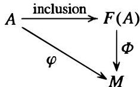

When $A$ is the finite set $\{a_1, a_2, \ldots, a_n\}$, $F(A) = Ra_1 \oplus Ra_2 \oplus \dots \oplus Ra_n \cong R^n$. (Compare: Section 6.3, free groups.)

**Proof:** Let $F(A) = \{0\}$ if $A = \emptyset$. If $A$ is nonempty let $F(A)$ be the collection of all set functions $f: A \to R$ such that $f(a) = 0$ for all but finitely many $a \in A$. Make

$F(A)$ into an $R$-module by pointwise addition of functions and pointwise multiplication of a ring element times a function, i.e.,

$$
\begin{array}{l}
(f + g)(a) = f(a) + g(a) \quad \text{and} \\
(rf)(a) = r(f(a)), \qquad \text{for all } a \in A, r \in R \text{ and } f, g \in F(A).
\end{array}
$$

It is an easy matter to check that all the $R$-module axioms hold (the details are omitted). Identify $A$ as a subset of $F(A)$ by $a \mapsto f_a$, where $f_a$ is the function which is 1 at $a$ and zero elsewhere. We can, in this way, think of $F(A)$ as all finite $R$-linear combinations of elements of $A$ by identifying each function $f$ with the sum $r_1a_1 + r_2a_2 + \dots + r_na_n$, where $f$ takes on the value $r_i$ at $a_i$ and is zero at all other elements of $A$. Moreover, each element of $F(A)$ has a unique expression as such a formal sum. To establish the universal property of $F(A)$ suppose $\varphi : A \to M$ is a map of the set $A$ into the $R$-module $M$. Define $\Phi : F(A) \to M$ by

$$
\Phi : \sum_{i=1}^{n} r_i a_i \mapsto \sum_{i=1}^{n} r_i \varphi(a_i).
$$

By the uniqueness of the expression for the elements of $F(A)$ as linear combinations of the $a_i$ we see easily that $\Phi$ is a well defined $R$-module homomorphism (the details are left as an exercise). By definition, the restriction of $\Phi$ to $A$ equals $\varphi$. Finally, since $F(A)$ is generated by $A$, once we know the values of an $R$-module homomorphism on $A$ it's values on every element of $F(A)$ are uniquely determined, so $\Phi$ is the unique extension of $\varphi$ to all of $F(A)$.

When $A$ is the finite set $\{a_1, a_2, \ldots, a_n\}$ Proposition 5(3) shows that $F(A) = Ra_1 \oplus Ra_2 \oplus \dots \oplus Ra_n$. Since $R \cong Ra_i$ for all $i$ (under the map $r \mapsto ra_i$) Proposition 5(1) shows that the direct sum is isomorphic to $R^n$.

## Corollary 7.

(1) If $F_1$ and $F_2$ are free modules on the same set $A$, there is a unique isomorphism between $F_1$ and $F_2$ which is the identity map on $A$.

(2) If $F$ is any free $R$-module with basis $A$, then $F \cong F(A)$. In particular, $F$ enjoys the same universal property with respect to $A$ as $F(A)$ does in Theorem 6.

**Proof:** Exercise.

If $F$ is a free $R$-module with basis $A$, we shall often (particularly in the case of vector spaces) define $R$-module homomorphisms from $F$ into other $R$-modules simply by specifying their values on the elements of $A$ and then saying "extend by linearity." Corollary 7(2) ensures that this is permissible.

When $R = \mathbb{Z}$, the free module on a set $A$ is called the free abelian group on $A$. If $|A| = n$, $F(A)$ is called the free abelian group of rank $n$ and is isomorphic to $\mathbb{Z} \oplus \dots \oplus \mathbb{Z}$ ($n$ times). These definitions agree with the ones given in Chapter 5.

# EXERCISES

In these exercises $R$ is a ring with 1 and $M$ is a left $R$-module.

1. Prove that if $A$ and $B$ are sets of the same cardinality, then the free modules $F(A)$ and $F(B)$ are isomorphic.

2. Assume $R$ is commutative. Prove that $R^n \cong R^m$ if and only if $n = m$, i.e., two free $R$-modules of finite rank are isomorphic if and only if they have the same rank. [Apply Exercise 12 of Section 2 with $I$ a maximal ideal of $R$. You may assume that if $F$ is a field, then $F^n \cong F^m$ if and only if $n = m$, i.e., two finite dimensional vector spaces over $F$ are isomorphic if and only if they have the same dimension — this will be proved later in Section 11.1.]

3. Show that the $F[x]$-modules in Exercises 18 and 19 of Section 1 are both cyclic.

4. An $R$-module $M$ is called a torsion module if for each $m \in M$ there is a nonzero element $r \in R$ such that $rm = 0$, where $r$ may depend on $m$ (i.e., $M = \operatorname{Tor}(M)$ in the notation of Exercise 8 of Section 1). Prove that every finite abelian group is a torsion $\mathbb{Z}$-module. Give an example of an infinite abelian group that is a torsion $\mathbb{Z}$-module.

5. Let $R$ be an integral domain. Prove that every finitely generated torsion $R$-module has a nonzero annihilator i.e., there is a nonzero element $r \in R$ such that $rm = 0$ for all $m \in M$ — here $r$ does not depend on $m$ (the annihilator of a module was defined in Exercise 9 of Section 1). Give an example of a torsion $R$-module whose annihilator is the zero ideal.

6. Prove that if $M$ is a finitely generated $R$-module that is generated by $n$ elements then every quotient of $M$ may be generated by $n$ (or fewer) elements. Deduce that quotients of cyclic modules are cyclic.

7. Let $N$ be a submodule of $M$. Prove that if both $M/N$ and $N$ are finitely generated then so is $M$.

8. Let $S$ be the collection of sequences $(a_1, a_2, a_3, \ldots)$ of integers $a_1, a_2, a_3, \ldots$ where all but finitely many of the $a_i$ are 0 (called the direct sum of infinitely many copies of $\mathbb{Z}$). Recall that $S$ is a ring under componentwise addition and multiplication and $S$ does not have a multiplicative identity — cf. Exercise 20, Section 7.1. Prove that $S$ is not finitely generated as a module over itself.

9. An $R$-module $M$ is called irreducible if $M \neq 0$ and if 0 and $M$ are the only submodules of $M$. Show that $M$ is irreducible if and only if $M \neq 0$ and $M$ is a cyclic module with any nonzero element as generator. Determine all the irreducible $\mathbb{Z}$-modules.

10. Assume $R$ is commutative. Show that an $R$-module $M$ is irreducible if and only if $M$ is isomorphic (as an $R$-module) to $R/I$ where $I$ is a maximal ideal of $R$. [By the previous exercise, if $M$ is irreducible there is a natural map $R \to M$ defined by $r \mapsto rm$, where $m$ is any fixed nonzero element of $M$.]

11. Show that if $M_1$ and $M_2$ are irreducible $R$-modules, then any nonzero $R$-module homomorphism from $M_1$ to $M_2$ is an isomorphism. Deduce that if $M$ is irreducible then $\operatorname{End}_R(M)$ is a division ring (this result is called Schur's Lemma). [Consider the kernel and the image.]

12. Let $R$ be a commutative ring and let $A, B$ and $M$ be $R$-modules. Prove the following isomorphisms of $R$-modules:

(a) $\operatorname{Hom}_R(A \times B, M) \cong \operatorname{Hom}_R(A, M) \times \operatorname{Hom}_R(B, M)$
(b) $\operatorname{Hom}_R(M, A \times B) \cong \operatorname{Hom}_R(M, A) \times \operatorname{Hom}_R(M, B).$

13. Let $R$ be a commutative ring and let $F$ be a free $R$-module of finite rank. Prove the following isomorphism of $R$-modules: $\operatorname{Hom}_R(F, R) \cong F$.

14. Let $R$ be a commutative ring and let $F$ be the free $R$-module of rank $n$. Prove that $\operatorname{Hom}_R(F, M) \cong M \times \cdots \times M$ ($n$ times). [Use Exercise 9 in Section 2 and Exercise 12.]

15. An element $e \in R$ is called a central idempotent if $e^2 = e$ and $er = re$ for all $r \in R$. If $e$ is a central idempotent in $R$, prove that $M = eM \oplus (1 - e)M$. [Recall Exercise 14 in Section 1.]

The next two exercises establish the Chinese Remainder Theorem for modules (cf. Section 7.6).

16. For any ideal $I$ of $R$ let $IM$ be the submodule defined in Exercise 5 of Section 1. Let $A_1, \ldots, A_k$ be any ideals in the ring $R$. Prove that the map

$$
M \to M / A _ {1} M \times \dots \times M / A _ {k} M \quad \text{defined by} \quad m \mapsto (m + A _ {1} M, \dots , m + A _ {k} M)
$$

is an $R$-module homomorphism with kernel $A_{1}M \cap A_{2}M \cap \dots \cap A_{k}M$.

17. In the notation of the preceding exercise, assume further that the ideals $A_{1}, \ldots, A_{k}$ are pairwise comaximal (i.e., $A_{i} + A_{j} = R$ for all $i \neq j$). Prove that

$$
M / \left(A _ {1} \dots A _ {k}\right) M \cong M / A _ {1} M \times \dots \times M / A _ {k} M.
$$

[See the proof of the Chinese Remainder Theorem for rings in Section 7.6.]

18. Let $R$ be a Principal Ideal Domain and let $M$ be an $R$-module that is annihilated by the nonzero, proper ideal $(a)$. Let $a = p_1^{\alpha_1}p_2^{\alpha_2}\dots p_k^{\alpha_k}$ be the unique factorization of $a$ into distinct prime powers in $R$. Let $M_i$ be the annihilator of $p_i^{\alpha_i}$ in $M$, i.e., $M_i$ is the set $\{m \in M \mid p_i^{\alpha_i}m = 0\}$ — called the $p_i$-primary component of $M$. Prove that

$$
M = M _ {1} \oplus M _ {2} \oplus \dots \oplus M _ {k}.
$$

19. Show that if $M$ is a finite abelian group of order $a = p_1^{\alpha_1}p_2^{\alpha_2}\dots p_k^{\alpha_k}$ then, considered as a $\mathbb{Z}$-module, $M$ is annihilated by $(a)$, the $p_i$-primary component of $M$ is the unique Sylow $p_i$-subgroup of $M$ and $M$ is isomorphic to the direct product of its Sylow subgroups.

20. Let $I$ be a nonempty index set and for each $i \in I$ let $M_i$ be an $R$-module. The direct product of the modules $M_i$ is defined to be their direct product as abelian groups (cf. Exercise 15 in Section 5.1) with the action of $R$ componentwise multiplication. The direct sum of the modules $M_i$ is defined to be the restricted direct product of the abelian groups $M_i$ (cf. Exercise 17 in Section 5.1) with the action of $R$ componentwise multiplication. In other words, the direct sum of the $M_i$'s is the subset of the direct product, $\prod_{i \in I} M_i$, which consists of all elements $\prod_{i \in I} m_i$ such that only finitely many of the components $m_i$ are nonzero; the action of $R$ on the direct product or direct sum is given by $r \prod_{i \in I} m_i = \prod_{i \in I} r m_i$ (cf. Appendix I for the definition of Cartesian products of infinitely many sets). The direct sum will be denoted by $\oplus_{i \in I} M_i$.

(a) Prove that the direct product of the $M_{i}$'s is an $R$-module and the direct sum of the $M_{i}$'s is a submodule of their direct product.

(b) Show that if $R = \mathbb{Z}$, $I = \mathbb{Z}^+$ and $M_i$ is the cyclic group of order $i$ for each $i$, then the direct sum of the $M_i$'s is not isomorphic to their direct product. [Look at torsion.]

21. Let $I$ be a nonempty index set and for each $i \in I$ let $N_i$ be a submodule of $M$. Prove that the following are equivalent:

(i) the submodule of $M$ generated by all the $N_{i}$'s is isomorphic to the direct sum of the $N_{i}$'s

(ii) if $\{i_1, i_2, \ldots, i_k\}$ is any finite subset of $I$ then $N_{i_1} \cap (N_{i_2} + \dots + N_{i_k}) = 0$

(iii) if $\{i_1, i_2, \ldots, i_k\}$ is any finite subset of $I$ then $N_1 + \dots + N_k = N_1 \oplus \dots \oplus N_k$

(iv) for every element $x$ of the submodule of $M$ generated by the $N_i$'s there are unique elements $a_i \in N_i$ for all $i \in I$ such that all but a finite number of the $a_i$ are zero and $x$ is the (finite) sum of the $a_i$.

22. Let $R$ be a Principal Ideal Domain, let $M$ be a torsion $R$-module (cf. Exercise 4) and let $p$ be a prime in $R$ (do not assume $M$ is finitely generated, hence it need not have a nonzero annihilator — cf. Exercise 5). The $p$-primary component of $M$ is the set of all elements of $M$ that are annihilated by some positive power of $p$.

(a) Prove that the $p$-primary component is a submodule. [See Exercise 13 in Section 1.]
(b) Prove that this definition of $p$-primary component agrees with the one given in Exercise 18 when $M$ has a nonzero annihilator.
(c) Prove that $M$ is the (possibly infinite) direct sum of its $p$-primary components, as $p$ runs over all primes of $R$.

23. Show that any direct sum of free $R$-modules is free.

24. (An arbitrary direct product of free modules need not be free) For each positive integer $i$ let $M_i$ be the free $\mathbb{Z}$-module $\mathbb{Z}$, and let $M$ be the direct product $\prod_{i \in \mathbb{Z}^+} M_i$ (cf. Exercise 20). Each element of $M$ can be written uniquely in the form $(a_1, a_2, a_3, \ldots)$ with $a_i \in \mathbb{Z}$ for all $i$. Let $N$ be the submodule of $M$ consisting of all such tuples with only finitely many nonzero $a_i$. Assume $M$ is a free $\mathbb{Z}$-module with basis $\mathcal{B}$.

(a) Show that $N$ is countable.
(b) Show that there is some countable subset $\mathcal{B}_1$ of $\mathcal{B}$ such that $N$ is contained in the submodule, $N_1$, generated by $\mathcal{B}_1$. Show also that $N_1$ is countable.
(c) Let $\overline{M} = M / N_1$. Show that $\overline{M}$ is a free $\mathbb{Z}$-module. Deduce that if $\overline{x}$ is any nonzero element of $\overline{M}$ then there are only finitely many distinct positive integers $k$ such that $\overline{x} = k\overline{m}$ for some $m \in M$ (depending on $k$).
(d) Let $\mathcal{S} = \{(b_1, b_2, b_3, \ldots) \mid b_i = \pm i! \text{ for all } i\}$. Prove that $\mathcal{S}$ is uncountable. Deduce that there is some $s \in \mathcal{S}$ with $s \notin N_1$.
(e) Show that the assumption $M$ is free leads to a contradiction: By (d) we may choose $s \in \mathcal{S}$ with $s \notin N_1$. Show that for each positive integer $k$ there is some $m \in M$ with $\overline{s} = k\overline{m}$, contrary to (c). [Use the fact that $N \subseteq N_1$.]

25. In the construction of direct limits, Exercise 8 of Section 7.6, show that if all $A_i$ are $R$-modules and the maps $\rho_{ij}$ are $R$-module homomorphisms, then the direct limit $A = \varinjlim A_i$ may be given the structure of an $R$-module in a natural way such that the maps $\rho_i : A_i \to A$ are all $R$-module homomorphisms. Verify the corresponding universal property (part (e)) for $R$-module homomorphisms $\varphi_i : A_i \to C$ commuting with the $\rho_{ij}$.

26. Carry out the analysis of the preceding exercise corresponding to inverse limits to show that an inverse limit of $R$-modules is an $R$-module satisfying the appropriate universal property (cf. Exercise 10 of Section 7.6).

27. (Free modules over noncommutative rings need not have a unique rank) Let $M$ be the $\mathbb{Z}$-module $\mathbb{Z} \times \mathbb{Z} \times \cdots$ of Exercise 24 and let $R$ be its endomorphism ring, $R = \operatorname{End}_{\mathbb{Z}}(M)$ (cf. Exercises 29 and 30 in Section 7.1). Define $\varphi_1, \varphi_2 \in R$ by

$$
\varphi_ {1} \left(a _ {1}, a _ {2}, a _ {3}, \dots\right) = \left(a _ {1}, a _ {3}, a _ {5}, \dots\right)
$$

$$
\varphi_ {2} \left(a _ {1}, a _ {2}, a _ {3}, \dots\right) = \left(a _ {2}, a _ {4}, a _ {6}, \dots\right)
$$

(a) Prove that $\{\varphi_1, \varphi_2\}$ is a free basis of the left $R$-module $R$. [Define the maps $\psi_1$ and $\psi_2$ by $\psi_1(a_1, a_2, \ldots) = (a_1, 0, a_2, 0, \ldots)$ and $\psi_2(a_1, a_2, \ldots) = (0, a_1, 0, a_2, \ldots)$. Verify that $\varphi_i \psi_i = 1$, $\varphi_1 \psi_2 = 0 = \varphi_2 \psi_1$ and $\psi_1 \varphi_1 + \psi_2 \varphi_2 = 1$. Use these relations to prove that $\varphi_1, \varphi_2$ are independent and generate $R$ as a left $R$-module.]
(b) Use (a) to prove that $R \cong R^2$ and deduce that $R \cong R^n$ for all $n \in \mathbb{Z}^+$.

# 10.4 TENSOR PRODUCTS OF MODULES

In this section we study the tensor product of two modules $M$ and $N$ over a ring (not necessarily commutative) containing 1. Formation of the tensor product is a general construction that, loosely speaking, enables one to form another module in which one can take "products" $mn$ of elements $m \in M$ and $n \in N$. The general construction involves various left- and right- module actions, and it is instructive, by way of motivation, to first consider an important special case: the question of "extending scalars" or "changing the base."

Suppose that the ring $R$ is a subring of the ring $S$. Throughout this section, we always assume that $1_R = 1_S$ (this ensures that $S$ is a unital $R$-module).

If $N$ is a left $S$-module, then $N$ can also be naturally considered as a left $R$-module since the elements of $R$ (being elements of $S$) act on $N$ by assumption. The $S$-module axioms for $N$ include the relations

$$
(s_1 + s_2)n = s_1n + s_2n \quad \text{and} \quad s(n_1 + n_2) = sn_1 + sn_2 \tag{10.1}
$$

for all $s, s_1, s_2 \in S$ and all $n, n_1, n_2 \in N$, and the relation

$$
(s_1s_2)n = s_1(s_2n) \quad \text{for all } s_1, s_2 \in S, \text{ and all } n \in N. \tag{10.2}
$$

A particular case of the latter relation is

$$
(sr)n = s(rn) \quad \text{for all } s \in S, r \in R \text{ and } n \in N. \tag{10.2'}
$$

More generally, if $f: R \to S$ is a ring homomorphism from $R$ into $S$ with $f(1_R) = 1_S$ (for example the injection map if $R$ is a subring of $S$ as above) then it is easy to see that $N$ can be considered as an $R$-module with $rn = f(r)n$ for $r \in R$ and $n \in N$. In this situation $S$ can be considered as an extension of the ring $R$ and the resulting $R$-module is said to be obtained from $N$ by restriction of scalars from $S$ to $R$.

Suppose now that $R$ is a subring of $S$ and we try to reverse this, namely we start with an $R$-module $N$ and attempt to define an $S$-module structure on $N$ that extends the action of $R$ on $N$ to an action of $S$ on $N$ (hence "extending the scalars" from $R$ to $S$). In general this is impossible, even in the simplest situation: the ring $R$ itself is an $R$-module but is usually not an $S$-module for the larger ring $S$. For example, $\mathbb{Z}$ is a $\mathbb{Z}$-module but it cannot be made into a $\mathbb{Q}$-module (if it could, then $\frac{1}{2} \circ 1 = z$ would be an element of $\mathbb{Z}$ with $z + z = 1$, which is impossible). Although $\mathbb{Z}$ itself cannot be made into a $\mathbb{Q}$-module it is contained in a $\mathbb{Q}$-module, namely $\mathbb{Q}$ itself. Put another way, there is an injection (also called an embedding) of the $\mathbb{Z}$-module $\mathbb{Z}$ into the $\mathbb{Q}$-module $\mathbb{Q}$ (and similarly the ring $R$ can always be embedded as an $R$-submodule of the $S$-module $S$). This raises the question of whether an arbitrary $R$-module $N$ can be embedded as an $R$-submodule of some $S$-module, or more generally, the question of what $R$-module homomorphisms exist from $N$ to $S$-modules. For example, suppose $N$ is a nontrivial finite abelian group, say $N = \mathbb{Z}/2\mathbb{Z}$, and consider possible $\mathbb{Z}$-module homomorphisms (i.e., abelian group homomorphisms) of $N$ into some $\mathbb{Q}$-module. A $\mathbb{Q}$-module is just a vector space over $\mathbb{Q}$ and every nonzero element in a vector space over $\mathbb{Q}$ has infinite (additive) order. Since every element of $N$ has finite order, every element of $N$ must map to 0 under such a homomorphism. In other words there are no nonzero $\mathbb{Z}$-module homomorphisms from this $N$ to any $\mathbb{Q}$-module, much less embeddings of $N$ identifying

$N$ as a submodule of a $\mathbb{Q}$-module. The two $\mathbb{Z}$-modules $\mathbb{Z}$ and $\mathbb{Z}/2\mathbb{Z}$ exhibit extremely different behaviors when we try to “extend scalars” from $\mathbb{Z}$ to $\mathbb{Q}$: the first module maps injectively into some $\mathbb{Q}$-module, the second always maps to 0 in a $\mathbb{Q}$-module.

We now construct for a general $R$-module $N$ an $S$-module that is the “best possible” target in which to try to embed $N$. We shall also see that this module determines all of the possible $R$-module homomorphisms of $N$ into $S$-modules, in particular determining when $N$ is contained in some $S$-module (cf. Corollary 9). In the case of $R = \mathbb{Z}$ and $S = \mathbb{Q}$ this construction will give us $\mathbb{Q}$ when applied to the module $N = \mathbb{Z}$, and will give us 0 when applied to the module $N = \mathbb{Z}/2\mathbb{Z}$ (Examples 2 and 3 following Corollary 9).

If the $R$-module $N$ were already an $S$-module then of course there is no difficulty in “extending” the scalars from $R$ to $S$, so we begin the construction by returning to the basic module axioms in order to examine whether we can define “products” of the form $sn$, for $s \in S$ and $n \in N$. These axioms start with an abelian group $N$ together with a map from $S \times N$ to $N$, where the image of the pair $(s, n)$ is denoted by $sn$. It is therefore natural to consider the free $\mathbb{Z}$-module (i.e., the free abelian group) on the set $S \times N$, i.e., the collection of all finite commuting sums of elements of the form $(s_i, n_i)$ where $s_i \in S$ and $n_i \in N$. This is an abelian group where there are no relations between any distinct pairs $(s, n)$ and $(s', n')$, i.e., no relations between the “formal products” $sn$, and in this abelian group the original module $N$ has been thoroughly distinguished from the new “coefficients” from $S$. To satisfy the relations necessary for an $S$-module structure imposed in equation (1) and the compatibility relation with the action of $R$ on $N$ in $(2')$, we must take the quotient of this abelian group by the subgroup $H$ generated by all elements of the form

$$
\begin{array}{l}
(s_1 + s_2, n) - (s_1, n) - (s_2, n), \\
(s, n_1 + n_2) - (s, n_1) - (s, n_2), \text{ and } \\
(sr, n) - (s, rn),
\end{array}
\tag{10.3}
$$

for $s, s_1, s_2 \in S$, $n, n_1, n_2 \in N$ and $r \in R$, where $rn$ in the last element refers to the $R$-module structure already defined on $N$.

The resulting quotient group is denoted by $S \otimes_R N$ (or just $S \otimes N$ if $R$ is clear from the context) and is called the tensor product of $S$ and $N$ over $R$. If $s \otimes n$ denotes the coset containing $(s, n)$ in $S \otimes_R N$ then by definition of the quotient we have forced the relations

$$
\begin{array}{l}
(s_1 + s_2) \otimes n = s_1 \otimes n + s_2 \otimes n, \\
s \otimes (n_1 + n_2) = s \otimes n_1 + s \otimes n_2, \text{ and } \\
sr \otimes n = s \otimes rn.
\end{array}
\tag{10.4}
$$

The elements of $S \otimes_R N$ are called tensors and can be written (non-uniquely in general) as finite sums of “simple tensors” of the form $s \otimes n$ with $s \in S$, $n \in N$.

We now show that the tensor product $S \otimes_R N$ is naturally a left $S$-module under the action defined by

$$
s \left(\sum_{\text{finite}} s_i \otimes n_i\right) = \sum_{\text{finite}} (s s_i) \otimes n_i.
\tag{10.5}
$$

We first check this is well defined, i.e., independent of the representation of the element of $S \otimes_R N$ as a sum of simple tensors. Note first that if $s'$ is any element of $S$ then

$$
\begin{array}{l}
(s'(s_1 + s_2), n) - (s's_1, n) - (s's_2, n) \left( = (s's_1 + s's_2, n) - (s's_1, n) - (s's_2, n) \right), \\
(s's, n_1 + n_2) - (s's, n_1) - (s's, n_2), \text{ and } \\
(s'(sr), n) - (s's, rn) \left( = ((s's)r, n) - (s's, rn) \right)
\end{array}
$$

each belongs to the set of generators in (3), so in particular each lies in the subgroup $H$. This shows that multiplying the first entries of the generators in (3) on the left by $s'$ gives another element of $H$ (in fact another generator). Since any element of $H$ is a sum of elements as in (3), it follows that for any element $\sum (s_i, n_i)$ in $H$ also $\sum (s's_i, n_i)$ lies in $H$. Suppose now that $\sum s_i \otimes n_i = \sum s_i' \otimes n_i'$ are two representations for the same element in $S \otimes_R N$. Then $\sum (s_i, n_i) - \sum (s_i', n_i')$ is an element of $H$, and by what we have just seen, for any $s \in S$ also $\sum (ss_i, n_i) - \sum (ss_i', n_i')$ is an element of $H$. But this means that $\sum ss_i \otimes n_i = \sum ss_i' \otimes n_i'$ in $S \otimes_R N$, so the expression in (5) is indeed well defined.

It is now straightforward using the relations in (4) to check that the action defined in (5) makes $S \otimes_R N$ into a left $S$-module. For example, on the simple tensor $s_i \otimes n_i$,

$$
\begin{array}{l}
(s + s') (s_i \otimes n_i) = ((s + s')s_i) \otimes n_i \quad \text{by definition (5)} \\
= (ss_i + s's_i) \otimes n_i \\
= ss_i \otimes n_i + s's_i \otimes n_i \quad \text{by the first relation in (4)} \\
= s (s_i \otimes n_i) + s' (s_i \otimes n_i) \quad \text{by definition (5)}.
\end{array}
$$

The module $S \otimes_R N$ is called the (left) $S$-module obtained by extension of scalars from the (left) $R$-module $N$.

There is a natural map $\iota : N \to S \otimes_R N$ defined by $n \mapsto 1 \otimes n$ (i.e., first map $n \in N$ to the element $(1, n)$ in the free abelian group and then pass to the quotient group). Since $1 \otimes rn = r \otimes n = r(1 \otimes n)$ by (4) and (5), it is easy to check that $\iota$ is an $R$-module homomorphism from $N$ to $S \otimes_R N$. Since we have passed to a quotient group, however, $\iota$ is not injective in general. Hence, while there is a natural $R$-module homomorphism from the original left $R$-module $N$ to the left $S$-module $S \otimes_R N$, in general $S \otimes_R N$ need not contain (an isomorphic copy of) $N$. On the other hand, the relations in equation (3) were the minimal relations that we had to impose in order to obtain an $S$-module, so it is reasonable to expect that the tensor product $S \otimes_R N$ is the "best possible" $S$-module to serve as target for an $R$-module homomorphism from $N$. The next theorem makes this more precise by showing that any other $R$-module homomorphism from $N$ factors through this one, and is referred to as the universal property for the tensor product $S \otimes_R N$. The analogous result for the general tensor product is given in Theorem 10.

Theorem 8. Let  $R$  be a subring of  $S$ , let  $N$  be a left  $R$ -module and let  $\iota : N \to S \otimes_R N$  be the  $R$ -module homomorphism defined by  $\iota(n) = 1 \otimes n$ . Suppose that  $L$  is any left  $S$ -module (hence also an  $R$ -module) and that  $\varphi : N \to L$  is an  $R$ -module homomorphism from  $N$  to  $L$ . Then there is a unique  $S$ -module homomorphism  $\Phi : S \otimes_R N \to L$  such that  $\varphi$  factors through  $\Phi$ , i.e.,  $\varphi = \Phi \circ \iota$  and the diagram

commutes. Conversely, if  $\Phi : S \otimes_R N \to L$  is an  $S$ -module homomorphism then  $\varphi = \Phi \circ \iota$  is an  $R$ -module homomorphism from  $N$  to  $L$ .

Proof: Suppose  $\varphi : N \to L$  is an  $R$ -module homomorphism to the  $S$ -module  $L$ . By the universal property of free modules (Theorem 6 in Section 3) there is a  $\mathbb{Z}$ -module homomorphism from the free  $\mathbb{Z}$ -module  $F$  on the set  $S \times N$  to  $L$  that sends each generator  $(s, n)$  to  $s\varphi(n)$ . Since  $\varphi$  is an  $R$ -module homomorphism, the generators of the subgroup  $H$  in equation (3) all map to zero in  $L$ . Hence this  $\mathbb{Z}$ -module homomorphism factors through  $H$ , i.e., there is a well-defined  $\mathbb{Z}$ -module homomorphism  $\Phi$  from  $F / H = S \otimes_R N$  to  $L$  satisfying  $\Phi(s \otimes n) = s\varphi(n)$ . Moreover, on simple tensors we have

$$
s ^ {\prime} \Phi (s \otimes n) = s ^ {\prime} (s \varphi (n)) = (s ^ {\prime} s) \varphi (n) = \Phi ((s ^ {\prime} s) \otimes n) = \Phi (s ^ {\prime} (s \otimes n)).
$$

for any  $s' \in S$ . Since  $\Phi$  is additive it follows that  $\Phi$  is an  $S$ -module homomorphism, which proves the existence statement of the theorem. The module  $S \otimes_R N$  is generated as an  $S$ -module by elements of the form  $1 \otimes n$ , so any  $S$ -module homomorphism is uniquely determined by its values on these elements. Since  $\Phi(1 \otimes n) = \varphi(n)$ , it follows that the  $S$ -module homomorphism  $\Phi$  is uniquely determined by  $\varphi$ , which proves the uniqueness statement of the theorem. The converse statement is immediate.

The universal property of  $S \otimes_R N$  in Theorem 8 shows that  $R$ -module homomorphisms of  $N$  into  $S$ -modules arise from  $S$ -module homomorphisms from  $S \otimes_R N$ . In particular this determines when it is possible to map  $N$  injectively into some  $S$ -module:

Corollary 9. Let  $\iota : N \to S \otimes_R N$  be the  $R$ -module homomorphism in Theorem 8. Then  $N / \ker \iota$  is the unique largest quotient of  $N$  that can be embedded in any  $S$ -module. In particular,  $N$  can be embedded as an  $R$ -submodule of some left  $S$ -module if and only if  $\iota$  is injective (in which case  $N$  is isomorphic to the  $R$ -submodule  $\iota(N)$  of the  $S$ -module  $S \otimes_R N$ ).

Proof: The quotient  $N / \ker \iota$  is mapped injectively (by  $\iota$ ) into the  $S$ -module  $S \otimes_R N$ . Suppose now that  $\varphi$  is an  $R$ -module homomorphism injecting the quotient  $N / \ker \varphi$  of  $N$  into an  $S$ -module  $L$ . Then, by Theorem 8,  $\ker \iota$  is mapped to 0 by  $\varphi$ , i.e.,  $\ker \iota \subseteq \ker \varphi$ . Hence  $N / \ker \varphi$  is a quotient of  $N / \ker \iota$  (namely, the quotient by the submodule  $\ker \varphi / \ker \iota$ ). It follows that  $N / \ker \iota$  is the unique largest quotient of  $N$  that can be embedded in any  $S$ -module. The last statement in the corollary follows immediately.

# Examples

(1) For any ring $R$ and any left $R$-module $N$ we have $R \otimes_R N \cong N$ (so "extending scalars from $R$ to $R$" does not change the module). This follows by taking $\varphi$ to be the identity map from $N$ to itself (and $S = R$) in Theorem 8: $\iota$ is then an isomorphism with inverse isomorphism given by $\Phi$. In particular, if $A$ is any abelian group (i.e., a $\mathbb{Z}$-module), then $\mathbb{Z} \otimes_{\mathbb{Z}} A = A$.

(2) Let $R = \mathbb{Z}$, $S = \mathbb{Q}$ and let $A$ be a finite abelian group of order $n$. In this case the $\mathbb{Q}$-module $\mathbb{Q} \otimes_{\mathbb{Z}} A$ obtained by extension of scalars from the $\mathbb{Z}$-module $A$ is 0. To see this, observe first that in any tensor product $1 \otimes 0 = 1 \otimes (0 + 0) = 1 \otimes 0 + 1 \otimes 0$, by the second relation in (4), so

$$
1 \otimes 0 = 0.
$$

Now, for any simple tensor $q \otimes a$ we can write the rational number $q$ as $(q / n)n$. Then since $na = 0$ in $A$ by Lagrange's Theorem, we have

$$
q \otimes a = \left(\frac {q}{n} \cdot n\right) \otimes a = \frac {q}{n} \otimes (n a) = (q / n) \otimes 0 = (q / n) (1 \otimes 0) = 0.
$$

It follows that $\mathbb{Q} \otimes_{\mathbb{Z}} A = 0$. In particular, the map $\iota : A \to S \otimes_R A$ is the zero map. By Theorem 8, we see again that any homomorphism of a finite abelian group into a rational vector space is the zero map. In particular, if $A$ is nontrivial, then the original $\mathbb{Z}$-module $A$ is not contained in the $\mathbb{Q}$-module obtained by extension of scalars.

(3) Extension of scalars for free modules: If $N \cong R^n$ is a free module of rank $n$ over $R$ then $S \otimes_R N \cong S^n$ is a free module of rank $n$ over $S$. We shall prove this shortly (Corollary 18) when we discuss tensor products of direct sums. For example, $\mathbb{Q} \otimes_{\mathbb{Z}} \mathbb{Z}^n \cong \mathbb{Q}^n$. In this case the module obtained by extension of scalars contains (an isomorphic copy of) the original $R$-module $N$. For example, $\mathbb{Q} \otimes_{\mathbb{Z}} \mathbb{Z}^n \cong \mathbb{Q}^n$ and $\mathbb{Z}^n$ is a subgroup of the abelian group $\mathbb{Q}^n$.

(4) Extension of scalars for vector spaces: As a special case of the previous example, let $F$ be a subfield of the field $K$ and let $V$ be an $n$-dimensional vector space over $F$ (i.e., $V \cong F^n$). Then $K \otimes_F V \cong K^n$ is a vector space over the larger field $K$ of the same dimension, and the original vector space $V$ is contained in $K \otimes_F V$ as an $F$-vector subspace.

(5) Induced modules for finite groups: Let $R$ be a commutative ring with 1, let $G$ be a finite group and let $H$ be a subgroup of $G$. As in Section 7.2 we may form the group ring $RG$ and its subring $RH$. For any $RH$-module $N$ define the induced module $RG \otimes_{RH} N$. In this way we obtain an $RG$-module for each $RH$-module $N$. We shall study properties of induced modules and some of their important applications to group theory in Chapters 17 and 19.

The general tensor product construction follows along the same lines as the extension of scalars above, but before describing it we make two observations from this special case. The first is that the construction of $S \otimes_R N$ as an abelian group involved only the elements in equation (3), which in turn only required $S$ to be a right $R$-module and $N$ to be a left $R$-module. In a similar way we shall construct an abelian group $M \otimes_R N$ for any right $R$-module $M$ and any left $R$-module $N$. The second observation is that the $S$-module structure on $S \otimes_R N$ defined by equation (5) required only a left $S$-module structure on $S$ together with a "compatibility relation"

$$
s ^ {\prime} (s r) = (s ^ {\prime} s) r \qquad \mathrm {f o r} s, s ^ {\prime} \in S, r \in R,
$$

between this left $S$-module structure and the right $R$-module structure on $S$ (this was needed in order to deduce that (5) was well defined). We first consider the general construction of $M \otimes_R N$ as an abelian group, after which we shall return to the question of when this abelian group can be given a module structure.

Suppose then that $N$ is a left $R$-module and that $M$ is a right $R$-module. The quotient of the free $\mathbb{Z}$-module on the set $M \times N$ by the subgroup generated by all elements of the form

$$
\begin{array}{l}
(m_1 + m_2, n) - (m_1, n) - (m_2, n), \\
(m, n_1 + n_2) - (m, n_1) - (m, n_2), \text{ and} \\
(mr, n) - (m, rn),
\end{array}
\tag{10.6}
$$

for $m, m_1, m_2 \in M, n, n_1, n_2 \in N$ and $r \in R$ is an abelian group, denoted by $M \otimes_R N$, or simply $M \otimes N$ if the ring $R$ is clear from the context, and is called the tensor product of $M$ and $N$ over $R$. The elements of $M \otimes_R N$ are called tensors, and the coset, $m \otimes n$, of $(m, n)$ in $M \otimes_R N$ is called a simple tensor. We have the relations

$$
\begin{array}{l}
(m_1 + m_2) \otimes n = m_1 \otimes n + m_2 \otimes n, \\
m \otimes (n_1 + n_2) = m \otimes n_1 + m \otimes n_2, \text{ and} \\
mr \otimes n = m \otimes rn.
\end{array}
\tag{10.7}
$$

Every tensor can be written (non-uniquely in general) as a finite sum of simple tensors.

**Remark:** We emphasize that care must be taken when working with tensors, since each $m \otimes n$ represents a coset in some quotient group, and so we may have $m \otimes n = m' \otimes n'$ where $m \neq m'$ or $n \neq n'$. More generally, an element of $M \otimes N$ may be expressible in many different ways as a sum of simple tensors. In particular, care must be taken when defining maps from $M \otimes_R N$ to another group or module, since a map from $M \otimes N$ which is described on the generators $m \otimes n$ in terms of $m$ and $n$ is not well defined unless it is shown to be independent of the particular choice of $m \otimes n$ as a coset representative.

Another point where care must be exercised is in reference to the element $m \otimes n$ when the modules $M$ and $N$ or the ring $R$ are not clear from the context. The first two examples of extension of scalars give an instance where $M$ is a submodule of a larger module $M'$, and for some $m \in M$ and $n \in N$ we have $m \otimes n = 0$ in $M' \otimes_R N$ but $m \otimes n$ is nonzero in $M \otimes_R N$. This is possible because the symbol “$m \otimes n$” represents different cosets, hence possibly different elements, in the two tensor products. In particular, these two examples show that $M \otimes_R N$ need not be a subgroup of $M' \otimes_R N$ even when $M$ is a submodule of $M'$ (cf. also Exercise 2).

Mapping $M \times N$ to the free $\mathbb{Z}$-module on $M \times N$ and then passing to the quotient defines a map $\iota: M \times N \to M \otimes_R N$ with $\iota(m, n) = m \otimes n$. This map is in general not a group homomorphism, but it is additive in both $m$ and $n$ separately and satisfies $\iota(mr, n) = mr \otimes n = m \otimes rn = \iota(m, rn)$. Such maps are given a name:

Definition. Let $M$ be a right $R$-module, let $N$ be a left $R$-module and let $L$ be an abelian group (written additively). A map $\varphi : M \times N \to L$ is called $R$-balanced or middle linear with respect to $R$ if

$$
\varphi(m_1 + m_2, n) = \varphi(m_1, n) + \varphi(m_2, n)
$$

$$
\varphi(m, n_1 + n_2) = \varphi(m, n_1) + \varphi(m, n_2)
$$

$$
\varphi(m, rn) = \varphi(mr, n)
$$

for all $m, m_1, m_2 \in M$, $n, n_1, n_2 \in N$, and $r \in R$.

With this terminology, it follows immediately from the relations in (7) that the map $\iota : M \times N \to M \otimes_R N$ is $R$-balanced. The next theorem proves the extremely useful universal property of the tensor product with respect to balanced maps.

Theorem 10. Suppose $R$ is a ring with 1, $M$ is a right $R$-module, and $N$ is a left $R$-module. Let $M \otimes_R N$ be the tensor product of $M$ and $N$ over $R$ and let $\iota : M \times N \to M \otimes_R N$ be the $R$-balanced map defined above.

(1) If $\Phi : M \otimes_R N \to L$ is any group homomorphism from $M \otimes_R N$ to an abelian group $L$ then the composite map $\varphi = \Phi \circ \iota$ is an $R$-balanced map from $M \times N$ to $L$.

(2) Conversely, suppose $L$ is an abelian group and $\varphi : M \times N \to L$ is any $R$-balanced map. Then there is a unique group homomorphism $\Phi : M \otimes_R N \to L$ such that $\varphi$ factors through $\iota$, i.e., $\varphi = \Phi \circ \iota$ as in (1).

Equivalently, the correspondence $\varphi \leftrightarrow \Phi$ in the commutative diagram

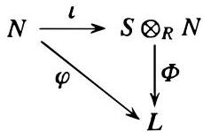

establishes a bijection

$$
\left\{ \begin{array}{l} R\text{-balanced maps} \\ \varphi : M \times N \to L \end{array} \right\} \longleftrightarrow \left\{ \begin{array}{c} \text{group homomorphisms} \\ \Phi : M \otimes_R N \to L \end{array} \right\}.
$$

Proof: The proof of (1) is immediate from the properties of $\iota$ above. For (2), the map $\varphi$ defines a unique $\mathbb{Z}$-module homomorphism $\tilde{\varphi}$ from the free group on $M \times N$ to $L$ (Theorem 6 in Section 3) such that $\tilde{\varphi}(m, n) = \varphi(m, n) \in L$. Since $\varphi$ is $R$-balanced, $\tilde{\varphi}$ maps each of the elements in equation (6) to 0; for example

$$
\tilde{\varphi} \left((mr, n) - (m, rn)\right) = \varphi(mr, n) - \varphi(m, rn) = 0.
$$

It follows that the kernel of $\tilde{\varphi}$ contains the subgroup generated by these elements, hence $\tilde{\varphi}$ induces a homomorphism $\Phi$ on the quotient group $M \otimes_R N$ to $L$. By definition we then have

$$
\Phi(m \otimes n) = \tilde{\varphi}(m, n) = \varphi(m, n),
$$

i.e., $\varphi = \Phi \circ \iota$. The homomorphism $\Phi$ is uniquely determined by this equation since the elements $m \otimes n$ generate $M \otimes_R N$ as an abelian group. This completes the proof.

Theorem 10 is extremely useful in defining homomorphisms on $M \otimes_R N$ since it replaces the often tedious check that maps defined on simple tensors $m \otimes n$ are well defined with a check that a related map defined on ordered pairs $(m, n)$ is balanced.

The first consequence of the universal property in Theorem 10 is a characterization of the tensor product $M \otimes_R N$ as an abelian group:

**Corollary 11.** Suppose $D$ is an abelian group and $\iota': M \times N \to D$ is an $R$-balanced map such that

(i) the image of $\iota'$ generates $D$ as an abelian group, and
(ii) every $R$-balanced map defined on $M \times N$ factors through $\iota'$ as in Theorem 10. Then there is an isomorphism $f: M \otimes_R N \cong D$ of abelian groups with $\iota' = f \circ \iota$.

*Proof:* Since $\iota': M \times N \to D$ is a balanced map, the universal property in (2) of Theorem 10 implies there is a (unique) homomorphism $f: M \otimes_R N \to D$ with $\iota' = f \circ \iota$. In particular $\iota'(m, n) = f(m \otimes n)$ for every $m \in M$, $n \in N$. By the first assumption on $\iota'$, these elements generate $D$ as an abelian group, so $f$ is a surjective map. Now, the balanced map $\iota: M \times N \to M \otimes_R N$ together with the second assumption on $\iota'$ implies there is a (unique) homomorphism $g: D \to M \otimes_R N$ with $\iota = g \circ \iota'$. Then $m \otimes n = (g \circ f)(m \otimes n)$. Since the simple tensors $m \otimes n$ generate $M \otimes_R N$, it follows that $g \circ f$ is the identity map on $M \otimes_R N$ and so $f$ is injective, hence an isomorphism. This establishes the corollary.

We now return to the question of giving the abelian group $M \otimes_R N$ a *module* structure. As we observed in the special case of extending scalars from $R$ to $S$ for the $R$-module $N$, the $S$-module structure on $S \otimes_R N$ required only a left $S$-module structure on $S$ together with the compatibility relation $s'(sr) = (s's)r$ for $s, s' \in S$ and $r \in R$. In this special case this relation was simply a consequence of the associative law in the ring $S$. To obtain an $S$-module structure on $M \otimes_R N$ more generally we impose a similar structure on $M$:

**Definition.** Let $R$ and $S$ be any rings with 1. An abelian group $M$ is called an $(S, R)$-bimodule if $M$ is a left $S$-module, a right $R$-module, and $s(mr) = (sm)r$ for all $s \in S$, $r \in R$ and $m \in M$.

**Examples**

(1) Any ring $S$ is an $(S, R)$-bimodule for any subring $R$ with $1_R = 1_S$ by the associativity of the multiplication in $S$. More generally, if $f: R \to S$ is any ring homomorphism with $f(1_R) = 1_S$ then $S$ can be considered as a right $R$-module with the action $s \cdot r = sf(r)$, and with respect to this action $S$ becomes an $(S, R)$-bimodule.
(2) Let $I$ be an ideal (two-sided) in the ring $R$. Then the quotient ring $R / I$ is an $(R / I, R)$-bimodule. This is easy to see directly and is also a special case of the previous example (with respect to the canonical projection homomorphism $R \to R / I$).
(3) Suppose that $R$ is a commutative ring. Then a left (respectively, right) $R$-module $M$ can always be given the structure of a right (respectively, left) $R$-module by defining $mr = rm$ (respectively, $rm = mr$), for all $m \in M$ and $r \in R$, and this makes $M$ into

an $(R, R)$-bimodule. Hence every module (right or left) over a commutative ring $R$ has at least one natural $(R, R)$-bimodule structure.

(4) Suppose that $M$ is a left $S$-module and $R$ is a subring contained in the center of $S$ (for example, if $S$ is commutative). Then in particular $R$ is commutative so $M$ can be given a right $R$-module structure as in the previous example. Then for any $s \in S$, $r \in R$ and $m \in M$ by definition of the right action of $R$ we have

$$
(s m) r = r (s m) = (r s) m = (s r) m = s (r m) = s (m r)
$$

(note that we have used the fact that $r$ commutes with $s$ in the middle equality). Hence $M$ is an $(S, R)$-bimodule with respect to this definition of the right action of $R$.

Since the situation in Example 3 occurs so frequently, we give this bimodule structure a name:

**Definition.** Suppose $M$ is a left (or right) $R$-module over the commutative ring $R$. Then the $(R, R)$-bimodule structure on $M$ defined by letting the left and right $R$-actions coincide, i.e., $mr = rm$ for all $m \in M$ and $r \in R$, will be called the standard $R$-module structure on $M$.

Suppose now that $N$ is a left $R$-module and $M$ is an $(S, R)$-bimodule. Then just as in the example of extension of scalars the $(S, R)$-bimodule structure on $M$ implies that

$$
s \left(\sum_{\text{finite}} m_i \otimes n_i\right) = \sum_{\text{finite}} (s m_i) \otimes n_i \tag{10.8}
$$

gives a well defined action of $S$ under which $M \otimes_R N$ is a left $S$-module. Note that Theorem 10 may be used to give an alternate proof that (8) is well defined, replacing the direct calculations on the relations defining the tensor product with the easier check that a map is $R$-balanced, as follows. It is very easy to see that for each fixed $s \in S$ the map $(m, n) \mapsto sm \otimes n$ is an $R$-balanced map from $M \times N$ to $M \otimes_R N$. By Theorem 10 there is a well defined group homomorphism $\lambda_s$ from $M \otimes_R N$ to itself such that $\lambda_s(m \otimes n) = sm \otimes n$. Since the right side of (8) is then $\lambda_s(\sum m_i \otimes n_i)$, the fact that $\lambda_s$ is well defined shows that this expression is indeed independent of the representation of the tensor $\sum m_i \otimes n_i$ as a sum of simple tensors. Because $\lambda_s$ is additive, equation (8) holds.

By a completely parallel argument, if $M$ is a right $R$-module and $N$ is an $(R, S)$-bimodule then the tensor product $M \otimes_R N$ has the structure of a right $S$-module, where $(\sum m_i \otimes n_i) s = \sum m_i \otimes (n_i s)$.

Before giving some more examples of tensor products it is worthwhile to highlight one frequently encountered special case of the previous discussion, namely the case when $M$ and $N$ are two left modules over a commutative ring $R$ and $S = R$ (in some works on tensor products this is the only case considered). Then the standard $R$-module structure on $M$ defined previously gives $M$ the structure of an $(R, R)$-bimodule, so in this case the tensor product $M \otimes_R N$ always has the structure of a left $R$-module.

The corresponding map $\iota : M \times N \to M \otimes_R N$ maps $M \times N$ into an $R$-module and is additive in each factor. Since $r(m \otimes n) = rm \otimes n = mr \otimes n = m \otimes rn$ it also satisfies

$$
r \iota (m, n) = \iota (r m, n) = \iota (m, r n).
$$

Such maps are given a name:

**Definition.** Let $R$ be a commutative ring with 1 and let $M, N,$ and $L$ be left $R$-modules. The map $\varphi : M \times N \to L$ is called $R$-bilinear if it is $R$-linear in each factor, i.e., if

$$
\varphi \left(r _ {1} m _ {1} + r _ {2} m _ {2}, n\right) = r _ {1} \varphi \left(m _ {1}, n\right) + r _ {2} \varphi \left(m _ {2}, n\right), \quad \text{and}
$$

$$
\varphi (m, r _ {1} n _ {1} + r _ {2} n _ {2}) = r _ {1} \varphi (m, n _ {1}) + r _ {2} \varphi (m, n _ {2})
$$

for all $m, m_1, m_2 \in M, n, n_1, n_2 \in N$ and $r_1, r_2 \in R$.

With this terminology Theorem 10 gives

**Corollary 12.** Suppose $R$ is a commutative ring. Let $M$ and $N$ be two left $R$-modules and let $M \otimes_R N$ be the tensor product of $M$ and $N$ over $R$, where $M$ is given the standard $R$-module structure. Then $M \otimes_R N$ is a left $R$-module with

$$
r (m \otimes n) = (r m) \otimes n = (m r) \otimes n = m \otimes (r n),
$$

and the map $\iota : M \times N \to M \otimes_R N$ with $\iota(m, n) = m \otimes n$ is an $R$-bilinear map. If $L$ is any left $R$-module then there is a bijection

$$
\left\{ \begin{array}{c} R\text{-bilinear maps} \\ \varphi : M \times N \to L \end{array} \right\} \longleftrightarrow \left\{ \begin{array}{c} R\text{-module homomorphisms} \\ \Phi : M \otimes_ {R} N \to L \end{array} \right\}
$$

where the correspondence between $\varphi$ and $\varPhi$ is given by the commutative diagram

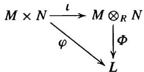

**Proof:** We have shown $M \otimes_R N$ is an $R$-module and that $\iota$ is bilinear. It remains only to check that in the bijective correspondence in Theorem 10 the bilinear maps correspond with the $R$-module homomorphisms. If $\varphi : M \times N \to L$ is bilinear then it is an $R$-balanced map, so the corresponding $\Phi : M \otimes_R N$ is a group homomorphism. Moreover, on simple tensors $\Phi((rm) \otimes n) = \varphi(rm, n) = r\varphi(m, n) = r\Phi(m \otimes n)$, where the middle equality holds because $\varphi$ is $R$-linear in the first variable. Since $\Phi$ is additive this extends to sums of simple tensors to show $\Phi$ is an $R$-module homomorphism. Conversely, if $\Phi$ is an $R$-module homomorphism it is an exercise to see that the corresponding balanced map $\varphi$ is bilinear.

## Examples

(1) In any tensor product $M \otimes_R N$ we have $m \otimes 0 = m \otimes (0 + 0) = (m \otimes 0) + (m \otimes 0)$, so $m \otimes 0 = 0$. Likewise $0 \otimes n = 0$.

(2) We have $\mathbb{Z} / 2\mathbb{Z}\otimes_{\mathbb{Z}}\mathbb{Z} / 3\mathbb{Z} = 0$, since $3a = a$ for $a\in \mathbb{Z} / 2\mathbb{Z}$ so that

$$
a \otimes b = 3 a \otimes b = a \otimes 3 b = a \otimes 0 = 0
$$

and every simple tensor is reduced to 0. In particular $1 \otimes 1 = 0$. It follows that there are no nonzero balanced (or bilinear) maps from $\mathbb{Z}/2\mathbb{Z} \times \mathbb{Z}/3\mathbb{Z}$ to any abelian group.

On the other hand, consider the tensor product $\mathbb{Z}/2\mathbb{Z} \otimes_{\mathbb{Z}} \mathbb{Z}/2\mathbb{Z}$, which is generated as an abelian group by the elements $0 \otimes 0 = 1 \otimes 0 = 0 \otimes 1 = 0$ and $1 \otimes 1$. In this case $1 \otimes 1 \neq 0$ since, for example, the map $\mathbb{Z}/2\mathbb{Z} \times \mathbb{Z}/2\mathbb{Z} \to \mathbb{Z}/2\mathbb{Z}$ defined by $(a, b) \mapsto ab$ is clearly nonzero and linear in both $a$ and $b$. Since $2(1 \otimes 1) = 2 \otimes 1 = 0 \otimes 1 = 0$, the element $1 \otimes 1$ is of order 2. Hence $\mathbb{Z}/2\mathbb{Z} \otimes_{\mathbb{Z}} \mathbb{Z}/2\mathbb{Z} \cong \mathbb{Z}/2\mathbb{Z}$.

(3) In general,

$$
\mathbb{Z}/m\mathbb{Z} \otimes_{\mathbb{Z}} \mathbb{Z}/n\mathbb{Z} \cong \mathbb{Z}/d\mathbb{Z},
$$

where $d$ is the g.c.d. of the integers $m$ and $n$. To see this, observe first that

$$
a \otimes b = a \otimes (b \cdot 1) = (ab) \otimes 1 = ab(1 \otimes 1),
$$

from which it follows that $\mathbb{Z}/m\mathbb{Z} \otimes_{\mathbb{Z}} \mathbb{Z}/n\mathbb{Z}$ is a cyclic group with $1 \otimes 1$ as generator. Since $m(1 \otimes 1) = m \otimes 1 = 0 \otimes 1 = 0$ and similarly $n(1 \otimes 1) = 1 \otimes n = 0$, we have $d(1 \otimes 1) = 0$, so the cyclic group has order dividing $d$. The map $\varphi: \mathbb{Z}/m\mathbb{Z} \times \mathbb{Z}/n\mathbb{Z} \to \mathbb{Z}/d\mathbb{Z}$ defined by $\varphi(a \bmod m, b \bmod n) = ab \bmod d$ is well defined since $d$ divides both $m$ and $n$. It is clearly $\mathbb{Z}$-bilinear. The induced map $\Phi: \mathbb{Z}/m\mathbb{Z} \otimes_{\mathbb{Z}} \mathbb{Z}/n\mathbb{Z} \to \mathbb{Z}/d\mathbb{Z}$ from Corollary 12 maps $1 \otimes 1$ to the element $1 \in \mathbb{Z}/d\mathbb{Z}$, which is an element of order $d$. In particular $\mathbb{Z}/m\mathbb{Z} \otimes_{\mathbb{Z}} \mathbb{Z}/n\mathbb{Z}$ has order at least $d$. Hence $1 \otimes 1$ is an element of order $d$ and $\Phi$ gives an isomorphism $\mathbb{Z}/m\mathbb{Z} \otimes_{\mathbb{Z}} \mathbb{Z}/n\mathbb{Z} \cong \mathbb{Z}/d\mathbb{Z}$.

(4) In $\mathbb{Q}/\mathbb{Z} \otimes_{\mathbb{Z}} \mathbb{Q}/\mathbb{Z}$ a simple tensor has the form $(a/b \bmod \mathbb{Z}) \otimes (c/d \bmod \mathbb{Z})$ for some rational numbers $a/b$ and $c/d$. Then

$$
\begin{aligned}
(\frac{a}{b} \bmod \mathbb{Z}) &\otimes (\frac{c}{d} \bmod \mathbb{Z}) = d(\frac{a}{bd} \bmod \mathbb{Z}) \otimes (\frac{c}{d} \bmod \mathbb{Z}) \\
&= (\frac{a}{bd} \bmod \mathbb{Z}) \otimes d(\frac{c}{d} \bmod \mathbb{Z}) = (\frac{a}{bd} \bmod \mathbb{Z}) \otimes 0 = 0
\end{aligned}
$$

and so

$$
\mathbb{Q}/\mathbb{Z} \otimes_{\mathbb{Z}} \mathbb{Q}/\mathbb{Z} = 0.
$$

In a similar way, $A \otimes_{\mathbb{Z}} B = 0$ for any divisible abelian group $A$ and torsion abelian group $B$ (an abelian group in which every element has finite order). For example

$$
\mathbb{Q} \otimes_{\mathbb{Z}} \mathbb{Q}/\mathbb{Z} = 0.
$$

(5) The structure of a tensor product can vary considerably depending on the ring over which the tensors are taken. For example $\mathbb{Q} \otimes_{\mathbb{Q}} \mathbb{Q}$ and $\mathbb{Q} \otimes_{\mathbb{Z}} \mathbb{Q}$ are isomorphic as left $\mathbb{Q}$-modules (both are one dimensional vector spaces over $\mathbb{Q}$) — cf. the exercises. On the other hand we shall see at the end of this section that $\mathbb{C} \otimes_{\mathbb{C}} \mathbb{C}$ and $\mathbb{C} \otimes_{\mathbb{R}} \mathbb{C}$ are not isomorphic $\mathbb{C}$-modules (the former is a 1-dimensional vector space over $\mathbb{C}$ and the latter is 2-dimensional over $\mathbb{C}$).

(6) General extension of scalars or change of base: Let $f: R \to S$ be a ring homomorphism with $f(1_R) = 1_S$. Then $s \cdot r = sf(r)$ gives $S$ the structure of a right $R$-module with respect to which $S$ is an $(S, R)$-bimodule. Then for any left $R$-module $N$, the resulting tensor product $S \otimes_R N$ is a left $S$-module obtained by changing the base from $R$ to $S$. This gives a slight generalization of the notion of extension of scalars (where $R$ was a subring of $S$).

(7) Let $f: R \to S$ be a ring homomorphism as in the preceding example. Then we have $S \otimes_R R \cong S$ as left $S$-modules, as follows. The map $\varphi: S \times R \to S$ defined by $(s, r) \mapsto sr$ (where $sr = sf(r)$ by definition of the right $R$-action on $S$), is an $R$-balanced map, as is easily checked. For example,

$$
\varphi(s_1 + s_2, r) = (s_1 + s_2)r = s_1r + s_2r = \varphi(s_1, r) + \varphi(s_2, r)
$$

10.4 Tensor Products of Modules

and

$$
\varphi(sr, r') = (sr)r' = s(rr') = \varphi(s, rr').
$$

By Theorem 10 we have an associated group homomorphism $\Phi : S \otimes_R R \to S$ with $\Phi(s \otimes r) = sr$. Since $\Phi(s'(s \otimes r)) = \Phi(s's \otimes r) = s'sr = s'\Phi(s \otimes r)$, it follows that $\Phi$ is also an $S$-module homomorphism. The map $\Phi': S \to S \otimes_R R$ with $s \mapsto s \otimes 1$ is an $S$-module homomorphism that is inverse to $\Phi$ because $\Phi \circ \Phi'(s) = \Phi(s \otimes 1) = s$ gives $\Phi\Phi' = 1$, and

$$
\Phi' \circ \Phi(s \otimes r) = \Phi'(sr) = sr \otimes 1 = s \otimes r
$$

shows that $\Phi'\Phi$ is the identity on simple tensors, hence $\Phi'\Phi = 1$.

(8) Let $R$ be a ring (not necessarily commutative), let $I$ be a two-sided ideal in $R$, and let $N$ be a left $R$-module. Then as previously mentioned, $R/I$ is an $(R/I, R)$-bimodule, so the tensor product $R/I \otimes_R N$ is a left $R/I$-module. This is an example of “extension of scalars” with respect to the natural projection homomorphism $R \to R/I$.

Define

$$
IN = \left\{\sum_{\text{finite}} a_i n_i \mid a_i \in I, n_i \in N \right\},
$$

which is easily seen to be a left $R$-submodule of $N$ (cf. Exercise 5, Section 1). Then

$$
(R/I) \otimes_R N \cong N/IN,
$$

as left $R$-modules, as follows. The tensor product is generated as an abelian group by the simple tensors $(r \bmod I) \otimes n = r(1 \otimes n)$ for $r \in R$ and $n \in N$ (viewing the $R/I$-module tensor product as an $R$-module on which $I$ acts trivially). Hence the elements $1 \otimes n$ generate $(R/I) \otimes_R N$ as an $R/I$-module. The map $N \to (R/I) \otimes_R N$ defined by $n \mapsto 1 \otimes n$ is a left $R$-module homomorphism and, by the previous observation, is surjective. Under this map $a_i n_i$ with $a_i \in I$ and $n_i \in N$ maps to $1 \otimes a_i n_i = a_i \otimes n_i = 0$, and so $IN$ is contained in the kernel. This induces a surjective $R$-module homomorphism $f: N/IN \to (R/I) \otimes_R N$ with $f(n \bmod I) = 1 \otimes n$. We show $f$ is an isomorphism by exhibiting its inverse. The map $(R/I) \times N \to N/IN$ defined by mapping $(r \bmod I, n)$ to $(rn \bmod IN)$ is well defined and easily checked to be $R$-balanced. It follows by Theorem 10 that there is an associated group homomorphism $g: (R/I) \otimes N \to N/IN$ with $g((r \bmod I) \otimes n) = rn \bmod IN$. As usual, $fg = 1$ and $gf = 1$, so $f$ is a bijection and $(R/I) \otimes_R N \cong N/IN$, as claimed.

As an example, let $R = \mathbb{Z}$ with ideal $I = m\mathbb{Z}$ and let $N$ be the $\mathbb{Z}$-module $\mathbb{Z}/n\mathbb{Z}$. Then $IN = m(\mathbb{Z}/n\mathbb{Z}) = (m\mathbb{Z} + n\mathbb{Z})/n\mathbb{Z} = d\mathbb{Z}/n\mathbb{Z}$ where $d$ is the g.c.d. of $m$ and $n$. Then $N/IN \cong \mathbb{Z}/d\mathbb{Z}$ and we recover the isomorphism $\mathbb{Z}/m\mathbb{Z} \otimes_{\mathbb{Z}} \mathbb{Z}/n\mathbb{Z} \cong \mathbb{Z}/d\mathbb{Z}$ of Example 3 above.

We now establish some of the basic properties of tensor products. Note the frequent application of Theorem 10 to establish the existence of homomorphisms.

Theorem 13. (The “Tensor Product” of Two Homomorphisms) Let $M, M'$ be right $R$-modules, let $N, N'$ be left $R$-modules, and suppose $\varphi: M \to M'$ and $\psi: N \to N'$ are $R$-module homomorphisms.

(1) There is a unique group homomorphism, denoted by $\varphi \otimes \psi$, mapping $M \otimes_R N$ into $M' \otimes_R N'$ such that $(\varphi \otimes \psi)(m \otimes n) = \varphi(m) \otimes \psi(n)$ for all $m \in M$ and $n \in N$.

(2) If $M, M'$ are also $(S, R)$-bimodules for some ring $S$ and $\varphi$ is also an $S$-module homomorphism, then $\varphi \otimes \psi$ is a homomorphism of left $S$-modules. In particular, if $R$ is commutative then $\varphi \otimes \psi$ is always an $R$-module homomorphism for the standard $R$-module structures.

(3) If $\lambda : M' \to M''$ and $\mu : N' \to N''$ are $R$-module homomorphisms then $(\lambda \otimes \mu) \circ (\varphi \otimes \psi) = (\lambda \circ \varphi) \otimes (\mu \circ \psi)$.

Proof: The map $(m, n) \mapsto \varphi(m) \otimes \psi(n)$ from $M \times N$ to $M' \otimes_R N'$ is clearly $R$-balanced, so (1) follows immediately from Theorem 10.

In (2) the definition of the (left) action of $S$ on $M$ together with the assumption that $\varphi$ is an $S$-module homomorphism imply that on simple tensors

$$
(\varphi \otimes \psi) (s (m \otimes n)) = (\varphi \otimes \psi) (s m \otimes n) = \varphi (s m) \otimes \psi (n) = s \varphi (m) \otimes \psi (n).
$$

Since $\varphi \otimes \psi$ is additive, this extends to sums of simple tensors to show that $\varphi \otimes \psi$ is an $S$-module homomorphism. This gives (2).

The uniqueness condition in Theorem 10 implies (3), which completes the proof.

The next result shows that we may write $M \otimes N \otimes L$, or more generally, an $n$-fold tensor product $M_1 \otimes M_2 \otimes \dots \otimes M_n$, unambiguously whenever it is defined.

Theorem 14. (Associativity of the Tensor Product) Suppose $M$ is a right $R$-module, $N$ is an $(R, T)$-bimodule, and $L$ is a left $T$-module. Then there is a unique isomorphism

$$
(M \otimes_ {R} N) \otimes_ {T} L \cong M \otimes_ {R} (N \otimes_ {T} L)
$$

of abelian groups such that $(m\otimes n)\otimes l\mapsto m\otimes (n\otimes l)$. If $M$ is an $(S,R)$-bimodule, then this is an isomorphism of $S$-modules.

Proof: Note first that the $(R, T)$-bimodule structure on $N$ makes $M \otimes_R N$ into a right $T$-module and $N \otimes_T L$ into a left $R$-module, so both sides of the isomorphism are well defined. For each fixed $l \in L$, the mapping $(m, n) \mapsto m \otimes (n \otimes l)$ is $R$-balanced, so by Theorem 10 there is a homomorphism $M \otimes_R N \to M \otimes_R (N \otimes_T L)$ with $m \otimes n \mapsto m \otimes (n \otimes l)$. This shows that the map from $(M \otimes_R N) \times L$ to $M \otimes_R (N \otimes_T L)$ given by $(m \otimes n, l) \mapsto m \otimes (n \otimes l)$ is well defined. Since it is easily seen to be $T$-balanced, another application of Theorem 10 implies that it induces a homomorphism $(M \otimes_R N) \otimes_T L \to M \otimes_R (N \otimes_T L)$ such that $(m \otimes n) \otimes l \mapsto m \otimes (n \otimes l)$. In a similar way we can construct a homomorphism in the opposite direction that is inverse to this one. This proves the group isomorphism.

Assume in addition $M$ is an $(S, R)$-bimodule. Then for $s \in S$ and $t \in T$ we have

$$
s \left((m \otimes n) t\right) = s (m \otimes n t) = s m \otimes n t = (s m \otimes n) t = (s (m \otimes n)) t
$$

so that $M \otimes_R N$ is an $(S, T)$-bimodule. Hence $(M \otimes_R N) \otimes_T L$ is a left $S$-module. Since $N \otimes_T L$ is a left $R$-module, also $M \otimes_R (N \otimes_T L)$ is a left $S$-module. The group isomorphism just established is easily seen to be a homomorphism of left $S$-modules by the same arguments used in previous proofs: it is additive and is $S$-linear on simple tensors since $s((m \otimes n) \otimes l) = s(m \otimes n) \otimes l = (sm \otimes n) \otimes l$ maps to the element $sm \otimes (n \otimes l) = s(m \otimes (n \otimes l))$. The proof is complete.

Corollary 15. Suppose $R$ is commutative and $M, N,$ and $L$ are left $R$-modules. Then

$$
(M \otimes N) \otimes L \cong M \otimes (N \otimes L)
$$

as $R$-modules for the standard $R$-module structures on $M, N$ and $L$.

There is a natural extension of the notion of a bilinear map:

Definition. Let $R$ be a commutative ring with 1 and let $M_1, M_2, \ldots, M_n$ and $L$ be $R$-modules with the standard $R$-module structures. A map $\varphi : M_1 \times \cdots \times M_n \to L$ is called $n$-multilinear over $R$ (or simply multilinear if $n$ and $R$ are clear from the context) if it is an $R$-module homomorphism in each component when the other component entries are kept constant, i.e., for each $i$

$$
\begin{array}{l}
\varphi (m _ {1}, \dots , m _ {i - 1}, r m _ {i} + r ^ {\prime} m _ {i} ^ {\prime}, m _ {i + 1}, \dots , m _ {n}) \\
= r \varphi (m _ {1}, \dots , m _ {i}, \dots , m _ {n}) + r ^ {\prime} \varphi (m _ {1}, \dots , m _ {i} ^ {\prime}, \dots , m _ {n})
\end{array}
$$

for all $m_i, m_i' \in M_i$ and $r, r' \in R$. When $n = 2$ (respectively, 3) one says $\varphi$ is bilinear (respectively trilinear) rather than 2-multilinear (or 3-multilinear).

One may construct the $n$-fold tensor product $M_1 \otimes M_2 \otimes \cdots \otimes M_n$ from first principles and prove its analogous universal property with respect to multilinear maps from $M_1 \times \cdots \times M_n$ to $L$. By the previous theorem and corollary, however, an $n$-fold tensor product may be obtained unambiguously by iterating the tensor product of pairs of modules since any bracketing of $M_1 \otimes \cdots \otimes M_n$ into tensor products of pairs gives an isomorphic $R$-module. The universal property of the tensor product of a pair of modules in Theorem 10 and Corollary 12 then implies that multilinear maps factor uniquely through the $R$-module $M_1 \otimes \cdots \otimes M_n$, i.e., this tensor product is the universal object with respect to multilinear functions:

Corollary 16. Let $R$ be a commutative ring and let $M_1, \ldots, M_n, L$ be $R$-modules. Let $M_1 \otimes M_2 \otimes \cdots \otimes M_n$ denote any bracketing of the tensor product of these modules and let

$$
\iota : M _ {1} \times \dots \times M _ {n} \to M _ {1} \otimes \dots \otimes M _ {n}
$$

be the map defined by $\iota(m_1, \ldots, m_n) = m_1 \otimes \cdots \otimes m_n$. Then

(1) for every $R$-module homomorphism $\Phi : M_1 \otimes \cdots \otimes M_n \to L$ the map $\varphi = \Phi \circ \iota$ is $n$-multilinear from $M_1 \times \cdots \times M_n$ to $L$, and
(2) if $\varphi : M_1 \times \cdots \times M_n \to L$ is an $n$-multilinear map then there is a unique $R$-module homomorphism $\Phi : M_1 \otimes \cdots \otimes M_n \to L$ such that $\varphi = \Phi \circ \iota$.

Hence there is a bijection

$$
\left\{ \begin{array}{c} n \text{-multilinear maps} \\ \varphi : M _ {1} \times \cdots \times M _ {n} \to L \end{array} \right\} \longleftrightarrow \left\{ \begin{array}{c} R \text{-module homomorphisms} \\ \Phi : M _ {1} \otimes \cdots \otimes M _ {n} \to L \end{array} \right\}
$$

with respect to which the following diagram commutes:

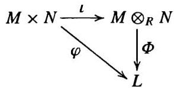

We have already seen examples where $M_1 \otimes_R N$ is not contained in $M \otimes_R N$ even when $M_1$ is an $R$-submodule of $M$. The next result shows in particular that (an isomorphic copy of) $M_1 \otimes_R N$ is contained in $M \otimes_R N$ if $M_1$ is an $R$-module direct summand of $M$.

Theorem 17. (Tensor Products of Direct Sums) Let $M, M'$ be right $R$-modules and let $N, N'$ be left $R$-modules. Then there are unique group isomorphisms

$$
(M \oplus M') \otimes_R N \cong (M \otimes_R N) \oplus (M' \otimes_R N)
$$

$$
M \otimes_R (N \oplus N') \cong (M \otimes_R N) \oplus (M \otimes_R N')
$$

such that $(m, m') \otimes n \mapsto (m \otimes n, m' \otimes n)$ and $m \otimes (n, n') \mapsto (m \otimes n, m \otimes n')$ respectively. If $M, M'$ are also $(S, R)$-bimodules, then these are isomorphisms of left $S$-modules. In particular, if $R$ is commutative, these are isomorphisms of $R$-modules.

Proof: The map $(M \oplus M') \times N \to (M \otimes_R N) \oplus (M' \otimes_R N)$ defined by $((m, m'), n) \mapsto (m \otimes n, m' \otimes n)$ is well defined since $m$ and $m'$ in $M \oplus M'$ are uniquely defined in the direct sum. The map is clearly $R$-balanced, so induces a homomorphism $f$ from $(M \oplus M') \otimes N$ to $(M \otimes_R N) \oplus (M' \otimes_R N)$ with

$$
f \left(\left(m, m'\right) \otimes n\right) = \left(m \otimes n, m' \otimes n\right).
$$

In the other direction, the $R$-balanced maps $M \times N \to (M \oplus M') \otimes_R N$ and $M' \times N \to (M \oplus M') \otimes_R N$ given by $(m, n) \mapsto (m, 0) \otimes n$ and $(m', n) \mapsto (0, m') \otimes n$, respectively, define homomorphisms from $M \otimes_R N$ and $M' \otimes_R N$ to $(M \oplus M') \otimes_R N$. These in turn give a homomorphism $g$ from the direct sum $(M \otimes_R N) \oplus (M' \otimes_R N)$ to $(M \oplus M') \otimes_R N$ with

$$
g \left(\left(m \otimes n_1, m' \otimes n_2\right)\right) = (m, 0) \otimes n_1 + (0, m') \otimes n_2.
$$

An easy check shows that $f$ and $g$ are inverse homomorphisms and are $S$-module isomorphisms when $M$ and $M'$ are $(S, R)$-bimodules. This completes the proof.

The previous theorem clearly extends by induction to any finite direct sum of $R$-modules. The corresponding result is also true for arbitrary direct sums. For example

$$
M \otimes \left(\oplus_{i \in I} N_i\right) \cong \oplus_{i \in I} \left(M \otimes N_i\right),
$$

where $I$ is any index set (cf. the exercises). This result is referred to by saying that tensor products commute with direct sums.

Corollary 18. (Extension of Scalars for Free Modules) The module obtained from the free $R$-module $N \cong R^n$ by extension of scalars from $R$ to $S$ is the free $S$-module $S^n$, i.e.,

$$
S \otimes_R R^n \cong S^n
$$

as left $S$-modules.

Proof: This follows immediately from Theorem 17 and the isomorphism $S \otimes_R R \cong S$ proved in Example 7 previously.

Corollary 19. Let $R$ be a commutative ring and let $M \cong R^s$ and $N \cong R^t$ be free $R$-modules with bases $m_1, \ldots, m_s$ and $n_1, \ldots, n_t$, respectively. Then $M \otimes_R N$ is a free $R$-module of rank $st$, with basis $m_i \otimes n_j$, $1 \leq i \leq s$ and $1 \leq j \leq t$, i.e.,

$$
R^s \otimes_R R^t \cong R^{st}.
$$

Remark: More generally, the tensor product of two free modules of arbitrary rank over a commutative ring is free (cf. the exercises).

Proof: This follows easily from Theorem 17 and the first example following Corollary 9.

Proposition 20. Suppose $R$ is a commutative ring and $M, N$ are left $R$-modules, considered with the standard $R$-module structures. Then there is a unique $R$-module isomorphism

$$
M \otimes_R N \cong N \otimes_R M
$$

mapping $m \otimes n$ to $n \otimes m$.

Proof: The map $M \times N \to N \otimes M$ defined by $(m, n) \mapsto n \otimes m$ is $R$-balanced. Hence it induces a unique homomorphism $f$ from $M \otimes N$ to $N \otimes M$ with $f(m \otimes n) = n \otimes m$. Similarly, we have a unique homomorphism $g$ from $N \otimes M$ to $M \otimes N$ with $g(n \otimes m) = m \otimes n$ giving the inverse of $f$, and both maps are easily seen to be $R$-module isomorphisms.

Remark: When $M = N$ it is not in general true that $a \otimes b = b \otimes a$ for $a, b \in M$. We shall study "symmetric tensors" in Section 11.6.

We end this section by showing that the tensor product of $R$-algebras is again an $R$-algebra.

Proposition 21. Let $R$ be a commutative ring and let $A$ and $B$ be $R$-algebras. Then the multiplication $(a \otimes b)(a' \otimes b') = aa' \otimes bb'$ is well defined and makes $A \otimes_R B$ into an $R$-algebra.

Proof: Note first that the definition of an $R$-algebra shows that

$$
r(a \otimes b) = ra \otimes b = ar \otimes b = a \otimes rb = a \otimes br = (a \otimes b)r
$$

for every $r \in R$, $a \in A$ and $b \in B$. To show that $A \otimes B$ is an $R$-algebra the main task is, as usual, showing that the specified multiplication is well defined. One way to proceed is to use two applications of Corollary 16, as follows. The map $\varphi : A \times B \times A \times B \to A \otimes B$ defined by $f(a, b, a', b') = aa' \otimes bb'$ is multilinear over $R$. For example,

$$
\begin{array}{l}
f(a, r_1 b_1 + r_2 b_2, a', b') = aa' \otimes (r_1 b_1 + r_2 b_2) b' \\
= aa' \otimes r_1 b_1 b' + aa' \otimes r_2 b_2 b' \\
= r_1 f(a, b_1, a', b') + r_2 f(a, b_2, a', b').
\end{array}
$$

By Corollary 16, there is a corresponding $R$-module homomorphism $\Phi$ from $A \otimes B \otimes A \otimes B$ to $A \otimes B$ with $\Phi(a \otimes b \otimes a' \otimes b') = aa' \otimes bb'$. Viewing $A \otimes B \otimes A \otimes B$ as $(A \otimes B) \otimes (A \otimes B)$, we can apply Corollary 16 once more to obtain a well defined $R$-bilinear mapping $\varphi'$ from $(A \otimes B) \times (A \otimes B)$ to $A \otimes B$ with $\varphi'(a \otimes b, a' \otimes b') = aa' \otimes bb'$. This shows that the multiplication is indeed well defined (and also that it satisfies the distributive laws). It is now a simple matter (left to the exercises) to check that with this multiplication $A \otimes B$ is an $R$-algebra.

## Example

The tensor product $\mathbb{C} \otimes_{\mathbb{R}} \mathbb{C}$ is free of rank 4 as a module over $\mathbb{R}$ with basis given by $e_1 = 1 \otimes 1$, $e_2 = 1 \otimes i$, $e_3 = i \otimes 1$, and $e_4 = i \otimes i$ (by Corollary 19). By Proposition 21, this tensor product is also a (commutative) ring with $e_1 = 1$, and, for example,

$$
e_4^2 = (i \otimes i)(i \otimes i) = i^2 \otimes i^2 = (-1) \otimes (-1) = (-1)(-1) \otimes 1 = 1.
$$

Then $(e_4 - 1)(e_4 + 1) = 0$, so $\mathbb{C} \otimes_{\mathbb{R}} \mathbb{C}$ is not an integral domain.

The ring $\mathbb{C} \otimes_{\mathbb{R}} \mathbb{C}$ is an $\mathbb{R}$-algebra and the left and right $\mathbb{R}$-actions are the same: $x r = r x$ for every $r \in \mathbb{R}$ and $x \in \mathbb{C} \otimes_{\mathbb{R}} \mathbb{C}$. The ring $\mathbb{C} \otimes_{\mathbb{R}} \mathbb{C}$ has a structure of a left $\mathbb{C}$-module because the first $\mathbb{C}$ is a $(\mathbb{C}, \mathbb{R})$-bimodule. It also has a right $\mathbb{C}$-module structure because the second $\mathbb{C}$ is an $(\mathbb{R}, \mathbb{C})$-bimodule. For example,

$$
i \cdot e_1 = i \cdot (1 \otimes 1) = (i \cdot 1) \otimes 1 = i \otimes 1 = e_3
$$

and

$$
e_1 \cdot i = (1 \otimes 1) \cdot i = 1 \otimes (1 \cdot i) = 1 \otimes i = e_2.
$$

This example also shows that even when the rings involved are commutative there may be natural left and right module structures (over some ring) that are not the same.

## EXERCISES

Let $R$ be a ring with 1.

1. Let $f: R \to S$ be a ring homomorphism from the ring $R$ to the ring $S$ with $f(1_R) = 1_S$. Verify the details that $s r = s f(r)$ defines a right $R$-action on $S$ under which $S$ is an $(S, R)$-bimodule.
2. Show that the element “$2 \otimes 1$” is 0 in $\mathbb{Z} \otimes_{\mathbb{Z}} \mathbb{Z}/2\mathbb{Z}$ but is nonzero in $2\mathbb{Z} \otimes_{\mathbb{Z}} \mathbb{Z}/2\mathbb{Z}$.
3. Show that $\mathbb{C} \otimes_{\mathbb{R}} \mathbb{C}$ and $\mathbb{C} \otimes_{\mathbb{C}} \mathbb{C}$ are both left $\mathbb{R}$-modules but are not isomorphic as $\mathbb{R}$-modules.
4. Show that $\mathbb{Q} \otimes_{\mathbb{Z}} \mathbb{Q}$ and $\mathbb{Q} \otimes_{\mathbb{Q}} \mathbb{Q}$ are isomorphic left $\mathbb{Q}$-modules. [Show they are both 1-dimensional vector spaces over $\mathbb{Q}$.]
5. Let $A$ be a finite abelian group of order $n$ and let $p^k$ be the largest power of the prime $p$ dividing $n$. Prove that $\mathbb{Z} / p^k \mathbb{Z} \otimes_{\mathbb{Z}} A$ is isomorphic to the Sylow $p$-subgroup of $A$.
6. If $R$ is any integral domain with quotient field $Q$, prove that $(Q / R) \otimes_R (Q / R) = 0$.
7. If $R$ is any integral domain with quotient field $Q$ and $N$ is a left $R$-module, prove that every element of the tensor product $Q \otimes_R N$ can be written as a simple tensor of the form $(1 / d) \otimes n$ for some nonzero $d \in R$ and some $n \in N$.
8. Suppose $R$ is an integral domain with quotient field $Q$ and let $N$ be any $R$-module. Let $U = R^{\times}$ be the set of nonzero elements in $R$ and define $U^{-1}N$ to be the set of equivalence classes of ordered pairs of elements $(u, n)$ with $u \in U$ and $n \in N$ under the equivalence relation $(u, n) \sim (u', n)$ if and only if $u'n = un'$ in $N$.

(a) Prove that $U^{-1}N$ is an abelian group under the addition defined by $\overline{(u_1, n_1)} + \overline{(u_2, n_2)} = \overline{(u_1 u_2, u_2 n_1 + u_1 n_2)}$. Prove that $r(\overline{u, n}) = \overline{(u, rn)}$ defines an action of $R$ on $U^{-1}N$ making it into an $R$-module. [This is an example of localization considered in general in Section 4 of Chapter 15, cf. also Section 5 in Chapter 7.]

(b) Show that the map from $Q \times N$ to $U^{-1}N$ defined by sending $(a/b, n)$ to $\overline{(b, an)}$ for $a \in R$, $b \in U$, $n \in N$, is an $R$-balanced map, so induces a homomorphism $f$ from $Q \otimes_R N$ to $U^{-1}N$. Show that the map $g$ from $U^{-1}N$ to $Q \otimes_R N$ defined by $g(\overline{(u, n)}) = (1/u) \otimes n$ is well defined and is an inverse homomorphism to $f$. Conclude that $Q \otimes_R N \cong U^{-1}N$ as $R$-modules.

(c) Conclude from (b) that $(1 / d)\otimes n$ is 0 in $Q\otimes_{R}N$ if and only if $rn = 0$ for some nonzero $r\in R$.

(d) If $A$ is an abelian group, show that $\mathbb{Q} \otimes_{\mathbb{Z}} A = 0$ if and only if $A$ is a torsion abelian group (i.e., every element of $A$ has finite order).

9. Suppose $R$ is an integral domain with quotient field $Q$ and let $N$ be any $R$-module. Let $Q \otimes_R N$ be the module obtained from $N$ by extension of scalars from $R$ to $Q$. Prove that the kernel of the $R$-module homomorphism $\iota : N \to Q \otimes_R N$ is the torsion submodule of $N$ (cf. Exercise 8 in Section 1). [Use the previous exercise.]

10. Suppose $R$ is commutative and $N \cong R^n$ is a free $R$-module of rank $n$ with $R$-module basis $e_1, \ldots, e_n$.

(a) For any nonzero $R$-module $M$ show that every element of $M \otimes N$ can be written uniquely in the form $\sum_{i=1}^{n} m_i \otimes e_i$ where $m_i \in M$. Deduce that if $\sum_{i=1}^{n} m_i \otimes e_i = 0$ in $M \otimes N$ then $m_i = 0$ for $i = 1, \ldots, n$.

(b) Show that if $\sum m_i \otimes n_i = 0$ in $M \otimes N$ where the $n_i$ are merely assumed to be $R$-linearly independent then it is not necessarily true that all the $m_i$ are 0. [Consider $R = \mathbb{Z}$, $n = 1$, $M = \mathbb{Z}/2\mathbb{Z}$, and the element $1 \otimes 2$.]

11. Let $\{e_1, e_2\}$ be a basis of $V = \mathbb{R}^2$. Show that the element $e_1 \otimes e_2 + e_2 \otimes e_1$ in $V \otimes_{\mathbb{R}} V$ cannot be written as a simple tensor $v \otimes w$ for any $v, w \in \mathbb{R}^2$.

12. Let $V$ be a vector space over the field $F$ and let $v, v'$ be nonzero elements of $V$. Prove that $v \otimes v' = v' \otimes v$ in $V \otimes_F V$ if and only if $v = av'$ for some $a \in F$.

13. Prove that the usual dot product of vectors defined by letting $(a_1, \ldots, a_n) \cdot (b_1, \ldots, b_n)$ be $a_1b_1 + \cdots + a_nb_n$ is a bilinear map from $\mathbb{R}^n \times \mathbb{R}^n$ to $\mathbb{R}$.

14. Let $I$ be an arbitrary nonempty index set and for each $i \in I$ let $N_i$ be a left $R$-module. Let $M$ be a right $R$-module. Prove the group isomorphism: $M \otimes (\oplus_{i \in I} N_i) \cong \oplus_{i \in I} (M \otimes N_i)$, where the direct sum of an arbitrary collection of modules is defined in Exercise 20, Section 3. [Use the same argument as for the direct sum of two modules, taking care to note where the direct sum hypothesis is needed — cf. the next exercise.]

15. Show that tensor products do not commute with direct products in general. [Consider the extension of scalars from $\mathbb{Z}$ to $\mathbb{Q}$ of the direct product of the modules $M_i = \mathbb{Z}/2^i\mathbb{Z}$, $i = 1, 2, \ldots$]

16. Suppose $R$ is commutative and let $I$ and $J$ be ideals of $R$, so $R / I$ and $R / J$ are naturally $R$-modules.

(a) Prove that every element of $R / I \otimes_R R / J$ can be written as a simple tensor of the form $(1 \bmod I) \otimes (r \bmod J)$.

(b) Prove that there is an $R$-module isomorphism $R / I \otimes_{R} R / J \cong R / (I + J)$ mapping $(r \bmod I) \otimes (r' \bmod J)$ to $rr' \bmod (I + J)$.

17. Let $I = (2, x)$ be the ideal generated by 2 and $x$ in the ring $R = \mathbb{Z}[x]$. The ring $\mathbb{Z}/2\mathbb{Z} = R/I$ is naturally an $R$-module annihilated by both 2 and $x$.

(a) Show that the map $\varphi : I \times I \to \mathbb{Z}/2\mathbb{Z}$ defined by

$$
\varphi(a_0 + a_1 x + \cdots + a_n x^n, b_0 + b_1 x + \cdots + b_m x^m) = \frac{a_0}{2} b_1 \bmod 2
$$

is $R$-bilinear.

(b) Show that there is an $R$-module homomorphism from $I \otimes_R I \to \mathbb{Z}/2\mathbb{Z}$ mapping $p(x) \otimes q(x)$ to $\frac{p(0)}{2} q'(0)$ where $q'$ denotes the usual polynomial derivative of $q$.

(c) Show that $2 \otimes x \neq x \otimes 2$ in $I \otimes_R I$.

18. Suppose $I$ is a principal ideal in the integral domain $R$. Prove that the $R$-module $I \otimes_R I$ has no nonzero torsion elements (i.e., $rm = 0$ with $0 \neq r \in R$ and $m \in I \otimes_R I$ implies that $m = 0$).

19. Let $I = (2, x)$ be the ideal generated by 2 and $x$ in the ring $R = \mathbb{Z}[x]$ as in Exercise 17. Show that the nonzero element $2 \otimes x - x \otimes 2$ in $I \otimes_R I$ is a torsion element. Show in fact that $2 \otimes x - x \otimes 2$ is annihilated by both 2 and $x$ and that the submodule of $I \otimes_R I$ generated by $2 \otimes x - x \otimes 2$ is isomorphic to $R/I$.

20. Let $I = (2, x)$ be the ideal generated by 2 and $x$ in the ring $R = \mathbb{Z}[x]$. Show that the element $2 \otimes 2 + x \otimes x$ in $I \otimes_R I$ is not a simple tensor, i.e., cannot be written as $a \otimes b$ for some $a, b \in I$.

21. Suppose $R$ is commutative and let $I$ and $J$ be ideals of $R$.

(a) Show there is a surjective $R$-module homomorphism from $I \otimes_R J$ to the product ideal $IJ$ mapping $i \otimes j$ to the element $ij$.

(b) Give an example to show that the map in (a) need not be injective (cf. Exercise 17).

22. Suppose that $M$ is a left and a right $R$-module such that $rm = mr$ for all $r \in R$ and $m \in M$. Show that the elements $r_1 r_2$ and $r_2 r_1$ act the same on $M$ for every $r_1, r_2 \in R$. (This explains why the assumption that $R$ is commutative in the definition of an $R$-algebra is a fairly natural one.)

23. Verify the details that the multiplication in Proposition 19 makes $A \otimes_R B$ into an $R$-algebra.

24. Prove that the extension of scalars from $\mathbb{Z}$ to the Gaussian integers $\mathbb{Z}[i]$ of the ring $\mathbb{R}$ is isomorphic to $\mathbb{C}$ as a ring: $\mathbb{Z}[i] \otimes_{\mathbb{Z}} \mathbb{R} \cong \mathbb{C}$ as rings.

25. Let $R$ be a subring of the commutative ring $S$ and let $x$ be an indeterminate over $S$. Prove that $S[x]$ and $S \otimes_R R[x]$ are isomorphic as $S$-algebras.

26. Let $S$ be a commutative ring containing $R$ (with $1_S = 1_R$) and let $x_1, \ldots, x_n$ be independent indeterminates over the ring $S$. Show that for every ideal $I$ in the polynomial ring $R[x_1, \ldots, x_n]$ that $S \otimes_R (R[x_1, \ldots, x_n] / I) \cong S[x_1, \ldots, x_n] / IS[x_1, \ldots, x_n]$ as $S$-algebras.

The next exercise shows the ring $\mathbb{C} \otimes_{\mathbb{R}} \mathbb{C}$ introduced at the end of this section is isomorphic to $\mathbb{C} \times \mathbb{C}$. One may also prove this via Exercise 26 and Proposition 16 in Section 9.5, since $\mathbb{C} \cong \mathbb{R}[x] / (x^2 + 1)$. The ring $\mathbb{C} \times \mathbb{C}$ is also discussed in Exercise 23 of Section 1.

27. (a) Write down a formula for the multiplication of two elements $a \cdot 1 + b \cdot e_2 + c \cdot e_3 + d \cdot e_4$ and $a' \cdot 1 + b' \cdot e_2 + c' \cdot e_3 + d' \cdot e_4$ in the example $A = \mathbb{C} \otimes_{\mathbb{R}} \mathbb{C}$ following Proposition 21 (where $1 = 1 \otimes 1$ is the identity of $A$).

(b) Let $\epsilon_1 = \frac{1}{2} (1 \otimes 1 + i \otimes i)$ and $\epsilon_2 = \frac{1}{2} (1 \otimes 1 - i \otimes i)$. Show that $\epsilon_1 \epsilon_2 = 0$, $\epsilon_1 + \epsilon_2 = 1$, and $\epsilon_j^2 = \epsilon_j$ for $j = 1, 2$ ($\epsilon_1$ and $\epsilon_2$ are called orthogonal idempotents in $A$). Deduce that $A$ is isomorphic as a ring to the direct product of two principal ideals: $A \cong A \epsilon_1 \times A \epsilon_2$ (cf. Exercise 1, Section 7.6).

(c) Prove that the map $\varphi : \mathbb{C} \times \mathbb{C} \to \mathbb{C} \times \mathbb{C}$ by $\varphi(z_1, z_2) = (z_1 z_2, z_1 \overline{z_2})$, where $\overline{z_2}$ denotes the complex conjugate of $z_2$, is an $\mathbb{R}$-bilinear map.

(d) Let $\Phi$ be the $\mathbb{R}$-module homomorphism from $A$ to $\mathbb{C} \times \mathbb{C}$ obtained from $\varphi$ in (c). Show that $\Phi(\epsilon_1) = (0, 1)$ and $\Phi(\epsilon_2) = (1, 0)$. Show also that $\Phi$ is $\mathbb{C}$-linear, where the action of $\mathbb{C}$ is on the left tensor factor in $A$ and on both factors in $\mathbb{C} \times \mathbb{C}$. Deduce that $\Phi$ is surjective. Show that $\Phi$ is a $\mathbb{C}$-algebra isomorphism.

## 10.5 EXACT SEQUENCES—PROJECTIVE, INJECTIVE, AND FLAT MODULES

One of the fundamental results for studying the structure of an algebraic object $B$ (e.g., a group, a ring, or a module) is the First Isomorphism Theorem, which relates the subobjects of $B$ (the normal subgroups, the ideals, or the submodules, respectively) with the possible homomorphic images of $B$. We have already seen many examples applying this theorem to understand the structure of $B$ from an understanding of its "smaller" constituents—for example in analyzing the structure of the dihedral group $D_8$ by determining its center and the resulting quotient by the center.

In most of these examples we began first with a given $B$ and then determined some of its basic properties by constructing a homomorphism $\varphi$ (often given implicitly by the specification of $\ker \varphi \subseteq B$) and examining both $\ker \varphi$ and the resulting quotient $B / \ker \varphi$. We now consider in some greater detail the reverse situation, namely whether we may first specify the "smaller constituents." More precisely, we consider whether, given two modules $A$ and $C$, there exists a module $B$ containing (an isomorphic copy of) $A$ such that the resulting quotient module $B / A$ is isomorphic to $C$ —in which case $B$ is said to be an extension of $C$ by $A$. It is then natural to ask how many such $B$ exist for a given $A$ and $C$, and the extent to which properties of $B$ are determined by the corresponding properties of $A$ and $C$. There are, of course, analogous problems in the contexts of groups and rings. This is the extension problem first discussed (for groups) in Section 3.4; in this section we shall be primarily concerned with left modules over a ring $R$, making note where necessary of the modifications required for some other structures, notably noncommutative groups. As in the previous section, throughout this section all rings contain a 1.

We first introduce a very convenient notation. To say that $A$ is isomorphic to a submodule of $B$, is to say that there is an injective homomorphism $\psi : A \to B$ (so then $A \cong \psi(A) \subseteq B$). To say that $C$ is isomorphic to the resulting quotient is to say that there is a surjective homomorphism $\varphi : B \to C$ with $\ker \varphi = \psi(A)$. In particular this gives us a pair of homomorphisms:

$$
A \xrightarrow {\psi} B \xrightarrow {\varphi} C
$$

with image $\psi = \ker \varphi$. A pair of homomorphisms with this property is given a name:

## Definition.

(1) The pair of homomorphisms $X \xrightarrow{\alpha} Y \xrightarrow{\beta} Z$ is said to be exact (at $Y$) if image $\alpha = \ker \beta$.

(2) A sequence $\dots \to X_{n - 1} \to X_n \to X_{n + 1} \to \dots$ of homomorphisms is said to be an exact sequence if it is exact at every $X_n$ between a pair of homomorphisms.

With this terminology, the pair of homomorphisms $A \xrightarrow{\psi} B \xrightarrow{\varphi} C$ above is exact at $B$. We can also use this terminology to express the fact that for these maps $\psi$ is injective and $\varphi$ is surjective:

**Proposition 22.** Let $A, B$ and $C$ be $R$-modules over some ring $R$. Then

(1) The sequence $0 \to A \xrightarrow{\psi} B$ is exact (at $A$) if and only if $\psi$ is injective.
(2) The sequence $B \xrightarrow{\varphi} C \to 0$ is exact (at $C$) if and only if $\varphi$ is surjective.

*Proof:* The (uniquely defined) homomorphism $0 \to A$ has image 0 in $\mathbf{A}$. This will be the kernel of $\psi$ if and only if $\psi$ is injective. Similarly, the kernel of the (uniquely defined) zero homomorphism $C \to 0$ is all of $C$, which is the image of $\varphi$ if and only if $\varphi$ is surjective.

**Corollary 23.** The sequence $0 \to A \xrightarrow{\psi} B \xrightarrow{\varphi} C \to 0$ is exact if and only if $\psi$ is injective, $\varphi$ is surjective, and image $\psi = \ker \varphi$, i.e., $B$ is an extension of $C$ by $A$.

**Definition.** The exact sequence $0 \to A \xrightarrow{\psi} B \xrightarrow{\varphi} C \to 0$ is called a *short exact sequence*.

In terms of this notation, the extension problem can be stated succinctly as follows: given modules $A$ and $C$, determine all the short exact sequences

$$
0 \longrightarrow A \xrightarrow{\psi} B \xrightarrow{\varphi} C \longrightarrow 0. \tag{10.9}
$$

We shall see below that the exact sequence notation is also extremely convenient for analyzing the extent to which properties of $A$ and $C$ determine the corresponding properties of $B$. If $A$, $B$ and $C$ are groups written multiplicatively, the sequence (9) will be written

$$
1 \longrightarrow A \xrightarrow{\psi} B \xrightarrow{\varphi} C \longrightarrow 1 \tag{10.9'}
$$

where 1 denotes the *trivial* group. Both Proposition 22 and Corollary 23 are valid with the obvious notational changes.

Note that any exact sequence can be written as a succession of short exact sequences since to say $X \xrightarrow{\alpha} Y \xrightarrow{\beta} Z$ is exact at $Y$ is the same as saying that the sequence $0 \to \alpha(X) \to Y \to Y / \ker \beta \to 0$ is a short exact sequence.

## Examples

(1) Given modules $A$ and $C$ we can always form their direct sum $B = A \oplus C$ and the sequence

$$
0 \to A \xrightarrow{\iota} A \oplus C \xrightarrow{\pi} C \to 0
$$

where $\iota(a) = (a, 0)$ and $\pi(a, c) = c$ is a short exact sequence. In particular, it follows that there always exists at least one extension of $C$ by $A$.

(2) As a special case of the previous example, consider the two $\mathbb{Z}$-modules $A = \mathbb{Z}$ and $C = \mathbb{Z} / n\mathbb{Z}$:

$$
0 \longrightarrow \mathbb{Z} \xrightarrow{\iota} \mathbb{Z} \oplus (\mathbb{Z} / n\mathbb{Z}) \xrightarrow{\varphi} \mathbb{Z} / n\mathbb{Z} \longrightarrow 0,
$$

giving one extension of $\mathbb{Z} / n\mathbb{Z}$ by $\mathbb{Z}$.

Another extension of $\mathbb{Z} / n\mathbb{Z}$ by $\mathbb{Z}$ is given by the short exact sequence

$$
0 \to \mathbb{Z} \xrightarrow{n} \mathbb{Z} \xrightarrow{\pi} \mathbb{Z} / n\mathbb{Z} \to 0
$$

where $n$ denotes the map $x \mapsto nx$ given by multiplication by $n$, and $\pi$ denotes the natural projection. Note that the modules in the middle of the previous two exact sequences are not isomorphic even though the respective “$A$” and “$C$” terms are isomorphic. Thus there are (at least) two “essentially different” or “inequivalent” ways of extending $\mathbb{Z} / n\mathbb{Z}$ by $\mathbb{Z}$.

(3) If $\varphi : B \to C$ is any homomorphism we may form an exact sequence:

$$
0 \longrightarrow \ker \varphi \xrightarrow{\iota} B \xrightarrow{\varphi} \operatorname{image} \varphi \longrightarrow 0
$$

where $\iota$ is the inclusion map. In particular, if $\varphi$ is surjective, the sequence $\varphi : B \to C$ may be extended to a short exact sequence with $A = \ker \varphi$.

(4) One particularly important instance of the preceding example is when $M$ is an $R$-module and $S$ is a set of generators for $M$. Let $F(S)$ be the free $R$-module on $S$. Then

$$
0 \longrightarrow K \xrightarrow{\iota} F(S) \xrightarrow{\varphi} M \longrightarrow 0
$$

is the short exact sequence where $\varphi$ is the unique $R$-module homomorphism which is the identity on $S$ (cf. Theorem 6) and $K = \ker \varphi$.

More generally, when $M$ is any group (possibly non-abelian) the above short exact sequence (with 1’s at the ends, if $M$ is written multiplicatively) describes a presentation of $M$, where $K$ is the normal subgroup of $F(S)$ generated by the relations defining $M$ (cf. Section 6.3).

(5) Two “inequivalent” extensions $G$ of the Klein 4-group by the cyclic group $Z_2$ of order two are

$$
\begin{array}{l}
1 \longrightarrow Z_2 \xrightarrow{\iota} D_8 \xrightarrow{\varphi} Z_2 \times Z_2 \longrightarrow 1, \text{ and} \\
1 \longrightarrow Z_2 \xrightarrow{\iota} Q_8 \xrightarrow{\varphi} Z_2 \times Z_2 \longrightarrow 1,
\end{array}
$$

where in each case $\iota$ maps $Z_2$ injectively into the center of $G$ (recall that both $D_8$ and $Q_8$ have centers of order two), and $\varphi$ is the natural projection of $G$ onto $G / Z(G)$.

Two other inequivalent extensions $G$ of the Klein 4-group by $Z_2$ occur when $G$ is either of the abelian groups $Z_2 \times Z_2 \times Z_2$ or $Z_2 \times Z_4$ for appropriate maps $\iota$ and $\varphi$.

Examples 2 and 5 above show that, for a fixed $A$ and $C$, in general there may be several extensions of $C$ by $A$. To distinguish different extensions we define the notion of a homomorphism (and isomorphism) between two exact sequences. Recall first that a diagram involving various homomorphisms is said to commute if any compositions of homomorphisms with the same starting and ending points are equal, i.e., the composite map defined by following a path of homomorphisms in the diagram depends only on the starting and ending points and not on the choice of the path taken.

Definition. Let  $0 \to A \to B \to C \to 0$  and  $0 \to A' \to B' \to C' \to 0$  be two short exact sequences of modules.

(1) A homomorphism of short exact sequences is a triple  $\alpha, \beta, \gamma$  of module homomorphisms such that the following diagram commutes:

The homomorphism is an isomorphism of short exact sequences if  $\alpha, \beta, \gamma$  are all isomorphisms, in which case the extensions  $B$  and  $B'$  are said to be isomorphic extensions.

(2) The two exact sequences are called equivalent if  $A = A'$ ,  $C = C'$ , and there is an isomorphism between them as in (1) that is the identity maps on  $A$  and  $C$  (i.e.,  $\alpha$  and  $\gamma$  are the identity). In this case the corresponding extensions  $B$  and  $B'$  are said to be equivalent extensions.

If  $B$  and  $B'$  are isomorphic extensions then in particular  $B$  and  $B'$  are isomorphic as  $R$ -modules, but more is true: there is an  $R$ -module isomorphism between  $B$  and  $B'$  that restricts to an isomorphism from  $A$  to  $A'$  and induces an isomorphism on the quotients  $C$  and  $C'$ . For a given  $A$  and  $C$  the condition that two extensions  $B$  and  $B'$  of  $C$  by  $A$  are equivalent is stronger still: there must exist an  $R$ -module isomorphism between  $B$  and  $B'$  that restricts to the identity map on  $A$  and induces the identity map on  $C$ . The notion of isomorphic extensions measures how many different extensions of  $C$  by  $A$  there are, allowing for  $C$  and  $A$  to be changed by an isomorphism. The notion of equivalent extensions measures how many different extensions of  $C$  by  $A$  there are when  $A$  and  $C$  are rigidly fixed.

Homomorphisms and isomorphisms between short exact sequences of multiplicative groups  $(9')$  are defined similarly.

It is an easy exercise to see that the composition of homomorphisms of short exact sequences is also a homomorphism. Likewise, if the triple  $\alpha$ ,  $\beta$ ,  $\gamma$  is an isomorphism (or equivalence) then  $\alpha^{-1}$ ,  $\beta^{-1}$ ,  $\gamma^{-1}$  is an isomorphism (equivalence, respectively) in the reverse direction. It follows that "isomorphism" (or equivalence) is an equivalence relation on any set of short exact sequences.

# Examples

(1) Let  $m$  and  $n$  be integers greater than 1. Assume  $n$  divides  $m$  and let  $k = m / n$ . Define a map from the exact sequence of  $\mathbb{Z}$ -modules in Example 2 of the preceding set of examples:

where  $\alpha$  and  $\beta$  are the natural projections,  $\gamma$  is the identity map,  $\iota$  maps  $a \bmod k$  to  $na \bmod m$ , and  $\pi'$  is the natural projection of  $\mathbb{Z}/m\mathbb{Z}$  onto its quotient  $(\mathbb{Z}/m\mathbb{Z})/(n\mathbb{Z}/m\mathbb{Z})$

(which is isomorphic to $\mathbb{Z}/n\mathbb{Z}$). One easily checks that this is a homomorphism of short exact sequences.

(2) If again $0 \to \mathbb{Z} \xrightarrow{n} \mathbb{Z} \xrightarrow{\pi} \mathbb{Z}/n\mathbb{Z} \to 0$ is the short exact sequence of $\mathbb{Z}$-modules defined previously, map each module to itself by $x \mapsto -x$. This triple of homomorphisms gives an isomorphism of the exact sequence with itself. This isomorphism is not an equivalence of sequences since it is not the identity on the first $\mathbb{Z}$.

(3) The short exact sequences in Examples 1 and 2 following Corollary 23 are not isomorphic—the extension modules are not isomorphic $\mathbb{Z}$-modules (abelian groups). Likewise the two extensions, $D_8$ and $Q_8$, in Example 5 of the same set are not isomorphic (hence not equivalent), even though the two end terms “A” and “C” are the same for both sequences.

(4) Consider the maps

where $\psi$ maps $\mathbb{Z}/2\mathbb{Z}$ in jectively into the first component of the direct sum and $\varphi$ projects the direct sum onto its second component. Also $\psi'$ embeds $\mathbb{Z}/2\mathbb{Z}$ into the second component of the direct sum and $\varphi'$ projects the direct sum onto its first component. If $\beta$ maps the direct sum $\mathbb{Z}/2\mathbb{Z} \oplus \mathbb{Z}/2\mathbb{Z}$ to itself by interchanging the two factors, then this diagram is seen to commute, hence giving an equivalence of the two exact sequences that is not the identity isomorphism.

(5) We exhibit two isomorphic but inequivalent $\mathbb{Z}$-module extensions. For $i = 1, 2$ define

$$
0 \longrightarrow \mathbb{Z}/2\mathbb{Z} \xrightarrow{\psi} \mathbb{Z}/4\mathbb{Z} \oplus \mathbb{Z}/2\mathbb{Z} \xrightarrow{\varphi_i} \mathbb{Z}/2\mathbb{Z} \oplus \mathbb{Z}/2\mathbb{Z} \longrightarrow 0
$$

where $\psi : 1 \mapsto (2,0)$ in both sequences, $\varphi_1$ is defined by $\varphi_1(a \bmod 4, b \bmod 2) = (a \bmod 2, b \bmod 2)$, and $\varphi_2(a \bmod 4, b \bmod 2) = (b \bmod 2, a \bmod 2)$. It is easy to see that the resulting two sequences are both short exact sequences.

An evident isomorphism between these two exact sequences is provided by the triple of maps $\operatorname{id}$, $\operatorname{id}$, $\gamma$, where $\gamma: \mathbb{Z}/2\mathbb{Z} \oplus \mathbb{Z}/2\mathbb{Z} \to \mathbb{Z}/2\mathbb{Z} \oplus \mathbb{Z}/2\mathbb{Z}$ is the map $\gamma((c, d)) = (d, c)$ that interchanges the two direct factors.

We now check that these two isomorphic sequences are not equivalent, as follows. Since $\varphi_1(0, 1) = (0, 1)$, any equivalence, $\operatorname{id}$, $\beta$, $\operatorname{id}$, from the first sequence to the second must map $(0, 1) \in \mathbb{Z}/4\mathbb{Z} \oplus \mathbb{Z}/2\mathbb{Z}$ to either $(1, 0)$ or $(3, 0)$ in $\mathbb{Z}/4\mathbb{Z} \oplus \mathbb{Z}/2\mathbb{Z}$, since these are the two possible elements mapping to $(0, 1)$ by $\varphi_2$. This is impossible, however, since the isomorphism $\beta$ cannot send an element of order 2 to an element of order 4.

Put another way, equivalences involving the same extension module $B$ are automorphisms of $B$ that restrict to the identity on both $\psi(A)$ and $B/\psi(A)$. Any such automorphism of $B = \mathbb{Z}/4\mathbb{Z} \oplus \mathbb{Z}/2\mathbb{Z}$ must fix the coset $(0,1) + \psi(A)$ since this is the unique nonidentity coset containing elements of order 2. Thus maps which send this coset to different elements in $C$ give inequivalent extensions. In particular, there is yet a third inequivalent extension involving the same modules $A = \mathbb{Z}/2\mathbb{Z}$, $B = \mathbb{Z}/4\mathbb{Z} \oplus \mathbb{Z}/2\mathbb{Z}$ and $C = \mathbb{Z}/2\mathbb{Z} \oplus \mathbb{Z}/2\mathbb{Z}$, that maps the coset $(0,1) + \psi(A)$ to the element $(1,1) \in \mathbb{Z}/2\mathbb{Z} \oplus \mathbb{Z}/2\mathbb{Z}$.

By similar reasoning there are three inequivalent but isomorphic group extensions of $Z_2 \times Z_2$ by $Z_2$ with $B \cong D_8$ (cf. the exercises).

The homomorphisms  $\alpha, \beta, \gamma$  in a homomorphism of short exact sequences are not independent. The next result gives some relations among these three homomorphisms.

Proposition 24. (The Short Five Lemma) Let  $\alpha, \beta, \gamma$  be a homomorphism of short exact sequences

(1) If  $\alpha$  and  $\gamma$  are injective then so is  $\beta$ .
(2) If  $\alpha$  and  $\gamma$  are surjective then so is  $\beta$ .
(3) If  $\alpha$  and  $\gamma$  are isomorphisms then so is  $\beta$  (and then the two sequences are isomorphic).

Remark: These results hold also for short exact sequences of (possibly non-abelian) groups (as the proof demonstrates).

Proof: We shall prove (1), leaving the proof of (2) as an exercise (and (3) follows immediately from (1) and (2)). Suppose then that  $\alpha$  and  $\gamma$  are injective and suppose  $b \in B$  with  $\beta(b) = 0$ . Let  $\psi : A \to B$  and  $\varphi : B \to C$  denote the homomorphisms in the first short exact sequence. Since  $\beta(b) = 0$ , it follows in particular that the image of  $\beta(b)$  in the quotient  $C'$  is also 0. By the commutativity of the diagram this implies that  $\gamma(\varphi(b)) = 0$ , and since  $\gamma$  is assumed injective, we obtain  $\varphi(b) = 0$ , i.e.,  $b$  is in the kernel of  $\varphi$ . By the exactness of the first sequence, this means that  $b$  is in the image of  $\psi$ , i.e.,  $b = \psi(a)$  for some  $a \in A$ . Then, again by the commutativity of the diagram, the image of  $\alpha(a)$  in  $B'$  is the same as  $\beta(\psi(a)) = \beta(b) = 0$ . But  $\alpha$  and the map from  $A'$  to  $B'$  are injective by assumption, and it follows that  $a = 0$ . Finally,  $b = \psi(a) = \psi(0) = 0$  and we see that  $\beta$  is indeed injective.

We have already seen that there is always at least one extension of a module  $C$  by  $A$ , namely the direct sum  $B = A \oplus C$ . In this case the module  $B$  contains a submodule  $C'$  isomorphic to  $C$  (namely  $C' = 0 \oplus C$ ) as well as the submodule  $A$ , and this submodule complement to  $A$  "splits"  $B$  into a direct sum. In the case of groups the existence of a subgroup complement  $C'$  to a normal subgroup in  $B$  implies that  $B$  is a semidirect product (cf. Section 5 in Chapter 5). The fact that  $B$  is a direct sum in the context of modules is a reflection of the fact that the underlying group structure in this case is abelian; for abelian groups semidirect products are direct products. In either case the corresponding short exact sequence is said to "split":

# Definition.

(1) Let  $R$  be a ring and let  $0 \to A \xrightarrow{\psi} B \xrightarrow{\varphi} C \to 0$  be a short exact sequence of  $R$ -modules. The sequence is said to be split if there is an  $R$ -module complement to  $\psi(A)$  in  $B$ . In this case, up to isomorphism,  $B = A \oplus C$  (more precisely,  $B = \psi(A) \oplus C'$  for some submodule  $C'$ , and  $C'$  is mapped isomorphically onto  $C$  by  $\varphi$ :  $\varphi(C') \cong C$ ).

(2) If $1 \to A \xrightarrow{\psi} B \xrightarrow{\varphi} C \to 1$ is a short exact sequence of groups, then the sequence is said to be split if there is a subgroup complement to $\psi(A)$ in $B$. In this case, up to isomorphism, $B = A \rtimes C$ (more precisely, $B = \psi(A) \rtimes C'$ for some subgroup $C'$, and $C'$ is mapped isomorphically onto $C$ by $\varphi: \varphi(C') \cong C$). In either case the extension $B$ is said to be a split extension of $C$ by $A$.

The question of whether an extension splits is the question of the existence of a complement to $\psi(A)$ in $B$ isomorphic (by $\varphi$) to $C$, so the notion of a split extension may equivalently be phrased in the language of homomorphisms:

**Proposition 25.** The short exact sequence $0 \to A \xrightarrow{\psi} B \xrightarrow{\varphi} C \to 0$ of $R$-modules is split if and only if there is an $R$-module homomorphism $\mu : C \to B$ such that $\varphi \circ \mu$ is the identity map on $C$. Similarly, the short exact sequence $1 \to A \xrightarrow{\psi} B \xrightarrow{\varphi} C \to 1$ of groups is split if and only if there is a group homomorphism $\mu : C \to B$ such that $\varphi \circ \mu$ is the identity map on $C$.

*Proof:* This follows directly from the definitions: if $\mu$ is given define $C' = \mu(C) \subseteq B$ and if $C'$ is given define $\mu = \varphi^{-1} : C \cong C' \subseteq B$.

**Definition.** With notation as in Proposition 25, any set map $\mu : C \to B$ such that $\varphi \circ \mu = \mathrm{id}$ is called a section of $\varphi$. If $\mu$ is a homomorphism as in Proposition 25 then $\mu$ is called a splitting homomorphism for the sequence.

Note that a section of $\varphi$ is nothing more than a choice of coset representatives in $B$ for the quotient $B / \ker \varphi \cong C$. A section is a (splitting) homomorphism if this set of coset representatives forms a submodule (respectively, subgroup) in $B$, in which case this submodule (respectively, subgroup) gives a complement to $\psi(A)$ in $B$.

## Examples

(1) The split short exact sequence $0 \to A \xrightarrow{\iota} A \oplus C \xrightarrow{\pi} C \to 0$ has the evident splitting homomorphism $\mu(c) = (0, c)$.

(2) The extension $0 \to \mathbb{Z} \xrightarrow{\iota} \mathbb{Z} \oplus (\mathbb{Z}/n\mathbb{Z}) \xrightarrow{\varphi} \mathbb{Z}/n\mathbb{Z} \to 0$, of $\mathbb{Z}/n\mathbb{Z}$ by $\mathbb{Z}$ is split (with splitting homomorphism $\mu$ mapping $\mathbb{Z}/n\mathbb{Z}$ isomorphically onto the second factor of the direct sum). On the other hand, the exact sequence of $\mathbb{Z}$-modules $0 \to \mathbb{Z} \xrightarrow{n} \mathbb{Z} \xrightarrow{\pi} \mathbb{Z}/n\mathbb{Z} \to 0$ is not split since there is no nonzero homomorphism of $\mathbb{Z}/n\mathbb{Z}$ into $\mathbb{Z}$.

(3) Neither $D_8$ nor $Q_8$ is a split extension of $Z_2 \times Z_2$ by $Z_2$ because in neither group is there a subgroup complement to the center (Section 2.5 gives the subgroup structures of these groups).

(4) The group $D_8$ is a split extension of $Z_2$ by $Z_4$, i.e., there is a split short exact sequence

$$
1 \longrightarrow Z_4 \xrightarrow{\iota} D_8 \xrightarrow{\pi} Z_2 \longrightarrow 1,
$$

namely,

$$
1 \longrightarrow \langle r \rangle \xrightarrow{\iota} D_8 \xrightarrow{\pi} \langle \bar{s} \rangle \longrightarrow 1,
$$

using our usual set of generators for $D_8$. Here $\iota$ is the inclusion map and $\pi : r^a s^b \mapsto \bar{s}^b$ is the projection onto the quotient $D_8 / \langle r \rangle \cong Z_2$. The splitting homomorphism $\mu$

maps $\langle \tilde{s} \rangle$ isomorphically onto the complement $\langle s \rangle$ for $\langle r \rangle$ in $D_8$. Equivalently, $D_8$ is the semidirect product of the normal subgroup $\langle r \rangle$ (isomorphic to $Z_4$) with $\langle s \rangle$ (isomorphic to $Z_2$).

On the other hand, while $Q_{8}$ is also an extension of $Z_{2}$ by $Z_{4}$ (for example, $\langle i \rangle \cong Z_{4}$ has quotient isomorphic to $Z_{2}$), $Q_{8}$ is not a split extension of $Z_{2}$ by $Z_{4}$: no cyclic subgroup of $Q_{8}$ of order 4 has a complement in $Q_{8}$.

Section 5.5 contains many more examples of split extensions of groups.

Proposition 25 shows that an extension $B$ of $C$ by $A$ is a split extension if and only if there is a splitting homomorphism $\mu$ of the projection map $\varphi : B \to C$ from $B$ to the quotient $C$. The next proposition shows in particular that for modules this is equivalent to the existence of a splitting homomorphism for $\psi$ at the other end of the sequence.

Proposition 26. Let $0 \to A \xrightarrow{\psi} B \xrightarrow{\varphi} C \to 0$ be a short exact sequence of modules (respectively, $1 \to A \xrightarrow{\psi} B \xrightarrow{\varphi} C \to 1$ a short exact sequence of groups). Then $B = \psi(A) \oplus C'$ for some submodule $C'$ of $B$ with $\varphi(C') \cong C$ (respectively, $B = \psi(A) \times C'$ for some subgroup $C'$ of $B$ with $\varphi(C') \cong C$) if and only if there is a homomorphism $\lambda : B \to A$ such that $\lambda \circ \psi$ is the identity map on $A$.

Proof: This is similar to the proof of Proposition 25. If $\lambda$ is given, define $C' = \ker \lambda \subseteq B$ and if $C'$ is given define $\lambda : B = \psi(A) \oplus C' \to A$ by $\lambda((\psi(a), c') = a)$. Note that in this case $C' = \ker \lambda$ is normal in $B$, so that $C'$ is a normal complement to $\psi(A)$ in $B$, which in turn implies that $B$ is the direct sum of $\psi(A)$ and $C'$ (cf. Theorem 9 of Section 5.4).

Proposition 26 shows that for general group extensions, the existence of a splitting homomorphism $\lambda$ on the left end of the sequence is stronger than the condition that the extension splits: in this case the extension group is a direct product, and not just a semidirect product. The fact that these two notions are equivalent in the context of modules is again a reflection of the abelian nature of the underlying groups, where semidirect products are always direct products.

# Modules and $\mathbf{Hom}_R(D, \_)$

Let $R$ be a ring with 1 and suppose the $R$-module $M$ is an extension of $N$ by $L$, with

$$
0 \longrightarrow L \xrightarrow{\psi} M \xrightarrow{\varphi} N \longrightarrow 0
$$

the corresponding short exact sequence of $R$-modules. It is natural to ask whether properties for $L$ and $N$ imply related properties for the extension $M$. The first situation we shall consider is whether an $R$-module homomorphism from some fixed $R$-module $D$ to either $L$ or $N$ implies there is also an $R$-module homomorphism from $D$ to $M$.

The question of obtaining a homomorphism from $D$ to $M$ given a homomorphism from $D$ to $L$ is easily disposed of: if $f \in \mathrm{Hom}_R(D, L)$ is an $R$-module homomorphism from $D$ to $L$ then the composite $f' = \psi \circ f$ is an $R$-module homomorphism from $D$ to

$M$. The relation between these maps can be indicated pictorially by the commutative diagram

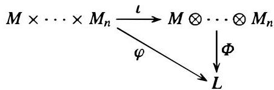

Put another way, composition with  $\psi$  induces a map

$$
\psi^ {\prime}: \operatorname {H o m} _ {R} (D, L) \longrightarrow \operatorname {H o m} _ {R} (D, M)
$$

$$
f \longmapsto f ^ {\prime} = \psi \circ f.
$$

Recall that, by Proposition 2,  $\operatorname{Hom}_R(D, L)$  and  $\operatorname{Hom}_R(D, M)$  are abelian groups.

**Proposition 27.** Let  $D, L$  and  $M$  be  $R$ -modules and let  $\psi : L \to M$  be an  $R$ -module homomorphism. Then the map

$$
\psi^ {\prime}: \operatorname {H o m} _ {R} (D, L) \longrightarrow \operatorname {H o m} _ {R} (D, M)
$$

$$
f \longmapsto f ^ {\prime} = \psi \circ f
$$

is a homomorphism of abelian groups. If  $\psi$  is injective, then  $\psi'$  is also injective, i.e.,

$$
\text{if} \quad 0 \longrightarrow L \xrightarrow {\psi} M \quad \text{is exact},
$$

$$
\text{then} \quad 0 \longrightarrow \operatorname {H o m} _ {R} (D, L) \xrightarrow {\psi^ {\prime}} \operatorname {H o m} _ {R} (D, M) \quad \text{is also exact}.
$$

**Proof:** The fact that  $\psi'$  is a homomorphism is immediate. If  $\psi$  is injective, then distinct homomorphisms  $f$  and  $g$  from  $D$  into  $L$  give distinct homomorphisms  $\psi \circ f$  and  $\psi \circ g$  from  $D$  into  $M$ , which is to say that  $\psi'$  is also injective.

While obtaining homomorphisms into  $M$  from homomorphisms into the submodule  $L$  is straightforward, the situation for homomorphisms into the quotient  $N$  is much less evident. More precisely, given an  $R$ -module homomorphism  $f: D \to N$  the question is whether there exists an  $R$ -module homomorphism  $F: D \to M$  that extends or lifts  $f$  to  $M$ , i.e., that makes the following diagram commute:

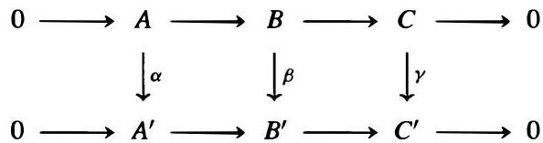

As before, composition with the homomorphism  $\varphi$  induces a homomorphism of abelian groups

$$
\varphi^ {\prime}: \operatorname {H o m} _ {R} (D, M) \longrightarrow \operatorname {H o m} _ {R} (D, N)
$$

$$
F \longmapsto F ^ {\prime} = \varphi \circ F.
$$

In terms of  $\varphi'$ , the homomorphism  $f$  to  $N$  lifts to a homomorphism to  $M$  if and only if  $f$  is in the image of  $\varphi'$  (namely,  $f$  is the image of the lift  $F$ ).

In general it may not be possible to lift a homomorphism $f$ from $D$ to $N$ to a homomorphism from $D$ to $M$. For example, consider the nonsplit exact sequence $0 \to \mathbb{Z} \xrightarrow{2} \mathbb{Z} \xrightarrow{\pi} \mathbb{Z}/2\mathbb{Z} \to 0$ from the previous set of examples. Let $D = \mathbb{Z}/2\mathbb{Z}$ and let $f$ be the identity map from $D$ into $N$. Any homomorphism $F$ of $D$ into $M = \mathbb{Z}$ must map $D$ to 0 (since $\mathbb{Z}$ has no elements of order 2), hence $\pi \circ F$ maps $D$ to 0 in $N$, and in particular, $\pi \circ F \neq f$. Phrased in terms of the map $\varphi'$, this shows that

$$
\text{if } M \xrightarrow{\varphi} N \longrightarrow 0 \quad \text{is exact,}
$$

$$
\text{then } \operatorname{Hom}_R(D, M) \xrightarrow{\varphi'} \operatorname{Hom}_R(D, N) \longrightarrow 0 \quad \text{is not necessarily exact.}
$$

These results relating the homomorphisms into $L$ and $N$ to the homomorphisms into $M$ can be neatly summarized as part of the following theorem.

Theorem 28. Let $D, L, M,$ and $N$ be $R$-modules. If

$$
0 \longrightarrow L \xrightarrow{\psi} M \xrightarrow{\varphi} N \longrightarrow 0 \quad \text{is exact,}
$$

then the associated sequence

$$
0 \rightarrow \operatorname{Hom}_R(D, L) \xrightarrow{\psi'} \operatorname{Hom}_R(D, M) \xrightarrow{\varphi'} \operatorname{Hom}_R(D, N) \quad \text{is exact.} \tag{10.10}
$$

A homomorphism $f: D \to N$ lifts to a homomorphism $F: D \to M$ if and only if $f \in \operatorname{Hom}_R(D, N)$ is in the image of $\varphi'$. In general $\varphi': \operatorname{Hom}_R(D, M) \to \operatorname{Hom}_R(D, N)$ need not be surjective; the map $\varphi'$ is surjective if and only if every homomorphism from $D$ to $N$ lifts to a homomorphism from $D$ to $M$, in which case the sequence (10) can be extended to a short exact sequence.

The sequence (10) is exact for all $R$-modules $D$ if and only if the sequence

$$
0 \to L \xrightarrow{\psi} M \xrightarrow{\varphi} N \quad \text{is exact.}
$$

Proof: The only item in the first statement that has not already been proved is the exactness of (10) at $\mathrm{Hom}_R(D,M)$, i.e., $\ker \varphi' = \operatorname{image} \psi'$. Suppose $F: D \to M$ is an element of $\mathrm{Hom}_R(D,M)$ lying in the kernel of $\varphi'$, i.e., with $\varphi \circ F = 0$ as homomorphisms from $D$ to $N$. If $d \in D$ is any element of $D$, this implies that $\varphi(F(d)) = 0$ and $F(d) \in \ker \varphi$. By the exactness of the sequence defining the extension $M$ we have $\ker \varphi = \operatorname{image} \psi$, so there is some element $l \in L$ with $F(d) = \psi(l)$. Since $\psi$ is injective, the element $l$ is unique, so this gives a well defined map $F': D \to L$ given by $F'(d) = l$. It is an easy check to verify that $F'$ is a homomorphism, i.e., $F' \in \mathrm{Hom}_R(D,L)$. Since $\psi \circ F'(d) = \psi(l) = F(d)$, we have $F = \psi'(F')$ which shows that $F$ is in the image of $\psi'$, proving that $\ker \varphi' \subseteq \operatorname{image} \psi'$. Conversely, if $F$ is in the image of $\psi'$ then $F = \psi'(F')$ for some $F' \in \mathrm{Hom}_R(D,L)$ and so $\varphi(F(d)) = \varphi(\psi(F'(d)))$ for any $d \in D$. Since $\ker \varphi = \operatorname{image} \psi$ we have $\varphi \circ \psi = 0$, and it follows that $\varphi(F(d)) = 0$ for any $d \in D$, i.e., $\varphi'(F) = 0$. Hence $F$ is in the kernel of $\varphi'$, proving the reverse containment: $\operatorname{image} \psi' \subseteq \ker \varphi'$.

For the last statement in the theorem, note first that the surjectivity of $\varphi$ was not required for the proof that (10) is exact, so the "if" portion of the statement has already

been proved. For the converse, suppose that the sequence (10) is exact for all $R$-modules $D$. In general, $\operatorname{Hom}_R(R, X) \cong X$ for any left $R$-module $X$, the isomorphism being given by mapping a homomorphism to its value on the element $1 \in R$ (cf. Exercise 10(b)). Taking $D = R$ in (10), the exactness of the sequence $0 \to L \xrightarrow{\psi} M \xrightarrow{\varphi} N$ follows easily.

By Theorem 28, the sequence

$$
0 \longrightarrow \operatorname {H o m} _ {R} (D, L) \xrightarrow {\psi^ {\prime}} \operatorname {H o m} _ {R} (D, M) \xrightarrow {\varphi^ {\prime}} \operatorname {H o m} _ {R} (D, N) \longrightarrow 0 \tag {10.11}
$$

is in general not a short exact sequence since the homomorphism $\varphi'$ need not be surjective. The question of whether this sequence is exact precisely measures the extent to which the homomorphisms from $D$ into $M$ are uniquely determined by pairs of homomorphisms from $D$ into $L$ and $D$ into $N$. More precisely, this sequence is exact if and only if there is a bijection $F \leftrightarrow (g, f)$ between homomorphisms $F: D \to M$ and pairs of homomorphisms $g: D \to L$ and $f: D \to N$ given by $F|_{\psi(L)} = \psi'(g)$ and $f = \varphi'(F)$.

One situation in which the sequence (11) is exact occurs when the original sequence $0 \to L \to M \to N \to 0$ is a split exact sequence, i.e., when $M = L \oplus N$. In this case the sequence (11) is also a split exact sequence, as the first part of the following proposition shows.

**Proposition 29.** Let $D, L$ and $N$ be $R$-modules. Then

(1) $\operatorname{Hom}_R(D, L \oplus N) \cong \operatorname{Hom}_R(D, L) \oplus \operatorname{Hom}_R(D, N)$, and
(2) $\operatorname{Hom}_R(L \oplus N, D) \cong \operatorname{Hom}_R(L, D) \oplus \operatorname{Hom}_R(N, D)$.

**Proof:** Let $\pi_1: L \oplus N \to L$ be the natural projection from $L \oplus N$ to $L$ and similarly let $\pi_2$ be the natural projection to $N$. If $f \in \operatorname{Hom}_R(D, L \oplus N)$ then the compositions $\pi_1 \circ f$ and $\pi_2 \circ f$ give elements in $\operatorname{Hom}_R(D, L)$ and $\operatorname{Hom}_R(D, N)$, respectively. This defines a map from $\operatorname{Hom}_R(D, L \oplus N)$ to $\operatorname{Hom}_R(D, L) \oplus \operatorname{Hom}_R(D, N)$ which is easily seen to be a homomorphism. Conversely, given $f_1 \in \operatorname{Hom}_R(D, L)$ and $f_2 \in \operatorname{Hom}_R(D, N)$, define the map $f \in \operatorname{Hom}_R(D, L \oplus N)$ by $f(d) = (f_1(d), f_2(d))$. This defines a map from $\operatorname{Hom}_R(D, L) \oplus \operatorname{Hom}_R(D, N)$ to $\operatorname{Hom}_R(D, L \oplus N)$ that is easily checked to be a homomorphism inverse to the map above, proving the isomorphism in (1). The proof of (2) is similar and is left as an exercise.

The results in Proposition 29 extend immediately by induction to any finite direct sum of $R$-modules. These results are referred to by saying that $\operatorname{Hom}$ commutes with finite direct sums in either variable (compare to Theorem 17 for a corresponding result for tensor products). For infinite direct sums the situation is more complicated. Part (1) remains true if $L \oplus N$ is replaced by an arbitrary direct sum and the direct sum on the right hand side is replaced by a direct product (Exercise 13 shows that the direct product is necessary). Part (2) remains true if the direct sums on both sides are replaced by direct products.

This proposition shows that if the sequence

$$
0 \longrightarrow L \xrightarrow {\psi} M \xrightarrow {\varphi} N \longrightarrow 0
$$

is a split short exact sequence of  $R$ -modules, then

$$
0 \longrightarrow \operatorname {H o m} _ {R} (D, L) \xrightarrow {\psi^ {\prime}} \operatorname {H o m} _ {R} (D, M) \xrightarrow {\varphi^ {\prime}} \operatorname {H o m} _ {R} (D, N) \longrightarrow 0
$$

is also a split short exact sequence of abelian groups for every  $R$ -module  $D$ . Exercise 14 shows that a converse holds: if  $0 \to \operatorname{Hom}_R(D, L) \xrightarrow{\psi'} \operatorname{Hom}_R(D, M) \xrightarrow{\varphi'} \operatorname{Hom}_R(D, N) \to 0$  is exact for every  $R$ -module  $D$  then  $0 \to L \xrightarrow{\psi} M \xrightarrow{\varphi} N \to 0$  is a split short exact sequence (which then implies that if the original Hom sequence is exact for every  $D$ , then in fact it is split exact for every  $D$ ).

Proposition 29 identifies a situation in which the sequence (11) is exact in terms of the modules  $L$ ,  $M$ , and  $N$ . The next result adopts a slightly different perspective, characterizing instead the modules  $D$  having the property that the sequence (10) in Theorem 28 can always be extended to a short exact sequence:

Proposition 30. Let  $P$  be an  $R$ -module. Then the following are equivalent:

(1) For any  $R$ -modules  $L, M$ , and  $N$ , if

$$
0 \longrightarrow L \xrightarrow {\psi} M \xrightarrow {\varphi} N \longrightarrow 0
$$

is a short exact sequence, then

$$
0 \longrightarrow \operatorname {H o m} _ {R} (P, L) \xrightarrow {\psi^ {\prime}} \operatorname {H o m} _ {R} (P, M) \xrightarrow {\varphi^ {\prime}} \operatorname {H o m} _ {R} (P, N) \longrightarrow 0
$$

is also a short exact sequence.

(2) For any  $R$ -modules  $M$  and  $N$ , if  $M \xrightarrow{\varphi} N \to 0$  is exact, then every  $R$ -module homomorphism from  $P$  into  $N$  lifts to an  $R$ -module homomorphism into  $M$ , i.e., given  $f \in \operatorname{Hom}_R(P, N)$  there is a lift  $F \in \operatorname{Hom}_R(P, M)$  making the following diagram commute:

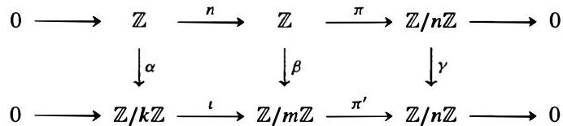

(3) If  $P$  is a quotient of the  $R$ -module  $M$  then  $P$  is isomorphic to a direct summand of  $M$ , i.e., every short exact sequence  $0 \to L \to M \to P \to 0$  splits.
(4)  $P$  is a direct summand of a free  $R$ -module.

Proof: The equivalence of (1) and (2) is a restatement of a result in Theorem 28. Suppose now that (2) is satisfied, and let  $0 \to L \xrightarrow{\psi} M \xrightarrow{\varphi} P \to 0$  be exact. By (2), the identity map from  $P$  to  $P$  lifts to a homomorphism  $\mu$  making the following diagram commute:

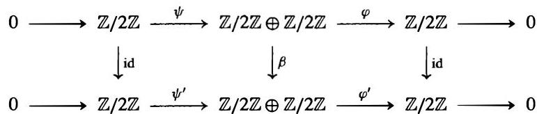

Then  $\varphi \circ \mu = 1$ , so  $\mu$  is a splitting homomorphism for the sequence, which proves (3).

Every module  $P$  is the quotient of a free module (for example, the free module on the

set of elements in $P$), so there is always an exact sequence $0 \to \ker \varphi \to \mathcal{F} \stackrel{\varphi}{\to} P \to 0$ where $\mathcal{F}$ is a free $R$-module (cf. Example 4 following Corollary 23). If (3) is satisfied, then this sequence splits, so $\mathcal{F}$ is isomorphic to the direct sum of $\ker \varphi$ and $P$, which proves (4).

Finally, to prove (4) implies (2), suppose that $P$ is a direct summand of a free $R$-module on some set $S$, say $\mathcal{F}(S) = P \oplus K$, and that we are given a homomorphism $f$ from $P$ to $N$ as in (2). Let $\pi$ denote the natural projection from $\mathcal{F}(S)$ to $P$, so that $f \circ \pi$ is a homomorphism from $\mathcal{F}(S)$ to $N$. For any $s \in S$ define $n_s = f \circ \pi(s) \in N$ and let $m_s \in M$ be any element of $M$ with $\varphi(m_s) = n_s$ (which exists because $\varphi$ is surjective). By the universal property for free modules (Theorem 6 of Section 3), there is a unique $R$-module homomorphism $F'$ from $\mathcal{F}(S)$ to $M$ with $F'(s) = m_s$. The diagram is the following:

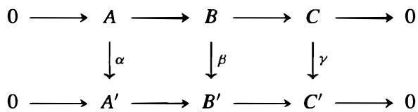

By definition of the homomorphism $F'$ we have $\varphi \circ F'(s) = \varphi(m_s) = n_s = f \circ \pi(s)$, from which it follows that $\varphi \circ F' = f \circ \pi$ on $\mathcal{F}(S)$, i.e., the diagram above is commutative. Now define a map $F: P \to M$ by $F(d) = F'((d,0))$. Since $F$ is the composite of the injection $P \to \mathcal{F}(S)$ with the homomorphism $F'$, it follows that $F$ is an $R$-module homomorphism. Then

$$
\varphi \circ F (d) = \varphi \circ F ^ {\prime} ((d, 0)) = f \circ \pi ((d, 0)) = f (d)
$$

i.e., $\varphi \circ F = f$, so the diagram

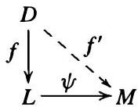

commutes, which proves that (4) implies (2) and completes the proof.

**Definition.** An $R$-module $P$ is called *projective* if it satisfies any of the equivalent conditions of Proposition 30.

The third statement in Proposition 30 can be rephrased as saying that any module $M$ that projects onto $P$ has (an isomorphic copy of) $P$ as a direct summand, which explains the terminology.

The following result is immediate from Proposition 30 (and its proof):

**Corollary 31.** Free modules are projective. A finitely generated module is projective if and only if it is a direct summand of a finitely generated free module. Every module is a quotient of a projective module.

If $D$ is fixed, then given any $R$-module $X$ we have an associated abelian group $\operatorname{Hom}_R(D, X)$. Further, an $R$-module homomorphism $\alpha : X \to Y$ induces an abelian group homomorphism $\alpha' : \operatorname{Hom}_R(D, X) \to \operatorname{Hom}_R(D, Y)$, defined by $\alpha'(f) = \alpha \circ f$. Put another way, the map $\operatorname{Hom}_R(D, \underline{\cdot})$ is a covariant functor from the category of $R$-modules to the category of abelian groups (cf. Appendix II). Theorem 28 shows that applying this functor to the terms in the exact sequence

$$
0 \longrightarrow L \xrightarrow {\psi} M \xrightarrow {\varphi} N \longrightarrow 0
$$

produces an exact sequence

$$
0 \to \operatorname {H o m} _ {R} (D, L) \xrightarrow {\psi^ {\prime}} \operatorname {H o m} _ {R} (D, M) \xrightarrow {\varphi^ {\prime}} \operatorname {H o m} _ {R} (D, N).
$$

This is referred to by saying that $\operatorname{Hom}_R(D, \underline{\cdot})$ is a left exact functor. By Proposition 30, the functor $\operatorname{Hom}_R(D, \underline{\cdot})$ is exact, i.e., always takes short exact sequences to short exact sequences, if and only if $D$ is projective. We summarize this as

Corollary 32. If $D$ is an $R$-module, then the functor $\operatorname{Hom}_R(D, \underline{\cdot})$ from the category of $R$-modules to the category of abelian groups is left exact. It is exact if and only if $D$ is a projective $R$-module.

Note that if $\operatorname{Hom}_R(D, \underline{\cdot})$ takes short exact sequences to short exact sequences, then it takes exact sequences of any length to exact sequences since any exact sequence can be broken up into a succession of short exact sequences.

As we have seen, the functor $\operatorname{Hom}_R(D, \underline{\cdot})$ is in general not exact on the right. Measuring the extent to which functors such as $\operatorname{Hom}_R(D, \underline{\cdot})$ fail to be exact leads to the notions of "homological algebra," considered in Chapter 17.

## Examples

(1) We shall see in Section 11.1 that if $R = F$ is a field then every $F$-module is projective (although we only prove this for finitely generated modules).

(2) By Corollary 31, $\mathbb{Z}$ is a projective $\mathbb{Z}$-module. This can be seen directly as follows: suppose $f$ is a map from $\mathbb{Z}$ to $N$ and $M \xrightarrow{\varphi} N \to 0$ is exact. The homomorphism $f$ is uniquely determined by the value $n = f(1)$. Then $f$ can be lifted to a homomorphism $F: \mathbb{Z} \to M$ by first defining $F(1) = m$, where $m$ is any element in $M$ mapped to $n$ by $\varphi$, and then extending $F$ to all of $\mathbb{Z}$ by additivity.

By the first statement in Proposition 30, since $\mathbb{Z}$ is projective, if

$$
0 \longrightarrow L \xrightarrow {\psi} M \xrightarrow {\varphi} N \longrightarrow 0
$$

is an exact sequence of $\mathbb{Z}$-modules, then

$$
0 \longrightarrow \operatorname {H o m} _ {\mathbb {Z}} (\mathbb {Z}, L) \xrightarrow {\psi^ {\prime}} \operatorname {H o m} _ {\mathbb {Z}} (\mathbb {Z}, M) \xrightarrow {\varphi^ {\prime}} \operatorname {H o m} _ {\mathbb {Z}} (\mathbb {Z}, N) \longrightarrow 0
$$

is also an exact sequence. This can also be seen directly using the isomorphism $\operatorname{Hom}_{\mathbb{Z}}(\mathbb{Z}, M) \cong M$ of abelian groups, which shows that the two exact sequences above are essentially the same.

(3) Free $\mathbb{Z}$-modules have no nonzero elements of finite order so no nonzero finite abelian group can be isomorphic to a submodule of a free module. By Corollary 31 it follows that no nonzero finite abelian group is a projective $\mathbb{Z}$-module.

(4) As a particular case of the preceding example, we see that for $n \geq 2$ the $\mathbb{Z}$-module $\mathbb{Z}/n\mathbb{Z}$ is not projective. By Theorem 28 it must be possible to find a short exact sequence which after applying the functor $\mathrm{Hom}_{\mathbb{Z}}(\mathbb{Z}/n\mathbb{Z}, \_)$ is no longer exact on the right. One such sequence is the exact sequence of Example 2 following Corollary 23:

$$
0 \longrightarrow \mathbb{Z} \xrightarrow{n} \mathbb{Z} \xrightarrow{\pi} \mathbb{Z}/n\mathbb{Z} \longrightarrow 0,
$$

for $n \geq 2$. Note first that $\mathrm{Hom}_{\mathbb{Z}}(\mathbb{Z}/n\mathbb{Z}, \mathbb{Z}) = 0$ since there are no nonzero $\mathbb{Z}$-module homomorphisms from $\mathbb{Z}/n\mathbb{Z}$ to $\mathbb{Z}$. It is also easy to see that $\mathrm{Hom}_{\mathbb{Z}}(\mathbb{Z}/n\mathbb{Z}, \mathbb{Z}/n\mathbb{Z}) \cong \mathbb{Z}/n\mathbb{Z}$, as follows. Every homomorphism $f$ is uniquely determined by $f(1) = a \in \mathbb{Z}/n\mathbb{Z}$, and given any $a \in \mathbb{Z}/n\mathbb{Z}$ there is a unique homomorphism $f_a$ with $f_a(1) = a$; the map $f_a \mapsto a$ is easily checked to be an isomorphism from $\mathrm{Hom}_{\mathbb{Z}}(\mathbb{Z}/n\mathbb{Z}, \mathbb{Z}/n\mathbb{Z})$ to $\mathbb{Z}/n\mathbb{Z}$.

Applying $\mathrm{Hom}_{\mathbb{Z}}(\mathbb{Z}/n\mathbb{Z}, \_)$ to the short exact sequence above thus gives the sequence

$$
0 \longrightarrow 0 \xrightarrow{n'} 0 \xrightarrow{\pi'} \mathbb{Z}/n\mathbb{Z} \longrightarrow 0
$$

which is not exact at its only nonzero term.

(5) Since $\mathbb{Q}/\mathbb{Z}$ is a torsion $\mathbb{Z}$-module it is not a submodule of a free $\mathbb{Z}$-module, hence is not projective. Note also that the exact sequence $0 \to \mathbb{Z} \to \mathbb{Q} \xrightarrow{\pi} \mathbb{Q}/\mathbb{Z} \to 0$ does not split since $\mathbb{Q}$ contains no submodule isomorphic to $\mathbb{Q}/\mathbb{Z}$.

(6) The $\mathbb{Z}$-module $\mathbb{Q}$ is not projective (cf. the exercises).

(7) We shall see in Chapter 12 that a finitely generated $\mathbb{Z}$-module is projective if and only if it is free.

(8) Let $R$ be the commutative ring $\mathbb{Z}/2\mathbb{Z} \times \mathbb{Z}/2\mathbb{Z}$ under componentwise addition and multiplication. If $P_1$ and $P_2$ are the principal ideals generated by $(1,0)$ and $(0,1)$ respectively then $R = P_1 \oplus P_2$, hence both $P_1$ and $P_2$ are projective $R$-modules by Proposition 30. Neither $P_1$ nor $P_2$ is free, since any free module has order a multiple of four.

(9) The direct sum of two projective modules is again projective (cf. Exercise 3).

(10) We shall see in Part VI that if $F$ is any field and $n \in \mathbb{Z}^+$ then the ring $R = M_n(F)$ of all $n \times n$ matrices with entries from $F$ has the property that every $R$-module is projective. We shall also see that if $G$ is a finite group of order $n$ and $n \neq 0$ in the field $F$ then the group ring $FG$ also has the property that every module is projective.

## Injective Modules and $\mathbf{Hom}_R(\_, D)$

If $0 \longrightarrow L \xrightarrow{\psi} M \xrightarrow{\varphi} N \longrightarrow 0$ is a short exact sequence of $R$-modules then, instead of considering maps from an $R$-module $D$ into $L$ or $N$ and the extent to which these determine maps from $D$ into $M$, we can consider the "dual" question of maps from $L$ or $N$ to $D$. In this case, it is easy to dispose of the situation of a map from $N$ to $D$: an $R$-module map from $N$ to $D$ immediately gives a map from $M$ to $D$ simply by composing with $\varphi$. It is easy to check that this defines an injective homomorphism of abelian groups

$$
\varphi': \operatorname{Hom}_R(N, D) \longrightarrow \operatorname{Hom}_R(M, D)
$$

$$
f \longmapsto f' = f \circ \varphi,
$$

or, put another way,

$$
\text{if} \quad M \xrightarrow{\varphi} N \to 0 \quad \text{is exact},
$$

$$
\text{then} \quad 0 \to \operatorname{Hom}_R(N, D) \xrightarrow{\varphi'} \operatorname{Hom}_R(M, D) \quad \text{is exact}.
$$

(Note that the associated maps on the homomorphism groups are in the reverse direction from the original maps.)

On the other hand, given an $R$-module homomorphism $f$ from $L$ to $D$ it may not be possible to extend $f$ to a map $F$ from $M$ to $D$, i.e., given $f$ it may not be possible to find a map $F$ making the following diagram commute:

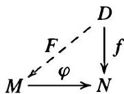

For example, consider the exact sequence $0 \longrightarrow \mathbb{Z} \xrightarrow{\psi} \mathbb{Z} \xrightarrow{\varphi} \mathbb{Z}/2\mathbb{Z} \longrightarrow 0$ of $\mathbb{Z}$-modules, where $\psi$ is multiplication by 2 and $\varphi$ is the natural projection. Take $D = \mathbb{Z}/2\mathbb{Z}$ and let $f: \mathbb{Z} \to \mathbb{Z}/2\mathbb{Z}$ be reduction modulo 2 on the first $\mathbb{Z}$ in the sequence. There is only one nonzero homomorphism $F$ from the second $\mathbb{Z}$ in the sequence to $\mathbb{Z}/2\mathbb{Z}$ (namely, reduction modulo 2), but this $F$ does not lift the map $f$ since $F \circ \psi(\mathbb{Z}) = F(2\mathbb{Z}) = 0$, so $F \circ \psi \neq f$.

Composition with $\psi$ induces an abelian group homomorphism $\psi'$ from $\operatorname{Hom}_R(M, D)$ to $\operatorname{Hom}_R(L, D)$, and in terms of the map $\psi'$, the homomorphism $f \in \operatorname{Hom}_R(L, D)$ can be lifted to a homomorphism from $M$ to $D$ if and only if $f$ is in the image of $\psi'$. The example above shows that

$$
\text{if} \quad 0 \longrightarrow L \xrightarrow{\psi} M \quad \text{is exact},
$$

$$
\text{then} \quad \operatorname{Hom}_R(M, D) \xrightarrow{\psi'} \operatorname{Hom}_R(L, D) \longrightarrow 0 \quad \text{is not necessarily exact}.
$$

We can summarize these results in the following dual version of Theorem 28:

Theorem 33. Let $D, L, M$, and $N$ be $R$-modules. If

$$
0 \longrightarrow L \xrightarrow{\psi} M \xrightarrow{\varphi} N \longrightarrow 0 \quad \text{is exact},
$$

then the associated sequence

$$
0 \to \operatorname{Hom}_R(N, D) \xrightarrow{\varphi'} \operatorname{Hom}_R(M, D) \xrightarrow{\psi'} \operatorname{Hom}_R(L, D) \quad \text{is exact}. \tag{10.12}
$$

A homomorphism $f: L \to D$ lifts to a homomorphism $F: M \to D$ if and only if $f \in \operatorname{Hom}_R(L, D)$ is in the image of $\psi'$. In general $\psi': \operatorname{Hom}_R(M, D) \to \operatorname{Hom}_R(L, D)$ need not be surjective; the map $\psi'$ is surjective if and only if every homomorphism from $L$ to $D$ lifts to a homomorphism from $M$ to $D$, in which case the sequence (12) can be extended to a short exact sequence.

The sequence (12) is exact for all $R$-modules $D$ if and only if the sequence

$$
L \xrightarrow{\psi} M \xrightarrow{\varphi} N \to 0 \quad \text{is exact}.
$$

Proof: The only item remaining to be proved in the first statement is the exactness of (12) at $\operatorname{Hom}_R(M, D)$. The proof of this statement is very similar to the proof of the corresponding result in Theorem 28 and is left as an exercise. Note also that the injectivity of $\psi$ is not required, which proves the "if" portion of the final statement of the theorem.

Suppose now that the sequence (12) is exact for all $R$-modules $D$. We first show that $\varphi : M \to N$ is a surjection. Take $D = N / \varphi(M)$. If $\pi_1 : N \to N / \varphi(M)$ is the natural projection homomorphism, then $\pi_1 \circ \varphi(M) = 0$ by definition of $\pi_1$. Since $\pi_1 \circ \varphi = \varphi'(\pi_1)$, this means that the element $\pi_1 \in \operatorname{Hom}_R(N, N / \varphi(M))$ is mapped to 0 by $\varphi'$. Since $\varphi'$ is assumed to be injective for all modules $D$, this means $\pi_1$ is the zero map, i.e., $N = \varphi(M)$ and so $\varphi$ is a surjection. We next show that $\varphi \circ \psi = 0$, which will imply that image $\psi \subseteq \ker \varphi$. For this we take $D = N$ and observe that the identity map $id_N$ on $N$ is contained in $\operatorname{Hom}_R(N, N)$, hence $\varphi'(id_N) \in \operatorname{Hom}_R(M, N)$. Then the exactness of (12) for $D = N$ implies that $\varphi'(id_N) \in \ker \psi'$, so $\psi'(\varphi'(id_N)) = 0$. Then $id_N \circ \psi \circ \varphi = 0$, i.e., $\psi \circ \varphi = 0$, as claimed. Finally, we show that $\ker \varphi \subseteq \operatorname{image} \psi$. Let $D = M / \psi(L)$ and let $\pi_2 : M \to M / \psi(L)$ be the natural projection. Then $\psi'(\pi_2) = 0$ since $\pi_2(\psi(L)) = 0$ by definition of $\pi_2$. The exactness of (12) for this $D$ then implies that $\pi_2$ is in the image of $\varphi'$, say $\pi_2 = \varphi'(f)$ for some homomorphism $f \in \operatorname{Hom}_R(N, M / \psi(L))$, i.e., $\pi_2 = f \circ \varphi$. If $m \in \ker \varphi$ then $\pi_2(m) = f(\varphi(m)) = 0$, which means that $m \in \psi(L)$ since $\pi_2$ is just the projection from $M$ into the quotient $M / \psi(L)$. Hence $\ker \varphi \subseteq \operatorname{image} \psi$, completing the proof.

By Theorem 33, the sequence

$$
0 \longrightarrow \operatorname{Hom}_R(N, D) \xrightarrow{\varphi'} \operatorname{Hom}_R(M, D) \xrightarrow{\psi'} \operatorname{Hom}_R(L, D) \longrightarrow 0
$$

is in general not a short exact sequence since $\psi'$ need not be surjective, and the question of whether this sequence is exact precisely measures the extent to which homomorphisms from $M$ to $D$ are uniquely determined by pairs of homomorphisms from $L$ and $N$ to $D$.

The second statement in Proposition 29 shows that this sequence is exact when the original exact sequence $0 \to L \to M \to N \to 0$ is a split exact sequence. In fact in this case the sequence $0 \to \operatorname{Hom}_R(N, D) \xrightarrow{\varphi'} \operatorname{Hom}_R(M, D) \xrightarrow{\psi'} \operatorname{Hom}_R(L, D) \to 0$ is also a split exact sequence of abelian groups for every $R$-module $D$. Exercise 14 shows that a converse holds: if $0 \to \operatorname{Hom}_R(N, D) \xrightarrow{\varphi'} \operatorname{Hom}_R(M, D) \xrightarrow{\psi'} \operatorname{Hom}_R(L, D) \to 0$ is exact for every $R$-module $D$ then $0 \to L \xrightarrow{\psi} M \xrightarrow{\varphi} N \to 0$ is a split short exact sequence (which then implies that if the Hom sequence is exact for every $D$, then in fact it is split exact for every $D$).

There is also a dual version of the first three parts of Proposition 30, which describes the $R$-modules $D$ having the property that the sequence (12) in Theorem 33 can always be extended to a short exact sequence:

Proposition 34. Let $Q$ be an $R$-module. Then the following are equivalent:

(1) For any $R$-modules $L, M$, and $N$, if

$$
0 \longrightarrow L \xrightarrow{\psi} M \xrightarrow{\varphi} N \longrightarrow 0
$$

is a short exact sequence, then

$$
0 \longrightarrow \operatorname {H o m} _ {R} (N, Q) \xrightarrow {\psi^ {\prime}} \operatorname {H o m} _ {R} (M, Q) \xrightarrow {\psi^ {\prime}} \operatorname {H o m} _ {R} (L, Q) \longrightarrow 0
$$

is also a short exact sequence.

(2) For any  $R$ -modules  $L$  and  $M$ , if  $0 \to L \xrightarrow{\psi} M$  is exact, then every  $R$ -module homomorphism from  $L$  into  $Q$  lifts to an  $R$ -module homomorphism of  $M$  into  $Q$ , i.e., given  $f \in \operatorname{Hom}_R(L, Q)$  there is a lift  $F \in \operatorname{Hom}_R(M, Q)$  making the following diagram commute:

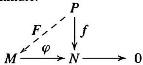

(3) If  $Q$  is a submodule of the  $R$ -module  $M$  then  $Q$  is a direct summand of  $M$ , i.e., every short exact sequence  $0 \to Q \to M \to N \to 0$  splits.

Proof: The equivalence of (1) and (2) is part of Theorem 33. Suppose now that (2) is satisfied and let  $0 \to Q \xrightarrow{\psi} M \xrightarrow{\psi} N \to 0$  be exact. Taking  $L = Q$  and  $f$  the identity map from  $Q$  to itself, it follows by (2) that there is a homomorphism  $F: M \to Q$  with  $F \circ \psi = 1$ , so  $F$  is a splitting homomorphism for the sequence, which proves (3). The proof that (3) implies (2) is outlined in the exercises.

Definition. An  $R$ -module  $Q$  is called injective if it satisfies any of the equivalent conditions of Proposition 34.

The third statement in Proposition 34 can be rephrased as saying that any module  $M$  into which  $Q$  injects has (an isomorphic copy of)  $Q$  as a direct summand, which explains the terminology.

If  $D$  is fixed, then given any  $R$ -module  $X$  we have an associated abelian group  $\operatorname{Hom}_R(X, D)$ . Further, an  $R$ -module homomorphism  $\alpha : X \to Y$  induces an abelian group homomorphism  $\alpha' : \operatorname{Hom}_R(Y, D) \to \operatorname{Hom}_R(X, D)$ , defined by  $\alpha'(f) = f \circ \alpha$ , that "reverses" the direction of the arrow. Put another way, the map  $\operatorname{Hom}_R(D, \underline{\cdot})$  is a contravariant functor from the category of  $R$ -modules to the category of abelian groups (cf. Appendix II). Theorem 33 shows that applying this functor to the terms in the exact sequence

$$
0 \longrightarrow L \xrightarrow {\psi} M \xrightarrow {\psi} N \longrightarrow 0
$$

produces an exact sequence

$$
0 \to \operatorname {H o m} _ {R} (N, D) \xrightarrow {\psi^ {\prime}} \operatorname {H o m} _ {R} (M, D) \xrightarrow {\psi^ {\prime}} \operatorname {H o m} _ {R} (L, D).
$$

This is referred to by saying that  $\mathrm{Hom}_R(\_, D)$  is a left exact (contravariant) functor. Note that the functor  $\mathrm{Hom}_R(\_, D)$  and the functor  $\mathrm{Hom}_R(D, \_)$  considered earlier

are both left exact; the former reverses the directions of the maps in the original short exact sequence, the latter maintains the directions of the maps.

By Proposition 34, the functor $\operatorname{Hom}_R(\_, D)$ is exact, i.e., always takes short exact sequences to short exact sequences (and hence exact sequences of any length to exact sequences), if and only if $D$ is injective. We summarize this in the following proposition, which is dual to the covariant result of Corollary 32.

Corollary 35. If $D$ is an $R$-module, then the functor $\operatorname{Hom}_R(\_, D)$ from the category of $R$-modules to the category of abelian groups is left exact. It is exact if and only if $D$ is an injective $R$-module.

We have seen that an $R$-module is projective if and only if it is a direct summand of a free $R$-module. Providing such a simple characterization of injective $R$-modules is not so easy. The next result gives a criterion for $Q$ to be an injective $R$-module (a result due to Baer, who introduced the notion of injective modules around 1940), and using it we can give a characterization of injective modules when $R = \mathbb{Z}$ (or, more generally, when $R$ is a P.I.D.). Recall that a $\mathbb{Z}$-module $A$ (i.e., an abelian group, written additively) is said to be divisible if $A = nA$ for all nonzero integers $n$. For example, both $\mathbb{Q}$ and $\mathbb{Q} / \mathbb{Z}$ are divisible (cf. Exercises 18 and 19 in Section 2.4 and Exercise 15 in Section 3.1).

Proposition 36. Let $Q$ be an $R$-module.

(1) (Baer's Criterion) The module $Q$ is injective if and only if for every left ideal $I$ of $R$ any $R$-module homomorphism $g: I \to Q$ can be extended to an $R$-module homomorphism $G: R \to Q$.

(2) If $R$ is a P.I.D. then $Q$ is injective if and only if $rQ = Q$ for every nonzero $r \in R$. In particular, a $\mathbb{Z}$-module is injective if and only if it is divisible. When $R$ is a P.I.D., quotient modules of injective $R$-modules are again injective.

Proof: If $Q$ is injective and $g: I \to Q$ is an $R$-module homomorphism from the nonzero ideal $I$ of $R$ into $Q$, then $g$ can be extended to an $R$-module homomorphism from $R$ into $Q$ by Proposition 34(2) applied to the exact sequence $0 \to I \to R$, which proves the "only if" portion of (1). Suppose conversely that every homomorphism $g: I \to Q$ can be lifted to a homomorphism $G: R \to Q$. To show that $Q$ is injective we must show that if $0 \to L \to M$ is exact and $f: L \to Q$ is an $R$-module homomorphism then there is a lift $F: M \to Q$ extending $f$. If $S$ is the collection $(f', L')$ of lifts $f': L' \to Q$ of $f$ to a submodule $L'$ of $M$ containing $L$, then the ordering $(f', L') \leq (f'', L'')$ if $L' \subseteq L''$ and $f'' = f'$ on $L'$ partially orders $S$. Since $S \neq \emptyset$, by Zorn's Lemma there is a maximal element $(F, M')$ in $S$. The map $F: M' \to Q$ is a lift of $f$ and it suffices to show that $M' = M$. Suppose that there is some element $m \in M$ not contained in $M'$ and let $I = \{r \in R \mid rm \in M'\}$. It is easy to check that $I$ is a left ideal in $R$, and the map $g: I \to Q$ defined by $g(x) = F(xm)$ is an $R$-module homomorphism from $I$ to $Q$. By hypothesis, there is a lift $G: R \to Q$ of $g$. Consider the submodule $M' + Rm$ of $M$, and define the map $F': M' + Rm \to Q$ by $F'(m' + rm) = F(m') + G(r)$. If $m_1 + r_1m = m_2 + r_2m$ then $(r_1 - r_2)m = m_2 - m_1$

shows that $r_1 - r_2 \in I$, so that

$$
G(r_1 - r_2) = g(r_1 - r_2) = F((r_1 - r_2)m) = F(m_2 - m_1),
$$

and so $F(m_1) + G(r_1) = F(m_2) + G(r_2)$. Hence $F'$ is well defined and it is then immediate that $F'$ is an $R$-module homomorphism extending $f$ to $M' + Rm$. This contradicts the maximality of $M'$, so that $M' = M$, which completes the proof of (1).

To prove (2), suppose $R$ is a P.I.D. Any nonzero ideal $I$ of $R$ is of the form $I = (r)$ for some nonzero element $r$ of $R$. An $R$-module homomorphism $f: I \to Q$ is completely determined by the image $f(r) = q$ in $Q$. This homomorphism can be extended to a homomorphism $F: R \to Q$ if and only if there is an element $q'$ in $Q$ with $F(1) = q'$ satisfying $q = f(r) = F(r) = rq'$. It follows that Baer's criterion for $Q$ is satisfied if and only if $rQ = Q$, which proves the first two statements in (2). The final statement follows since a quotient of a module $Q$ with $rQ = Q$ for all $r \neq 0$ in $R$ has the same property.

## Examples

(1) Since $\mathbb{Z}$ is not divisible, $\mathbb{Z}$ is not an injective $\mathbb{Z}$-module. This also follows from the fact that the exact sequence $0 \longrightarrow \mathbb{Z} \xrightarrow{2} \mathbb{Z} \longrightarrow \mathbb{Z}/2\mathbb{Z} \longrightarrow 0$ corresponding to multiplication by 2 does not split.

(2) The rational numbers $\mathbb{Q}$ is an injective $\mathbb{Z}$-module.

(3) The quotient $\mathbb{Q}/\mathbb{Z}$ of the injective $\mathbb{Z}$-module $\mathbb{Q}$ is an injective $\mathbb{Z}$-module.

(4) It is immediate that a direct sum of divisible $\mathbb{Z}$-modules is again divisible, hence a direct sum of injective $\mathbb{Z}$-modules is again injective. For example, $\mathbb{Q} \oplus \mathbb{Q}/\mathbb{Z}$ is an injective $\mathbb{Z}$-module. (See also Exercise 4).

(5) We shall see in Chapter 12 that no nonzero finitely generated $\mathbb{Z}$-module is injective.

(6) Suppose that the ring $R$ is an integral domain. An $R$-module $A$ is said to be a divisible $R$-module if $rA = A$ for every nonzero $r \in R$. The proof of Proposition 36 shows that in this case an injective $R$-module is divisible.

(7) We shall see in Section 11.1 that if $R = F$ is a field then every $F$-module is injective.

(8) We shall see in Part VI that if $F$ is any field and $n \in \mathbb{Z}^+$ then the ring $R = M_n(F)$ of all $n \times n$ matrices with entries from $F$ has the property that every $R$-module is injective (and also projective). We shall also see that if $G$ is a finite group of order $n$ and $n \neq 0$ in the field $F$ then the group ring $FG$ also has the property that every module is injective (and also projective).

Corollary 37. Every $\mathbb{Z}$-module is a submodule of an injective $\mathbb{Z}$-module.

Proof: Let $M$ be a $\mathbb{Z}$-module and let $A$ be any set of $\mathbb{Z}$-module generators of $M$. Let $\mathcal{F} = F(A)$ be the free $\mathbb{Z}$-module on the set $A$. Then by Theorem 6 there is a surjective $\mathbb{Z}$-module homomorphism from $\mathcal{F}$ to $M$ and if $\mathcal{K}$ denotes the kernel of this homomorphism then $\mathcal{K}$ is a $\mathbb{Z}$-submodule of $\mathcal{F}$ and we can identify $M = \mathcal{F} / \mathcal{K}$. Let $\mathcal{Q}$ be the free $\mathbb{Q}$-module on the set $A$. Then $\mathcal{Q}$ is a direct sum of a number of copies of $\mathbb{Q}$, so is a divisible, hence (by Proposition 36) injective, $\mathbb{Z}$-module containing $\mathcal{F}$. Then $\mathcal{K}$ is also a $\mathbb{Z}$-submodule of $\mathcal{Q}$, so the quotient $\mathcal{Q} / \mathcal{K}$ is injective, again by Proposition 36. Since $M = \mathcal{F} / \mathcal{K} \subseteq \mathcal{Q} / \mathcal{K}$, it follows that $M$ is contained in an injective $\mathbb{Z}$-module.

Corollary 37 can be used to prove the following more general version valid for arbitrary $R$-modules. This theorem is the injective analogue of the results in Theorem 6 and Corollary 31 showing that every $R$-module is a quotient of a projective $R$-module.

Theorem 38. Let $R$ be a ring with 1 and let $M$ be an $R$-module. Then $M$ is contained in an injective $R$-module.

Proof: A proof is outlined in Exercises 15 to 17.

It is possible to prove a sharper result than Theorem 38, namely that there is a minimal injective $R$-module $H$ containing $M$ in the sense that any injective map of $M$ into an injective $R$-module $Q$ factors through $H$. More precisely, if $M \subseteq Q$ for an injective $R$-module $Q$ then there is an injection $\iota : H \hookrightarrow Q$ that restricts to the identity map on $M$; using $\iota$ to identify $H$ as a subset of $Q$ we have $M \subseteq H \subseteq Q$. (cf. Theorem 57.13 in Representation Theory of Finite Groups and Associative Algebras by C. Curtis and I. Reiner, John Wiley & Sons, 1966). This module $H$ is called the injective hull or injective envelope of $M$. The universal property of the injective hull of $M$ with respect to inclusions of $M$ into injective $R$-modules should be compared to the universal property with respect to homomorphisms of $M$ of the free module $F(A)$ on a set of generators $A$ for $M$ in Theorem 6. For example, the injective hull of $\mathbb{Z}$ is $\mathbb{Q}$, and the injective hull of any field is itself (cf. the exercises).

## Flat Modules and $D \otimes_{R} \_$

We now consider the behavior of extensions $0 \longrightarrow L \xrightarrow{\psi} M \xrightarrow{\varphi} N \longrightarrow 0$ of $R$-modules with respect to tensor products.

Suppose that $D$ is a right $R$-module. For any homomorphism $f: X \to Y$ of left $R$-modules we obtain a homomorphism $1 \otimes f: D \otimes_{R} X \to D \otimes_{R} Y$ of abelian groups (Theorem 13). If in addition $D$ is an $(S, R)$-bimodule (for example, when $S = R$ is commutative and $D$ is given the standard $(R, R)$-bimodule structure as in Section 4), then $1 \otimes f$ is a homomorphism of left $S$-modules. Put another way,

$$
D \otimes_{R} \_ : X \longrightarrow D \otimes_{R} X
$$

is a covariant functor from the category of left $R$-modules to the category of abelian groups (respectively, to the category of left $S$-modules when $D$ is an $(S, R)$-bimodule), cf. Appendix II. In a similar way, if $D$ is a left $R$-module then $\_ \otimes_{R} D$ is a covariant functor from the category of right $R$-modules to the category of abelian groups (respectively, to the category of right $S$-modules when $D$ is an $(R, S)$-bimodule). Note that, unlike Hom, the tensor product is covariant in both variables, and we shall therefore concentrate on $D \otimes_{R} \_$, leaving as an exercise the minor alterations necessary for $\_ \otimes_{R} D$.

We have already seen examples where the map $1 \otimes \psi : D \otimes_{R} L \to D \otimes_{R} M$ induced by an injective map $\psi : L \hookrightarrow M$ is no longer injective (for example the injection $\mathbb{Z} \hookrightarrow \mathbb{Q}$ of $\mathbb{Z}$-modules induces the zero map from $\mathbb{Z}/2\mathbb{Z} \otimes_{\mathbb{Z}} \mathbb{Z} = \mathbb{Z}/2\mathbb{Z}$ to $\mathbb{Z}/2\mathbb{Z} \otimes_{\mathbb{Z}} \mathbb{Q} = 0$). On the other hand, suppose that $\varphi : M \to N$ is a surjective $R$-module homomorphism. The tensor product $D \otimes_{R} N$ is generated as an abelian group by the simple tensors $d \otimes n$ for $d \in D$ and $n \in N$. The surjectivity of $\varphi$ implies that $n = \varphi(m)$ for some $m \in M$, and then $1 \otimes \varphi(d \otimes m) = d \otimes \varphi(m) = d \otimes n$ shows that $1 \otimes \varphi$ is a surjective homomorphism of abelian groups from $D \otimes_{R} M$ to $D \otimes_{R} N$. This proves most of the following theorem.

Theorem 39. Suppose that $D$ is a right $R$-module and that $L, M$ and $N$ are left $R$-modules. If

$$
0 \longrightarrow L \xrightarrow {\psi} M \xrightarrow {\varphi} N \longrightarrow 0 \quad \text{is exact},
$$

then the associated sequence of abelian groups

$$
D \otimes_{R} L \xrightarrow {1 \otimes \psi} D \otimes_{R} M \xrightarrow {1 \otimes \varphi} D \otimes_{R} N \longrightarrow 0 \quad \text{is exact.} \tag{10.13}
$$

If $D$ is an $(S, R)$-bimodule then (13) is an exact sequence of left $S$-modules. In particular, if $S = R$ is a commutative ring, then (13) is an exact sequence of $R$-modules with respect to the standard $R$-module structures. The map $1 \otimes \varphi$ is not in general injective, i.e., the sequence (13) cannot in general be extended to a short exact sequence.

The sequence (13) is exact for all right $R$-modules $D$ if and only if

$$
L \xrightarrow {\psi} M \xrightarrow {\varphi} N \to 0 \quad \text{is exact.}
$$

Proof: For the first statement it remains to prove the exactness of (13) at $D \otimes_{R} M$. Since $\varphi \circ \psi = 0$, we have

$$
(1 \otimes \varphi) \left(\sum d_{i} \otimes \psi(l_{i})\right) = \sum d_{i} \otimes (\varphi \circ \psi(l_{i})) = 0
$$

and it follows that $\operatorname{image}(1 \otimes \psi) \subseteq \ker(1 \otimes \varphi)$. In particular, there is a natural projection $\pi : (D \otimes_{R} M) / \operatorname{image}(1 \otimes \psi) \to (D \otimes_{R} M) / \ker(1 \otimes \varphi) = D \otimes_{R} N$. The composite of the two projection homomorphisms

$$
D \otimes_{R} M \to (D \otimes_{R} M) / \operatorname{image}(1 \otimes \psi) \xrightarrow {\pi} D \otimes_{R} N
$$

is the quotient of $D \otimes_{R} M$ by $\ker(1 \otimes \varphi)$, so is just the map $1 \otimes \varphi$. We shall show that $\pi$ is an isomorphism, which will show that the kernel of $1 \otimes \varphi$ is just the kernel of the first projection above, i.e., $\operatorname{image}(1 \otimes \psi)$, giving the exactness of (13) at $D \otimes_{R} M$. To see that $\pi$ is an isomorphism we define an inverse map. First define $\pi': D \times N \to (D \otimes_{R} M)/\operatorname{image}(1 \otimes \psi)$ by $\pi'((d, n)) = d \otimes m$ for any $m \in M$ with $\varphi(m) = n$. Note that this is well defined: any other element $m' \in M$ mapping to $n$ differs from $m$ by an element in $\ker \varphi = \operatorname{image} \psi$, i.e., $m' = m + \psi(l)$ for some $l \in L$, and $d \otimes \psi(l) \in \operatorname{image}(1 \otimes \psi)$. It is easy to check that $\pi'$ is a balanced map, so induces a homomorphism $\tilde{\pi}: D \times N \to (D \otimes_{R} M)/\operatorname{image}(1 \otimes \psi)$ with $\tilde{\pi}(d \otimes n) = d \otimes m$. Then $\tilde{\pi} \circ \pi(d \otimes m) = \tilde{\pi}(d \otimes \varphi(m)) = d \otimes m$ shows that $\tilde{\pi} \circ \pi = 1$. Similarly, $\pi \circ \tilde{\pi} = 1$, so that $\pi$ and $\tilde{\pi}$ are inverse isomorphisms, completing the proof that (13) is exact. Note also that the injectivity of $\psi$ was not required for the proof.

Finally, suppose (13) is exact for every right $R$-module $D$. In general, $R \otimes_{R} X \cong X$ for any left $R$-module $X$ (Example 1 following Corollary 9). Taking $D = R$ the exactness of the sequence $L \xrightarrow{\psi} M \xrightarrow{\varphi} N \to 0$ follows.

By Theorem 39, the sequence

$$
0 \longrightarrow D \otimes_{R} L \xrightarrow {1 \otimes \psi} D \otimes_{R} M \xrightarrow {1 \otimes \varphi} D \otimes_{R} N \longrightarrow 0
$$

is not in general exact since $1 \otimes \psi$ need not be injective. If $0 \to L \xrightarrow{\psi} M \xrightarrow{\psi} N \to 0$ is a split short exact sequence, however, then since tensor products commute with direct sums by Theorem 17, it follows that

$$
0 \longrightarrow D \otimes_ {R} L \xrightarrow {1 \otimes \psi} D \otimes_ {R} M \xrightarrow {1 \otimes \psi} D \otimes_ {R} N \longrightarrow 0
$$

is also a split short exact sequence.

The following result relating to modules $D$ having the property that (13) can always be extended to a short exact sequence is immediate from Theorem 39:

**Proposition 40.** Let $A$ be a right $R$-module. Then the following are equivalent:

(1) For any left $R$-modules $L, M$, and $N$, if

$$
0 \longrightarrow L \xrightarrow {\psi} M \xrightarrow {\psi} N \longrightarrow 0
$$

is a short exact sequence, then

$$
0 \longrightarrow A \otimes_ {R} L \xrightarrow {1 \otimes \psi} A \otimes_ {R} M \xrightarrow {1 \otimes \psi} A \otimes_ {R} N \longrightarrow 0
$$

is also a short exact sequence.

(2) For any left $R$-modules $L$ and $M$, if $0 \to L \xrightarrow{\psi} M$ is an exact sequence of left $R$-modules (i.e., $\psi : L \to M$ is injective) then $0 \to A \otimes_R L \xrightarrow{1 \otimes \psi} A \otimes_R M$ is an exact sequence of abelian groups (i.e., $1 \otimes \psi : A \otimes_R L \to A \otimes_R M$ is injective).

**Definition.** A right $R$-module $A$ is called *flat* if it satisfies either of the two equivalent conditions of Proposition 40.

For a fixed right $R$-module $D$, the first part of Theorem 39 is referred to by saying that the functor $D \otimes_{R} \_$ is *right exact*.

**Corollary 41.** If $D$ is a right $R$-module, then the functor $D \otimes_R \_$ from the category of left $R$-modules to the category of abelian groups is right exact. If $D$ is an $(S, R)$-bimodule (for example when $S = R$ is commutative and $D$ is given the standard $R$-module structure), then $D \otimes_R \_$ is a right exact functor from the category of left $R$-modules to the category of left $S$-modules. The functor is exact if and only if $D$ is a flat $R$-module.

We have already seen some flat modules:

**Corollary 42.** Free modules are flat; more generally, projective modules are flat.

**Proof:** To show that the free $R$-module $F$ is flat it suffices to show that for any injective map $\psi : L \to M$ of $R$-modules $L$ and $M$ the induced map $1 \otimes \psi : F \otimes_R L \to F \otimes_R M$ is also injective. Suppose first that $F \cong R^n$ is a finitely generated free $R$-module. In this case $F \otimes_R L = R^n \otimes_R L \cong L^n$ since $R \otimes_R L \cong L$ and tensor products commute with direct sums. Similarly $F \otimes_R M \cong M^n$ and under these isomorphisms

the map $1 \otimes \psi : F \otimes_{R} L \to F \otimes_{R} M$ is just the natural map of $L^n$ to $M^n$ induced by the inclusion $\psi$ in each component. In particular, $1 \otimes \psi$ is injective and it follows that any finitely generated free module is flat. Suppose now that $F$ is an arbitrary free module and that the element $\sum f_i \otimes l_i \in F \otimes_{R} L$ is mapped to 0 by $1 \otimes \psi$. This means that the element $\sum (f_i, \psi(l_i))$ can be written as a sum of generators as in equation (6) in the previous section in the free group on $F \times M$. Since this sum of elements is finite, all of the first coordinates of the resulting equation lie in some finitely generated free submodule $F'$ of $F$. Then this equation implies that $\sum f_i \otimes l_i \in F' \otimes_{R} L$ is mapped to 0 in $F' \otimes_{R} M$. Since $F'$ is a finitely generated free module, the injectivity we proved above shows that $\sum f_i \otimes l_i$ is 0 in $F' \otimes_{R} L$ and so also in $F \otimes_{R} L$. It follows that $1 \otimes \psi$ is injective and hence that $F$ is flat.

Suppose now that $P$ is a projective module. Then $P$ is a direct summand of a free module $F$ (Proposition 30), say $F = P \oplus P'$. If $\psi : L \to M$ is injective then $1 \otimes \psi : F \otimes_{R} L \to F \otimes_{R} M$ is also injective by what we have already shown. Since $F = P \oplus P'$ and tensor products commute with direct sums, this shows that

$$
1 \otimes \psi : (P \otimes_{R} L) \oplus (P' \otimes_{R} L) \to (P \otimes_{R} M) \oplus (P' \otimes_{R} M)
$$

is injective. Hence $1 \otimes \psi : P \otimes_{R} L \to P \otimes_{R} M$ is injective, proving that $P$ is flat.

## Examples

(1) Since $\mathbb{Z}$ is a projective $\mathbb{Z}$-module it is flat. The example before Theorem 39 shows that $\mathbb{Z}/2\mathbb{Z}$ not a flat $\mathbb{Z}$-module.

(2) The $\mathbb{Z}$-module $\mathbb{Q}$ is a flat $\mathbb{Z}$-module, as follows. Suppose $\psi : L \to M$ is an injective map of $\mathbb{Z}$-modules. Every element of $\mathbb{Q} \otimes_{\mathbb{Z}} L$ can be written in the form $(1/d) \otimes l$ for some nonzero integer $d$ and some $l \in L$ (Exercise 7 in Section 4). If $(1/d) \otimes l$ is in the kernel of $1 \otimes \psi$ then $(1/d) \otimes \psi(l)$ is 0 in $\mathbb{Q} \otimes_{\mathbb{Z}} M$. By Exercise 8 in Section 4 this means $c\psi(l) = 0$ in $M$ for some nonzero integer $c$. Then $\psi(c \cdot l) = 0$, and the injectivity of $\psi$ implies $c \cdot l = 0$ in $L$. But this implies that $(1/d) \otimes l = (1/cd) \otimes (c \cdot l) = 0$ in $L$, which shows that $1 \otimes \psi$ is injective.

(3) The $\mathbb{Z}$-module $\mathbb{Q}/\mathbb{Z}$ is injective (by Proposition 36), but is not flat: the injective map $\psi(z) = 2z$ from $\mathbb{Z}$ to $\mathbb{Z}$ does not remain injective after tensoring with $\mathbb{Q}/\mathbb{Z}$ ($1 \otimes \psi : \mathbb{Q}/\mathbb{Z} \otimes_{\mathbb{Z}} \mathbb{Z} \to \mathbb{Q}/\mathbb{Z} \otimes \mathbb{Z}$ has the nonzero element $(\frac{1}{2} + \mathbb{Z}) \otimes 1$ in its kernel — identifying $\mathbb{Q}/\mathbb{Z} = \mathbb{Q}/\mathbb{Z} \otimes_{\mathbb{Z}} \mathbb{Z}$ this is the statement that multiplication by 2 has the element $1/2$ in its kernel).

(4) The direct sum of flat modules is flat (Exercise 5). In particular, $\mathbb{Q} \oplus \mathbb{Z}$ is flat. This module is neither projective nor injective (since $\mathbb{Q}$ is not projective by Exercise 8 and $\mathbb{Z}$ is not injective by Proposition 36 (cf. Exercises 3 and 4).

We close this section with an important relation between Hom and tensor products:

**Theorem 43.** (Adjoint Associativity) Let $R$ and $S$ be rings, let $A$ be a right $R$-module, let $B$ be an $(R, S)$-bimodule and let $C$ be a right $S$-module. Then there is an isomorphism of abelian groups:

$$
\operatorname{Hom}_{S}(A \otimes_{R} B, C) \cong \operatorname{Hom}_{R}(A, \operatorname{Hom}_{S}(B, C))
$$

(the homomorphism groups are right module homomorphisms—note that $\operatorname{Hom}_S(B, C)$ has the structure of a right $R$-module, cf. the exercises). If $R = S$ is commutative this is an isomorphism of $R$-modules with the standard $R$-module structures.

Proof: Suppose $\varphi : A \otimes_R B \to C$ is a homomorphism. For any fixed $a \in A$ define the map $\Phi(a)$ from $B$ to $C$ by $\Phi(a)(b) = \varphi(a \otimes b)$. It is easy to check that $\Phi(a)$ is a homomorphism of right $S$-modules and that the map $\Phi$ from $A$ to $\operatorname{Hom}_S(B, C)$ given by mapping $a$ to $\Phi(a)$ is a homomorphism of right $R$-modules. Then $f(\varphi) = \Phi$ defines a group homomorphism from $\operatorname{Hom}_S(A \otimes_R B, C)$ to $\operatorname{Hom}_R(A, \operatorname{Hom}_S(B, C))$. Conversely, suppose $\Phi : A \to \operatorname{Hom}_S(B, C)$ is a homomorphism. The map from $A \times B$ to $C$ defined by mapping $(a, b)$ to $\Phi(a)(c)$ is an $R$-balanced map, so induces a homomorphism $\varphi$ from $A \otimes_R B$ to $C$. Then $g(\Phi) = \varphi$ defines a group homomorphism inverse to $f$ and gives the isomorphism in the theorem.

As a first application of Theorem 43 we give an alternate proof of the first result in Theorem 39 that the tensor product is right exact in the case where $S = R$ is a commutative ring. If $0 \longrightarrow L \longrightarrow M \longrightarrow N \longrightarrow 0$ is exact, then by Theorem 33 the sequence

$$
0 \longrightarrow \operatorname {H o m} _ {R} (N, E) \longrightarrow \operatorname {H o m} _ {R} (M, E) \longrightarrow \operatorname {H o m} _ {R} (L, E)
$$

is exact for every $R$-module $E$. Then by Theorem 28, the sequence

$$
0 \rightarrow \operatorname {H o m} _ {R} (D, \operatorname {H o m} _ {R} (N, E)) \rightarrow \operatorname {H o m} _ {R} (D, \operatorname {H o m} _ {R} (M, E)) \rightarrow \operatorname {H o m} _ {R} (D, \operatorname {H o m} _ {R} (L, E))
$$

is exact for all $D$ and all $E$. By adjoint associativity, this means the sequence

$$
0 \longrightarrow \operatorname {H o m} _ {R} (D \otimes_ {R} N, E) \longrightarrow \operatorname {H o m} _ {R} (D \otimes_ {R} M, E) \longrightarrow \operatorname {H o m} _ {R} (D \otimes_ {R} L, E)
$$

is exact for any $D$ and all $E$. Then, by the second part of Theorem 33, it follows that the sequence

$$
D \otimes_ {R} L \longrightarrow D \otimes_ {R} M \longrightarrow D \otimes_ {R} N \longrightarrow 0
$$

is exact for all $D$, which is the right exactness of the tensor product.

As a second application of Theorem 43 we prove that the tensor product of two projective modules over a commutative ring $R$ is again projective (see also Exercise 9 for a more direct proof).

Corollary 44. If $R$ is commutative then the tensor product of two projective $R$-modules is projective.

Proof: Let $P_{1}$ and $P_{2}$ be projective modules. Then by Corollary 32, $\operatorname{Hom}_R(P_2, \_)$ is an exact functor from the category of $R$-modules to the category of $R$-modules. Then the composition $\operatorname{Hom}_R(P_1, \operatorname{Hom}_R(P_2, \_))$ is an exact functor by the same corollary. By Theorem 43 this means that $\operatorname{Hom}_R(P_1 \otimes_R P_2, \_)$ is an exact functor on $R$-modules. It follows again from Corollary 32 that $P_{1} \otimes_{R} P_{2}$ is projective.

## Summary

Each of the functors $\operatorname{Hom}_R(A, \_)$, $\operatorname{Hom}_R(\_, A)$, and $A \otimes_R \_$, map left $R$-modules to abelian groups; the functor $\_ \otimes_R A$ maps right $R$-modules to abelian groups. When $R$ is commutative all four functors map $R$-modules to $R$-modules.

(1) Let $A$ be a left $R$-module. The functor $\operatorname{Hom}_R(A, \_)$ is covariant and left exact; the module $A$ is projective if and only if $\operatorname{Hom}_R(A, \_)$ is exact (i.e., is also right exact).

(2) Let  $A$  be a left  $R$ -module. The functor  $\operatorname{Hom}_R(\_, A)$  is contravariant and left exact; the module  $A$  is injective if and only if  $\operatorname{Hom}_R(\_, A)$  is exact.
(3) Let  $A$  be a right  $R$ -module. The functor  $A \otimes_R \_$  is covariant and right exact; the module  $A$  is flat if and only if  $A \otimes_R \_$  is exact (i.e., is also left exact).
(4) Let  $A$  be a left  $R$ -module. The functor  $\_ \otimes_R A$  is covariant and right exact; the module  $A$  is flat if and only if  $\_ \otimes_R A$  is exact.
(5) Projective modules are flat. The  $\mathbb{Z}$ -module  $\mathbb{Q} / \mathbb{Z}$  is injective but not flat. The  $\mathbb{Z}$ -module  $\mathbb{Z} \oplus \mathbb{Q}$  is flat but neither projective nor injective.

# EXERCISES

Let  $R$  be a ring with 1.

1. Suppose that

is a commutative diagram of groups and that the rows are exact. Prove that

(a) if  $\varphi$  and  $\alpha$  are surjective, and  $\beta$  is injective then  $\gamma$  is injective. [If  $c \in \ker \gamma$ , show there is a  $b \in B$  with  $\varphi(b) = c$ . Show that  $\varphi'(\beta(b)) = 0$  and deduce that  $\beta(b) = \psi'(a')$  for some  $a' \in A'$ . Show there is an  $a \in A$  with  $\alpha(a) = a'$  and that  $\beta(\psi(a)) = \beta(b)$ . Conclude that  $b = \psi(a)$  and hence  $c = \varphi(b) = 0$ .]
(b) if  $\psi^{\prime},\alpha$  , and  $\gamma$  are injective, then  $\beta$  is injective,
(c) if  $\varphi, \alpha$ , and  $\gamma$  are surjective, then  $\beta$  is surjective,
(d) if  $\beta$  is injective,  $\alpha$  and  $\gamma$  are surjective, then  $\gamma$  is injective,
(e) if  $\beta$  is surjective,  $\gamma$  and  $\psi'$  are injective, then  $\alpha$  is surjective.

2. Suppose that

is a commutative diagram of groups, and that the rows are exact. Prove that

(a) if  $\alpha$  is surjective, and  $\beta, \delta$  are injective, then  $\gamma$  is injective.
(b) if  $\delta$  is injective, and  $\alpha, \gamma$  are surjective, then  $\beta$  is surjective.

3. Let  $P_{1}$  and  $P_{2}$  be  $R$ -modules. Prove that  $P_{1} \oplus P_{2}$  is a projective  $R$ -module if and only if both  $P_{1}$  and  $P_{2}$  are projective.
4. Let  $Q_{1}$  and  $Q_{2}$  be  $R$ -modules. Prove that  $Q_{1} \oplus Q_{2}$  is an injective  $R$ -module if and only if both  $Q_{1}$  and  $Q_{2}$  are injective.
5. Let  $A_{1}$  and  $A_{2}$  be  $R$ -modules. Prove that  $A_{1} \oplus A_{2}$  is a flat  $R$ -module if and only if both  $A_{1}$  and  $A_{2}$  are flat. More generally, prove that an arbitrary direct sum  $\sum A_{i}$  of  $R$ -modules is flat if and only if each  $A_{i}$  is flat. [Use the fact that tensor product commutes with arbitrary direct sums.]
6. Prove that the following are equivalent for a ring  $R$ :

(i) Every  $R$ -module is projective.
(ii) Every  $R$ -module is injective.

7. Let $A$ be a nonzero finite abelian group.

(a) Prove that $A$ is not a projective $\mathbb{Z}$-module.
(b) Prove that $A$ is not an injective $\mathbb{Z}$-module.

8. Let $Q$ be a nonzero divisible $\mathbb{Z}$-module. Prove that $Q$ is not a projective $\mathbb{Z}$-module. Deduce that the rational numbers $\mathbb{Q}$ is not a projective $\mathbb{Z}$-module. [Show first that if $F$ is any free module then $\bigcap_{n=1}^{\infty} nF = 0$ (use a basis of $F$ to prove this). Now suppose to the contrary that $Q$ is projective and derive a contradiction from Proposition 30(4).]

9. Assume $R$ is commutative with 1.

(a) Prove that the tensor product of two free $R$-modules is free. [Use the fact that tensor products commute with direct sums.]
(b) Use (a) to prove that the tensor product of two projective $R$-modules is projective.

10. Let $R$ and $S$ be rings with 1 and let $M$ and $N$ be left $R$-modules. Assume also that $M$ is an $(R, S)$-bimodule.

(a) For $s \in S$ and for $\varphi \in \operatorname{Hom}_R(M, N)$ define $(s\varphi): M \to N$ by $(s\varphi)(m) = \varphi(ms)$. Prove that $s\varphi$ is a homomorphism of left $R$-modules, and that this action of $S$ on $\operatorname{Hom}_R(M, N)$ makes it into a left $S$-module.
(b) Let $S = R$ and let $M = R$ (considered as an $(R, R)$-bimodule by left and right ring multiplication on itself). For each $n \in N$ define $\varphi_n: R \to N$ by $\varphi_n(r) = rn$, i.e., $\varphi_n$ is the unique $R$-module homomorphism mapping $1_R$ to $n$. Show that $\varphi_n \in \operatorname{Hom}_R(R, N)$. Use part (a) to show that the map $n \mapsto \varphi_n$ is an isomorphism of left $R$-modules: $N \cong \operatorname{Hom}_R(R, N)$.
(c) Deduce that if $N$ is a free (respectively, projective, injective, flat) left $R$-module, then $\operatorname{Hom}_R(R, N)$ is also a free (respectively, projective, injective, flat) left $R$-module.

11. Let $R$ and $S$ be rings with 1 and let $M$ and $N$ be left $R$-modules. Assume also that $N$ is an $(R, S)$-bimodule.

(a) For $s \in S$ and for $\varphi \in \operatorname{Hom}_R(M, N)$ define $(\varphi s): M \to N$ by $(\varphi s)(m) = \varphi(m)s$. Prove that $\varphi s$ is a homomorphism of left $R$-modules, and that this action of $S$ on $\operatorname{Hom}_R(M, N)$ makes it into a right $S$-module. Deduce that $\operatorname{Hom}_R(M, R)$ is a right $R$-module, for any $R$-module $M$ —called the dual module to $M$.
(b) Let $N = R$ be considered as an $(R, R)$-bimodule as usual. Under the action defined in part (a) show that the map $r \mapsto \varphi_r$ is an isomorphism of right $R$-modules: $\operatorname{Hom}_R(R, R) \cong R$, where $\varphi_r$ is the homomorphism that maps $1_R$ to $r$. Deduce that if $M$ is a finitely generated free left $R$-module, then $\operatorname{Hom}_R(M, R)$ is a free right $R$-module of the same rank. (cf. also Exercise 13.)
(c) Show that if $M$ is a finitely generated projective $R$-module then its dual module $\operatorname{Hom}_R(M, R)$ is also projective.

12. Let $A$ be an $R$-module, let $I$ be any nonempty index set and for each $i \in I$ let $B_i$ be an $R$-module. Prove the following isomorphisms of abelian groups; when $R$ is commutative prove also that these are $R$-module isomorphisms. (Arbitrary direct sums and direct products of modules are introduced in Exercise 20 of Section 3.)

(a) $\operatorname{Hom}_R\left(\bigoplus_{i \in I} B_i, A\right) \cong \prod_{i \in I} \operatorname{Hom}_R(B_i, A)$
(b) $\operatorname{Hom}_R(A, \prod_{i \in I} B_i) \cong \prod_{i \in I} \operatorname{Hom}_R(A, B_i).$

13. (a) Show that the dual of the free $\mathbb{Z}$-module with countable basis is not free. [Use the preceding exercise and Exercise 24, Section 3.] (See also Exercise 5 in Section 11.3.)
(b) Show that the dual of the free $\mathbb{Z}$-module with countable basis is also not projective. [You may use the fact that any submodule of a free $\mathbb{Z}$-module is free.]

14. Let $0 \longrightarrow L \xrightarrow{\psi} M \xrightarrow{\varphi} N \longrightarrow 0$ be a sequence of $R$-modules.

(a) Prove that the associated sequence

$$
0 \longrightarrow \operatorname {H o m} _ {R} (D, L) \xrightarrow {\psi^ {\prime}} \operatorname {H o m} _ {R} (D, M) \xrightarrow {\varphi^ {\prime}} \operatorname {H o m} _ {R} (D, N) \longrightarrow 0
$$

is a short exact sequence of abelian groups for all  $R$ -modules  $D$  if and only if the original sequence is a split short exact sequence. [To show the sequence splits, take  $D = N$  and show the lift of the identity map in  $\operatorname{Hom}_R(N, N)$  to  $\operatorname{Hom}_R(N, M)$  is a splitting homomorphism for  $\varphi$ .]

(b) Prove that the associated sequence

$$
0 \longrightarrow \operatorname {H o m} _ {R} (N, D) \xrightarrow {\varphi^ {\prime}} \operatorname {H o m} _ {R} (M, D) \xrightarrow {\psi^ {\prime}} \operatorname {H o m} _ {R} (L, D) \longrightarrow 0
$$

is a short exact sequence of abelian groups for all  $R$ -modules  $D$  if and only if the original sequence is a split short exact sequence.

15. Let  $M$  be a left  $R$ -module where  $R$  is a ring with 1.

(a) Show that  $\operatorname{Hom}_{\mathbb{Z}}(R, M)$  is a left  $R$ -module under the action  $(r\varphi)(r') = \varphi(r'r)$  (see Exercise 10).
(b) Suppose that  $0 \to A \xrightarrow{\psi} B$  is an exact sequence of  $R$ -modules. Prove that if every homomorphism  $f$  from  $A$  to  $M$  lifts to a homomorphism  $F$  from  $B$  to  $M$  with  $f = F \circ \psi$ , then every homomorphism  $f'$  from  $A$  to  $\operatorname{Hom}_{\mathbb{Z}}(R, M)$  lifts to a homomorphism  $F'$  from  $B$  to  $\operatorname{Hom}_{\mathbb{Z}}(R, M)$  with  $f' = F' \circ \psi$ . [Given  $f'$ , show that  $f(a) = f'(a)(1_R)$  defines a homomorphism of  $A$  to  $M$ . If  $F$  is the associated lift of  $f$  to  $B$ , show that  $F'(b)(r) = F(rb)$  defines a homomorphism from  $B$  to  $\operatorname{Hom}_{\mathbb{Z}}(R, M)$  that lifts  $f'$ .]
(c) Prove that if  $Q$  is an injective  $R$ -module then  $\operatorname{Hom}_{\mathbb{Z}}(R, Q)$  is also an injective  $R$ -module.

16. This exercise proves Theorem 38 that every left  $R$ -module  $M$  is contained in an injective left  $R$ -module.

(a) Show that  $M$  is contained in an injective  $\mathbb{Z}$ -module  $Q$ . [M is a  $\mathbb{Z}$ -module—use Corollary 37.]
(b) Show that  $\operatorname{Hom}_R(R, M) \subseteq \operatorname{Hom}_{\mathbb{Z}}(R, M) \subseteq \operatorname{Hom}_{\mathbb{Z}}(R, Q)$ .
(c) Use the  $R$ -module isomorphism  $M \cong \operatorname{Hom}_R(R, M)$  (Exercise 10) and the previous exercise to conclude that  $M$  is contained in an injective module.

17. This exercise completes the proof of Proposition 34. Suppose that  $Q$  is an  $R$ -module with the property that every short exact sequence  $0 \to Q \to M_1 \to N \to 0$  splits and suppose that the sequence  $0 \to L \xrightarrow{\psi} M$  is exact. Prove that every  $R$ -module homomorphism  $f$  from  $L$  to  $Q$  can be lifted to an  $R$ -module homomorphism  $F$  from  $M$  to  $Q$  with  $f = F \circ \psi$ . [By the previous exercise,  $Q$  is contained in an injective  $R$ -module. Use the splitting property together with Exercise 4 (noting that Exercise 4 can be proved using (2) in Proposition 34 as the definition of an injective module).]

18. Prove that the injective hull of the  $\mathbb{Z}$ -module  $\mathbb{Z}$  is  $\mathbb{Q}$ . [Let  $H$  be the injective hull of  $\mathbf{Z}$  and argue that  $\mathbb{Q}$  contains an isomorphic copy of  $H$ . Use the divisibility of  $H$  to show  $1/n \in H$  for all nonzero integers  $n$ , and deduce that  $H = \mathbb{Q}$ .]
19. If  $F$  is a field, prove that the injective hull of  $F$  is  $F$ .
20. Prove that the polynomial ring  $R[x]$  in the indeterminate  $x$  over the commutative ring  $R$  is a flat  $R$ -module.
21. Let  $R$  and  $S$  be rings with 1 and suppose  $M$  is a right  $R$ -module, and  $N$  is an  $(R, S)$ -bimodule. If  $M$  is flat over  $R$  and  $N$  is flat as an  $S$ -module prove that  $M \otimes_R N$  is flat as a right  $S$ -module.

22. Suppose that $R$ is a commutative ring and that $M$ and $N$ are flat $R$-modules. Prove that $M \otimes_R N$ is a flat $R$-module. [Use the previous exercise.]

23. Prove that the (right) module $M \otimes_R S$ obtained by changing the base from the ring $R$ to the ring $S$ (by some homomorphism $f: R \to S$ with $f(1_R) = 1_S$, cf. Example 6 following Corollary 12 in Section 4) of the flat (right) $R$-module $M$ is a flat $S$-module.

24. Prove that $A$ is a flat $R$-module if and only if for any left $R$-modules $L$ and $M$ where $L$ is finitely generated, then $\psi : L \to M$ injective implies that also $1 \otimes \psi : A \otimes_R L \to A \otimes_R M$ is injective. [Use the techniques in the proof of Corollary 42.]

25. (A Flatness Criterion) Parts (a)-(c) of this exercise prove that $A$ is a flat $R$-module if and only if for every finitely generated ideal $I$ of $R$, the map from $A \otimes_R I \to A \otimes_R R \cong A$ induced by the inclusion $I \subseteq R$ is again injective (or, equivalently, $A \otimes_R I \cong AI \subseteq A$).

(a) Prove that if $A$ is flat then $A \otimes_R I \to A \otimes_R R$ is injective.

(b) If $A \otimes_R I \to A \otimes_R R$ is injective for every finitely generated ideal $I$, prove that $A \otimes_R I \to A \otimes_R R$ is injective for every ideal $I$. Show that if $K$ is any submodule of a finitely generated free module $F$ then $A \otimes_R K \to A \otimes_R F$ is injective. Show that the same is true for any free module $F$. [Cf. the proof of Corollary 42.]

(c) Under the assumption in (b), suppose $L$ and $M$ are $R$-modules and $L \xrightarrow{\psi} M$ is injective. Prove that $A \otimes_R L \xrightarrow{1 \otimes \psi} A \otimes_R M$ is injective and conclude that $A$ is flat. [Write $M$ as a quotient of the free module $F$, giving a short exact sequence

$$
0 \longrightarrow K \longrightarrow F \xrightarrow {f} M \longrightarrow 0.
$$

Show that if $J = f^{-1}(\psi(L))$ and $\iota: J \to F$ is the natural injection, then the diagram

is commutative with exact rows. Show that the induced diagram

is commutative with exact rows. Use (b) to show that $1 \otimes \iota$ is injective, then use Exercise 1 to conclude that $1 \otimes \psi$ is injective.]

(d) (A Flatness Criterion for quotients) Suppose $A = F / K$ where $F$ is flat (e.g., if $F$ is free) and $K$ is an $R$-submodule of $F$. Prove that $A$ is flat if and only if $FI \cap K = KI$ for every finitely generated ideal $I$ of $R$. [Use (a) to prove $F \otimes_R I \cong FI$ and observe the image of $K \otimes_R I$ is $KI$; tensor the exact sequence $0 \to K \to F \to A \to 0$ with $I$ to prove that $A \otimes_R I \cong FI / KI$, and apply the flatness criterion.]

26. Suppose $R$ is a P.I.D. This exercise proves that $A$ is a flat $R$-module if and only if $A$ is torsion free $R$-module (i.e., if $a \in A$ is nonzero and $r \in R$, then $ra = 0$ implies $r = 0$).

(a) Suppose that $A$ is flat and for fixed $r \in R$ consider the map $\psi_r: R \to R$ defined by multiplication by $r$: $\psi_r(x) = rx$. If $r$ is nonzero show that $\psi_r$ is an injection. Conclude from the flatness of $A$ that the map from $A$ to $A$ defined by mapping $a$ to $ra$ is injective and that $A$ is torsion free.

(b) Suppose that $A$ is torsion free. If $I$ is a nonzero ideal of $R$, then $I = rR$ for some nonzero $r \in R$. Show that the map $\psi_r$ in (a) induces an isomorphism $R \cong I$ of

$R$ -modules and that the composite  $R \xrightarrow{\psi} I \xrightarrow{\iota} R$  of  $\psi_r$  with the inclusion  $\iota : I \subseteq R$  is multiplication by  $r$ . Prove that the composite  $A \otimes_R R \xrightarrow{1 \otimes \psi_r} A \otimes_R I \xrightarrow{1 \otimes \iota} A \otimes_R R$  corresponds to the map  $a \mapsto ra$  under the identification  $A \otimes_R R = A$  and that this composite is injective since  $A$  is torsion free. Show that  $1 \otimes \psi_r$  is an isomorphism and deduce that  $1 \otimes \iota$  is injective. Use the previous exercise to conclude that  $A$  is flat.

27. Let  $M, A$  and  $B$  be  $R$ -modules.

(a) Suppose  $f: A \to M$  and  $g: B \to M$  are  $R$ -module homomorphisms. Prove that  $X = \{(a, b) \mid a \in A, b \in B \text{ with } f(a) = g(b)\}$  is an  $R$ -submodule of the direct sum  $A \oplus B$  (called the pullback or fiber product of  $f$  and  $g$ ) and that there is a commutative diagram

where  $\pi_1$  and  $\pi_2$  are the natural projections onto the first and second components.

(b) Suppose  $f': M \to A$  and  $g': M \to B$  are  $R$ -module homomorphisms. Prove that the quotient  $Y$  of  $A \oplus B$  by  $\{(f'(m), -g'(m)) \mid m \in M\}$  is an  $R$ -module (called the pushout or fiber sum of  $f'$  and  $g'$ ) and that there is a commutative diagram

where  $\pi_1'$  and  $\pi_2'$  are the natural maps to the quotient induced by the maps into the first and second components.

28. (a) (Schanuel's Lemma) If  $0 \to K \to P \xrightarrow{\varphi} M \to 0$  and  $0 \to K' \to P' \xrightarrow{\varphi'} M \to 0$  are exact sequences of  $R$ -modules where  $P$  and  $P'$  are projective, prove  $P \oplus K' \cong P' \oplus K$  as  $R$ -modules. [Show that there is an exact sequence  $0 \to \ker \pi \to X \xrightarrow{\pi} P \to 0$  with  $\ker \pi \cong K'$ , where  $X$  is the fiber product of  $\varphi$  and  $\varphi'$  as in the previous exercise. Deduce that  $X \cong P \oplus K'$ . Show similarly that  $X \cong P' \oplus K$ .]
(b) If  $0 \to M \to Q \xrightarrow{\psi} L \to 0$  and  $0 \to M \to Q' \xrightarrow{\psi'} L' \to 0$  are exact sequences of  $R$ -modules where  $Q$  and  $Q'$  are injective, prove  $Q \oplus L' \cong Q' \oplus L$  as  $R$ -modules.

The  $R$ -modules  $M$  and  $N$  are said to be projectively equivalent if  $M \oplus P \cong N \oplus P'$  for some projective modules  $P, P'$ . Similarly,  $M$  and  $N$  are injectively equivalent if  $M \oplus Q \cong N \oplus Q'$  for some injective modules  $Q, Q'$ . The previous exercise shows  $K$  and  $K'$  are projectively equivalent and  $L$  and  $L'$  are injectively equivalent.

# CHAPTER 11

# Vector Spaces

In this chapter we review the basic theory of finite dimensional vector spaces over an arbitrary field $F$ (some infinite dimensional vector space theory is covered in the exercises). Since the proofs are identical to the corresponding arguments for real vector spaces our treatment is very terse. For the most part we include only those results which are used in other parts of the text so basic topics such as Gauss–Jordan elimination, row echelon forms, methods for finding bases of subspaces, elementary properties of matrices, etc., are not covered or are discussed in the exercises. The reader should therefore consider this chapter as a refresher in linear algebra and as a prelude to field theory and Galois theory. Characteristic polynomials and eigenvalues will be reviewed and treated in a larger context in the next chapter.

# 11.1 DEFINITIONS AND BASIC THEORY

The terminology for vector spaces is slightly different from that of modules, that is, when the ring $R$ is a field there are different names for many of the properties of $R$-modules which we defined in the last chapter. The following is a dictionary of these new terms (many of which may already be familiar). The definition of each corresponding vector space property is the same (verbatim) as the module-theoretic definition with the only added assumption being that the ring $R$ is a field (so these definitions are not repeated here).

|  Terminology for $R$ any Ring | Terminology for $R$ a Field  |
| --- | --- |
|  $M$ is an $R$-module | $M$ is a vector space over $R$  |
|  $m$ is an element of $M$ | $m$ is a vector in $M$  |
|  $\alpha$ is a ring element | $\alpha$ is a scalar  |
|  $N$ is a submodule of $M$ | $N$ is a subspace of $M$  |
|  $M/N$ is a quotient module | $M/N$ is a quotient space  |
|  $M$ is a free module of rank $n$ | $M$ is a vector space of dimension $n$  |
|  $M$ is a finitely generated module | $M$ is a finite dimensional vector space  |
|  $M$ is a nonzero cyclic module | $M$ is a 1-dimensional vector space  |
|  $\varphi: M \to N$ is an $R$-module homomorphism | $\varphi: M \to N$ is a linear transformation  |
|  $M$ and $N$ are isomorphic as $R$-modules | $M$ and $N$ are isomorphic vector spaces  |
|  the subset $A$ of $M$ generates $M$ | the subset $A$ of $M$ spans $M$  |
|  $M = RA$ | each element of $M$ is a linear combination of elements of $A$ i.e., $M = \operatorname{Span}(A)$  |

For the remainder of this chapter $F$ is a field and $V$ is a vector space over $F$.

One of the first results we shall prove about vector spaces is that they are free $F$-modules, that is, they have bases. Although our arguments treat only the case of finite dimensional spaces, the corresponding result for arbitrary vector spaces is proved in the exercises as an application of Zorn's Lemma. The reader may first wish to review the section in the previous chapter on free modules, especially their properties pertaining to homomorphisms.

## Definition.

(1) A subset $S$ of $V$ is called a set of linearly independent vectors if an equation $\alpha_{1}v_{1} + \alpha_{2}v_{2} + \dots + \alpha_{n}v_{n} = 0$ with $\alpha_{1}, \alpha_{2}, \ldots, \alpha_{n} \in F$ and $v_{1}, v_{2}, \ldots, v_{n} \in S$ implies $\alpha_{1} = \alpha_{2} = \dots = \alpha_{n} = 0$.

(2) A basis of a vector space $V$ is an ordered set of linearly independent vectors which span $V$. In particular two bases will be considered different even if one is simply a rearrangement of the other. This is sometimes referred to as an ordered basis.

## Examples

(1) The space $V = F[x]$ of polynomials in the variable $x$ with coefficients from the field $F$ is in particular a vector space over $F$. The elements $1, x, x^2, \ldots$ are linearly independent by definition (i.e., a polynomial is 0 if and only if all its coefficients are 0). Since these elements also span $V$ by definition, they are a basis for $V$.

(2) The collection of solutions of a linear, homogeneous, constant coefficient differential equation (for example, $y'' - 3y' + 2y = 0$) over $\mathbb{C}$ form a vector space over $\mathbb{C}$ since differentiation is a linear operator. Elements of this vector space are linearly independent if they are linearly independent as functions. For example, $e^t$ and $e^{2t}$ are easily seen to be solutions of the equation $y'' - 3y' + 2y = 0$ (differentiation with respect to $t$). They are linearly independent functions since $a e^t + b e^{2t} = 0$ implies $a + b = 0$ (let $t = 0$) and $a e + b e^2 = 0$ (let $t = 1$) and the only solution to these two equations is $a = b = 0$. It is a theorem in differential equations that these elements span the set of solutions of this equation, hence are a basis for this space.

## Proposition 1

Assume the set $\mathcal{A} = \{v_1, v_2, \ldots, v_n\}$ spans the vector space $V$ but no proper subset of $\mathcal{A}$ spans $V$. Then $\mathcal{A}$ is a basis of $V$. In particular, any finitely generated (i.e., finitely spanned) vector space over $F$ is a free $F$-module.

**Proof:** It is only necessary to prove that $v_{1}, v_{2}, \ldots, v_{n}$ are linearly independent. Suppose $\alpha_{1}v_{1} + \alpha_{2}v_{2} + \dots + \alpha_{n}v_{n} = 0$ where not all of the $\alpha_{i}$ are 0. By reordering, we may assume that $\alpha_{1} \neq 0$ and then

$$
v_{1} = - \frac{1}{\alpha_{1}} (\alpha_{2} v_{2} + \dots + \alpha_{n} v_{n}).
$$

It follows that $\{v_{2}, v_{3}, \ldots, v_{n}\}$ also spans $V$ since any linear combination of $v_{1}, v_{2}, \ldots, v_{n}$ can be written as a linear combination of $v_{2}, v_{3}, \ldots, v_{n}$ using the equation above. This is a contradiction.

# Example

Let $F$ be a field and consider $F[x] / (f(x))$ where $f(x) = x^{n} + a_{n - 1}x^{n - 1} + \dots +a_{1}x + a_{0}$. The ideal $(f(x))$ is a subspace of the vector space $F[x]$ and the quotient $F[x] / (f(x))$ is also a vector space over $F$. By the Euclidean Algorithm, every polynomial $a(x)\in F[x]$ can be written uniquely in the form $a(x) = q(x)f(x) + r(x)$ where $r(x)\in F[x]$ and $0\leq \deg r(x)\leq n - 1$. Since $q(x)f(x)\in (f(x))$, it follows that every element of the quotient is represented by a polynomial $r(x)$ of degree $\leq n - 1$. Two distinct such polynomials cannot be the same in the quotient since this would say their difference (which is a nonzero polynomial of degree at most $n - 1$) would be divisible by $f(x)$ (which is of degree $n$). It follows that the elements $\bar{1},\bar{x},\overline{x^2},\ldots ,\overline{x^{n - 1}}$ (the bar denotes the image of these elements in the quotient, as usual) span $F[x] / (f(x))$ as a vector space over $F$ and that no proper subset of these elements also spans, hence these elements give a basis for $F[x] / (f(x))$.

Corollary 2. Assume the finite set $\mathcal{A}$ spans the vector space $V$. Then $\mathcal{A}$ contains a basis of $V$.

Proof: Any subset $\mathcal{B}$ of $\mathcal{A}$ spanning $V$ such that no proper subset of $\mathcal{B}$ also spans $V$ (there clearly exist such subsets) is a basis for $V$ by Proposition 1.

Theorem 3. (A Replacement Theorem) Assume $\mathcal{A} = \{a_1, a_2, \ldots, a_n\}$ is a basis for $V$ containing $n$ elements and $\{b_1, b_2, \ldots, b_m\}$ is a set of linearly independent vectors in $V$. Then there is an ordering $a_1, a_2, \ldots, a_n$ such that for each $k \in \{1, 2, \ldots, m\}$ the set $\{b_1, b_2, \ldots, b_k, a_{k+1}, a_{k+2}, \ldots, a_n\}$ is a basis of $V$. In other words, the elements $b_1, b_2, \ldots, b_m$ can be used to successively replace the elements of the basis $\mathcal{A}$, still retaining a basis. In particular, $n \geq m$.

Proof: Proceed by induction on $k$. If $k = 0$ there is nothing to prove, since $\mathcal{A}$ is given as a basis for $V$. Suppose now that $\{b_1, b_2, \ldots, b_k, a_{k+1}, a_{k+2}, \ldots, a_n\}$ is a basis for $V$. Then in particular this is a spanning set, so $b_{k+1}$ is a linear combination:

$$
b _ {k + 1} = \beta_ {1} b _ {1} + \dots + \beta_ {k} b _ {k} + \alpha_ {k + 1} a _ {k + 1} + \dots + \alpha_ {n} a _ {n}. \tag {11.1}
$$

Not all of the $\alpha_{i}$ can be 0, since this would imply $b_{k + 1}$ is a linear combination of $b_{1}, b_{2}, \ldots, b_{k}$, contrary to the linear independence of these elements. By reordering if necessary, we may assume $\alpha_{k + 1} \neq 0$. Then solving this last equation for $a_{k + 1}$ as a linear combination of $b_{k + 1}$ and $b_{1}, b_{2}, \ldots, b_{k}, a_{k + 2}, \ldots, a_{n}$ shows

$$
\operatorname {S p a n} \left\{b _ {1}, b _ {2}, \dots , b _ {k}, b _ {k + 1}, a _ {k + 2}, \dots , a _ {n} \right\} = \operatorname {S p a n} \left\{b _ {1}, b _ {2}, \dots , b _ {k}, a _ {k + 1}, a _ {k + 2}, \dots , a _ {n} \right\}
$$

and so this is a spanning set for $V$. It remains to show $b_{1}, \ldots, b_{k}, b_{k+1}, a_{k+2}, \ldots, a_{n}$ are linearly independent. If

$$
\beta_ {1} b _ {1} + \dots + \beta_ {k} b _ {k} + \beta_ {k + 1} b _ {k + 1} + \alpha_ {k + 2} a _ {k + 2} + \dots + \alpha_ {n} a _ {n} = 0 \tag {11.2}
$$

then substituting for $b_{k+1}$ from the expression for $b_{k+1}$ in equation (1), we obtain a linear combination of $\{b_1, b_2, \ldots, b_k, a_{k+1}, a_{k+2}, \ldots, a_n\}$ equal to 0, where the coefficient of $a_{k+1}$ is $\beta_{k+1}$. Since this last set is a basis by induction, all the coefficients in this linear combination, in particular $\beta_{k+1}$, must be 0. But then equation (2) is

$$
\beta_ {1} b _ {1} + \dots + \beta_ {k} b _ {k} + \alpha_ {k + 2} a _ {k + 2} + \dots + \alpha_ {n} a _ {n} = 0.
$$

Again by the induction hypothesis all the other coefficients must be 0 as well. Thus $\{b_1, b_2, \ldots, b_k, b_{k+1}, a_{k+2}, \ldots, a_n\}$ is a basis for $V$, and the induction is complete.

## Corollary 4.

(1) Suppose $V$ has a finite basis with $n$ elements. Any set of linearly independent vectors has $\leq n$ elements. Any spanning set has $\geq n$ elements.
(2) If $V$ has some finite basis then any two bases of $V$ have the same cardinality.

Proof: (1) This is a restatement of the last result of Theorem 3 and Corollary 2. (2) This is immediate from (1) since a basis is both a spanning set and a linearly independent set.

**Definition.** If $V$ is a finitely generated $F$-module (i.e., has a finite basis) the cardinality of any basis is called the dimension of $V$ and is denoted by $\dim_F V$, or just $\dim V$ when $F$ is clear from the context, and $V$ is said to be finite dimensional over $F$. If $V$ is not finitely generated, $V$ is said to be infinite dimensional (written $\dim V = \infty$).

## Examples

(1) The dimension of the space of solutions to the differential equation $y'' - 3y' + 2y = 0$ over $\mathbb{C}$ is 2 (with basis $e^t, e^{2t}$, for example). In general, it is a theorem in differential equations that the space of solutions of an $n^{\text{th}}$ order linear, homogeneous, constant coefficient differential equation of degree $n$ over $\mathbb{C}$ form a vector space over $\mathbb{C}$ of dimension $n$.
(2) The dimension over $F$ of the quotient $F[x] / (f(x))$ by the nonzero polynomial $f(x)$ considered above is $n = \deg f(x)$. The space $F[x]$ and its subspace $(f(x))$ are infinite dimensional vector spaces over $F$.

## Corollary 5. (Building-Up Lemma) If $A$ is a set of linearly independent vectors in the finite dimensional space $V$ then there exists a basis of $V$ containing $A$.

Proof: This is also immediate from Theorem 3, since we can use the elements of $A$ to successively replace the elements of any given basis for $V$ (which exists by the assumption that $V$ is finite dimensional).

**Theorem 6.** If $V$ is an $n$ dimensional vector space over $F$, then $V \cong F^n$. In particular, any two finite dimensional vector spaces over $F$ of the same dimension are isomorphic.

Proof: Let $v_{1}, v_{2}, \ldots, v_{n}$ be a basis for $V$. Define the map

$$
\varphi : F ^ {n} \to V \qquad \text {by} \qquad \varphi (\alpha_ {1}, \alpha_ {2}, \ldots , \alpha_ {n}) = \alpha_ {1} v _ {1} + \alpha_ {2} v _ {2} + \dots + \alpha_ {n} v _ {n}.
$$

The map $\varphi$ is clearly $F$-linear, is surjective since the $v_{i}$ span $V$, and is injective since the $v_{i}$ are linearly independent, hence is an isomorphism.

# Examples

(1) Let $\mathbb{F}$ be a finite field with $q$ elements and let $W$ be a $k$-dimensional vector space over $\mathbb{F}$. We show that the number of distinct bases of $W$ is

$$
(q^k - 1)(q^k - q)(q^k - q^2) \dots (q^k - q^{k-1}).
$$

Every basis of $W$ can be built up as follows. Any nonzero vector $w_1$ can be the first element of a basis. Since $W$ is isomorphic to $\mathbb{F}^k$, $|W| = q^k$, so there are $q^k - 1$ choices for $w_1$. Any vector not in the 1-dimensional space spanned by $w_1$ is linearly independent from $w_1$ and so may be chosen for the second basis element, $w_2$. A 1-dimensional space is isomorphic to $\mathbb{F}$ and so has $q$ elements. Thus there are $q^k - q$ choices for $w_2$. Proceeding in this way one sees that at the $i^{\text{th}}$ stage any vector not in the $(i-1)$-dimensional space spanned by $w_1, w_2, \ldots, w_{i-1}$ will be linearly independent from $w_1, w_2, \ldots, w_{i-1}$ and so may be chosen for the $i^{\text{th}}$ basis vector $w_i$. An $(i-1)$-dimensional space is isomorphic to $\mathbb{F}^{i-1}$ and so has $q^{i-1}$ elements. Thus there are $q^k - q^{i-1}$ choices for $w_i$. The process terminates when $w_k$ is chosen, for then we have $k$ linear independent vectors in a $k$-dimensional space, hence a basis.

(2) Let $\mathbb{F}$ be a finite field with $q$ elements and let $V$ be an $n$-dimensional vector space over $\mathbb{F}$. For each $k \in \{1, 2, \ldots, n\}$ we show that the number of subspaces of $V$ of dimension $k$ is

$$
\frac{(q^n - 1)(q^n - q) \dots (q^n - q^{k-1})}{(q^k - 1)(q^k - q) \dots (q^k - q^{k-1})}.
$$

Any $k$-dimensional space is spanned by $k$ independent vectors. By arguing as in the preceding example the numerator of the above expression is the number of ways of picking $k$ independent vectors from an $n$-dimensional space. Two sets of $k$ independent vectors span the same space $W$ if and only if they are both bases of the $k$-dimensional space $W$. In order to obtain the formula for the number of distinct subspaces of dimension $k$ we must divide by the number of repetitions, i.e., the number of bases of a fixed $k$-dimensional space. This factor which appears in the denominator is precisely the number computed in Example 1.

Next, we prove an important relation between the dimension of a subspace, the dimension of its associated quotient space and the dimension of the whole space:

Theorem 7. Let $V$ be a vector space over $F$ and let $W$ be a subspace of $V$. Then $V/W$ is a vector space with $\dim V = \dim W + \dim V/W$ (where if one side is infinite then both are).

Proof: Suppose $W$ has dimension $m$ and $V$ has dimension $n$ over $F$ and let $w_1, w_2, \ldots, w_m$ be a basis for $W$. By Corollary 5, these linearly independent elements of $V$ can be extended to a basis $w_1, w_2, \ldots, w_m, v_{m+1}, \ldots, v_n$ of $V$. The natural surjective projection map of $V$ into $V/W$ maps each $w_i$ to 0. No linear combination of the $v_i$ is mapped to 0, since this would imply this linear combination is an element of $W$, contrary to the choice of the $v_i$. Hence, the image $V/W$ of this projection map is isomorphic to the subspace of $V$ spanned by the $v_i$, hence $\dim V/W = n - m$, which is the theorem when the dimensions are finite. If either side is infinite it is an easy exercise to produce an infinite number of linearly independent vectors showing the other side is also infinite.

Corollary 8. Let $\varphi : V \to U$ be a linear transformation of vector spaces over $F$. Then $\ker \varphi$ is a subspace of $V$, $\varphi(V)$ is a subspace of $U$ and $\dim V = \dim \ker \varphi + \dim \varphi(V)$.

Proof: This follows immediately from Theorem 7. Note that the proof of Theorem 7 is in fact the special case of Corollary 8 where $U$ is the quotient $V / W$ and $\varphi$ is the natural projection homomorphism.

Corollary 9. Let $\varphi : V \to W$ be a linear transformation of vector spaces of the same finite dimension. Then the following are equivalent:

(1) $\varphi$ is an isomorphism
(2) $\varphi$ is injective, i.e., $\ker \varphi = 0$
(3) $\varphi$ is surjective, i.e., $\varphi(V) = W$
(4) $\varphi$ sends a basis of $V$ to a basis of $W$.

Proof: The equivalence of these conditions follows from Corollary 8 by counting dimensions.

Definition. If $\varphi : V \to U$ is a linear transformation of vector spaces over $F$, $\ker \varphi$ is sometimes called the null space of $\varphi$ and the dimension of $\ker \varphi$ is called the nullity of $\varphi$. The dimension of $\varphi(V)$ is called the rank of $\varphi$. If $\ker \varphi = 0$, the transformation is said to be nonsingular.

## Example

Let $F$ be a finite field with $q$ elements and let $V$ be an $n$-dimensional vector space over $F$. Recall that the general linear group $GL(V)$ is the group of all nonsingular linear transformations from $V$ to $V$ (the group operation being composition). We show that the order of this group is

$$
| G L (V) | = (q ^ {n} - 1) (q ^ {n} - q) (q ^ {n} - q ^ {2}) \dots (q ^ {n} - q ^ {n - 1}).
$$

To see this, fix a basis $v_{1}, \ldots, v_{n}$ of $V$. A linear transformation is nonsingular if and only if it sends this basis to another basis of $V$. Moreover, if $w_{1} \ldots, w_{n}$ is any basis of $V$, by Theorem 6 in Section 10.3 there is a unique linear transformation which sends $v_{i}$ to $w_{i}$, $1 \leq i \leq n$. Thus the number of nonsingular linear transformations from $V$ to itself equals the number of distinct bases of $V$. This number, which was computed in Example 1 above (with $k = n$), is the order of $GL(V)$.

## EXERCISES

1. Let $V = \mathbb{R}^n$ and let $(a_1, a_2, \ldots, a_n)$ be a fixed vector in $V$. Prove that the collection of elements $(x_1, x_2, \ldots, x_n)$ of $V$ with $a_1x_1 + a_2x_2 + \ldots + a_nx_n = 0$ is a subspace of $V$. Determine the dimension of this subspace and find a basis.
2. Let $V$ be the collection of polynomials with coefficients in $\mathbb{Q}$ in the variable $x$ of degree at most 5. Prove that $V$ is a vector space over $\mathbb{Q}$ of dimension 6, with $1, x, x^2, \ldots, x^5$ as basis. Prove that $1, 1 + x, 1 + x + x^2, \ldots, 1 + x + x^2 + x^3 + x^4 + x^5$ is also a basis for $V$.

3. Let $\varphi$ be the linear transformation $\varphi : \mathbb{R}^4 \to \mathbb{R}^1$ such that

$$
\begin{array}{l}
\varphi ((1, 0, 0, 0)) = 1 \quad \varphi ((1, -1, 0, 0)) = 0 \\
\varphi ((1, -1, 1, 0)) = 1 \quad \varphi ((1, -1, 1, -1)) = 0.
\end{array}
$$

Determine $\varphi ((a,b,c,d))$.

4. Prove that the space of real-valued functions on the closed interval $[a, b]$ is an infinite dimensional vector space over $\mathbb{R}$, where $a < b$.

5. Prove that the space of continuous real-valued functions on the closed interval $[a, b]$ is an infinite dimensional vector space over $\mathbb{R}$, where $a < b$.

6. Let $V$ be a vector space of finite dimension. If $\varphi$ is any linear transformation from $V$ to $V$ prove there is an integer $m$ such that the intersection of the image of $\varphi^m$ and the kernel of $\varphi^m$ is $\{0\}$.

7. Let $\varphi$ be a linear transformation from a vector space $V$ of dimension $n$ to itself that satisfies $\varphi^2 = 0$. Prove that the image of $\varphi$ is contained in the kernel of $\varphi$ and hence that the rank of $\varphi$ is at most $n/2$.

8. Let $V$ be a vector space over $F$ and let $\varphi$ be a linear transformation of the vector space $V$ to itself. A nonzero element $v \in V$ satisfying $\varphi(v) = \lambda v$ for some $\lambda \in F$ is called an eigenvector of $\varphi$ with eigenvalue $\lambda$. Prove that for any fixed $\lambda \in F$ the collection of eigenvectors of $\varphi$ with eigenvalue $\lambda$ together with 0 forms a subspace of $V$.

9. Let $V$ be a vector space over $F$ and let $\varphi$ be a linear transformation of the vector space $V$ to itself. Suppose for $i = 1,2,\ldots,k$ that $v_{i} \in V$ is an eigenvector for $\varphi$ with eigenvalue $\lambda_{i} \in F$ (cf. the preceding exercise) and that all the eigenvalues $\lambda_{i}$ are distinct. Prove that $v_{1}, v_{2}, \ldots, v_{k}$ are linearly independent. [Use induction on $k$: write a linear dependence relation among the $v_{i}$ and apply $\varphi$ to get another linear dependence relation among the $v_{i}$ involving the eigenvalues — now subtract a suitable multiple of the first linear relation to get a linear dependence relation on fewer elements.] Conclude that any linear transformation on an $n$-dimensional vector space has at most $n$ distinct eigenvalues.

In the following exercises let $V$ be a vector space of arbitrary dimension over a field $F$.

10. Prove that any vector space $V$ has a basis (by convention the null set is the basis for the zero space). [Let $\mathcal{S}$ be the set of subsets of $V$ consisting of linearly independent vectors, partially ordered under inclusion; apply Zorn's Lemma to $\mathcal{S}$ and show a maximal element of $\mathcal{S}$ is a basis.]

11. Refine your argument in the preceding exercise to prove that any set of linearly independent vectors of $V$ is contained in a basis of $V$.

12. If $F$ is a field with a finite or countable number of elements and $V$ is an infinite dimensional vector space over $F$ with basis $\mathcal{B}$, prove that the cardinality of $V$ equals the cardinality of $\mathcal{B}$. Deduce in this case that any two bases of $V$ have the same cardinality.

13. Prove that as vector spaces over $\mathbb{Q}$, $\mathbb{R}^n \cong \mathbb{R}$, for all $n \in \mathbb{Z}^+$ (note that, in particular, this means $\mathbb{R}^n$ and $\mathbb{R}$ are isomorphic as additive abelian groups).

14. Let $\mathcal{A}$ be a basis for the infinite dimensional space $V$. Prove that $V$ is isomorphic to the direct sum of copies of the field $F$ indexed by the set $\mathcal{A}$. Prove that the direct product of copies of $F$ indexed by $\mathcal{A}$ is a vector space over $F$ and it has strictly larger dimension than the dimension of $V$ (see the exercises in Section 10.3 for the definitions of direct sum and direct product of infinitely many modules).

# 11.2 THE MATRIX OF A LINEAR TRANSFORMATION

Throughout this section let $V, W$ be vector spaces over the same field $F$, let $\mathcal{B} = \{v_1, v_2, \ldots, v_n\}$ be an (ordered) basis of $V$, let $\mathcal{E} = \{w_1, w_2, \ldots, w_m\}$ be an (ordered) basis of $W$ and let $\varphi \in \mathrm{Hom}(V, W)$ be a linear transformation from $V$ to $W$. For each $j \in \{1, 2, \ldots, n\}$ write the image of $v_j$ under $\varphi$ in terms of the basis $\mathcal{E}$:

$$
\varphi(v_j) = \sum_{i=1}^{m} \alpha_{ij} w_i. \tag{11.3}
$$

Let $M_{\mathcal{B}}^{\mathcal{E}}(\varphi) = (a_{ij})$ be the $m \times n$ matrix whose $i, j$ entry is $\alpha_{ij}$ (that is, use the coefficients of the $w_i$'s in the above computation of $\varphi(v_j)$ for the $j^{\text{th}}$ column of this matrix). The matrix $M_{\mathcal{B}}^{\mathcal{E}}(\varphi)$ is called the matrix of $\varphi$ with respect to the bases $\mathcal{B}, \mathcal{E}$. The domain basis is the lower and the codomain basis the upper letters appearing after the "M." Given this matrix, we can recover the linear transformation $\varphi$ as follows: to compute $\varphi(v)$ for $v \in V$, write $v$ in terms of the basis $\mathcal{B}$:

$$
v = \sum_{i=1}^{n} \alpha_i v_i, \qquad \alpha_i \in \mathbf{F},
$$

and then calculate the product of the $m \times n$ and $n \times 1$ matrices

$$
M_{\mathcal{B}}^{\mathcal{E}}(\varphi) \times \begin{pmatrix} \alpha_1 \\ \alpha_2 \\ \vdots \\ \alpha_n \end{pmatrix} = \begin{pmatrix} \beta_1 \\ \beta_2 \\ \vdots \\ \beta_m \end{pmatrix}.
$$

The image of $v$ under $\varphi$ is given by

$$
\varphi(v) = \sum_{i=1}^{m} \beta_i w_i,
$$

i.e., the column vector of coordinates of $\varphi(v)$ with respect to the basis $\mathcal{E}$ are obtained by multiplying the matrix $M_{\mathcal{B}}^{\mathcal{E}}(\varphi)$ by the column vector of coordinates of $v$ with respect to the basis $\mathcal{B}$ (sometimes denoted $[\varphi(v)]_{\mathcal{E}} = M_{\mathcal{B}}^{\mathcal{E}}(\varphi)[v]_{\mathcal{B}}$).

**Definition.** The $m \times n$ matrix $A = (a_{ij})$ associated to the linear transformation $\varphi$ above is said to represent the linear transformation $\varphi$ with respect to the bases $\mathcal{B}, \mathcal{E}$. Similarly, $\varphi$ is the linear transformation represented by $A$ with respect to the bases $\mathcal{B}, \mathcal{E}$.

## Examples

(1) Let $V = \mathbb{R}^3$ with the standard basis $\mathcal{B} = \{(1,0,0), (0,1,0), (0,0,1)\}$ and let $W = \mathbb{R}^2$ with the standard basis $\mathcal{E} = \{(1,0), (0,1)\}$. Let $\varphi$ be the linear transformation $\varphi(x,y,z) = (x + 2y, x + y + z)$. Since $\varphi(1,0,0) = (1,1)$, $\varphi(0,1,0) = (2,1)$, $\varphi(0,0,1) = (0,1)$, the matrix $A = M_{\mathcal{B}}^{\mathcal{E}}(\varphi)$ is the matrix $\begin{pmatrix} 1 & 2 & 0 \\ 1 & 1 & 1 \end{pmatrix}$.

(2) Let $V = W$ be the 2-dimensional space of solutions of the differential equation $y'' - 3y' + 2y = 0$ over $\mathbb{C}$ and let $\mathcal{B} = \mathcal{E}$ be the basis $v_{1} = e^{t}$, $v_{2} = e^{2t}$. Since the coefficients of this equation are constants it is easy to check that if $y$ is a solution then its derivative $y'$ is also a solution. It follows that the map $\varphi = d/dt =$ differentiation (with respect to $t$) is a linear transformation from $V$ to itself. Since $\varphi(v_{1}) = d(e^{t})/dt = e^{t} = v_{1}$ and $\varphi(v_{2}) = d(e^{2t})/dt = 2e^{2t} = 2v_{2}$ we see that the corresponding matrix with respect to these bases is the diagonal matrix $\begin{pmatrix} 1 & 0 \\ 0 & 2 \end{pmatrix}$.

(3) Let $V = W = \mathbb{Q}^3 = \{(x, y, z) \mid x, y, z \in \mathbb{Q}\}$ be the usual 3-dimensional vector space of ordered 3-tuples with entries from the field $F = \mathbb{Q}$ of rational numbers and suppose $\varphi$ is the linear transformation

$$
\varphi (x, y, z) = (9 x + 4 y + 5 z, - 4 x - 3 z, - 6 x - 4 y - 2 z), \quad x, y, z \in \mathbb {Q}
$$

from $V$ to itself. Take the standard basis $e_1 = (1,0,0), e_2 = (0,1,0), e_3 = (0,0,1)$ for $V$ and for $W = V$. Since $\varphi(1,0,0) = (9, -4, -6)$, $\varphi(0,1,0) = (4,0, -4)$, $\varphi(0,0,1) = (5, -3, -2)$, the matrix $A$ representing this linear transformation with respect to these bases is

$$
A = \left( \begin{array}{c c c} 9 & 4 & 5 \\ - 4 & 0 & - 3 \\ - 6 & - 4 & - 2 \end{array} \right).
$$

Theorem 10. Let $V$ be a vector space over $F$ of dimension $n$ and let $W$ be a vector space over $F$ of dimension $m$, with bases $\mathcal{B}, \mathcal{E}$ respectively. Then the map $\operatorname{Hom}_F(V, W) \to M_{m \times n}(F)$ from the space of linear transformations from $V$ to $W$ to the space of $m \times n$ matrices with coefficients in $F$ defined by $\varphi \mapsto M_{\mathcal{B}}^{\mathcal{E}}(\varphi)$ is a vector space isomorphism. In particular, there is a bijective correspondence between linear transformations and their associated matrices with respect to a fixed choice of bases.

Proof: The columns of the matrix $M_{\mathcal{B}}^{\mathcal{E}}(\varphi)$ are determined by the action of $\varphi$ on the basis $\mathcal{B}$ as in equation (3). This shows in particular that the map $\varphi \mapsto M_{\mathcal{B}}^{\mathcal{E}}(\varphi)$ is an $F$-linear map since $\varphi$ is $F$-linear. This map is surjective since given a matrix $M$, the map $\varphi$ defined by equation (3) on a basis and then extended by linearity is a linear transformation with matrix $M$. The map is injective since two linear transformations agreeing on a basis are the same.

Note that different choices of bases give rise to different isomorphisms, so in the same sense that there is no natural choice of basis for a vector space, there is no natural isomorphism between $\operatorname{Hom}_F(V, W)$ and $M_{m \times n}(F)$.

Corollary 11. The dimension of $\operatorname{Hom}_F(V, W)$ is $(\dim V)(\dim W)$.

Proof: The dimension of $M_{m \times n}(F)$ is $mn$.

Definition. An $m \times n$ matrix $A$ is called nonsingular if $Ax = 0$ with $x \in F^n$ implies $x = 0$.

The connection of the term nonsingular applied to matrices and to linear transformations is the following: let $A = M_{\mathcal{B}}^{\mathcal{E}}(\varphi)$ be the matrix associated to the linear transformation $\varphi$ (with some choice of bases $\mathcal{B}, \mathcal{E}$). Then independently of the choice of bases, the $m \times n$ matrix $A$ is nonsingular if and only if the linear transformation $\varphi$ is a nonsingular linear transformation from the $n$-dimensional space $V$ to the $m$-dimensional space $W$ (cf. the exercises).

Assume now that $U$, $V$ and $W$ are all finite dimensional vector spaces over $F$ with ordered bases $\mathcal{D}$, $\mathcal{B}$ and $\mathcal{E}$ respectively, where $\mathcal{B}$ and $\mathcal{E}$ are as before and suppose $\mathcal{D} = \{u_1, u_2, \ldots, u_k\}$. Assume $\psi : U \to V$ and $\varphi : V \to W$ are linear transformations. Their composite, $\varphi \circ \psi$, is a linear transformation from $U$ to $W$, so we can compute its matrix with respect to the appropriate bases; namely, $M_{\mathcal{D}}^{\mathcal{E}}(\varphi \circ \psi)$ is found by computing

$$
\varphi \circ \psi (u _ {j}) = \sum_ {i = 1} ^ {m} \gamma_ {i j} w _ {i}
$$

and putting the coefficients $\gamma_{ij}$ down the $j^{\mathrm{th}}$ column of $M_{\mathcal{D}}^{\mathcal{E}}(\varphi \circ \psi)$. Next, compute the matrices of $\psi$ and $\varphi$ separately:

$$
\psi (u _ {j}) = \sum_ {p = 1} ^ {n} \alpha_ {p j} v _ {p} \qquad \mathrm {a n d} \qquad \varphi (v _ {p}) = \sum_ {i = 1} ^ {m} \beta_ {i p} w _ {i}
$$

so that $M_{\mathcal{D}}^{\mathcal{B}}(\psi) = (\alpha_{pj})$ and $M_{\mathcal{B}}^{\mathcal{E}}(\varphi) = (\beta_{ip})$.

Using these coefficients we can find an expression for the $\gamma$'s in terms of the $\alpha$'s and $\beta$'s as follows:

$$
\begin{array}{l}
\varphi \circ \psi (u _ {j}) = \varphi \left(\sum_ {p = 1} ^ {n} \alpha_ {p j} v _ {p}\right) \\
= \sum_ {p = 1} ^ {n} \alpha_ {p j} \varphi (v _ {p}) \\
= \sum_ {p = 1} ^ {n} \alpha_ {p j} \sum_ {i = 1} ^ {m} \beta_ {i p} w _ {i} \\
= \sum_ {p = 1} ^ {n} \sum_ {i = 1} ^ {m} \alpha_ {p j} \beta_ {i p} w _ {i}.
\end{array}
$$

By interchanging the order of summation in the above double sum we see that $\gamma_{ij}$, which is the coefficient of $w_{i}$ in the above expression, is

$$
\gamma_ {i j} = \sum_ {p = 1} ^ {n} \alpha_ {p j} \beta_ {i p}.
$$

Computing the product of the matrices for $\varphi$ and $\psi$ (in that order) we obtain

$$
(\beta_ {i j}) (\alpha_ {i j}) = (\delta_ {i j}), \quad \text {w h e r e} \quad \delta_ {i j} = \sum_ {p = 1} ^ {m} \beta_ {i p} \alpha_ {p j}.
$$

By comparing the two sums above and using the commutativity of field multiplication, we see that for all $i$ and $j$, $\gamma_{ij} = \delta_{ij}$. This computation proves the following result:

Theorem 12. With notations as above, $M_{\mathcal{D}}^{\mathcal{E}}(\varphi \circ \psi) = M_{\mathcal{B}}^{\mathcal{E}}(\varphi)M_{\mathcal{D}}^{\mathcal{B}}(\psi)$, i.e., with respect to a compatible choice of bases, the product of the matrices representing the linear transformations $\varphi$ and $\psi$ is the matrix representing the composite linear transformation $\varphi \circ \psi$.

Corollary 13. Matrix multiplication is associative and distributive (whenever the dimensions are such as to make products defined). An $n \times n$ matrix $A$ is nonsingular if and only if it is invertible.

Proof: Let $A, B$ and $C$ be matrices such that the products $(AB)C$ and $A(BC)$ are defined, and let $S, T$ and $R$ denote the associated linear transformations. By Theorem 12, the linear transformation corresponding to $AB$ is the composite $S \circ T$ so the linear transformation corresponding to $(AB)C$ is the composite $(S \circ T) \circ R$. Similarly, the linear transformation corresponding to $A(BC)$ is the composite $S \circ (T \circ R)$. Since function composition is associative, these two linear transformations are the same, and so $(AB)C = A(BC)$ by Theorem 10. The distributivity is proved similarly. Note also that it is possible to prove these results by straightforward (albeit tedious) calculations with matrices.

If $A$ is invertible, then $Ax = 0$ implies $x = A^{-1}Ax = A^{-1}0 = 0$, so $A$ is nonsingular. Conversely, if $A$ is nonsingular, fix bases $\mathcal{B}$, $\mathcal{E}$ for $V$ and let $\varphi$ be the linear transformation of $V$ to itself represented by $A$ with respect to these bases. By Corollary 9, $\varphi$ is an isomorphism of $V$ to itself, hence has an inverse, $\varphi^{-1}$. Let $B$ be the matrix representing $\varphi^{-1}$ with respect to the bases $\mathcal{E}$, $\mathcal{B}$ (note the order). Then $AB = M_{\mathcal{B}}^{\mathcal{E}}(\varphi)M_{\mathcal{E}}^{\mathcal{B}}(\varphi^{-1}) = M_{\mathcal{E}}^{\mathcal{E}}(\varphi \circ \varphi^{-1}) = M_{\mathcal{E}}^{\mathcal{E}}(1) = I$. Similarly, $BA = I$ so $B$ is the inverse of $A$.

Corollary 14.

(1) If $\mathcal{B}$ is a basis of the $n$-dimensional space $V$, the map $\varphi \mapsto M_{\mathcal{B}}^{\mathcal{B}}(\varphi)$ is a ring and a vector space isomorphism of $\operatorname{Hom}_F(V, V)$ onto the space $M_n(F)$ of $n \times n$ matrices with coefficients in $F$.

(2) $GL(V) \cong GL_n(F)$ where $\dim V = n$. In particular, if $F$ is a finite field the order of the finite group $GL_n(F)$ (which equals $|GL(V)|$) is given by the formula at the end of Section 1.

Proof: (1) We have already seen in Theorem 10 that this map is an isomorphism of vector spaces over $F$. Corollary 13 shows that $M_{n}(F)$ is a ring under matrix multiplication, and then Theorem 12 shows that multiplication is preserved under this map, hence it is also a ring isomorphism.

(2) This is immediate from (1) since a ring isomorphism sends units to units.

Definition. If $A$ is any $m \times n$ matrix with entries from $F$, the row rank (respectively, column rank) of $A$ is the maximal number of linearly independent rows (respectively,

columns) of $A$ (where the rows or columns of $A$ are considered as vectors in affine $n$-space, $m$-space, respectively).

The relation between the rank of a matrix and the rank of the associated linear transformation is the following: the rank of $\varphi$ as a linear transformation equals the column rank of the matrix $M_{\mathcal{B}}^{\mathcal{E}}(\varphi)$ (cf. the exercises). We shall also see that the row rank and the column rank of any matrix are the same.

We now consider the relation of two matrices associated to the same linear transformation of a vector space to itself but with respect to two different choices of bases (cf. the exercises for the general statement regarding a linear transformation from a vector space $V$ to another vector space $W$).

**Definition.** Two $n \times n$ matrices $A$ and $B$ are said to be similar if there is an invertible (i.e., nonsingular) $n \times n$ matrix $P$ such that $P^{-1}AP = B$. Two linear transformations $\varphi$ and $\psi$ from a vector space $V$ to itself are said to be similar if there is a nonsingular linear transformation $\xi$ from $V$ to $V$ such that $\xi^{-1}\varphi\xi = \psi$.

Suppose $\mathcal{B}$ and $\mathcal{E}$ are two bases of the same vector space $V$ and let $\varphi \in \mathrm{Hom}_F(V,V)$. Let $I$ be the identity map from $V$ to $V$ and let $P = M_{\mathcal{E}}^{\mathcal{B}}(I)$ be its associated matrix (in other words, write the elements of the basis $\mathcal{E}$ in terms of the basis $\mathcal{B}$ — note the order — and use the resulting coordinates for the columns of the matrix $P$). Note that if $\mathcal{B} \neq \mathcal{E}$ then $P$ is not the identity matrix. Then $P^{-1}M_{\mathcal{B}}^{\mathcal{B}}(\varphi)P = M_{\mathcal{E}}^{\mathcal{E}}(\varphi)$. If $[v]_{\mathcal{B}}$ is the $n \times 1$ matrix of coordinates for $v \in V$ with respect to the basis $\mathcal{B}$, and similarly $[v]_{\mathcal{E}}$ is the $n \times 1$ matrix of coordinates for $v \in V$ with respect to the basis $\mathcal{E}$, then $[v]_{\mathcal{B}} = P[v]_{\mathcal{E}}$. The matrix $P$ is called the transition or change of basis matrix from $\mathcal{B}$ to $\mathcal{E}$ and this similarity action on $M_{\mathcal{B}}^{\mathcal{B}}(\varphi)$ is called a change of basis. This shows that the matrices associated to the same linear transformation with respect to two different bases are similar.

Conversely, suppose $A$ and $B$ are $n \times n$ matrices similar by a nonsingular matrix $P$. Let $\mathcal{B}$ be a basis for the $n$-dimensional vector space $V$. Define the linear transformation $\varphi$ of $V$ (with basis $\mathcal{B}$) to $V$ (again with basis $\mathcal{B}$) by equation (3) using the given matrix $A$, i.e.,

$$
\varphi(v_j) = \sum_{i=1}^{n} \alpha_{ij} v_i.
$$

Then $A = M_{\mathcal{B}}^{\mathcal{B}}(\varphi)$ by definition of $\varphi$. Define a new basis $\mathcal{E}$ of $V$ by using the $i^{\text{th}}$ column of $P$ for the coordinates of $w_i$ in terms of the basis $\mathcal{B}$ (so $P = M_{\mathcal{E}}^{\mathcal{B}}(I)$ by definition). Then $B = P^{-1}AP = P^{-1}M_{\mathcal{B}}^{\mathcal{B}}(\varphi)P = M_{\mathcal{E}}^{\mathcal{E}}(\varphi)$ is the matrix associated to $\varphi$ with respect to the basis $\mathcal{E}$. This shows that any two similar $n \times n$ matrices arise in this fashion as the matrices representing the same linear transformation with respect to two different choices of bases.

Note that change of basis for a linear transformation from $V$ to itself is the same as conjugation by some element of the group $GL(V)$ of nonsingular linear transformations of $V$ to $V$. In particular, the relation "similarity" is an equivalence relation whose equivalence classes are the orbits of $GL(V)$ acting by conjugation on $\mathrm{Hom}_F(V,V)$. If

$\varphi \in GL(V)$ (i.e., $\varphi$ is an invertible linear transformation), then the similarity class of $\varphi$ is none other than the conjugacy class of $\varphi$ in the group $GL(V)$.

## Example

Let $V = \mathbb{Q}^3$ and let $\varphi$ be the linear transformation

$$
\varphi(x, y, z) = (9x + 4y + 5z, -4x - 3z, -6x - 4y - 2z), \quad x, y, z \in \mathbb{Q}
$$

from $V$ to itself we considered in an earlier example. With respect to the standard basis, $\mathcal{B}$, $b_{1} = (1,0,0)$, $b_{2} = (0,1,0)$, $b_{3} = (0,0,1)$ we saw that the matrix $A$ representing this linear transformation is

$$
A = M_{\mathcal{B}}^{\mathcal{B}}(\varphi) = \begin{pmatrix} 9 & 4 & 5 \\ -4 & 0 & -3 \\ -6 & -4 & -2 \end{pmatrix}.
$$

Take now the basis, $\mathcal{E}$, $e_1 = (2, -1, -2)$, $e_2 = (1, 0, -1)$, $e_3 = (3, -2, -2)$ for $V$ (we shall see that this is in fact a basis momentarily). Since

$$
\varphi(e_1) = \varphi(2, -1, -2) = (4, -2, -4) = 2 \cdot e_1 + 0 \cdot e_2 + 0 \cdot e_3
$$

$$
\varphi(e_2) = \varphi(1, 0, -1) = (4, -1, -4) = 1 \cdot e_1 + 2 \cdot e_2 + 0 \cdot e_3
$$

$$
\varphi(e_3) = \varphi(3, -2, -2) = (9, -6, -6) = 0 \cdot e_1 + 0 \cdot e_2 + 3 \cdot e_3,
$$

the matrix representing $\varphi$ with respect to this basis is the matrix

$$
B = M_{\mathcal{E}}^{\mathcal{E}}(\varphi) = \begin{pmatrix} 2 & 1 & 0 \\ 0 & 2 & 0 \\ 0 & 0 & 3 \end{pmatrix}.
$$

Writing the elements of the basis $\mathcal{E}$ in terms of the basis $\mathcal{B}$ we have

$$
e_1 = 2b_1 - b_2 - 2b_3
$$

$$
e_2 = b_1 - b_3
$$

$$
e_3 = 3b_1 - 2b_2 - 2b_3
$$

so the matrix $P = M_{\mathcal{E}}^{\mathcal{B}}(I) = \begin{pmatrix} 2 & 1 & 3 \\ -1 & 0 & -2 \\ -2 & -1 & -2 \end{pmatrix}$ with inverse $P^{-1} = \begin{pmatrix} -2 & -1 & -2 \\ 2 & 2 & 1 \\ 1 & 0 & 1 \end{pmatrix}$

conjugates $A$ into $B$, i.e., $P^{-1}AP = B$, as can easily be checked. (Note incidentally that since $P$ is invertible this proves that $\mathcal{E}$ is indeed a basis for $V$.)

We observe in passing that the matrix $B$ representing this linear transformation $\varphi$ is much simpler than the matrix $A$ representing $\varphi$. The study of the simplest possible matrix representing a given linear transformation (and which basis to choose to realize it) is the study of canonical forms considered in the next chapter.

## Linear Transformations on Tensor Products of Vector Spaces

For convenience we reiterate Corollaries 18 and 19 of Section 10.4 for the special case of vector spaces.

**Proposition 15.** Let $F$ be a subfield of the field $K$. If $W$ is an $m$-dimensional vector space over $F$ with basis $w_1, \ldots, w_m$, then $K \otimes_F W$ is an $m$-dimensional vector space over $K$ with basis $1 \otimes w_1, \ldots, 1 \otimes w_m$.

Proposition 16. Let $V$ and $W$ be finite dimensional vector spaces over the field $F$ with bases $v_{1},\ldots ,v_{n}$ and $w_{1},\ldots ,w_{m}$ respectively. Then $V\otimes_{F}W$ is a vector space over $F$ of dimension $nm$ with basis $v_{i}\otimes w_{j},1\leq i\leq n$ and $1\leq j\leq m$.

Remark: If $v$ and $w$ are nonzero elements of $V$ and $W$, respectively, then it follows from the proposition that $v \otimes w$ is a nonzero element of $V \otimes_F W$, because we may always build bases of $V$ and $W$ whose first basis vectors are $v, w$, respectively. In a tensor product $M \otimes_R N$ of two $R$-modules where $R$ is not a field it is in general substantially more difficult to determine when the tensor product $m \otimes n$ of two nonzero elements is zero.

Now let $V, W, X, Y$ be finite dimensional vector spaces over $F$ and let

$$
\varphi : V \to X \qquad \text{and} \qquad \psi : W \to Y
$$

be linear transformations. We compute a matrix of the linear transformation

$$
\varphi \otimes \psi : V \otimes W \to X \otimes Y.
$$

Let $\mathcal{B}_1 = \{v_1, \ldots, v_n\}$ and $\mathcal{B}_2 = \{w_1, \ldots, w_m\}$ be (ordered) bases of $V$ and $W$ respectively, and let $\mathcal{E}_1 = \{x_1, \ldots, x_r\}$ and $\mathcal{E}_2 = \{y_1, \ldots, y_s\}$ be (ordered) bases of $X$ and $Y$ respectively. Let $\mathcal{B} = \{v_i \otimes w_j\}$ and $\mathcal{E} = \{x_i \otimes y_j\}$ be the bases of $V \otimes W$ and $X \otimes Y$ given by Proposition 16; we shall order these shortly. Suppose

$$
\varphi (v _ {i}) = \sum_ {p = 1} ^ {r} \alpha_ {p i} x _ {p} \qquad \text{and} \qquad \psi (w _ {j}) = \sum_ {q = 1} ^ {s} \beta_ {q j} y _ {q}.
$$

Then

$$
\begin{array}{l} (\varphi \otimes \psi) (v _ {i} \otimes w _ {j}) = (\varphi (v _ {i})) \otimes (\psi (w _ {j})) \\ = \left(\sum_ {p = 1} ^ {r} \alpha_ {p i} x _ {p}\right) \otimes \left(\sum_ {q = 1} ^ {s} \beta_ {q j} y _ {q}\right) \tag {11.8} \\ = \sum_ {p = 1} ^ {r} \sum_ {q = 1} ^ {s} \alpha_ {p i} \beta_ {q j} (x _ {p} \otimes y _ {q}). \\ \end{array}
$$

In view of the order of summation in (11.8) we order the basis $\mathcal{E}$ into $r$ ordered sets, with the $p^{\mathrm{th}}$ list being $x_{p} \otimes y_{1}, x_{p} \otimes y_{2}, \ldots, x_{p} \otimes y_{s}$, and similarly order the basis $\mathcal{B}$. Then equation (8) determines the column entries for the corresponding matrix of $\varphi \otimes \psi$. The resulting matrix $M_{\mathcal{B}}^{\mathcal{E}}(\varphi \otimes \psi)$ is an $r \times n$ block matrix whose $p, q$ block is the $s \times m$ matrix $\alpha_{p,q} M_{\mathcal{B}_2}^{\mathcal{E}_2}(\psi)$. In other words, the matrix for $\varphi \otimes \psi$ is obtained by taking the matrix for $\varphi$ and multiplying each entry by the matrix for $\psi$. Such matrices have a name:

Definition. Let $A = (\alpha_{ij})$ and $B$ be $r \times n$ and $s \times m$ matrices, respectively, with coefficients from any commutative ring. The Kronecker product or tensor product of $A$ and $B$, denoted by $A \otimes B$, is the $rs \times nm$ matrix consisting of an $r \times n$ block matrix whose $i, j$ block is the $s \times m$ matrix $\alpha_{ij}B$.

With this terminology we have

Proposition 17. Let $\varphi : V \to X$ and $\psi : W \to Y$ be linear transformations of finite dimensional vector spaces. Then the Kronecker product of matrices representing $\varphi$ and $\psi$ is a matrix representation of $\varphi \otimes \psi$.

## Example

Let $V = X = \mathbb{R}^3$, both with basis $v_1, v_2, v_3$, and $W = Y = \mathbb{R}^2$, both with basis $w_1, w_2$. Suppose $\varphi : \mathbb{R}^3 \to \mathbb{R}^3$ is the linear transformation given by $\varphi(av_1 + bv_2 + cv_3) = cv_1 + 2av_2 - 3bv_3$ and $\psi : \mathbb{R}^2 \to \mathbb{R}^2$ is the linear transformation given by $\psi(aw_1 + bw_2) = (a + 3b)w_1 + (4b - 2a)w_2$. With respect to the chosen bases, the matrices for $\varphi$ and $\psi$ are

$$
\left( \begin{array}{ccc}
0 & 0 & 1 \\
2 & 0 & 0 \\
0 & -3 & 0
\end{array} \right) \qquad \text{and} \qquad \left( \begin{array}{cc}
1 & 3 \\
-2 & 4
\end{array} \right),
$$

respectively. Then with respect to the ordered basis

$$
\mathcal{B} = \{v_1 \otimes w_1, v_1 \otimes w_2, v_2 \otimes w_1, v_2 \otimes w_2, v_3 \otimes w_1, v_3 \otimes w_2\}
$$

we have

$$
M_{\mathcal{B}}^{\mathcal{B}}(\varphi \otimes \psi) = \left( \begin{array}{cccccc}
0 & 0 & 0 & 0 & 1 & 3 \\
0 & 0 & 0 & -0 & -2 & 4 \\
-2 & 6 & 0 & 0 & 0 & 0 \\
-4 & 8 & 0 & 0 & 0 & 0 \\
0 & 0 & -3 & -9 & 0 & 0 \\
0 & 0 & 6 & -12 & 0 & 0
\end{array} \right),
$$

obtained (as indicated by the dashed lines) by multiplying the $2 \times 2$ matrix for $\psi$ successively by the entries in the matrix for $\varphi$.

## EXERCISES

1. Let $V$ be the collection of polynomials with coefficients in $\mathbb{Q}$ in the variable $x$ of degree at most 5. Determine the transition matrix from the basis $1, x, x^2, \ldots, x^5$ for $V$ to the basis $1, 1 + x, 1 + x + x^2, \ldots, 1 + x + x^2 + x^3 + x^4 + x^5$ for $V$.

2. Let $V$ be the vector space of the preceding exercise. Let $\varphi = d/dx$ be the linear transformation of $V$ to itself given by usual differentiation of a polynomial with respect to $x$. Determine the matrix of $\varphi$ with respect to the two bases for $V$ in the previous exercise.

3. Let $V$ be the collection of polynomials with coefficients in $F$ in the variable $x$ of degree at most $n$. Determine the transition matrix from the basis $1, x, x^2, \ldots, x^n$ for $V$ to the elements

$$
1, x - \lambda, \ldots, (x - \lambda)^{n-1}, (x - \lambda)^n
$$

where $\lambda$ is a fixed element of $F$. Conclude that these elements are a basis for $V$.

4. Let $\varphi$ be the linear transformation of $\mathbb{R}^2$ to itself given by rotation counterclockwise around the origin through an angle $\theta$. Show that the matrix of $\varphi$ with respect to the standard basis for $\mathbb{R}^2$ is $\begin{pmatrix} \cos \theta & -\sin \theta \\ \sin \theta & \cos \theta \end{pmatrix}$.

5. Show that the $m \times n$ matrix $A$ is nonsingular if and only if the linear transformation $\varphi$ is a nonsingular linear transformation from the $n$-dimensional space $V$ to the $m$-dimensional space $W$, where $A = M_{\mathcal{B}}^{\mathcal{E}}(\varphi)$, regardless of the choice of bases $\mathcal{B}$ and $\mathcal{E}$.

6. Prove if $\varphi \in \mathrm{Hom}_F(F^n, F^m)$, and $\mathcal{B}, \mathcal{E}$ are the natural bases of $F^n$, $F^m$ respectively, then the range of $\varphi$ equals the span of the set of columns of $M_{\mathcal{B}}^{\mathcal{E}}(\varphi)$. Deduce that the rank of $\varphi$ (as a linear transformation) equals the column rank of $M_{\mathcal{B}}^{\mathcal{E}}(\varphi)$.

7. Prove that any two similar matrices have the same row rank and the same column rank.

8. Let $V$ be an $n$-dimensional vector space over $F$ and let $\varphi$ be a linear transformation of the vector space $V$ to itself.

(a) Prove that if $V$ has a basis consisting of eigenvectors for $\varphi$ (cf. Exercise 8 of Section 1) then the matrix representing $\varphi$ with respect to this basis (for both domain and range) is diagonal with the eigenvalues as diagonal entries.

(b) If $A$ is the $n \times n$ matrix representing $\varphi$ with respect to a given basis for $V$ (for both domain and range) prove that $A$ is similar to a diagonal matrix if and only if $V$ has a basis of eigenvectors for $\varphi$.

9. If $W$ is a subspace of the vector space $V$ stable under the linear transformation $\varphi$ (i.e., $\varphi(W) \subseteq W$), show that $\varphi$ induces linear transformations $\varphi|_W$ on $W$ and $\bar{\varphi}$ on the quotient vector space $V / W$. If $\varphi|_W$ and $\bar{\varphi}$ are nonsingular prove $\varphi$ is nonsingular. Prove the converse holds if $V$ has finite dimension and give a counterexample with $V$ infinite dimensional.

10. Let $V$ be an $n$-dimensional vector space and let $\varphi$ be a linear transformation of $V$ to itself. Suppose $W$ is a subspace of $V$ of dimension $m$ that is stable under $\varphi$.

(a) Prove that there is a basis for $V$ with respect to which the matrix for $\varphi$ is of the form

$$
\left( \begin{array}{cc} A & B \\ 0 & C \end{array} \right)
$$

where $A$ is an $m \times m$ matrix, $B$ is an $m \times (n - m)$ matrix and $C$ is an $(n - m) \times (n - m)$ matrix (such a matrix is called block upper triangular).

(b) Prove that if there is a subspace $W'$ invariant under $\varphi$ so that $V = W \oplus W'$ decomposes as a direct sum then the bases for $W$ and $W'$ give a basis for $V$ with respect to which the matrix for $\varphi$ is block diagonal:

$$
\left( \begin{array}{cc} A & 0 \\ 0 & C \end{array} \right)
$$

where $A$ is an $m \times m$ matrix and $C$ is an $(n - m) \times (n - m)$ matrix.

(c) Prove conversely that if there is a basis for $V$ with respect to which $\varphi$ is block diagonal as in (b) then there are $\varphi$-invariant subspaces $W$ and $W'$ of dimensions $m$ and $n - m$, respectively, with $V = W \oplus W'$.

11. Let $\varphi$ be a linear transformation from the finite dimensional vector space $V$ to itself such that $\varphi^2 = \varphi$.

(a) Prove that image $\varphi \cap \ker \varphi = 0$.

(b) Prove that $V = \text{image } \varphi \oplus \ker \varphi$.

(c) Prove that there is a basis of $V$ such that the matrix of $\varphi$ with respect to this basis is a diagonal matrix whose entries are all 0 or 1.

A linear transformation $\varphi$ satisfying $\varphi^2 = \varphi$ is called an idempotent linear transformation. This exercise proves that idempotent linear transformations are simply projections onto some subspace.

12. Let $V = \mathbb{R}^2$, $v_1 = (1,0)$, $v_2 = (0,1)$, so that $v_1, v_2$ are a basis for $V$. Let $\varphi$ be the linear transformation of $V$ to itself whose matrix with respect to this basis is $\begin{pmatrix} 2 & 1 \\ 0 & 2 \end{pmatrix}$. Prove that if $W$ is the subspace generated by $v_1$ then $W$ is stable under the action of $\varphi$. Prove that there is no subspace $W'$ invariant under $\varphi$ so that $V = W \oplus W'$.

13. Let $V$ be a vector space of dimension $n$ and let $W$ be a vector space of dimension $m$ over a field $F$. Suppose $A$ is the $m \times n$ matrix representing a linear transformation $\varphi$ from $V$ to $W$ with respect to the bases $\mathcal{B}_1$ for $V$ and $\mathcal{E}_1$ for $W$. Suppose similarly that $B$ is the $m \times n$ matrix representing $\varphi$ with respect to the bases $\mathcal{B}_2$ for $V$ and $\mathcal{E}_2$ for $W$. Let $P = M_{\mathcal{B}_2}^{\mathcal{B}_1}(I)$ where $I$ denotes the identity map from $V$ to $V$, and let $Q = M_{\mathcal{E}_2}^{\mathcal{E}_1}(I)$ where $I$ denotes the identity map from $W$ to $W$. Prove that $Q^{-1} = M_{\mathcal{E}_1}^{\mathcal{E}_2}(I)$ and that $Q^{-1}AP = B$, giving the general relation between matrices representing the same linear transformation but with respect to different choices of bases.

The following exercises recall the Gauss-Jordan elimination process. This is one of the fastest computational methods for the solution of a number of problems involving vector spaces — solving systems of linear equations, determining inverses of matrices, computing determinants, determining the span of a set of vectors, determining linear independence of a set of vectors etc.

Consider the system of $m$ linear equations

$$
a_{11}x_1 + a_{12}x_2 + \dots + a_{1n}x_n = c_1
$$

$$
a_{21}x_1 + a_{22}x_2 + \dots + a_{2n}x_n = c_2 \tag{11.4}
$$

$$
a_{m1}x_1 + a_{m2}x_2 + \dots + a_{mn}x_n = c_m
$$

in the $n$ unknowns $x_1, x_2, \ldots, x_n$ where $a_{ij}, c_i, i = 1, 2, \ldots, m, j = 1, 2, \ldots, n$ are elements of the field $F$. Associated to this system is the coefficient matrix:

$$
A = \begin{pmatrix}
a_{11} & a_{12} & \dots & a_{1n} \\
a_{21} & a_{22} & \dots & a_{2n} \\
\vdots & \vdots & & \vdots \\
a_{m1} & a_{m2} & \dots & a_{mn}
\end{pmatrix}
$$

and the augmented matrix:

$$
(A \mid C) = \begin{pmatrix}
a_{11} & a_{12} & \dots & a_{1n} & c_1 \\
a_{21} & a_{22} & \dots & a_{2n} & c_2 \\
\vdots & \vdots & & \vdots & \vdots \\
a_{m1} & a_{m2} & \dots & a_{mn} & c_m
\end{pmatrix}
$$

(the term augmented refers to the presence of the column matrix $C = (c_i)$ in addition to the coefficient matrix $A = (a_{ij})$). The set of solutions in $F$ of this system of equations is not altered if we perform any of the following three operations:

1. interchange any two equations
2. add a multiple of one equation to another
3. multiply any equation by a nonzero element from $F$,

which correspond to the following three elementary row operations on the augmented matrix:

1. interchange any two rows
2. add a multiple of one row to another
3. multiply any row by a unit in $F$, i.e., by any nonzero element in $F$.

If a matrix $A$ can be transformed into a matrix $C$ by a series of elementary row operations then $A$ is said to be row reduced to $C$.

14. Prove that if $A$ can be row reduced to $C$ then $C$ can be row reduced to $A$. Prove that the relation "$A \sim C$ if and only if $A$ can be row reduced to $C$" is an equivalence relation. [Observe that the elementary row operations are reversible.]

Matrices lying in the same equivalence class under this equivalence relation are said to be row equivalent.

15. Prove that the row rank of two row equivalent matrices is the same. [It suffices to prove this for two matrices differing by an elementary row operation.]

An $m \times n$ matrix is said to be in reduced row echelon form if

(a) the first nonzero entry $a_{ij_i}$ in row $i$ is 1 and all other entries in the corresponding $j_i^{\mathrm{th}}$ columns are zero, and
(b) $j_1 < j_2 < \ldots < j_r$ where $r$ is the number of nonzero rows, i.e., the number of initial zeros in each row is strictly increasing (hence the term echelon).

An augmented matrix $(A \mid C)$ is said to be in reduced row echelon form if its coefficient matrix $A$ is in reduced row echelon form. For example, the following two matrices are in reduced row echelon form:

$$
\left( \begin{array}{ccccc|c}
1 & 0 & 5 & 7 & 0 & 3 \\
0 & 1 & -1 & 1 & 0 & -4 \\
0 & 0 & 0 & 0 & 1 & 6 \\
0 & 0 & 0 & 0 & 0 & 0
\end{array} \right)
\quad
\left( \begin{array}{ccccc|c}
0 & 1 & -1 & 0 & 0 \\
0 & 0 & 0 & 1 & 2 \\
0 & 0 & 0 & 0 & -3
\end{array} \right)
$$

(with $j_1 = 1$, $j_2 = 2$, $j_3 = 5$ for the first matrix and $j_1 = 2$, $j_2 = 4$ for the second matrix). The first nonzero entry in any given row of the coefficient matrix of a reduced row echelon augmented matrix (in position $(i, j_i)$ by definition) is sometimes referred to as a pivotal element (so the pivotal elements in the first matrix are in positions $(1,1)$, $(2,2)$ and $(3,5)$ and the pivotal elements in the second matrix are in positions $(1,2)$ and $(2,4)$). The columns containing pivotal elements will be called pivotal columns and the columns of the coefficient matrix not containing pivotal elements will be called nonpivotal.

16. Prove by induction that any augmented matrix can be put in reduced row echelon form by a series of elementary row operations.
17. Let $A$ and $C$ be two matrices in reduced row echelon form. Prove that if $A$ and $C$ are row equivalent then $A = C$.
18. Prove that the row rank of a matrix in reduced row echelon form is the number of nonzero rows.
19. Prove that the reduced row echelon forms of the matrices

$$
\left( \begin{array}{ccccc|c}
1 & 1 & 4 & 8 & 0 & -1 \\
1 & 2 & 3 & 9 & 0 & -5 \\
0 & -2 & 2 & -2 & 1 & 14 \\
1 & 4 & 1 & 11 & 0 & -13
\end{array} \right)
\quad
\left( \begin{array}{ccccc|c}
0 & -3 & 3 & 1 & 5 \\
0 & 1 & -1 & 0 & 0 \\
0 & 2 & -2 & 0 & -3
\end{array} \right)
$$

are the two matrices preceding Exercise 16.

The point of the reduced row echelon form is that the corresponding system of linear equations is in a particularly simple form, from which the solutions to the system $AX = C$ in (4) can be determined immediately:

20. (Solving Systems of Linear Equations) Let $(A' \mid C')$ be the reduced row echelon form of the augmented matrix $(A \mid C)$. The number of zero rows of $A'$ is clearly at least as great as the number of zero rows of $(A' \mid C')$.

(a) Prove that if the number of zero rows of $A'$ is strictly larger than the number of zero rows of $(A' \mid C')$ then there are no solutions to $AX = C$.

By (a) we may assume that $A'$ and $(A' \mid C')$ have the same number, $r$, of nonzero rows (so $n \geq r$).

(b) Prove that if $r = n$ then there is precisely one solution to the system of equations $AX = C$.

(c) Prove that if $r < n$ then there are infinitely many solutions to the system of equations $AX = C$. Prove in fact that the values of the $n - r$ variables corresponding to the nonpivotal columns of $(A' \mid C')$ can be chosen arbitrarily and that the remaining $r$ variables corresponding to the pivotal columns of $(A' \mid C')$ are then determined uniquely.

21. Determine the solutions of the following systems of equations:

(a)

$$
\begin{array}{l}
-3x + 3y + z = 5 \\
x - y = 0 \\
2x - 2y = -3 \\
\end{array}
$$

(b)

$$
\begin{array}{l}
x - 2y + z = 5 \\
x - 4y \quad 6z = 10 \\
4x - 11y + 11z = 12 \\
\end{array}
$$

(c)

$$
\begin{array}{l}
x - 2y + z = 5 \\
y - 2z = 17 \\
2x - 3y = 27 \\
\end{array}
$$

(d)

$$
\begin{array}{l}
x + y - 3z + 2u = 2 \\
3x - 2y + 5z + u = 1 \\
6x + y - 4z + 3u = 7 \\
2x + 2y - 6z = 4 \\
\end{array}
$$

(e)

$$
\begin{array}{l}
x + y + 4z + 8u - w = -1 \\
x + 2y + 3z + 9u - 5w = -2 \\
-2y + 2z - 2u + v + 14w = 3 \\
x + 4y + z + 11u - 13w = -4 \\
\end{array}
$$

22. Suppose $A$ and $B$ are two row equivalent $m \times n$ matrices.

(a) Prove that the set

$$
X = \left( \begin{array}{c} x_1 \\ x_2 \\ \vdots \\ x_n \end{array} \right)
$$

of solutions to the homogeneous linear equations $AX = 0$ as in equation (4) above are the same as the set of solutions to the homogeneous linear equations $BX = 0$. [It suffices to prove this for two matrices differing by an elementary row operation.]

(b) Prove that any linear dependence relation satisfied by the columns of $A$ viewed as vectors in $F^m$ is also satisfied by the columns of $B$.

(c) Conclude from (b) that the number of linearly independent columns of $A$ is the same as the number of linearly independent columns of $B$.

23. Let $A'$ be a matrix in reduced row echelon form.

(a) Prove that the nonzero rows of $A'$ are linearly independent. Prove that the pivotal columns of $A'$ are linearly independent and that the nonpivotal columns of $A'$ are linearly dependent on the pivotal columns. (Note the role the pivotal elements play.)
(b) Prove that the number of linearly independent columns of a matrix in reduced row echelon form is the same as the number of linearly independent rows, i.e., the row rank and the column rank of such a matrix are the same.

24. Use the previous two exercises and Exercise 15 above to prove in general that the row rank and the column rank of a matrix are the same.

25. (Computing Inverses of Matrices) Let $A$ be an $n \times n$ matrix.

(a) Show that $A$ has an inverse matrix $B$ with columns $B_{1}, B_{2}, \ldots, B_{n}$ if and only if the systems of equations:

$$
A B _ {1} = \left( \begin{array}{c} 1 \\ 0 \\ \vdots \\ 0 \\ 0 \end{array} \right), \quad A B _ {2} = \left( \begin{array}{c} 0 \\ 1 \\ \vdots \\ 0 \\ 0 \end{array} \right), \quad \ldots , \quad A B _ {n} = \left( \begin{array}{c} 0 \\ 0 \\ \vdots \\ 0 \\ 1 \end{array} \right)
$$

have solutions.

(b) Prove that $A$ has an inverse if and only if $A$ is row equivalent to the $n \times n$ identity matrix.
(c) Prove that $A$ has an inverse $B$ if and only if the augmented matrix $(A \mid I)$ can be row reduced to the augmented matrix $(I \mid B)$ where $I$ is the $n \times n$ identity matrix.

26. Determine the inverses of the following matrices using row reduction:

$$
A = \left( \begin{array}{ccc} -7 & -1 & -4 \\ 7 & 1 & 3 \\ 1 & 0 & 0 \end{array} \right) \qquad B = \left( \begin{array}{cccc} 1 & 1 & 0 & 2 \\ 0 & 2 & 1 & -1 \\ 0 & 2 & 0 & 0 \\ -1 & 1 & 1 & 0 \end{array} \right).
$$

27. (Computing Spans, Linear Independence and Linear Dependencies in Vector Spaces) Let $V$ be an $m$-dimensional vector space with basis $e_1, e_2, \ldots, e_m$ and let $v_1, v_2, \ldots, v_n$ be vectors in $V$. Let $A$ be the $m \times n$ matrix whose columns are the coordinates of the vectors $v_i$ (with respect to the basis $e_1, e_2, \ldots, e_m$) and let $A'$ be the reduced row echelon form of $A$.

(a) Let $B$ be any matrix row equivalent to $A$. Let $w_{1}, w_{2}, \ldots, w_{n}$ be the vectors whose coordinates (with respect to the basis $e_{1}, e_{2}, \ldots, e_{m}$) are the columns of $B$. Prove that any linear relation

$$
x _ {1} v _ {1} + x _ {2} v _ {2} + \dots + x _ {n} v _ {n} = 0 \tag {11.5}
$$

satisfied by $v_{1}, v_{2}, \ldots, v_{n}$ is also satisfied when $v_{i}$ is replaced by $w_{i}, i = 1, 2, \ldots, n$.

(b) Prove that the vectors whose coordinates are given by the pivotal columns of $A'$ are linearly independent and that the vectors whose coordinates are given by the nonpivotal columns of $A'$ are linearly dependent on these.
(c) (Determining Linear Independence of Vectors) Prove that the vectors $v_{1}, v_{2}, \ldots, v_{n}$ are linearly independent if and only if $A'$ has $n$ nonzero rows (i.e., has rank $n$).
(d) (Determining Linear Dependencies of Vectors) By (c), the vectors $v_{1}, v_{2}, \ldots, v_{n}$ are linearly dependent if and only if $A'$ has nonpivotal columns. The solutions to (5)

defining linear dependence relations among $v_{1}, v_{2}, \ldots, v_{n}$ are given by the linear equations defined by $A'$. Show that each of the variables $x_{1}, x_{2}, \ldots, x_{n}$ in (5) corresponding to the nonpivotal columns of $A'$ can be prescribed arbitrarily and the values of the remaining variables are then uniquely determined to give a linear dependence relation among $v_{1}, v_{2}, \ldots, v_{n}$ as in (5).

(e) (Determining the Span of a Set of Vectors) Prove that the subspace $W$ spanned by $v_{1}, v_{2}, \ldots, v_{n}$ has dimension $r$ where $r$ is the number of nonzero rows of $A'$ and that a basis for $W$ is given by the original vectors $v_{j_i}$ ($i = 1, 2, \ldots, r$) corresponding to the pivotal columns of $A'$.

28. Let $V = \mathbb{R}^5$ with the standard basis and consider the vectors

$$
v_{1} = (1, 1, 3, -2, 3), \quad v_{2} = (0, 1, 0, -1, 0), \quad v_{3} = (2, 3, 6, -5, 6)
$$

$$
v_{4} = (0, 3, 1, -3, 1), \quad v_{5} = (2, -1, -1, -1, -1).
$$

(a) Show that the reduced row echelon form of the matrix

$$
A = \begin{pmatrix}
1 & 0 & 2 & 0 & 2 \\
1 & 1 & 3 & 3 & -1 \\
3 & 0 & 6 & 1 & -1 \\
-2 & -1 & -5 & -3 & -1 \\
3 & 0 & 6 & 1 & -1
\end{pmatrix}
$$

whose columns are the coordinates of $v_{1}, v_{2}, v_{3}, v_{4}, v_{5}$ is the matrix

$$
A' = \begin{pmatrix}
1 & 0 & 2 & 0 & 2 \\
0 & 1 & 1 & 0 & 18 \\
0 & 0 & 0 & 1 & -7 \\
0 & 0 & 0 & 0 & 0 \\
0 & 0 & 0 & 0 & 0
\end{pmatrix}
$$

where the $1^{\text{st}}, 2^{\text{nd}}$ and $4^{\text{th}}$ columns are pivotal and the remaining two are nonpivotal.

(b) Conclude that these vectors are linearly dependent, that the subspace $W$ spanned by $v_{1}, v_{2}, v_{3}, v_{4}, v_{5}$ is 3-dimensional and that the vectors

$$
v_{1} = (1, 1, 3, -2, 3), \quad v_{2} = (0, 1, 0, -1, 0) \quad \text{and} \quad v_{4} = (0, 3, 1, -3, 1)
$$

are a basis for $W$.

(c) Conclude from (a) that the coefficients $x_{1}, x_{2}, x_{3}, x_{4}, x_{5}$ of any linear relation

$$
x_{1} v_{1} + x_{2} v_{2} + x_{3} v_{3} + x_{4} v_{4} + x_{5} v_{5} = 0
$$

satisfied by $v_{1}, v_{2}, v_{3}, v_{4}, v_{5}$ are given by the equations

$$
\begin{aligned}
x_{1} + 2 x_{3} + 2 x_{5} &= 0 \\
x_{2} + x_{3} + 18 x_{5} &= 0 \\
x_{4} - 7 x_{5} &= 0.
\end{aligned}
$$

Deduce that the $3^{\text{rd}}$ and $5^{\text{th}}$ variables, namely $x_{3}$ and $x_{5}$, corresponding to the nonpivotal columns of $A'$, can be prescribed arbitrarily and the remaining variables are then uniquely determined as:

$$
\begin{aligned}
x_{1} &= -2 x_{3} - 2 x_{5} \\
x_{2} &= -x_{3} - 18 x_{5} \\
x_{4} &= 7 x_{5}
\end{aligned}
$$

to give all the linear dependence relations satisfied by $v_{1}, v_{2}, v_{3}, v_{4}, v_{5}$. In particular show that

$$
-2v_{1} - v_{2} + v_{3} = 0
$$

and

$$
-2v_{1} - 18v_{2} + 7v_{4} + v_{5} = 0
$$

corresponding to $(x_{3} = 1, x_{5} = 0)$ and $(x_{3} = 0, x_{5} = 1)$, respectively.

29. For each exercise below, determine whether the given vectors in $\mathbb{R}^4$ are linearly independent. If they are linearly dependent, determine an explicit linear dependence among them.

(a) $(1, -4, 3, 0), (0, -1, 4, -3), (1, -1, 1, -1), (2, 2, -1, -3).$
(b) $(1, -2, 4, 1), (2, -3, 9, -1), (1, 0, 6, -5), (2, -5, 7, 5).$
(c) $(1, -2, 0, 1), (2, -2, 0, 0), (-1, 3, 0, -2), (-2, 1, 0, 1).$
(d) $(0, 1, 1, 0), (1, 0, 1, 1), (2, 2, 2, 0), (0, -1, 1, 1).$

30. For each exercise below, determine the subspace spanned in $\mathbb{R}^4$ by the given vectors and give a basis for this subspace.

(a) $(1, -2, 5, 3), (2, 3, 1, -4), (3, 8, -3, -5).$
(b) $(2, -5, 3, 0), (0, -2, 5, -3), (1, -1, 1, -1), (-3, 2, -1, 2).$
(c) $(1, -2, 0, 1), (2, -2, 0, 0), (-1, 3, 0, -2), (-2, 1, 0, 1).$
(d) $(1, 1, 0, -1), (1, 2, 3, 0), (2, 3, 3, -1), (1, 2, 2, -2), (2, 3, 2, -3), (1, 3, 4, -3).$

31. (Computing the Image and Kernel of a Linear Transformation) Let $V$ be an $n$-dimensional vector space with basis $e_1, e_2, \ldots, e_n$ and let $W$ be an $m$-dimensional vector space with basis $f_1, f_2, \ldots, f_m$. Let $\varphi$ be a linear transformation from $V$ to $W$ and let $A$ be the corresponding $m \times n$ matrix with respect to these bases: $A = (a_{ij})$ where

$$
\varphi(e_j) = \sum_{i=1}^{m} a_{ij} f_i, \qquad j = 1, 2, \ldots, n,
$$

i.e., the columns of $A$ are the coordinates of the vectors $\varphi(e_1), \varphi(e_2), \ldots, \varphi(e_n)$ with respect to the basis $f_1, f_2, \ldots, f_m$ of $W$. Let $A'$ be the reduced row echelon form of $A$.

(a) (Determining the Image of a Linear Transformation) Prove that the image $\varphi(V)$ of $V$ under $\varphi$ has dimension $r$ where $r$ is the number of nonzero rows of $A'$ and that a basis for $\varphi(V)$ is given by the vectors $\varphi(e_{j_i})$ ($i = 1, 2, \ldots, r$), i.e., the columns of $A$ corresponding to the pivotal columns of $A'$ give the coordinates of a basis for the image of $\varphi$.

(b) (Determining the Kernel of a Linear Transformation) The elements in the kernel of $\varphi$ are the vectors in $V$ whose coordinates $(x_1, x_2, \ldots, x_n)$ with respect to the basis $e_1, e_2, \ldots, e_n$ satisfy the equation

$$
A \left( \begin{array}{c} x_1 \\ x_2 \\ \vdots \\ x_n \end{array} \right) = 0,
$$

and the solutions $x_1, x_2, \ldots, x_n$ to this system of linear equations are determined by the matrix $A'$.

(i) Prove that $\varphi$ is injective if and only if $A'$ has $n$ nonzero rows (i.e., has rank $n$).
(ii) By (i), the kernel of $\varphi$ is nontrivial if and only if $A'$ has nonpivotal columns. Show that each of the variables $x_1, x_2, \ldots, x_n$ above corresponding to the nonpivotal columns of $A'$ can be prescribed arbitrarily and the values of the remaining variables are then

uniquely determined to give an element $x_{1}e_{1} + x_{2}e_{2} + \ldots + x_{n}e_{n}$ in the kernel of $\varphi$. In particular, show that the coordinates of a basis for the kernel are obtained by successively setting one nonpivotal variable equal to 1 and all other nonpivotal variables to 0 and solving for the remaining pivotal variables. Conclude that the kernel of $\varphi$ has dimension $n - r$ where $r$ is the rank of $A$.

32. Let $V = \mathbb{R}^5$ and $W = \mathbb{R}^4$ with the standard bases. Let $\varphi$ be the linear transformation $\varphi : V \to W$ defined by

$$
\varphi (x, y, z, u, v) = (x + 2 y + 3 z + 4 u + 4 v, - 2 x - 4 y + 2 v, x + 2 y + u - 2 v, x + 2 y - v).
$$

(a) Prove that the matrix $A$ corresponding to $\varphi$ and these bases is

$$
A = \left( \begin{array}{cccccc}
1 & 2 & 3 & 4 & 4 \\
- 2 & - 4 & 0 & 0 & 2 \\
1 & 2 & 0 & 1 & - 2 \\
1 & 2 & 0 & 0 & - 1
\end{array} \right)
$$

and that the reduced row echelon matrix $A'$ row equivalent to $A$ is

$$
A ^ {\prime} = \left( \begin{array}{cccccc}
1 & 2 & 0 & 0 & - 1 \\
0 & 0 & 1 & 0 & 3 \\
0 & 0 & 0 & 1 & - 1 \\
0 & 0 & 0 & 0 & 0
\end{array} \right)
$$

where the $1^{\mathrm{st}}$, $3^{\mathrm{rd}}$ and $4^{\mathrm{th}}$ columns are pivotal and the remaining two are nonpivotal.

(b) Conclude that the image of $\varphi$ is 3-dimensional and that the image of the $1^{\mathrm{st}}$, $3^{\mathrm{rd}}$ and $4^{\mathrm{th}}$ basis elements of $V$, namely, $(1, -2, 1, 1)$, $(3, 0, 0, 0)$ and $(4, 0, 1, 0)$ give a basis for the image $\varphi(V)$ of $V$.

(c) Conclude from (a) that the elements in the kernel of $\varphi$ are the vectors $(x, y, z, u, v)$ satisfying the equations

$$
\begin{array}{l}
x + 2 y \quad - v = 0 \\
z + 3 v = 0 \\
u - v = 0.
\end{array}
$$

Deduce that the $2^{\mathrm{nd}}$ and $5^{\mathrm{th}}$ variables, namely $y$ and $v$, corresponding to the nonpivotal columns of $A'$ can be prescribed arbitrarily and the remaining variables are then uniquely determined as

$$
\begin{array}{l}
x = - 2 y + v \\
z = - 3 v \\
u = v.
\end{array}
$$

Show that $(-2, 1, 0, 0, 0)$ and $(1, 0, -3, 1, 1)$ give a basis for the 2-dimensional kernel of $\varphi$, corresponding to $(y = 1, v = 0)$ and $(y = 0, v = 1)$, respectively.

33. Let $\varphi$ be the linear transformation from $\mathbb{R}^4$ to itself defined by the matrix

$$
A = \left( \begin{array}{cccc}
1 & - 1 & 0 & 3 \\
- 1 & 2 & 1 & - 1 \\
- 1 & 1 & 0 & - 3 \\
1 & - 2 & - 1 & 1
\end{array} \right)
$$

with respect to the standard basis for $\mathbb{R}^4$. Determine a basis for the image and for the kernel of $\varphi$.

34. Let $\varphi$ be the linear transformation $\varphi : \mathbb{R}^4 \to \mathbb{R}^2$ such that

$$
\varphi ((1, 0, 0, 0)) = (1, - 1) \quad \varphi ((1, - 1, 0, 0)) = (0, 0)
$$

$$
\varphi ((1, - 1, 1, 0)) = (1, - 1) \quad \varphi ((1, - 1, 1, - 1)) = (0, 0).
$$

Determine a basis for the image and for the kernel of $\varphi$.

35. Let $V$ be the set of all $2 \times 2$ matrices with real entries and let $\varphi : V \to \mathbb{R}$ be the map defined by sending a matrix $A \in V$ to the sum of the diagonal entries of $A$ (the trace of $A$).

(a) Show that

$$
\left( \begin{array}{c c} 1 & 0 \\ 0 & 0 \end{array} \right), \quad \left( \begin{array}{c c} 0 & 1 \\ 0 & 0 \end{array} \right), \quad \left( \begin{array}{c c} 0 & 0 \\ 1 & 0 \end{array} \right), \quad \left( \begin{array}{c c} 0 & 0 \\ 0 & 1 \end{array} \right)
$$

is a basis for $V$.

(b) Prove that $\varphi$ is a linear transformation and determine the matrix of $\varphi$ with respect to the basis in (a) for $V$. Determine the dimension of and a basis for the kernel of $\varphi$.

36. Let $V$ be the 6-dimensional vector space over $\mathbb{Q}$ consisting of the polynomials in the variable $x$ of degree at most 5. Let $\varphi$ be the map of $V$ to itself defined by $\varphi(f) = x^2 f'' - 6xf' + 12f$, where $f''$ denotes the usual second derivative (with respect to $x$) of the polynomial $f \in V$ and $f'$ similarly denotes the usual first derivative.

(a) Prove that $\varphi$ is a linear transformation of $V$ to itself.

(b) Determine a basis for the image and for the kernel of $\varphi$.

37. Let $V$ be the 7-dimensional vector space over the field $F$ consisting of the polynomials in the variable $x$ of degree at most 6. Let $\varphi$ be the linear transformation of $V$ to itself defined by $\varphi(f) = f'$, where $f'$ denotes the usual derivative (with respect to $x$) of the polynomial $f \in V$. For each of the fields below, determine a basis for the image and for the kernel of $\varphi$:

(a) $F = \mathbb{R}$

(b) $F = \mathbb{F}_2$, the finite field of 2 elements (note that, for example, $(x^2)' = 2x = 0$ over this field)

(c) $F = \mathbb{F}_3$

(d) $F = \mathbb{F}_5$

38. Let $A$ and $B$ be square matrices. Prove that the trace of their Kronecker product is the product of their traces: $\operatorname{tr}(A \otimes B) = \operatorname{tr}(A) \operatorname{tr}(B)$. (Recall that the trace of a square matrix is the sum of its diagonal entries.)

39. Let $F$ be a subfield of $K$ and let $\psi : V \to W$ be a linear transformation of finite dimensional vector spaces over $F$.

(a) Prove that $1 \otimes \psi$ is a $K$-linear transformation from the vector spaces $K \otimes_F V$ to $K \otimes_F W$ over $K$. (Here 1 denotes the identity map from $K$ to itself.)

(b) Let $\mathcal{B} = \{v_{1},\ldots ,v_{n}\}$ and $\mathcal{E} = \{w_1,\dots ,w_m\}$ be bases of $V$ and $W$ respectively. Prove that the matrix of $1\otimes \psi$ with respect to the bases $\{1\otimes v_1,\dots ,1\otimes v_n\}$ and $\{1\otimes w_1,\dots ,1\otimes w_m\}$ is the same as the matrix of $\psi$ with respect to $\mathcal{B}$ and $\mathcal{E}$.

## 11.3 DUAL VECTOR SPACES

**Definition.**

(1) For $V$ any vector space over $F$ let $V^{*} = \operatorname{Hom}_{F}(V, F)$ be the space of linear transformations from $V$ to $F$, called the *dual space* of $V$. Elements of $V^{*}$ are called *linear functionals*.

(2) If $\mathcal{B} = \{v_{1}, v_{2}, \ldots, v_{n}\}$ is a basis of the finite dimensional space $V$, define $v_{i}^{*} \in V^{*}$ for each $i \in \{1, 2, \ldots, n\}$ by its action on the basis $\mathcal{B}$:

$$
v _ {i} ^ {*} \left(v _ {j}\right) = \left\{ \begin{array}{l l} 1, & \text {if } i = j \\ 0, & \text {if } i \neq j \end{array} \right. \quad 1 \leq j \leq n. \tag {11.6}
$$

**Proposition 18.** With notations as above, $\{v_1^*, v_2^*, \ldots, v_n^*\}$ is a basis of $V^*$. In particular, if $V$ is finite dimensional then $V^*$ has the same dimension as $V$.

**Proof:** Observe that since $V$ is finite dimensional, $\dim V^{*} = \dim \operatorname{Hom}_{F}(V, F) = \dim V = n$ (Corollary 11), so since there are $n$ of the $v_{i}^{*}$'s it suffices to prove that they are linearly independent. If

$$
\alpha_ {1} v _ {1} ^ {*} + \alpha_ {2} v _ {2} ^ {*} + \dots + \alpha_ {n} v _ {n} ^ {*} = 0 \quad \text {in} \operatorname {H o m} _ {F} (V, F),
$$

then applying this element to $v_{i}$ and using equation (6) above we obtain $\alpha_{i} = 0$. Since $i$ is arbitrary these elements are linearly independent.

**Definition.** The basis $\{v_1^*, v_2^*, \ldots, v_n^*\}$ of $V^*$ is called the dual basis to $\{v_1, v_2, \ldots, v_n\}$.

The exercises later show that if $V$ is infinite dimensional it is always true that $\dim V < \dim V^*$. For spaces of arbitrary dimension the space $V^*$ is the "algebraic" dual space to $V$. If $V$ has some additional structure, for example a continuous structure (i.e., a topology), then one may define other types of dual spaces (e.g., the continuous dual of $V$, defined by requiring the linear functionals to be continuous maps). One has to be careful when reading other works (particularly analysis books) to ascertain what qualifiers are implicit in the use of the terms "dual space" and "linear functional."

**Example**

Let $[a, b]$ be a closed interval in $\mathbb{R}$ and let $V$ be the real vector space of all continuous functions $f: [a, b] \to \mathbb{R}$. If $a < b$, $V$ is infinite dimensional. For each $g \in V$ the function $\varphi_g: V \to \mathbb{R}$ defined by $\varphi_g(f) = \int_a^b f(t)g(t)dt$ is a linear functional on $V$.

**Definition.** The dual of $V^{*}$, namely $V^{**}$, is called the double dual or second dual of $V$.

Note that for a finite dimensional space $V$, $\dim V = \dim V^*$ and also $\dim V^* = \dim V^{**}$, hence $V$ and $V^{**}$ are isomorphic vector spaces. For infinite dimensional spaces $\dim V < \dim V^{**}$ (cf. the exercises) so $V$ and $V^{**}$ cannot be isomorphic. In the case of finite dimensional spaces there is a natural, i.e., basis independent or coordinate free way of exhibiting the isomorphism between a vector space and its second dual. The basic idea, in a more general setting, is as follows: if $X$ is any set and $S$ is any set of functions of $X$ into the field $F$, we normally think of choosing or fixing an $f \in S$ and computing $f(x)$ as $x$ ranges over all of $X$. Alternatively, we could think of fixing a point $x$ in $X$ and computing $f(x)$ as $f$ ranges over all of $S$. The latter process, called evaluation at $x$ shows that for each $x \in X$ there is a function $E_x : S \to F$ defined by

$E_{x}(f) = f(x)$ (i.e., evaluate $f$ at $x$). This gives a map $x \mapsto E_{x}$ of $X$ into the set of $F$-valued functions on $S$. If $S$ "separates points" in the sense that for distinct points $x$ and $y$ of $X$ there is some $f \in S$ such that $f(x) \neq f(y)$, then the map $x \mapsto E_{x}$ is injective. The proof of the next lemma applies this "role reversal" process to the situation where $X = V$ and $S = V^{*}$, proves $E_{x}$ is a linear $F$-valued function on $S$, that is, $E_{x}$ belongs to the dual space of $V^{*}$, and proves the map $x \mapsto E_{x}$ is a linear transformation from $V$ into $V^{**}$. Note that throughout this process there is no mention of the word "basis" (although it is convenient to know the dimension of $V^{**}$ — a fact we established by picking bases). In particular, the proof does not start with the familiar phrase "pick a basis of $V$ . . ."

Theorem 19. There is a natural injective linear transformation from $V$ to $V^{**}$. If $V$ is finite dimensional then this linear transformation is an isomorphism.

Proof: Let $v \in V$. Define the map (evaluation at $v$)

$$
E _ {v}: V ^ {*} \to F \qquad \mathrm {b y} \qquad E _ {v} (f) = f (v).
$$

Then $E_v(f + \alpha g) = (f + \alpha g)(v) = f(v) + \alpha g(v) = E_v(f) + \alpha E_g(v)$, so that $E_v$ is a linear transformation from $V^*$ to $F$. Hence $E_v$ is an element of $\operatorname{Hom}_F(V^*, F) = V^{**}$. This defines a natural map

$$
\varphi : V \to V ^ {* *} \qquad \mathrm {b y} \qquad \varphi (v) = E _ {v}.
$$

The map $\varphi$ is a linear map, as follows: for $v$, $w \in V$ and $\alpha \in F$,

$$
E _ {v + \alpha w} (f) = f (v + \alpha w) = f (v) + \alpha f (w) = E _ {v} (f) + \alpha E _ {w} (f)
$$

for every $f\in V^{*}$, and so

$$
\varphi (v + \alpha w) = E _ {v + \alpha w} = E _ {v} + \alpha E _ {w} = \varphi (v) + \alpha \varphi (w).
$$

To see that $\varphi$ is injective let $v$ be any nonzero vector in $V$. By the Building Up Lemma there is a basis $\mathcal{B}$ containing $v$. Let $f$ be the linear transformation from $V$ to $F$ defined by sending $v$ to 1 and every element of $\mathcal{B} - \{v\}$ to zero. Then $f \in V^*$ and $E_v(f) = f(v) = 1$. Thus $\varphi(v) = E_v$ is not zero in $V^{**}$. This proves $\ker \varphi = 0$, i.e., $\varphi$ is injective.

If $V$ has finite dimension $n$ then by Proposition 18, $V^{*}$ and hence also $V^{**}$ has dimension $n$. In this case $\varphi$ is an injective linear transformation from $V$ to a finite dimensional vector space of the same dimension, hence is an isomorphism.

Let $V, W$ be finite dimensional vector spaces over $F$ with bases $\mathcal{B}, \mathcal{E}$, respectively and let $\mathcal{B}^*, \mathcal{E}^*$ be the dual bases. Fix some $\varphi \in \mathrm{Hom}_F(V, W)$. Then for each $f \in W^*$, the composite $f \circ \varphi$ is a linear transformation from $V$ to $F$, that is $f \circ \varphi \in V^*$. Thus the map $f \mapsto f \circ \varphi$ defines a function from $W^*$ to $V^*$. We denote this induced function on dual spaces by $\varphi^*$.

Theorem 20. With notations as above, $\varphi^{*}$ is a linear transformation from $W^{*}$ to $V^{*}$ and $M_{\mathcal{E}^*}^{\mathcal{B}^*}(\varphi^*)$ is the transpose of the matrix $M_{\mathcal{B}}^{\mathcal{E}}(\varphi)$ (recall that the transpose of the matrix $(a_{ij})$ is the matrix $(a_{ji})$).

Proof: The map $\varphi^{*}$ is linear because $(f + \alpha g)\circ \varphi = (f\circ \varphi) + \alpha (g\circ \varphi)$. The equations which define $\varphi$ are (from its matrix)

$$
\varphi (v _ {j}) = \sum_ {i = 1} ^ {m} \alpha_ {i j} w _ {i} \qquad 1 \leq j \leq n.
$$

To compute the matrix for $\varphi^{*}$, observe that by the definitions of $\varphi^{*}$ and $w_{k}^{*}$

$$
\varphi^ {*} (w _ {k} ^ {*}) (v _ {j}) = (w _ {k} ^ {*} \circ \varphi) (v _ {j}) = w _ {k} ^ {*} \bigg (\sum_ {i = 1} ^ {m} \alpha_ {i j} w _ {i} \bigg) = \alpha_ {k j}.
$$

Also

$$
(\sum_ {i = 1} ^ {n} \alpha_ {k i} v _ {i} ^ {*}) (v _ {j}) = \alpha_ {k j}
$$

for all $j$. This shows that the two linear functionals below agree on a basis of $V$, hence they are the same element of $V^{*}$:

$$
\varphi^ {*} (w _ {k} ^ {*}) = \sum_ {i = 1} ^ {n} \alpha_ {k i} v _ {i} ^ {*}.
$$

This determines the matrix for $\varphi^{*}$ with respect to the bases $\mathcal{E}^*$ and $\mathcal{B}^*$ as the transpose of the matrix for $\varphi$.

Corollary 21. For any matrix $A$, the row rank of $A$ equals the column rank of $A$.

Proof: Let $\varphi : V \to W$ be a linear transformation whose matrix with respect to some fixed bases of $V$ and $W$ is $A$. By Theorem 20 the matrix of $\varphi^{*}: W^{*} \to V^{*}$ with respect to the dual bases is the transpose of $A$. The column rank of $A$ is the rank of $\varphi$ and the row rank of $A$ (= the column rank of the transpose of $A$) is the rank of $\varphi^{*}$ (cf. Exercise 6 of Section 2). It therefore suffices to show that $\varphi$ and $\varphi^{*}$ have the same rank. Now

$$
\begin{array}{l} f \in \ker \varphi^ {*} \Leftrightarrow \varphi^ {*} (f) = 0 \Leftrightarrow f \circ \varphi (v) = 0, \quad \text {for all} v \in V \\ \Leftrightarrow \varphi (V) \subseteq \ker f \Leftrightarrow f \in \operatorname {A n n} (\varphi (V)), \\ \end{array}
$$

where $\operatorname{Ann}(S)$ is the annihilator of $S$ described in Exercise 3 below. Thus $\operatorname{Ann}(\varphi(V)) = \ker \varphi^*$. By Exercise 3, $\dim \operatorname{Ann}(\varphi(V)) = \dim W - \dim \varphi(V)$. By Corollary 8, $\dim \ker \varphi^* = \dim W^* - \dim \varphi^*(W^*)$. Since $W$ and $W^*$ have the same dimension, $\dim \varphi(V) = \dim \varphi^*(W^*)$ as needed.

# EXERCISES

1. Let $V$ be a finite dimensional vector space. Prove that the map $\varphi \mapsto \varphi^{*}$ in Theorem 20 gives a ring isomorphism of $\operatorname{End}(V)$ with $\operatorname{End}(V^{*})$.

2. Let $V$ be the collection of polynomials with coefficients in $\mathbb{Q}$ in the variable $x$ of degree at most 5 with $1, x, x^2, \ldots, x^5$ as basis. Prove that the following are elements of the dual space of $V$ and express them as linear combinations of the dual basis:

(a) $E: V \to \mathbb{Q}$ defined by $E(p(x)) = p(3)$ (i.e., evaluation at $x = 3$).
(b) $\varphi : V \to \mathbb{Q}$ defined by $\varphi(p(x)) = \int_0^1 p(t) dt$.
(c) $\varphi : V \to \mathbb{Q}$ defined by $\varphi(p(x)) = \int_0^1 t^2 p(t) dt$.
(d) $\varphi : V \to \mathbb{Q}$ defined by $\varphi(p(x)) = p'(5)$ where $p'(x)$ denotes the usual derivative of the polynomial $p(x)$ with respect to $x$.

3. Let $S$ be any subset of $V^*$ for some finite dimensional space $V$. Define $\operatorname{Ann}(S) = \{v \in V \mid f(v) = 0 \text{ for all } f \in S\}$. (Ann(S) is called the annihilator of $S$ in $V$).

(a) Prove that $\operatorname{Ann}(S)$ is a subspace of $V$.
(b) Let $W_1$ and $W_2$ be subspaces of $V^*$. Prove that $\operatorname{Ann}(W_1 + W_2) = \operatorname{Ann}(W_1) \cap \operatorname{Ann}(W_2)$ and $\operatorname{Ann}(W_1 \cap W_2) = \operatorname{Ann}(W_1) + \operatorname{Ann}(W_2)$.
(c) Let $W_1$ and $W_2$ be subspaces of $V^*$. Prove that $W_1 = W_2$ if and only if $\operatorname{Ann}(W_1) = \operatorname{Ann}(W_2)$.
(d) Prove that the annihilator of $S$ is the same as the annihilator of the subspace of $V^*$ spanned by $S$.
(e) Assume $V$ is finite dimensional with basis $v_1, \ldots, v_n$. Prove that if $S = \{v_1^*, \ldots, v_k^*\}$ for some $k \leq n$, then $\operatorname{Ann}(S)$ is the subspace spanned by $\{v_{k+1}, \ldots, v_n\}$.
(f) Assume $V$ is finite dimensional. Prove that if $W^*$ is any subspace of $V^*$ then $\dim \operatorname{Ann}(W^*) = \dim V - \dim W^*$.

4. If $V$ is infinite dimensional with basis $\mathcal{A}$, prove that $\mathcal{A}^* = \{v^* \mid v \in \mathcal{A}\}$ does not span $V^*$.

5. If $V$ is infinite dimensional with basis $\mathcal{A}$, prove that $V^*$ is isomorphic to the direct product of copies of $F$ indexed by $\mathcal{A}$. Deduce that $\dim V^* > \dim V$. [Use Exercise 14, Section 1.]

# 11.4 DETERMINANTS

Although we shall be using the theory primarily for vector spaces over a field, the theory of determinants can be developed with no extra effort over arbitrary commutative rings with 1. Thus in this section $R$ is any commutative ring with 1 and $V_{1}, V_{2}, \ldots, V_{n}, V$ and $W$ are $R$-modules. For convenience we repeat the definition of multilinear functions from Section 10.4.

## Definition.

(1) A map $\varphi : V_1 \times V_2 \times \cdots \times V_n \to W$ is called multilinear if for each fixed $i$ and fixed elements $v_j \in V_j$, $j \neq i$, the map

$$
V_i \to W \quad \text{defined by} \quad x \mapsto \varphi(v_1, \ldots, v_{i-1}, x, v_{i+1}, \ldots, v_n)
$$

is an $R$-module homomorphism. If $V_i = V$, $i = 1, 2, \ldots, n$, then $\varphi$ is called an $n$-multilinear function on $V$, and if in addition $W = R$, $\varphi$ is called an $n$-multilinear form on $V$.

(2) An $n$-multilinear function $\varphi$ on $V$ is called alternating if $\varphi(v_1, v_2, \ldots, v_n) = 0$ whenever $v_i = v_{i+1}$ for some $i \in \{1, 2, \ldots, n-1\}$ (i.e., $\varphi$ is zero whenever two consecutive arguments are equal). The function $\varphi$ is called symmetric if interchanging $v_i$ and $v_j$ for any $i$ and $j$ in $(v_1, v_2, \ldots, v_n)$ does not alter the value of $\varphi$ on this $n$-tuple.

When $n = 2$ (respectively, 3) one says $\varphi$ is bilinear (respectively, trilinear) rather than 2-multilinear (respectively, 3-multilinear). Also, when $n$ is clear from the context we shall simply say $\varphi$ is multilinear.

## Example

For any fixed $m \geq 0$ the usual dot product on $V = \mathbb{R}^m$ is a bilinear form (here the ring $R$ is the field of real numbers).

**Proposition 22.** Let $\varphi$ be an $n$-multilinear alternating function on $V$. Then

(1) $\varphi(v_1, \ldots, v_{i-1}, v_{i+1}, v_i, v_{i+2}, \ldots, v_n) = -\varphi(v_1, v_2, \ldots, v_n)$ for any $i \in \{1, 2, \ldots, n-1\}$, i.e., the value of $\varphi$ on an $n$-tuple is negated if two adjacent components are interchanged.

(2) For each $\sigma \in S_n$, $\varphi(v_{\sigma(1)}, v_{\sigma(2)}, \ldots, v_{\sigma(n)}) = \epsilon(\sigma)\varphi(v_1, v_2, \ldots, v_n)$, where $\epsilon(\sigma)$ is the sign of the permutation $\sigma$ (cf. Section 3.5).

(3) If $v_{i} = v_{j}$ for any pair of distinct $i, j \in \{1, 2, \ldots, n\}$ then $\varphi(v_{1}, v_{2}, \ldots, v_{n}) = 0$.

(4) If $v_{i}$ is replaced by $v_{i} + \alpha v_{j}$ in $(v_{1}, \ldots, v_{n})$ for any $j \neq i$ and any $\alpha \in R$, the value of $\varphi$ on this $n$-tuple is not changed.

**Proof:** (1) Let $\psi(x, y)$ be the function $\varphi$ with variable entries $x$ and $y$ in positions $i$ and $i+1$ respectively and fixed entries $v_j$ in position $j$, for all other $j$. Thus (1) is the same as showing $\psi(y, x) = -\psi(x, y)$. Since $\varphi$ is alternating $\psi(x + y, x + y) = 0$. Expanding $x + y$ in each variable in turn gives $\psi(x + y, x + y) = \psi(x, x) + \psi(x, y) + \psi(y, x) + \psi(y, y)$. Again, by the alternating property of $\varphi$, the first and last terms on the right hand side of the latter equation are zero. Thus $0 = \psi(x, y) + \psi(y, x)$, which gives (1).

(2) Every permutation can be written as a product of transpositions (cf. Section 3.5). Furthermore, every transposition may be written as a product of transpositions which interchange two successive integers (cf. Exercise 3 of Section 3.5). Thus every permutation $\sigma$ can be written as $\tau_1 \cdots \tau_m$, where $\tau_k$ is a transposition interchanging two successive integers, for all $k$. It follows from $m$ applications of (1) that

$$
\varphi(v_{\sigma(1)}, v_{\sigma(2)}, \ldots, v_{\sigma(n)}) = \epsilon(\tau_m) \cdots \epsilon(\tau_1)\varphi(v_1, v_2, \ldots, v_n).
$$

Finally, since $\epsilon$ is a homomorphism into the abelian group $\pm 1$ (so the order of the factors $\pm 1$ does not matter), $\epsilon(\tau_1) \cdots \epsilon(\tau_m) = \epsilon(\tau_1 \cdots \tau_m) = \epsilon(\sigma)$. This proves (2).

(3) Choose $\sigma$ to be any permutation which fixes $i$ and moves $j$ to $i+1$. Thus $(v_{\sigma(1)}, v_{\sigma(2)}, \ldots, v_{\sigma(n)})$ has two equal adjacent components so $\varphi$ is zero on this $n$-tuple. By (2), $\varphi(v_{\sigma(1)}, v_{\sigma(2)}, \ldots, v_{\sigma(n)}) = \pm \varphi(v_1, v_2, \ldots, v_n)$. This implies (3).

(4) This follows immediately from (3) on expanding by linearity in the $i^{\text{th}}$ position.

Proposition 23. Assume $\varphi$ is an $n$-multilinear alternating function on $V$ and that for some $v_{1}, v_{2}, \ldots, v_{n}$ and $w_{1}, w_{2}, \ldots, w_{n} \in V$ and some $\alpha_{ij} \in R$ we have

$$
w _ {1} = \alpha_ {1 1} v _ {1} + \alpha_ {2 1} v _ {2} + \dots + \alpha_ {n 1} v _ {n}
$$

$$
w _ {2} = \alpha_ {1 2} v _ {1} + \alpha_ {2 2} v _ {2} + \dots + \alpha_ {n 2} v _ {n}
$$

$$
\vdots
$$

$$
w _ {n} = \alpha_ {1 n} v _ {1} + \alpha_ {2 n} v _ {2} + \dots + \alpha_ {n n} v _ {n}
$$

(we have purposely written the indices of the $\alpha_{ij}$ in "column format"). Then

$$
\varphi (w _ {1}, w _ {2}, \ldots , w _ {n}) = \sum_ {\sigma \in S _ {n}} \epsilon (\sigma) \alpha_ {\sigma (1) 1} \alpha_ {\sigma (2) 2} \dots \alpha_ {\sigma (n) n} \varphi (v _ {1}, v _ {2}, \ldots , v _ {n}).
$$

Proof: If we expand $\varphi(w_1, w_2, \ldots, w_n)$ by multilinearity we obtain a sum of $n^n$ terms of the form $\alpha_{i_1 1} \alpha_{i_2 2} \ldots \alpha_{i_n n} \varphi(v_{i_1}, v_{i_2}, \ldots, v_{i_n})$, where the indices $i_1, i_2, \ldots, i_n$ each run over $1, 2, \ldots, n$. By Proposition 22(3), $\varphi$ is zero on the terms where two or more of the $i_j$'s are equal. Thus in this expansion we need only consider the terms where $i_1, \ldots, i_n$ are distinct. Such sequences are in bijective correspondence with permutations in $S_n$, so each nonzero term may be written as $\alpha_{\sigma(1) 1} \alpha_{\sigma(2) 2} \cdots \alpha_{\sigma(n) n} \varphi(v_{\sigma(1)}, v_{\sigma(2)}, \ldots, v_{\sigma(n)})$, for some $\sigma \in S_n$. Applying (2) of the previous proposition to each of these terms in the expansion of $\varphi(w_1, w_2, \ldots, w_n)$ gives the expression in the proposition.

Definition. An $n \times n$ determinant function on $R$ is any function

$$
\det  : M _ {n \times n} (R) \to R
$$

that satisfies the following two axioms:

(1) $\det$ is an $n$-multilinear alternating form on $R^n (= V)$, where the $n$-tuples are the $n$ columns of the matrices in $M_{n \times n}(R)$
(2) $\operatorname{det}(I) = 1$, where $I$ is the $n \times n$ identity matrix.

On occasion we shall write $\operatorname{det}(A_1, A_2, \ldots, A_n)$ for $\operatorname{det} A$, where $A_1, A_2, \ldots, A_n$ are the columns of $A$.

Theorem 24. There is a unique $n \times n$ determinant function on $R$ and it can be computed for any $n \times n$ matrix $(\alpha_{ij})$ by the formula:

$$
\det  (\alpha_ {i j}) = \sum_ {\sigma \in S _ {n}} \epsilon (\sigma) \alpha_ {\sigma (1) 1} \alpha_ {\sigma (2) 2} \dots \alpha_ {\sigma (n) n}.
$$

Proof: Let $A_1, A_2, \ldots, A_n$ be the column vectors in a general $n \times n$ matrix $(\alpha_{ij})$. We leave it as an exercise to check that the formula given in the statement of the theorem does satisfy the axioms of a determinant function — this gives existence of a determinant

function. To prove uniqueness let $e_i$ be the column $n$-tuple with 1 in position $i$ and zeros in all other positions. Then

$$
A_1 = \alpha_{11}e_1 + \alpha_{21}e_2 + \cdots + \alpha_{n1}e_n
$$

$$
A_2 = \alpha_{12}e_1 + \alpha_{22}e_2 + \cdots + \alpha_{n2}e_n
$$

$$
\vdots
$$

$$
A_n = \alpha_{1n}e_1 + \alpha_{2n}e_2 + \cdots + \alpha_{nn}e_n.
$$

By Proposition 23, $\det A = \sum_{\sigma \in S_n} \epsilon(\sigma) \alpha_{\sigma(1)1} \alpha_{\sigma(2)2} \cdots \alpha_{\sigma(n)n} \det(e_1, e_2, \ldots, e_n)$. Since by axiom (2) of a determinant function $\det(e_1, e_2, \ldots, e_n) = 1$, the value of $\det A$ is as claimed.

Corollary 25. The determinant is an $n$-multilinear function of the rows of $M_{n \times n}(R)$ and for any $n \times n$ matrix $A$, $\det A = \det(A^t)$, where $A^t$ is the transpose of $A$.

Proof: The first statement is an immediate consequence of the second, so it suffices to prove that a matrix and its transpose have the same determinant. For $A = (\alpha_{ij})$ one calculates that

$$
\det A^t = \sum_{\sigma \in S_n} \epsilon(\sigma) \alpha_{1\sigma(1)} \alpha_{2\sigma(2)} \cdots \alpha_{n\sigma(n)}.
$$

Each number from 1 to $n$ appears exactly once among $\sigma(1), \ldots, \sigma(n)$ so we may rearrange the product $\alpha_{1\sigma(1)}\alpha_{2\sigma(2)}\ldots\alpha_{n\sigma(n)}$ as $\alpha_{\sigma^{-1}(1)1}\alpha_{\sigma^{-1}(2)2}\ldots\alpha_{\sigma^{-1}(n)n}$. Also, the homomorphism $\epsilon$ takes values in $\{\pm 1\}$ so $\epsilon(\sigma) = \epsilon(\sigma^{-1})$. Thus the sum for $\det A^t$ may be rewritten as

$$
\sum_{\sigma \in S_n} \epsilon(\sigma^{-1}) \alpha_{\sigma^{-1}(1)1} \alpha_{\sigma^{-1}(2)2} \cdots \alpha_{\sigma^{-1}(n)n}.
$$

The latter sum is over all permutations, so the index $\sigma^{-1}$ may be replaced by $\sigma$. The resulting expression is the sum for $\det A$. This completes the proof.

Theorem 26. (Cramer's Rule) If $A_1, A_2, \ldots, A_n$ are the columns of an $n \times n$ matrix $A$ and $B = \beta_1 A_1 + \beta_2 A_2 + \cdots + \beta_n A_n$, for some $\beta_1, \ldots, \beta_n \in R$, then

$$
\beta_i \det A = \det(A_1, \ldots, A_{i-1}, B, A_{i+1}, \ldots, A_n).
$$

Proof: This follows immediately from Proposition 22(3) on replacing the given expression for $B$ in the $i^{\text{th}}$ position and expanding by multilinearity in that position.

Corollary 27. If $R$ is an integral domain, then $\det A = 0$ for $A \in M_n(R)$ if and only if the columns of $A$ are $R$-linearly dependent as elements of the free $R$-module of rank $n$. Also, $\det A = 0$ if and only if the rows of $A$ are $R$-linearly dependent.

Proof: Since $\det A = \det A^t$ the first sentence implies the second.

Assume first that the columns of $A$ are linearly dependent and

$$
0 = \beta_1 A_1 + \beta_2 A_2 + \cdots + \beta_n A_n
$$

is a dependence relation on the columns of $A$ with, say, $\beta_{i} \neq 0$. By Cramer's Rule, $\beta_{i} \det A = 0$. Since $R$ is an integral domain and $\beta_{i} \neq 0$, $\det A = 0$.

Conversely, assume the columns of $A$ are independent. Consider the integral domain $R$ as embedded in its quotient field $F$ so that $M_{n \times n}(R)$ may be considered as a subring of $M_{n \times n}(F)$ (and note that the determinant function on the subring is the restriction of the determinant function from $M_{n \times n}(F)$). The columns of $A$ in this way become elements of $F^n$. Any nonzero $F$-linear combination of the columns of $A$ which is zero in $F^n$ gives, by multiplying the coefficients by a common denominator, a nonzero $R$-linear dependence relation. The columns of $A$ must therefore be independent vectors in $F^n$. Since $A$ has $n$ columns, these form a basis of $F^n$. Thus there are elements $\beta_{ij}$ of $F$ such that for each $i$, the $i^{\text{th}}$ basis vector $e_i$ in $F^n$ may be expressed as

$$
e _ {i} = \beta_ {1 i} A _ {1} + \beta_ {2 i} A _ {2} + \dots + \beta_ {n i} A _ {n}.
$$

The $n \times n$ identity matrix is the one whose columns are $e_1, e_2, \ldots, e_n$. By Proposition 23 (with $\varphi = \det$), the determinant of the identity matrix is some $F$-multiple of $\det A$. Since the determinant of the identity matrix is 1, $\det A$ cannot be zero. This completes the proof.

Theorem 28. For matrices $A, B \in M_{n \times n}(R)$, $\det AB = (\det A)(\det B)$.

Proof: Let $B = (\beta_{ij})$ and let $A_1, A_2, \ldots, A_n$ be the columns of $A$. Then $C = AB$ is the $n \times n$ matrix whose $j^{\text{th}}$ column is $C_j = \beta_{1j}A_1 + \beta_{2j}A_2 + \dots + \beta_{nj}A_n$. By Proposition 23 applied to the multilinear function $\det$ we obtain

$$
\det C = \det (C _ {1}, \ldots , C _ {n}) = \left[ \sum_ {\sigma \in S _ {n}} \epsilon (\sigma) \beta_ {\sigma (1) 1} \beta_ {\sigma (2) 2} \ldots \beta_ {\sigma (n) n} \right] \det (A _ {1}, \ldots , A _ {n}).
$$

The sum inside the brackets is the formula for $\det B$, hence $\det C = (\det B)(\det A)$, as required ($R$ is commutative).

Definition. Let $A = (\alpha_{ij})$ be an $n \times n$ matrix. For each $i, j$, let $A_{ij}$ be the $n - 1 \times n - 1$ matrix obtained from $A$ by deleting its $i^{\text{th}}$ row and $j^{\text{th}}$ column (an $n - 1 \times n - 1$ minor of $A$). Then $(-1)^{i + j} \det(A_{ij})$ is called the $ij$ cofactor of $A$.

Theorem 29. (The Cofactor Expansion Formula along the $i^{\text{th}}$ row) If $A = (\alpha_{ij})$ is an $n \times n$ matrix, then for each fixed $i \in \{1, 2, \ldots, n\}$ the determinant of $A$ can be computed from the formula

$$
\det A = (- 1) ^ {i + 1} \alpha_ {i 1} \det A _ {i 1} + (- 1) ^ {i + 2} \alpha_ {i 2} \det A _ {i 2} + \dots + (- 1) ^ {i + n} \alpha_ {i n} \det A _ {i n}.
$$

Proof: For each $A$ let $D(A)$ be the element of $R$ obtained from the cofactor expansion formula described above. We prove that $D$ satisfies the axioms of a determinant function, hence is the determinant function. Proceed by induction on $n$. If $n = 1$, $D((\alpha)) = \alpha$, for all $1 \times 1$ matrices $(\alpha)$ and the result holds. Assume therefore that $n \geq 2$. To show that $D$ is an alternating multilinear function of the columns, fix an index $k$ and consider the $k^{\text{th}}$ column as varying and all other columns as fixed. If $j \neq k$,

$\alpha_{ij}$ does not depend on $k$ and $D(A_{ij})$ is linear in the $k^{\text{th}}$ column by induction. Also, as the $k^{\text{th}}$ column varies linearly so does $\alpha_{ik}$, whereas $D(A_{ik})$ remains unchanged (the $k^{\text{th}}$ column has been deleted from $A_{ik}$). Thus each term in the formula for $D$ varies linearly in the $k^{\text{th}}$ column. This proves $D$ is multilinear in the columns.

To prove $D$ is alternating assume columns $k$ and $k + 1$ of $A$ are equal. If $j \neq k$ or $k + 1$, the two equal columns of $A$ become two equal columns in the matrix $A_{ij}$. By induction $D(A_{ij}) = 0$. The formula for $D$ therefore has at most two nonzero terms: when $j = k$ and when $j = k + 1$. The minor matrices $A_{ik}$ and $A_{i k + 1}$ are identical and $\alpha_{ik} = \alpha_{i k + 1}$. Then the two remaining terms in the expansion for $D$, $(-1)^{i + k}\alpha_{ik}D(A_{ik})$ and $(-1)^{i + k + 1}\alpha_{i k + 1}D(A_{i k + 1})$ are equal and appear with opposite signs, hence they cancel. Thus $D(A) = 0$ if $A$ has two adjacent columns which are equal, i.e., $D$ is alternating.

Finally, it follows easily from the formula and induction that $D(I) = 1$, where $I$ is the identity matrix. This completes the induction.

Theorem 30. (Cofactor Formula for the Inverse of a Matrix) Let $A = (\alpha_{ij})$ be an $n \times n$ matrix and let $B$ be the transpose of its matrix of cofactors, i.e., $B = (\beta_{ij})$, where $\beta_{ij} = (-1)^{i+j} \det A_{ji}$, $1 \leq i, j \leq n$. Then $AB = BA = (\det A)I$. Moreover, $\det A$ is a unit in $R$ if and only if $A$ is a unit in $M_{n \times n}(R)$; in this case the matrix $\frac{1}{\det A} B$ is the inverse of $A$.

Proof: The $i, j$ entry of $AB$ is $\alpha_{i1}\beta_{1j} + \alpha_{i2}\beta_{2j} + \dots + \alpha_{in}\beta_{nj}$. By definition of the entries of $B$ this equals

$$
\alpha_{i1}(-1)^{j+1}D(A_{j1}) + \alpha_{i2}(-1)^{j+2}D(A_{j2}) + \dots + \alpha_{in}(-1)^{j+n}D(A_{jn}). \tag{11.7}
$$

If $i = j$, this is the cofactor expansion for $\det A$ along the $i^{\text{th}}$ row. The diagonal entries of $AB$ are thus all equal to $\det A$. If $i \neq j$, let $\overline{A}$ be the matrix $A$ with the $j^{\text{th}}$ row replaced by the $i^{\text{th}}$ row, so $\det \overline{A} = 0$. By inspection $\overline{A}_{jk} = A_{jk}$ and $\alpha_{ik} = \overline{\alpha}_{jk}$ for every $k \in \{1, 2, \ldots, n\}$. By making these substitutions in equation (7) for each $k = 1, 2, \ldots, n$ one sees that the $i, j$ entry in $AB$ equals $\overline{\alpha}_{j1}(-1)^{1+j}D(\overline{A}_{j1}) + \dots + \overline{\alpha}_{jn}(-1)^{n+j}D(\overline{A}_{jn})$. This expression is the cofactor expansion for $\det \overline{A}$ along the $j^{\text{th}}$ row. Since, as noted above, $\det \overline{A} = 0$, this proves that all off-diagonal terms of $AB$ are zero, which proves that $AB = (\det A)I$.

It follows directly from the definition of $B$ that the pair $(A^t, B^t)$ satisfies the same hypotheses as the pair $(A, B)$. By what has already been shown it follows that $(BA)^t = A^t B^t = (\det A^t)I$. Since $\det A^t = \det A$ and the transpose of a diagonal matrix is itself, we obtain $BA = (\det A)I$ as well.

If $d = \det A$ is a unit in $R$, then $d^{-1}B$ is a matrix with entries in $R$ whose product with $A$ (on either side) is the identity, i.e., $A$ is a unit in $M_{n\times n}(R)$. Conversely, assume that $A$ is a unit in $R$ with (2-sided) inverse matrix $C$. Since $\det C\in R$ and

$$
1 = \det I = \det AC = (\det A)(\det C) = (\det C)(\det A),
$$

it follows that $\det A$ has a 2-sided inverse in $R$, as needed. This completes all parts of the proof.

# EXERCISES

1. Formulate and prove the cofactor expansion formula along the $j^{\text{th}}$ column of a square matrix $A$.

2. Let $F$ be a field and let $A_1, A_2, \ldots, A_n$ be (column) vectors in $F^n$. Form the matrix $A$ whose $i^{\text{th}}$ column is $A_i$. Prove that these vectors form a basis of $F^n$ if and only if $\det A \neq 0$.

3. Let $R$ be any commutative ring with 1, let $V$ be an $R$-module and let $x_1, x_2, \ldots, x_n \in V$. Assume that for some $A \in M_{n \times n}(R)$,

$$
A \left( \begin{array}{c} x _ {1} \\ \vdots \\ x _ {n} \end{array} \right) = 0.
$$

Prove that $(\det A)x_{i} = 0$, for all $i \in \{1,2,\ldots,n\}$.

4. (Computing Determinants of Matrices) This exercise outlines the use of Gauss-Jordan elimination (cf. the exercises in Section 2) to compute determinants. This is the most efficient general procedure for computing large determinants. Let $A$ be an $n \times n$ matrix.

(a) Prove that the elementary row operations have the following effect on determinants:

(i) interchanging two rows changes the sign of the determinant
(ii) adding a multiple of one row to another does not alter the determinant
(iii) multiplying any row by a nonzero element $u$ from $F$ multiplies the determinant by $u$.

(b) Prove that $\det A$ is nonzero if and only if $A$ is row equivalent to the $n \times n$ identity matrix. Suppose $A$ can be row reduced to the identity matrix using a total of $s$ row interchanges as in (i) and by multiplying rows by the nonzero elements $u_{1}, u_{2}, \ldots, u_{t}$ as in (iii). Prove that $\det A = (-1)^{s}(u_{1}u_{2}\dots u_{t})^{-1}$.

5. Compute the determinants of the following matrices using row reduction:

$$
A = \left( \begin{array}{ccc} 5 & 4 & -6 \\ -2 & 0 & 2 \\ 3 & 4 & -2 \end{array} \right) \qquad B = \left( \begin{array}{cccc} 1 & 2 & -4 & 4 \\ 2 & -1 & 4 & -8 \\ 1 & 0 & 1 & -2 \\ 0 & 1 & -2 & 3 \end{array} \right).
$$

6. (Minkowski's Criterion) Suppose $A$ is an $n \times n$ matrix with real entries such that the diagonal elements are all positive, the off-diagonal elements are all negative and the row sums are all positive. Prove that $\det A \neq 0$. [Consider the corresponding system of equations $AX = 0$ and suppose there is a nontrivial solution $(x_1, \ldots, x_n)$. If $x_i$ has the largest absolute value show that the $i^{\text{th}}$ equation leads to a contradiction.]

# 11.5 TENSOR ALGEBRAS, SYMMETRIC AND EXTERIOR ALGEBRAS

In this section $R$ is any commutative ring with 1, and we assume the left and right actions of $R$ on each $R$-module are the same. We shall primarily be interested in the special case when $R = F$ is a field, but the basic constructions hold in general.

Suppose $M$ is an $R$-module. When tensor products were first introduced in Section 10.4 we spoke heuristically of forming "products" $m_1m_2$ of elements of $M$, and we constructed a new module $M \otimes M$ generated by such "products" $m_1 \otimes m_2$. The "value" of this product is not in $M$, so this does not give a ring structure on $M$ itself. If, however,

we iterate this by taking the "products" $m_{1}m_{2}m_{3}$ and $m_{1}m_{2}m_{3}m_{4}$, and all finite sums of such products, we can construct a ring containing $M$ that is "universal" with respect to rings containing $M$ (and, more generally, with respect to homomorphic images of $M$), as we now show.

For each integer $k \geq 1$, define

$$
\mathcal {T} ^ {k} (M) = M \otimes_ {R} M \otimes_ {R} \dots \otimes_ {R} M \quad (k \text { factors}),
$$

and set $\mathcal{T}^0 (M) = R$. The elements of $\mathcal{T}^k (M)$ are called $k$-tensors. Define

$$
\mathcal {T} (M) = R \oplus \mathcal {T} ^ {1} (M) \oplus \mathcal {T} ^ {2} (M) \oplus \mathcal {T} ^ {3} (M) \dots = \bigoplus_ {k = 0} ^ {\infty} \mathcal {T} ^ {k} (M).
$$

Every element of $\mathcal{T}(M)$ is a finite linear combination of $k$-tensors for various $k \geq 0$. We identify $M$ with $\mathcal{T}^1(M)$, so that $M$ is an $R$-submodule of $\mathcal{T}(M)$.

Theorem 31. If $M$ is any $R$-module over the commutative ring $R$ then

(1) $\mathcal{T}(M)$ is an $R$-algebra containing $M$ with multiplication defined by mapping

$$
(m _ {1} \otimes \dots \otimes m _ {i}) (m _ {1} ^ {\prime} \otimes \dots \otimes m _ {j} ^ {\prime}) = m _ {1} \otimes \dots \otimes m _ {i} \otimes m _ {1} ^ {\prime} \otimes \dots \otimes m _ {j} ^ {\prime}
$$

and extended to sums via the distributive laws. With respect to this multiplication $\mathcal{T}^i (M)\mathcal{T}^j (M)\subseteq \mathcal{T}^{i + j}(M)$

(2) (Universal Property) If $A$ is any $R$-algebra and $\varphi : M \to A$ is an $R$-module homomorphism, then there is a unique $R$-algebra homomorphism $\Phi : \mathcal{T}(M) \to A$ such that $\Phi|_M = \varphi$.

Proof: The map

$$
\underbrace {M \times M \times \cdots \times M} _ {i \text { factors}} \times \underbrace {M \times M \times \cdots \times M} _ {j \text { factors}} \rightarrow \mathcal {T} ^ {i + j} (M)
$$

defined by

$$
(m _ {1}, \dots , m _ {i}, m _ {1} ^ {\prime}, \dots , m _ {j} ^ {\prime}) \mapsto m _ {1} \otimes \dots \otimes m _ {i} \otimes m _ {1} ^ {\prime} \otimes \dots \otimes m _ {j} ^ {\prime}
$$

is $R$-multilinear, so induces a bilinear map $\mathcal{T}^i (M)\times \mathcal{T}^j (M)$ to $\mathcal{T}^{i + j}(M)$ which is easily checked to give a well defined multiplication satisfying (1) (cf. the proof of Proposition 21 in Section 10.4). To prove (2), assume that $\varphi :M\to A$ is an $R$-algebra homomorphism. Then

$$
(m _ {1}, m _ {2}, \dots , m _ {k}) \mapsto \varphi (m _ {1}) \varphi (m _ {2}) \dots \varphi (m _ {k})
$$

defines an $R$-multilinear map from $M \times \dots \times M$ ($k$ times) to $A$. This in turn induces a unique $R$-module homomorphism $\Phi$ from $\mathcal{T}^k(M)$ to $A$ (Corollary 16 of Section 10.4) mapping $m_1 \otimes \ldots \otimes m_k$ to the element on the right hand side above. It is easy to check from the definition of the multiplication in (1) that the resulting uniquely defined map $\Phi: \mathcal{T}(M) \to A$ is an $R$-algebra homomorphism.

Definition. The ring $\mathcal{T}(M)$ is called the tensor algebra of $M$.

Proposition 32. Let $V$ be a finite dimensional vector space over the field $F$ with basis $\mathcal{B} = \{v_1, \ldots, v_n\}$. Then the $k$-tensors

$$
v_{i_1} \otimes v_{i_2} \otimes \cdots \otimes v_{i_k} \quad \text{with } v_{i_j} \in \mathcal{B}
$$

are a vector space basis of $\mathcal{T}^k (V)$ over $F$ (with the understanding that the basis vector is the element $1\in F$ when $k = 0$). In particular, $\dim_F(\mathcal{T}^k (V)) = n^k$.

Proof: This follows immediately from Proposition 16 of Section 2.

Theorem 31 and Proposition 32 show that the space $\mathcal{T}(V)$ may be regarded as the noncommutative polynomial algebra over $F$ in the (noncommuting) variables $v_1, \ldots, v_n$. The analogous result also holds for finitely generated free modules over any commutative ring (using Corollary 19 in Section 10.4).

Examples

(1) Let $R = \mathbb{Z}$ and let $M = \mathbb{Q} / \mathbb{Z}$. Then $(\mathbb{Q} / \mathbb{Z}) \otimes_{\mathbb{Z}} (\mathbb{Q} / \mathbb{Z}) = 0$ (Example 4 following Corollary 12 in Section 10.4). Thus $\mathcal{T}(\mathbb{Q} / \mathbb{Z}) = \mathbb{Z} \oplus (\mathbb{Q} / \mathbb{Z})$, where addition is componentwise and the multiplication is given by $(r, \overline{p})(s, \overline{q}) = (rs, \overline{rq + sp})$. The ring $R / (x)$ of Exercise 4(d) in Section 9.3 is isomorphic to $\mathcal{T}(\mathbb{Q} / \mathbb{Z})$.

(2) Let $R = \mathbb{Z}$ and let $M = \mathbb{Z} / n\mathbb{Z}$. Then $(\mathbb{Z} / n\mathbb{Z}) \otimes_{\mathbb{Z}} (\mathbb{Z} / n\mathbb{Z}) \cong \mathbb{Z} / n\mathbb{Z}$ (Example 3 following Corollary 12 in Section 10.4). Thus $\mathcal{T}^i(M) \cong M$ for all $i > 0$ and so $\mathcal{T}(\mathbb{Z} / n\mathbb{Z}) \cong \mathbb{Z} \oplus (\mathbb{Z} / n\mathbb{Z}) \oplus (\mathbb{Z} / n\mathbb{Z}) \cdots$. It follows easily that $\mathcal{T}(\mathbb{Z} / n\mathbb{Z}) \cong \mathbb{Z}[x] / (nx)$.

Since $\mathcal{T}^i (M)\mathcal{T}^j (M)\subseteq \mathcal{T}^{i + j}(M)$, the tensor algebra $\mathcal{T}(M)$ has a natural "grading" or "degree" structure reminiscent of a polynomial ring.

Definition.

(1) A ring $S$ is called a graded ring if it is the direct sum of additive subgroups: $S = S_0 \oplus S_1 \oplus S_2 \oplus \cdots$ such that $S_i S_j \subseteq S_{i+j}$ for all $i, j \geq 0$. The elements of $S_k$ are said to be homogeneous of degree $k$, and $S_k$ is called the homogeneous component of $S$ of degree $k$.

(2) An ideal $I$ of the graded ring $S$ is called a graded ideal if $I = \bigoplus_{k=0}^{\infty} (I \cap S_k)$.

(3) A ring homomorphism $\varphi : S \to T$ between two graded rings is called a homomorphism of graded rings if it respects the grading structures on $S$ and $T$, i.e., if $\varphi(S_k) \subseteq T_k$ for $k = 0, 1, 2, \ldots$.

Note that $S_0S_0 \subseteq S_0$, which implies that $S_0$ is a subring of the graded ring $S$ and then $S$ is an $S_0$-module. If $S_0$ is in the center of $S$ and it contains an identity of $S$, then $S$ is an $S_0$-algebra. Note also that the ideal $I$ is graded if whenever a sum $i_{k_1} + \dots + i_{k_n}$ of homogeneous elements with distinct degrees $k_1, \ldots, k_n$ is in $I$ then each of the individual summands $i_{k_1}, \ldots, i_{k_n}$ is itself in $I$.

# Example

The polynomial ring $S = R[x_1, x_2, \ldots, x_n]$ in $n$ variables over the commutative ring $R$ is an example of a graded ring. Here $S_0 = R$ and the homogeneous component of degree $k$ is the subgroup of all $R$-linear combinations of monomials of degree $k$.

The ideal $I$ generated by $x_{1},\ldots ,x_{n}$ is a graded ideal: every polynomial with zero constant term may be written uniquely as a sum of homogeneous polynomials of degree $k > 1$, and each of these has zero constant term hence lies in $I$. More generally, an ideal is a graded ideal if and only if it can be generated by homogeneous polynomials (cf. Exercise 17 in Section 9.1).

Not every ideal of a graded ring need be a graded ideal. For example in the graded ring $\mathbb{Z}[x]$ the principal ideal $J$ generated by $1 + x$ is not graded: $1 + x \in J$ and $1 \notin J$ so $1 + x$ cannot be written as a sum of homogeneous polynomials each of which belongs to $J$.

The next result shows that quotients of graded rings by graded ideals are again graded rings.

**Proposition 33.** Let $S$ be a graded ring, let $I$ be a graded ideal in $S$ and let $I_k = I \cap S_k$ for all $k \geq 0$. Then $S / I$ is naturally a graded ring whose homogeneous component of degree $k$ is isomorphic to $S_k / I_k$.

*Proof:* The map

$$
\begin{array}{l}
S = \oplus_{k=0}^{\infty} S_k \longrightarrow \oplus_{k=0}^{\infty} (S_k / I_k) \\
(\dots, s_k, \dots) \longmapsto (\dots, s_k \bmod I_k, \dots)
\end{array}
$$

is surjective with kernel $I = \oplus_{k=0}^{\infty} I_k$ and defines an isomorphism of graded rings. The details are left for the exercises.

# Symmetric Algebras

The first application of Proposition 33 is in the construction of a commutative quotient ring of $\mathcal{T}(M)$ through which $R$-module homomorphisms from $M$ to any *commutative* $R$-algebra must factor. This gives an “abelianized” version of Theorem 31. The construction is analogous to forming the commutator quotient $G / G'$ of a group (cf. Section 5.4).

**Definition.** The *symmetric algebra* of an $R$-module $M$ is the $R$-algebra obtained by taking the quotient of the tensor algebra $\mathcal{T}(M)$ by the ideal $\mathcal{C}(M)$ generated by all elements of the form $m_1 \otimes m_2 - m_2 \otimes m_1$, for all $m_1, m_2 \in M$. The symmetric algebra $\mathcal{T}(M) / \mathcal{C}(M)$ is denoted by $\mathcal{S}(M)$.

The tensor algebra $\mathcal{T}(M)$ is generated as a ring by $R = \mathcal{T}^0(M)$ and $M = \mathcal{T}^1(M)$, and these elements commute in the quotient ring $\mathcal{S}(M)$ by definition. It follows that the symmetric algebra $\mathcal{S}(M)$ is a commutative ring. The ideal $\mathcal{C}(M)$ is generated by homogeneous tensors of degree 2 and it follows easily that $\mathcal{C}(M)$ is a graded ideal. Then by Proposition 33 the symmetric algebra is a graded ring whose homogeneous component of degree $k$ is $\mathcal{S}^k(M) = \mathcal{T}^k(M) / \mathcal{C}^k(M)$. Since $\mathcal{C}(M)$ consists of $k$-tensors

with $k \geq 2$, we have $\mathcal{C}(M) \cap M = 0$ and so the image of $M = \mathcal{T}^1(M)$ in $S(M)$ is isomorphic to $M$. Identifying $M$ with its image we see that $S^1(M) = M$ and the symmetric algebra contains $M$. In a similar way $S^0(M) = R$, so the symmetric algebra is also an $R$-algebra. The $R$-module $S^k(M)$ is called the $k^{\text{th}}$ symmetric power of $M$.

The first part of the next theorem shows that the elements of the $k^{\text{th}}$ symmetric power of $M$ can be considered as finite sums of simple tensors $m_1 \otimes \dots \otimes m_k$ where tensors with the order of the factors permuted are identified. Recall also from Section 4 that a $k$-multilinear map $\varphi : M \times \dots \times M \to N$ is said to be symmetric if $\varphi(m_1, \ldots, m_k) = \varphi(m_{\sigma(1)}, \ldots, m_{\sigma(k)})$ for all permutations $\sigma$ of $1, 2, \ldots, k$. (The definition is the same for modules over any commutative ring $R$ as for vector spaces.)

Theorem 34. Let $M$ be an $R$-module over the commutative ring $R$ and let $S(M)$ be its symmetric algebra.

(1) The $k^{\text{th}}$ symmetric power, $S^k(M)$, of $M$ is equal to $M \otimes \dots \otimes M$ ($k$ factors) modulo the submodule generated by all elements of the form

$$
(m_1 \otimes m_2 \otimes \dots \otimes m_k) - (m_{\sigma(1)} \otimes m_{\sigma(2)} \otimes \dots \otimes m_{\sigma(k)})
$$

for all $m_i \in M$ and all permutations $\sigma$ in the symmetric group $S_k$.

(2) (Universal Property for Symmetric Multilinear Maps) If $\varphi : M \times \dots \times M \to N$ is a symmetric $k$-multilinear map over $R$ then there is a unique $R$-module homomorphism $\Phi : S^k(M) \to N$ such that $\varphi = \Phi \circ \iota$, where

$$
\iota : M \times \dots \times M \to S^k(M)
$$

is the map defined by

$$
\iota(m_1, \ldots, m_k) = m_1 \otimes \dots \otimes m_n \bmod \mathcal{C}(M).
$$

(3) (Universal Property for maps to commutative $R$-algebras) If $A$ is any commutative $R$-algebra and $\varphi : M \to A$ is an $R$-module homomorphism, then there is a unique $R$-algebra homomorphism $\Phi : S(M) \to A$ such that $\Phi|_M = \varphi$.

Proof: The $k$-tensors $\mathcal{C}^k(M)$ in the ideal $\mathcal{C}(M)$ are finite sums of elements of the form

$$
m_1 \otimes \dots \otimes m_{i-1} \otimes (m_i \otimes m_{i+1} - m_{i+1} \otimes m_i) \otimes m_{i+2} \otimes \dots \otimes m_k
$$

with $m_1, \ldots, m_k \in M$ (where $k \geq 2$ and $1 \leq i < k$). This product gives a difference of two $k$-tensors which are equal except that two entries (in positions $i$ and $i + 1$) have been transposed, i.e., gives the element in (1) of the theorem corresponding to the transposition $(i \, i + 1)$ in the symmetric group $S_k$. Conversely, since any permutation $\sigma$ in $S_k$ can be written as a product of such transpositions it is easy to see that every element in (1) can be written as a sum of elements of the form above. This gives (1).

The proofs of (2) and (3) are very similar to the proofs of the corresponding "asymmetric" results (Corollary 16 of Section 10.4 and Theorem 31) noting that $\mathcal{C}^k(M)$ is contained in the kernel of any symmetric map from $\mathcal{T}^k(M)$ to $N$ by part (1).

Corollary 35. Let $V$ be an $n$-dimensional vector space over the field $F$. Then $\mathcal{S}(V)$ is isomorphic as a graded $F$-algebra to the ring of polynomials in $n$ variables over $F$ (i.e., the isomorphism is also a vector space isomorphism from $\mathcal{S}^k(V)$ onto the space of all homogeneous polynomials of degree $k$). In particular, $\dim_F(\mathcal{S}^k(V)) = \binom{k+n-1}{n-1}$.

Proof: Let $\mathcal{B} = \{v_{1},\ldots ,v_{n}\}$ be a basis of $V$. By Proposition 32 there is a bijection between a basis of $\mathcal{T}^k (V)$ and the set $\mathcal{B}^k$ of ordered $k$-tuples of elements from $\mathcal{B}$. Define two $k$-tuples in $\mathcal{B}^k$ to be equivalent if there is some permutation of the entries of one that gives the other — this is easily seen to be an equivalence relation on $\mathcal{B}^k$. Let $S(\mathcal{B}^k)$ denote the corresponding set of equivalence classes. Any symmetric $k$-multilinear function from $V^{k}$ to a vector space over $F$ will be constant on all of the basis tensors whose corresponding $k$-tuples lie in the same equivalence class; conversely, any function from $S(\mathcal{B}^k)$ can be uniquely extended to a symmetric $k$-multilinear function on $V^{k}$. It follows that the vector space over $F$ with basis $S(\mathcal{B}^k)$ satisfies the universal property of $\mathcal{S}^k (V)$ in Theorem 34(2), hence is isomorphic to $\mathcal{S}^k (V)$. Each equivalence class has a unique representative of the form $(v_{1}^{a_{1}},v_{2}^{a_{2}},\dots,v_{n}^{a_{n}})$, where $v_{i}^{a}$ denotes the sequence $v_{i},v_{i},\ldots ,v_{i}$ taken $a$ times, each $a_i\geq 0$, and $a_1 + \dots +a_n = k$. Thus there is a bijection between the basis $S^k (\mathcal{B})$ and the set $x_{1}^{a_{1}}\cdot \cdot \cdot x_{n}^{a_{n}}$ of monic monomials of degree $k$ in the polynomial ring $F[x_1,\ldots ,x_n]$. This bijection extends to an isomorphism of graded $F$-algebras, proving the first part of the corollary. The computation of the dimension of $\mathcal{S}^k (V)$ (i.e., the number of monic monomials of degree $k$) is left as an exercise.

## Exterior Algebras

Recall from Section 4 that a multilinear map $\varphi : M \times \dots \times M \to N$ is called alternating if $\varphi(m_1, \ldots, m_k) = 0$ whenever $m_i = m_{i+1}$ for some $i$. (The definition is the same for any $R$-module as for vector spaces.) We saw that the determinant map was alternating, and was uniquely determined by some additional constraints. We can apply Proposition 33 to construct an algebra through which alternating multilinear maps must factor in a manner similar to the construction of the symmetric algebra (through which symmetric multilinear maps factor).

**Definition.** The exterior algebra of an $R$-module $M$ is the $R$-algebra obtained by taking the quotient of the tensor algebra $\mathcal{T}(M)$ by the ideal $\mathcal{A}(M)$ generated by all elements of the form $m \otimes m$, for $m \in M$. The exterior algebra $\mathcal{T}(M) / \mathcal{A}(M)$ is denoted by $\bigwedge(M)$ and the image of $m_1 \otimes m_2 \otimes \dots \otimes m_k$ in $\bigwedge(M)$ is denoted by $m_1 \wedge m_2 \wedge \dots \wedge m_k$.

As with the symmetric algebra, the ideal $\mathcal{A}(M)$ is generated by homogeneous elements hence is a graded ideal. By Proposition 33 the exterior algebra is graded, with $k^{\mathrm{th}}$ homogeneous component $\bigwedge^{k}(M) = \mathcal{T}^{k}(M) / \mathcal{A}^{k}(M)$. We can again identify $R$ with $\bigwedge^{0}(M)$ and $M$ with $\bigwedge^{1}(M)$ and so consider $M$ as an $R$-submodule of the $R$-algebra $\bigwedge(M)$. The $R$-module $\bigwedge^{k}(M)$ is called the $k^{\mathrm{th}}$ exterior power of $M$.

The multiplication

$$
(m _ {1} \wedge \dots \wedge m _ {i}) \wedge (m _ {1} ^ {\prime} \wedge \dots \wedge m _ {j} ^ {\prime}) = m _ {1} \wedge \dots \wedge m _ {i} \wedge m _ {1} ^ {\prime} \wedge \dots \wedge m _ {j} ^ {\prime}
$$

in the exterior algebra is called the wedge (or exterior) product. By definition of the quotient, this multiplication is alternating in the sense that the product $m_1 \wedge \dots \wedge m_k$ is 0 in $\bigwedge(M)$ if $m_i = m_{i+1}$ for any $1 \leq i < k$. Then

$$
\begin{array}{l}
0 = (m + m') \wedge (m + m') \\
= (m \wedge m) + (m \wedge m') + (m' \wedge m) + (m' \wedge m') \\
= (m \wedge m') + (m' \wedge m)
\end{array}
$$

shows that the multiplication is also anticommutative on simple tensors:

$$
m \wedge m' = -m' \wedge m \qquad \text{for all } m, m' \in M.
$$

This anticommutativity does not extend to arbitrary products, however, i.e., we need not have $ab = -ba$ for all $a, b \in \bigwedge(M)$ (cf. Exercise 4).

Theorem 36. Let $M$ be an $R$-module over the commutative ring $R$ and let $\bigwedge(M)$ be its exterior algebra.

(1) The $k^{\text{th}}$ exterior power, $\bigwedge^{k}(M)$, of $M$ is equal to $M \otimes \dots \otimes M$ ($k$ factors) modulo the submodule generated by all elements of the form

$$
m_1 \otimes m_2 \otimes \dots \otimes m_k \quad \text{where } m_i = m_j \text{ for some } i \neq j.
$$

In particular,

$$
m_1 \wedge m_2 \wedge \dots \wedge m_k = 0 \quad \text{if } m_i = m_j \text{ for some } i \neq j.
$$

(2) (Universal Property for Alternating Multilinear Maps) If $\varphi : M \times \dots \times M \to N$ is an alternating $k$-multilinear map then there is a unique $R$-module homomorphism $\Phi : \bigwedge^k(M) \to N$ such that $\varphi = \Phi \circ \iota$, where

$$
\iota : M \times \dots \times M \to \bigwedge^k(M)
$$

is the map defined by

$$
\iota(m_1, \dots, m_k) = m_1 \wedge \dots \wedge m_k.
$$

Remark: The exterior algebra also satisfies a universal property similar to (3) of Theorem 34, namely with respect to $R$-module homomorphisms from $M$ to $R$-algebras $A$ satisfying $a^2 = 0$ for all $a \in A$ (cf. Exercise 6).

Proof: The $k$-tensors $\mathcal{A}^k(M)$ in the ideal $\mathcal{A}(M)$ are finite sums of elements of the form

$$
m_1 \otimes \dots \otimes m_{i-1} \otimes (m \otimes m) \otimes m_{i+2} \otimes \dots \otimes m_k
$$

with $m_1, \ldots, m_k, m \in M$ (where $k \geq 2$ and $1 \leq i < k$), which is a $k$-tensor with two equal entries (in positions $i$ and $i + 1$), so is of the form in (1). For the reverse inclusion, note that since

$$
\begin{array}{l}
m' \otimes m = -m \otimes m' + \left[ (m + m') \otimes (m + m') - m \otimes m - m' \otimes m' \right] \\
\equiv -m \otimes m' \bmod \mathcal{A}(M),
\end{array}
$$

interchanging any two consecutive entries and multiplying by $-1$ in a simple $k$-tensor gives an equivalent tensor modulo $\mathcal{A}^k(M)$. Using such a sequence of interchanges and sign changes we can arrange for the equal entries $m_i$ and $m_j$ of a simple tensor as in (1) to be adjacent, which gives an element of $\mathcal{A}^k(M)$. It follows that the generators in (1) are contained in $\mathcal{A}^k(M)$, which proves the first part of the theorem.

As in Theorem 34, the proof of (2) follows easily from the corresponding result for the tensor algebra in Theorem 31 since $\mathcal{A}^k(M)$ is contained in the kernel of any alternating map from $\mathcal{T}^k(M)$ to $N$.

## Examples

(1) Suppose $V$ is a one-dimensional vector space over $F$ with basis element $v$. Then $\bigwedge^{k}(V)$ consists of finite sums of elements of the form $\alpha_{1}v \wedge \alpha_{2}v \wedge \dots \wedge \alpha_{k}v$, i.e., $\alpha_{1}\alpha_{2}\dots \alpha_{k}(v \wedge v \wedge \dots \wedge v)$ for $\alpha_{1},\ldots ,\alpha_{k} \in F$. Since $v \wedge v = 0$, it follows that $\bigwedge^{0}(V) = F$, $\bigwedge^{1}(V) = V$, and $\bigwedge^{i}(V) = 0$ for $i \geq 2$, so as a graded $F$-algebra we have

$$
\bigwedge (V) = F \oplus V \oplus 0 \oplus 0 \oplus \dots .
$$

(2) Suppose now that $V$ is a two-dimensional vector space over $F$ with basis $v, v'$. Here $\bigwedge^k (V)$ consists of finite sums of elements of the form $(\alpha_{1}v + \alpha_{1}^{\prime}v^{\prime})\wedge \dots \wedge (\alpha_{k}v + \alpha_{k}^{\prime}v^{\prime})$. Such an element is a sum of elements that are simple wedge products involving only $v$ and $v'$. For example, an element in $\bigwedge^2 (V)$ is a sum of elements of the form

$$
\begin{array}{l}
(av + b v') \wedge (cv + dv') = ac(v \wedge v) + ad(v \wedge v') + bc(v' \wedge v) \\
+ bd(v' \wedge v') \\
= (ad - bc)v \wedge v'.
\end{array}
$$

It follows that $\bigwedge^{i}(V) = 0$ for $i \geq 3$ since then at least one of $v, v'$ appears twice in such simple products.

We can see directly from $\bigwedge^2 (V) = \mathcal{T}^2 (V) / \mathcal{A}^2 (V)$ that $v\wedge v^{\prime}\neq 0$, as follows. The vector space $\mathcal{T}^2 (V)$ is 4-dimensional with $v\otimes v$, $v\otimes v'$, $v'\otimes v$, $v'\otimes v'$ as basis (Proposition 16). The elements $v\otimes v$, $v\otimes v' + v'\otimes v$, $v'\otimes v'$ and $v\otimes v'$ are therefore also a basis for $\mathcal{T}^2 (V)$. The subspace $\mathcal{A}^2 (V)$ consists of all the 2-tensors in the ideal generated by the tensors

$$
(av + b v') \otimes (av + b v') = a^2(v \otimes v) + ab(v \otimes v' + v' \otimes v) + b^2(v' \otimes v'),
$$

from which it is clear that $\mathcal{A}^2 (V)$ is contained in the 3-dimensional subspace having $v\otimes v$, $v\otimes v' + v'\otimes v$, and $v'\otimes v'$ as basis. In particular, the basis element $v\otimes v'$ of $\mathcal{T}^2 (V)$ is not contained in $\mathcal{A}^2 (V)$, i.e., $v\wedge v^{\prime}\neq 0$ in $\bigwedge^{2}(V)$.

It follows that $\bigwedge^0 (V) = F$, $\bigwedge^1 (V) = V$, $\bigwedge^2 (V) = F(v\wedge v')$, and $\bigwedge^i (V) = 0$ for $i\geq 3$, so as a graded $F$-algebra we have

$$
\bigwedge (V) = F \oplus V \oplus F (v \wedge v') \oplus 0 \oplus \dots .
$$

As the previous examples illustrate, unlike the tensor and symmetric algebras, for finite dimensional vector spaces the exterior algebra is finite dimensional:

Corollary 37. Let $V$ be a finite dimensional vector space over the field $F$ with basis $\mathcal{B} = \{v_{1},\ldots ,v_{n}\}$. Then the vectors

$$
v _ {i _ {1}} \wedge v _ {i _ {2}} \wedge \dots \wedge v _ {i _ {k}} \quad \text{for } 1 \leq i _ {1} <   i _ {2} <   \dots <   i _ {k} \leq n
$$

are a basis of $\bigwedge^k (V)$, and $\bigwedge^k (V) = 0$ when $k > n$ (when $k = 0$ the basis vector is the element $1 \in F$). In particular, $\dim_F(\bigwedge^k (V)) = \binom{n}{k}$.

Proof: As the proof of Theorem 36 shows, modulo $\mathcal{A}^k (M)$, the order of the terms in any simple $k$-tensor can be rearranged up to introducing a sign change. It follows that the $k$-tensors in the corollary (which have been arranged with increasing subscripts on the $v_{i}$ and with no repeated entries) are generators for $\bigwedge^k (V)$. To show these vectors are linearly independent it suffices to exhibit an alternating $k$-multilinear function from $V^{k}$ to $F$ which is 1 on a given $v_{i_1}\wedge v_{i_2}\wedge \dots \wedge v_{i_k}$ and zero on all other generators. Such a function $f$ is defined on the basis of $\mathcal{T}^k (V)$ in Proposition 32 by $f(v_{j_1}\otimes v_{j_2}\otimes \dots \otimes v_{j_k}) = \epsilon (\sigma)$ if $\sigma$ is the unique permutation of $(j_{1},j_{2},\ldots ,j_{k})$ into $(i_1,i_2,\ldots ,i_k)$, and $f$ is zero on every basis tensor whose $k$-tuple of indices cannot be permuted to $(i_1,i_2,\ldots ,i_k)$ (where $\epsilon (\sigma)$ is the sign of $\sigma$). Note that $f$ is zero on any basis tensor with repeated entries. The value $\epsilon (\sigma)$ ensures that when $f$ is extended to all elements of $\mathcal{T}^k (V)$ it gives an alternating map, i.e., $f$ factors through $\mathcal{A}^k (V)$. Hence $f$ is the desired function. The computation of the dimension of $\bigwedge^k (V)$ (i.e., of the number of increasing sequences of $k$-tuples of indices) is left to the exercises.

The results in Corollary 37 are true for any free $R$-module of rank $n$. In particular if $M \cong R^n$ with $R$-module basis $m_1, \ldots, m_n$ then

$$
\bigwedge^ {n} (M) = R \left(m _ {1} \wedge \dots \wedge m _ {n}\right)
$$

is a free (rank 1) $R$-module with generator $m_1 \wedge \dots \wedge m_n$ and

$$
\bigwedge^ {n + 1} (M) = \bigwedge^ {n + 2} (M) = \dots = 0.
$$

## Example

Let $R$ be the polynomial ring $\mathbb{Z}[x, y]$ in the variables $x$ and $y$. If $M = R$, then $\bigwedge^2(M) = 0$ so, for example, there are no nontrivial alternating bilinear maps on $R \times R$ by the universal property of $\bigwedge^2(R)$ with respect to such maps (Theorem 36).

Suppose now that $M = I$ is the ideal $(x, y)$ generated by $x$ and $y$ in $R$. Then $I \wedge I \neq 0$. Perhaps the easiest way to see this is to construct a nontrivial alternating bilinear map on $I \times I$. The map

$$
\varphi (a x + b y, c x + d y) = (a d - b c) \bmod (x, y)
$$

is a well defined alternating $R$-bilinear map from $I \times I$ to $\mathbb{Z} = R / I$ (cf. Exercise 7). Since $\varphi(x, y) = 1$, it follows that $x \wedge y \in \bigwedge^2(I)$ is nonzero. Unlike the situation of free modules as in the examples following Theorem 36 (where arguments involving bases could be used), in this case it is not at all a trivial matter to give a direct verification that $x \wedge y \neq 0$ in $\bigwedge^2(I)$.

Remark: The ideal $I$ is an example of a rank 1 (but not free) $R$-module (the rank of a module over an integral domain is defined in Section 12.1), and this example shows that the results of Corollary 37 are not true in general if the $R$-module is not free over $R$.

# Homomorphisms of Tensor Algebras

If $\varphi : M \to N$ is any $R$-module homomorphism, then there is an induced map on the $k^{\text{th}}$ tensor power:

$$
\mathcal{T}^k(\varphi): m_1 \otimes m_2 \otimes \cdots \otimes m_k \longmapsto \varphi(m_1) \otimes \varphi(m_2) \otimes \cdots \otimes \varphi(m_k).
$$

It follows directly that this map sends generators of each of the homogeneous components of the ideals $\mathcal{C}(M)$ and $\mathcal{A}(M)$ to themselves. Thus $\varphi$ induces $R$-module homomorphisms on the quotients:

$$
\mathcal{S}^k(\varphi): \mathcal{S}^k(M) \longrightarrow \mathcal{S}^k(N) \qquad \text{and} \qquad \bigwedge^k(\varphi): \bigwedge^k(M) \longrightarrow \bigwedge^k(N).
$$

Moreover, each of these three maps is a ring homomorphism (hence they are graded $R$-algebra homomorphisms).

Of particular interest is the case when $M = V$ is an $n$-dimensional vector space over the field $F$ and $\varphi : V \to V$ is an endomorphism. In this case by Corollary 37, $\bigwedge^n(\varphi)$ maps the 1-dimensional space $\bigwedge^n(V)$ to itself. Let $v_1, \ldots, v_n$ be a basis of $V$, so that $v_1 \wedge \cdots \wedge v_n$ is a basis of $\bigwedge^n(V)$. Then

$$
\bigwedge^n(\varphi)(v_1 \wedge \cdots \wedge v_n) = \varphi(v_1) \wedge \cdots \wedge \varphi(v_n) = D(\varphi)v_1 \wedge \cdots \wedge v_n
$$

for some scalar $D(\varphi) \in F$.

For any $n \times n$ matrix $A$ over $F$ we can define the associated endomorphism $\varphi$ (with respect to the given basis $v_1, \ldots, v_n$), which gives a map $D : M_{n \times n}(F) \to F$ where $D(A) = D(\varphi)$. It is easy to check that this map $D$ satisfies the three axioms for a determinant function in Section 4. Then the uniqueness statement of Theorem 24 gives:

**Proposition 38.** If $\varphi$ is an endomorphism on a $n$-dimensional vector space $V$, then $\bigwedge^n(\varphi)(w) = \operatorname{det}(\varphi)w$ for all $w \in \bigwedge^n(V)$.

Note that Proposition 38 characterizes the determinant of the endomorphism $\varphi$ as a certain naturally induced linear map on $\bigwedge^n(V)$. The fact that the determinant arises naturally when considering alternating multilinear maps also explains the source of the map $\varphi$ in the example above.

As with the tensor product, the maps $\mathcal{S}^k(\varphi)$ and $\bigwedge^k(\varphi)$ induced from an injective map from $M$ to $N$ need not remain injective (so $\bigwedge^2(M)$ need not be a submodule of $\bigwedge^2(N)$ when $M$ is a submodule of $N$, for example).

## Example

The inclusion $\varphi : I \hookrightarrow R$ of the ideal $(x, y)$ into the ring $R = \mathbb{Z}[x, y]$, both considered as $R$-modules, induces a map

$$
\bigwedge^2(\varphi): \bigwedge^2(I) \to \bigwedge^2(R).
$$

Since $\bigwedge^2(R) = 0$ and $\bigwedge^2(I) \neq 0$, the map cannot be injective.

One can show that if $M$ is an $R$-module direct summand of $N$, then $\mathcal{T}(M)$ (respectively, $\mathcal{S}(M)$ and $\bigwedge(M)$) is an $R$-subalgebra of $\mathcal{T}(N)$ (respectively, $\mathcal{S}(N)$ and $\bigwedge(N)$) (cf. the exercises). When $R = F$ is a field then every subspace $M$ of $N$ is a direct summand of $N$ and so the corresponding algebra for $M$ is a subalgebra of the algebra for $N$.

## Symmetric and Alternating Tensors

The symmetric and exterior algebras can in some instances also be defined in terms of symmetric and alternating tensors (defined below), which identify these algebras as subalgebras of the tensor algebra rather than as quotient algebras.

For any $R$-module $M$ there is a natural left group action of the symmetric group $S_{k}$ on $M \times M \times \dots \times M$ ($k$ factors) given by permuting the factors:

$$
\sigma \left(m _ {1}, m _ {2}, \dots , m _ {k}\right) = \left(m _ {\sigma^ {- 1} (1)}, m _ {\sigma^ {- 1} (2)}, \dots , m _ {\sigma^ {- 1} (k)}\right) \quad \text{for each} \ \sigma \in S _ {k}
$$

(the reason for $\sigma^{-1}$ is to make this a left group action, cf. Exercise 8 of Section 5.1). This map is clearly $R$-multilinear, so there is a well defined $R$-linear left group action of $S_{k}$ on $\mathcal{T}^k (M)$ which is defined on simple tensors by

$$
\sigma \left(m _ {1} \otimes m _ {2} \otimes \dots \otimes m _ {k}\right) = m _ {\sigma^ {- 1} (1)} \otimes m _ {\sigma^ {- 1} (2)} \otimes \dots \otimes m _ {\sigma^ {- 1} (k)} \quad \text{for each} \ \sigma \in S _ {k}.
$$

## Definition.

(1) An element $z \in \mathcal{T}^k(M)$ is called a symmetric $k$-tensor if $\sigma z = z$ for all $\sigma$ in the symmetric group $S_k$.

(2) An element $z \in \mathcal{T}^k(M)$ is called an alternating $k$-tensor if $\sigma z = \epsilon(\sigma)z$ for all $\sigma$ in the symmetric group $S_k$, where $\epsilon(\sigma)$ is the sign, $\pm 1$, of the permutation $\sigma$.

It is immediate from the definition that the collection of symmetric (respectively, alternating) $k$-tensors is an $R$-submodule of the module of all $k$-tensors.

## Example

The elements $m \otimes m$ and $m_1 \otimes m_2 + m_2 \otimes m_1$ are symmetric 2-tensors. The element $m_1 \otimes m_2 - m_2 \otimes m_1$ is an alternating 2-tensor.

It is also clear from the definition that both $\mathcal{C}^k (M)$ and $\mathcal{A}^k (M)$ are stable under the action of $S_{k}$, hence there is an induced action on the quotients $\mathcal{S}^k (M)$ and $\bigwedge^k (M)$.

## Proposition 39

Let $\sigma$ be an element in the symmetric group $S_{k}$ and let $\epsilon(\sigma)$ be the sign of the permutation $\sigma$. Then

(1) for every $w \in \mathcal{S}^k(M)$ we have $\sigma w = w$, and
(2) for every $w \in \bigwedge^k(M)$ we have $\sigma w = \epsilon(\sigma)w$.

**Proof:** The first statement is immediate from (1) in Theorem 34. We showed in the course of the proof of Theorem 36 that

$$
m _ {1} \wedge \dots \wedge m _ {i} \wedge m _ {i + 1} \wedge \dots \wedge m _ {k} = - m _ {1} \wedge \dots \wedge m _ {i + 1} \wedge m _ {i} \wedge \dots \wedge m _ {k},
$$

which shows that the formula in (2) is valid on simple products for the transposition $\sigma = (i i + 1)$. Since these transpositions generate $S_{k}$ and $\epsilon$ is a group homomorphism it follows that (2) is valid for any $\sigma \in S_{k}$ on simple products $w$. Since both sides are $R$-linear in $w$, it follows that (2) holds for all $w \in \bigwedge^{k}(M)$.

By Proposition 39, the symmetric group $S_{k}$ acts trivially on both the submodule of symmetric $k$-tensors and the quotient module $\mathcal{S}^k (M)$, the $k^{\mathrm{th}}$ symmetric power of $M$. Similarly, $S_{k}$ acts the same way on the submodule of alternating $k$-tensors as on $\bigwedge^{k}(M)$, the $k^{\mathrm{th}}$ exterior power of $M$. We now show that when $k!$ is a unit in $R$ that these respective submodules and quotient modules are isomorphic (where $k!$ is the sum of the 1 of $R$ with itself $k!$ times).

For any $k$-tensor $z \in \mathcal{T}^k(M)$ define

$$
\begin{array}{l}
\operatorname{Sym}(z) = \sum_{\sigma \in S_k} \sigma z \\
\operatorname{Alt}(z) = \sum_{\sigma \in S_k} \epsilon(\sigma) \sigma z.
\end{array}
$$

For any $k$-tensor $z$, the $k$-tensor $\operatorname{Sym}(z)$ is symmetric and the $k$-tensor $\operatorname{Alt}(z)$ is alternating. For example, for any $\tau \in S_k$

$$
\begin{array}{l}
\tau \operatorname{Alt}(z) = \sum_{\sigma \in S_k} \epsilon(\sigma) \tau \sigma z \\
= \sum_{\sigma' \in S_k} \epsilon(\tau^{-1} \sigma') \sigma' z \quad (\text{letting } \sigma' = \tau \sigma) \\
= \epsilon(\tau^{-1}) \sum_{\sigma' \in S_k} \epsilon(\sigma') \sigma' z = \epsilon(\tau) \operatorname{Alt}(z).
\end{array}
$$

The tensor $\operatorname{Sym}(z)$ is sometimes called the symmetrization of $z$ and $\operatorname{Alt}(z)$ the skew-symmetrization of $z$.

If $z$ is already a symmetric (respectively, alternating) tensor then $\operatorname{Sym}(z)$ (respectively, $\operatorname{Alt}(z)$) is just $k!z$. It follows that $\operatorname{Sym}$ (respectively, $\operatorname{Alt}$) is an $R$-module endomorphism of $\mathcal{T}^k(M)$ whose image lies in the submodule of symmetric (respectively, alternating) tensors. In general these maps are not surjective, but if $k!$ is a unit in $R$ then

$$
\begin{array}{l}
\frac{1}{k!} \operatorname{Sym}(z) = z \quad \text{for any symmetric tensor } z, \text{ and} \\
\frac{1}{k!} \operatorname{Alt}(z) = z \quad \text{for any alternating tensor } z
\end{array}
$$

so that in this case the maps $(1/k!) \operatorname{Sym}$ and $(1/k!) \operatorname{Alt}$ give surjective $R$-module homomorphisms from $\mathcal{T}^k(M)$ to the submodule of symmetric (respectively, alternating) tensors.

Proposition 40. Suppose $k!$ is a unit in the ring $R$ and $M$ is an $R$-module. Then

(1) The map $(1/k!)Sym$ induces an $R$-module isomorphism between the $k^{\text{th}}$ symmetric power of $M$ and the $R$-submodule of symmetric $k$-tensors:

$$
\frac{1}{k!} Sym: \mathcal{S}^k(M) \cong \{\text{symmetric } k\text{-tensors}\}.
$$

(2) The map $(1/k!)Alt$ induces an $R$-module isomorphism between the $k^{\text{th}}$ exterior power of $M$ and the $R$-submodule of alternating $k$-tensors:

$$
\frac{1}{k!} Alt: \bigwedge^k(M) \cong \{\text{alternating } k\text{-tensors}\}.
$$

Proof: We have seen that the respective maps are surjective $R$-homomorphisms from $\mathcal{T}^k(M)$ so to prove the proposition it suffices to check that their kernels are $\mathcal{C}^k(M)$ and $\mathcal{A}^k(M)$, respectively. We show the first and leave the second to the exercises. It is clear that $Sym$ is 0 on any difference of two $k$-tensors which differ only in the order of their factors, so $\mathcal{C}^k(M)$ is contained in the kernel of $(1/k!)Sym$ by (1) of Theorem 34. For the reverse inclusion, observe that

$$
z - \frac{1}{k!} Sym(z) = \frac{1}{k!} \sum_{\sigma \in S_k} (z - \sigma z)
$$

for any $k$-tensor $z$. If $z$ is in the kernel of $Sym$ then the left hand side of this equality is just $z$; and since $z - \sigma z \in \mathcal{C}^k(M)$ for every $\sigma \in S_k$ (again by (1) of Theorem 34), it follows that $z \in \mathcal{C}^k(M)$, completing the proof.

The maps $(1/k!)Sym$ and $(1/k!)Alt$ are projections (cf. Exercise 11 in Section 2) onto the submodules of symmetric and antisymmetric tensors, respectively. Equivalently, if $k!$ is a unit in $R$, we have $R$-module direct sums

$$
\mathcal{T}^k(M) = \ker(\pi) \oplus \operatorname{image}(\pi)
$$

for $\pi = (1/k!)Sym$ or $\pi = (1/k!)Alt$. In the former case the kernel consists of $\mathcal{C}^k(M)$ and the image is the collection of symmetric tensors (in which case $\mathcal{C}^k(M)$ is said to form an $R$-module complement to the symmetric tensors). In the latter case the kernel is $\mathcal{A}^k(M)$ and the image consists of the alternating tensors.

The $R$-linear left group action of $S_k$ on $\mathcal{T}^k(M)$ makes $\mathcal{T}^k(M)$ into a module over the group ring $RS_k$ (analogous to the formation of $F[x]$-modules described in Section 10.1). In terms of this module structure these projections give $RS_k$-submodule complements to the $RS_k$-submodules $\mathcal{C}^k(M)$ and $\mathcal{A}^k(M)$. The "averaging" technique used to construct these maps can be used to prove a very general result (Maschke's Theorem in Section 18.1) related to actions of finite groups on vector spaces (which is the subject of the "representation theory" of finite groups in Part VI).

If $k!$ is not invertible in $R$ then in general we do not have such $S_k$-invariant direct sum decompositions so it is not in general possible to identify, for example, the $k^{\text{th}}$ exterior power of $M$ with the alternating $k$-tensors of $M$.

Note also that when $k!$ is invertible it is possible to define the $k^{\text{th}}$ exterior power of $M$ as the collection of alternating $k$-tensors (this equivalent approach is sometimes found

in the literature when the theory is developed over fields such as $\mathbb{R}$ and $\mathbb{C}$). In this case the multiplication of two alternating tensors $z$ and $w$ is defined by first taking the product $zw = z \otimes w$ in $\mathcal{T}(M)$ and then projecting the resulting tensor into the submodule of alternating tensors. Note that the simple product of two alternating tensors need not be alternating (for example, the square of an alternating tensor is a symmetric tensor).

## Example

Let $V$ be a vector space over a field $F$ in which $k! \neq 0$. There are many vector space complements to $\mathcal{A}^k(V)$ in $\mathcal{T}^k(V)$ (just extend a basis for the subspace $\mathcal{A}^k(V)$ to a basis for $\mathcal{T}^k(V)$, for example). These complements depend on choices of bases for $\mathcal{T}^k(V)$ and so are indistinguishable from each other from vector space considerations alone. The additional structure on $\mathcal{T}^k(V)$ given by the action of $S_k$ singles out a unique complement to $\mathcal{A}^k(V)$, namely the subspace of alternating tensors in Proposition 40.

Suppose that $k! \neq 0$ in $F$ for all $k \geq 2$ (i.e., the field $F$ has "characteristic 0," cf. Exercise 26 in Section 7.3), for example, $F = \mathbb{Q}$. Then the full exterior algebra $\bigwedge (V) = \oplus_{k \geq 0} \bigwedge^k (V)$ can be identified with the collection of tensors whose homogeneous components are alternating (with respect to the appropriate symmetric groups $S_k$).

Multiplication in $\bigwedge (V)$ in terms of alternating tensors is rather cumbersome, however. For example let $v_{1}, v_{2}, v_{3}$ be distinct basis vectors in $V$. The product of the two alternating tensors $z = v_{1}$ and $w = v_{2} \otimes v_{3} - v_{3} \otimes v_{2}$ is obtained by first computing

$$
z \otimes w = v _ {1} \otimes v _ {2} \otimes v _ {3} - v _ {1} \otimes v _ {3} \otimes v _ {2}
$$

in the full tensor algebra. This 3-tensor is not alternating — for example,

$$
(1 2) (z \otimes w) = v _ {2} \otimes v _ {1} \otimes v _ {3} - v _ {3} \otimes v _ {1} \otimes v _ {2} \neq - z \otimes w
$$

and also $(123)(z\otimes w) = v_{3}\otimes v_{1}\otimes v_{2} - v_{2}\otimes v_{1}\otimes v_{3}\neq z\otimes w$. The multiplication requires that we project this tensor into the subspace of alternating tensors. This projection is given by $(1 / 3!)\mathrm{Alt}(z\otimes w)$ and an easy computation shows that

$$
\begin{array}{l} \frac {1}{6} A l t (z \otimes w) = \frac {1}{3} \left[ v _ {1} \otimes v _ {2} \otimes v _ {3} + v _ {2} \otimes v _ {3} \otimes v _ {1} + v _ {3} \otimes v _ {1} \otimes v _ {2} \right. \\ \left. - v _ {1} \otimes v _ {3} \otimes v _ {2} - v _ {2} \otimes v _ {1} \otimes v _ {3} - v _ {3} \otimes v _ {2} \otimes v _ {1} \right], \\ \end{array}
$$

so the right hand side is the product of $z$ and $w$ in terms of alternating tensors. The same product in terms of the quotient algebra $\bigwedge (V)$ is simply

$$
v _ {1} \wedge (2 v _ {2} \wedge v _ {3}) = 2 v _ {1} \wedge v _ {2} \wedge v _ {3}.
$$

## EXERCISES

In these exercises $R$ is a commutative ring with 1 and $M$ is an $R$-module; $F$ is a field and $V$ is a finite dimensional vector space over $F$.

1. Prove that if $M$ is a cyclic $R$-module then $\mathcal{T}(M) = \mathcal{S}(M)$, i.e., the tensor algebra $\mathcal{T}(M)$ is commutative.
2. Fill in the details for the proof of Proposition 33 that $S / I = \oplus_{k=0}^{\infty} S_k / I_k$. [Show first that $S_i I_j \subseteq I_{i+j}$. Use this to show that the multiplication $(S_i / I_i)(S_j / I_j) \subseteq S_{i+j} / I_{i+j}$ is well defined, and then check the ring axioms and verify the statements made in the proof of Proposition 33.]

3. Show that the image of the map $Sym_2$ for the $\mathbb{Z}$-module $\mathbb{Z}$ consists of the 2-tensors $a(1 \otimes 1)$ where $a$ is an even integer. Conclude in particular that the symmetric tensor $1 \otimes 1$ in $\mathbb{Z} \otimes_{\mathbb{Z}} \mathbb{Z}$ is not contained in the image of the map $Sym$.

4. Prove that $m \wedge n_1 \wedge n_2 \wedge \dots \wedge n_k = (-1)^k (n_1 \wedge n_2 \wedge \dots \wedge n_k \wedge m)$. In particular, $x \wedge (y \wedge z) = (y \wedge z) \wedge x$ for all $x, y, z \in M$.

5. Prove that if $M$ is a free $R$-module of rank $n$ then $\bigwedge^i (M)$ is a free $R$-module of rank $\binom{n}{i}$ for $i = 0, 1, 2, \ldots$.

6. If $A$ is any $R$-algebra in which $a^2 = 0$ for all $a \in A$ and $\varphi : M \to A$ is an $R$-module homomorphism, prove there is a unique $R$-algebra homomorphism $\Phi : \bigwedge (M) \to A$ such that $\Phi|_M = \varphi$.

7. Let $R = \mathbb{Z}[x, y]$ and $I = (x, y)$.

(a) Prove that if $ax + by = a'x + b'y$ in $R$ then $a' = a + yf$ and $b' = b - xf$ for some polynomial $f(x, y) \in R$.

(b) Prove that the map $\varphi(ax + by, cx + dy) = ad - bc \mod (x, y)$ in the example following Corollary 37 is a well defined alternating $R$-bilinear map from $I \times I$ to $\mathbb{Z} = R/I$.

8. Let $R$ be an integral domain and let $F$ be its field of fractions.

(a) Considering $F$ as an $R$-module, prove that $\bigwedge^2 F = 0$.

(b) Let $I$ be any $R$-submodule of $F$ (for example, any ideal in $R$). Prove that $\bigwedge^i I$ is a torsion $R$-module for $i \geq 2$ (i.e., for every $x \in \bigwedge^i I$ there is some nonzero $r \in R$ with $rx = 0$).

(c) Give an example of an integral domain $R$ and an $R$-module $I$ in $F$ with $\bigwedge^i I \neq 0$ for every $i \geq 0$ (cf. the example following Corollary 37).

9. Let $R = \mathbb{Z}[G]$ be the group ring of the group $G = \{1, \sigma\}$ of order 2. Let $M = \mathbb{Z}e_1 + \mathbb{Z}e_2$ be a free $\mathbb{Z}$-module of rank 2 with basis $e_1$ and $e_2$. Define $\sigma(e_1) = e_1 + 2e_2$ and $\sigma(e_2) = -e_2$. Prove that this makes $M$ into an $R$-module and that the $R$-module $\bigwedge^2 M$ is a group of order 2 with $e_1 \wedge e_2$ as generator.

10. Prove that $z - (1 / k!) \operatorname{Alt}(z) = (1 / k!) \sum_{\sigma \in S_k} (z - \epsilon(\sigma)\sigma z)$ for any $k$-tensor $z$ and use this to prove that the kernel of the $R$-module homomorphism $(1 / k!) \operatorname{Alt}$ in Proposition 40 is $\mathcal{A}^k(M)$.

11. Prove that the image of $\operatorname{Alt}_k$ is the unique largest subspace of $\mathcal{T}^k(V)$ on which each permutation $\sigma$ in the symmetric group $S_k$ acts as multiplication by the scalar $\epsilon(\sigma)$.

12. (a) Prove that if $f(x, y)$ is an alternating bilinear map on $V$ (i.e., $f(x, x) = 0$ for all $x \in V$) then $f(x, y) = -f(y, x)$ for all $x, y \in V$.

(b) Suppose that $-1 \neq 1$ in $F$. Prove that $f(x, y)$ is an alternating bilinear map on $V$ (i.e., $f(x, x) = 0$ for all $x \in V$) if and only if $f(x, y) = -f(y, x)$ for all $x, y \in V$.

(c) Suppose that $-1 = 1$ in $F$. Prove that every alternating bilinear form $f(x, y)$ on $V$ is symmetric (i.e., $f(x, y) = f(y, x)$ for all $x, y \in V$). Prove that there is a symmetric bilinear map on $V$ that is not alternating. [One approach: show that $C^2(V) \subset \mathcal{A}^2(V)$ and $C^2(V) \neq \mathcal{A}^2(V)$ by counting dimensions. Alternatively, construct an explicit symmetric map that is not alternating.]

13. Let $F$ be any field in which $-1 \neq 1$ and let $V$ be a vector space over $F$. Prove that $V \otimes_F V = \mathcal{S}^2(V) \oplus \bigwedge^2(V)$ i.e., that every 2-tensor may be written uniquely as a sum of a symmetric and an alternating tensor.

14. Prove that if $M$ is an $R$-module direct factor of the $R$-module $N$ then $\mathcal{T}(M)$ (respectively, $\mathcal{S}(M)$ and $\bigwedge(M)$) is an $R$-subalgebra of $\mathcal{T}(N)$ (respectively, $\mathcal{S}(N)$ and $\bigwedge(N)$).

# CHAPTER 12

# Modules over Principal Ideal Domains

The main purpose of this chapter is to prove a structure theorem for finitely generated modules over particularly nice rings, namely Principal Ideal Domains. This theorem is an example of the ideal structure of the ring (which is particularly simple for P.I.D.s) being reflected in the structure of its modules. If we apply this result in the case where the P.I.D. is the ring of integers $\mathbb{Z}$ then we obtain a proof of the Fundamental Theorem of Finitely Generated Abelian Groups (which we examined in Chapter 5 without proof). If instead we apply this structure theorem in the case where the P.I.D. is the ring $F[x]$ of polynomials in $x$ with coefficients in a field $F$ we shall obtain the basic results on the so-called rational and Jordan canonical forms for a matrix. Before proceeding to the proof we briefly discuss these two important applications.

We have already discussed in Chapter 5 the result that any finitely generated abelian group is isomorphic to the direct sum of cyclic abelian groups, either $\mathbb{Z}$ or $\mathbb{Z}/n\mathbb{Z}$ for some positive integer $n \neq 0$. Recall also that an abelian group is the same thing as a $\mathbb{Z}$-module. Since the ideals of $\mathbb{Z}$ are precisely the trivial ideal (0) and the principal ideals $(n) = n\mathbb{Z}$ generated by positive integers $n$, we see that the Fundamental Theorem of Finitely Generated Abelian Groups in the language of modules says that any finitely generated $\mathbb{Z}$-module is the direct sum of modules of the form $\mathbb{Z}/I$ where $I$ is an ideal of $\mathbb{Z}$ (these are the cyclic $\mathbb{Z}$-modules), together with a uniqueness statement when the direct sum is written in a particular form. Note the correspondence between the ideal structure of $\mathbb{Z}$ and the structure of its (finitely generated) modules, the finitely generated abelian groups.

The Fundamental Theorem of Finitely Generated Modules over a P.I.D. states that the same result holds when the Principal Ideal Domain $\mathbb{Z}$ is replaced by any P.I.D. In particular, we have seen in Chapter 10 that a module over the ring $F[x]$ of polynomials in $x$ with coefficients in the field $F$ is the same thing as a vector space $V$ together with a fixed linear transformation $T$ of $V$ (where the element $x$ acts on $V$ by the linear transformation $T$). The Fundamental Theorem in this case will say that such a vector space is the direct sum of modules of the form $F[x]/I$ where $I$ is an ideal of $F[x]$, hence is either the trivial ideal (0) or a principal ideal $(f(x))$ generated by some nonzero polynomial $f(x)$ (these are the cyclic $F[x]$-modules), again with a uniqueness statement when the direct sum is written in a particular form. If this is translated back into the language of vector spaces and linear transformations we can obtain information on the

linear transformation $T$.

For example, suppose $V$ is a vector space of dimension $n$ over $F$ and we choose a basis for $V$. Then giving a linear transformation $T$ of $V$ to itself is the same thing as giving an $n \times n$ matrix $A$ with coefficients in $F$ (and choosing a different basis for $V$ gives a different matrix $B$ for $T$ which is similar to $A$ i.e., is of the form $P^{-1}AP$ for some invertible matrix $P$ which defines the change of basis). We shall see that the Fundamental Theorem in this situation implies (under the assumption that the field $F$ contains all the "eigenvalues" for the given linear transformation $T$) that there is a basis for $V$ so that the associated matrix for $T$ is as close to being a diagonal matrix as possible and so has a particularly simple form. This is the Jordan canonical form. The rational canonical form is another simple form for the matrix for $T$ (that does not require the eigenvalues for $T$ to be elements of $F$). In this way we shall be able to give canonical forms for arbitrary $n \times n$ matrices over fields $F$, that is, find matrices which are similar to a given $n \times n$ matrix and which are particularly simple (almost diagonal, for example).

## Example

Let $V = \mathbb{Q}^3 = \{(x, y, z) \mid x, y, z \in \mathbb{Q}\}$ be the usual 3-dimensional vector space of ordered 3-tuples with entries from the field $F = \mathbb{Q}$ of rational numbers and suppose $T$ is the linear transformation

$$
T (x, y, z) = (9 x + 4 y + 5 z, - 4 x - 3 z, - 6 x - 4 y - 2 z), \quad x, y, z \in \mathbb {Q}.
$$

If we take the standard basis $e_1 = (1,0,0)$, $e_2 = (0,1,0)$, $e_3 = (0,0,1)$ for $V$ then the matrix $A$ representing this linear transformation is

$$
A = \left( \begin{array}{c c c} 9 & 4 & 5 \\ - 4 & 0 & - 3 \\ - 6 & - 4 & - 2 \end{array} \right).
$$

We shall see that the Jordan canonical form for this matrix $A$ is the much simpler matrix

$$
B = \left( \begin{array}{c c c} 2 & 1 & 0 \\ 0 & 2 & 0 \\ 0 & 0 & 3 \end{array} \right)
$$

obtained by taking instead the basis $f_{1} = (2, -1, -2)$, $f_{2} = (1, 0, -1)$, $f_{3} = (3, -2, -2)$ for $V$, since in this case

$$
T \left(f _ {1}\right) = T (2, - 1, - 2) = (4, - 2, - 4) = 2 \cdot f _ {1} + 0 \cdot f _ {2} + 0 \cdot f _ {3}
$$

$$
T \left(f _ {2}\right) = T (1, 0, - 1) = (4, - 1, - 4) = 1 \cdot f _ {1} + 2 \cdot f _ {2} + 0 \cdot f _ {3}
$$

$$
T \left(f _ {3}\right) = T (3, - 2, - 2) = (9, - 6, - 6) = 0 \cdot f _ {1} + 0 \cdot f _ {2} + 3 \cdot f _ {3},
$$

so the columns of the matrix representing $T$ with respect to this basis are $(2,0,0)$, $(1,2,0)$ and $(0,0,3)$, i.e., $T$ has matrix $B$ with respect to this basis. In particular $A$ is similar to the simpler matrix $B$.

In fact this linear transformation $T$ cannot be diagonalized (i.e., there is no choice of basis for $V$ for which the corresponding matrix is a diagonal matrix) so that the matrix $B$ is as close to a diagonal matrix for $T$ as is possible.

The first section below gives some general definitions and states and proves the Fundamental Theorem over an arbitrary P.I.D., after which we return to the application to canonical forms (the application to abelian groups appears in Chapter 5). These applications can be read independently of the general proof. An alternate and computationally useful proof valid for Euclidean Domains (so in particular for the rings $\mathbb{Z}$ and $F[x]$) along the lines of row and column operations is outlined in the exercises.

## 12.1 THE BASIC THEORY

We first describe some general finiteness conditions. Let $R$ be a ring and let $M$ be a left $R$-module.

### Definition.

(1) The left $R$-module $M$ is said to be a Noetherian $R$-module or to satisfy the ascending chain condition on submodules (or A.C.C. on submodules) if there are no infinite increasing chains of submodules, i.e., whenever

$$
M_1 \subseteq M_2 \subseteq M_3 \subseteq \cdots
$$

is an increasing chain of submodules of $M$, then there is a positive integer $m$ such that for all $k \geq m$, $M_k = M_m$ (so the chain becomes stationary at stage $m$: $M_m = M_{m+1} = M_{m+2} = \ldots$).

(2) The ring $R$ is said to be Noetherian if it is Noetherian as a left module over itself, i.e., if there are no infinite increasing chains of left ideals in $R$.

One can formulate analogous notions of A.C.C. on right and on two-sided ideals in a (possibly noncommutative) ring $R$. For noncommutative rings these properties need not be related.

### Theorem 1. Let $R$ be a ring and let $M$ be a left $R$-module. Then the following are equivalent:

(1) $M$ is a Noetherian $R$-module.
(2) Every nonempty set of submodules of $M$ contains a maximal element under inclusion.
(3) Every submodule of $M$ is finitely generated.

**Proof:** [(1) implies (2)] Assume $M$ is Noetherian and let $\Sigma$ be any nonempty collection of submodules of $M$. Choose any $M_1 \in \Sigma$. If $M_1$ is a maximal element of $\Sigma$, (2) holds, so assume $M_1$ is not maximal. Then there is some $M_2 \in \Sigma$ such that $M_1 \subset M_2$. If $M_2$ is maximal in $\Sigma$, (2) holds, so we may assume there is an $M_3 \in \Sigma$ properly containing $M_2$. Proceeding in this way one sees that if (2) fails we can produce by the Axiom of Choice an infinite strictly increasing chain of elements of $\Sigma$, contrary to (1).

[(2) implies (3)] Assume (2) holds and let $N$ be any submodule of $M$. Let $\Sigma$ be the collection of all finitely generated submodules of $N$. Since $\{0\} \in \Sigma$, this collection is nonempty. By (2) $\Sigma$ contains a maximal element $N'$. If $N' \neq N$, let $x \in N - N'$. Since $N' \in \Sigma$, the submodule $N'$ is finitely generated by assumption, hence also the

submodule generated by $N'$ and $x$ is finitely generated. This contradicts the maximality of $N'$, so $N = N'$ is finitely generated.

[(3) implies (1)] Assume (3) holds and let $M_1 \subseteq M_2 \subseteq M_3 \ldots$ be a chain of submodules of $M$. Let

$$
N = \bigcup_{i=1}^{\infty} M_i
$$

and note that $N$ is a submodule. By (3) $N$ is finitely generated by, say, $a_1, a_2, \ldots, a_n$. Since $a_i \in N$ for all $i$, each $a_i$ lies in one of the submodules in the chain, say $M_{j_i}$. Let $m = \max \{j_1, j_2, \ldots, j_n\}$. Then $a_i \in M_m$ for all $i$ so the module they generate is contained in $M_m$, i.e., $N \subseteq M_m$. This implies $M_m = N = M_k$ for all $k \geq m$, which proves (1).

Corollary 2. If $R$ is a P.I.D. then every nonempty set of ideals of $R$ has a maximal element and $R$ is a Noetherian ring.

Proof: The P.I.D. $R$ satisfies condition (3) in the theorem with $M = R$.

Recall that even if $M$ itself is a finitely generated $R$-module, submodules of $M$ need not be finitely generated, so the condition that $M$ be a Noetherian $R$-module is in general stronger than the condition that $M$ be a finitely generated $R$-module.

We require a result on "linear dependence" before turning to the main results of this chapter.

Proposition 3. Let $R$ be an integral domain and let $M$ be a free $R$-module of rank $n < \infty$. Then any $n + 1$ elements of $M$ are $R$-linearly dependent, i.e., for any $y_1, y_2, \ldots, y_{n+1} \in M$ there are elements $r_1, r_2, \ldots, r_{n+1} \in R$, not all zero, such that

$$
r_1 y_1 + r_2 y_2 + \ldots + r_{n+1} y_{n+1} = 0.
$$

Proof: The quickest way of proving this is to embed $R$ in its quotient field $F$ (since $R$ is an integral domain) and observe that since $M \cong R \oplus R \oplus \cdots \oplus R$ ($n$ times) we obtain $M \subseteq F \oplus F \oplus \cdots \oplus F$. The latter is an $n$-dimensional vector space over $F$ so any $n + 1$ elements of $M$ are $F$-linearly dependent. By clearing the denominators of the scalars (by multiplying through by the product of all the denominators, for example), we obtain an $R$-linear dependence relation among the $n + 1$ elements of $M$.

Alternatively, let $e_1, \ldots, e_n$ be a basis of the free $R$-module $M$ and let $y_1, \ldots, y_{n+1}$ be any $n+1$ elements of $M$. For $1 \leq i \leq n+1$ write $y_i = a_{1i}e_i + a_{2i}e_2 + \ldots + a_{ni}e_i$ in terms of the basis $e_1, e_2, \ldots, e_n$. Let $A$ be the $(n+1) \times (n+1)$ matrix whose $i, j$ entry is $a_{ij}$, $1 \leq i \leq n$, $1 \leq j \leq n+1$ and whose last row is zero, so certainly $\det A = \mathbf{0}$. Since $R$ is an integral domain, Corollary 27 of Section 11.4 shows that the columns of $A$ are $R$-linearly dependent. Any dependence relation on the columns of $A$ gives a dependence relation on the $y_i$'s, completing the proof.

If $R$ is any integral domain and $M$ is any $R$-module recall that

$$
\operatorname{Tor}(M) = \{x \in M \mid rx = 0 \text{ for some nonzero } r \in R\}
$$

is a submodule of $M$ (called the torsion submodule of $M$) and if $N$ is any submodule of $\operatorname{Tor}(M)$, $N$ is called a torsion submodule of $M$ (so the torsion submodule of $M$ is the union of all torsion submodules of $M$, i.e., is the maximal torsion submodule of $M$). If $\operatorname{Tor}(M) = 0$, the module $M$ is said to be torsion free.

For any submodule $N$ of $M$, the annihilator of $N$ is the ideal of $R$ defined by

$$
\operatorname{Ann}(N) = \{r \in R \mid rn = 0 \text{ for all } n \in N\}.
$$

Note that if $N$ is not a torsion submodule of $M$ then $\operatorname{Ann}(N) = (0)$. It is easy to see that if $N, L$ are submodules of $M$ with $N \subseteq L$, then $\operatorname{Ann}(L) \subseteq \operatorname{Ann}(N)$. If $R$ is a P.I.D. and $N \subseteq L \subseteq M$ with $\operatorname{Ann}(N) = (a)$ and $\operatorname{Ann}(L) = (b)$, then $a \mid b$. In particular, the annihilator of any element $x$ of $M$ divides the annihilator of $M$ (this is implied by Lagrange's Theorem when $R = \mathbb{Z}$).

**Definition.** For any integral domain $R$ the rank of an $R$-module $M$ is the maximum number of $R$-linearly independent elements of $M$.

The preceding proposition states that for a free $R$-module $M$ over an integral domain the rank of a submodule is bounded by the rank of $M$. This notion of rank agrees with previous uses of the same term. If the ring $R = F$ is a field, then the rank of an $R$-module $M$ is the dimension of $M$ as a vector space over $F$ and any maximal set of $F$-linearly independent elements is a basis for $M$. For a general integral domain, however, an $R$-module $M$ of rank $n$ need not have a "basis," i.e., need not be a free $R$-module even if $M$ is torsion free, so some care is necessary with the notion of rank, particularly with respect to the torsion elements of $M$. Exercises 1 to 6 and 20 give an alternate characterization of the rank and provide some examples of (torsion free) $R$-modules (of rank 1) that are not free.

The next important result shows that if $N$ is a submodule of a free module of finite rank over a P.I.D. then $N$ is again a free module of finite rank and furthermore it is possible to choose generators for the two modules which are related in a simple way.

**Theorem 4.** Let $R$ be a Principal Ideal Domain, let $M$ be a free $R$-module of finite rank $n$ and let $N$ be a submodule of $M$. Then

(1) $N$ is free of rank $m$, $m \leq n$ and
(2) there exists a basis $y_{1}, y_{2}, \ldots, y_{n}$ of $M$ so that $a_{1}y_{1}, a_{2}y_{2}, \ldots, a_{m}y_{m}$ is a basis of $N$ where $a_{1}, a_{2}, \ldots, a_{m}$ are nonzero elements of $R$ with the divisibility relations

$$
a_{1} \mid a_{2} \mid \dots \mid a_{m}.
$$

**Proof:** The theorem is trivial for $N = \{0\}$, so assume $N \neq \{0\}$. For each $R$-module homomorphism $\varphi$ of $M$ into $R$, the image $\varphi(N)$ of $N$ is a submodule of $R$, i.e., an ideal in $R$. Since $R$ is a P.I.D. this ideal must be principal, say $\varphi(N) = (a_{\varphi})$, for some $a_{\varphi} \in R$. Let

$$
\Sigma = \left\{\left(a_{\varphi}\right) \mid \varphi \in \operatorname{Hom}_{R}(M, R) \right\}
$$

be the collection of the principal ideals in $R$ obtained in this way from the $R$-module homomorphisms of $M$ into $R$. The collection $\Sigma$ is certainly nonempty since taking $\varphi$

to be the trivial homomorphism shows that $(0) \in \Sigma$. By Corollary 2, $\Sigma$ has at least one maximal element i.e., there is at least one homomorphism $v$ of $M$ to $R$ so that the principal ideal $v(N) = (a_v)$ is not properly contained in any other element of $\Sigma$. Let $a_1 = a_v$ for this maximal element and let $y \in N$ be an element mapping to the generator $a_1$ under the homomorphism $v: v(y) = a_1$.

We now show the element $a_1$ is nonzero. Let $x_1, x_2, \ldots, x_n$ be any basis of the free module $M$ and let $\pi_i \in \mathrm{Hom}_R(M, R)$ be the natural projection homomorphism onto the $i^{\text{th}}$ coordinate with respect to this basis. Since $N \neq \{0\}$, there exists an $i$ such that $\pi_i(N) \neq 0$, which in particular shows that $\Sigma$ contains more than just the trivial ideal (0). Since $(a_1)$ is a maximal element of $\Sigma$ it follows that $a_1 \neq 0$.

We next show that this element $a_1$ divides $\varphi(y)$ for every $\varphi \in \mathrm{Hom}_R(M, R)$. To see this let $d$ be a generator for the principal ideal generated by $a_1$ and $\varphi(y)$. Then $d$ is a divisor of both $a_1$ and $\varphi(y)$ in $R$ and $d = r_1a_1 + r_2\varphi(y)$ for some $r_1, r_2 \in R$. Consider the homomorphism $\psi = r_1v + r_2\varphi$ from $M$ to $R$. Then $\psi(y) = (r_1v + r_2\varphi)(y) = r_1a_1 + r_2\varphi(y) = d$ so that $d \in \psi(N)$, hence also $(d) \subseteq \psi(N)$. But $d$ is a divisor of $a_1$ so we also have $(a_1) \subseteq (d)$. Then $(a_1) \subseteq (d) \subseteq \psi(N)$ and by the maximality of $(a_1)$ we must have equality: $(a_1) = (d) = \psi(N)$. In particular $(a_1) = (d)$ shows that $a_1 \mid \varphi(y)$ since $d$ divides $\varphi(y)$.

If we apply this to the projection homomorphisms $\pi_i$ we see that $a_1$ divides $\pi_i(y)$ for all $i$. Write $\pi_i(y) = a_1b_i$ for some $b_i \in R$, $1 \leq i \leq n$ and define

$$
y_1 = \sum_{i=1}^{n} b_i x_i.
$$

Note that $a_1y_1 = y$. Since $a_1 = v(y) = v(a_1y_1) = a_1v(y_1)$ and $a_1$ is a nonzero element of the integral domain $R$ this shows

$$
v(y_1) = 1.
$$

We now verify that this element $y_1$ can be taken as one element in a basis for $M$ and that $a_1y_1$ can be taken as one element in a basis for $N$, namely that we have

(a) $M = R y_1 \oplus \ker v$, and
(b) $N = R a_1 y_1 \oplus (N \cap \ker v)$.

To see (a) let $x$ be an arbitrary element in $M$ and write $x = v(x)y_1 + (x - v(x)y_1)$. Since

$$
\begin{array}{l}
v(x - v(x)y_1) = v(x) - v(x)v(y_1) \\
= v(x) - v(x) \cdot 1 \\
= 0
\end{array}
$$

we see that $x - v(x)y_1$ is an element in the kernel of $v$. This shows that $x$ can be written as the sum of an element in $Ry_1$ and an element in the kernel of $v$, so $M = Ry_1 + \ker v$. To see that the sum is direct, suppose $ry_1$ is also an element in the kernel of $v$. Then $0 = v(ry_1) = rv(y_1) = r$ shows that this element is indeed 0.

For (b) observe that $v(x')$ is divisible by $a_1$ for every $x' \in N$ by the definition of $a_1$ as a generator for $v(N)$. If we write $v(x') = ba_1$ where $b \in R$ then the decomposition we used in (a) above is $x' = v(x')y_1 + (x' - v(x')y_1) = ba_1y_1 + (x' - ba_1y_1)$ where the second summand is in the kernel of $v$ and is an element of $N$. This shows that

$N = Ra_{1}y_{1} + (N \cap \ker v)$. The fact that the sum in (b) is direct is a special case of the directness of the sum in (a).

We now prove part (1) of the theorem by induction on the rank, $m$, of $N$. If $m = 0$, then $N$ is a torsion module, hence $N = 0$ since a free module is torsion free, so (1) holds trivially. Assume then that $m > 0$. Since the sum in (b) above is direct we see easily that $N \cap \ker v$ has rank $m - 1$ (cf. Exercise 3). By induction $N \cap \ker v$ is then a free $R$-module of rank $m - 1$. Again by the directness of the sum in (b) we see that adjoining $a_1y_1$ to any basis of $N \cap \ker v$ gives a basis of $N$, so $N$ is also free (of rank $m$), which proves (1).

Finally, we prove (2) by induction on $n$, the rank of $M$. Applying (1) to the submodule $\ker \nu$ shows that this submodule is free and because the sum in (a) is direct it is free of rank $n - 1$. By the induction assumption applied to the module $\ker \nu$ (which plays the role of $M$) and its submodule $\ker \nu \cap N$ (which plays the role of $N$), we see that there is a basis $y_{2}, y_{3}, \ldots, y_{n}$ of $\ker \nu$ such that $a_{2}y_{2}, a_{3}y_{3}, \ldots, a_{m}y_{m}$ is a basis of $N \cap \ker \nu$ for some elements $a_{2}, a_{3}, \ldots, a_{m}$ of $R$ with $a_{2} \mid a_{3} \mid \cdots \mid a_{m}$. Since the sums (a) and (b) are direct, $y_{1}, y_{2}, \ldots, y_{n}$ is a basis of $M$ and $a_{1}y_{1}, a_{2}y_{2}, \ldots, a_{m}y_{m}$ is a basis of $N$. To complete the induction it remains to show that $a_{1}$ divides $a_{2}$. Define a homomorphism $\varphi$ from $M$ to $R$ by defining $\varphi(y_{1}) = \varphi(y_{2}) = 1$ and $\varphi(y_{i}) = 0$, for all $i > 2$, on the basis for $M$. Then for this homomorphism $\varphi$ we have $a_{1} = \varphi(a_{1}y_{1})$ so $a_{1} \in \varphi(N)$ hence also $(a_{1}) \subseteq \varphi(N)$. By the maximality of $(a_{1})$ in $\Sigma$ it follows that $(a_{1}) = \varphi(N)$. Since $a_{2} = \varphi(a_{2}y_{2}) \in \varphi(N)$ we then have $a_{2} \in (a_{1})$ i.e., $a_{1} \mid a_{2}$. This completes the proof of the theorem.

Recall that the left $R$-module $C$ is a cyclic $R$-module (for any ring $R$, not necessarily commutative nor with 1) if there is an element $x \in C$ such that $C = Rx$. We can then define an $R$-module homomorphism

$$
\pi : R \to C
$$

by $\pi(r) = rx$, which will be surjective by the assumption $C = Rx$. The First Isomorphism Theorem gives an isomorphism of (left) $R$-modules

$$
R / \ker \pi \cong C.
$$

If $R$ is a P.I.D., $\ker \pi$ is a principal ideal, $(a)$, so we see that the cyclic $R$-modules $C$ are of the form $R / (a)$ where $(a) = \operatorname{Ann}(C)$.

The cyclic modules are the simplest modules (since they require only one generator). The existence portion of the Fundamental Theorem states that any finitely generated module over a P.I.D. is isomorphic to the direct sum of finitely many cyclic modules.

Theorem 5. (Fundamental Theorem, Existence: Invariant Factor Form) Let $R$ be a P.I.D. and let $M$ be a finitely generated $R$-module.

(1) Then $M$ is isomorphic to the direct sum of finitely many cyclic modules. More precisely,

$$
M \cong R ^ {r} \oplus R / (a _ {1}) \oplus R / (a _ {2}) \oplus \dots \oplus R / (a _ {m})
$$

for some integer $r \geq 0$ and nonzero elements $a_1, a_2, \ldots, a_m$ of $R$ which are not units in $R$ and which satisfy the divisibility relations

$$
a _ {1} \mid a _ {2} \mid \dots \mid a _ {m}.
$$

(2) $M$ is torsion free if and only if $M$ is free.
(3) In the decomposition in (1),

$$
\operatorname{Tor}(M) \cong R / (a_1) \oplus R / (a_2) \oplus \cdots \oplus R / (a_m).
$$

In particular $M$ is a torsion module if and only if $r = 0$ and in this case the annihilator of $M$ is the ideal $(a_m)$.

Proof: The module $M$ can be generated by a finite set of elements by assumption so let $x_1, x_2, \ldots, x_n$ be a set of generators of $M$ of minimal cardinality. Let $R^n$ be the free $R$-module of rank $n$ with basis $b_1, b_2, \ldots, b_n$ and define the homomorphism $\pi : R^n \to M$ by defining $\pi(b_i) = x_i$ for all $i$, which is automatically surjective since $x_1, \ldots, x_n$ generate $M$. By the First Isomorphism Theorem for modules we have $R^n / \ker \pi \cong M$. Now, by Theorem 4 applied to $R^n$ and the submodule $\ker \pi$ we can choose another basis $y_1, y_2, \ldots, y_n$ of $R^n$ so that $a_1y_1, a_2y_2, \ldots, a_my_m$ is a basis of $\ker \pi$ for some elements $a_1, a_2, \ldots, a_m$ of $R$ with $a_1 \mid a_2 \mid \cdots \mid a_m$. This implies

$$
M \cong R^n / \ker \pi = (Ry_1 \oplus Ry_2 \oplus \cdots \oplus Ry_n) / (Ra_1y_1 \oplus Ra_2y_2 \oplus \cdots \oplus Ra_my_m).
$$

To identify the quotient on the right hand side we use the natural surjective $R$-module homomorphism

$$
Ry_1 \oplus Ry_2 \oplus \cdots \oplus Ry_n \to R / (a_1) \oplus R / (a_2) \oplus \cdots \oplus R / (a_m) \oplus R^{n-m}
$$

that maps $(\alpha_1y_1, \ldots, \alpha_ny_n)$ to $(\alpha_1 \bmod (a_1), \ldots, \alpha_m \bmod (a_m), \alpha_{m+1}, \ldots, \alpha_n)$. The kernel of this map is clearly the set of elements where $a_i$ divides $\alpha_i$, $i = 1, 2, \ldots, m$, i.e., $Ra_1y_1 \oplus Ra_2y_2 \oplus \cdots \oplus Ra_my_m$ (cf. Exercise 7). Hence we obtain

$$
M \cong R / (a_1) \oplus R / (a_2) \oplus \cdots \oplus R / (a_m) \oplus R^{n-m}.
$$

If $a$ is a unit in $R$ then $R / (a) = 0$, so in this direct sum we may remove any of the initial $a_i$ which are units. This gives the decomposition in (1) (with $r = n - m$).

Since $R / (a)$ is a torsion $R$-module for any nonzero element $a$ of $R$, (1) immediately implies $M$ is a torsion free module if and only if $M \cong R^r$, which is (2). Part (3) is immediate from the definitions since the annihilator of $R / (a)$ is evidently the ideal $(a)$.

We shall shortly prove the uniqueness of the decomposition in Theorem 5, namely that if we have

$$
M \cong R^{r'} \oplus R / (b_1) \oplus R / (b_2) \oplus \cdots \oplus R / (b_{m'})
$$

for some integer $r' \geq 0$ and nonzero elements $b_1, b_2, \ldots, b_{m'}$ of $R$ which are not units with

$$
b_1 \mid b_2 \mid \cdots \mid b_{m'},.
$$

then $r = r'$, $m = m'$ and $(a_i) = (b_i)$ (so $a_i = b_i$ up to units) for all $i$. It is precisely the divisibility condition $a_1 \mid a_2 \mid \cdots \mid a_m$ which gives this uniqueness.

Definition. The integer $r$ in Theorem 5 is called the free rank or the Betti number of $M$ and the elements $a_1, a_2, \ldots, a_m \in R$ (defined up to multiplication by units in $R$) are called the invariant factors of $M$.

Note that until we have proved that the invariant factors of $M$ are unique we should properly refer to $a$ set of invariant factors for $M$ (and similarly for the free rank), by which we mean any elements giving a decomposition for $M$ as in (1) of the theorem above.

Using the Chinese Remainder Theorem it is possible to decompose the cyclic modules in Theorem 5 further so that $M$ is the direct sum of cyclic modules whose annihilators are as simple as possible (namely (0) or generated by powers of primes in $R$). This gives an alternate decomposition which we shall also see is unique and which we now describe.

Suppose $a$ is a nonzero element of the Principal Ideal Domain $R$. Then since $R$ is also a Unique Factorization Domain we can write

$$
a = u p _ {1} ^ {\alpha_ {1}} p _ {2} ^ {\alpha_ {2}} \dots p _ {s} ^ {\alpha_ {s}}
$$

where the $p_i$ are distinct primes in $R$ and $u$ is a unit. This factorization is unique up to units, so the ideals $(p_i^{\alpha_i})$, $i = 1,\dots ,s$ are uniquely defined. For $i\neq j$ we have $(p_i^{\alpha_i}) + (p_j^{\alpha_j}) = R$ since the sum of these two ideals is generated by a greatest common divisor, which is 1 for distinct primes $p_i$, $p_j$. Put another way, the ideals $(p_i^{\alpha_i})$, $i = 1,\ldots ,s$, are comaximal in pairs. The intersection of all these ideals is the ideal $(a)$ since $a$ is the least common multiple of $p_1^{\alpha_1}, p_2^{\alpha_2}, \ldots, p_s^{\alpha_s}$. Then the Chinese Remainder Theorem (Theorem 7.17) shows that

$$
R / (a) \cong R / \left(p _ {1} ^ {\alpha_ {1}}\right) \oplus R / \left(p _ {2} ^ {\alpha_ {2}}\right) \oplus \dots \oplus R / \left(p _ {s} ^ {\alpha_ {s}}\right)
$$

as rings and also as $R$-modules.

Applying this to the modules in Theorem 5 allows us to write each of the direct summands $R / (a_i)$ for the invariant factor $a_i$ of $M$ as a direct sum of cyclic modules whose annihilators are the prime power divisors of $a_i$. This proves:

Theorem 6. (Fundamental Theorem, Existence: Elementary Divisor Form) Let $R$ be a P.I.D. and let $M$ be a finitely generated $R$-module. Then $M$ is the direct sum of a finite number of cyclic modules whose annihilators are either (0) or generated by powers of primes in $R$, i.e.,

$$
M \cong R ^ {r} \oplus R / (p _ {1} ^ {\alpha_ {1}}) \oplus R / (p _ {2} ^ {\alpha_ {2}}) \oplus \dots \oplus R / (p _ {t} ^ {\alpha_ {t}})
$$

where $r \geq 0$ is an integer and $p_1^{\alpha_1}, \ldots, p_t^{\alpha_t}$ are positive powers of (not necessarily distinct) primes in $R$.

We proved Theorem 6 by using the prime power factors of the invariant factors for $M$. In fact we shall see that the decomposition of $M$ into a direct sum of cyclic modules whose annihilators are (0) or prime powers as in Theorem 6 is unique, i.e., the integer $r$ and the ideals $(p_1^{\alpha_1}), \ldots, (p_t^{\alpha_t})$ are uniquely defined for $M$. These prime powers are given a name:

Definition. Let $R$ be a P.I.D. and let $M$ be a finitely generated $R$-module as in Theorem 6. The prime powers $p_1^{\alpha_1}, \ldots, p_t^{\alpha_t}$ (defined up to multiplication by units in $R$) are called the elementary divisors of $M$.

Suppose $M$ is a finitely generated torsion module over the Principal Ideal Domain $R$. If for the distinct primes $p_1, p_2, \ldots, p_n$ occurring in the decomposition in Theorem 6 we group together all the cyclic factors corresponding to the same prime $p_i$ we see in particular that $M$ can be written as a direct sum

$$
M = N_1 \oplus N_2 \oplus \cdots \oplus N_n
$$

where $N_i$ consists of all the elements of $M$ which are annihilated by some power of the prime $p_i$. This result holds also for modules over $R$ which may not be finitely generated:

Theorem 7. (The Primary Decomposition Theorem) Let $R$ be a P.I.D. and let $M$ be a nonzero torsion $R$-module (not necessarily finitely generated) with nonzero annihilator $a$. Suppose the factorization of $a$ into distinct prime powers in $R$ is

$$
a = u p_1^{\alpha_1} p_2^{\alpha_2} \cdots p_n^{\alpha_n}
$$

and let $N_i = \{x \in M \mid p_i^{\alpha_i} x = 0\}$, $1 \leq i \leq n$. Then $N_i$ is a submodule of $M$ with annihilator $p_i^{\alpha_i}$ and is the submodule of $M$ of all elements annihilated by some power of $p_i$. We have

$$
M = N_1 \oplus N_2 \oplus \cdots \oplus N_n.
$$

If $M$ is finitely generated then each $N_i$ is the direct sum of finitely many cyclic modules whose annihilators are divisors of $p_i^{\alpha_i}$.

Proof: We have already proved these results in the case where $M$ is finitely generated over $R$. In the general case it is clear that $N_i$ is a submodule of $M$ with annihilator dividing $p_i^{\alpha_i}$. Since $R$ is a P.I.D. the ideals $(p_i^{\alpha_i})$ and $(p_j^{\alpha_j})$ are comaximal for $i \neq j$, so the direct sum decomposition of $M$ can be proved easily by modifying the argument in the proof of the Chinese Remainder Theorem to apply it to modules. Using this direct sum decomposition it is easy to see that the annihilator of $N_i$ is precisely $p_i^{\alpha_i}$.

Definition. The submodule $N_i$ in the previous theorem is called the $p_i$-primary component of $M$.

Notice that with this terminology the elementary divisors of a finitely generated module $M$ are just the invariant factors of the primary components of $\operatorname{Tor}(M)$.

We now prove the uniqueness statements regarding the decompositions in the Fundamental Theorem.

Note that if $M$ is any module over a commutative ring $R$ and $a$ is an element of $R$ then $aM = \{am \mid m \in M\}$ is a submodule of $M$. Recall also that in a Principal Ideal Domain $R$ the nonzero prime ideals are maximal, hence the quotient of $R$ by a nonzero prime ideal is a field.

Lemma 8. Let $R$ be a P.I.D. and let $p$ be a prime in $R$. Let $F$ denote the field $R / (p)$.

(1) Let $M = R^r$. Then $M / pM \cong F^r$.

(2) Let $M = R / (a)$ where $a$ is a nonzero element of $R$. Then

$$
M / p M \cong \left\{ \begin{array}{l l} F & \text{if } p \text{ divides } a \text{ in } R \\ 0 & \text{if } p \text{ does not divide } a \text{ in } R. \end{array} \right.
$$

(3) Let $M = R / (a_1) \oplus R / (a_2) \oplus \dots \oplus R / (a_k)$ where each $a_i$ is divisible by $p$. Then $M / pM \cong F^k$.

Proof: (1) There is a natural map from $R^r$ to $(R / (p))^r$ defined by mapping $(\alpha_1, \ldots, \alpha_r)$ to $(\alpha_1 \bmod (p), \ldots, \alpha_r \bmod (p))$. This is clearly a surjective $R$-module homomorphism with kernel consisting of the $r$-tuples all of whose coordinates are divisible by $p$, i.e., $pR^r$, so $R^r / pR^r \cong (R / (p))^r$, which is (1).

(2) This follows from the Isomorphism Theorems: note first that $p(R / (a))$ is the image of the ideal $(p)$ in the quotient $R / (a)$, hence is $(p) + (a) / (a)$. The ideal $(p) + (a)$ is generated by a greatest common divisor of $p$ and $a$, hence is $(p)$ if $p$ divides $a$ and is $R = (1)$ otherwise. Hence $pM = (p) / (a)$ if $p$ divides $a$ and is $R / (a) = M$ otherwise. If $p$ divides $a$ then $M / pM = (R / (a)) / ((p) / (a)) \cong R / (p)$, and if $p$ does not divide $a$ then $M / pM = M / M = 0$, which proves (2).

(3) This follows from (2) as in the proof of part (1) of Theorem 5.

Theorem 9. (Fundamental Theorem, Uniqueness) Let $R$ be a P.I.D.

(1) Two finitely generated $R$-modules $M_1$ and $M_2$ are isomorphic if and only if they have the same free rank and the same list of invariant factors.

(2) Two finitely generated $R$-modules $M_1$ and $M_2$ are isomorphic if and only if they have the same free rank and the same list of elementary divisors.

Proof: If $M_1$ and $M_2$ have the same free rank and list of invariant factors or the same free rank and list of elementary divisors then they are clearly isomorphic.

Suppose that $M_1$ and $M_2$ are isomorphic. Any isomorphism between $M_1$ and $M_2$ maps the torsion in $M_1$ to the torsion in $M_2$ so we must have $\operatorname{Tor}(M_1) \cong \operatorname{Tor}(M_2)$. Then $R^{r_1} \cong M_1 / \operatorname{Tor}(M_1) \cong M_2 / \operatorname{Tor}(M_2) \cong R^{r_2}$ where $r_1$ is the free rank of $M_1$ and $r_2$ is the free rank of $M_2$. Let $p$ be any nonzero prime in $R$. Then from $R^{r_1} \cong R^{r_2}$ we obtain $R^{r_1} / pR^{r_1} \cong R^{r_2} / pR^{r_2}$. By (1) of the previous lemma, this implies $F^{r_1} \cong F^{r_2}$ where $F$ is the field $R / pR$. Hence we have an isomorphism of an $r_1$-dimensional vector space over $F$ with an $r_2$-dimensional vector space over $F$, so that $r_1 = r_2$ and $M_1$ and $M_2$ have the same free rank.

We are reduced to showing that $M_1$ and $M_2$ have the same lists of invariant factors and elementary divisors. To do this we need only work with the isomorphic torsion modules $\operatorname{Tor}(M_1)$ and $\operatorname{Tor}(M_2)$, i.e., we may as well assume that both $M_1$ and $M_2$ are torsion $R$-modules.

We first show they have the same elementary divisors. It suffices to show that for any fixed prime $p$ the elementary divisors which are a power of $p$ are the same for both $M_1$ and $M_2$. If $M_1 \cong M_2$ then the $p$-primary submodule of $M_1$ ($=$ the direct

sum of the cyclic factors whose elementary divisors are powers of $p$) is isomorphic to the $p$-primary submodule of $M_2$, since these are the submodules of elements which are annihilated by some power of $p$. We are therefore reduced to the case of proving that if two modules $M_1$ and $M_2$ which have annihilator a power of $p$ are isomorphic then they have the same elementary divisors.

We proceed by induction on the power of $p$ in the annihilator of $M_1$ (which is the same as the annihilator of $M_2$ since $M_1$ and $M_2$ are isomorphic). If this power is 0, then both $M_1$ and $M_2$ are 0 and we are done. Otherwise $M_1$ (and $M_2$) have nontrivial elementary divisors. Suppose the elementary divisors of $M_1$ are given by

$$
\text{elementary divisors of } M_1: \underbrace{p, p, \ldots, p}_{m \text{ times}}, p^{\alpha_1}, p^{\alpha_2}, \ldots, p^{\alpha_s},
$$

where $2 \leq \alpha_{1} \leq \alpha_{2} \leq \dots \leq \alpha_{s}$, i.e., $M_{1}$ is the direct sum of cyclic modules with generators $x_{1}, x_{2}, \ldots, x_{m}, x_{m+1}, \ldots, x_{m+s}$, say, whose annihilators are $(p), (p), \ldots, (p)$, $(p^{\alpha_{1}}), \ldots, (p^{\alpha_{s}})$, respectively. Then the submodule $pM_{1}$ has elementary divisors

$$
\text{elementary divisors of } pM_1: p^{\alpha_1 - 1}, p^{\alpha_2 - 1}, \ldots, p^{\alpha_s - 1}
$$

since $pM_1$ is the direct sum of the cyclic modules with generators $px_1, px_2, \ldots, px_m, px_{m+1}, \ldots, px_{m+s}$ whose annihilators are (1), (1), ..., (1), $(p^{\alpha_1 - 1}), \ldots, (p^{\alpha_s - 1})$, respectively. Similarly, if the elementary divisors of $M_2$ are given by

$$
\text{elementary divisors of } M_2: \underbrace{p, p, \ldots, p}_{n \text{ times}}, p^{\beta_1}, p^{\beta_2}, \ldots, p^{\beta_t},
$$

where $2 \leq \beta_{1} \leq \beta_{2} \leq \dots \leq \beta_{t}$, then $pM_2$ has elementary divisors

$$
\text{elementary divisors of } pM_2: p^{\beta_1 - 1}, p^{\beta_2 - 1}, \ldots, p^{\beta_t - 1}.
$$

Since $M_1 \cong M_2$, also $pM_1 \cong pM_2$ and the power of $p$ in the annihilator of $pM_1$ is one less than the power of $p$ in the annihilator of $M_1$. By induction, the elementary divisors for $pM_1$ are the same as the elementary divisors for $pM_2$, i.e., $s = t$ and $\alpha_i - 1 = \beta_i - 1$ for $i = 1, 2, \ldots, s$, hence $\alpha_i = \beta_i$ for $i = 1, 2, \ldots, s$. Finally, since also $M_1 / pM_1 \cong M_2 / pM_2$ we see from (3) of the lemma above that $F^{m + s} \cong F^{n + t}$, which shows that $m + s = n + t$ hence $m = n$ since we have already seen $s = t$. This proves that the set of elementary divisors for $M_1$ is the same as the set of elementary divisors for $M_2$.

We now show that $M_1$ and $M_2$ must have the same invariant factors. Suppose $a_1 \mid a_2 \mid \dots \mid a_m$ are invariant factors for $M_1$. We obtain a set of elementary divisors for $M_1$ by taking the prime power factors of these elements. Note that then the divisibility relations on the invariant factors imply that $a_m$ is the product of the largest of the prime powers among these elementary divisors, $a_{m-1}$ is the product of the largest prime powers among these elementary divisors once the factors for $a_m$ have been removed, and so on. If $b_1 \mid b_2 \mid \dots \mid b_n$ are invariant factors for $M_2$ then we similarly obtain a set of elementary divisors for $M_2$ by taking the prime power factors of these elements. But we showed above that the elementary divisors for $M_1$ and $M_2$ are the same, and it follows that the same is true of the invariant factors.

Corollary 10. Let $R$ be a P.I.D. and let $M$ be a finitely generated $R$-module.

(1) The elementary divisors of $M$ are the prime power factors of the invariant factors of $M$.

(2) The largest invariant factor of $M$ is the product of the largest of the distinct prime powers among the elementary divisors of $M$, the next largest invariant factor is the product of the largest of the distinct prime powers among the remaining elementary divisors of $M$, and so on.

Proof: The procedure in (1) gives $a$ a set of elementary divisors and since the elementary divisors for $M$ are unique by the theorem, it follows that the procedure in (1) gives the set of elementary divisors. Similarly for (2).

Corollary 11. (The Fundamental Theorem of Finitely Generated Abelian Groups) See Theorem 5.3 and Theorem 5.5.

Proof: Take $R = \mathbb{Z}$ in Theorems 5, 6 and 9 (note however that the invariant factors are listed in reverse order in Chapter 5 for computational convenience).

The procedure for passing between elementary divisors and invariant factors in Corollary 10 is described in some detail in Chapter 5 in the case of finitely generated abelian groups.

Note also that if a finitely generated module $M$ is written as a direct sum of cyclic modules of the form $R / (a)$ then the ideals $(a)$ which occur are not in general unique unless some additional conditions are imposed (such as the divisibility condition for the invariant factors or the condition that $a$ be the power of a prime in the case of the elementary divisors). To decide whether two modules are isomorphic it is necessary to first write them in such a standard (or canonical) form.

# EXERCISES

1. Let $M$ be a module over the integral domain $R$.

(a) Suppose $x$ is a nonzero torsion element in $M$. Show that $x$ and 0 are "linearly dependent." Conclude that the rank of $\operatorname{Tor}(M)$ is 0, so that in particular any torsion $R$-module has rank 0.

(b) Show that the rank of $M$ is the same as the rank of the (torsion free) quotient $M / \operatorname{Tor}M$.

2. Let $M$ be a module over the integral domain $R$.

(a) Suppose that $M$ has rank $n$ and that $x_{1}, x_{2}, \ldots, x_{n}$ is any maximal set of linearly independent elements of $M$. Let $N = R x_{1} + \ldots + R x_{n}$ be the submodule generated by $x_{1}, x_{2}, \ldots, x_{n}$. Prove that $N$ is isomorphic to $R^{n}$ and that the quotient $M / N$ is a torsion $R$-module (equivalently, the elements $x_{1}, \ldots, x_{n}$ are linearly independent and for any $y \in M$ there is a nonzero element $r \in R$ such that $ry$ can be written as a linear combination $r_{1}x_{1} + \ldots + r_{n}x_{n}$ of the $x_{i}$).

(b) Prove conversely that if $M$ contains a submodule $N$ that is free of rank $n$ (i.e., $N \cong R^n$) such that the quotient $M / N$ is a torsion $R$-module then $M$ has rank $n$. [Let $y_1, y_2, \ldots, y_{n+1}$ be any $n+1$ elements of $M$. Use the fact that $M / N$ is torsion to write $r_i y_i$ as a linear combination of a basis for $N$ for some nonzero elements $r_1, \ldots, r_{n+1}$ of $R$. Use an argument as in the proof of Proposition 3 to see that the $r_i y_i$, and hence also the $y_i$, are linearly dependent.]

3. Let $R$ be an integral domain and let $A$ and $B$ be $R$-modules of ranks $m$ and $n$, respectively. Prove that the rank of $A \oplus B$ is $m + n$. [Use the previous exercise.]

4. Let $R$ be an integral domain, let $M$ be an $R$-module and let $N$ be a submodule of $M$. Suppose $M$ has rank $n$, $N$ has rank $r$ and the quotient $M/N$ has rank $s$. Prove that $n = r + s$. [Let $x_1, x_2, \ldots, x_s$ be elements of $M$ whose images in $M/N$ are a maximal set of independent elements and let $x_{s+1}, x_{s+2}, \ldots, x_{s+r}$ be a maximal set of independent elements in $N$. Prove that $x_1, x_2, \ldots, x_{s+r}$ are linearly independent in $M$ and that for any element $y \in M$ there is a nonzero element $r \in R$ such that $ry$ is a linear combination of these elements. Then use Exercise 2.]

5. Let $R = \mathbb{Z}[x]$ and let $M = (2, x)$ be the ideal generated by 2 and $x$, considered as a submodule of $R$. Show that $\{2, x\}$ is not a basis of $M$. [Find a nontrivial $R$-linear dependence between these two elements.] Show that the rank of $M$ is 1 but that $M$ is not free of rank 1 (cf. Exercise 2).

6. Show that if $R$ is an integral domain and $M$ is any nonprincipal ideal of $R$ then $M$ is torsion free of rank 1 but is not a free $R$-module.

7. Let $R$ be any ring, let $A_1, A_2, \ldots, A_m$ be $R$-modules and let $B_i$ be a submodule of $A_i$, $1 \leq i \leq m$. Prove that

$$
(A_1 \oplus A_2 \oplus \cdots \oplus A_m) / (B_1 \oplus B_2 \oplus \cdots \oplus B_m) \cong (A_1 / B_1) \oplus (A_2 / B_2) \oplus \cdots \oplus (A_m / B_m).
$$

8. Let $R$ be a P.I.D., let $B$ be a torsion $R$-module and let $p$ be a prime in $R$. Prove that if $pb = 0$ for some nonzero $b \in B$, then $\operatorname{Ann}(B) \subseteq (p)$.

9. Give an example of an integral domain $R$ and a nonzero torsion $R$-module $M$ such that $\operatorname{Ann}(M) = 0$. Prove that if $N$ is a finitely generated torsion $R$-module then $\operatorname{Ann}(N) \neq 0$.

10. For $p$ a prime in the P.I.D. $R$ and $N$ an $R$-module prove that the $p$-primary component of $N$ is a submodule of $N$ and prove that $N$ is the direct sum of its $p$-primary components (there need not be finitely many of them).

11. Let $R$ be a P.I.D., let $a$ be a nonzero element of $R$ and let $M = R / (a)$. For any prime $p$ of $R$ prove that

$$
p^{k-1} M / p^k M \cong \left\{ \begin{array}{l l} R / (p) & \text{if } k \leq n \\ 0 & \text{if } k > n, \end{array} \right.
$$

where $n$ is the power of $p$ dividing $a$ in $R$.

12. Let $R$ be a P.I.D. and let $p$ be a prime in $R$.

(a) Let $M$ be a finitely generated torsion $R$-module. Use the previous exercise to prove that $p^{k-1} M / p^k M \cong F^{n_k}$ where $F$ is the field $R / (p)$ and $n_k$ is the number of elementary divisors of $M$ which are powers $p^\alpha$ with $\alpha \geq k$.

(b) Suppose $M_1$ and $M_2$ are isomorphic finitely generated torsion $R$-modules. Use (a) to prove that, for every $k \geq 0$, $M_1$ and $M_2$ have the same number of elementary divisors $p^\alpha$ with $\alpha \geq k$. Prove that this implies $M_1$ and $M_2$ have the same set of elementary divisors.

13. If $M$ is a finitely generated module over the P.I.D. $R$, describe the structure of $M / \operatorname{Tor}(M)$.

14. Let $R$ be a P.I.D. and let $M$ be a torsion $R$-module. Prove that $M$ is irreducible (cf. Exercises 9 to 11 of Section 10.3) if and only if $M = Rm$ for any nonzero element $m \in M$ where the annihilator of $m$ is a nonzero prime ideal $(p)$.

15. Prove that if $R$ is a Noetherian ring then $R^n$ is a Noetherian $R$-module. [Fix a basis of $R^n$. If $M$ is a submodule of $R^n$ show that the collection of first coordinates of elements of $M$ is a submodule of $R$ hence is finitely generated. Let $m_1, m_2, \ldots, m_k$ be elements of $M$]

whose first coordinates generate this submodule of $R$. Show that any element of $M$ can be written as an $R$-linear combination of $m_1, m_2, \ldots, m_k$ plus an element of $M$ whose first coordinate is 0. Prove that $M \cap R^{n-1}$ is a submodule of $R^{n-1}$ where $R^{n-1}$ is the set of elements of $R^n$ with first coordinate 0 and then use induction on $n$.

The following set of exercises outlines a proof of Theorem 5 in the special case where $R$ is a Euclidean Domain using a matrix argument involving row and column operations. This applies in particular to the cases $R = \mathbb{Z}$ and $R = F[x]$ of interest in the applications and is computationally useful.

Let $R$ be a Euclidean Domain and let $M$ be an $R$-module.

16. Prove that $M$ is finitely generated if and only if there is a surjective $R$-homomorphism $\varphi : R^n \to M$ for some integer $n$ (this is true for any ring $R$).

Suppose $\varphi : R^n \to M$ is a surjective $R$-module homomorphism. By Exercise 15, $\ker \varphi$ is finitely generated. If $x_1, x_2, \ldots, x_n$ is a basis for $R^n$ and $y_1, \ldots, y_m$ are generators for $\ker \varphi$ we have

$$
y_i = a_{i1}x_1 + a_{i2}x_2 + \cdots + a_{in}x_n \quad i = 1, 2, \ldots, m
$$

with coefficients $a_{ij} \in R$. It follows that the homomorphism $\varphi$ (hence the module structure of $M$) is determined by the choice of generators for $R^n$ and the matrix $A = (a_{ij})$. Such a matrix $A$ will be called a relations matrix.

17. (a) Show that interchanging $x_i$ and $x_j$ in the basis for $R^n$ interchanges the $i^{\text{th}}$ column with the $j^{\text{th}}$ column in the corresponding relations matrix.

(b) Show that, for any $a \in R$, replacing the element $x_j$ by $x_j - ax_i$ in the basis for $R^n$ gives another basis for $R^n$ and that the corresponding relations matrix for this basis is the same as the original relations matrix except that $a$ times the $j^{\text{th}}$ column has been added to the $i^{\text{th}}$ column. [Note that $\cdots + a_i x_i + \cdots + a_j x_j + \cdots = \cdots + (a_i + a_j) x_i + \cdots + a_j (x_j - ax_i) + \cdots$.]

18. (a) Show that interchanging the generators $y_i$ and $y_j$ interchanges the $i^{\text{th}}$ row with the $j^{\text{th}}$ row in the relations matrix.

(b) Show that, for any $a \in R$, replacing the element $y_j$ by $y_j - ay_i$ gives another set of generators for $\ker \varphi$ and that the corresponding relations matrix for this choice of generators is the same as the original relations matrix except that $-a$ times the $i^{\text{th}}$ row has been added to the $j^{\text{th}}$ row.

19. By the previous two exercises we may perform elementary row and column operations on a given relations matrix by choosing different generators for $R^n$ and $\ker \varphi$. If all relation matrices are the zero matrix then $\ker \varphi = 0$ and $M \cong R^n$. Otherwise let $a_1$ be the (nonzero) g.c.d. (recall $R$ is a Euclidean Domain) of all the entries in a fixed initial relations matrix for $M$.

(a) Prove that by elementary row and column operations we may assume $a_1$ occurs in a relations matrix of the form

$$
\left( \begin{array}{cccc}
a_1 & a_{12} & \cdots & a_{1n} \\
a_{21} & a_{22} & \cdots & a_{2n} \\
\vdots & \vdots & \ddots & \vdots \\
a_{m1} & a_{m2} & \cdots & a_{mn}
\end{array} \right)
$$

where $a_1$ divides $a_{ij}$, $i = 1, 2, \ldots, m$, $j = 1, 2, \ldots, n$.

(b) Prove that there is a relations matrix of the form

$$
\left( \begin{array}{cccc}
a_1 & 0 & \ldots & 0 \\
0 & a_{22} & \ldots & a_{2n} \\
\vdots & \vdots & \ddots & \vdots \\
0 & a_{m2} & \ldots & a_{mn}
\end{array} \right)
$$

where $a_1$ divides all the entries.

(c) Let $a_2$ be a g.c.d. of all the entries except the element $a_1$ in the relations matrix in (b). Prove that there is a relations matrix of the form

$$
\left( \begin{array}{cccc}
a_1 & 0 & 0 & \ldots & 0 \\
0 & a_2 & 0 & \ldots & 0 \\
0 & 0 & a_{33} & \ldots & a_{3n} \\
\vdots & \vdots & \vdots & \ddots & \vdots \\
0 & 0 & a_{m3} & \ldots & a_{mn}
\end{array} \right)
$$

where $a_1$ divides $a_2$ and $a_2$ divides all the other entries of the matrix.

(d) Prove that there is a relations matrix of the form $\left( \begin{array}{cc}D & 0\\ 0 & 0 \end{array} \right)$ where $D$ is a diagonal matrix with nonzero entries $a_1, a_2, \ldots, a_k, k \leq n$, satisfying

$$
a_1 \mid a_2 \mid \cdots \mid a_k.
$$

Conclude that

$$
M \cong R / (a_1) \oplus R / (a_2) \oplus \cdots \oplus R / (a_k) \oplus R^{n-k}.
$$

If $n$ is not the minimal number of generators required for $M$ then some of the initial elements $a_1, a_2, \ldots$ above will be units, so the corresponding direct summands above will be 0. If we remove these irrelevant factors we have produced the invariant factors of the module $M$. Further, the image of the new generators for $R^n$ corresponding to the direct summands above will then be a set of $R$-generators for the cyclic submodules of $M$ in its invariant factor decomposition (note that the image in $M$ of the generators corresponding to factors with $a_i$ a unit will be 0). The column operations performed in the relations matrix reduction correspond to changing the basis used for $R^n$ as described in Exercise 17:

(a) Interchanging the $i^{\text{th}}$ column with the $j^{\text{th}}$ column corresponds to interchanging the $i^{\text{th}}$ and $j^{\text{th}}$ elements in the basis for $R^n$.

(b) For any $a \in R$, adding $a$ times the $j^{\text{th}}$ column to the $i^{\text{th}}$ column corresponds to subtracting $a$ times the $i^{\text{th}}$ basis element from the $j^{\text{th}}$ basis element.

Keeping track of the column operations performed and changing the initial choice of generators for $M$ in the same way therefore gives a set of $R$-generators for the cyclic submodules of $M$ in its invariant factor decomposition.

This process is quite fast computationally once an initial set of generators for $M$ and initial relations matrix are determined. The element $a_1$ is determined using the Euclidean Algorithm as the g.c.d. of the elements in the initial relations matrix. Using the row and column operations we can obtain the appropriate linear combination of the entries to produce this g.c.d. in the (1,1)-position of a new relations matrix. One then subtracts the appropriate multiple of the first column and first row to obtain a matrix as in Exercise 19(b), then iterates this process. Some examples of this procedure in a special case are given at the end of the following section.

20. Let $R$ be an integral domain with quotient field $F$ and let $M$ be any $R$-module. Prove that the rank of $M$ equals the dimension of the vector space $F \otimes_R M$ over $F$.

21. Prove that a finitely generated module over a P.I.D. is projective if and only if it is free.
22. Let $R$ be a P.I.D. that is not a field. Prove that no finitely generated $R$-module is injective. [Use Exercise 4, Section 10.5 to consider torsion and free modules separately.]

## 12.2 THE RATIONAL CANONICAL FORM

We now apply our results on finitely generated modules in the special case where the P.I.D. is the ring $F[x]$ of polynomials in $x$ with coefficients in a field $F$.

Let $V$ be a finite dimensional vector space over $F$ of dimension $n$ and let $T$ be a fixed linear transformation of $V$ (i.e., from $V$ to itself). As we saw in Chapter 10 we can consider $V$ as an $F[x]$-module where the element $x$ acts on $V$ as the linear transformation $T$ (and so any polynomial in $x$ acts on $V$ as the same polynomial in $T$). Since $V$ has finite dimension over $F$ by assumption, it is by definition finitely generated as an $F$-module, hence certainly finitely generated as an $F[x]$-module, so the classification theorems of the preceding section apply.

Any nonzero free $F[x]$-module (being isomorphic to a direct sum of copies of $F[x]$) is an infinite dimensional vector space over $F$, so if $V$ has finite dimension over $F$ then it must in fact be a torsion $F[x]$-module (i.e., its free rank is 0). It follows from the Fundamental Theorem that then $V$ is isomorphic as an $F[x]$-module to the direct sum of cyclic, torsion $F[x]$-modules. We shall see that this decomposition of $V$ will allow us to choose a basis for $V$ with respect to which the matrix representation for the linear transformation $T$ is in a specific simple form. When we use the invariant factor decomposition of $V$ we obtain the rational canonical form for the matrix for $T$, which we analyze in this section. When we use the elementary divisor decomposition (and when $F$ contains all the eigenvalues of $T$) we obtain the Jordan canonical form, considered in the following section and mentioned earlier as the matrix representing $T$ which is as close to being a diagonal matrix as possible. The uniqueness portion of the Fundamental Theorem ensures that the rational and Jordan canonical forms are unique (which is why they are referred to as canonical).

One important use of these canonical forms is to classify the distinct linear transformations of $V$. In particular they allow us to determine when two matrices represent the same linear transformation, i.e., when two given $n \times n$ matrices are similar.

Note that this will be another instance where the structure of the space being acted upon (the invariant factor decomposition of $V$ for example) is used to obtain significant information on the algebraic objects (in this case the linear transformations) which are acting. This will be considered in the case of groups acting on vector spaces in Chapter 18 (and goes under the name of Representation Theory of Groups).

Before describing the rational canonical form in detail we first introduce some linear algebra.

### Definition.

(1) An element $\lambda$ of $F$ is called an eigenvalue of the linear transformation $T$ if there is a nonzero vector $v \in V$ such that $T(v) = \lambda v$. In this situation $v$ is called an eigenvector of $T$ with corresponding eigenvalue $\lambda$.

(2) If $A$ is an $n \times n$ matrix with coefficients in $F$, an element $\lambda$ is called an eigenvalue of $A$ with corresponding eigenvector $v$ if $v$ is a nonzero $n \times 1$ column vector such that $Av = \lambda v$.

(3) If $\lambda$ is an eigenvalue of the linear transformation $T$, the set $\{v \in V \mid T(v) = \lambda v\}$ is called the eigenspace of $T$ corresponding to the eigenvalue $\lambda$. Similarly, if $\lambda$ is an eigenvalue of the $n \times n$ matrix $A$, the set of $n \times 1$ matrices $v$ with $Av = \lambda v$ is called the eigenspace of $A$ corresponding to the eigenvalue $\lambda$.

Note that if we fix a basis $\mathcal{B}$ of $V$ then any linear transformation $T$ of $V$ has an associated $n \times n$ matrix $A$. Conversely, if $A$ is any $n \times n$ matrix then the map $T$ defined by $T(v) = Av$ for $v \in V$, where the $v$ on the right is the $n \times 1$ vector consisting of the coordinates of $v$ with respect to the fixed basis $\mathcal{B}$ of $V$, is a linear transformation of $V$. Then $v$ is an eigenvector of $T$ with corresponding eigenvalue $\lambda$ if and only if the coordinate vector of $v$ with respect to $\mathcal{B}$ is an eigenvector of $A$ with eigenvalue $\lambda$. In other words, the eigenvalues for the linear transformation $T$ are the same as the eigenvalues for the matrix $A$ of $T$ with respect to any fixed basis for $V$.

**Definition.** The determinant of a linear transformation from $V$ to $V$ is the determinant of any matrix representing the linear transformation (note that this does not depend on the choice of the basis used).

**Proposition 12.** The following are equivalent:

(1) $\lambda$ is an eigenvalue of $T$

(2) $\lambda I - T$ is a singular linear transformation of $V$

(3) $\operatorname{det}(\lambda I - T) = 0$.

**Proof:** Since $\lambda$ is an eigenvalue of $T$ with corresponding eigenvector $v$ if and only if $v$ is a nonzero vector in the kernel of $\lambda I - T$, it follows that (1) and (2) are equivalent.

(2) and (3) are equivalent by our results on determinants.

**Definition.** Let $x$ be an indeterminate over $F$. The polynomial $\operatorname{det}(xI - T)$ is called the characteristic polynomial of $T$ and will be denoted $c_{T}(x)$. If $A$ is an $n \times n$ matrix with coefficients in $F$, $\operatorname{det}(xI - A)$ is called the characteristic polynomial of $A$ and will be denoted $c_{A}(x)$.

It is easy to see by expanding the determinant that the characteristic polynomial of either $T$ or $A$ is a monic polynomial of degree $n = \dim V$. Proposition 12 says that the set of eigenvalues of $T$ (or $A$) is precisely the set of roots of the characteristic polynomial of $T$ (of $A$, respectively). In particular, $T$ has at most $n$ distinct eigenvalues.

We have seen that $V$ considered as a module over $F[x]$ via the linear transformation $T$ is a torsion $F[x]$-module. Let $m(x) \in F[x]$ be the unique monic polynomial generating the annihilator of $V$ in $F[x]$. Equivalently, $m(x)$ is the unique monic polynomial of minimal degree annihilating $V$ (i.e., such that $m(T)$ is the 0 linear transformation), and if $f(x) \in F[x]$ is any polynomial annihilating $V$, $m(x)$ divides $f(x)$. Since the ring of all $n \times n$ matrices over $F$ is isomorphic to the collection of all linear transformations of $V$ to itself (an isomorphism is obtained by choosing a basis for $V$), it follows that for

any $n \times n$ matrix $A$ over $F$ there is similarly a unique monic polynomial of minimal degree with $m(A)$ the zero matrix.

**Definition.** The unique monic polynomial which generates the ideal $\operatorname{Ann}(V)$ in $F[x]$ is called the *minimal polynomial* of $T$ and will be denoted $m_T(x)$. The unique monic polynomial of smallest degree which when evaluated at the matrix $A$ is the zero matrix is called the *minimal polynomial* of $A$ and will be denoted $m_A(x)$.

It is easy to see (cf. Exercise 5) that the degrees of these minimal polynomials are at most $n^2$ where $n$ is the dimension of $V$. We shall shortly prove that the minimal polynomial for $T$ is a divisor of the characteristic polynomial for $T$ (this is the *Cayley-Hamilton Theorem*), and similarly for $A$, so in fact the degrees of these polynomials are at most $n$.

We now describe the *rational canonical form* of the linear transformation $T$ (respectively, of the $n \times n$ matrix $A$). By Theorem 5 we have an isomorphism

$$
V \cong F [ x ] / \left(a _ {1} (x)\right) \oplus F [ x ] / \left(a _ {2} (x)\right) \oplus \cdots \oplus F [ x ] / \left(a _ {m} (x)\right) \tag {12.1}
$$

of $F[x]$-modules where $a_1(x), a_2(x), \ldots, a_m(x)$ are polynomials in $F[x]$ of degree at least one with the divisibility conditions

$$
a _ {1} (x) \mid a _ {2} (x) \mid \dots \mid a _ {m} (x).
$$

These invariant factors $a_{i}(x)$ are only determined up to a unit in $F[x]$ but since the units of $F[x]$ are precisely the nonzero elements of $F$ (i.e., the nonzero constant polynomials), we may make these polynomials *unique* by stipulating that they be *monic*.

Since the annihilator of $V$ is the ideal $(a_{m}(x))$ (part (3) of Theorem 5), we immediately obtain:

**Proposition 13.** The minimal polynomial $m_T(x)$ is the largest invariant factor of $V$. All the invariant factors of $V$ divide $m_T(x)$.

We shall see below how to calculate not only the minimal polynomial for $T$ but also the other invariant factors.

We now choose a basis for each of the direct summands for $V$ in the decomposition (1) above for which the matrix for $T$ is quite simple. Recall that the linear transformation $T$ acting on the left side of (1) is the element $x$ acting by multiplication on each of the factors on the right side of the isomorphism in (1).

We have seen in the example following Proposition 1 of Chapter 11 that the elements $1, \tilde{x}, \tilde{x}^2, \ldots, \tilde{x}^{k-1}$ give a basis for the vector space $F[x] / (a(x))$ where $a(x) = x^k + b_{k-1}x^{k-1} + \cdots + b_1x + b_0$ is any monic polynomial in $F[x]$ and $\tilde{x} = x \mod (a(x))$. With respect to this basis the linear transformation of multiplication by $x$ acts in a simple manner:

$$
\begin{array}{c c}
& 1 \quad \mapsto \tilde {x} \\
& \tilde {x} \quad \mapsto \tilde {x} ^ {2} \\
& \tilde {x} ^ {2} \quad \mapsto \tilde {x} ^ {3} \\
x: & \vdots \\
& \tilde {x} ^ {k - 2} \mapsto \tilde {x} ^ {k - 1} \\
& \tilde {x} ^ {k - 1} \mapsto \tilde {x} ^ {k} = - b _ {0} - b _ {1} \tilde {x} - \dots - b _ {k - 1} \tilde {x} ^ {k - 1}
\end{array}
$$

where the last equality is because $\bar{x}^k + b_{k-1}\bar{x}^{k-1} + \cdots + b_1\bar{x} + b_0 = 0$ since $a(\bar{x}) = 0$ in $F[x] / (a(x))$. With respect to this basis, the matrix for multiplication by $x$ is therefore

$$
\left( \begin{array}{cccccc}
0 & 0 & \dots & \dots & \dots & -b_0 \\
1 & 0 & \dots & \dots & \dots & -b_1 \\
0 & 1 & \dots & \dots & \dots & -b_2 \\
0 & 0 & \ddots & & & \vdots \\
\vdots & \vdots & & \ddots & & \vdots \\
0 & 0 & \dots & \dots & 1 & -b_{k-1}
\end{array} \right).
$$

Such matrices are given a name:

**Definition.** Let $a(x) = x^k + b_{k-1}x^{k-1} + \cdots + b_1x + b_0$ be any monic polynomial in $F[x]$. The companion matrix of $a(x)$ is the $k \times k$ matrix with 1's down the first subdiagonal, $-b_0, -b_1, \ldots, -b_{k-1}$ down the last column and zeros elsewhere. The companion matrix of $a(x)$ will be denoted by $\mathcal{C}_{a(x)}$.

We apply this to each of the cyclic modules on the right side of (1) above and let $\mathcal{B}_i$ be the elements of $V$ corresponding to the basis chosen above for the cyclic factor $F[x] / (a_i(x))$ under the isomorphism in (1). Then by definition the linear transformation $T$ acts on $\mathcal{B}_i$ by the companion matrix for $a_i(x)$ since we have seen that this is how multiplication by $x$ acts. The union $\mathcal{B}$ of the $\mathcal{B}_i$'s gives a basis for $V$ since the sum on the right of (1) is direct and with respect to this basis the linear transformation $T$ has as matrix the direct sum of the companion matrices for the invariant factors, i.e.,

$$
\left( \begin{array}{cccc}
\mathcal{C}_{a_1(x)} & & & \\
& \mathcal{C}_{a_2(x)} & & \\
& & \ddots & \\
& & & \mathcal{C}_{a_m(x)}
\end{array} \right). \tag{12.2}
$$

Notice that this matrix is uniquely determined from the invariant factors of the $F[x]$-module $V$ and, by Theorem 9, the list of invariant factors uniquely determines the module $V$ up to isomorphism as an $F[x]$-module.

**Definition.**

(1) A matrix is said to be in rational canonical form if it is the direct sum of companion matrices for monic polynomials $a_1(x), \ldots, a_m(x)$ of degree at least one with $a_1(x) \mid a_2(x) \mid \cdots \mid a_m(x)$. The polynomials $a_i(x)$ are called the invariant factors of the matrix. Such a matrix is also said to be a block diagonal matrix with blocks the companion matrices for the $a_i(x)$.

(2) A rational canonical form for a linear transformation $T$ is a matrix representing $T$ which is in rational canonical form.

We have seen that any linear transformation $T$ has a rational canonical form. We now see that this rational canonical form is unique (hence is called the rational canonical form for $T$). To see this note that the process we used to determine the matrix of $T$

from the direct sum decomposition is reversible. Suppose $b_{1}(x), b_{2}(x), \ldots, b_{t}(x)$ are monic polynomials in $F[x]$ of degree at least one such that $b_{i}(x) \mid b_{i+1}(x)$ for all $i$ and suppose for some basis $\mathcal{E}$ of $V$, that the matrix of $T$ with respect to the basis $\mathcal{E}$ is the direct sum of the companion matrices of the $b_{i}(x)$. Then $V$ must be a direct sum of $T$-stable subspaces $D_{i}$, one for each $b_{i}(x)$ in such a way that the matrix of $T$ on each $D_{i}$ is the companion matrix of $b_{i}(x)$. Let $\mathcal{E}_{i}$ be the corresponding (ordered) basis of $D_{i}$ (so $\mathcal{E}$ is the union of the $\mathcal{E}_{i}$) and let $e_{i}$ be the first basis element in $\mathcal{E}_{i}$. Then it is easy to see that $D_{i}$ is a cyclic $F[x]$-module with generator $e_{i}$ and that the annihilator of $D_{i}$ is $b_{i}(x)$. Thus the torsion $F[x]$-module $V$ decomposes into a direct sum of cyclic $F[x]$-modules in two ways, both of which satisfy the conditions of Theorem 5, i.e., both of which give lists of invariant factors. Since the invariant factors are unique by Theorem 9, $a_{i}(x)$ and $b_{i}(x)$ must differ by a unit factor in $F[x]$ and since the polynomials are monic by assumption, we must have $a_{i}(x) = b_{i}(x)$ for all $i$. This proves the following result:

**Theorem 14.** (Rational Canonical Form for Linear Transformations) Let $V$ be a finite dimensional vector space over the field $F$ and let $T$ be a linear transformation of $V$.

(1) There is a basis for $V$ with respect to which the matrix for $T$ is in rational canonical form, i.e., is a block diagonal matrix whose diagonal blocks are the companion matrices for monic polynomials $a_{1}(x), a_{2}(x), \ldots, a_{m}(x)$ of degree at least one with $a_{1}(x) \mid a_{2}(x) \mid \dots \mid a_{m}(x)$.

(2) The rational canonical form for $T$ is unique.

The use of the word *rational* is to indicate that this canonical form is calculated entirely within the field $F$ and exists for any linear transformation $T$. This is not the case for the Jordan canonical form (considered later), which only exists if the field $F$ contains the eigenvalues for $T$ (cf. also the remarks following Corollary 18).

The following result translates the notion of similar linear transformations (i.e., the same linear transformation up to a change of basis) into the language of modules and relates this notion to rational canonical forms.

**Theorem 15.** Let $S$ and $T$ be linear transformations of $V$. Then the following are equivalent:

(1) $S$ and $T$ are similar linear transformations

(2) the $F[x]$-modules obtained from $V$ via $S$ and via $T$ are isomorphic $F[x]$-modules

(3) $S$ and $T$ have the same rational canonical form.

**Proof:** [(1) implies (2)] Assume there is a nonsingular linear transformation $U$ such that $S = UTU^{-1}$. The vector space isomorphism $U: V \to V$ is also an $F[x]$-module homomorphism, where $x$ acts on the first $V$ via $T$ and on the second via $S$, since for example $U(xv) = U(Tv) = UT(v) = SU(v) = x(Uv)$. Hence this is an $F[x]$-module isomorphism of the two modules in (2).

[(2) implies (3)] Assume (2) holds and denote by $V_{1}$ the vector space $V$ made into an $F[x]$-module via $S$ and denote by $V_{2}$ the space $V$ made into an $F[x]$-module via $T$. Since $V_{1} \cong V_{2}$ as $F[x]$-modules they have the same list of invariant factors. Thus $S$ and $T$ have a common rational canonical form.

[(3) implies (1)] Assume (3) holds. Since $S$ and $T$ have the same matrix representation with respect to some choice of (possibly different) bases of $V$ by assumption, they are, up to a change of basis, the same linear transformation of $V$, hence are similar.

Let $A$ be any $n \times n$ matrix with entries from $F$. Let $V$ be an $n$-dimensional vector space over $F$. Recall we can then define a linear transformation $T$ on $V$ by choosing a basis for $V$ and setting $T(v) = Av$ where $v$ on the right hand side means the $n \times 1$ column vector of coordinates of $v$ with respect to our chosen basis (this is just the usual identification of linear transformations with matrices). Then (of course) the matrix for this $T$ with respect to this basis is the given matrix $A$. Put another way, any $n \times n$ matrix $A$ with entries from the field $F$ arises as the matrix for some linear transformation $T$ of an $n$-dimensional vector space.

This dictionary between linear transformations of vector spaces and matrices allows us to state our previous two results in the language of matrices:

**Theorem 16.** (Rational Canonical Form for Matrices) Let $A$ be an $n \times n$ matrix over the field $F$.

(1) The matrix $A$ is similar to a matrix in rational canonical form, i.e., there is an invertible $n \times n$ matrix $P$ over $F$ such that $P^{-1}AP$ is a block diagonal matrix whose diagonal blocks are the companion matrices for monic polynomials $a_1(x), a_2(x), \ldots, a_m(x)$ of degree at least one with $a_1(x) \mid a_2(x) \mid \dots \mid a_m(x)$.

(2) The rational canonical form for $A$ is unique.

**Definition.** The invariant factors of an $n \times n$ matrix over a field $F$ are the invariant factors of its rational canonical form.

**Theorem 17.** Let $A$ and $B$ be $n \times n$ matrices over the field $F$. Then $A$ and $B$ are similar if and only if $A$ and $B$ have the same rational canonical form.

If $A$ is a matrix with entries from a field $F$ and $F$ is a subfield of a larger field $K$ then we may also consider $A$ as a matrix over $K$. The next result shows that the rational canonical form for $A$ and questions of similarity do not depend on which field contains the entries of $A$.

**Corollary 18.** Let $A$ and $B$ be two $n \times n$ matrices over a field $F$ and suppose $F$ is a subfield of the field $K$.

(1) The rational canonical form of $A$ is the same whether it is computed over $K$ or over $F$. The minimal and characteristic polynomials and the invariant factors of $A$ are the same whether $A$ is considered as a matrix over $F$ or as a matrix over $K$.

(2) The matrices $A$ and $B$ are similar over $K$ if and only if they are similar over $F$, i.e., there exists an invertible $n \times n$ matrix $P$ with entries from $K$ such that $B = P^{-1}AP$ if and only if there exists an (in general different) invertible $n \times n$ matrix $Q$ with entries from $F$ such that $B = Q^{-1}AQ$.

**Proof:** (1) Let $M$ be the rational canonical form of $A$ when computed over the smaller field $F$. Since $M$ satisfies the conditions in the definition of the rational canonical form over $K$, the uniqueness of the rational canonical form implies that $M$ is also

the rational canonical form of  $A$  over  $K$ . Hence the invariant factors of  $A$  are the same whether  $A$  is viewed over  $F$  or over  $K$ . In particular, since the minimal polynomial is the largest invariant factor of  $A$  it also does not depend on the field over which  $A$  is viewed. It is clear from the determinant definition of the characteristic polynomial of  $A$  that this polynomial depends only on the entries of  $A$  (we shall see shortly that the characteristic polynomial is the product of all the invariant factors for  $A$ , which will give an alternate proof of this result).

(2) If  $A$  and  $B$  are similar over the smaller field  $F$  they are clearly similar over  $K$ . Conversely, if  $A$  and  $B$  are similar over  $K$ , they have the same rational canonical form over  $K$ . By (1) they have the same rational canonical form over  $F$ , hence are similar over  $F$  by Theorem 17.

This corollary asserts in particular that the rational canonical form for an  $n \times n$  matrix  $A$  is an  $n \times n$  matrix with entries in the smallest field containing the entries of  $A$ . Further, this canonical form is the same matrix even if we allow conjugation of  $A$  by nonsingular matrices whose entries come from larger fields. This explains the terminology of rational canonical form.

The next proposition gives the connection between the characteristic polynomial of a matrix (or of a linear transformation) and its invariant factors and is quite useful for determining these invariant factors (particularly for matrices of small size).

Lemma 19. Let  $a(x) \in F[x]$  be any monic polynomial.

(1) The characteristic polynomial of the companion matrix of  $a(x)$  is  $a(x)$ .
(2) If  $M$  is the block diagonal matrix

$$
M = \left( \begin{array}{cccc}A_{1} & 0 & \ldots & 0\\ 0 & A_{2} & \ldots & 0\\ \vdots & \vdots & \ddots & \vdots \\ 0 & 0 & \ldots & A_{k} \end{array} \right),
$$

given by the direct sum of matrices  $A_{1}, A_{2}, \ldots, A_{k}$  then the characteristic polynomial of  $M$  is the product of the characteristic polynomials of  $A_{1}, A_{2}, \ldots, A_{k}$ .

Proof: These are both straightforward exercises.

Proposition 20. Let  $A$  be an  $n \times n$  matrix over the field  $F$ .

(1) The characteristic polynomial of  $A$  is the product of all the invariant factors of  $A$ .
(2) (The Cayley-Hamilton Theorem) The minimal polynomial of  $A$  divides the characteristic polynomial of  $A$ .
(3) The characteristic polynomial of  $A$  divides some power of the minimal polynomial of  $A$ . In particular these polynomials have the same roots, not counting multiplicities.

The same statements are true if the matrix  $A$  is replaced by a linear transformation  $T$  of an  $n$ -dimensional vector space over  $F$ .

Proof: Let  $B$  be the rational canonical form of  $A$ . By the previous lemma the block diagonal form of  $B$  shows that the characteristic polynomial of  $B$  is the product of the characteristic polynomials of the companion matrices of the invariant factors of  $A$ . By the first part of the lemma above, the characteristic polynomial of the companion matrix  $C_{a(x)}$  for  $a(x)$  is just  $a(x)$ , which implies that the characteristic polynomial for  $B$  is the product of the invariant factors of  $A$ . Since  $A$  and  $B$  are similar, they have the same characteristic polynomial, which proves (1). Assertion (2) is immediate from (1) since the minimal polynomial for  $A$  is the largest invariant factor of  $A$ . The fact that all the invariant factors divide the largest one immediately implies (3). The final assertion is clear from the dictionary between linear transformations of vector spaces and matrices.

Note that part (2) of the proposition is the assertion that the matrix  $A$  satisfies its own characteristic polynomial, i.e.,  $c_{A}(A) = 0$  as matrices, which is the usual formulation for the Cayley-Hamilton Theorem. Note also that it implies the degree of the minimal polynomial for  $A$  has degree at most  $n$ , a result mentioned before.

The relations in Proposition 20 are frequently quite useful in the determination of the invariant factors for a matrix  $A$ , particularly for matrices of small degree (cf. Exercises 3 and 4 and the examples). The following result (which relies on Exercises 16 to 19 in the previous section and whose proof we outline in the exercises) computes the invariant factors in general.

Let  $A$  be an  $n \times n$  matrix over the field  $F$ . Then  $xI - A$  is an  $n \times n$  matrix with entries in  $F[x]$ . The three operations

(a) interchanging two rows or columns
(b) adding a multiple (in  $F[x]$ ) of one row or column to another
(c) multiplying any row or column by a unit in  $F[x]$ , i.e., by a nonzero element in  $F$ , are called elementary row and column operations.

Theorem 21. Let  $A$  be an  $n \times n$  matrix over the field  $F$ . Using the three elementary row and column operations above, the  $n \times n$  matrix  $xI - A$  with entries from  $F[x]$  can be put into the diagonal form (called the Smith Normal Form for  $A$ )

with monic nonzero elements  $a_1(x), a_2(x), \ldots, a_m(x)$  of  $F[x]$  with degrees at least one and satisfying  $a_1(x) \mid a_2(x) \mid \dots \mid a_m(x)$ . The elements  $a_1(x), \ldots, a_m(x)$  are the invariant factors of  $A$ .

Proof: cf. the exercises.

# Invariant Factor Decomposition Algorithm: Converting to Rational Canonical Form

As mentioned in the exercises near the end of the previous section, keeping track of the operations necessary to diagonalize $xI - A$ will explicitly give a matrix $P$ such that $P^{-1}AP$ is in rational canonical form. Equivalently, if $V$ is a given $F[x]$-module with vector space basis $[e_1, e_2, \ldots, e_n]$, then $P$ defines the change of basis giving the Invariant Factor Decomposition of $V$ into a direct sum of cyclic $F[x]$-modules. In particular, if $A$ is the matrix of the linear transformation $T$ of the $F[x]$-module $V$ defined by $x$ (i.e., $T(e_j) = xe_j = \sum_{i=1}^{n} a_{ij} e_i$ where $A = (a_{ij})$), then the matrix $P$ defines the change of basis for $V$ with respect to which the matrix for $T$ is in rational canonical form.

We first describe the algorithm in the general context of determining the Invariant Factor Decomposition of a given $F[x]$-module $V$ with vector space basis $[e_1, e_2, \ldots, e_n]$ (the proof is outlined in the exercises). We then describe the algorithm to convert a given $n \times n$ matrix $A$ to rational canonical form (in which reference to an underlying vector space and associated linear transformation are suppressed).

Explicit numerical examples of this algorithm are given in Examples 2 and 3 following.

# Invariant Factor Decomposition Algorithm

Let $V$ be an $F[x]$-module with vector space basis $[e_1, e_2, \ldots, e_n]$ (so in particular these elements are generators for $V$ as an $F[x]$-module). Let $T$ be the linear transformation of $V$ to itself defined by $x$ and let $A$ be the $n \times n$ matrix associated to $T$ and this choice of basis for $V$, i.e.,

$$
T(e_j) = xe_j = \sum_{i=1}^{n} a_{ij} e_i \quad \text{where} \quad A = (a_{ij}).
$$

(1) Use the following three elementary row and column operations to diagonalize the matrix $xI - A$ over $F[x]$, keeping track of the row operations used:

(a) interchange two rows or columns (which will be denoted by $R_i \leftrightarrow R_j$ for the interchange of the $i^{\text{th}}$ and $j^{\text{th}}$ rows and similarly by $C_i \leftrightarrow C_j$ for columns),

(b) add a multiple (in $F[x]$) of one row or column to another (which will be denoted by $R_i + p(x)R_j \mapsto R_i$ if $p(x)$ times the $j^{\text{th}}$ row is added to the $i^{\text{th}}$ row, and similarly by $C_i + p(x)C_j \mapsto C_i$ for columns),

(c) multiply any row or column by a unit in $F[x]$, i.e., by a nonzero element in $F$ (which will be denoted by $uR_i$ if the $i^{\text{th}}$ row is multiplied by $u \in F^\times$, and similarly by $uC_i$ for columns).

(2) Beginning with the $F[x]$-module generators $[e_1, e_2, \ldots, e_n]$, for each row operation used in (1), change the set of generators by the following rules:

(a) If the $i^{\text{th}}$ row is interchanged with the $j^{\text{th}}$ row then interchange the $i^{\text{th}}$ and $j^{\text{th}}$ generators.

(b) If $p(x)$ times the $j^{\text{th}}$ row is added to the $i^{\text{th}}$ row then subtract $p(x)$ times the $i^{\text{th}}$ generator from the $j^{\text{th}}$ generator (note the indices).

(c) If the $i^{\text{th}}$ row is multiplied by the unit $u \in F$ then divide the $i^{\text{th}}$ generator by $u$.

(3) When $xI - A$ has been diagonalized to the form in Theorem 21 the generators $[e_1, e_2, \ldots, e_n]$ for $V$ will be in the form of $F[x]$-linear combinations of $e_1, e_2, \ldots, e_n$. Use $xe_j = T(e_j) = \sum_{i=1}^{n} a_{ij} e_i$ to write these elements as $F$-linear combinations of $e_1, e_2, \ldots, e_n$. When $xI - A$ has been diagonalized, the first $n - m$ of these linear combinations are 0 (providing a useful numerical check on the computations) and the remaining $m$ linear combinations are nonzero, i.e., the generators for $V$ are in the form $[0, \ldots, 0, f_1, \ldots, f_m]$ corresponding precisely to the diagonal elements in Theorem 21. The elements $f_1, \ldots, f_m$ are a set of $F[x]$-module generators for the cyclic factors in the invariant factor decomposition of $V$ (with annihilators $(a_1(x)), \ldots, (a_m(x))$, respectively):

$$
\begin{array}{l}
V = F [ x ] f _ {1} \oplus F [ x ] f _ {2} \oplus \dots \oplus F [ x ] f _ {m}, \\
F [ x ] f _ {i} \cong F [ x ] / (a _ {i} (x)) \quad i = 1, 2, \dots , m,
\end{array}
$$

giving the Invariant Factor Decomposition of the $F[x]$-module $V$.

(4) The corresponding vector space basis for each cyclic factor of $V$ is then given by the elements $f_{i}, Tf_{i}, T^{2}f_{i}, \ldots, T^{\deg a_{i}(x) - 1}f_{i}$.

(5) Write the $k^{\text{th}}$ element of the vector space basis computed in (4) in terms of the original vector space basis $[e_1, e_2, \ldots, e_n]$ and use the coordinates for the $k^{\text{th}}$ column of an $n \times n$ matrix $P$. Then $P^{-1}AP$ is in rational canonical form (with diagonal blocks the companion matrices for the $a_i(x)$). This is the matrix for the linear transformation $T$ with respect to the vector space basis in (4).

We now describe the algorithm to convert a given $n \times n$ matrix $A$ to rational canonical form, i.e., to determine an $n \times n$ matrix $P$ so that $P^{-1}AP$ is in rational canonical form. This is nothing more than the algorithm above applied to the vector space $V = F^n$ of $n \times 1$ column vectors with standard basis $[e_1, e_2, \ldots, e_n]$ (where $e_i$ is the column vector with 1 in the $i^{\text{th}}$ position and 0's elsewhere) and $T$ is the linear transformation defined by $A$ and this choice of basis. Explicit reference to this underlying vector space and associated linear transformation are suppressed, so the algorithm is purely matrix theoretic.

## Converting an $n \times n$ Matrix to Rational Canonical Form

Let $A$ be an $n \times n$ matrix with entries in the field $F$.

(1) Use the following three elementary row and column operations to diagonalize the matrix $xI - A$ over $F[x]$, keeping track of the row operations used:

(a) interchange two rows or columns (which will be denoted by $R_{i} \leftrightarrow R_{j}$ for the interchange of the $i^{\text{th}}$ and $j^{\text{th}}$ rows and similarly by $C_{i} \leftrightarrow C_{j}$ for columns),

(b) add a multiple (in $F[x]$) of one row or column to another (which will be denoted by $R_{i} + p(x)R_{j} \mapsto R_{i}$ if $p(x)$ times the $j^{\text{th}}$ row is added to the $i^{\text{th}}$ row, and similarly by $C_{i} + p(x)C_{j} \mapsto C_{i}$ for columns),

(c) multiply any row or column by a unit in $F[x]$, i.e., by a nonzero element in $F$ (which will be denoted by $uR_{i}$ if the $i^{\text{th}}$ row is multiplied by $u \in F^{\times}$, and similarly by $uC_{i}$ for columns).

Define $d_1, \ldots, d_m$ to be the degrees of the monic nonconstant polynomials $a_1(x), \ldots, a_m(x)$ appearing on the diagonal, respectively.

(2) Beginning with the $n \times n$ identity matrix $P'$, for each row operation used in (1), change the matrix $P'$ by the following rules:

(a) If $R_i \leftrightarrow R_j$ then interchange the $i^{\text{th}}$ and $j^{\text{th}}$ columns of $P'$ (i.e., $C_i \leftrightarrow C_j$ for $P'$).

(b) If $R_i + p(x)R_j \mapsto R_i$ then subtract the product of the matrix $p(A)$ times the $i^{\text{th}}$ column of $P'$ from the $j^{\text{th}}$ column of $P'$ (i.e., $C_j - p(A)C_i \mapsto C_j$ for $P'$ — note the indices).

(c) If $uR_i$ then divide the elements of the $i^{\text{th}}$ column of $P'$ by $u$ (i.e., $u^{-1}C_i$ for $P'$).

(3) When $xI - A$ has been diagonalized to the form in Theorem 21 the first $n - m$ columns of the matrix $P'$ are 0 (providing a useful numerical check on the computations) and the remaining $m$ columns of $P'$ are nonzero. For each $i = 1, 2, \ldots, m$, multiply the $i^{\text{th}}$ nonzero column of $P'$ successively by $A^0 = I, A^1, A^2, \ldots, A^{d_i - 1}$, where $d_i$ is the integer in (1) above and use the resulting column vectors (in this order) as the next $d_i$ columns of an $n \times n$ matrix $P$. Then $P^{-1}AP$ is in rational canonical form (whose diagonal blocks are the companion matrices for the polynomials $a_1(x), \ldots, a_m(x)$ in (1)).

In the theory of canonical forms for linear transformations (or matrices) the characteristic polynomial plays the role of the order of a finite abelian group and the minimal polynomial plays the role of the exponent (after all, they are the same invariants, one for modules over the Principal Ideal Domain $\mathbb{Z}$ and the other for modules over the Principal Ideal Domain $F[x]$) so we can solve problems directly analogous to those we considered for finite abelian groups in Chapter 5. In particular, this includes the following:

(A) determine the rational canonical form of a given matrix (analogous to decomposing a finite abelian group as a direct product of cyclic groups)

(B) determine whether two given matrices are similar (analogous to determining whether two given finite abelian groups are isomorphic)

(C) determine all similarity classes of matrices over $F$ with a given characteristic polynomial (analogous to determining all abelian groups of a given order)

(D) determine all similarity classes of $n \times n$ matrices over $F$ with a given minimal polynomial (analogous to determining all abelian groups of rank at most $n$ of a given exponent).

## Examples

(1) We find the rational canonical forms of the following matrices over $\mathbb{Q}$ and determine if they are similar:

$$
A = \left( \begin{array}{ccc} 2 & -2 & 14 \\ 0 & 3 & -7 \\ 0 & 0 & 2 \end{array} \right) \quad B = \left( \begin{array}{ccc} 0 & -4 & 85 \\ 1 & 4 & -30 \\ 0 & 0 & 3 \end{array} \right) \quad C = \left( \begin{array}{ccc} 2 & 2 & 1 \\ 0 & 2 & -1 \\ 0 & 0 & 3 \end{array} \right).
$$

A direct computation shows that all three of these matrices have the same characteristic polynomial: $c_A(x) = c_B(x) = c_C(x) = (x - 2)^2 (x - 3)$. Since the minimal and char-

acteristic polynomials have the same roots, the only possibilities for the minimal polynomials are $(x - 2)(x - 3)$ or $(x - 2)^{2}(x - 3)$. We quickly find that $(A - 2I)(A - 3I) = 0$, $(B - 2I)(B - 3I) \neq 0$ (the 1,1-entry is nonzero) and $(C - 2I)(C - 3I) \neq 0$ (the 1,2-entry is nonzero). It follows that

$$
m _ {A} (x) = (x - 2) (x - 3), \quad m _ {B} (x) = m _ {C} (x) = (x - 2) ^ {2} (x - 3).
$$

It follows immediately that there are no additional invariant factors for $B$ and $C$. Since the invariant factors for $A$ divide the minimal polynomial and have product the characteristic polynomial, we see that $A$ has for invariant factors the polynomials $x - 2$, $(x - 2)(x - 3) = x^2 - 5x + 6$. (For $2 \times 2$ and $3 \times 3$ matrices the determination of the characteristic and minimal polynomials determines all the invariant factors, cf. Exercises 3 and 4.) We conclude that $B$ and $C$ are similar and neither is similar to $A$. The rational canonical forms are (note $(x - 2)^2(x - 3) = x^3 - 7x^2 + 16x - 12$)

$$
\left( \begin{array}{c c c} 2 & 0 & 0 \\ 0 & 0 & - 6 \\ 0 & 1 & 5 \end{array} \right) \qquad \left( \begin{array}{c c c} 0 & 0 & 1 2 \\ 1 & 0 & - 1 6 \\ 0 & 1 & 7 \end{array} \right) \qquad \left( \begin{array}{c c c} 0 & 0 & 1 2 \\ 1 & 0 & - 1 6 \\ 0 & 1 & 7 \end{array} \right).
$$

(2) In the example above the rational canonical forms were obtained simply by determining the characteristic and minimal polynomials for the matrices. As mentioned, this is sufficient for $2 \times 2$ and $3 \times 3$ matrices since this information is sufficient to determine all of the invariant factors. For larger matrices, however, this is in general not sufficient (cf. the next example) and more work is required to determine the invariant factors. In this example we again compute the rational canonical form for the matrix $A$ in Example 1 following the two algorithms outlined above. While this is computationally more difficult for this small matrix (as will be apparent), it has the advantage even in this case that it also explicitly computes a matrix $P$ with $P^{-1}AP$ in rational canonical form.

I. (Invariant Factor Decomposition) We use row and column operations (in $\mathbb{Q}[x]$) to reduce the matrix

$$
x I - A = \left( \begin{array}{c c c} x - 2 & 2 & - 1 4 \\ 0 & x - 3 & 7 \\ 0 & 0 & x - 2 \end{array} \right)
$$

to diagonal form. As in the invariant factor decomposition algorithm, we shall use the notation $R_{i} \leftrightarrow R_{j}$ to denote the interchange of the $i^{\text{th}}$ and $j^{\text{th}}$ rows, $R_{i} + aR_{j} \mapsto R_{i}$ if $a$ times the $j^{\text{th}}$ row is added to the $i^{\text{th}}$ row, simply $uR_{i}$ if the $i^{\text{th}}$ row is multiplied by $u$ (and similarly for columns, using $C$ instead of $R$). Note also that the first two operations we perform below are rather ad hoc and were chosen simply to have integers everywhere in the computation:

$$
\begin{array}{l} \left( \begin{array}{c c c} x - 2 & 2 & - 1 4 \\ 0 & x - 3 & 7 \\ 0 & 0 & x - 2 \end{array} \right) \underset { \begin{array}{c} R _ {1} + R _ {2} \\ \mapsto R _ {1} \end{array} } {\longrightarrow} \left( \begin{array}{c c c} x - 2 & x - 1 & - 7 \\ 0 & x - 3 & 7 \\ 0 & 0 & x - 2 \end{array} \right) \longrightarrow \\ \underset { \begin{array}{c} C _ {1} - C _ {2} \\ \mapsto C _ {1} \end{array} } {\longrightarrow} \left( \begin{array}{c c c} - 1 & x - 1 & - 7 \\ - x + 3 & x - 3 & 7 \\ 0 & 0 & x - 2 \end{array} \right) \underset { \begin{array}{c} - R _ {1} \end{array} } {\longrightarrow} \left( \begin{array}{c c c} 1 & - x + 1 & 7 \\ - x + 3 & x - 3 & 7 \\ 0 & 0 & x - 2 \end{array} \right) \longrightarrow \\ \end{array}
$$

$$
\begin{array}{l}
\underset{\begin{array}{c} R_{2} + (x - 3)R_{1} \\ \mapsto R_{2} \end{array} }{\longrightarrow} \left( \begin{array}{ccc}
1 & -x + 1 & 7 \\
0 & -x^{2} + 5x - 6 & 7(x - 2) \\
0 & 0 & x - 2
\end{array} \right)
\underset{\begin{array}{c} C_{2} + (x - 1)C_{1} \\ \mapsto C_{2} \end{array} }{\longrightarrow} \left( \begin{array}{ccc}
1 & 0 & 7 \\
0 & -x^{2} + 5x - 6 & 7(x - 2) \\
0 & 0 & x - 2
\end{array} \right)
\longrightarrow \\
\underset{\begin{array}{c} C_{3} - 7C_{1} \\ \mapsto C_{3} \end{array} }{\longrightarrow} \left( \begin{array}{ccc}
1 & 0 & 0 \\
0 & -x^{2} + 5x - 6 & 7(x - 2) \\
0 & 0 & x - 2
\end{array} \right)
\longrightarrow \left( \begin{array}{ccc}
1 & 0 & 0 \\
0 & x^{2} - 5x + 6 & 7(x - 2) \\
0 & 0 & x - 2
\end{array} \right)
\longrightarrow \\
\underset{\begin{array}{c} R_{2} - 7R_{3} \\ \mapsto R_{2} \end{array} }{\longrightarrow} \left( \begin{array}{ccc}
1 & 0 & 0 \\
0 & x^{2} - 5x + 6 & 0 \\
0 & 0 & x - 2
\end{array} \right)
\underset{\begin{array}{c} R_{2} \leftrightarrow R_{3} \\ C_{2} \leftrightarrow C_{3} \end{array} }{\longrightarrow} \left( \begin{array}{ccc}
1 & 0 & 0 \\
0 & x - 2 & 0 \\
0 & 0 & x^{2} - 5x + 6
\end{array} \right).
\end{array}
$$

This determines the invariant factors $x - 2, x^2 - 5x + 6$ for this matrix, which we determined in Example 1 above. Let now $V$ be a 3-dimensional vector space over $\mathbb{Q}$ with basis $e_1, e_2, e_3$ and let $T$ be the corresponding linear transformation (which defines the action of $x$ on $V$), i.e.,

$$
x e_{1} = T(e_{1}) = 2 e_{1}
$$

$$
x e_{2} = T(e_{2}) = -2 e_{1} + 3 e_{2}
$$

$$
x e_{3} = T(e_{3}) = 14 e_{1} - 7 e_{2} + 2 e_{3}.
$$

The row operations used in the reduction above were

$$
R_{1} + R_{2} \mapsto R_{1}, \quad -R_{1}, \quad R_{2} + (x - 3) R_{1} \mapsto R_{2}, \quad R_{2} - 7 R_{3} \mapsto R_{2}, \quad R_{2} \leftrightarrow R_{3}.
$$

Starting with the basis $[e_1, e_2, e_3]$ for $V$ and changing it according to the rules given in the text, we obtain

$$
\begin{array}{l}
[e_{1}, e_{2}, e_{3}] \longrightarrow [e_{1}, e_{2} - e_{1}, e_{3}] \longrightarrow [-e_{1}, e_{2} - e_{1}, e_{3}] \\
\longrightarrow [-e_{1} - (x - 3)(e_{2} - e_{1}), e_{2} - e_{1}, e_{3}] \\
\longrightarrow [-e_{1} - (x - 3)(e_{2} - e_{1}), e_{2} - e_{1}, e_{3} + 7(e_{2} - e_{1})] \\
\longrightarrow [-e_{1} - (x - 3)(e_{2} - e_{1}), e_{3} + 7(e_{2} - e_{1}), e_{2} - e_{1}].
\end{array}
$$

Using the formulas above for the action of $x$, we see that these last elements are the elements $[0, -7e_1 + 7e_2 + e_3, -e_1 + e_2]$ of $V$ corresponding to the elements $1, x - 2$ and $x^2 - 5x + 6$ in the diagonalized form of $xI - A$, respectively. The elements $f_1 = -7e_1 + 7e_2 + e_3$ and $f_2 = -e_1 + e_2$ are therefore $\mathbb{Q}[x]$-module generators for the two cyclic factors of $V$ in its invariant factor decomposition as a $\mathbb{Q}[x]$-module. The corresponding $\mathbb{Q}$-vector space bases for these two factors are then $f_1$ and $f_2$, $xf_2 = Tf_2$, i.e., $-7e_1 + 7e_2 + e_3$ and $-e_1 + e_2$, $T(-e_1 + e_2) = -4e_1 + 3e_2$. Then the matrix

$$
P = \left( \begin{array}{ccc}
-7 & -1 & -4 \\
7 & 1 & 3 \\
1 & 0 & 0
\end{array} \right)
$$

conjugates $A$ into its rational canonical form:

$$
P^{-1} A P = \left( \begin{array}{ccc}
2 & 0 & 0 \\
0 & 0 & -6 \\
0 & 1 & 5
\end{array} \right),
$$

as one easily checks.

II. (Converting A Directly to Rational Canonical Form) We use the row operations involved in the diagonalization of $xI - A$ to determine the matrix $P'$ of the algorithm above:

$$
\left( \begin{array}{ccc} 1 & 0 & 0 \\ 0 & 1 & 0 \\ 0 & 0 & 1 \end{array} \right) \underset{\mapsto C_2 \quad \mapsto C_2}{\longrightarrow} \left( \begin{array}{ccc} 1 & -1 & 0 \\ 0 & 1 & 0 \\ 0 & 0 & 1 \end{array} \right) \underset{-C_1}{\longrightarrow} \left( \begin{array}{ccc} -1 & -1 & 0 \\ 0 & 1 & 0 \\ 0 & 0 & 1 \end{array} \right) \to
$$

$$
\underset{\longmapsto C_1 - (A - 3I)C_2}{\longrightarrow} \left( \begin{array}{ccc} 0 & -1 & 0 \\ 0 & 1 & 0 \\ 0 & 0 & 1 \end{array} \right) \underset{\mapsto C_3 \quad \mapsto C_3}{\longrightarrow} \left( \begin{array}{ccc} 0 & -1 & -7 \\ 0 & 1 & 7 \\ 0 & 0 & 1 \end{array} \right) \underset{C_2 \leftrightarrow C_3}{\longrightarrow} \left( \begin{array}{ccc} 0 & -7 & -1 \\ 0 & 7 & 1 \\ 0 & 1 & 0 \end{array} \right) = P'.
$$

Here we have $d_1 = 1$ and $d_2 = 2$, corresponding to the second and third nonzero columns of $P'$, respectively. The columns of $P$ are therefore given by

$$
\left( \begin{array}{c} -7 \\ 7 \\ 1 \end{array} \right) \quad \text{and} \quad \left( \begin{array}{c} -1 \\ 1 \\ 0 \end{array} \right), \quad A \left( \begin{array}{c} -1 \\ 1 \\ 0 \end{array} \right) = \left( \begin{array}{c} -4 \\ 3 \\ 0 \end{array} \right),
$$

respectively, which again gives the matrix $P$ above.

(3) For the $3 \times 3$ matrix $A$ it was not necessary to perform the lengthy calculations above merely to determine the rational canonical form (equivalently, the invariant factors), as we saw in Example 1. For $n \times n$ matrices with $n \geq 4$, however, the computation of the characteristic and minimal polynomials is in general not sufficient for the determination of all the invariant factors, so the more extensive calculations of the previous example may become necessary. For example, consider the matrix

$$
D = \left( \begin{array}{cccc} 1 & 2 & -4 & 4 \\ 2 & -1 & 4 & -8 \\ 1 & 0 & 1 & -2 \\ 0 & 1 & -2 & 3 \end{array} \right).
$$

A short computation shows that the characteristic polynomial of $D$ is $(x - 1)^4$. The possible minimal polynomials are then $x - 1$, $(x - 1)^2$, $(x - 1)^3$ and $(x - 1)^4$. Clearly $D - I \neq 0$ and another short computation shows that $(D - I)^2 = 0$, so the minimal polynomial for $D$ is $(x - 1)^2$. There are then two possible sets of invariant factors:

$$
x - 1, x - 1, (x - 1)^2 \qquad \text{and} \qquad (x - 1)^2, (x - 1)^2.
$$

To determine the invariant factors for $D$ we apply the procedure of the previous example to the $4 \times 4$ matrix

$$
x I - D = \left( \begin{array}{cccc} x - 1 & -2 & 4 & -4 \\ -2 & x + 1 & -4 & 8 \\ -1 & 0 & x - 1 & 2 \\ 0 & -1 & 2 & x - 3 \end{array} \right).
$$

The diagonal matrix obtained from this matrix by elementary row and column operations is the matrix

$$
\left( \begin{array}{cccc} 1 & 0 & 0 & 0 \\ 0 & 1 & 0 & 0 \\ 0 & 0 & (x - 1)^2 & 0 \\ 0 & 0 & 0 & (x - 1)^2 \end{array} \right),
$$

which shows that the invariant factors for $D$ are $(x - 1)^2$, $(x - 1)^2$ (one series of elementary row and column operations which diagonalize $xI - D$ are $R_1 \leftrightarrow R_3$, $-R_1$,

$$
R_2 + 2R_1 \mapsto R_2, R_3 - (x - 1)R_1 \mapsto R_3, C_3 + (x - 1)C_1 \mapsto C_3, C_4 + 2C_1 \mapsto C_4,
$$
$$
R_2 \leftrightarrow R_4, -R_2, R_3 + 2R_2 \mapsto R_3, R_4 - (x + 1)R_2 \mapsto R_4, C_3 + 2C_2 \mapsto C_3,
$$
$$
C_4 + (x - 3)C_2 \mapsto C_4).
$$

I. (Invariant Factor Decomposition) If $e_1, e_2, e_3, e_4$ is a basis for $V$ in this case, then using the row operations in this diagonalization as in the previous example we see that the generators of $V$ corresponding to the factors above are $(x - 1)e_1 - 2e_2 - e_3 = 0$, $-2e_1 + (x + 1)e_2 - e_4 = 0$, $e_1, e_2$. Hence a vector space basis for the two direct factors in the invariant decomposition of $V$ in this case is given by $e_1, Te_1$ and $e_2, Te_2$ where $T$ is the linear transformation defined by $D$, i.e., $e_1, e_1 + 2e_2 + e_3$ and $e_2, 2e_1 - e_2 + e_4$. The corresponding matrix $P$ relating these bases is

$$
P = \begin{pmatrix}
1 & 1 & 0 & 2 \\
0 & 2 & 1 & -1 \\
0 & 1 & 0 & 0 \\
0 & 0 & 0 & 1
\end{pmatrix}
$$

so that $P^{-1}DP$ is in rational canonical form:

$$
P^{-1}DP = \begin{pmatrix}
0 & -1 & 0 & 0 \\
1 & 2 & 0 & 0 \\
0 & 0 & 0 & -1 \\
0 & 0 & 1 & 2
\end{pmatrix}
$$

as can easily be checked.

II. (Converting $D$ Directly to Rational Canonical Form) As in Example 2 we determine the matrix $P'$ of the algorithm from the row operations used in the diagonalization of $xI - D$:

$$
\begin{pmatrix}
1 & 0 & 0 & 0 \\
0 & 1 & 0 & 0 \\
0 & 0 & 1 & 0 \\
0 & 0 & 0 & 1
\end{pmatrix}
\underset{C_1 \leftrightarrow C_3}{\longrightarrow}
\begin{pmatrix}
0 & 0 & 1 & 0 \\
0 & 1 & 0 & 0 \\
1 & 0 & 0 & 0 \\
0 & 0 & 0 & 1
\end{pmatrix}
\underset{-C_1}{\longrightarrow}
\begin{pmatrix}
0 & 0 & 1 & 0 \\
0 & 1 & 0 & 0 \\
-1 & 0 & 0 & 0 \\
0 & 0 & 0 & 1
\end{pmatrix}
\rightarrow
$$

$$
\begin{pmatrix}
\underset{-C_1 - 2C_2}{\longrightarrow} \begin{pmatrix}
0 & 0 & 1 & 0 \\
-2 & 1 & 0 & 0 \\
-1 & 0 & 0 & 0 \\
0 & 0 & 0 & 1
\end{pmatrix}
C_1 + (D - I)C_3 \quad
\begin{pmatrix}
0 & 0 & 1 & 0 \\
0 & 1 & 0 & 0 \\
0 & 0 & 0 & 0 \\
0 & 0 & 0 & 1
\end{pmatrix}
\underset{C_2 \leftrightarrow C_4}{\longrightarrow}
\begin{pmatrix}
0 & 0 & 1 & 0 \\
0 & 0 & 0 & 1 \\
0 & 0 & 0 & 0 \\
0 & 1 & 0 & 0
\end{pmatrix}
\rightarrow
$$

$$
\underset{-C_2}{\longrightarrow}
\begin{pmatrix}
0 & 0 & 1 & 0 \\
0 & 0 & 0 & 1 \\
0 & 0 & 0 & 0 \\
0 & -1 & 0 & 0
\end{pmatrix}
\underset{C_2 - 2C_3}{\longrightarrow}
\begin{pmatrix}
0 & -2 & 1 & 0 \\
0 & 0 & 0 & 1 \\
0 & 0 & 0 & 0 \\
0 & -1 & 0 & 0
\end{pmatrix}
C_2 + (D + I)C_4 \quad
\begin{pmatrix}
0 & 0 & 1 & 0 \\
0 & 0 & 0 & 1 \\
0 & 0 & 0 & 0 \\
0 & 0 & 0 & 0
\end{pmatrix}
= P'.
$$

Here we have $d_1 = 2$ and $d_2 = 2$, corresponding to the third and fourth nonzero columns of $P'$. The columns of $P$ are therefore given by

$$
\begin{pmatrix}
1 \\
0 \\
0 \\
0
\end{pmatrix}
,
\quad
D
\begin{pmatrix}
1 \\
0 \\
0 \\
0
\end{pmatrix}
=
\begin{pmatrix}
1 \\
2 \\
1 \\
0
\end{pmatrix}
\quad \text{and} \quad
\begin{pmatrix}
0 \\
1 \\
0 \\
0
\end{pmatrix}
,
\quad
D
\begin{pmatrix}
0 \\
1 \\
0 \\
0
\end{pmatrix}
=
\begin{pmatrix}
2 \\
-1 \\
0 \\
1
\end{pmatrix},
$$

respectively, which again gives the matrix $P$ above.

(4) In this example we determine all similarity classes of matrices $A$ with entries from $\mathbb{Q}$ with characteristic polynomial $(x^4 - 1)(x^2 - 1)$. First note that any matrix with a degree

6 characteristic polynomial must be a $6 \times 6$ matrix. The polynomial $(x^4 - 1)(x^2 - 1)$ factors into irreducibles in $\mathbb{Q}[x]$ as $(x - 1)^2 (x + 1)^2 (x^2 + 1)$. Since the minimal polynomial $m_A(x)$ for $A$ has the same roots as $c_A(x)$ it follows that $(x - 1)(x + 1)(x^2 + 1)$ divides $m_A(x)$. Suppose $a_1(x), \ldots, a_m(x)$ are the invariant factors of some $A$, so $a_m(x) = m_A(x)$, $a_i(x) \mid a_{i+1}(x)$ (in particular, all the invariant factors divide $m_A(x)$) and $a_1(x)a_2(x)\cdots a_m(x) = (x^4 - 1)(x^2 - 1)$. One easily sees that the only permissible lists under these constraints are

(a) $(x - 1)(x + 1),\quad (x - 1)(x + 1)(x^2 +1)$
(b) $x - 1,\quad (x - 1)(x + 1)^2 (x^2 +1)$
(c) $x + 1,\quad (x - 1)^2 (x + 1)(x^2 +1)$
(d) $(x - 1)^2 (x + 1)^2 (x^2 + 1)$

One can now easily write out the corresponding direct sums of companion matrices to obtain representatives of the 4 similarity classes. We shall see in the next section that there are still only 4 similarity classes even in $M_6(\mathbb{C})$.

(5) In this example we find all similarity classes of $3 \times 3$ matrices $A$ with entries from $\mathbb{Q}$ satisfying $A^6 = I$. For each such $A$, its minimal polynomial divides $x^6 - 1$ and in $\mathbb{Q}[x]$ the complete factorization of this polynomial is

$$
x ^ {6} - 1 = (x - 1) (x + 1) \left(x ^ {2} - x + 1\right) \left(x ^ {2} + x + 1\right).
$$

Conversely, if $B$ is any $3 \times 3$ matrix whose minimal polynomial divides $x^6 - 1$, then $B^6 = I$. The only restriction on the minimal polynomial for $B$ is that its degree is at most 3 (by the Cayley-Hamilton Theorem). The only possibilities for the minimal polynomial of such a matrix $A$ are therefore

(a) $x - 1$
(b) $x + 1$
(c) $x^{2} - x + 1$
(d) $x^{2} + x + 1$
(e) $(x - 1)(x + 1)$
(f) $(x - 1)(x^{2} - x + 1)$
(g) $(x - 1)(x^{2} + x + 1)$
(h) $(x + 1)(x^{2} - x + 1)$
(i) $(x + 1)(x^{2} + x + 1)$

Under the constraints of the rational canonical form these give rise to the following permissible lists of invariant factors:

(i) $x - 1,\quad x - 1,\quad x - 1$
(ii) $x + 1,\quad x + 1,\quad x + 1$
(iii) $x - 1,\quad (x - 1)(x + 1)$
(iv) $x + 1,\quad (x - 1)(x + 1)$
(v) $(x - 1)(x^{2} - x + 1)$
(vi) $(x - 1)(x^{2} + x + 1)$
(vii) $(x + 1)(x^{2} - x + 1)$
(viii) $(x + 1)(x^{2} + x + 1)$

Note that it is impossible to have a suitable set of invariant factors if the minimal polynomial is $x^2 + x + 1$ or $x^2 - x + 1$. One can now write out the corresponding

rational canonical forms; for example, (i) is $I$, (ii) is $-I$, and (iii) is

$$
\left( \begin{array}{ccc} 1 & 0 & 0 \\ 0 & 0 & 1 \\ 0 & 1 & 0 \end{array} \right).
$$

Note also that another way of phrasing this result is that any $3 \times 3$ matrix with entries from $\mathbb{Q}$ whose order (multiplicatively, of course) divides 6 is similar to one of these 8 matrices, so this example determines all elements of orders 1,2,3 and 6 in the group $\mathrm{GL}_3(\mathbb{Q})$ (up to similarity).

# EXERCISES

1. Prove that similar linear transformations of $V$ (or $n \times n$ matrices) have the same characteristic and the same minimal polynomial.
2. Let $M$ be as in Lemma 19. Prove that the minimal polynomial of $M$ is the least common multiple of the minimal polynomials of $A_{1},\ldots ,A_{k}$.
3. Prove that two $2 \times 2$ matrices over $F$ which are not scalar matrices are similar if and only if they have the same characteristic polynomial.
4. Prove that two $3 \times 3$ matrices are similar if and only if they have the same characteristic and same minimal polynomials. Give an explicit counterexample to this assertion for $4 \times 4$ matrices.
5. Prove directly from the fact that the collection of all linear transformations of an $n$ dimensional vector space $V$ over $F$ to itself form a vector space over $F$ of dimension $n^2$ that the minimal polynomial of a linear transformation $T$ has degree at most $n^2$.
6. Prove that the constant term in the characteristic polynomial of the $n \times n$ matrix $A$ is $(-1)^n$ det $A$ and that the coefficient of $x^{n-1}$ is the negative of the sum of the diagonal entries of $A$ (the sum of the diagonal entries of $A$ is called the trace of $A$). Prove that det $A$ is the product of the eigenvalues of $A$ and that the trace of $A$ is the sum of the eigenvalues of $A$.
7. Determine the eigenvalues of the matrix

$$
\left( \begin{array}{cccc} 0 & 1 & 0 & 0 \\ 0 & 0 & 1 & 0 \\ 0 & 0 & 0 & 1 \\ 1 & 0 & 0 & 0 \end{array} \right).
$$

8. Verify that the characteristic polynomial of the companion matrix

$$
\left( \begin{array}{cccccc} 0 & 0 & 0 & \ldots & 0 & -a_{0} \\ 1 & 0 & 0 & \ldots & 0 & -a_{1} \\ 0 & 1 & 0 & \ldots & 0 & -a_{2} \\ \vdots & \vdots & \vdots & & \vdots & \vdots \\ 0 & 0 & 0 & \ldots & 1 & -a_{n-1} \end{array} \right)
$$

is

$$
x^{n} + a_{n-1}x^{n-1} + \cdots + a_{1}x + a_{0}.
$$

9. Find the rational canonical forms of

$$
\left( \begin{array}{c c c} 0 & - 1 & - 1 \\ 0 & 0 & 0 \\ - 1 & 0 & 0 \end{array} \right), \quad \left( \begin{array}{c c c} c & 0 & - 1 \\ 0 & c & 1 \\ - 1 & 1 & c \end{array} \right) \quad \text{and} \quad \left( \begin{array}{c c c} 422 & 465 & 15 & -30 \\ -420 & -463 & -15 & 30 \\ 840 & 930 & 32 & -60 \\ -140 & -155 & -5 & 12 \end{array} \right).
$$

10. Find all similarity classes of $6 \times 6$ matrices over $\mathbb{Q}$ with minimal polynomial $(x + 2)^2 (x - 1)$ (it suffices to give all lists of invariant factors and write out some of their corresponding matrices).

11. Find all similarity classes of $6 \times 6$ matrices over $\mathbb{C}$ with characteristic polynomial $(x^4 - 1)(x^2 - 1)$.

12. Find all similarity classes of $3 \times 3$ matrices $A$ over $\mathbb{F}_2$ satisfying $A^6 = I$ (compare with the answer we computed over $\mathbb{Q}$). Do the same for $4 \times 4$ matrices $B$ satisfying $B^{20} = I$.

13. Prove that the number of similarity classes of $3 \times 3$ matrices over $\mathbb{Q}$ with a given characteristic polynomial in $\mathbb{Q}[x]$ is the same as the number of similarity classes over any extension field of $\mathbb{Q}$. Give an example to show that this is not true in general for $4 \times 4$ matrices.

14. Determine all possible rational canonical forms for a linear transformation with characteristic polynomial $x^{2}(x^{2} + 1)^{2}$.

15. Determine up to similarity all $2 \times 2$ rational matrices (i.e., $\in M_2(\mathbb{Q})$) of precise order 4 (multiplicatively, of course). Do the same if the matrix has entries from $\mathbb{C}$.

16. Show that $x^5 - 1 = (x - 1)(x^2 - 4x + 1)(x^2 + 5x + 1)$ in $\mathbb{F}_{19}[x]$. Use this to determine up to similarity all $2 \times 2$ matrices with entries from $\mathbb{F}_{19}$ of (multiplicative) order 5.

17. Determine representatives for the conjugacy classes for $GL_3(\mathbb{F}_2)$. [Compare your answer with Theorem 15 and Proposition 14 of Chapter 6.]

18. Let $V$ be a finite dimensional vector space over $\mathbb{Q}$ and suppose $T$ is a nonsingular linear transformation of $V$ such that $T^{-1} = T^2 + T$. Prove that the dimension of $V$ is divisible by 3. If the dimension of $V$ is precisely 3 prove that all such transformations $T$ are similar.

19. Let $V$ be the infinite dimensional real vector space

$$
\mathbb {R} ^ {\infty} = \left\{\left(a _ {0}, a _ {1}, a _ {2}, \dots\right) \mid a _ {0}, a _ {1}, a _ {2}, \dots \in \mathbb {R} \right\}.
$$

Define the map $T: V \to V$ by $T(a_0, a_1, a_2, \ldots) = (0, a_0, a_1, a_2, \ldots)$. Prove that $T$ has no eigenvectors.

20. Let $\ell$ be a prime and let $\Phi_{\ell}(x) = \frac{x^{\ell} - 1}{x - 1} = x^{\ell - 1} + x^{\ell - 2} + \ldots + x + 1 \in \mathbb{Z}[x]$ be the $\ell^{\text{th}}$ cyclotomic polynomial, which is irreducible over $\mathbb{Q}$ (Example 4 following Corollary 9.14). This exercise determines the smallest degree of a factor of $\Phi_{\ell}(x)$ modulo $p$ for any prime $p$ and so in particular determines when $\Phi_{\ell}(x)$ is irreducible modulo $p$. (This actually determines the complete factorization of $\Phi_{\ell}(x)$ modulo $p$ — cf. Exercise 8 of Section 13.6.)

(a) Show that if $p = \ell$ then $\Phi_{\ell}(x)$ is divisible by $x - 1$ in $\mathbb{F}_{\ell}[x]$.

(b) Suppose $p \neq \ell$ and let $f$ denote the order of $p$ in $\mathbb{F}_{\ell}^{\times}$, i.e., $f$ is the smallest power of $p$ with $p^{f} \equiv 1 \mod \ell$. Show that $m = f$ is the first value of $m$ for which the group $GL_{m}(\mathbb{F}_{p})$ contains an element $A$ of order $\ell$. [Use the formula for the order of this group at the end of Section 11.1.]

(c) Show that $\Phi_{\ell}(x)$ is not divisible by any polynomial of degree smaller than $f$ in $\mathbb{F}_p[x]$ [consider the companion matrix for such a divisor and use (b)]. Let $m_A(x) \in \mathbb{F}_p[x]$ denote the minimal polynomial for the matrix $A$ in (b) and conclude that $m_A(x)$ is irreducible of degree $f$ and divides $\Phi_{\ell}(x)$ in $\mathbb{F}_p[x]$.

(d) In particular, prove that $\Phi_{\ell}(x)$ is irreducible modulo $p$ if and only if $l - 1$ is the smallest power of $p$ which is congruent to 1 modulo $\ell$, i.e., $p$ is a primitive root modulo $\ell$.

21. Prove that the first two elementary row and column operations described before Theorem 21 do not change the determinant of the matrix and the third elementary operation multiplies the determinant by a unit. Conclude from Theorem 21 that the characteristic polynomial of $A$ differs by a unit from the product of the invariant factors of $A$. Since both these polynomials are monic by definition, conclude that they are equal (this gives an alternate proof of Proposition 20).

The following exercises outline the proof of Theorem 21. They carry out explicitly the construction described in Exercises 16 to 19 of the previous section for the Euclidean Domain $F[x]$. Let $V$ be an $n$-dimensional vector space with basis $v_{1}, v_{2}, \ldots, v_{n}$ and let $T$ be the linear transformation of $V$ defined by the matrix $A$ and this choice of basis, i.e., $T$ is the linear transformation with

$$
T (v _ {j}) = \sum_ {i = 1} ^ {n} a _ {i j} v _ {i}, \qquad j = 1, 2, \dots , n
$$

where $A = (a_{ij})$. Let $F[x]^n$ be the free module of rank $n$ over $F[x]$ and let $\xi_1, \xi_2, \ldots, \xi_n$ denote a basis. Then we have a natural surjective $F[x]$-module homomorphism

$$
\varphi : F [ x ] ^ {n} \to V
$$

defined by mapping $\xi_{i}$ to $v_{i}, i = 1,2,\ldots,n$. As indicated in the exercises of the previous section the invariant factors for the $F[x]$-module $V$ can be determined once we have determined a set of generators and the corresponding relations matrix for $\ker \varphi$. Since by definition $x$ acts on $V$ by the linear transformation $T$, we have

$$
x (v _ {j}) = \sum_ {i = 1} ^ {n} a _ {i j} v _ {i}, \quad j = 1, 2, \dots , n.
$$

22. Show that the elements

$$
v _ {j} = - a _ {1 j} \xi_ {1} - \dots - a _ {j - 1 j} \xi_ {j - 1} + (x - a _ {j j}) \xi_ {j} - a _ {j + 1 j} \xi_ {j + 1} - \dots - a _ {n j} \xi_ {n}
$$

for $j = 1,2,\ldots ,n$ are elements of the kernel of $\varphi$.

23. (a) Show that $x\xi_{j} = v_{j} + f_{j}$ where $f_{j}\in F\xi_{1} + \dots +F\xi_{n}$ is an element in the $F$-vector space spanned by $\xi_1,\ldots ,\xi_n$
(b) Show that

$$
F [ x ] \xi_ {1} + \dots + F [ x ] \xi_ {n} = (F [ x ] v _ {1} + \dots + F [ x ] v _ {n}) + (F \xi_ {1} + \dots + F \xi_ {n}).
$$

24. Show that $v_{1}, v_{2}, \ldots, v_{n}$ generate the kernel of $\varphi$. [Use the previous result to show that any element of $\ker \varphi$ is the sum of an element in the module generated by $v_{1}, v_{2}, \ldots, v_{n}$ and an element of the form $b_{1}\xi_{1} + \dots + b_{n}\xi_{n}$ where the $b_{i}$ are elements of $F$. Then show that such an element is in $\ker \varphi$ if and only if all the $b_{i}$ are 0 since $v_{1}, \ldots, v_{n}$ are a basis for $V$ over $F$.]
25. Show that the generators $v_{1}, v_{2}, \ldots, v_{n}$ of $\ker \varphi$ have corresponding relations matrix

$$
\left( \begin{array}{c c c c} x - a _ {1 1} & - a _ {2 1} & \ldots & - a _ {n 1} \\ - a _ {1 2} & x - a _ {2 2} & \ldots & - a _ {n 2} \\ \vdots & \vdots & \ddots & \vdots \\ - a _ {1 n} & - a _ {2 n} & \ldots & x - a _ {n n} \end{array} \right) = x I - A ^ {t},
$$

where $A^t$ is the transpose of $A$. Conclude that Theorem 21 and the algorithm for determining the invariant factors of $A$ follows by Exercises 16 to 19 in the previous section (note that the row and column operations necessary to diagonalize this relations matrix are the column and row operations necessary to diagonalize the matrix in Theorem 21, which explains why the invariant factor algorithm keeps track of the row operations used).

## 12.3 THE JORDAN CANONICAL FORM

We continue with the notation in the previous section: $F$ is a field, $F[x]$ is the ring of polynomials in $x$ with coefficients in $F$, $V$ is a finite dimensional vector space over $F$ of dimension $n$, $T$ is a fixed linear transformation of $V$ by which we make $V$ into an $F[x]$-module, and $A$ is an $n \times n$ matrix with coefficients in $F$. Recall that once a basis for $V$ has been fixed any linear transformation $T$ defines a matrix $A$ and conversely any matrix $A$ defines a linear transformation $T$.

In the previous section we used the invariant factor form of the Fundamental Theorem for finitely generated modules over the Principal Ideal Domain $F[x]$ to obtain the rational canonical form for such a linear transformation $T$ and the rational canonical form for such an $n \times n$ matrix $A$. In this section we use the elementary divisor form of the Fundamental Theorem to obtain the Jordan canonical form. We shall see that matrices in this canonical form are as close to being diagonal matrices as possible, so the matrices are simpler than in the rational canonical form (but we lose some of the "rationality" results).

The elementary divisors of a module are the prime power divisors of its invariant factors (this was Corollary 10). For the $F[x]$-module $V$ the invariant factors were monic polynomials $a_1(x), a_2(x), \ldots, a_m(x)$ of degree at least one (with $a_1(x) \mid a_2(x) \mid \dots \mid a_m(x)$), so the associated elementary divisors are the powers of the irreducible polynomial factors of these polynomials. These polynomials are only defined up to multiplication by a unit and, as in the case of the invariant factors, we can specify them uniquely by requiring that they be monic.

To obtain the simplest possible elementary divisors we shall assume that the polynomials $a_1(x), a_2(x), \ldots, a_m(x)$ factor completely into linear factors, i.e., that the elementary divisors of $V$ are powers $(x - \lambda)^k$ of linear polynomials. Since the product of the elementary divisors is the characteristic polynomial, this is equivalent to the assumption that the field $F$ contains all the eigenvalues of the linear transformation $T$ (equivalently, of the matrix $A$ representing the linear transformation $T$).

Under this assumption on $F$, it follows immediately from Theorem 6 that $V$ is the direct sum of finitely many cyclic $F[x]$-modules of the form $F[x] / (x - \lambda)^k$ where $\lambda \in F$ is one of the eigenvalues of $T$, corresponding to the elementary divisors of $V$.

We now choose a vector space basis for each of the direct summands corresponding to the elementary divisors of $V$ for which the corresponding matrix for $T$ is particularly simple. Recall that by definition of the $F[x]$-module structure the linear transformation $T$ acting on $V$ is the element $x$ acting by multiplication on each of the direct summands $F[x] / (x - \lambda)^k$.

Consider the elements

$$
(\bar{x} - \lambda)^{k-1}, (\bar{x} - \lambda)^{k-2}, \dots, \bar{x} - \lambda, 1,
$$

in the quotient $F[x] / (x - \lambda)^k$. Expanding each of these polynomials in $\bar{x}$ we see that the matrix relating these elements to the $F$-basis $\bar{x}^{k-1}, \bar{x}^{k-2}, \ldots, \bar{x}, 1$ of $F[x] / (x - \lambda)^k$ is upper triangular with 1's along the diagonal. Since this is an invertible matrix (having determinant 1), it follows that the elements above are an $F$-basis for $F[x] / (x - \lambda)^k$. With respect to this basis the linear transformation of multiplication by $x$ acts in a particularly simple manner (note that $x = \lambda + (x - \lambda)$ and that $(\bar{x} - \lambda)^k = 0$ in the quotient):

$$
(\bar {x} - \lambda) ^ {k - 1} \quad \mapsto \quad \lambda \cdot (\bar {x} - \lambda) ^ {k - 1} + (\bar {x} - \lambda) ^ {k} = \lambda \cdot (\bar {x} - \lambda) ^ {k - 1}
$$

$$
(\bar {x} - \lambda) ^ {k - 2} \quad \mapsto \quad \lambda \cdot (\bar {x} - \lambda) ^ {k - 2} + (\bar {x} - \lambda) ^ {k - 1}
$$

$$
x: \quad \vdots
$$

$$
\bar {x} - \lambda \quad \mapsto \quad \lambda \cdot (\bar {x} - \lambda) + (\bar {x} - \lambda) ^ {2}
$$

$$
1 \quad \mapsto \quad \lambda \cdot 1 + (\bar {x} - \lambda).
$$

With respect to this basis, the matrix for multiplication by $x$ is therefore

$$
\left( \begin{array}{cccccc}
\lambda & 1 & & & & \\
& \lambda & \ddots & & & \\
& & \ddots & 1 & & \\
& & & \lambda & 1 & \\
& & & & \lambda & \\
\end{array} \right)
$$

where the blank entries are all zero. Such matrices are given a name:

**Definition.** The $k \times k$ matrix with $\lambda$ along the main diagonal and 1 along the first superdiagonal depicted above is called the $k \times k$ elementary Jordan matrix with eigenvalue $\lambda$ or the Jordan block of size $k$ with eigenvalue $\lambda$.

Applying this to each of the cyclic factors of $V$ in its elementary divisor decomposition we obtain a vector space basis for $V$ with respect to which the linear transformation $T$ has as matrix the direct sum of the Jordan blocks corresponding to the elementary divisors of $V$, i.e., is block diagonal with Jordan blocks along the diagonal:

$$
\left( \begin{array}{cccc}
J _ {1} & & & \\
& J _ {2} & & \\
& & \ddots & \\
& & & J _ {t}
\end{array} \right).
$$

Notice that this matrix is uniquely determined up to permutation of the blocks along the diagonal by the elementary divisors of the $F[x]$-module $V$ and conversely, by Theorem 9, the list of elementary divisors uniquely determines the module $V$ up to $F[x]$-module isomorphism.

**Definition.**

(1) A matrix is said to be in Jordan canonical form if it is a block diagonal matrix with Jordan blocks along the diagonal.
(2) A Jordan canonical form for a linear transformation $T$ is a matrix representing $T$ which is in Jordan canonical form.

We have proved that any linear transformation $T$ has a Jordan canonical form. As in the case of the rational canonical form, it follows from the uniqueness of the elementary divisors that the Jordan canonical form is unique up to a permutation of the Jordan blocks along the diagonal (hence is called the Jordan canonical form for $T$). We summarize this in the following theorem.

**Theorem 22.** (Jordan Canonical Form for Linear Transformations) Let $V$ be a finite dimensional vector space over the field $F$ and let $T$ be a linear transformation of $V$. Assume $F$ contains all the eigenvalues of $T$.

(1) There is a basis for $V$ with respect to which the matrix for $T$ is in Jordan canonical form, i.e., is a block diagonal matrix whose diagonal blocks are the Jordan blocks for the elementary divisors of $V$.

(2) The Jordan canonical form for $T$ is unique up to a permutation of the Jordan blocks along the diagonal.

As for the rational canonical form, the following theorem gives the corresponding statement for $n \times n$ matrices over $F$.

**Theorem 23.** (Jordan Canonical Form for Matrices) Let $A$ be an $n \times n$ matrix over the field $F$ and assume $F$ contains all the eigenvalues of $A$.

(1) The matrix $A$ is similar to a matrix in Jordan canonical form, i.e., there is an invertible $n \times n$ matrix $P$ over $F$ such that $P^{-1}AP$ is a block diagonal matrix whose diagonal blocks are the Jordan blocks for the elementary divisors of $A$.

(2) The Jordan canonical form for $A$ is unique up to a permutation of the Jordan blocks along the diagonal.

The Jordan canonical form differs from a diagonal matrix only by the possible presence of some 1's along the first superdiagonal (and then only if there are Jordan blocks of size greater than one), hence is close to being a diagonal matrix. The following result shows in particular that the Jordan canonical form for a matrix $A$ is as close to being a diagonal matrix as possible.

**Corollary 24.**

(1) If a matrix $A$ is similar to a diagonal matrix $D$, then $D$ is the Jordan canonical form of $A$.

(2) Two diagonal matrices are similar if and only if their diagonal entries are the same up to a permutation.

**Proof:** The first assertion is immediate from the uniqueness of Jordan canonical forms because a diagonal matrix is itself in Jordan form (with Jordan blocks of size 1). The uniqueness of the Jordan canonical form gives (2).

The next corollary gives a criterion to determine when a matrix $A$ can be diagonalized.

Corollary 25. If $A$ is an $n \times n$ matrix with entries from $F$ and $F$ contains all the eigenvalues of $A$, then $A$ is similar to a diagonal matrix over $F$ if and only if the minimal polynomial of $A$ has no repeated roots.

Proof: Suppose $A$ is similar to a diagonal matrix. The minimal polynomial of a diagonal matrix has no repeated roots (its roots are precisely the distinct elements along the diagonal). Since similar matrices have the same minimal polynomial it follows that the minimal polynomial for $A$ has no repeated roots.

Conversely, suppose the minimal polynomial for $A$ has no repeated roots and let $B$ be the Jordan canonical form of $A$. The matrix $B$ is a block diagonal matrix with elementary Jordan matrices down the diagonal. By the exercises at the end of the preceding section the minimal polynomial for $B$ is the least common multiple of the minimal polynomials of the Jordan blocks. It is easy to see directly that a Jordan block of size $k$ with eigenvalue $\lambda$ has minimal polynomial $(x - \lambda)^k$ (note that this is immediate from the fact that each elementary Jordan matrix gives the action on a cyclic $F[x]$-submodule whose annihilator is $(x - \lambda)^k$). Since $A$ and $B$ have the same minimal polynomial, the least common multiple of the $(x - \lambda)^k$ cannot have any repeated roots. It follows that $k$ must be 1, i.e., that each Jordan block must be of size one and $B$ is a diagonal matrix.

## Changing From One Canonical Form to Another

We continue to assume that the field $F$ contains all the eigenvalues of $T$ (or $A$) so both the rational and Jordan canonical forms exist over $F$. The process of passing from one form to the other is exactly the same algorithm described in Section 5.2 for finite abelian groups (where the elementary divisors were determined from the list of invariant factors and vice versa).

In brief summary, recall that the elementary divisors are the prime power divisors of the invariant factors. They are obtained from the invariant factors by writing each invariant factor as a product of distinct linear factors to powers; the resulting set of powers of linear polynomials is the set of elementary divisors. For example, if the invariant factors of $T$ are

$$
(x - 1) (x - 3) ^ {3}, \quad (x - 1) (x - 2) (x - 3) ^ {3}, \quad (x - 1) (x - 2) ^ {2} (x - 3) ^ {3}
$$

then the elementary divisors are

$$
(x - 1), \quad (x - 3) ^ {3}, \quad (x - 1), \quad (x - 2), \quad (x - 3) ^ {3}, \quad (x - 1), \quad (x - 2) ^ {2}, \quad (x - 3) ^ {3}.
$$

The largest invariant factor is the product of the largest of the distinct prime powers among the elementary divisors, the next largest invariant factor is the product of the largest of the distinct prime powers among the remaining elementary divisors, and so on. Given a list of elementary divisors we can find the list of invariant factors by first arranging the elementary divisors into $n$ separate lists, one for each eigenvalue. In each of these $n$ lists arrange the polynomials in increasing (i.e., nondecreasing) degree. Next arrange for all $n$ lists to have the same length by appending an appropriate number of the constant polynomial 1. Now form the $i^{\text{th}}$ invariant factor by taking the product of

the $i^{\text{th}}$ polynomial in each of these lists. For example, if the elementary divisors of $T$ are

$$
(x - 1)^3, (x + 4), (x + 4)^2, (x - 5)^2, (x - 1)^5, (x - 1)^3, (x - 5)^3, (x - 1)^4, (x + 4)^3
$$

then the intermediate lists are

(1) $(x - 1)^3, (x - 1)^3, (x - 1)^4, (x - 1)^5$
(2) $1, \quad x + 4, \quad (x + 4)^2, \quad (x + 4)^3$
(3) $1, \quad 1, \quad (x - 5)^2, \quad (x - 5)^3$

so the list of invariant factors is

$$
(x - 1)^3, \quad (x - 1)^3(x + 4), \quad (x - 1)^4(x + 4)^2(x - 5)^2, \quad (x - 1)^5(x + 4)^3(x - 5)^3.
$$

## Elementary Divisor Decomposition Algorithm: Converting to Jordan Canonical Forms

Theorem 21 indicates a computational procedure to determine the invariant factors of any given matrix $A$. Factorization of these invariant factors produces the elementary divisors of $A$, hence determines the Jordan canonical form for $A$ as above.

The Invariant Factor Decomposition Algorithm following Theorem 21 starts with a basis $e_1, \ldots, e_n$ for $V$ and produces a set $f_1, \ldots, f_m$ of elements of $V$ which are $F[x]$-module generators for the cyclic factors in the invariant factor decomposition of $V$ (with annihilators $(a_1(x)), \ldots, (a_m(x))$, respectively). Since the elementary divisor decomposition is obtained from the invariant factor decomposition by applying the Chinese Remainder Theorem to the cyclic modules $F[x] / (a_i(x))$, this gives a set of $F[x]$-module generators for the cyclic factors in the elementary divisor decomposition of $V$. These elements then give rise to an explicit vector space basis for $V$ with respect to which the linear transformation corresponding to $A$ is in Jordan canonical form (equivalently, an explicit matrix $P$ such that $P^{-1}AP$ is in Jordan canonical form). As for the Invariant Factor Decomposition Algorithm we state the result first in the general context of decomposing a vector space and then describe the algorithm to convert a given $n \times n$ matrix $A$ to Jordan canonical form.

Explicit numerical examples of this algorithm are given later in Examples 2 and 3.

## Elementary Divisor Decomposition Algorithm

(1) to (3): The first three steps in the algorithm are those from the Invariant Factor Decomposition Algorithm following Theorem 21.
(4) For each invariant factor $a(x)$ computed for $A$ write

$$
a(x) = (x - \lambda_1)^{\alpha_1} (x - \lambda_2)^{\alpha_2} \dots (x - \lambda_s)^{\alpha_s}
$$

where $\lambda_1, \ldots, \lambda_s \in F$ are distinct. Let $f \in V$ be the $F[x]$-module generator for the cyclic factor corresponding to the invariant factor $a(x)$ computed in (3). Then the elements

$$
\frac{a(x)}{(x - \lambda_1)^{\alpha_1}} f, \quad \frac{a(x)}{(x - \lambda_2)^{\alpha_2}} f, \quad \dots, \quad \frac{a(x)}{(x - \lambda_s)^{\alpha_s}} f
$$

(note that the $\frac{a(x)}{(x - \lambda_i)^{\alpha_i}} \in F[x]$ are polynomials) are $F[x]$-module generators for the cyclic factors of $V$ corresponding to the elementary divisors

$$
(x - \lambda_1)^{\alpha_1}, \quad (x - \lambda_2)^{\alpha_2}, \quad \ldots, \quad (x - \lambda_s)^{\alpha_s},
$$

respectively.

(5) If $g_i = \frac{a(x)}{(x - \lambda_i)^{\alpha_i}}$ and $f$ is the $F[x]$-module generator for the cyclic factor of $V$ corresponding to the elementary divisor $(x - \lambda_i)^{\alpha_i}$ then the corresponding vector space basis for this cyclic factor of $V$ is given by the elements

$$
(T - \lambda_i)^{\alpha_i - 1} g_i, \quad (T - \lambda_i)^{\alpha_i - 2} g_i, \quad \ldots, \quad (T - \lambda_i) g_i, \quad g_i.
$$

(6) Write the $k^{\text{th}}$ element of the vector space basis computed in (5) in terms of the original vector space basis $[e_1, e_2, \ldots, e_n]$ for $V$ and use the coordinates for the $k^{\text{th}}$ column of an $n \times n$ matrix $P$. Then $P^{-1}AP$ is in Jordan canonical form (with Jordan blocks appearing in the order used in (5) for the cyclic factors of $V$).

## Converting an $n \times n$ Matrix to Jordan Canonical Form

(1) to (2): The first two steps are those from the algorithm for Converting an $n \times n$ matrix to Rational Canonical Form following Theorem 21.

(3) When $xI - A$ has been diagonalized to the form in Theorem 21 the first $n - m$ columns of the matrix $P'$ are 0 (providing a useful numerical check on the computations) and the remaining $m$ columns of $P'$ are nonzero. For each successive $i = 1, 2, \ldots, m$:

(a) Factor the $i^{\text{th}}$ nonconstant diagonal element (which is of degree $d_i$):

$$
a(x) = (x - \lambda_1)^{\alpha_1} (x - \lambda_2)^{\alpha_2} \cdots (x - \lambda_s)^{\alpha_s}
$$

where $\lambda_1, \ldots, \lambda_s \in F$ are distinct (here $a(x) = a_i(x)$ is the $i^{\text{th}}$ nonconstant diagonal element and $s$ depends on $i$).

(b) Multiply the $i^{\text{th}}$ nonzero column of $P'$ successively by the $d_i$ matrices:

$$
\begin{array}{l}
(A - \lambda_1 I)^{\alpha_1 - 1} (A - \lambda_2 I)^{\alpha_2} \quad \ldots (A - \lambda_s I)^{\alpha_s} \\
(A - \lambda_1 I)^{\alpha_1 - 2} (A - \lambda_2 I)^{\alpha_2} \quad \ldots (A - \lambda_s I)^{\alpha_s} \\
\vdots \\
(A - \lambda_1 I)^0 \quad (A - \lambda_2 I)^{\alpha_2} \quad \ldots (A - \lambda_s I)^{\alpha_s} \\
(A - \lambda_1 I)^{\alpha_1} \quad (A - \lambda_2 I)^{\alpha_2 - 1} \cdots (A - \lambda_s I)^{\alpha_s} \\
(A - \lambda_1 I)^{\alpha_1} \quad (A - \lambda_2 I)^{\alpha_2 - 2} \cdots (A - \lambda_s I)^{\alpha_s} \\
\vdots \\
(A - \lambda_1 I)^{\alpha_1} \quad (A - \lambda_2 I)^0 \quad \ldots (A - \lambda_s I)^{\alpha_s} \\
\vdots \\
\end{array}
$$

$$
\begin{array}{l}
\vdots \\
(A - \lambda_ {1} I) ^ {\alpha_ {1}} (A - \lambda_ {2} I) ^ {\alpha_ {2}} \dots (A - \lambda_ {s} I) ^ {\alpha_ {s} - 1} \\
(A - \lambda_ {1} I) ^ {\alpha_ {1}} (A - \lambda_ {2} I) ^ {\alpha_ {2}} \dots (A - \lambda_ {s} I) ^ {\alpha_ {s} - 2} \\
\vdots \\
(A - \lambda_ {1} I) ^ {\alpha_ {1}} (A - \lambda_ {2} I) ^ {\alpha_ {2}} \dots (A - \lambda_ {s} I) ^ {0}.
\end{array}
$$

(c) Use the column vectors resulting from (b) (in that order) as the next $d_{i}$ columns of an $n \times n$ matrix $P$.

Then $P^{-1}AP$ is in Jordan canonical form (whose Jordan blocks correspond to the ordering of the factors in (a)).

## Examples

We can use Jordan canonical forms to carry out the same analysis of matrices that we did as examples of the use of rational canonical forms. In some instances, when the field is enlarged, the number of similarity classes increases (the number of similarity classes can never decrease when we extend the field by Corollary 18(2)).

(1) Let $A, B$ and $C$ be the matrices in Example 1 of the previous section and let $F = \mathbb{Q}$. Note that $\mathbb{Q}$ contains all the eigenvalues for these matrices. Since we have already determined the invariant factors of these matrices we can immediately obtain their elementary divisors. The elementary divisors of $A$ are $x - 2$, $x - 2$ and $x - 3$ and the elementary divisors of $B$ and $C$ are $(x - 2)^2$ and $x - 3$ so the respective Jordan canonical forms are:

$$
\left( \begin{array}{ccc}
2 & 0 & 0 \\
0 & 2 & 0 \\
0 & 0 & 3
\end{array} \right)
\qquad
\left( \begin{array}{ccc}
2 & 1 & 0 \\
0 & 2 & 0 \\
0 & 0 & 3
\end{array} \right)
\qquad
\left( \begin{array}{ccc}
2 - 1 & 0 \\
0 & 2 & 0 \\
0 & 0 & 3
\end{array} \right).
$$

Notice that $A$ is similar to a diagonal matrix but, by Corollary 25, $B$ and $C$ are not.

(2) For the matrix $A$, we determined in Example 2 of the previous section that $f_{1} = -7e_{1} + 7e_{2} + e_{3}$ and $f_{2} = -e_{1} + e_{2}$ were $\mathbb{Q}[x]$-module generators for the two cyclic factors of $V$ in its invariant factor decomposition, corresponding to the invariant factors $x - 2$ and $(x - 2)(x - 3)$, respectively. Using the first algorithm described above, the elements $f_{1}, (x - 3)f_{2}$ and $(x - 2)f_{2}$ are therefore $\mathbb{Q}[x]$-module generators for the three cyclic factors of $V$ in its elementary divisor decomposition, corresponding to the elementary divisors $x - 2, x - 2$, and $x - 3$. An easy computation shows that these are the elements $-7e_{1} + 7e_{2} + e_{3}, -e_{1}$ and $-2e_{1} + e_{2}$, respectively. Then the matrix

$$
P = \left( \begin{array}{ccc}
-7 & -1 & -2 \\
7 & 0 & 1 \\
1 & 0 & 0
\end{array} \right)
$$

conjugates $A$ into its Jordan canonical form:

$$
P^{-1} A P = \left( \begin{array}{ccc}
2 & 0 & 0 \\
0 & 2 & 0 \\
0 & 0 & 3
\end{array} \right),
$$

as one easily checks.

The columns of this matrix can also be obtained following the second algorithm above, using the nonzero columns of the matrix $P'$ computed in Example 2 of the

previous section:

$$
(A - 2I)^0 \begin{pmatrix} -7 \\ 7 \\ 1 \end{pmatrix} = \begin{pmatrix} -7 \\ 7 \\ 1 \end{pmatrix}
$$

and

$$
(A - 2I)^0 (A - 3I)^1 \begin{pmatrix} -1 \\ 1 \\ 0 \end{pmatrix} = \begin{pmatrix} -1 \\ 0 \\ 0 \end{pmatrix}, \quad (A - 2I)^1 (A - 3I)^0 \begin{pmatrix} -1 \\ 1 \\ 0 \end{pmatrix} = \begin{pmatrix} -2 \\ 1 \\ 0 \end{pmatrix},
$$

respectively, which again gives the matrix $P$.

(3) For the $4 \times 4$ matrix $D$ of Example 3 of the previous section, the invariant factors were $(x - 1)^2$, $(x - 1)^2$, with corresponding $\mathbb{Q}[x]$-module generators $f_1 = e_1$ and $f_2 = e_2$, respectively. These are also the elementary divisors for this matrix. The corresponding vector space bases for these two factors are given by $(T - 1)f_1$, $f_1$ and $(T - 1)f_2$, $f_2$, respectively. An easy computation shows these are the elements $2e_2 + e_3$, $e_1$ and $2e_1 - e_2 + e_4$, $e_2$, respectively. Then the matrix

$$
P = \begin{pmatrix} 0 & 1 & 2 & 0 \\ 2 & 0 & -2 & 1 \\ 1 & 0 & 0 & 0 \\ 0 & 0 & 1 & 0 \end{pmatrix}
$$

conjugates $D$ into its Jordan canonical form:

$$
P^{-1}DP = \begin{pmatrix} 1 & 1 & 0 & 0 \\ 0 & 1 & 0 & 0 \\ 0 & 0 & 1 & 1 \\ 0 & 0 & 0 & 1 \end{pmatrix}
$$

as can easily be checked.

The columns of this matrix can also be obtained following the second algorithm above, using the nonzero columns of the matrix $P'$ computed in Example 3 of the previous section:

$$
(D - I)^1 \begin{pmatrix} 1 \\ 0 \\ 0 \\ 0 \end{pmatrix} = \begin{pmatrix} 0 \\ 2 \\ 1 \\ 0 \end{pmatrix}, \quad (D - I)^0 \begin{pmatrix} 1 \\ 0 \\ 0 \\ 0 \end{pmatrix} = \begin{pmatrix} 1 \\ 0 \\ 0 \\ 0 \end{pmatrix},
$$

and

$$
(D - I)^1 \begin{pmatrix} 0 \\ 1 \\ 0 \\ 0 \end{pmatrix} = \begin{pmatrix} 2 \\ -2 \\ 0 \\ 1 \end{pmatrix}, \quad (D - I)^0 \begin{pmatrix} 0 \\ 1 \\ 0 \\ 0 \end{pmatrix} = \begin{pmatrix} 0 \\ 1 \\ 0 \\ 0 \end{pmatrix},
$$

respectively, which again gives the matrix $P$.

(4) The set of similarity classes of $6 \times 6$ matrices with entries from $\mathbb{C}$ with characteristic polynomial $(x^4 - 1)(x^2 - 1)$ consists of the 4 classes represented by the rational canonical forms in the preceding set of examples (there are no additional lists of invariant factors over $\mathbb{C}$). Their Jordan canonical forms cannot all be written over $\mathbb{Q}$, however. For instance, if the invariant factors are

$$
(x - 1)(x + 1) \quad \text{and} \quad (x - 1)(x + 1)(x^2 + 1)
$$

then the elementary divisors are

$$
x - 1, \quad x + 1, \quad x - 1, \quad x + 1, \quad x - i, \quad x + i,
$$

where $i$ is a square root of $-1$ in $\mathbb{C}$, so the Jordan form for this matrix is a diagonal matrix with diagonal entries $1, 1, -1, -1, i, -i$.

(5) In contrast, the set of similarity classes of $3 \times 3$ matrices, $A$, over $\mathbb{C}$ satisfying $A^6 = I$ is considerably larger than that over $\mathbb{Q}$. If $A$ is any such matrix, $m_A(x) \mid x^6 - 1$ so since the latter polynomial has no repeated roots in $\mathbb{C}$, the minimal polynomial of $A$ has no repeated roots. By Corollary 25 the Jordan canonical form of $A$ is a diagonal matrix. Since this diagonal matrix has the same minimal polynomial, its $6^{\text{th}}$ power is also the identity, and so each diagonal entry is a $6^{\text{th}}$ root of unity. For each list $\zeta_1, \zeta_2, \zeta_3$ of $6^{\text{th}}$ roots of unity we obtain a Jordan canonical form, and two such forms are the same (i.e., give rise to similar matrices) if and only if the lists are permuted versions of each other. One finds that there are, up to similarity, 56 classes of such $A$'s.

## EXERCISES

1. Suppose the vector space $V$ is the direct sum of cyclic $F[x]$-modules whose annihilators are $(x + 1)^2$, $(x - 1)(x^2 + 1)^2$, $(x^4 - 1)$ and $(x + 1)(x^2 - 1)$. Determine the invariant factors and elementary divisors for $V$.

2. Prove that if $\lambda_1, \ldots, \lambda_n$ are the eigenvalues of the $n \times n$ matrix $A$ then $\lambda_1^k, \ldots, \lambda_n^k$ are the eigenvalues of $A^k$ for any $k \geq 0$.

3. Use the method of Example 2 above to determine explicit matrices $P_{1}$ and $P_{2}$ with $P_{1}^{-1}BP_{1}$ and $P_{2}^{-1}CP_{2}$ in Jordan canonical form. Use this to explicitly construct a matrix $Q$ which conjugates $B$ into $C$ (proving directly that these matrices are similar).

4. Prove that the Jordan canonical form for the matrix

$$
\left( \begin{array}{ccc}
9 & 4 & 5 \\
-4 & 0 & -3 \\
-6 & -4 & -2
\end{array} \right)
$$

is that stated at the beginning of this chapter. Explicitly determine a matrix $P$ which conjugates this matrix to its Jordan canonical form. Explain why this matrix cannot be diagonalized.

5. Compute the Jordan canonical form for the matrix

$$
\left( \begin{array}{ccc}
1 & 0 & 0 \\
0 & 0 & -2 \\
0 & 1 & 3
\end{array} \right).
$$

6. Determine which of the following matrices are similar:

$$
\left( \begin{array}{rrr}
-1 & 4 & -4 \\
2 & -1 & 3 \\
0 & -4 & 3
\end{array} \right)
\quad
\left( \begin{array}{rrr}
-3 & -4 & 0 \\
2 & 3 & 0 \\
8 & 8 & 1
\end{array} \right)
\quad
\left( \begin{array}{rrr}
-3 & 2 & -4 \\
2 & 1 & 0 \\
3 & -1 & 3
\end{array} \right)
\quad
\left( \begin{array}{rrr}
-1 & 4 & -4 \\
0 & -3 & 2 \\
0 & -4 & 3
\end{array} \right).
$$

7. Determine the Jordan canonical forms for the following matrices:

$$
\left( \begin{array}{rrr}
5 & 4 & 1 \\
-1 & 0 & 0 \\
-3 & -4 & 1
\end{array} \right)
\quad
\left( \begin{array}{rrr}
3 & 4 & 2 \\
-2 & -3 & -1 \\
-4 & -4 & -3
\end{array} \right).
$$

8. Prove that the matrices

$$
A = \left( \begin{array}{ccc} 5 & 6 & 0 \\ -3 & -4 & 0 \\ -2 & 0 & 1 \end{array} \right) \quad B = \left( \begin{array}{ccc} 3 & -1 & 2 \\ -10 & 6 & -14 \\ -6 & 3 & -7 \end{array} \right)
$$

are similar. Prove that both $A$ and $B$ can be diagonalized and determine explicit matrices $P_{1}$ and $P_{2}$ with $P_{1}^{-1}AP_{1}$ and $P_{2}^{-1}BP_{2}$ in diagonal form.

9. Prove that the matrices

$$
A = \left( \begin{array}{ccc} -8 & -10 & -1 \\ 7 & 9 & 1 \\ 3 & 2 & 0 \end{array} \right) \quad B = \left( \begin{array}{ccc} -3 & 2 & -4 \\ 4 & -1 & 4 \\ 4 & -2 & 5 \end{array} \right)
$$

both have $(x - 1)^2 (x + 1)$ as characteristic polynomial but that one can be diagonalized and the other cannot. Determine the Jordan canonical form for both matrices.

10. Find all Jordan canonical forms of $2 \times 2$, $3 \times 3$ and $4 \times 4$ matrices over $\mathbb{C}$.

11. Verify that the characteristic polynomial of

$$
A = \left( \begin{array}{cccc} 1 & 0 & 0 & 0 \\ 0 & 1 & 0 & 0 \\ -2 & -2 & 0 & 1 \\ -2 & 0 & -1 & -2 \end{array} \right)
$$

is a product of linear factors over $\mathbb{Q}$. Determine the rational and Jordan canonical forms for $A$ over $\mathbb{Q}$.

12. Determine the Jordan canonical form for the matrix

$$
\left( \begin{array}{cccc} 1 & 2 & 0 & 0 \\ 0 & 1 & 2 & 0 \\ 0 & 0 & 1 & 2 \\ 0 & 0 & 0 & 1 \end{array} \right).
$$

13. Determine the Jordan canonical form for the matrix

$$
\left( \begin{array}{cccc} 3 & 0 & -2 & -3 \\ 4 & -8 & 14 & -15 \\ 2 & -4 & 7 & -7 \\ 0 & 2 & -4 & 3 \end{array} \right).
$$

14. Prove that the matrices

$$
A = \left( \begin{array}{cccc} 2 & 0 & 0 & 0 \\ -4 & -1 & -4 & 0 \\ 2 & 1 & 3 & 0 \\ -2 & 4 & 9 & 1 \end{array} \right) \quad B = \left( \begin{array}{cccc} 5 & 0 & -4 & -7 \\ 3 & -8 & 15 & -13 \\ 2 & -4 & 7 & -7 \\ 1 & 2 & -5 & 1 \end{array} \right)
$$

are similar.

15. Prove that the matrices

$$
A = \left( \begin{array}{cccc} 0 & 1 & 1 & 1 \\ 1 & 0 & 1 & 1 \\ 1 & 1 & 0 & 1 \\ 1 & 1 & 1 & 0 \end{array} \right) \quad B = \left( \begin{array}{cccc} 5 & 2 & -8 & -8 \\ -6 & -3 & 8 & 8 \\ -3 & -1 & 3 & 4 \\ 3 & 1 & -4 & -5 \end{array} \right)
$$

both have characteristic polynomial $(x - 3)(x + 1)^3$. Determine whether they are similar and determine the Jordan canonical form for each matrix.

16. Determine the Jordan canonical form for the matrix

$$
\left( \begin{array}{cccc} 1 & 1 & 1 & 1 \\ 0 & 1 & 0 & -1 \\ 0 & 0 & 1 & 1 \\ 0 & 0 & 0 & 1 \end{array} \right)
$$

and determine a matrix $P$ which conjugates this matrix into its Jordan canonical form.

17. Prove that any matrix $A$ is similar to its transpose $A'$.

18. Determine all possible Jordan canonical forms for a linear transformation with characteristic polynomial $(x - 2)^3 (x - 3)^2$.

19. Prove that all $n \times n$ matrices with characteristic polynomial $f(x)$ are similar if and only if $f(x)$ has no repeated factors in its unique factorization in $F[x]$.

20. Show that the following matrices are similar in $M_p(\mathbb{F}_p)$ ($p \times p$ matrices with entries from $\mathbb{F}_p$):

$$
\left( \begin{array}{cccccc} 0 & 0 & 0 & \ldots & 0 & 1 \\ 1 & 0 & 0 & \ldots & 0 & 0 \\ 0 & 1 & 0 & \ldots & 0 & 0 \\ \vdots & \vdots & \vdots & & \vdots & \vdots \\ 0 & 0 & 0 & \ldots & 1 & 0 \end{array} \right) \quad \text{and} \quad
\left( \begin{array}{cccccc} 1 & 1 & 0 & \ldots & 0 & 0 \\ 0 & 1 & 1 & \ldots & 0 & 0 \\ 0 & 0 & 1 & \ldots & 0 & 0 \\ \vdots & \vdots & \vdots & & \vdots & \vdots \\ 0 & 0 & 0 & \ldots & 1 & 1 \\ 0 & 0 & 0 & \ldots & 0 & 1 \end{array} \right).
$$

21. Show that if $A^2 = A$ then $A$ is similar to a diagonal matrix which has only 0's and 1's along the diagonal.

22. Prove that an $n \times n$ matrix $A$ with entries from $\mathbb{C}$ satisfying $A^3 = A$ can be diagonalized. Is the same statement true over any field $F$?

23. Suppose $A$ is a $2 \times 2$ matrix with entries from $\mathbb{Q}$ for which $A^3 = I$ but $A \neq I$. Write $A$ in rational canonical form and in Jordan canonical form viewed as a matrix over $\mathbb{C}$.

24. Prove there are no $3 \times 3$ matrices $A$ over $\mathbb{Q}$ with $A^8 = I$ but $A^4 \neq I$.

25. Determine the Jordan canonical form for the $n \times n$ matrix over $\mathbb{Q}$ whose entries are all equal to 1.

26. Determine the Jordan canonical form for the $n \times n$ matrix over $\mathbb{F}_p$ whose entries are all equal to 1 (the answer depends on whether or not $p$ divides $n$).

27. Determine the Jordan canonical form for the $n \times n$ matrix over $\mathbb{Q}$ whose entries are all equal to 1 except that the entries along the main diagonal are all equal to 0.

28. Determine the Jordan canonical form for the $n \times n$ matrix over $\mathbb{F}_p$ whose entries are all equal to 1 except that the entries along the main diagonal are all equal to 0.

The direct sum of the cyclic submodules of $V$ corresponding to all the elementary divisors of $V$ which are powers of the same $x - \lambda$ is called the generalized eigenspace of $T$ corresponding to the eigenvalue $\lambda$. Note that this is the $p$-primary component of $V$ for the prime $p = x - \lambda$ of $F[x]$ and consists of the elements of $V$ which are annihilated by some power of the linear transformation $T - \lambda$. The matrix for $T$ on the generalized eigenspace for $\lambda$ is the block diagonal matrix of all Jordan blocks for $T$ with the same eigenvalue $\lambda$.

29. Suppose $V_{i}$ is the generalized eigenspace of $T$ corresponding to eigenvalue $\lambda_{i}$. For any $k \geq 0$, prove that the nullity of $T - \lambda_{i}$ on the subspace $(T - \lambda_{i})^{k}V_{i}$ is the same as the nullity of $T - \lambda_{i}$ on $(T - \lambda_{i})^{k}V$ and equals the number of Jordan blocks of $T$ having eigenvalue $\lambda_{i}$ and size greater than $k$ (so for $k = 0$ this gives the number of Jordan blocks).

30. Let $\lambda$ be an eigenvalue of the linear transformation $T$ on the finite dimensional vector space $V$ over the field $F$. Let $r_k = \dim_F (T - \lambda)^k V$ be the rank of the linear transformation $(T - \lambda)^k$ on $V$. For any $k \geq 1$, prove that $r_{k-1} - 2r_k + r_{k+1}$ is the number of Jordan blocks of $T$ corresponding to $\lambda$ of size $k$ [use Exercise 12 in Section 1]. (This gives an efficient method for determining the Jordan canonical form for $T$ by computing the ranks of the matrices $(A - \lambda I)^k$ for a matrix $A$ representing $T$, cf. Exercise 31(a) in Section 11.2.)

31. Let $N$ be an $n \times n$ matrix with coefficients in the field $F$. The matrix $N$ is said to be nilpotent if some power of $N$ is the zero matrix, i.e., $N^k = 0$ for some $k$. Prove that any nilpotent matrix is similar to a block diagonal matrix whose blocks are matrices with 1's along the first superdiagonal and 0's elsewhere.

32. Prove that if $N$ is an $n \times n$ nilpotent matrix then in fact $N^n = 0$.

33. Let $A$ be a strictly upper triangular $n \times n$ matrix (all entries on and below the main diagonal are zero). Prove that $A$ is nilpotent.

34. Prove that the trace of a nilpotent $n \times n$ matrix is 0 (recall the trace of a matrix is the sum of the diagonal elements).

35. For $0 \leq i \leq n$, let $d_{i}$ be the g.c.d. of the determinants of all the $i \times i$ minors of $xI - A$, for $A$ as in Theorem 21 (take the $0 \times 0$ minor to be 1). Prove that the $i^{\text{th}}$ element along the diagonal of the Smith Normal Form for $A$ is $d_{i} / d_{i-1}$. This gives the invariant factors for $A$. [Show these g.c.d.s do not change under elementary row and column operations.]

36. Let $V = \mathbb{C}^n$ be the usual $n$-dimensional vector space of $n$-tuples $(\alpha_1, \alpha_2, \ldots, \alpha_n)$ of complex numbers. Let $T$ be the linear transformation defined by setting $T(\alpha_1, \alpha_2, \ldots, \alpha_n)$ equal to $(0, \alpha_1, \alpha_2, \ldots, \alpha_{n-1})$. Determine the Jordan canonical form for $T$.

37. Let $J$ be a Jordan block of size $n$ with eigenvalue $\lambda$ over $\mathbb{C}$.

(a) Prove that the Jordan canonical form for the matrix $J^2$ is the Jordan block of size $n$ with eigenvalue $\lambda^2$ if $\lambda \neq 0$.

(b) If $\lambda = 0$ prove that the Jordan canonical form for $J^2$ has two blocks (with eigenvalues 0) of size $\frac{n}{2}$, $\frac{n}{2}$ if $n$ is even and of size $\frac{n - 1}{2}$, $\frac{n + 1}{2}$ if $n$ is odd.

38. Determine necessary and sufficient conditions for a matrix $A \in M_n(\mathbb{C})$ to have a square root, i.e., for there to exist another matrix $B \in M_n(\mathbb{C})$ such that $A = B^2$. [Suppose $B$ is in Jordan canonical form and consider the Jordan canonical form for $B^2$ using the previous exercise.]

39. Let $J$ be a Jordan block of size $n$ with eigenvalue $\lambda$ over a field $F$ of characteristic 2. Determine the Jordan canonical form for the matrix $J^2$. Determine necessary and sufficient conditions for a matrix $A \in M_n(F)$ to have a square root, i.e., for there to exist another matrix $B \in M_n(F)$ such that $A = B^2$.

The remaining exercises explore functions (power series) of a matrix and introduce some applications of the Jordan canonical form to the theory of differential equations.

Throughout these exercises the matrices are assumed to be $n \times n$ matrices with entries from the field $K$, where $K$ is either the real or complex numbers. Let

$$
G(x) = \sum_{k=0}^{\infty} \alpha_k x^k
$$

be a power series with coefficients from $K$. Let $G_N(x) = \sum_{k=0}^{N} \alpha_k x^k$ be the $N^{\text{th}}$ partial sum of $G(x)$ and for each $A \in M_n(K)$ let $G_N(A)$ be the element of $M_n(K)$ obtained (as usual) by substituting $A$ in this polynomial. For each fixed $i, j$ we obtain a sequence of real or complex

numbers $c_{ij}^{N}, N = 0, 1, 2, \ldots$ by taking $c_{ij}^{N}$ to be the $i, j$ entry of the matrix $G_{N}(A)$. The series

$$
G (A) = \sum_ {k = 0} ^ {\infty} \alpha_ {k} A ^ {k}
$$

is said to converge to the matrix $C$ in $M_{n}(K)$ if for each $i, j \in \{1, 2, \ldots, n\}$ the sequence $c_{ij}^{N}$, $N = 0, 1, 2, \ldots$ converges to the $i, j$ entry of $C$ (in which case we write $G(A) = C$). Say $G(A)$ converges if there is some $C \in M_{n}(K)$ such that $G(A) = C$. If $A$ is a $1 \times 1$ matrix, this is the usual notion of convergence of a series in $K$.

For $A = (a_{ij})\in M_n(K)$ define

$$
\left| \left| A \right| \right| = \sum_ {i, j = 1} ^ {n} \left| a _ {i j} \right|
$$

i.e., $\| A \|$ is the sum of the absolute values of all the entries of $A$.

40. Prove that for all $A, B \in M_n(K)$ and all $\alpha \in K$

(a) $||A + B|| \leq ||A|| + ||B||$
(b) $||AB|| \leq ||A|| \cdot ||B||$
(c) $\| \alpha A \| = |\alpha| \cdot \| A \|$.

41. Let $R$ be the radius of convergence of the real or complex power series $G(x)$ (where $R = \infty$ if $G(x)$ converges for all $x \in K$).

(a) Prove that if $||A|| < R$ then $G(A)$ converges.
(b) Deduce that for all matrices $A$ the following power series converge:

$$
\begin{array}{l}
\sin (A) = A - \frac {A ^ {3}}{3 !} + \frac {A ^ {5}}{5 !} + \dots + (- 1) ^ {k} \frac {A ^ {2 k + 1}}{(2 k + 1) !} + \dots \\
\cos (A) = I - \frac {A ^ {2}}{2 !} + \frac {A ^ {4}}{4 !} + \dots + (- 1) ^ {k} \frac {A ^ {2 k}}{(2 k) !} + \dots \\
\exp (A) = I + A + \frac {A ^ {2}}{2 !} + \frac {A ^ {3}}{3 !} + \dots + \frac {A ^ {k}}{k !} + \dots \\
\end{array}
$$

where $I$ is the $n \times n$ identity matrix.

In view of applications to the theory of differential equations we introduce a variable $t$ at this point, so that for $A \in M_n(K)$ the matrix $At$ is obtained from $A$ by multiplying each entry by $t$ (which is the same as multiplying $A$ by the "scalar" matrix $tI$). We obtain a function from a subset of $K$ into $M_n(K)$ defined by $t \mapsto G(At)$ at all points $t$ where the series $G(At)$ converges. In particular, $\sin(At)$, $\cos(At)$ and $\exp(At)$ converge for all $t \in K$.

42. Let $P$ be a nonsingular $n \times n$ matrix.

(a) Prove that $PG(At)P^{-1} = G(PAtP^{-1}) = G(PAP^{-1}t)$. (This implies that, up to a change of basis, it suffices to compute $G(At)$ for matrices $A$ in canonical form). [Take limits of partial sums to get the first equality. The second equality is immediate because the matrix $tI$ commutes with every matrix.]
(b) Prove that if $A$ is the direct sum of matrices $A_{1}, A_{2}, \ldots, A_{m}$, then $G(At)$ is the direct sum of the matrices $G(A_{1}t), G(A_{2}t), \ldots, G(A_{m}t)$.
(c) Show that if $Z$ is the diagonal matrix with entries $z_{1}, z_{2}, \ldots, z_{n}$ then $G(Zt)$ is the diagonal matrix with entries $G(z_{1}t), G(z_{2}t), \ldots, G(z_{n}t)$.

The matrix $\exp(A)$ defined in Exercise 41(b) is called the exponential of $A$ and is often denoted by $e^A$. The next three exercises lead to a formula for the matrix $\exp(Jt)$, where $J$ is an elementary Jordan matrix.

43. Prove that if $A$ and $B$ are commuting matrices then $\exp(A + B) = \exp(A)\exp(B)$. [Treat $A$ and $B$ as commuting indeterminates and deduce this by comparing the power series on the left hand side with the product of the two power series on the right hand side.]

44. Use the preceding exercise to show that if $M$ is any matrix and $\lambda$ is any element of $K$ then

$$
\exp(\lambda It + M) = e^{\lambda t} \exp(M).
$$

45. Let $N$ be the $r \times r$ matrix with 1's on the first superdiagonal and zeros elsewhere. Compute the exponential of the following nilpotent $r \times r$ matrix:

$$
\text{if } Nt = \begin{pmatrix}
0 & t & & & \\
& 0 & t & & \\
& & & \ddots & \\
& & & & t \\
& & & & 0
\end{pmatrix} \quad \text{then } \exp(Nt) = \begin{pmatrix}
1 & t & \frac{t^2}{2!} & \cdots & \cdots & \frac{t^{r-1}}{(r-1)!} \\
& 1 & t & \frac{t^2}{2!} & & \vdots \\
& & \ddots & \ddots & \ddots & \vdots \\
& & & \ddots & t & \frac{t^2}{2!} \\
& & & & 1 & t \\
& & & & & 1
\end{pmatrix}.
$$

Deduce that if $J$ is the $r \times r$ elementary Jordan matrix with eigenvalue $\lambda$ then

$$
\exp(Jt) = \begin{pmatrix}
e^{\lambda t} & t e^{\lambda t} & \frac{t^2}{2!} e^{\lambda t} & \cdots & \cdots & \frac{t^{r-1}}{(r-1)!} e^{\lambda t} \\
& e^{\lambda t} & t e^{\lambda t} & \frac{t^2}{2!} e^{\lambda t} & & \vdots \\
& & \ddots & \ddots & \ddots & \vdots \\
& & & \ddots & t e^{\lambda t} & \frac{t^2}{2!} e^{\lambda t} \\
& & & & e^{\lambda t} & t e^{\lambda t} \\
& & & & & e^{\lambda t}
\end{pmatrix}.
$$

[To do the first part use the observation that since $Nt$ is a nilpotent matrix, $\exp(Nt)$ is a polynomial in $Nt$, i.e., all but a finite number of the terms in the power series are zero. To compute the exponential of $Jt$ write $Jt$ as $\lambda It + Nt$ and use Exercise 44 with $M = Nt$.]

Let $A \in M_n(K)$ and let $P$ be a change of basis matrix such that $P^{-1}AP$ is in Jordan canonical form. Suppose $P^{-1}AP$ is the sum of elementary Jordan matrices $J_1, \ldots, J_m$. The preceding exercises (with $t = 1$) show that $\exp(A)$ can easily be found by writing $E = \exp(P^{-1}AP)$ as the direct sum of the matrices $\exp(J_1), \ldots, \exp(J_m)$ and then changing the basis back again to obtain $\exp(A) = PEP^{-1}$.

46. For the $4 \times 4$ matrices $D$ and $P$ given in Example 3 of this section:

$$
D = \begin{pmatrix}
1 & 2 & -4 & 4 \\
2 & -1 & 4 & -8 \\
1 & 0 & 1 & -2 \\
0 & 1 & -2 & 3
\end{pmatrix} \qquad P = \begin{pmatrix}
0 & 1 & 2 & 0 \\
2 & 0 & -2 & 1 \\
1 & 0 & 0 & 0 \\
0 & 0 & 1 & 0
\end{pmatrix}
$$

show that

$$
E = \begin{pmatrix}
e & e & 0 & 0 \\
0 & e & 0 & 0 \\
0 & 0 & e & e \\
0 & 0 & 0 & e
\end{pmatrix} \qquad \text{and} \qquad \exp(D) = \begin{pmatrix}
e & 2e & -4e & 4e \\
2e & -e & 4e & -8e \\
e & 0 & e & -2e \\
0 & e & -2e & 3e
\end{pmatrix}.
$$

47. Compute the exponential of each of the following matrices:

(a) the matrix $A$ in Example 2 of this section
(b) the matrix in Exercise 4 (where you computed the Jordan canonical form and a change of basis matrix)
(c) the matrix in Exercise 16.

48. Show that $\exp(0) = I$ (here 0 is the zero matrix and $I$ is the identity matrix). Deduce that $\exp(A)$ is nonsingular with inverse $\exp(-A)$ for all matrices $A \in M_n(K)$.

49. Prove that $\operatorname{det}(\exp(A)) = e^{\operatorname{tr}(A)}$, where $\operatorname{tr}(A)$ is the trace of $A$ (the sum of the diagonal entries of $A$).

50. Fix any $A \in M_n(K)$. Prove that the map

$$
K \to GL_n(K) \quad \text{defined by} \quad t \mapsto \exp(At)
$$

is a group homomorphism (here $K$ is the additive group of the field). (Note how this generalizes the familiar exponential map from $K$ to $K^{\times}$, which is the $n = 1$ case. The subgroup $\{\exp(At) \mid t \in K\}$ is called a $I$-parameter subgroup of $GL_n(K)$. These subgroups and the exponential map play an important role in the theory of Lie groups — $GL_n(K)$ being a particular example of a Lie group.)

Let $G(x)$ be a power series having an infinite radius of convergence and fix a matrix $A \in M_n(K)$. The entries of the matrix $G(At)$ are $K$-valued functions of the variable $t$ that are defined for all $t$. Let $c_{ij}(t)$ be the function of $t$ in the $i, j$ entry of $G(At)$. The derivative of $G(At)$ with respect to $t$, denoted by $\frac{d}{dt} G(At)$, is the matrix whose $i, j$ entry is $\frac{d}{dt} c_{ij}(t)$ obtained by differentiating each of the entries of $G(At)$. In other words, if we identify $M_n(K)$ with $K^{n^2}$ by considering each $n \times n$ matrix as an $n^2$-tuple, then $t \mapsto G(At)$ is a map from $K$ to $K^{n^2}$ (i.e., is a vector valued function of $t$) whose derivative is just the usual (componentwise) derivative of this vector valued function.

51. Establish the following properties of derivatives:

(a) If $G(x) = \sum_{k=0}^{\infty} \alpha_k x^k$ then $\frac{d}{dt} G(At) = A \sum_{k=1}^{\infty} k \alpha_k (At)^{k-1}$.

(b) If $v$ is an $n \times 1$ matrix with (constant) entries from $K$ then

$$
\frac{d}{dt} (G(At)v) = \left(\frac{d}{dt} G(At)\right)v.
$$

52. Deduce from part (a) of the preceding exercise that

$$
\frac{d}{dt} \exp(At) = A \exp(At).
$$

Now let $y_{1}(t), \ldots, y_{n}(t)$ be differentiable functions of the real variable $t$ that are related by the following linear system of first order differential equations with constant coefficients $a_{ij} \in K$:

$$
y_1' = a_{11}y_1 + a_{12}y_2 + \dots + a_{1n}y_n
$$

$$
y_2' = a_{21}y_1 + a_{22}y_2 + \dots + a_{2n}y_n
$$

$$
\vdots
$$

$$
y_n' = a_{n1}y_1 + a_{n2}y_2 + \dots + a_{nn}y_n
$$

(here the primes denote derivatives with respect to $t$). Let $A$ be the matrix whose $i, j$ entry is $a_{ij}$, so that $(*)$ may be written as

$$
\left( \begin{array}{c} y _ {1} ^ {\prime} \\ y _ {2} ^ {\prime} \\ \vdots \\ y _ {n} ^ {\prime} \end{array} \right) = A \left( \begin{array}{c} y _ {1} \\ y _ {2} \\ \vdots \\ y _ {n} \end{array} \right)
$$

or, more succinctly, as $y' = Ay$, where $y$ is the column vector of functions $y_1(t), \ldots, y_n(t)$.

An $n \times n$ matrix whose entries are functions of $t$ and whose columns are independent solutions to the system (*) is called a fundamental matrix of (*). By the theory of differential equations, the set of vectors $y$ that are solutions to the system (*) form an $n$-dimensional vector space over $K$ and so the columns of a fundamental matrix are a basis for the vector space of all solutions to (*).

53. Prove that $\exp (At)$ is a fundamental matrix of $(\ast)$. Show also that if $C$ is the $n\times 1$ constant vector whose entries are $y_{1}(0),\ldots ,y_{n}(0)$ then $y(t) = \exp (At)C$ is the particular solution to the system $(\ast)$ satisfying the initial condition $y(0) = C$. (Note how this generalizes the 1-dimensional result that the single differential equation $y^{\prime} = ay$ has $e^{at}$ as a basis for the 1-dimensional space of solutions and the unique solution to this differential equation satisfying the initial condition $y(0) = c$ is $y = ce^{at}$.) [Use the preceding exercises.]

54. Prove that if $M$ is a fundamental matrix of $(\ast)$ and if $Q$ is a nonsingular matrix in $M_{n}(K)$, then $MQ$ is also a fundamental matrix of $(\ast)$. [The columns of $MQ$ are linear combinations of the columns of $M$.]

Now apply the preceding two exercises to solve some specific systems of differential equations as follows: given the matrix $A$ in a system $(*)$, calculate a change of basis matrix $P$ such that $B = P^{-1}AP$ is in Jordan canonical form. Then $\exp (At) = P\exp (Bt)P^{-1}$ is a fundamental matrix for $(*)$. By the preceding exercise, $P\exp (Bt)$ is also a fundamental matrix for $(*)$ and $\exp (Bt)$ can be calculated by the method described in the discussion following Exercise 45 (in particular, one does not have to find the inverse of the matrix $P$ to obtain a fundamental matrix for $(*)$). Thus, for example, if $A = D$ and $P$ are the matrices given in Exercise 46, then we saw that the Jordan canonical form for $A$ is the matrix $B = P^{-1}AP$ consisting of two $2\times 2$ Jordan blocks with eigenvalues 1. A fundamental matrix for the system $y' = Ay$ is therefore

$$
P \exp (B) = \left( \begin{array}{cccc} 0 & 1 & 2 & 0 \\ 2 & 0 & -2 & 1 \\ 1 & 0 & 0 & 0 \\ 0 & 0 & 1 & 0 \end{array} \right) \left( \begin{array}{cccc} e^{t} & t e^{t} & 0 & 0 \\ 0 & e^{t} & 0 & 0 \\ 0 & 0 & e^{t} & t e^{t} \\ 0 & 0 & 0 & e^{t} \end{array} \right) = \left( \begin{array}{cccc} 0 & e^{t} & 2 e^{t} & 2 t e^{t} \\ 2 e^{t} & 2 t e^{t} & -2 e^{t} & e^{t}(1 - 2 t) \\ e^{t} & t e^{t} & 0 & 0 \\ 0 & 0 & e^{t} & t e^{t} \end{array} \right).
$$

Writing this out more explicitly, this shows that the general solution to the system of differential equations

$$
y _ {1} ^ {\prime} = y _ {1} + 2 y _ {2} - 4 y _ {3} + 4 y _ {4}
$$

$$
y _ {2} ^ {\prime} = 2 y _ {1} - y _ {2} + 4 y _ {3} - 8 y _ {4}
$$

$$
y _ {3} ^ {\prime} = y _ {1} + y _ {3} - 2 y _ {4}
$$

$$
y _ {4} ^ {\prime} = y _ {2} - 2 y _ {3} + 3 y _ {4}
$$

is given by

$$
\left( \begin{array}{c} y _ {1} \\ y _ {2} \\ y _ {3} \\ y _ {4} \end{array} \right) = \alpha_ {1} \left( \begin{array}{c} 0 \\ 2 e ^ {t} \\ e ^ {t} \\ 0 \end{array} \right) + \alpha_ {2} \left( \begin{array}{c} e ^ {t} \\ 2 t e ^ {t} \\ t e ^ {t} \\ 0 \end{array} \right) + \alpha_ {3} \left( \begin{array}{c} 2 e ^ {t} \\ - 2 e ^ {t} \\ 0 \\ e ^ {t} \end{array} \right) + \alpha_ {4} \left( \begin{array}{c} 2 t e ^ {t} \\ e ^ {t} (1 - 2 t) \\ 0 \\ t e ^ {t} \end{array} \right)
$$

where $\alpha_{1},\ldots ,\alpha_{4}$ are arbitrary elements of the field $K$ (this describes the 4-dimensional vector space of solutions).

55. In each of Parts (a) to (c) find a fundamental matrix for the system $(\ast)$, where the coefficient matrix $A$ of $(\ast)$ is specified.

(a) $A$ is the matrix in Part (a) of Exercise 47.
(b) $A$ is the matrix in Part (b) of Exercise 47.
(c) $A$ is the matrix in Part (c) of Exercise 47.

56. Consider the system $(\ast)$ whose coefficient matrix $A$ is the matrix $D$ listed in Exercise 46 and whose fundamental matrix was computed just before the preceding exercise. Find the particular solution to $(\ast)$ that satisfies the initial condition $y_{i}(0) = 1$ for $i = 1,2,3,4$.

Next we explore a special case of $(\ast)$. Given the linear $n^{\mathrm{th}}$ order differential equation with constant coefficients

$$
y ^ {(n)} + a _ {n - 1} y ^ {(n - 1)} + \dots + a _ {1} y ^ {\prime} + a _ {0} y = 0 \tag {**}
$$

(where $y^{(k)}$ is the $k^{\mathrm{th}}$ derivative of $y$ and $y^{(0)} = y$) one can form a system of linear first order differential equations by letting $y_{i} = y^{(i - 1)}$ for $1 \leq i \leq n$ (the coefficient matrix of this system is described in the next exercise). A basis for the $n$-dimensional vector space of solutions to the $n^{\mathrm{th}}$ order equation (**) may then be obtained from a fundamental matrix for the linear system. Specifically, in each of the $n \times 1$ columns of functions in a fundamental matrix for the system, the 1, 1 entry is a solution to (**) and so the $n$ functions in the first row of the fundamental matrix for the system form a basis for the solutions to (**).

57. Prove that the matrix, $A$, of coefficients of the system of $n$ first order equations obtained from $(\ast \ast)$ is the transpose of the companion matrix of the polynomial $x^n + a_{n-1}x^{n-1} + \dots + a_1x + a_0$.
58. Use the above methods to find a basis for the vector space of solutions to the following differential equations

(a) $y^{\prime \prime \prime} - 3y^{\prime} + 2y = 0$
(b) $y^{\prime \prime \prime \prime} + 4y^{\prime \prime \prime} + 6y^{\prime \prime} + 4y^{\prime} + y = 0.$

A system of differential equations

$$
y _ {1} ^ {\prime} = F _ {1} \left(y _ {1}, y _ {2}, \dots , y _ {n}\right)
$$

$$
y _ {2} ^ {\prime} = F _ {2} \left(y _ {1}, y _ {2}, \dots , y _ {n}\right)
$$

$$
\vdots
$$

$$
y _ {n} ^ {\prime} = F _ {n} \left(y _ {1}, y _ {2}, \dots , y _ {n}\right)
$$

where $F_{1}, F_{2}, \ldots, F_{n}$ are functions of $n$ variables, is called an autonomous system and it will be written more succinctly as $y' = F(y)$, where $F = (F_{1}, \ldots, F_{n})$. (The expression autonomous means "independent of time" and it indicates that the variable $t$ — which may be thought of as a time variable — does not appear explicitly on the right hand side.) The system $(\ast)$ is the special type of autonomous system in which each $F_{i}$ is a linear function. In many instances it is desirable to analyze the behavior of solutions to an autonomous system of differential equations without explicitly finding these solutions (indeed, it is unlikely that it will be possible to find explicit solutions for a given nonlinear system). This investigation falls under the rubric "qualitative analysis" of autonomous differential equations and the rudiments of this study are often treated in basic calculus courses for $1 \times 1$ systems. The first step in a qualitative analysis of an $n \times n$ autonomous system is to find the steady states, namely the

constant solutions (these are called steady states since they do not change with $t$). Note that a constant function $y = c$, where $c$ is the $n \times 1$ constant vector with entries $c_1, \ldots, c_n$, is a solution to $y' = F(y)$ if and only if

$$
c_i' = 0 = F_i(c_1, \ldots, c_n) \quad \text{for } i = 1, 2, \ldots, n,
$$

so the steady states are found by computing the zeros of $F$ (in the case of a nonlinear system this may require numerical methods). Next, given the initial value of some solution, one wishes to analyze the behavior of this solution as $t \to \infty$. This is called the asymptotic behavior of the solution. Again, it may not be possible to find the solution explicitly, although by the general theory of differential equations a solution to the initial value problem is unique provided the functions $F_i$ are differentiable. A steady state $y = c$ is called globally asymptotically stable if every solution tends to $c$ as $t \to \infty$, i.e., for any solution $y(t)$ we have $\lim_{t \to \infty} y_i(t) = c_i$ for all $i = 1, 2, \ldots, n$.

In the case of the linear autonomous system $(\ast)$ the solutions form a vector space, so the only constant solution is the zero solution. The next exercise gives a sufficient condition for zero to be globally asymptotically stable and it gives one example of how the behavior of a linear system may be analyzed in terms of the eigenvalues of its coefficient matrix. Nonlinear systems can be approximated by linear systems in some neighborhood of a steady state by considering $y' = Ty$, where $T = \left(\frac{\partial F_i}{\partial y_j}\right)$ is the $n \times n$ Jacobian matrix of $F$ evaluated at the steady state point. In this way the analysis of linear systems plays an important role in the local analysis of general autonomous systems.

59. Prove that the solution of $(\ast)$ given by $y_{i}(t) = 0$ for all $i \in \{1, \ldots, n\}$ (i.e., the zero solution) is globally asymptotically stable if all the eigenvalues of $A$ have negative real parts. [For those unfamiliar with the behavior of the complex exponential function, assume all eigenvalues are real (hence are negative real numbers). Use the explicit nature of the solutions to show that they all tend to zero as $t \to \infty$.]
