ALGEBRAIC CURVES

An Introduction to Algebraic Geometry

WILLIAM FULTON

January 28, 2008

---

.

---

# Preface

## Third Preface, 2008

This text has been out of print for several years, with the author holding copyrights. Since I continue to hear from young algebraic geometers who used this as their first text, I am glad now to make this edition available without charge to anyone interested. I am most grateful to Kwankyu Lee for making a careful LaTeX version, which was the basis of this edition; thanks also to Eugene Eisenstein for help with the graphics.

As in 1989, I have managed to resist making sweeping changes. I thank all who have sent corrections to earlier versions, especially Grzegorz Bobiński for the most recent and thorough list. It is inevitable that this conversion has introduced some new errors, and I and future readers will be grateful if you will send any errors you find to me at wfulton@umich.edu.

## Second Preface, 1989

When this book first appeared, there were few texts available to a novice in modern algebraic geometry. Since then many introductory treatises have appeared, including excellent texts by Shafarevich, Mumford, Hartshorne, Griffiths-Harris, Kunz, Clemens, Iitaka, Brieskorn-Knörrer, and Arbarello-Cornalba-Griffiths-Harris.

The past two decades have also seen a good deal of growth in our understanding of the topics covered in this text: linear series on curves, intersection theory, and the Riemann-Roch problem. It has been tempting to rewrite the book to reflect this progress, but it does not seem possible to do so without abandoning its elementary character and destroying its original purpose: to introduce students with a little algebra background to a few of the ideas of algebraic geometry and to help them gain some appreciation both for algebraic geometry and for origins and applications of many of the notions of commutative algebra. If working through the book and its exercises helps prepare a reader for any of the texts mentioned above, that will be an added benefit.

---

First Preface, 1969

Although algebraic geometry is a highly developed and thriving field of mathematics, it is notoriously difficult for the beginner to make his way into the subject. There are several texts on an undergraduate level that give an excellent treatment of the classical theory of plane curves, but these do not prepare the student adequately for modern algebraic geometry. On the other hand, most books with a modern approach demand considerable background in algebra and topology, often the equivalent of a year or more of graduate study. The aim of these notes is to develop the theory of algebraic curves from the viewpoint of modern algebraic geometry, but without excessive prerequisites.

We have assumed that the reader is familiar with some basic properties of rings, ideals, and polynomials, such as is often covered in a one-semester course in modern algebra; additional commutative algebra is developed in later sections. Chapter 1 begins with a summary of the facts we need from algebra. The rest of the chapter is concerned with basic properties of affine algebraic sets; we have given Zariski’s proof of the important Nullstellensatz.

The coordinate ring, function field, and local rings of an affine variety are studied in Chapter 2. As in any modern treatment of algebraic geometry, they play a fundamental role in our preparation. The general study of affine and projective varieties is continued in Chapters 4 and 6, but only as far as necessary for our study of curves.

Chapter 3 considers affine plane curves. The classical definition of the multiplicity of a point on a curve is shown to depend only on the local ring of the curve at the point. The intersection number of two plane curves at a point is characterized by its properties, and a definition in terms of a certain residue class ring of a local ring is shown to have these properties. Bézout’s Theorem and Max Noether’s Fundamental Theorem are the subject of Chapter 5. (Anyone familiar with the cohomology of projective varieties will recognize that this cohomology is implicit in our proofs.)

In Chapter 7 the nonsingular model of a curve is constructed by means of blowing up points, and the correspondence between algebraic function fields on one variable and nonsingular projective curves is established. In the concluding chapter the algebraic approach of Chevalley is combined with the geometric reasoning of Brill and Noether to prove the Riemann-Roch Theorem.

These notes are from a course taught to Juniors at Brandeis University in 1967–68. The course was repeated (assuming all the algebra) to a group of graduate students during the intensive week at the end of the Spring semester. We have retained an essential feature of these courses by including several hundred problems. The results of the starred problems are used freely in the text, while the others range from exercises to applications and extensions of the theory.

From Chapter 3 on, $k$ denotes a fixed algebraically closed field. Whenever convenient (including without comment many of the problems) we have assumed $k$ to be of characteristic zero. The minor adjustments necessary to extend the theory to arbitrary characteristic are discussed in an appendix.

Thanks are due to Richard Weiss, a student in the course, for sharing the task of writing the notes. He corrected many errors and improved the clarity of the text. Professor Paul Monsky provided several helpful suggestions as I taught the course.

---

iii

"Je n'ai jamais été assez loin pour bien sentir l'application de l'algèbre à la géométrie. Je n'ai mois point cette manière d'opérer sans voir ce qu'on fait, et il me sembloit que résoudre un problème de géométrie par les équations, c'étoit jouer un air en tournant une manivelle. La première fois que je trouvai par le calcul que le carré d'un binôme étoit composé du carré de chacune de ses parties, et du double produit de l'une par l'autre, malgré la justesse de ma multiplication, je n'en voulus rien croire jusqu'à ce que j'eusse fai la figure. Ce n'étoit pas que je n'eusse un grand goût pour l'algèbre en n'y considérant que la quantité abstraite; mais appliquée a l'étendue, je voulois voir l'opération sur les lignes; autrement je n'y comprenois plus rien."

Les Confessions de J.-J. Rousseau

---

iv
PREFACE

---

Contents

Preface  i

1  Affine Algebraic Sets  1
1.1 Algebraic Preliminaries  1
1.2 Affine Space and Algebraic Sets  4
1.3 The Ideal of a Set of Points  5
1.4 The Hilbert Basis Theorem  6
1.5 Irreducible Components of an Algebraic Set  7
1.6 Algebraic Subsets of the Plane  9
1.7 Hilbert's Nullstellensatz  10
1.8 Modules; Finiteness Conditions  12
1.9 Integral Elements  14
1.10 Field Extensions  15

2  Affine Varieties  17
2.1 Coordinate Rings  17
2.2 Polynomial Maps  18
2.3 Coordinate Changes  19
2.4 Rational Functions and Local Rings  20
2.5 Discrete Valuation Rings  22
2.6 Forms  24
2.7 Direct Products of Rings  25
2.8 Operations with Ideals  25
2.9 Ideals with a Finite Number of Zeros  26
2.10 Quotient Modules and Exact Sequences  27
2.11 Free Modules  29

3  Local Properties of Plane Curves  31
3.1 Multiple Points and Tangent Lines  31
3.2 Multiplicities and Local Rings  34
3.3 Intersection Numbers  36

v

---

vi

CONTENTS

4 Projective Varieties 43
4.1 Projective Space 43
4.2 Projective Algebraic Sets 44
4.3 Affine and Projective Varieties 48
4.4 Multiprojective Space 50

5 Projective Plane Curves 53
5.1 Definitions 53
5.2 Linear Systems of Curves 55
5.3 Bézout's Theorem 57
5.4 Multiple Points 59
5.5 Max Noether's Fundamental Theorem 60
5.6 Applications of Noether's Theorem 62

6 Varieties, Morphisms, and Rational Maps 67
6.1 The Zariski Topology 67
6.2 Varieties 69
6.3 Morphisms of Varieties 70
6.4 Products and Graphs 73
6.5 Algebraic Function Fields and Dimension of Varieties 75
6.6 Rational Maps 77

7 Resolution of Singularities 81
7.1 Rational Maps of Curves 81
7.2 Blowing up a Point in $\mathbb{A}^2$ 82
7.3 Blowing up Points in $\mathbb{P}^2$ 86
7.4 Quadratic Transformations 87
7.5 Nonsingular Models of Curves 92

8 Riemann-Roch Theorem 97
8.1 Divisors 97
8.2 The Vector Spaces $L(D)$ 99
8.3 Riemann's Theorem 101
8.4 Derivations and Differentials 104
8.5 Canonical Divisors 106
8.6 Riemann-Roch Theorem 108

A Nonzero Characteristic 113
B Suggestions for Further Reading 115
C Notation 117

---

Chapter 1 Affine Algebraic Sets

### 1.1 Algebraic Preliminaries

This section consists of a summary of some notation and facts from commutative algebra. Anyone familiar with the italicized terms and the statements made here about them should have sufficient background to read the rest of the notes.

When we speak of a ring, we shall always mean a commutative ring with a multiplicative identity. A ring homomorphism from one ring to another must take the multiplicative identity of the first ring to that of the second. A domain, or integral domain, is a ring (with at least two elements) in which the cancellation law holds. A field is a domain in which every nonzero element is a unit, i.e., has a multiplicative inverse.

$\mathbb{Z}$ will denote the domain of integers, while $\mathbb{Q}$, $\mathbb{R}$, and $\mathbb{C}$ will denote the fields of rational, real, complex numbers, respectively.

Any domain $R$ has a quotient field $K$, which is a field containing $R$ as a subring, and any elements in $K$ may be written (not necessarily uniquely) as a ratio of two elements of $R$. Any one-to-one ring homomorphism from $R$ to a field $L$ extends uniquely to a ring homomorphism from $K$ to $L$. Any ring homomorphism from a field to a nonzero ring is one-to-one.

For any ring $R$, $R[X]$ denotes the ring of polynomials with coefficients in $R$. The degree of a nonzero polynomial $\sum a_{i}X^{i}$ is the largest integer $d$ such that $a_{d}\neq 0$; the polynomial is monic if $a_{d}=1$.

The ring of polynomials in $n$ variables over $R$ is written $R[X_{1},\ldots,X_{n}]$. We often write $R[X,Y]$ or $R[X,Y,Z]$ when $n=2$ or $3$. The monomials in $R[X_{1},\ldots,X_{n}]$ are the polynomials $X_{1}^{i_{1}}X_{2}^{i_{2}}\cdots X_{n}^{i_{n}}$, $i_{j}$ nonnegative integers; the degree of the monomial is $i_{1}+\cdots+i_{n}$. Every $F\in R[X_{1},\ldots,X_{n}]$ has a unique expression $F=\sum a_{(i)}X^{(i)}$, where the $X^{(i)}$ are the monomials, $a_{(i)}\in R$. We call $F$ homogeneous, or a form, of degree $d$, if all coefficients $a_{(i)}$ are zero except for monomials of degree $d$. Any polynomial $F$ has a unique expression $F=F_{0}+F_{1}+\cdots+F_{d}$, where $F_{i}$ is a form of degree $i$; if $F_{d}\neq 0$, $d$ is the degree of $F$, written $\deg(F)$. The terms $F_{0}$, $F_{1}$, $F_{2}$, …are called the constant, linear, quadratic, …terms of $F$; $F$ is constant if $F=F_{0}$. The zero polynomial is allowed

---

to have any degree. If $R$ is a domain, $\deg(FG)=\deg(F)+\deg(G)$. The ring $R$ is a subring of $R[X_{1},\ldots,X_{n}]$, and $R[X_{1},\ldots,X_{n}]$ is characterized by the following property: if $\varphi$ is a ring homomorphism from $R$ to a ring $S$, and $s_{1},\ldots,s_{n}$ are elements in $S$, then there is a unique extension of $\varphi$ to a ring homomorphism $\tilde{\varphi}$ from $R[X_{1},\ldots,X_{n}]$ to $S$ such that $\tilde{\varphi}(X_{i})=s_{i}$, for $1\leq i\leq n$. The image of $F$ under $\tilde{\varphi}$ is written $F(s_{1},\ldots,s_{n})$. The ring $R[X_{1},\ldots,X_{n}]$ is canonically isomorphic to $R[X_{1},\ldots,X_{n-1}][X_{n}]$.

An element $a$ in a ring $R$ is irreducible if it is not a unit or zero, and for any factorization $a=bc$, $b,c\in R$, either $b$ or $c$ is a unit. A domain $R$ is a unique factorization domain, written UFD, if every nonzero element in $R$ can be factored uniquely, up to units and the ordering of the factors, into irreducible elements.

If $R$ is a UFD with quotient field $K$, then (by Gauss) any irreducible element $F\in R[X]$ remains irreducible when considered in $K[X]$; it follows that if $F$ and $G$ are polynomials in $R[X]$ with no common factors in $R[X]$, they have no common factors in $K[X]$.

If $R$ is a UFD, then $R[X]$ is also a UFD. Consequently $k[X_{1},\ldots,X_{n}]$ is a UFD for any field $k$. The quotient field of $k[X_{1},\ldots,X_{n}]$ is written $k(X_{1},\ldots,X_{n})$, and is called the field of rational functions in $n$ variables over $k$.

If $\varphi\colon R\to S$ is a ring homomorphism, the set $\varphi^{-1}(0)$ of elements mapped to zero is the kernel of $\varphi$, written $\operatorname{Ker}(\varphi)$. It is an ideal in $R$. And ideal $I$ in a ring $R$ is proper if $I\neq R$. A proper ideal is maximal if it is not contained in any larger proper ideal. A prime ideal is an ideal $I$ such that whenever $ab\in I$, either $a\in I$ or $b\in I$.

A set $S$ of elements of a ring $R$ generates an ideal $I=[\sum a_{i}s_{i}\mid s_{i}\in S,a_{i}\in R]$. An ideal is finitely generated if it is generated by a finite set $S=[f_{1},\ldots,f_{n}]$; we then write $I=(f_{1},\ldots,f_{n})$. An ideal is principal if it is generated by one element. A domain in which every ideal is principal is called a principal ideal domain, written PID. The ring of integers $Z$ and the ring of polynomials $k[X]$ in one variable over a field $k$ are examples of PID’s. Every PID is a UFD. A principal ideal $I=(a)$ in a UFD is prime if and only if $a$ is irreducible (or zero).

Let $I$ be an ideal in a ring $R$. The residue class ring of $R$ modulo $I$ is written $R/I$; it is the set of equivalence classes of elements in $R$ under the equivalence relation: $a\sim b$ if $a-b\in I$. The equivalence class containing $a$ may be called the $I$-residue of $a$; it is often denoted by $\overline{a}$. The classes $R/I$ form a ring in such a way that the mapping $\pi\colon R\to R/I$ taking each element to its $I$-residue is a ring homomorphism. The ring $R/I$ is characterized by the following property: if $\varphi\colon R\to S$ is a ring homomorphism to a ring $S$, and $\varphi(I)=0$, then there is a unique ring homomorphism $\overline{\varphi}\colon R/I\to S$ such that $\varphi=\overline{\varphi}\circ\pi$. A proper ideal $I$ in $R$ is prime if and only if $R/I$ is a domain, and maximal if and only if $R/I$ is a field. Every maximal ideal is prime.

Let $k$ be a field, $I$ a proper ideal in $k[X_{1},\ldots,X_{n}]$. The canonical homomorphism $\pi$ from $k[X_{1},\ldots,X_{n}]$ to $k[X_{1},\ldots,X_{n}]/I$ restricts to a ring homomorphism from $k$ to $k[X_{1},\ldots,X_{n}]/I$. We thus regard $k$ as a subring of $k[X_{1},\ldots,X_{n}]/I$; in particular, $k[X_{1},\ldots,X_{n}]/I$ is a vector space over $k$.

Let $R$ be a domain. The characteristic of $R$, $\operatorname{char}(R)$, is the smallest integer $p$ such that $1+\cdots+1$ ($p$ times) $=0$, if such a $p$ exists; otherwise $\operatorname{char}(R)=0$. If $\varphi\colon\mathbb{Z}\to R$ is the unique ring homomorphism from $\mathbb{Z}$ to $R$, then $\operatorname{Ker}(\varphi)=(p)$, so $\operatorname{char}(R)$ is a prime number or zero.

If $R$ is a ring, $a\in R$, $F\in R[X]$, and $a$ is a root of $F$, then $F=(X-a)G$ for a unique

---

1.1. ALGEBRAIC PRELIMINARIES

$G \in R[X]$. A field $k$ is algebraically closed if any non-constant $F \in k[X]$ has a root. It follows that $F = \mu \prod (X - \lambda_i)^{e_i}$, $\mu, \lambda_i \in k$, where the $\lambda_i$ are the distinct roots of $F$, and $e_i$ is the multiplicity of $\lambda_i$. A polynomial of degree $d$ has $d$ roots in $k$, counting multiplicities. The field $\mathbb{C}$ of complex numbers is an algebraically closed field.

Let $R$ be any ring. The derivative of a polynomial $F = \sum a_{i}X^{i} \in R[X]$ is defined to be $\sum i a_{i}X^{i-1}$, and is written either $\frac{\partial F}{\partial X}$ or $F_{X}$. If $F \in R[X_{1},\ldots,X_{n}]$, $\frac{\partial F}{\partial X_{i}} = F_{X_{i}}$ is defined by considering $F$ as a polynomial in $X_{i}$ with coefficients in $R[X_{1},\ldots,X_{i-1},X_{i+1},\ldots,X_{n}]$. The following rules are easily verified:

(1) $(aF + bG)_X = aF_X + bG_X$, $a, b \in R$.

(2) $F_{X} = 0$ if $F$ is a constant.

(3) $(FG)_X = F_X G + FG_X$, and $(F^n)_X = n F^{n-1} F_X$.

(4) If $G_{1}, \ldots, G_{n} \in R[X]$, and $F \in R[X_{1}, \ldots, X_{n}]$, then

$$
F(G_{1}, \ldots, G_{n})_{X} = \sum_{i=1}^{n} F_{X_{i}}(G_{1}, \ldots, G_{n})(G_{i})_{X}.
$$

(5) $F_{X_i X_j} = F_{X_j X_i}$, where we have written $F_{X_i X_j}$ for $(F_{X_i})_{X_j}$.

(6) (Euler's Theorem) If $F$ is a form of degree $m$ in $R[X_1, \ldots, X_n]$, then

$$
mF = \sum_{i=1}^{n} X_{i} F_{X_{i}}.
$$

## Problems

1.1.* Let $R$ be a domain. (a) If $F, G$ are forms of degree $r$, $s$ respectively in $R[X_1, \ldots, X_n]$, show that $FG$ is a form of degree $r + s$. (b) Show that any factor of a form in $R[X_1, \ldots, X_n]$ is also a form.

1.2.* Let $R$ be a UFD, $K$ the quotient field of $R$. Show that every element $z$ of $K$ may be written $z = a / b$, where $a, b \in R$ have no common factors; this representative is unique up to units of $R$.

1.3.* Let $R$ be a PID, Let $P$ be a nonzero, proper, prime ideal in $R$. (a) Show that $P$ is generated by an irreducible element. (b) Show that $P$ is maximal.

1.4.* Let $k$ be an infinite field, $F \in k[X_1, \ldots, X_n]$. Suppose $F(a_1, \ldots, a_n) = 0$ for all $a_1, \ldots, a_n \in k$. Show that $F = 0$. (Hint: Write $F = \sum F_i X_n^i$, $F_i \in k[X_1, \ldots, X_{n-1}]$. Use induction on $n$, and the fact that $F(a_1, \ldots, a_{n-1}, X_n)$ has only a finite number of roots if any $F_i(a_1, \ldots, a_{n-1}) \neq 0$.)

1.5.* Let $k$ be any field. Show that there are an infinite number of irreducible monic polynomials in $k[X]$. (Hint: Suppose $F_1, \ldots, F_n$ were all of them, and factor $F_1 \cdots F_n + 1$ into irreducible factors.)

1.6.* Show that any algebraically closed field is infinite. (Hint: The irreducible monic polynomials are $X - a$, $a \in k$.)

1.7.* Let $k$ be a field, $F \in k[X_1, \ldots, X_n]$, $a_1, \ldots, a_n \in k$. (a) Show that

$$
F = \sum \lambda_{(i)} (X_1 - a_1)^{i_1} \ldots (X_n - a_n)^{i_n}, \quad \lambda_{(i)} \in k.
$$

(b) If $F(a_1, \ldots, a_n) = 0$, show that $F = \sum_{i=1}^{n} (X_i - a_i) G_i$ for some (not unique) $G_i$ in $k[X_1, \ldots, X_n]$.

---

CHAPTER 1. AFFINE ALGEBRAIC SETS

# 1.2 Affine Space and Algebraic Sets

Let  $k$  be any field. By  $\mathbb{A}^n(k)$ , or simply  $\mathbb{A}^n$  (if  $k$  is understood), we shall mean the cartesian product of  $k$  with itself  $n$  times:  $\mathbb{A}^n(k)$  is the set of  $n$ -tuples of elements of  $k$ . We call  $\mathbb{A}^n(k)$  affine  $n$ -space over  $k$ ; its elements will be called points. In particular,  $\mathbb{A}^1(k)$  is the affine line,  $\mathbb{A}^2(k)$  the affine plane.

If  $F \in k[X_1, \ldots, X_n]$ , a point  $P = (a_1, \ldots, a_n)$  in  $\mathbb{A}^n(k)$  is called a zero of  $F$  if  $F(P) = F(a_1, \ldots, a_n) = 0$ . If  $F$  is not a constant, the set of zeros of  $F$  is called the hypersurface defined by  $F$ , and is denoted by  $V(F)$ . A hypersurface in  $\mathbb{A}^2(k)$  is called an affine plane curve. If  $F$  is a polynomial of degree one,  $V(F)$  is called a hyperplane in  $\mathbb{A}^n(k)$ ; if  $n = 2$ , it is a line.

Examples. Let  $k = \mathbb{R}$ .

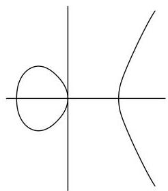
a.  $V(Y^{2} - X(X^{2} - 1))\subset \mathbb{A}^{2}$

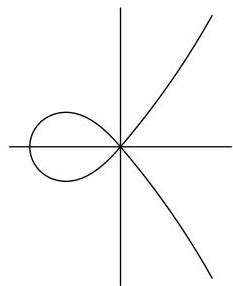
b.  $V(Y^{2} - X^{2}(X + 1))\subset \mathbb{A}^{2}$

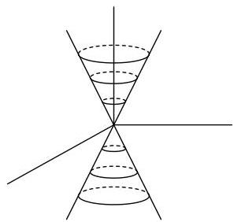
c.  $V(Z^{2} - (X^{2} + Y^{2}))\subset \mathbb{A}^{3}$

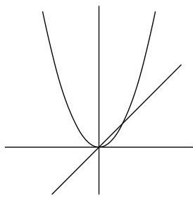
d.  $V(Y^{2} - XY - X^{2}Y + X^{3}))\subset \mathbb{A}^{2}$

More generally, if  $S$  is any set of polynomials in  $k[X_1, \ldots, X_n]$ , we let  $V(S) = \{P \in \mathbb{A}^n \mid F(P) = 0 \text{ for all } F \in S\}$ :  $V(S) = \bigcap_{F \in S} V(F)$ . If  $S = \{F_1, \ldots, F_r\}$ , we usually write  $V(F_1, \ldots, F_r)$  instead of  $V(\{F_1, \ldots, F_r\})$ . A subset  $X \subset \mathbb{A}^n(k)$  is an affine algebraic set, or simply an algebraic set, if  $X = V(S)$  for some  $S$ . The following properties are easy to verify:

(1) If  $I$  is the ideal in  $k[X_1, \ldots, X_n]$  generated by  $S$ , then  $V(S) = V(I)$ ; so every algebraic set is equal to  $V(I)$  for some ideal  $I$ .
(2) If  $\{I_{\alpha}\}$  is any collection of ideals, then  $V(\bigcup_{\alpha} I_{\alpha}) = \bigcap_{\alpha} V(I_{\alpha})$ ; so the intersection of any collection of algebraic sets is an algebraic set.
(3) If  $I\subset J$  , then  $V(I)\supset V(J)$

---

1.3. THE IDEAL OF A SET OF POINTS

(4) $V(FG) = V(F) \cup V(G)$ for any polynomials $F, G$; $V(I) \cup V(J) = V(\{FG \mid F \in I, G \in J\})$; so any finite union of algebraic sets is an algebraic set.

(5) $V(0) = \mathbb{A}^n(k); V(1) = \varnothing; V(X_1 - a_1, \ldots, X_n - a_n) = \{(a_1, \ldots, a_n)\}$ for $a_i \in k$. So any finite subset of $\mathbb{A}^n(k)$ is an algebraic set.

## Problems

1.8.* Show that the algebraic subsets of $\mathbb{A}^1(k)$ are just the finite subsets, together with $\mathbb{A}^1(k)$ itself.

1.9. If $k$ is a finite field, show that every subset of $\mathbb{A}^n(k)$ is algebraic.

1.10. Give an example of a countable collection of algebraic sets whose union is not algebraic.

1.11. Show that the following are algebraic sets:

(a) $\{(t,t^2,t^3)\in \mathbb{A}^3 (k)\mid t\in k\}$;

(b) $\{(\cos (t),\sin (t))\in \mathbb{A}^2 (\mathbb{R})\mid t\in \mathbb{R}\}$;

(c) the set of points in $\mathbb{A}^2 (\mathbb{R})$ whose polar coordinates $(r,\theta)$ satisfy the equation $r = \sin (\theta)$.

1.12. Suppose $C$ is an affine plane curve, and $L$ is a line in $\mathbb{A}^2(k)$, $L \not\subset C$. Suppose $C = V(F)$, $F \in k[X,Y]$ a polynomial of degree $n$. Show that $L \cap C$ is a finite set of no more than $n$ points. (Hint: Suppose $L = V(Y - (aX + b))$, and consider $F(X,aX + b) \in k[X]$.)

1.13. Show that each of the following sets is not algebraic:

(a) $\{(x,y)\in \mathbb{A}^2 (\mathbb{R})\mid y = \sin (x)\}$.

(b) $\{(z,w)\in \mathbb{A}^2 (\mathbb{C})\mid |z|^2 +|w|^2 = 1\}$, where $|x + iy|^2 = x^2 +y^2$ for $x,y\in \mathbb{R}$.

(c) $\{(\cos (t),\sin (t),t)\in \mathbb{A}^3 (\mathbb{R})\mid t\in \mathbb{R}\}$.

1.14.* Let $F$ be a nonconstant polynomial in $k[X_1, \ldots, X_n]$, $k$ algebraically closed. Show that $\mathbb{A}^n(k) \setminus V(F)$ is infinite if $n \geq 1$, and $V(F)$ is infinite if $n \geq 2$. Conclude that the complement of any proper algebraic set is infinite. (Hint: See Problem 1.4.)

1.15.* Let $V \subset \mathbb{A}^n(k)$, $W \subset \mathbb{A}^m(k)$ be algebraic sets. Show that

$$
V \times W = \left\{\left(a _ {1}, \dots , a _ {n}, b _ {1}, \dots , b _ {m}\right) \mid \left(a _ {1}, \dots , a _ {n}\right) \in V, \left(b _ {1}, \dots , b _ {m}\right) \in W \right\}
$$

is an algebraic set in $\mathbb{A}^{n + m}(k)$. It is called the product of $V$ and $W$.

## 1.3 The Ideal of a Set of Points

For any subset $X$ of $\mathbb{A}^n(k)$, we consider those polynomials that vanish on $X$; they form an ideal in $k[X_1, \ldots, X_n]$, called the ideal of $X$, and written $I(X)$. $I(X) = \{F \in k[X_1, \ldots, X_n] \mid F(a_1, \ldots, a_n) = 0 \text{ for all } (a_1, \ldots, a_n) \in X\}$. The following properties show some of the relations between ideals and algebraic sets; the verifications are left to the reader (see Problems 1.4 and 1.7):

(6) If $X \subset Y$, then $I(X) \supset I(Y)$.

---

CHAPTER 1. AFFINE ALGEBRAIC SETS

(7) $I(\emptyset) = k[X_1, \ldots, X_n]$; $I(\mathbb{A}^n(k)) = (0)$ if $k$ is an infinite field;

$I(\{(a_{1},\ldots ,a_{n})\}) = (X_{1} - a_{1},\ldots ,X_{n} - a_{n})$ for $a_1,\dots ,a_n\in k$

(8) $I(V(S)) \supset S$ for any set $S$ of polynomials; $V(I(X)) \supset X$ for any set $X$ of points.

(9) $V(I(V(S))) = V(S)$ for any set $S$ of polynomials, and $I(V(I(X))) = I(X)$ for any set $X$ of points. So if $V$ is an algebraic set, $V = V(I(V))$, and if $I$ is the ideal of an algebraic set, $I = I(V(I))$.

An ideal that is the ideal of an algebraic set has a property not shared by all ideals: if $I = I(X)$, and $F^n \in I$ for some integer $n &gt; 0$, then $F \in I$. If $I$ is any ideal in a ring $R$, we define the radical of $I$, written $\operatorname{Rad}(I)$, to be $\{a \in R \mid a^n \in I \text{ for some integer } n &gt; 0\}$. Then $\operatorname{Rad}(I)$ is an ideal (Problem 1.18 below) containing $I$. An ideal $I$ is called a radical ideal if $I = \operatorname{Rad}(I)$. So we have property

(10) $I(X)$ is a radical ideal for any $X \subset \mathbb{A}^n(k)$.

# Problems

1.16.* Let $V, W$ be algebraic sets in $\mathbb{A}^n(k)$. Show that $V = W$ if and only if $I(V) = I(W)$.

1.17.* (a) Let $V$ be an algebraic set in $\mathbb{A}^n(k)$, $P \in \mathbb{A}^n(k)$ a point not in $V$. Show that there is a polynomial $F \in k[X_1, \ldots, X_n]$ such that $F(Q) = 0$ for all $Q \in V$, but $F(P) = 1$. (Hint: $I(V) \neq I(V \cup \{P\})$.) (b) Let $P_1, \ldots, P_r$ be distinct points in $\mathbb{A}^n(k)$, not in an algebraic set $V$. Show that there are polynomials $F_1, \ldots, F_r \in I(V)$ such that $F_i(P_j) = 0$ if $i \neq j$, and $F_i(P_i) = 1$. (Hint: Apply (a) to the union of $V$ and all but one point.) (c) With $P_1, \ldots, P_r$ and $V$ as in (b), and $a_{ij} \in k$ for $1 \leq i, j \leq r$, show that there are $G_i \in I(V)$ with $G_i(P_j) = a_{ij}$ for all $i$ and $j$. (Hint: Consider $\sum_j a_{ij} F_j$.)

1.18.* Let $I$ be an ideal in a ring $R$. If $a^n \in I$, $b^m \in I$, show that $(a + b)^{n + m} \in I$. Show that $\operatorname{Rad}(I)$ is an ideal, in fact a radical ideal. Show that any prime ideal is radical.

1.19. Show that $I = (X^2 + 1) \subset \mathbb{R}[X]$ is a radical (even a prime) ideal, but $I$ is not the ideal of any set in $\mathbb{A}^1(\mathbb{R})$.

1.20.* Show that for any ideal $I$ in $k[X_1, \ldots, X_n]$, $V(I) = V(\operatorname{Rad}(I))$, and $\operatorname{Rad}(I) \subset I(V(I))$.

1.21.* Show that $I = (X_{1} - a_{1},\ldots ,X_{n} - a_{n}) \subset k[X_{1},\ldots ,X_{n}]$ is a maximal ideal, and that the natural homomorphism from $k$ to $k[X_1,\dots,X_n] / I$ is an isomorphism.

# 1.4 The Hilbert Basis Theorem

Although we have allowed an algebraic set to be defined by any set of polynomials, in fact a finite number will always do.

Theorem 1. Every algebraic set is the intersection of a finite number of hypersurfaces

Proof. Let the algebraic set be $V(I)$ for some ideal $I \subset k[X_1, \ldots, X_n]$. It is enough to show that $I$ is finitely generated, for if $I = (F_1, \ldots, F_r)$, then $V(I) = V(F_1) \cap \cdots \cap V(F_r)$. To prove this fact we need some algebra:

---

1.5. IRREDUCIBLE COMPONENTS OF AN ALGEBRAIC SET

A ring is said to be Noetherian if every ideal in the ring is finitely generated. Fields and PID's are Noetherian rings. Theorem 1, therefore, is a consequence of the

HILBERT BASIS THEOREM. If $R$ is a Noetherian ring, then $R[X_1, \ldots, X_n]$ is a Noetherian ring.

Proof. Since $R[X_1, \ldots, X_n]$ is isomorphic to $R[X_1, \ldots, X_{n-1}][X_n]$, the theorem will follow by induction if we can prove that $R[X]$ is Noetherian whenever $R$ is Noetherian. Let $I$ be an ideal in $R[X]$. We must find a finite set of generators for $I$.

If $F = a_{1} + a_{1}X + \dots + a_{d}X^{d} \in R[X]$, $a_{d} \neq 0$, we call $a_{d}$ the leading coefficient of $F$. Let $J$ be the set of leading coefficients of all polynomials in $I$. It is easy to check that $J$ is an ideal in $R$, so there are polynomials $F_{1}, \ldots, F_{r} \in I$ whose leading coefficients generate $J$. Take an integer $N$ larger than the degree of each $F_{i}$. For each $m \leq N$, let $J_{m}$ be the ideal in $R$ consisting of all leading coefficients of all polynomials $F \in I$ such that $\deg(F) \leq m$. Let $\{F_{mj}\}$ be a finite set of polynomials in $I$ of degree $\leq m$ whose leading coefficients generate $J_{m}$. Let $I'$ be the ideal generated by the $F_{i}$'s and all the $F_{mj}$'s. It suffices to show that $I = I'$.

Suppose $I'$ were smaller than $I$; let $G$ be an element of $I$ of lowest degree that is not in $I'$. If $\deg(G) &gt; N$, we can find polynomials $Q_i$ such that $\sum Q_i F_i$ and $G$ have the same leading term. But then $\deg(G - \sum Q_i F_i) &lt; \deg G$, so $G - \sum Q_i F_i \in I'$, so $G \in I'$. Similarly if $\deg(G) = m \leq N$, we can lower the degree by subtracting off $\sum Q_j F_{mj}$ for some $Q_j$. This proves the theorem.

Corollary. $k[X_1, \ldots, X_n]$ is Noetherian for any field $k$.

# Problem

1.22.* Let $I$ be an ideal in a ring $R$, $\pi \colon R \to R / I$ the natural homomorphism. (a) Show that for every ideal $J'$ of $R / I$, $\pi^{-1}(J') = J$ is an ideal of $R$ containing $I$, and for every ideal $J$ of $R$ containing $I$, $\pi(J) = J'$ is an ideal of $R / I$. This sets up a natural one-to-one correspondence between {ideals of $R / I$} and {ideals of $R$ that contain $I$}. (b) Show that $J'$ is a radical ideal if and only if $J$ is radical. Similarly for prime and maximal ideals. (c) Show that $J'$ is finitely generated if $J$ is. Conclude that $R / I$ is Noetherian if $R$ is Noetherian. Any ring of the form $k[X_1, \ldots, X_n] / I$ is Noetherian.

# 1.5 Irreducible Components of an Algebraic Set

An algebraic set may be the union of several smaller algebraic sets (Section 1.2 Example d). An algebraic set $V \subset \mathbb{A}^n$ is reducible if $V = V_1 \cup V_2$, where $V_1, V_2$ are algebraic sets in $\mathbb{A}^n$, and $V_i \neq V$, $i = 1, 2$. Otherwise $V$ is irreducible.

Proposition 1. An algebraic set $V$ is irreducible if and only if $I(V)$ is prime.

Proof. If $I(V)$ is not prime, suppose $F_{1}F_{2} \in I(V)$, $F_{i} \notin I(V)$. Then $V = (V \cap V(F_{1})) \cup (V \cap V(F_{2}))$, and $V \cap V(F_{i}) \subsetneq V$, so $V$ is reducible.

Conversely if $V = V_{1} \cup V_{2}$, $V_{i} \subsetneq V$, then $I(V_{i}) \supsetneq I(V)$; let $F_{i} \in I(V_{i})$, $F_{i} \notin I(V)$. Then $F_{1}F_{2} \in I(V)$, so $I(V)$ is not prime.

---

CHAPTER 1. AFFINE ALGEBRAIC SETS

We want to show that an algebraic set is the union of a finite number of irreducible algebraic sets. If $V$ is reducible, we write $V = V_{1} \cup V_{2}$; if $V_{2}$ is reducible, we write $V_{2} = V_{3} \cup V_{4}$, etc. We need to know that this process stops.

**Lemma.** Let $\mathcal{S}$ be any nonempty collection of ideals in a Noetherian ring $R$. Then $\mathcal{S}$ has a maximal member, i.e. there is an ideal $I$ in $\mathcal{S}$ that is not contained in any other ideal of $\mathcal{S}$.

**Proof.** Choose (using the axiom of choice) an ideal from each subset of $\mathcal{S}$. Let $I_0$ be the chosen ideal for $\mathcal{S}$ itself. Let $\mathcal{S}_1 = \{I \in \mathcal{S} \mid I \supsetneq I_0\}$, and let $I_1$ be the chosen ideal of $\mathcal{S}_1$. Let $\mathcal{S}_2 = \{I \in \mathcal{S} \mid I \supsetneq I_1\}$, etc. It suffices to show that some $\mathcal{S}_n$ is empty. If not let $I = \bigcup_{n=0}^{\infty} I_n$, an ideal of $R$. Let $F_1, \ldots, F_r$ generate $I$; each $F_i \in I_n$ if $n$ is chosen sufficiently large. But then $I_n = I$, so $I_{n+1} = I_n$, a contradiction.

It follows immediately from this lemma that any collection of algebraic sets in $\mathbb{A}^n(k)$ has a minimal member. For if $\{V_\alpha\}$ is such a collection, take a maximal member $I(V_{\alpha_0})$ from $\{I(V_\alpha)\}$. Then $V_{\alpha_0}$ is clearly minimal in the collection.

**Theorem 2.** Let $V$ be an algebraic set in $\mathbb{A}^n(k)$. Then there are unique irreducible algebraic sets $V_1, \ldots, V_m$ such that $V = V_1 \cup \cdots \cup V_m$ and $V_i \not\subset V_j$ for all $i \neq j$.

**Proof.** Let $\mathcal{S} = \{\text{algebraic sets } V \subset \mathbb{A}^n(k) \mid V \text{ is not the union of a finite number of irreducible algebraic sets}\}$. We want to show that $\mathcal{S}$ is empty. If not, let $V$ be a minimal member of $\mathcal{S}$. Since $V \in \mathcal{S}$, $V$ is not irreducible, so $V = V_1 \cup V_2$, $V_i \supsetneq V$. Then $V_i \notin \mathcal{S}$, so $V_i = V_{i1} \cup \cdots \cup V_{im_i}$, $V_{ij}$ irreducible. But then $V = \bigcup_{i,j} V_{ij}$, a contradiction.

So any algebraic set $V$ may be written as $V = V_{1} \cup \dots \cup V_{m}$, $V_{i}$ irreducible. To get the second condition, simply throw away any $V_{i}$ such that $V_{i} \subset V_{j}$ for $i \neq j$. To show uniqueness, let $V = W_{1} \cup \dots \cup W_{m}$ be another such decomposition. Then $V_{i} = \bigcup_{j} (W_{j} \cap V_{i})$, so $V_{i} \subset W_{j(i)}$ for some $j(i)$. Similarly $W_{j(i)} \subset V_{k}$ for some $k$. But $V_{i} \subset V_{k}$ implies $i = k$, so $V_{i} = W_{j(i)}$. Likewise each $W_{j}$ is equal to some $V_{i(j)}$.

The $V_{i}$ are called the irreducible components of $V$; $V = V_{1} \cup \dots \cup V_{m}$ is the decomposition of $V$ into irreducible components.

# Problems

1.23. Give an example of a collection $\mathcal{S}$ of ideals in a Noetherian ring such that no maximal member of $\mathcal{S}$ is a maximal ideal.

1.24. Show that every proper ideal in a Noetherian ring is contained in a maximal ideal. (Hint: If $I$ is the ideal, apply the lemma to {proper ideals that contain $I$}.)

1.25. (a) Show that $V(Y - X^2) \subset \mathbb{A}^2(\mathbb{C})$ is irreducible; in fact, $I(V(Y - X^2)) = (Y - X^2)$. (b) Decompose $V(Y^4 - X^2, Y^4 - X^2 Y^2 + XY^2 - X^3) \subset \mathbb{A}^2(\mathbb{C})$ into irreducible components.

1.26. Show that $F = Y^2 + X^2(X - 1)^2 \in \mathbb{R}[X, Y]$ is an irreducible polynomial, but $V(F)$ is reducible.

---

1.6. ALGEBRAIC SUBSETS OF THE PLANE

1.27. Let $V, W$ be algebraic sets in $\mathbb{A}^n(k)$, with $V \subset W$. Show that each irreducible component of $V$ is contained in some irreducible component of $W$.

1.28. If $V = V_{1} \cup \dots \cup V_{r}$ is the decomposition of an algebraic set into irreducible components, show that $V_{i} \not\subset \bigcup_{j \neq i} V_{j}$.

1.29.* Show that $\mathbb{A}^n(k)$ is irreducible if $k$ is infinite,.

# 1.6 Algebraic Subsets of the Plane

Before developing the general theory further, we will take a closer look at the affine plane $\mathbb{A}^2(k)$, and find all its algebraic subsets. By Theorem 2 it is enough to find the irreducible algebraic sets.

**Proposition 2.** Let $F$ and $G$ be polynomials in $k[X, Y]$ with no common factors. Then $V(F, G) = V(F) \cap V(G)$ is a finite set of points.

**Proof.** $F$ and $G$ have no common factors in $k[X][Y]$, so they also have no common factors in $k(X)[Y]$ (see Section 1). Since $k(X)[Y]$ is a PID, $(F,G) = (1)$ in $k(X)[Y]$, so $RF + SG = 1$ for some $R,S \in k(X)[Y]$. There is a nonzero $D \in k[X]$ such that $DR = A$, $DS = B \in k[X,Y]$. Therefore $AF + BG = D$. If $(a,b) \in V(F,G)$, then $D(a) = 0$. But $D$ has only a finite number of zeros. This shows that only a finite number of $X$-coordinates appear among the points of $V(F,G)$. Since the same reasoning applies to the $Y$-coordinates, there can be only a finite number of points.

**Corollary 1.** If $F$ is an irreducible polynomial in $k[X, Y]$ such that $V(F)$ is infinite, then $I(V(F)) = (F)$, and $V(F)$ is irreducible.

**Proof.** If $G \in I(V(F))$, then $V(F, G)$ is infinite, so $F$ divides $G$ by the proposition, i.e., $G \in (F)$. Therefore $I(V(F)) \supset (F)$, and the fact that $V(F)$ is irreducible follows from Proposition 1.

**Corollary 2.** Suppose $k$ is infinite. Then the irreducible algebraic subsets of $\mathbb{A}^2(k)$ are: $\mathbb{A}^2(k), \varnothing$, points, and irreducible plane curves $V(F)$, where $F$ is an irreducible polynomial and $V(F)$ is infinite.

**Proof.** Let $V$ be an irreducible algebraic set in $\mathbb{A}^2(k)$. If $V$ is finite or $I(V) = (0)$, $V$ is of the required type. Otherwise $I(V)$ contains a nonconstant polynomial $F$; since $I(V)$ is prime, some irreducible polynomial factor of $F$ belongs to $I(V)$, so we may assume $F$ is irreducible. Then $I(V) = (F)$; for if $G \in I(V)$, $G \notin (F)$, then $V \subset V(F, G)$ is finite.

**Corollary 3.** Assume $k$ is algebraically closed, $F$ a nonconstant polynomial in $k[X, Y]$. Let $F = F_1^{n_1} \cdots F_r^{n_r}$ be the decomposition of $F$ into irreducible factors. Then $V(F) = V(F_1) \cup \cdots \cup V(F_r)$ is the decomposition of $V(F)$ into irreducible components, and $I(V(F)) = (F_1 \cdots F_r)$.

**Proof.** No $F_{i}$ divides any $F_{j}$, $j \neq i$, so there are no inclusion relations among the $V(F_{i})$. And $I(\bigcup_{i} V(F_{i})) = \bigcap_{i} I(V(F_{i})) = \bigcap_{i} (F_{i})$. Since any polynomial divisible by each $F_{i}$ is also divisible by $F_{1} \cdots F_{r}, \bigcap_{i} (F_{i}) = (F_{1} \cdots F_{r})$. Note that the $V(F_{i})$ are infinite since $k$ is algebraically closed (Problem 1.14).

---

Problems

1.30. Let $k=\mathbb{R}$. (a) Show that $I(V(X^{2}+Y^{2}+1))=(1)$. (b) Show that every algebraic subset of $\mathbb{A}^{2}(\mathbb{R})$ is equal to $V(F)$ for some $F\in\mathbb{R}[X,Y]$.

This indicates why we usually require that $k$ be algebraically closed.

1.31. (a) Find the irreducible components of $V(Y^{2}-XY-X^{2}Y+X^{3})$ in $\mathbb{A}^{2}(\mathbb{R})$, and also in $\mathbb{A}^{2}(\mathbb{C})$. (b) Do the same for $V(Y^{2}-X(X^{2}-1))$, and for $V(X^{3}+X-X^{2}Y-Y)$.

### 1.7 Hilbert’s Nullstellensatz

If we are given an algebraic set $V$, Proposition 2 gives a criterion for telling whether $V$ is irreducible or not. What is lacking is a way to describe $V$ in terms of a given set of polynomials that define $V$. The preceding paragraph gives a beginning to this problem, but it is the Nullstellensatz, or Zeros-theorem, which tells us the exact relationship between ideals and algebraic sets. We begin with a somewhat weaker theorem, and show how to reduce it to a purely algebraic fact. In the rest of this section we show how to deduce the main result from the weaker theorem, and give a few applications.

We assume throughout this section that $k$ is algebraically closed.

WEAK NULLSTELLENSATZ. If $I$ is a proper ideal in $k[X_{1},\ldots,X_{n}]$, then $V(I)\neq\emptyset$.

###### Proof.

We may assume that $I$ is a maximal ideal, for there is a maximal ideal $J$ containing $I$ (Problem 1.24), and $V(J)\subset V(I)$. So $L=k[X_{1},\ldots,X_{n}]/I$ is a field, and $k$ may be regarded as a subfield of $L$ (cf. Section 1).

Suppose we knew that $k=L$. Then for each $i$ there is an $a_{i}\in k$ such that the $I$-residue of $X_{i}$ is $a_{i}$, or $X_{i}-a_{i}\in I$. But $(X_{1}-a_{1},\ldots,X_{n}-a_{n})$ is a maximal ideal (Problem 1.21), so $I=(X_{1}-a_{1},\ldots,X_{n}-a_{n})$, and $V(I)=\{(a_{1},\ldots,a_{n})\}\neq\emptyset$.

Thus we have reduced the problem to showing:

- If an algebraically closed field $k$ is a subfield of a field $L$, and there is a ring homomorphism from $k[X_{1},\ldots,X_{n}]$ onto $L$ (that is the identity on $k$), then $k=L$.

The algebra needed to prove this will be developed in the next two sections; $(*)$ will be proved in Section 10.

HILBERT’S NULLSTELLENSATZ. Let $I$ be an ideal in $k[X_{1},\ldots,X_{n}]$ ($k$ algebraically closed). Then $I(V(I))=\operatorname{Rad}(I)$.

Note. In concrete terms, this says the following: if $F_{1}$, $F_{2}$, …, $F_{r}$ and $G$ are in $k[X_{1},\ldots,X_{n}]$, and $G$ vanishes wherever $F_{1},F_{2},\ldots,F_{r}$ vanish, then there is an equation $G^{N}=A_{1}F_{1}+A_{2}F_{2}+\cdots+A_{r}F^{r}$, for some $N>0$ and some $A_{i}\in k[X_{1},\ldots,X_{n}]$.

###### Proof.

That $\operatorname{Rad}(I)\subset I(V(I))$ is easy (Problem 1.20). Suppose that $G$ is in the ideal $I(V(F_{1},\ldots,F_{r}))$, $F_{i}\in k[X_{1},\ldots,X_{n}]$. Let $J=(F_{1},\ldots,F_{r},X_{n+1}G-1)\subset k[X_{1},\ldots,X_{n},X_{n+1}]$.

---

1.7. HILBERT'S NULLSTELLENSATZ

Then $V(J) \subset \mathbb{A}^{n + 1}(k)$ is empty, since $G$ vanishes wherever all that $F_{i}$'s are zero. Applying the Weak Nullstellensatz to $J$, we see that $1 \in J$, so there is an equation $1 = \sum A_{i}(X_{1},\ldots ,X_{n + 1})F_{i} + B(X_{1},\ldots ,X_{n + 1})(X_{n + 1}G - 1)$. Let $Y = 1 / X_{n + 1}$, and multiply the equation by a high power of $Y$, so that an equation $Y^{N} = \sum C_{i}(X_{1},\dots,X_{n},Y)F_{i} + D(X_{1},\dots,X_{n},Y)(G - Y)$ in $k[X_1,\dots,X_n,Y]$ results. Substituting $G$ for $Y$ gives the required equation.

The above proof is due to Rabinowitsch. The first three corollaries are immediate consequences of the theorem.

Corollary 1. If $I$ is a radical ideal in $k[X_1, \ldots, X_n]$, then $I(V(I)) = I$. So there is a one-to-one correspondence between radical ideals and algebraic sets.

Corollary 2. If $I$ is a prime ideal, then $V(I)$ is irreducible. There is a one-to-one correspondence between prime ideals and irreducible algebraic sets. The maximal ideals correspond to points.

Corollary 3. Let $F$ be a nonconstant polynomial in $k[X_1, \ldots, X_n]$, $F = F_1^{n_1} \cdots F_r^{n_r}$ the decomposition of $F$ into irreducible factors. Then $V(F) = V(F_1) \cup \cdots \cup V(F_r)$ is the decomposition of $V(F)$ into irreducible components, and $I(V(F)) = (F_1 \cdots F_r)$. There is a one-to-one correspondence between irreducible polynomials $F \in k[X_1, \ldots, X_n]$ (up to multiplication by a nonzero element of $k$) and irreducible hypersurfaces in $\mathbb{A}^n(k)$.

Corollary 4. Let $I$ be an ideal in $k[X_1, \ldots, X_n]$. Then $V(I)$ is a finite set if and only if $k[X_1, \ldots, X_n] / I$ is a finite dimensional vector space over $k$. If this occurs, the number of points in $V(I)$ is at most $\dim_k(k[X_1, \ldots, X_n] / I)$.

Proof. Let $P_{1}, \ldots, P_{r} \in V(I)$. Choose $F_{1}, \ldots, F_{r} \in k[X_{1}, \ldots, X_{n}]$ such that $F_{i}(P_{j}) = 0$ if $i \neq j$, and $F_{i}(P_{i}) = 1$ (Problem 1.17); let $\overline{F}_{i}$ be the $I$-residue of $F_{i}$. If $\sum \lambda_{i}\overline{F}_{i} = 0$, $\lambda_{i} \in k$, then $\sum \lambda_{i}F_{i} \in I$, so $\lambda_{j} = (\sum \lambda_{i}F_{i})(P_{j}) = 0$. Thus the $\overline{F}_{i}$ are linearly independent over $k$, so $r \leq \dim_{k}(k[X_{1}, \ldots, X_{n}] / I)$.

Conversely, if $V(I) = \{P_1, \ldots, P_r\}$ is finite, let $P_i = (a_{i1}, \ldots, a_{in})$, and define $F_j$ by $F_j = \prod_{i=1}^r (X_j - a_{ij})$, $j = 1, \ldots, n$. Then $F_j \in I(V(I))$, so $F_j^N \in I$ for some $N &gt; 0$ (Take $N$ large enough to work for all $F_j$). Taking $I$-residues, $\overline{F}_j^N = 0$, so $\overline{X}_j^{rN}$ is a $k$-linear combination of $\overline{1}, \overline{X}_j, \ldots, \overline{X}_j^{rN-1}$. It follows by induction that $\overline{X}_j^s$ is a $k$-linear combination of $\overline{1}, \overline{X}_j, \ldots, \overline{X}_j^{rN-1}$ for all $s$, and hence that the set $\{\overline{X}_1^{m_1}, \dots, \overline{X}_n^{m_n} \mid m_i &lt; rN\}$ generates $k[X_1, \ldots, X_n] / I$ as a vector space over $k$.

# Problems

1.32. Show that both theorems and all of the corollaries are false if $k$ is not algebraically closed.

1.33. (a) Decompose $V(X^2 + Y^2 - 1, X^2 - Z^2 - 1) \subset \mathbb{A}^3(\mathbb{C})$ into irreducible components. (b) Let $V = \{(t, t^2, t^3) \in \mathbb{A}^3(\mathbb{C}) \mid t \in \mathbb{C}\}$. Find $I(V)$, and show that $V$ is irreducible.

---

CHAPTER 1. AFFINE ALGEBRAIC SETS

1.34. Let $R$ be a UFD. (a) Show that a monic polynomial of degree two or three in $R[X]$ is irreducible if and only if it has no roots in $R$. (b) The polynomial $X^2 - a \in R[X]$ is irreducible if and only if $a$ is not a square in $R$.

1.35. Show that $V(Y^2 - X(X - 1)(X - \lambda)) \subset \mathbb{A}^2(k)$ is an irreducible curve for any algebraically closed field $k$, and any $\lambda \in k$.

1.36. Let $I = (Y^2 - X^2, Y^2 + X^2) \subset \mathbb{C}[X, Y]$. Find $V(I)$ and $\dim_{\mathbb{C}}(\mathbb{C}[X, Y] / I)$.

1.37.* Let $K$ be any field, $F \in K[X]$ a polynomial of degree $n &gt; 0$. Show that the residues $\overline{1}, \overline{X}, \ldots, \overline{X}^{n-1}$ form a basis of $K[X]/(F)$ over $K$.

1.38.* Let $R = k[X_1, \ldots, X_n]$, $k$ algebraically closed, $V = V(I)$. Show that there is a natural one-to-one correspondence between algebraic subsets of $V$ and radical ideals in $k[X_1, \ldots, X_n]/I$, and that irreducible algebraic sets (resp. points) correspond to prime ideals (resp. maximal ideals). (See Problem 1.22.)

1.39. (a) Let $R$ be a UFD, and let $P = (t)$ be a principal, proper, prime ideal. Show that there is no prime ideal $Q$ such that $0 \subset Q \subset P$, $Q \neq 0$, $Q \neq P$. (b) Let $V = V(F)$ be an irreducible hypersurface in $\mathbb{A}^n$. Show that there is no irreducible algebraic set $W$ such that $V \subset W \subset \mathbb{A}^n$, $W \neq V$, $W \neq \mathbb{A}^n$.

1.40. Let $I = (X^2 - Y^3, Y^2 - Z^3) \subset k[X, Y, Z]$. Define $\alpha \colon k[X, Y, Z] \to k[T]$ by $\alpha(X) = T^9$, $\alpha(Y) = T^6$, $\alpha(Z) = T^4$. (a) Show that every element of $k[X, Y, Z]/I$ is the residue of an element $A + XB + YC + XYD$, for some $A, B, C, D \in k[Z]$. (b) If $F = A + XB + YC + XYD$, $A, B, C, D \in k[Z]$, and $\alpha(F) = 0$, compare like powers of $T$ to conclude that $F = 0$. (c) Show that $\operatorname{Ker}(\alpha) = I$, so $I$ is prime, $V(I)$ is irreducible, and $I(V(I)) = I$.

## 1.8 Modules; Finiteness Conditions

Let $R$ be a ring. An $R$-module is a commutative group $M$ (the group law on $M$ is written $+$; the identity of the group is 0, or $0_M$) together with a scalar multiplication, i.e., a mapping from $R \times M$ to $M$ (denote the image of $(a, m)$ by $a \cdot m$ or $am$) satisfying:

(i) $(a + b)m = am + bm$ for $a, b \in R, m \in M$.

(ii) $a \cdot (m + n) = am + an$ for $a \in R, m, n \in M$.

(iii) $(ab) \cdot m = a \cdot (bm)$ for $a, b \in R, m \in M$.

(iv) $1_R \cdot m = m$ for $m \in M$, where $1_R$ is the multiplicative identity in $R$.

**Exercise.** Show that $0_R \cdot m = 0_M$ for all $m \in M$.

**Examples.** (1) A $\mathbb{Z}$-module is just a commutative group, where $(\pm a)m$ is $\pm (m + \dots + m)$ ($a$ times) for $a \in \mathbb{Z}$, $a \geq 0$.

(2) If $R$ is a field, an $R$-module is the same thing as a vector space over $R$.

(3) The multiplication in $R$ makes any ideal of $R$ into an $R$-module.

(4) If $\varphi \colon R \to S$ is a ring homomorphism, we define $r \cdot s$ for $r \in R$, $s \in S$, by the equation $r \cdot s = \varphi(r)s$. This makes $S$ into an $R$-module. In particular, if a ring $R$ is a subring of a ring $S$, then $S$ is an $R$-module.

A subgroup $N$ of an $R$-module $M$ is called a submodule if $am \in N$ for all $a \in R$, $m \in N$; $N$ is then an $R$-module. If $S$ is a set of elements of an $R$-module $M$, the

---

1.8. MODULES; FINITENESS CONDITIONS

submodule generated by $S$ is defined to be $\{\sum r_i s_i \mid r_i \in R, s_i \in S\}$; it is the smallest submodule of $M$ that contains $S$. If $S = \{s_1, \ldots, s_n\}$ is finite, the submodule generated by $S$ is denoted by $\sum R s_i$. The module $M$ is said to be finitely generated if $M = \sum R s_i$ for some $s_1, \ldots, s_n \in M$. Note that this concept agrees with the notions of finitely generated commutative groups and ideals, and with the notion of a finite-dimensional vector space if $R$ is a field.

Let $R$ be a subring of a ring $S$. There are several types of finiteness conditions for $S$ over $R$, depending on whether we consider $S$ as an $R$-module, a ring, or (possibly) a field.

(A) $S$ is said to be module-finite over $R$, if $S$ is finitely generated as an $R$-module. If $R$ and $S$ are fields, and $S$ is module finite over $R$, we denote the dimension of $S$ over $R$ by $\{S : R\}$.

(B) Let $v_{1}, \ldots, v_{n} \in S$. Let $\varphi \colon R[X_{1}, \ldots, X_{n}] \to S$ be the ring homomorphism taking $X_{i}$ to $v_{i}$. The image of $\varphi$ is written $R[v_{1}, \ldots, v_{n}]$. It is a subring of $S$ containing $R$ and $v_{1}, \ldots, v_{n}$, and it is the smallest such ring. Explicitly, $R[v_{1}, \ldots, v_{n}] = \{\sum a_{(i)} v_{1}^{i_{1}} \cdots v_{n}^{i_{n}} \mid a_{(i)} \in R\}$. The ring $S$ is ring-finite over $R$ if $S = R[v_{1}, \ldots, v_{n}]$ for some $v_{1}, \ldots, v_{n} \in S$.

(C) Suppose $R = K$, $S = L$ are fields. If $v_{1}, \ldots, v_{n} \in L$, let $K(v_{1}, \ldots, v_{n})$ be the quotient field of $K[v_{1}, \ldots, v_{n}]$. We regard $K(v_{1}, \ldots, v_{n})$ as a subfield of $L$; it is the smallest subfield of $L$ containing $K$ and $v_{1}, \ldots, v_{n}$. The field $L$ is said to be a finitely generated field extension of $K$ if $L = K(v_{1}, \ldots, v_{n})$ for some $v_{1}, \ldots, v_{n} \in L$.

# Problems

1.41.* If $S$ is module-finite over $R$, then $S$ is ring-finite over $R$.

1.42. Show that $S = R[X]$ (the ring of polynomials in one variable) is ring-finite over $R$, but not module-finite.

1.43.* If $L$ is ring-finite over $K$ ($K, L$ fields) then $L$ is a finitely generated field extension of $K$.

1.44.* Show that $L = K(X)$ (the field of rational functions in one variable) is a finitely generated field extension of $K$, but $L$ is not ring-finite over $K$. (Hint: If $L$ were ring-finite over $K$, a common denominator of ring generators would be an element $b \in K[X]$ such that for all $z \in L$, $b^n z \in K[X]$ for some $n$; but let $z = 1 / c$, where $c$ doesn't divide $b$ (Problem 1.5).)

1.45.* Let $R$ be a subring of $S$, $S$ a subring of $T$.

(a) If $S = \sum R v_{i}$, $T = \sum S w_{j}$, show that $T = \sum R v_{i} w_{j}$.

(b) If $S = R[v_1, \ldots, v_n]$, $T = S[w_1, \ldots, w_m]$, show that $T = R[v_1, \ldots, v_n, w_1, \ldots, w_m]$.

(c) If $R, S, T$ are fields, and $S = R(v_{1}, \ldots, v_{n})$, $T = S(w_{1}, \ldots, w_{m})$, show that $T = R(v_{1}, \ldots, v_{n}, w_{1}, \ldots, w_{m})$.

So each of the three finiteness conditions is a transitive relation.

---

CHAPTER 1. AFFINE ALGEBRAIC SETS

# 1.9 Integral Elements

Let $R$ be a subring of a ring $S$. An element $v \in S$ is said to be integral over $R$ if there is a monic polynomial $F = X^n + a_1X^{n-1} + \dots + a_n \in R[X]$ such that $F(v) = 0$. If $R$ and $S$ are fields, we usually say that $v$ is algebraic over $R$ if $v$ is integral over $R$.

**Proposition 3.** Let $R$ be a subring of a domain $S$, $v \in S$. Then the following are equivalent:

(1) $v$ is integral over $R$.

(2) $R[v]$ is module-finite over $R$.

(3) There is a subring $R'$ of $S$ containing $R[v]$ that is module-finite over $R$.

**Proof.** (1) implies (2): If $v^n + a_1v^{n-1} + \dots + a_n = 0$, then $v^n \in \sum_{i=0}^{n-1} Rv^i$. It follows that $v^m \in \sum_{i=0}^{n-1} Rv^i$ for all $m$, so $R[v] = \sum_{i=0}^{n-1} Rv^i$.

(2) implies (3): Let $R' = R[v]$.

(3) implies (1): If $R' = \sum_{i=1}^{n} Rw_i$, then $vw_i = \sum_{j=1}^{n} a_{ij}w_j$ for some $a_{ij} \in R$. Then $\sum_{j=1}^{n} (\delta_{ij}v - a_{ij})w_j = 0$ for all $i$, where $\delta_{ij} = 0$ if $i \neq j$ and $\delta_{ii} = 1$. If we consider these equations in the quotient field of $S$, we see that $(w_1, \ldots, w_n)$ is a nontrivial solution, so $\det(\delta_{ij}v - a_{ij}) = 0$. Since $v$ appears only in the diagonal of the matrix, this determinant has the form $v^n + a_1v^{n-1} + \dots + a_n$, $a_i \in R$. So $v$ is integral over $R$.

**Corollary.** The set of elements of $S$ that are integral over $R$ is a subring of $S$ containing $R$.

**Proof.** If $a, b$ are integral over $R$, then $b$ is integral over $R[a] \supset R$, so $R[a, b]$ is module-finite over $R$ (Problem 1.45(a)). And $a \pm b, ab \in R[a, b]$, so they are integral over $R$ by the proposition.

We say that $S$ is integral over $R$ if every element of $S$ is integral over $R$. If $R$ and $S$ are fields, we say $S$ is an algebraic extension of $R$ if $S$ is integral over $R$. The proposition and corollary extend to the case where $S$ is not a domain, with essentially the same proofs, but we won't need that generality.

# Problems

1.46.* Let $R$ be a subring of $S$, $S$ a subring of (a domain) $T$. If $S$ is integral over $R$, and $T$ is integral over $S$, show that $T$ is integral over $R$. (Hint: Let $z \in T$, so we have $z^n + a_1z^{n-1} + \dots + a_n = 0$, $a_i \in S$. Then $R[a_1, \ldots, a_n, z]$ is module-finite over $R$.)

1.47.* Suppose (a domain) $S$ is ring-finite over $R$. Show that $S$ is module-finite over $R$ if and only if $S$ is integral over $R$.

1.48.* Let $L$ be a field, $k$ an algebraically closed subfield of $L$. (a) Show that any element of $L$ that is algebraic over $k$ is already in $k$. (b) An algebraically closed field has no module-finite field extensions except itself.

1.49.* Let $K$ be a field, $L = K(X)$ the field of rational functions in one variable over $K$. (a) Show that any element of $L$ that is integral over $K[X]$ is already in $K[X]$. (Hint: If $z^n + a_1z^{n-1} + \dots = 0$, write $z = F / G$, $F, G$ relatively prime. Then $F^n + a_1F^{n-1}G + \dots = 0$,

---

1.10. FIELD EXTENSIONS

so $G$ divides $F$.) (b) Show that there is no nonzero element $F \in K[X]$ such that for every $z \in L$, $F^n z$ is integral over $K[X]$ for some $n &gt; 0$. (Hint: See Problem 1.44.)

1.50.* Let $K$ be a subfield of a field $L$. (a) Show that the set of elements of $L$ that are algebraic over $K$ is a subfield of $L$ containing $K$. (Hint: If $v^n + a_1 v^{n-1} + \cdots + a_n = 0$, and $a_n \neq 0$, then $v(v^{n-1} + \cdots) = -a_n$.) (b) Suppose $L$ is module-finite over $K$, and $K \subset R \subset L$. Show that $R$ is a field.

## 1.10 Field Extensions

Suppose $K$ is a subfield of a field $L$, and suppose $L = K(v)$ for some $v \in L$. Let $\varphi \colon K[X] \to L$ be the homomorphism taking $X$ to $v$. Let $\operatorname{Ker}(\varphi) = (F)$, $F \in K[X]$ (since $K[X]$ is a PID). Then $K[X] / (F)$ is isomorphic to $K[v]$, so $(F)$ is prime. Two cases may occur:

Case 1. $F = 0$. Then $K[v]$ is isomorphic to $K[X]$, so $K(v) = L$ is isomorphic to $K(X)$. In this case $L$ is not ring-finite (or module-finite) over $K$ (Problem 1.44).

Case 2. $F \neq 0$. We may assume $F$ is monic. Then $(F)$ is prime, so $F$ is irreducible and $(F)$ is maximal (Problem 1.3); therefore $K[v]$ is a field, so $K[v] = K(v)$. And $F(v) = 0$, so $v$ is algebraic over $K$ and $L = K[v]$ is module-finite over $K$.

To finish the proof of the Nullstellensatz, we must prove the claim $(\ast)$ of Section 7; this says that if a field $L$ is a ring-finite extension of an algebraically closed field $k$, then $L = k$. In view of Problem 1.48, it is enough to show that $L$ is module-finite over $k$. The above discussion indicates that a ring-finite field extension is already module-finite. The next proposition shows that this is always true, and completes the proof of the Nullstellensatz.

**Proposition 4 (Zariski).** If a field $L$ is ring-finite over a subfield $K$, then $L$ is module-finite (and hence algebraic) over $K$.

**Proof.** Suppose $L = K[v_1, \ldots, v_n]$. The case $n = 1$ is taken care of by the above discussion, so we assume the result for all extensions generated by $n - 1$ elements. Let $K_1 = K(v_1)$. By induction, $L = K_1[v_2, \ldots, v_n]$ is module-finite over $K_1$. We may assume $v_1$ is not algebraic over $K$ (otherwise Problem 1.45(a) finishes the proof).

Each $v_{i}$ satisfies an equation $v_{i}^{n_{i}} + a_{i1}v_{i}^{n_{i} - 1} + \dots = 0$, $a_{ij}\in K_1$. If we take $a\in K[v_1]$ that is a multiple of all the denominators of the $a_{ij}$, we get equations $(av_{i})^{n_{i}} + aa_{i1}(av_{1})^{n_{i} - 1} + \dots = 0$. It follows from the Corollary in §1.9 that for any $z\in L = K[v_1,\ldots ,v_n]$, there is an $N$ such that $a^N z$ is integral over $K[v_1]$. In particular this must hold for $z\in K(v_{1})$. But since $K(v_{1})$ is isomorphic to the field of rational functions in one variable over $K$, this is impossible (Problem 1.49(b)).

## Problems

1.51.* Let $K$ be a field, $F \in K[X]$ an irreducible monic polynomial of degree $n &gt; 0$. (a) Show that $L = K[X] / (F)$ is a field, and if $x$ is the residue of $X$ in $L$, then $F(x) = 0$. (b) Suppose $L'$ is a field extension of $K$, $y \in L'$ such that $F(y) = 0$. Show that the

---

CHAPTER 1. AFFINE ALGEBRAIC SETS

homomorphism from $K[X]$ to $L'$ that takes $X$ to $Y$ induces an isomorphism of $L$ with $K(y)$. (c) With $L'$, $y$ as in (b), suppose $G \in K[X]$ and $G(y) = 0$. Show that $F$ divides $G$. (d) Show that $F = (X - x)F_1$, $F_1 \in L[X]$.

1.52.* Let $K$ be a field, $F \in K[X]$. Show that there is a field $L$ containing $K$ such that $F = \prod_{i=1}^{n} (X - x_i) \in L[X]$. (Hint: Use Problem 1.51(d) and induction on the degree.) $L$ is called a splitting field of $F$.

1.53.* Suppose $K$ is a field of characteristic zero, $F$ an irreducible monic polynomial in $K[X]$ of degree $n &gt; 0$. Let $L$ be a splitting field of $F$, so $F = \prod_{i=1}^{n} (X - x_i)$, $x_i \in L$. Show that the $x_i$ are distinct. (Hint: Apply Problem 1.51(c) to $G = F_X$; if $(X - x)^2$ divides $F$, then $G(x) = 0$.)

1.54.* Let $R$ be a domain with quotient field $K$, and let $L$ be a finite algebraic extension of $K$. (a) For any $\nu \in L$, show that there is a nonzero $a \in R$ such that $a\nu$ is integral over $R$. (b) Show that there is a basis $\nu_1, \ldots, \nu_n$ for $L$ over $K$ (as a vector space) such that each $\nu_i$ is integral over $R$.

---

Chapter 2 Affine Varieties

From now on $k$ will be a fixed algebraically closed field. Affine algebraic sets will be in $\mathbb{A}^n = \mathbb{A}^n(k)$ for some $n$. An irreducible affine algebraic set is called an *affine variety*.

All rings and fields will contain $k$ as a subring. By a homomorphism $\varphi\colon R\to S$ of such rings, we will mean a ring homomorphism such that $\varphi(\lambda) = \lambda$ for all $\lambda \in k$.

In this chapter we will be concerned only with affine varieties, so we call them simply *varieties*.

### 2.1 Coordinate Rings

Let $V \subset \mathbb{A}^n$ be a nonempty variety. Then $I(V)$ is a prime ideal in $k[X_1, \ldots, X_n]$, so $k[X_1, \ldots, X_n] / I(V)$ is a domain. We let $\Gamma(V) = k[X_1, \ldots, X_n] / I(V)$, and call it the *coordinate ring* of $V$.

For any (nonempty) set $V$, we let $\mathcal{F}(V, k)$ be the set of all functions from $V$ to $k$. $\mathcal{F}(V, k)$ is made into a ring in the usual way: if $f, g \in \mathcal{F}(V, k)$, $(f + g)(x) = f(x) + g(x)$, $(fg)(x) = f(x)g(x)$, for all $x \in V$. It is usual to identify $k$ with the subring of $\mathcal{F}(V, k)$ consisting of all constant functions.

If $V \subset \mathbb{A}^n$ is a variety, a function $f \in \mathcal{F}(V, k)$ is called a *polynomial function* if there is a polynomial $F \in k[X_1, \ldots, X_n]$ such that $f(a_1, \ldots, a_n) = F(a_1, \ldots, a_n)$ for all $(a_1, \ldots, a_n) \in V$. The polynomial functions form a subring of $\mathcal{F}(V, k)$ containing $k$. Two polynomials $F, G$ determine the same function if and only if $(F - G)(a_1, \ldots, a_n) = 0$ for all $(a_1, \ldots, a_n) \in V$, i.e., $F - G \in I(V)$. We may thus identify $\Gamma(V)$ with the subring of $\mathcal{F}(V, k)$ consisting of all polynomial functions on $V$. We have two important ways to view an element of $\Gamma(V)$ — as a function on $V$, or as an equivalence class of polynomials.

#### Problems

2.1.* Show that the map that associates to each $F \in k[X_1, \ldots, X_n]$ a polynomial function in $\mathcal{F}(V, k)$ is a ring homomorphism whose kernel is $I(V)$.

17

---

CHAPTER 2. AFFINE VARIETIES

2.2.* Let $V \subset \mathbb{A}^n$ be a variety. A subvariety of $V$ is a variety $W \subset \mathbb{A}^n$ that is contained in $V$. Show that there is a natural one-to-one correspondence between algebraic subsets (resp. subvarieties, resp. points) of $V$ and radical ideals (resp. prime ideals, resp. maximal ideals) of $\Gamma(V)$. (See Problems 1.22, 1.38.)

2.3.* Let $W$ be a subvariety of a variety $V$, and let $I_V(W)$ be the ideal of $\Gamma(V)$ corresponding to $W$. (a) Show that every polynomial function on $V$ restricts to a polynomial function on $W$. (b) Show that the map from $\Gamma(V)$ to $\Gamma(W)$ defined in part (a) is a surjective homomorphism with kernel $I_V(W)$, so that $\Gamma(W)$ is isomorphic to $\Gamma(V)/I_V(W)$.

2.4.* Let $V \subset \mathbb{A}^n$ be a nonempty variety. Show that the following are equivalent: (i) $V$ is a point; (ii) $\Gamma(V) = k$; (iii) $\dim_k \Gamma(V) &lt; \infty$.

2.5. Let $F$ be an irreducible polynomial in $k[X, Y]$, and suppose $F$ is monic in $Y$: $F = Y^n + a_1(X)Y^{n-1} + \cdots$, with $n &gt; 0$. Let $V = V(F) \subset \mathbb{A}^2$. Show that the natural homomorphism from $k[X]$ to $\Gamma(V) = k[X, Y] / (F)$ is one-to-one, so that $k[X]$ may be regarded as a subring of $\Gamma(V)$; show that the residues $\overline{1}, \overline{Y}, \ldots, \overline{Y}^{n-1}$ generate $\Gamma(V)$ over $k[X]$ as a module.

## 2.2 Polynomial Maps

Let $V \subset \mathbb{A}^n$, $W \subset \mathbb{A}^m$ be varieties. A mapping $\varphi \colon V \to W$ is called a polynomial map if there are polynomials $T_1, \ldots, T_m \in k[T_1, \ldots, T_m]$ such that $\varphi(a_1, \ldots, a_n) = (T_1(a_1, \ldots, a_n), \ldots, T_m(a_1, \ldots, a_n))$ for all $(a_1, \ldots, a_n) \in V$.

Any mapping $\varphi \colon V \to W$ induces a homomorphism $\tilde{\varphi} \colon \mathcal{F}(W, k) \to \mathcal{F}(V, k)$, by setting $\tilde{\varphi}(f) = f \circ \varphi$. If $\varphi$ is a polynomial map, then $\tilde{\varphi}(\Gamma(W)) \subset \Gamma(V)$, so $\tilde{\varphi}$ restricts to a homomorphism (also denoted by $\tilde{\varphi}$) from $\Gamma(W)$ to $\Gamma(V)$; for if $f \in \Gamma(W)$ is the $I(W)$-residue of a polynomial $F$, then $\tilde{\varphi}(f) = f \circ \varphi$ is the $I(V)$-residue of the polynomial $F(T_1, \ldots, T_m)$.

If $V = \mathbb{A}^n$, $W = \mathbb{A}^m$, and $T_1, \ldots, T_m \in k[T_1, \ldots, T_m]$ determine a polynomial map $T \colon \mathbb{A}^n \to \mathbb{A}^m$, the $T_i$ are uniquely determined by $T$ (see Problem 1.4), so we often write $T = (T_1, \ldots, T_m)$.

**Proposition 1.** Let $V \subset \mathbb{A}^n$, $W \subset \mathbb{A}^m$ be affine varieties. There is a natural one-to-one correspondence between the polynomial maps $\varphi \colon V \to W$ and the homomorphisms $\tilde{\varphi} \colon \Gamma(W) \to \Gamma(V)$. Any such $\varphi$ is the restriction of a polynomial map from $\mathbb{A}^n$ to $\mathbb{A}^m$.

**Proof.** Suppose $\alpha \colon \Gamma(W) \to \Gamma(V)$ is a homomorphism. Choose $T_i \in k[T_1, \ldots, T_n]$ such that $\alpha(I(W))$-residue of $X_i$ = $(I(V))$-residue of $T_i$, for $i = 1, \ldots, m$. Then $T = (T_1, \ldots, T_m)$ is a polynomial map from $\mathbb{A}^n$ to $\mathbb{A}^m$, inducing $\tilde{T} \colon \Gamma(\mathbb{A}^m) = k[T_1, \ldots, T_m] \to \Gamma(\mathbb{A}^n) = k[T_1, \ldots, T_n]$. It is easy to check that $\tilde{T}(I(W)) \subset I(V)$, and hence that $T(V) \subset W$, and so $T$ restricts to a polynomial map $\varphi \colon V \to W$. It is also easy to verify that $\tilde{\varphi} = \alpha$. Since we know how to construct $\tilde{\varphi}$ from $\varphi$, this completes the proof.

A polynomial map $\varphi \colon V \to W$ is an isomorphism if there is a polynomial map $\psi \colon W \to V$ such that $\psi \circ \varphi = \text{identity}$ on $V$, $\varphi \circ \psi = \text{identity}$ on $W$. Proposition 1 shows that two affine varieties are isomorphic if and only if their coordinate rings are isomorphic (over $k$).

---

2.3. COORDINATE CHANGES

# Problems

2.6.* Let $\varphi \colon V \to W, \psi \colon W \to Z$. Show that $\overline{\psi \circ \varphi} = \bar{\varphi} \circ \bar{\psi}$. Show that the composition of polynomial maps is a polynomial map.

2.7.* If $\varphi \colon V \to W$ is a polynomial map, and $X$ is an algebraic subset of $W$, show that $\varphi^{-1}(X)$ is an algebraic subset of $V$. If $\varphi^{-1}(X)$ is irreducible, and $X$ is contained in the image of $\varphi$, show that $X$ is irreducible. This gives a useful test for irreducibility.

2.8. (a) Show that $\{(t, t^2, t^3) \in \mathbb{A}^3(k) \mid t \in k\}$ is an affine variety. (b) Show that $V(XZ - Y^2, YZ - X^3, Z^2 - X^2Y) \subset \mathbb{A}^3(\mathbb{C})$ is a variety. (Hint: $Y^3 - X^4, Z^3 - X^5, Z^4 - Y^5 \in I(V)$). Find a polynomial map from $\mathbb{A}^1(\mathbb{C})$ onto $V$.)

2.9.* Let $\varphi \colon V \to W$ be a polynomial map of affine varieties, $V' \subset V$, $W' \subset W$ subvarieties. Suppose $\varphi(V') \subset W'$. (a) Show that $\tilde{\varphi}(I_W(W')) \subset I_V(V')$ (see Problems 2.3). (b) Show that the restriction of $\varphi$ gives a polynomial map from $V'$ to $W'$.

2.10.* Show that the projection map $\operatorname{pr} \colon \mathbb{A}^n \to \mathbb{A}^r$, $n \geq r$, defined by $\operatorname{pr}(a_1, \ldots, a_n) = (a_1, \ldots, a_r)$ is a polynomial map.

2.11. Let $f \in \Gamma(V)$, $V$ a variety $\subset \mathbb{A}^n$. Define

$$
G(f) = \{(a_1, \ldots, a_n, a_{n+1}) \in \mathbb{A}^{n+1} \mid (a_1, \ldots, a_n) \in V \text{ and } a_{n+1} = f(a_1, \ldots, a_n)\},
$$

the graph of $f$. Show that $G(f)$ is an affine variety, and that the map $(a_1, \ldots, a_n) \mapsto (a_1, \ldots, a_n, f(a_1, \ldots, a_n))$ defines an isomorphism of $V$ with $G(f)$. (Projection gives the inverse.)

2.12. (a) Let $\varphi \colon \mathbb{A}^1 \to V = V(Y^2 - X^3) \subset \mathbb{A}^2$ be defined by $\varphi(t) = (t^2, t^3)$. Show that although $\varphi$ is a one-to-one, onto polynomial map, $\varphi$ is not an isomorphism. (Hint: $\bar{\varphi}(\Gamma(V)) = k[T^2, T^3] \subset k[T] = \Gamma(\mathbb{A}^1)$.) (b) Let $\varphi \colon \mathbb{A}^1 \to V = V(Y^2 - X^2(X + 1))$ be defined by $\varphi(t) = (t^2 - 1, t(t^2 - 1))$. Show that $\varphi$ is one-to-one and onto, except that $\varphi(\pm 1) = (0, 0)$.

2.13. Let $V = V(X^2 - Y^3, Y^2 - Z^3) \subset \mathbb{A}^3$ as in Problem 1.40, $\overline{\alpha} \colon \Gamma(V) \to k[T]$ induced by the homomorphism $\alpha$ of that problem. (a) What is the polynomial map $f$ from $\mathbb{A}^1$ to $V$ such that $\bar{f} = \overline{\alpha}$? (b) Show that $f$ is one-to-one and onto, but not an isomorphism.

# 2.3 Coordinate Changes

If $T = (T_1, \ldots, T_m)$ is a polynomial map from $\mathbb{A}^n$ to $\mathbb{A}^m$, and $F$ is a polynomial in $k[X_1, \ldots, X_m]$, we let $F^T = \bar{T}(F) = F(T_1, \ldots, T_m)$. For ideals $I$ and algebraic sets $V$ in $\mathbb{A}^m$, $I^T$ will denote the ideal in $k[X_1, \ldots, X_n]$ generated by $\{F^T \mid F \in I\}$ and $V^T$ the algebraic set $T^{-1}(V) = V(I^T)$, where $I = I(V)$. If $V$ is the hypersurface of $F$, $V^T$ is the hypersurface of $F^T$ (if $F^T$ is not a constant).

An affine change of coordinates on $\mathbb{A}^n$ is a polynomial map $T = (T_1, \ldots, T_n) \colon \mathbb{A}^n \to \mathbb{A}^n$ such that each $T_i$ is a polynomial of degree 1, and such that $T$ is one-to-one and onto. If $T_i = \sum a_{ij} X_j + a_{i0}$, then $T = T'' \circ T'$, where $T'$ is a linear map ($T_i' = \sum a_{ij} X_j$) and $T''$ is a translation ($T_i'' = X_i + a_{i0}$). Since any translation has an inverse (also a translation), it follows that $T$ will be one-to-one (and onto) if and only if $T'$ is

---

CHAPTER 2. AFFINE VARIETIES

invertible. If $T$ and $U$ are affine changes of coordinates on $\mathbb{A}^n$, then so are $T \circ U$ and $T^{-1}$; $T$ is an isomorphism of the variety $\mathbb{A}^n$ with itself.

## Problems

2.14.* A set $V \subset \mathbb{A}^n(k)$ is called a linear subvariety of $\mathbb{A}^n(k)$ if $V = V(F_1, \ldots, F_r)$ for some polynomials $F_i$ of degree 1. (a) Show that if $T$ is an affine change of coordinates on $\mathbb{A}^n$, then $V^T$ is also a linear subvariety of $\mathbb{A}^n(k)$. (b) If $V \neq \emptyset$, show that there is an affine change of coordinates $T$ of $\mathbb{A}^n$ such that $V^T = V(X_{m+1}, \ldots, X_n)$. (Hint.: use induction on $r$.) So $V$ is a variety. (c) Show that the $m$ that appears in part (b) is independent of the choice of $T$. It is called the dimension of $V$. Then $V$ is then isomorphic (as a variety) to $\mathbb{A}^m(k)$. (Hint.: Suppose there were an affine change of coordinates $T$ such that $V(X_{m+1}, \ldots, X_n)^T = V(X_{s+1}, \ldots, X_n)$, $m &lt; s$; show that $T_{m+1}, \ldots, T_n$ would be dependent.)

2.15.* Let $P = (a_{1}, \ldots, a_{n})$, $Q = (b_{1}, \ldots, b_{n})$ be distinct points of $\mathbb{A}^n$. The line through $P$ and $Q$ is defined to be $\{a_{1} + t(b_{1} - a_{1}), \ldots, a_{n} + t(b_{n} - a_{n})\} \mid t \in k$. (a) Show that if $L$ is the line through $P$ and $Q$, and $T$ is an affine change of coordinates, then $T(L)$ is the line through $T(P)$ and $T(Q)$. (b) Show that a line is a linear subvariety of dimension 1, and that a linear subvariety of dimension 1 is the line through any two of its points. (c) Show that, in $\mathbb{A}^2$, a line is the same thing as a hyperplane. (d) Let $P, P' \in \mathbb{A}^2, L_1, L_2$ two distinct lines through $P, L_1', L_2'$ distinct lines through $P'$. Show that there is an affine change of coordinates $T$ of $\mathbb{A}^2$ such that $T(P) = P'$ and $T(L_i) = L_i', i = 1, 2$.

2.16. Let $k = \mathbb{C}$. Give $\mathbb{A}^n(\mathbb{C}) = \mathbb{C}^n$ the usual topology (obtained by identifying $\mathbb{C}$ with $\mathbb{R}^2$, and hence $\mathbb{C}^n$ with $\mathbb{R}^{2n}$). Recall that a topological space $X$ is path-connected if for any $P, Q \in X$, there is a continuous mapping $\gamma \colon [0,1] \to X$ such that $\gamma(0) = P, \gamma(1) = Q$. (a) Show that $\mathbb{C} \setminus S$ is path-connected for any finite set $S$. (b) Let $V$ be an algebraic set in $\mathbb{A}^n(\mathbb{C})$. Show that $\mathbb{A}^n(\mathbb{C}) \setminus V$ is path-connected. (Hint.: If $P, Q \in \mathbb{A}^n(\mathbb{C}) \setminus V$, let $L$ be the line through $P$ and $Q$. Then $L \cap V$ is finite, and $L$ is isomorphic to $\mathbb{A}^1(\mathbb{C})$.)

## 2.4 Rational Functions and Local Rings

Let $V$ be a nonempty variety in $\mathbb{A}^n$, $\Gamma(V)$ its coordinate ring. Since $\Gamma(V)$ is a domain, we may form its quotient field. This field is called the field of rational functions on $V$, and is written $k(V)$. An element of $k(V)$ is a rational function on $V$.

If $f$ is a rational function on $V$, and $P \in V$, we say that $f$ is defined at $P$ if for some $a, b \in \Gamma(V)$, $f = a / b$, and $b(P) \neq 0$. Note that there may be many different ways to write $f$ as a ratio of polynomial functions; $f$ is defined at $P$ if it is possible to find a "denominator" for $f$ that doesn't vanish at $P$. If $\Gamma(V)$ is a UFD, however, there is an essentially unique representation $f = a / b$, where $a$ and $b$ have no common factors (Problem 1.2), and then $f$ is defined at $P$ if and only if $b(P) \neq 0$.

Example. $V = V(XW - YZ) \subset \mathbb{A}^4(k)$. $\Gamma(V) = k[X, Y, Z, W] / (XW - YZ)$. Let $\overline{X}, \overline{Y}, \overline{Z}, \overline{W}$ be the residues of $X, Y, Z, W$ in $\Gamma(V)$. Then $\overline{X} / \overline{Y} = \overline{Z} / \overline{W} = f \in k(V)$ is defined at $P = (x, y, z, w) \in V$ if $y \neq 0$ or $w \neq 0$ (see Problem 2.20).

---

2.4. RATIONAL FUNCTIONS AND LOCAL RINGS

Let $P \in V$. We define $\mathcal{O}_P(V)$ to be the set of rational functions on $V$ that are defined at $P$. It is easy to verify that $\mathcal{O}_P(V)$ forms a subring of $k(V)$ containing $\Gamma(V): k \subset \Gamma(V) \subset \mathcal{O}_P(V) \subset k(V)$. The ring $\mathcal{O}_P(V)$ is called the local ring of $V$ at $P$.

The set of points $P \in V$ where a rational function $f$ is not defined is called the pole set of $f$.

**Proposition 2.** (1) The pole set of a rational function is an algebraic subset of $V$. (2) $\Gamma(V) = \bigcap_{P \in V} \mathcal{O}_P(V)$.

**Proof.** Suppose $V \subset \mathbb{A}^n$. For $G \in k[X_1, \ldots, X_n]$, denote the residue of $G$ in $\Gamma(V)$ by $\overline{G}$. Let $f \in k(V)$. Let $J_f = \{G \in k[X_1, \ldots, X_n] \mid \overline{G}f \in \Gamma(V)\}$. Note that $J_f$ is an ideal in $k[X_1, \ldots, X_n]$ containing $I(V)$, and the points of $V(J_f)$ are exactly those points where $f$ is not defined. This proves (1). If $f \in \bigcap_{P \in V} \mathcal{O}_P(V)$, $V(J_f) = \emptyset$, so $1 \in J_f$ (Nullstellensatz!), i.e., $1 \cdot f = f \in \Gamma(V)$, which proves (2).

Suppose $f \in \mathcal{O}_P(V)$. We can then define the value of $f$ at $P$, written $f(P)$, as follows: write $f = a / b$, $a, b \in \Gamma(V)$, $b(P) \neq 0$, and let $f(P) = a(P) / b(P)$ (one checks that this is independent of the choice of $a$ and $b$.) The ideal $\mathfrak{m}_P(V) = \{f \in \mathcal{O}_P(V) \mid f(P) = 0\}$ is called the maximal ideal of $V$ at $P$. It is the kernel of the evaluation homomorphism $f \mapsto f(P)$ of $\mathcal{O}_P(V)$ onto $k$, so $\mathcal{O}_P(V) / \mathfrak{m}_P(V)$ is isomorphic to $k$. An element $f \in \mathcal{O}_P(V)$ is a unit in $\mathcal{O}_P(V)$ if and only if $f(P) \neq 0$, so $\mathfrak{m}_P(V) = \{\text{non-units of } \mathcal{O}_P(V)\}$.

**Lemma.** The following conditions on a ring $R$ are equivalent:

(1) The set of non-units in $R$ forms an ideal.
(2) $R$ has a unique maximal ideal that contains every proper ideal of $R$.

**Proof.** Let $\mathfrak{m} = \{\text{non-units of } R\}$. Clearly every proper ideal of $R$ is contained in $\mathfrak{m}$; the lemma is an immediate consequence of this.

A ring satisfying the conditions of the lemma is called a local ring; the units are those elements not belonging to the maximal ideal. We have seen that $\mathcal{O}_P(V)$ is a local ring, and $\mathfrak{m}_P(V)$ is its unique maximal ideal. These local rings play a prominent role in the modern study of algebraic varieties. All the properties of $V$ that depend only on a "neighborhood" of $P$ (the "local" properties) are reflected in the ring $\mathcal{O}_P(V)$. See Problem 2.18 for one indication of this.

**Proposition 3.** $\mathcal{O}_P(V)$ is a Noetherian local domain.

**Proof.** We must show that any ideal $I$ of $\mathcal{O}_P(V)$ is finitely generated. Since $\Gamma(V)$ is Noetherian (Problem 1.22), choose generators $f_1, \ldots, f_r$ for the ideal $I \cap \Gamma(V)$ of $\Gamma(V)$. We claim that $f_1, \ldots, f_r$ generate $I$ as an ideal in $\mathcal{O}_P(V)$. For if $f \in I \subset \mathcal{O}_P(V)$, there is a $b \in \Gamma(V)$ with $b(P) \neq 0$ and $bf \in \Gamma(V)$; then $bf \in \Gamma(V) \cap I$, so $bf = \sum a_i f_i$, $a_i \in \Gamma(V)$; therefore $f = \sum (a_i / b) f_i$, as desired.

# Problems

**2.17.** Let $V = V(Y^2 - X^2(X + 1)) \subset \mathbb{A}^2$, and $\overline{X}, \overline{Y}$ the residues of $X, Y$ in $\Gamma(V)$; let $z = \overline{Y} / \overline{X} \in k(V)$. Find the pole sets of $z$ and of $z^2$.

---

CHAPTER 2. AFFINE VARIETIES

2.18. Let $\mathcal{O}_P(V)$ be the local ring of a variety $V$ at a point $P$. Show that there is a natural one-to-one correspondence between the prime ideals in $\mathcal{O}_P(V)$ and the subvarieties of $V$ that pass through $P$. (Hint.: If $I$ is prime in $\mathcal{O}_P(V)$, $I \cap \Gamma(V)$ is prime in $\Gamma(V)$, and $I$ is generated by $I \cap \Gamma(V)$; use Problem 2.2.)

2.19. Let $f$ be a rational function on a variety $V$. Let $U = \{P \in V \mid f \text{ is defined at } P\}$. Then $f$ defines a function from $U$ to $k$. Show that this function determines $f$ uniquely. So a rational function may be considered as a type of function, but only on the complement of an algebraic subset of $V$, not on $V$ itself.

2.20. In the example given in this section, show that it is impossible to write $f = a / b$, where $a, b \in \Gamma(V)$, and $b(P) \neq 0$ for every $P$ where $f$ is defined. Show that the pole set of $f$ is exactly $\{(x, y, z, w) \mid y = 0 \text{ and } w = 0\}$.

2.21.* Let $\varphi \colon V \to W$ be a polynomial map of affine varieties, $\tilde{\varphi} \colon \Gamma(W) \to \Gamma(V)$ the induced map on coordinate rings. Suppose $P \in V$, $\varphi(P) = Q$. Show that $\tilde{\varphi}$ extends uniquely to a ring homomorphism (also written $\tilde{\varphi}$) from $\mathcal{O}_Q(W)$ to $\mathcal{O}_P(V)$. (Note that $\tilde{\varphi}$ may not extend to all of $k(W)$.) Show that $\tilde{\varphi}(\mathfrak{m}_Q(W)) \subset \mathfrak{m}_P(V)$.

2.22.* Let $T \colon \mathbb{A}^n \to \mathbb{A}^n$ be an affine change of coordinates, $T(P) = Q$. Show that $\tilde{T} \colon \mathcal{O}_Q(\mathbb{A}^n) \to \mathcal{O}_P(\mathbb{A}^n)$ is an isomorphism. Show that $\tilde{T}$ induces an isomorphism from $\mathcal{O}_Q(V)$ to $\mathcal{O}_P(V^T)$ if $P \in V^T$, for $V$ a subvariety of $\mathbb{A}^n$.

## 2.5 Discrete Valuation Rings

Our study of plane curves will be made easier if we have at our disposal several concepts and facts of an algebraic nature. They are put into the next few sections to avoid disrupting later geometric arguments.

**Proposition 4.** Let $R$ be a domain that is not a field. Then the following are equivalent:

(1) $R$ is Noetherian and local, and the maximal ideal is principal.

(2) There is an irreducible element $t \in R$ such that every nonzero $z \in R$ may be written uniquely in the form $z = ut^n$, $u$ a unit in $R$, $n$ a nonnegative integer.

**Proof.** (1) implies (2): Let $\mathfrak{m}$ be the maximal ideal, $t$ a generator for $\mathfrak{m}$. Suppose $ut^n = vt^m$, $u, v$ units, $n \geq m$. Then $ut^{n - m} = v$ is a unit, so $n = m$ and $u = v$. Thus the expression of any $z = ut^n$ is unique. To show that any $z$ has such an expression, we may assume $z$ is not a unit, so $z = z_1t$ for some $z_1 \in R$. If $z_1$ is a unit we are finished, so assume $z_1 = z_2t$. Continuing in this way, we find an infinite sequence $z_1, z_2, \ldots$ with $z_i = z_{i+1}t$. Since $R$ is Noetherian, the chain of ideals $(z_1) \subset (z_2) \subset \cdots$ must have a maximal member (Chapter 1, Section 5), so $(z_n) = (z_{n+1})$ for some $n$. Then $z_{n+1} = vz_n$ for some $v \in R$, so $z_n = vtz_n$ and $vt = 1$. But $t$ is not a unit.

(2) implies (1): (We don't really need this part.) $\mathfrak{m} = (t)$ is clearly the set of non-units. It is not hard to see that the only ideals in $R$ are the principal ideals $(t^n)$, $n$ a nonnegative integer, so $R$ is a PID.

A ring $R$ satisfying the conditions of Proposition 4 is called a discrete valuation ring, written DVR. An element $t$ as in (2) is called a uniformizing parameter for $R$;

---

2.5. DISCRETE VALUATION RINGS

any other uniformizing parameter is of the form $ut$, $u$ a unit in $R$. Let $K$ be the quotient field of $R$. Then (when $t$ is fixed) any nonzero element $z \in K$ has a unique expression $z = ut^n$, $u$ a unit in $R$, $n \in \mathbb{Z}$ (see Problem 1.2). The exponent $n$ is called the order of $z$, and is written $n = \operatorname{ord}(z)$; we define $\operatorname{ord}(0) = \infty$. Note that $R = \{z \in K \mid \operatorname{ord}(z) \geq 0\}$, and $\mathfrak{m} = \{z \in K \mid \operatorname{ord}(z) &gt; 0\}$ is the maximal ideal in $R$.

# Problems

2.23.* Show that the order function on $K$ is independent of the choice of uniformizing parameter.

2.24.* Let $V = \mathbb{A}^1$, $\Gamma(V) = k[X]$, $K = k(V) = k(X)$. (a) For each $a \in k = V$, show that $\mathcal{O}_a(V)$ is a DVR with uniformizing parameter $t = X - a$. (b) Show that $\mathcal{O}_{\infty} = \{F / G \in k(X) \mid \deg(G) \geq \deg(F)\}$ is also a DVR, with uniformizing parameter $t = 1 / X$.

2.25. Let $p \in \mathbb{Z}$ be a prime number. Show that $\{r \in Q \mid r = a / b, a, b \in \mathbb{Z}, p \text{ doesn't divide } b\}$ is a DVR with quotient field $\mathbb{Q}$.

2.26.* Let $R$ be a DVR with quotient field $K$; let $\mathfrak{m}$ be the maximal ideal of $R$. (a) Show that if $z \in K$, $z \notin R$, then $z^{-1} \in m$. (b) Suppose $R \subset S \subset K$, and $S$ is also a DVR. Suppose the maximal ideal of $S$ contains $\mathfrak{m}$. Show that $S = R$.

2.27. Show that the DVR's of Problem 2.24 are the only DVR's with quotient field $k(X)$ that contain $k$. Show that those of Problem 2.25 are the only DVR's with quotient field $\mathbb{Q}$.

2.28.* An order function on a field $K$ is a function $\varphi$ from $K$ onto $\mathbb{Z} \cup \{\infty\}$, satisfying:

(i) $\varphi(a) = \infty$ if and only if $a = 0$.

(ii) $\varphi(ab) = \varphi(a) + \varphi(b)$.

(iii) $\varphi(a + b) \geq \min(\varphi(a), \varphi(b))$.

Show that $R = \{z \in K \mid \varphi(z) \geq 0\}$ is a DVR with maximal ideal $\mathfrak{m} = \{z \mid \varphi(z) &gt; 0\}$, and quotient field $K$. Conversely, show that if $R$ is a DVR with quotient field $K$, then the function $\operatorname{ord} \colon K \to \mathbb{Z} \cup \{\infty\}$ is an order function on $K$. Giving a DVR with quotient field $K$ is equivalent to defining an order function on $K$.

2.29.* Let $R$ be a DVR with quotient field $K$, ord the order function on $K$. (a) If $\operatorname{ord}(a) &lt; \operatorname{ord}(b)$, show that $\operatorname{ord}(a + b) = \operatorname{ord}(a)$. (b) If $a_1, \ldots, a_n \in K$, and for some $i$, $\operatorname{ord}(a_i) &lt; \operatorname{ord}(a_j)$ (all $j \neq i$), then $a_1 + \dots + a_n \neq 0$.

2.30.* Let $R$ be a DVR with maximal ideal $\mathfrak{m}$, and quotient field $K$, and suppose a field $k$ is a subring of $R$, and that the composition $k \to R \to R / \mathfrak{m}$ is an isomorphism of $k$ with $R / m$ (as for example in Problem 2.24). Verify the following assertions:

(a) For any $z \in R$, there is a unique $\lambda \in k$ such that $z - \lambda \in \mathfrak{m}$.

(b) Let $t$ be a uniformizing parameter for $R$, $z \in R$. Then for any $n \geq 0$ there are unique $\lambda_0, \lambda_1, \ldots, \lambda_n \in k$ and $z_n \in R$ such that $z = \lambda_0 + \lambda_1 t + \lambda_2 t^2 + \dots + \lambda_n t^n + z_n t^{n+1}$. (Hint: For uniqueness use Problem 2.29; for existence use (a) and induction.)

2.31. Let $k$ be a field. The ring of formal power series over $k$, written $k[[X]]$, is defined to be $\{\sum_{i=0}^{\infty} a_i X^i \mid a_i \in k\}$. (As with polynomials, a rigorous definition is best given in terms of sequences $(a_0, a_1, \ldots)$ of elements in $k$; here we allow an infinite

---

CHAPTER 2. AFFINE VARIETIES

number of nonzero terms.) Define the sum by $\sum a_{i}X^{i} + \sum b_{i}X^{i} = \sum (a_{i} + b_{i})X^{i}$, and the product by $(\sum a_{i}X^{i})(\sum b_{i}X^{i}) = \sum c_{i}X^{i}$, where $c_{i} = \sum_{j + k = i}a_{j}b_{k}$. Show that $k[[X]]$ is a ring containing $k[X]$ as a subring. Show that $k[[X]]$ is a DVR with uniformizing parameter $X$. Its quotient field is denoted $k((X))$.

2.32. Let $R$ be a DVR satisfying the conditions of Problem 2.30. Any $z \in R$ then determines a power series $\lambda_i X^i$, if $\lambda_0, \lambda_1, \ldots$ are determined as in Problem 2.30(b). (a) Show that the map $z \mapsto \sum \lambda_i X^i$ is a one-to-one ring homomorphism of $R$ into $k[[X]]$. We often write $z = \sum \lambda_i t^i$, and call this the power series expansion of $z$ in terms of $t$. (b) Show that the homomorphism extends to a homomorphism of $K$ into $k((X))$, and that the order function on $k((X))$ restricts to that on $K$. (c) Let $a = 0$ in Problem 2.24, $t = X$. Find the power series expansion of $z = (1 - X)^{-1}$ and of $(1 - X)(1 + X^2)^{-1}$ in terms of $t$.

## 2.6 Forms

Let $R$ be a domain. If $F \in R[X_1, \ldots, X_{n+1}]$ is a form, we define $F_* \in R[X_1, \ldots, X_n]$ by setting $F_* = F(X_1, \ldots, X_n, 1)$. Conversely, for any polynomial $f \in R[X_1, \ldots, X_n]$ of degree $d$, write $f = f_0 + f_1 + \dots + f_d$, where $f_i$ is a form of degree $i$, and define $f^* \in R[X_1, \ldots, X_{n+1}]$ by setting

$$
f^* = X_{n+1}^d f_0 + X_{n+1}^{d-1} f_1 + \dots + f_d = X_{n+1}^d f(X_1 / X_{n+1}, \ldots, X_n / X_{n+1});
$$

$f^*$ is a form of degree $d$. (These processes are often described as "dehomogenizing" and "homogenizing" polynomials with respect to $X_{n+1}$.) The proof of the following proposition is left to the reader:

**Proposition 5.** (1) $(FG)_* = F_* G_*; (fg)^* = f^* g^*$.

(2) If $F \neq 0$ and $r$ is the highest power of $X_{n+1}$ that divides $F$, then $X_{n+1}^r (F_*)^* = F; (f^*)_* = f$.

(3) $(F + G)_* = F_* + G_*; X_{n+1}^t (f + g)^* = X_{n+1}^r f^* + X_{n+1}^s g^*,$ where $r = \deg(g)$, $s = \deg(f)$, and $t = r + s - \deg(f + g)$.

**Corollary.** Up to powers of $X_{n+1}$, factoring a form $F \in R[X_1, \ldots, X_{n+1}]$ is the same as factoring $F_* \in R[X_1, \ldots, X_n]$. In particular, if $F \in k[X, Y]$ is a form, $k$ algebraically closed, then $F$ factors into a product of linear factors.

**Proof.** The first claim follows directly from (1) and (2) of the proposition. For the second, write $F = Y^r G$, where $Y$ doesn't divide $G$. Then $F_* = G_* = \epsilon \prod (X - \lambda_i)$ since $k$ is algebraically closed, so $F = \epsilon Y^r \prod (X - \lambda_i Y)$.

## Problems

2.33. Factor $Y^3 - 2XY^2 + 2X^2Y + X^3$ into linear factors in $\mathbb{C}[X, Y]$.

2.34. Suppose $F, G \in k[X_1, \ldots, X_n]$ are forms of degree $r$, $r + 1$ respectively, with no common factors ($k$ a field). Show that $F + G$ is irreducible.

---

2.7. DIRECT PRODUCTS OF RINGS

2.35.* (a) Show that there are $d + 1$ monomials of degree $d$ in $R\{X, Y\}$, and $1 + 2 + \dots + (d + 1) = (d + 1)(d + 2)/2$ monomials of degree $d$ in $R\{X, Y, Z\}$. (b) Let $V(d, n) = \{\text{forms of degree } d \text{ in } k\{X_1, \ldots, X_n\}\}$, $k$ a field. Show that $V(d, n)$ is a vector space over $k$, and that the monomials of degree $d$ form a basis. So $\dim V(d, 1) = 1$; $\dim V(d, 2) = d + 1$; $\dim V(d, 3) = (d + 1)(d + 2)/2$. (c) Let $L_1, L_2, \ldots$ and $M_1, M_2, \ldots$ be sequences of nonzero linear forms in $k\{X, Y\}$, and assume no $L_i = \lambda M_j$, $\lambda \in k$. Let $A_{ij} = L_1L_2\ldots L_iM_1M_2\ldots M_j$, $i, j \geq 0$ ($A_{00} = 1$). Show that $\{A_{ij} \mid i + j = d\}$ forms a basis for $V(d, 2)$.

2.36. With the above notation, show that $\dim V(d,n) = \binom{d + n - 1}{n - 1}$, the binomial coefficient.

## 2.7 Direct Products of Rings

If $R_1, \ldots, R_n$ are rings, the cartesian product $R_1 \times \dots \times R_n$ is made into a ring as follows: $(a_1, \ldots, a_n) + (b_1, \ldots, b_n) = (a_1 + b_1, \ldots, a_n + b_n)$, and $(a_1, \ldots, a_n)(b_1, \ldots, b_n) = (a_1b_1, \ldots, a_nb_n)$. This ring is called the direct product of $R_1, \ldots, R_n$, and is written $\prod_{i=1}^{n} R_i$. The natural projection maps $\pi_i \colon \prod_{j=1}^{n} R_j \to R_i$ taking $(a_1, \ldots, a_n)$ to $a_i$ are ring homomorphisms.

The direct product is characterized by the following property: given any ring $R$, and ring homomorphisms $\varphi_i \colon R \to R_i$, $i = 1, \ldots, n$, there is a unique ring homomorphism $\varphi \colon R \to \prod_{i=1}^{n} R_i$ such that $\pi_i \circ \varphi = \varphi_i$. In particular, if a field $k$ is a subring of each $R_i$, $k$ may be regarded as a subring of $\prod_{i=1}^{n} R_i$.

## Problems

2.37. What are the additive and multiplicative identities in $\prod R_i$? Is the map from $R_i$ to $\prod R_j$ taking $a_i$ to $(0, \ldots, a_i, \ldots, 0)$ a ring homomorphism?

2.38.* Show that if $k \subset R_i$, and each $R_i$ is finite-dimensional over $k$, then $\dim(\prod R_i) = \sum \dim R_i$.

## 2.8 Operations with Ideals

Let $I, J$ be ideals in a ring $R$. The ideal generated by $\{ab \mid a \in I, b \in J\}$ is denoted $IJ$. Similarly if $I_1, \ldots, I_n$ are ideals, $I_1 \cdots I_n$ is the ideal generated by $\{a_1a_2 \cdots a_n \mid a_i \in I_i\}$. We define $I^n$ to be $II \cdots I$ ($n$ times). Note that while $I^n$ contains all $n$th powers of elements of $I$, it may not be generated by them. If $I$ is generated by $a_1, \ldots, a_r$, then $I^n$ is generated by $\{a_i^{i_1} \cdots a_r^{i_r} \mid \sum i_j = n\}$. And $R = I^0 \supset I^1 \supset I^2 \supset \cdots$.

Example. $R = k\{X_1, \ldots, X_r\}$, $I = (X_1, \ldots, X_r)$. Then $I^n$ is generated by the monomials of degree $n$, so $I^n$ consists of those polynomials with no terms of degree $&lt; n$. It follows that the residues of the monomials of degree $&lt; n$ form a basis of $k\{X_1, \ldots, X_r\}/I^n$ over $k$.

---

CHAPTER 2. AFFINE VARIETIES

If $R$ is a subring of a ring $S$, $IS$ denotes the ideal of $S$ generated by the elements of $I$. It is easy to see that $I^n S = (IS)^n$.

Let $I, J$ be ideals in a ring $R$. Define $I + J = \{a + b \mid a \in I, b \in J\}$. Then $I + J$ is an ideal; in fact, it is the smallest ideal in $R$ that contains $I$ and $J$.

Two ideals $I, J$ in $R$ are said to be comaximal if $I + J = R$, i.e., if $1 = a + b$, $a \in I$, $b \in J$. For example, two distinct maximal ideals are comaximal.

**Lemma.** (1) $IJ \subset I \cap J$ for any ideals $I$ and $J$.

(2) If $I$ and $J$ are comaximal, $IJ = I \cap J$.

**Proof.** (1) is trivial. If $I + J = R$, then $I \cap J = (I \cap J)R = (I \cap J)(I + J) = (I \cap J)I + (I \cap J)J \subset JI + IJ = IJ$, proving (2). (See Problem 2.39.)

## Problems

**2.39.*** Prove the following relations among ideals $I_i, J$, in a ring $R$:

(a) $(I_1 + I_2)J = I_1J + I_2J$.

(b) $(I_1 \cdots I_N)^n = I_1^n \cdots I_N^n$.

**2.40.*** (a) Suppose $I, J$ are comaximal ideals in $R$. Show that $I + J^2 = R$. Show that $I^m$ and $J^n$ are comaximal for all $m, n$. (b) Suppose $I_1, \ldots, I_N$ are ideals in $R$, and $I_i$ and $J_i = \bigcap_{j \neq i} I_j$ are comaximal for all $i$. Show that $I_1^n \cap \cdots \cap I_N^n = (I_1 \cdots I_N)^n = (I_1 \cap \cdots \cap I_N)^n$ for all $n$.

**2.41.*** Let $I, J$ be ideals in a ring $R$. Suppose $I$ is finitely generated and $I \subset \operatorname{Rad}(J)$. Show that $I^n \subset J$ for some $n$.

**2.42.*** (a) Let $I \subset J$ be ideals in a ring $R$. Show that there is a natural ring homomorphism from $R / I$ onto $R / J$. (b) Let $I$ be an ideal in a ring $R$, $R$ a subring of a ring $S$. Show that there is a natural ring homomorphism from $R / I$ to $S / IS$.

**2.43.*** Let $P = (0, \ldots, 0) \in \mathbb{A}^n$, $\mathcal{O} = \mathcal{O}_P(\mathbb{A}^n)$, $\mathfrak{m} = \mathfrak{m}_P(\mathbb{A}^n)$. Let $I \subset k[X_1, \ldots, X_n]$ be the ideal generated by $X_1, \ldots, X_n$. Show that $I\mathcal{O} = m$, so $I^r\mathcal{O} = m^r$ for all $r$.

**2.44.*** Let $V$ be a variety in $\mathbb{A}^n$, $I = I(V) \subset k[X_1, \ldots, X_n]$, $P \in V$, and let $J$ be an ideal of $k[X_1, \ldots, X_n]$ that contains $I$. Let $J'$ be the image of $J$ in $\Gamma(V)$. Show that there is a natural homomorphism $\varphi$ from $\mathcal{O}_P(\mathbb{A}^n) / J\mathcal{O}_P(\mathbb{A}^n)$ to $\mathcal{O}_P(V) / J'\mathcal{O}_P(V)$, and that $\varphi$ is an isomorphism. In particular, $\mathcal{O}_P(\mathbb{A}^n) / I\mathcal{O}_P(\mathbb{A}^n)$ is isomorphic to $\mathcal{O}_P(V)$.

**2.45.*** Show that ideals $I, J \subset k[X_1, \ldots, X_n]$ ($k$ algebraically closed) are comaximal if and only if $V(I) \cap V(J) = \emptyset$.

**2.46.*** Let $I = (X, Y) \subset k[X, Y]$. Show that $\dim_k(k[X, Y] / I^n) = 1 + 2 + \cdots + n = \frac{n(n + 1)}{2}$.

## 2.9 Ideals with a Finite Number of Zeros

The proposition of this section will be used to relate local questions (in terms of the local rings $\mathcal{O}_P(V)$) with global ones (in terms of coordinate rings).

---

2.10. QUOTIENT MODULES AND EXACT SEQUENCES

Proposition 6. Let $I$ be an ideal in $k[X_1, \ldots, X_n]$ (k algebraically closed), and suppose $V(I) = \{P_1, \ldots, P_N\}$ is finite. Let $\mathcal{O}_i = \mathcal{O}_{P_i}(\mathbb{A}^n)$. Then there is a natural isomorphism of $k[X_1, \ldots, X_n]/I$ with $\prod_{i=1}^{N} \mathcal{O}_i / I\mathcal{O}_i$.

Proof. Let $I_{i} = I(\{P_{i}\}) \subset k[X_{1},\ldots ,X_{n}]$ be the distinct maximal ideals that contain $I$. Let $R = k[X_1,\dots,X_n] / I$, $R_{i} = \mathcal{O}_{i} / I\mathcal{O}_{i}$. The natural homomorphisms (Problem 2.42(b)) $\varphi_{i}$ from $R$ to $R_{i}$ induce a homomorphism $\varphi$ from $R$ to $\prod_{i = 1}^{N}R_{i}$.

By the Nullstellensatz, $\operatorname{Rad}(I) = I(\{P_1, \ldots, P_N\}) = \bigcap_{i=1}^{N} I_i$, so $(\bigcap I_i)^d \subset I$ for some $d$ (Problem 2.41). Since $\bigcap_{j \neq i} I_j$ and $I_i$ are comaximal (Problem 2.45), it follows (Problem 2.40) that $\bigcap I_j^d = (I_1 \cdots I_N)^d = (\bigcap I_j)^d \subset I$.

Now choose $F_{i} \in k[X_{1},\ldots ,X_{n}]$ such that $F_{i}(P_{j}) = 0$ if $i \neq j$, $F_{i}(P_{i}) = 1$ (Problem 1.17). Let $E_{i} = 1 - (1 - F_{i}^{d})^{d}$. Note that $E_{i} = F_{i}^{d}D_{i}$ for some $D_{i}$, so $E_{i} \in I_{j}^{d}$ if $i \neq j$, and $1 - \sum_{i}E_{i} = (1 - E_{j}) - \sum_{i \neq j}E_{i} \in \bigcap I_{j}^{d} \subset I$. In addition, $E_{i} - E_{i}^{2} = E_{i}(1 - F_{i}^{d})^{d}$ is in $\bigcap_{j \neq i}I_{j}^{d} \cdot I_{i}^{d} \subset I$. If we let $e_{i}$ be the residue of $E_{i}$ in $R$, we have $e_{i}^{2} = e_{i}$, $e_{i}e_{j} = 0$ if $i \neq j$, and $\sum e_{i} = 1$.

Claim. If $G \in k[X_1, \ldots, X_n]$, and $G(P_i) \neq 0$, then there is a $t \in R$ such that $tg = e_i$, where $g$ is the $I$-residue of $G$.

Assuming the claim for the moment, we show how to conclude that $\varphi$ is an isomorphism:

$\varphi$ is one-to-one: If $\varphi(f) = 0$, then for each $i$ there is a $G_i$ with $G_i(P_i) \neq 0$ and $G_i F \in I$ ($f = I$-residue of $F$). Let $t_i g_i = e_i$. Then $f = \sum e_i f = \sum t_i g_i f = 0$.

$\varphi$ is onto: Since $E_{i}(P_{i}) = 1$, $\varphi_{i}(e_{i})$ is a unit in $R_{i}$; since $\varphi_{i}(e_{i})\varphi_{i}(e_{j}) = \varphi_{i}(e_{i}e_{j}) = 0$ if $i \neq j$, $\varphi_{i}(e_{j}) = 0$ for $i \neq j$. Therefore $\varphi_{i}(e_{i}) = \varphi_{i}(\sum e_{j}) = \varphi_{i}(1) = 1$. Now suppose $z = (a_{1} / s_{1}, \ldots, a_{N} / s_{N}) \in \prod R_{i}$. By the claim, we may find $t_{i}$ so that $t_{i}s_{i} = e_{i}$; then $a_{i} / s_{i} = a_{i}t_{i}$ in $R_{i}$, so $\varphi_{i}(\sum t_{i}a_{j}e_{j}) = \varphi_{i}(t_{i}a_{i}) = a_{i} / s_{i}$, and $\varphi(\sum t_{j}a_{j}e_{j}) = z$.

To prove the claim, we may assume that $G(P_{i}) = 1$. Let $H = 1 - G$. It follows that $(1 - H)(E_{i} + HE_{i} + \dots + H^{d - 1}E_{i}) = E_{i} - H^{d}E_{i}$. Then $H \in I_{i}$, so $H^{d}E_{i} \in I$. Therefore $g(e_{i} + he_{i} + \dots + h^{d - 1}e_{i}) = e_{i}$, as desired.

Corollary 1. $\dim_k(k[X_1,\ldots ,X_n] / I) = \sum_{i = 1}^N\dim_k(\mathcal{O}_i / I\mathcal{O}_i).$

Corollary 2. If $V(I) = \{P\}$, then $k[X_1, \ldots, X_n] / I$ is isomorphic to $\mathcal{O}_P(\mathbb{A}^n) / I\mathcal{O}_P(\mathbb{A}^n)$.

# Problem

2.47. Suppose $R$ is a ring containing $k$, and $R$ is finite dimensional over $k$. Show that $R$ is isomorphic to a direct product of local rings.

# 2.10 Quotient Modules and Exact Sequences

Let $R$ be a ring, $M, M' R$-modules. A homomorphism $\varphi \colon M \to M'$ of abelian groups is called an $R$-module homomorphism if $\varphi(am) = a\varphi(m)$ for all $a \in R, m \in M$. It is an $R$-module isomorphism if it is one-to-one and onto.

If $N$ is a submodule of an $R$-module $M$, the quotient group $M / N$ of cosets of $N$ in $M$ is made into an $R$-module in the following way: if $\overline{m}$ is the coset (or equivalence

---

CHAPTER 2. AFFINE VARIETIES

class) containing $m$, and $a \in R$, define $a\overline{m} = \overline{am}$. It is easy to verify that this makes $M / N$ into an $R$-module in such a way that the natural map from $M$ to $M / N$ is an $R$-module homomorphism. This $M / N$ is called the quotient module of $M$ by $N$.

Let $\psi \colon M' \to M$, $\varphi \colon M \to M''$ be $R$-module homomorphisms. We say that the sequence (of modules and homomorphisms)

$$
M' \xrightarrow{\psi} M \xrightarrow{\varphi} M''
$$

is exact (or exact at $M$) if $\operatorname{Im}(\psi) = \operatorname{Ker}(\varphi)$. Note that there are unique $R$-module homomorphism from the zero-module 0 to any $R$-module $M$, and from $M$ to 0. Thus $M \xrightarrow{\varphi} M'' \longrightarrow 0$ is exact if and only if $\varphi$ is onto, and $0 \longrightarrow M' \xrightarrow{\psi} M$ is exact if and only if $\psi$ is one-to-one.

If $\varphi_{i} \colon M_{i} \to M_{i+1}$ are $R$-module homomorphisms, we say that the sequence

$$
M_{1} \xrightarrow{\varphi_{1}} M_{2} \xrightarrow{\varphi_{2}} \dots \xrightarrow{\varphi_{n}} M_{n+1}
$$

is exact if $\operatorname{Im}(\varphi_i) = \operatorname{Ker}(\varphi_{i+1})$ for each $i = 1, \ldots, n$. Thus $0 \longrightarrow M' \xrightarrow{\psi} M \xrightarrow{\varphi} M'' \longrightarrow 0$ is exact if and only if $\varphi$ is onto, and $\psi$ maps $M'$ isomorphically onto the kernel of $\varphi$.

**Proposition 7.** (1) Let $0 \longrightarrow V' \xrightarrow{\psi} V \xrightarrow{\varphi} V'' \longrightarrow 0$ be an exact sequence of finite-dimensional vector spaces over a field $k$. Then $\dim V' + \dim V'' = \dim V$.

(2) Let

$$
0 \longrightarrow V_{1} \xrightarrow{\varphi_{1}} V_{2} \xrightarrow{\varphi_{2}} V_{3} \xrightarrow{\varphi_{3}} V_{4} \longrightarrow 0
$$

be an exact sequence of finite-dimensional vector spaces. Then

$$
\dim V_{4} = \dim V_{3} - \dim V_{2} + \dim V_{1}.
$$

**Proof.** (1) is just an abstract version of the rank-nullity theorem for a linear transformation $\varphi \colon V \to V''$ of finite-dimensional vector spaces.

(2) follows from (1) by letting $W = \operatorname{Im}(\varphi_2) = \operatorname{Ker}(\varphi_3)$. For then $0 \longrightarrow V_1 \xrightarrow{\varphi_1} V_2 \xrightarrow{\varphi_2} W \longrightarrow 0$ and $0 \longrightarrow W \xrightarrow{\psi} V_3 \xrightarrow{\varphi_3} V_4 \longrightarrow 0$ are exact, where $\psi$ is the inclusion, and the result follows by subtraction.

# Problems

**2.48.*** Verify that for any $R$-module homomorphism $\varphi \colon M \to M'$, $\operatorname{Ker}(\varphi)$ and $\operatorname{Im}(\varphi)$ are submodules of $M$ and $M'$ respectively. Show that

$$
0 \longrightarrow \operatorname{Ker}(\varphi) \longrightarrow M \xrightarrow{\varphi} \operatorname{Im}(\varphi) \longrightarrow 0
$$

is exact.

**2.49.*** (a) Let $N$ be a submodule of $M$, $\pi \colon M \to M / N$ the natural homomorphism. Suppose $\varphi \colon M \to M'$ is a homomorphism of $R$-modules, and $\varphi(N) = 0$. Show that there is a unique homomorphism $\overline{\varphi} \colon M / N \to M'$ such that $\overline{\varphi} \circ \pi = \varphi$. (b) If $N$ and $P$

---

2.11. FREE MODULES

are submodules of a module $M$, with $P \subset N$, then there are natural homomorphisms from $M / P$ onto $M / N$ and from $N / P$ into $M / P$. Show that the resulting sequence

$$
0 \longrightarrow N / P \longrightarrow M / P \longrightarrow M / N \longrightarrow 0
$$

is exact ("Second Noether Isomorphism Theorem"). (c) Let $U \subset W \subset V$ be vector spaces, with $V / U$ finite-dimensional. Then $\dim V / U = \dim V / W + \dim W / U$. (d) If $J \subset I$ are ideals in a ring $R$, there is a natural exact sequence of $R$-modules:

$$
0 \longrightarrow I / J \longrightarrow R / J \longrightarrow R / I \longrightarrow 0.
$$

(e) If $\mathcal{O}$ is a local ring with maximal ideal $\mathfrak{m}$, there is a natural exact sequence of $\mathcal{O}$-modules

$$
0 \longrightarrow \mathfrak {m} ^ {n} / \mathfrak {m} ^ {n + 1} \longrightarrow \mathcal {O} / \mathfrak {m} ^ {n + 1} \longrightarrow \mathcal {O} / \mathfrak {m} ^ {n} \longrightarrow 0.
$$

2.50.* Let $R$ be a DVR satisfying the conditions of Problem 2.30. Then $\mathfrak{m}^n / \mathfrak{m}^{n+1}$ is an $R$-module, and so also a $k$-module, since $k \subset R$. (a) Show that $\dim_k(\mathfrak{m}^n / \mathfrak{m}^{n+1}) = 1$ for all $n \geq 0$. (b) Show that $\dim_k(R / \mathfrak{m}^n) = n$ for all $n &gt; 0$. (c) Let $z \in R$. Show that $\operatorname{ord}(z) = n$ if $(z) = \mathfrak{m}^n$, and hence that $\operatorname{ord}(z) = \dim_k(R / (z))$.

2.51. Let $0 \longrightarrow V_1 \longrightarrow \dots \longrightarrow V_n \longrightarrow 0$ be an exact sequence of finite-dimensional vector spaces. Show that $\sum (-1)^i \dim(V_i) = 0$.

2.52.* Let $N, P$ be submodules of a module $M$. Show that the subgroup $N + P = \{n + p \mid n \in N, p \in P\}$ is a submodule of $M$. Show that there is a natural $R$-module isomorphism of $N / N \cap P$ onto $N + P / P$ ("First Noether Isomorphism Theorem").

2.53.* Let $V$ be a vector space, $W$ a subspace, $T\colon V \to V$ a one-to-one linear map such that $T(W) \subset W$, and assume $V / W$ and $W / T(W)$ are finite-dimensional. (a) Show that $T$ induces an isomorphism of $V / W$ with $T(V) / T(W)$. (b) Construct an isomorphism between $T(V) / (W \cap T(V))$ and $(W + T(V)) / W$, and an isomorphism between $W / (W \cap T(V))$ and $(W + T(V)) / T(V)$. (c) Use Problem 2.49(c) to show that $\dim V / (W + T(V)) = \dim (W \cap T(V)) / T(W)$. (d) Conclude finally that $\dim V / T(V) = \dim W / T(W)$.

## 2.11 Free Modules

Let $R$ be a ring, $X$ any set. Let $M_X = \{\text{mapping s } \varphi \colon X \to R \mid \varphi(x) = 0 \text{ for all but a finite number of } x \in X\}$. This $M_X$ is made into an $R$-module as follows: $(\varphi + \psi)(x) = \varphi(x) + \psi(x)$, and $(a\varphi)(x) = a\varphi(x)$ for $\varphi, \psi \in M_X$, $a \in R$, $x \in X$. The module $M_X$ is called the free $R$-module on the set $X$. If we define $\varphi_x \in M_X$ by the rules: $\varphi_x(y) = 0$ if $y \neq x$, $\varphi_x(x) = 1$, then every $\varphi \in M_X$ has a unique expression $\varphi = \sum a_x \varphi_x$, where $a_x \in R$ (in fact, $a_x = \varphi(x)$). Usually we write $x$ instead of $\varphi_x$, and consider $X$ as a subset of $M_X$. We say that $X$ is a basis for $M_X$: the elements of $M_X$ are just "formal sums" $\sum a_x x$.

$M_X$ is characterized by the following property: If $\alpha \colon X \to M$ is any mapping from the set $X$ to an $R$-module $M$, then $\alpha$ extends uniquely to a homomorphism from $M_X$ to $M$.

---

CHAPTER 2. AFFINE VARIETIES

An $R$-module $M$ is said to be free with basis $m_1, \ldots, m_n \in M$ if for $X$ the set $\{m_1, \ldots, m_n\}$ with $n$ elements, the natural homomorphism from $M_X$ to $M$ is an isomorphism.

If $R = \mathbb{Z}$, a free $\mathbb{Z}$-module on $X$ is called the free abelian group on $X$.

## Problems

2.54. What does $M$ being free on $m_1, \ldots, m_n$ say in terms of the elements of $M$?

2.55. Let $F = X^n + a_1X^{n-1} + \cdots + a_n$ be a monic polynomial in $R[X]$. Show that $R[X]/(F)$ is a free $R$-module with basis $\overline{1}, \overline{X}, \ldots, \overline{X}^{n-1}$, where $\overline{X}$ is the residue of $X$.

2.56. Show that a subset $X$ of a module $M$ generates $M$ if and only if the homomorphism $M_X \to M$ is onto. Every module is isomorphic to a quotient of a free module.

---

Chapter 3 Local Properties of Plane Curves

### 3.1 Multiple Points and Tangent Lines

We have seen that affine plane curves correspond to nonconstant polynomials $F\in k[X,Y]$ without multiple factors, where $F$ is determined up to multiplication by a nonzero constant (Chapter 1, Section 6). For some purposes it is useful to allow $F$ to have multiple factors, so we modify our definition slightly:

We say that two polynomials $F,G\in k[X,Y]$ are equivalent if $F=\lambda G$ for some nonzero $\lambda\in k$. We define an affine plane curve to be an equivalence class of nonconstant polynomials under this equivalence relation. We often slur over this equivalence distinction, and say, e.g., “the plane curve $Y^{2}-X^{3}$”, or even “the plane curve $Y^{2}=X^{3}$”. The degree of a curve is the degree of a defining polynomial for the curve. A curve of degree one is a line; so we speak of “the line $aX+bY+c$”, or “the line $aX+bY+c=0$”. If $F=\prod F_{i}^{e_{i}}$, where the $F_{i}$ are the irreducible factors of $F$, we say that the $F_{i}$ are the components of $F$ and $e_{i}$ is the multiplicity of the component $F_{i}$. $F_{i}$ is a simple component if $e_{i}=1$, and multiple otherwise. Note that the components $F_{i}$ of $F$ can be recovered (up to equivalence) from $V(F)$, but the multiplicities of the components cannot.

If $F$ is irreducible, $V(F)$ is a variety in $\mathbb{A}^{2}$. We will usually write $\Gamma(F)$, $k(F)$, and $\mathcal{O}_{P}(F)$ instead of $\Gamma(V(F))$, $k(V(F))$, and $\mathcal{O}_{P}(V(F))$.

Let $F$ be a curve, $P=(a,b)\in F$. The point $P$ is called a simple point of $F$ if either derivative $F_{X}(P)\neq 0$ or $F_{Y}(P)\neq 0$. In this case the line $F_{X}(P)(X-a)+F_{Y}(P)(Y-b)=0$ is called the tangent line to $F$ at $P$. A point that isn’t simple is called multiple (or singular). A curve with only simple points is called a nonsingular curve.

We sketch some examples. Since $\mathbb{R}\subset\mathbb{C}$, $\mathbb{A}^{2}(\mathbb{R})\subset\mathbb{A}^{2}(\mathbb{C})$. If $F$ is a curve in $\mathbb{A}^{2}(\mathbb{C})$, we can only sketch the real part of $F$, ı.e. $F\cap\mathbb{A}^{2}(\mathbb{R})$. While the pictures are an aid to the imagination, they should not be relied upon too heavily.

---

CHAPTER 3. LOCAL PROPERTIES OF PLANE CURVES

# Examples.

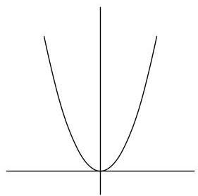
$A = Y - X^{2}$

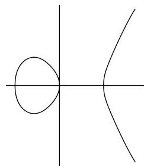
$B = Y^{2} - X^{3} + X$

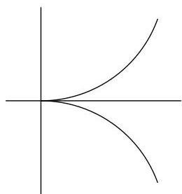
$C = Y^{2} - X^{3}$

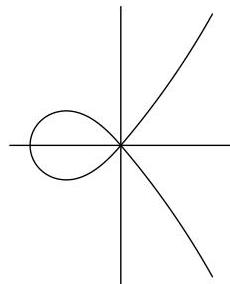
$D = Y^{2} - X^{3} - X^{2}$

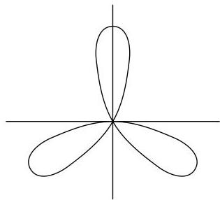
$E = (X^{2} + Y^{2})^{2} + 3X^{2}Y - Y^{3}$

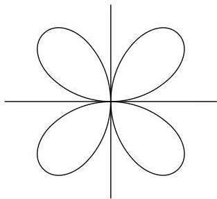
$F = (X^{2} + Y^{2})^{3} - 4X^{2}Y^{2}$

A calculation with derivatives shows that  $A$  and  $B$  are nonsingular curves, and that  $P = (0,0)$  is the only multiple point on  $C, D, E$ , and  $F$ . In the first two examples, the linear term of the equation for the curve is just the tangent line to the curve at  $(0,0)$ . The lowest terms in  $C, D, E$ , and  $F$  respectively are  $Y^2$ ,  $Y^2 - X^2 = (Y - X)(Y + X)$ ,  $3X^2Y - Y^3 = Y(\sqrt{3}X - Y)(\sqrt{3}X + Y)$ , and  $-4X^2Y^2$ . In each case, the lowest order form picks out those lines that can best be called tangent to the curve at  $(0,0)$ .

Let  $F$  be any curve,  $P = (0,0)$ . Write  $F = F_{m} + F_{m+1} + \dots + F_{n}$ , where  $F_{i}$  is a form in  $k[X,Y]$  of degree  $i$ ,  $F_{m} \neq 0$ . We define  $m$  to be the multiplicity of  $F$  at  $P = (0,0)$ , write  $m = m_{P}(F)$ . Note that  $P \in F$  if and only if  $m_{P}(F) &gt; 0$ . Using the rules for derivatives, it is easy to check that  $P$  is a simple point on  $F$  if and only if  $m_{P}(F) = 1$ , and in this case  $F_{1}$  is exactly the tangent line to  $F$  at  $P$ . If  $m = 2$ ,  $P$  is called a double point; if  $m = 3$ , a triple point, etc.

---

3.1. MULTIPLE POINTS AND TANGENT LINES

Since $F_{m}$ is a form in two variables, we can write $F_{m} = \prod L_{i}^{r_{i}}$ where the $L_{i}$ are distinct lines (Corollary in §2.6). The $L_{i}$ are called the tangent lines to $F$ at $P = (0,0)$; $r_{i}$ is the multiplicity of the tangent. The line $L_{i}$ is a simple (resp. double, etc.) tangent if $r_{i} = 1$ (resp. 2, etc.). If $F$ has $m$ distinct (simple) tangents at $P$, we say that $P$ is an ordinary multiple point of $F$. An ordinary double point is called a node. (The curve $D$ has a node at $(0,0)$, $E$ has an ordinary triple point, while $C$ and $F$ have a nonordinary multiple point at $(0,0)$.) For convenience, we call a line through $P$ a tangent of multiplicity zero if it is not tangent to $F$ at $P$.

Let $F = \prod F_{i}^{e_{i}}$ be the factorization of $F$ into irreducible components. Then $m_{P}(F) = \sum e_{i} m_{P}(F_{i})$; and if $L$ is a tangent line to $F_{i}$ with multiplicity $r_{i}$, then $L$ is tangent to $F$ with multiplicity $\sum e_{i} r_{i}$. (This is a consequence of the fact that the lowest degree term of $F$ is the product of the lowest degree terms of its factors.)

In particular, a point $P$ is a simple point of $F$ if and only if $P$ belongs to just one component $F_{i}$ of $F$, $F_{i}$ is a simple component of $F$, and $P$ is a simple point of $F_{i}$.

To extend these definitions to a point $P = (a, b) \neq (0, 0)$, Let $T$ be the translation that takes $(0, 0)$ to $P$, i.e., $T(x, y) = (x + a, y + b)$. Then $F^T = F(X + a, Y + b)$. Define $m_P(F)$ to be $m_{(0, 0)}(F^T)$, i.e., write $F^T = G_m + G_{m+1} + \cdots$, $G_i$ forms, $G_m \neq 0$, and let $m = m_P(F)$. If $G_m = \prod L_i^{r_i}$, $L_i = \alpha_i X + \beta_i Y$, the lines $\alpha_i (X - a) + \beta_i (Y - b)$ are defined to be the tangent lines to $F$ at $P$, and $r_i$ is the multiplicity of the tangent, etc. Note that $T$ takes the points of $F^T$ to the points of $F$, and the tangents to $F^T$ at $(0, 0)$ to the tangents to $F$ at $P$. Since $F_X(P) = F_X^T(0, 0)$ and $F_Y(P) = F_Y^T(0, 0)$, $P$ is a simple point on $F$ if and only if $m_P(F) = 1$, and the two definitions of tangent line to a simple point coincide.

# Problems

3.1. Prove that in the above examples $P = (0,0)$ is the only multiple point on the curves $C, D, E,$ and $F$.

3.2. Find the multiple points, and the tangent lines at the multiple points, for each of the following curves:

(a) $Y^{3} - Y^{2} + X^{3} - X^{2} + 3XY^{2} + 3X^{2}Y + 2XY$
(b) $X^4 +Y^4 -X^2 Y^2$
(c) $X^3 +Y^3 -3X^2 -3Y^2 +3XY + 1$
(d) $Y^{2} + (X^{2} - 5)(4X^{4} - 20X^{2} + 25)$

Sketch the part of the curve in (d) that is contained in $\mathbb{A}^2 (\mathbb{R})\subset \mathbb{A}^2 (\mathbb{C})$.

3.3. If a curve $F$ of degree $n$ has a point $P$ of multiplicity $n$, show that $F$ consists of $n$ lines through $P$ (not necessarily distinct).

3.4. Let $P$ be a double point on a curve $F$. Show that $P$ is a node if and only if $F_{XY}(P)^2 \neq F_{XX}(P)F_{YY}(P)$.

3.5. (char $(k) = 0$ ) Show that $m_P(F)$ is the smallest integer $m$ such that for some $i + j = m$, $\frac{\partial^m F}{\partial x^i \partial y^j} (P) \neq 0$. Find an explicit description for the leading form for $F$ at $P$ in terms of these derivatives.

---

3.6. Irreducible curves with given tangent lines $L_{i}$ of multiplicity $r_{i}$ may be constructed as follows: if $\sum r_{i}=m$, let $F=\prod L_{i}^{r_{i}}+F_{m+1}$, where $F_{m+1}$ is chosen to make $F$ irreducible (see Problem 2.34).

3.7. (a) Show that the real part of the curve $E$ of the examples is the set of points in $\mathbb{A}^{2}(\mathbb{R})$ whose polar coordinates $(r,\theta)$ satisfy the equation $r=-\sin(3\theta)$. Find the polar equation for the curve $F$. (b) If $n$ is an odd integer $\geq 1$, show that the equation $r=\sin(n\theta)$ defines the real part of a curve of degree $n+1$ with an ordinary $n$-tuple point at $(0,0)$. (Use the fact that $\sin(n\theta)=\operatorname{Im}(e^{in\theta})$ to get the equation; note that rotation by $\pi/n$ is a linear transformation that takes the curve into itself.) (c) Analyze the singularities that arise by looking at $r^{2}=\sin^{2}(n\theta)$, $n$ even. (d) Show that the curves constructed in (b) and (c) are all irreducible in $\mathbb{A}^{2}(\mathbb{C})$. (Hint:: Make the polynomials homogeneous with respect to a variable $Z$, and use §2.1.)

3.8. Let $T\colon\mathbb{A}^{2}\to\mathbb{A}^{2}$ be a polynomial map, $T(Q)=P$. (a) Show that $m_{Q}(F^{T})\geq m_{P}(F)$. (b) Let $T=(T_{1},T_{2})$, and define $J_{Q}T=(\partial T_{i}/\partial X_{j}(Q))$ to be the Jacobian matrix of $T$ at $Q$. Show that $m_{Q}(F^{T})=m_{P}(F)$ if $J_{Q}T$ is invertible. (c) Show that the converse of (b) is false: let $T=(X^{2},Y)$, $F=Y-X^{2}$, $P=Q=(0,0)$.

3.9. Let $F\in k[X_{1},\ldots,X_{n}]$ define a hypersurface $V(F)\subset\mathbb{A}^{n}$. Let $P\in\mathbb{A}^{n}$. (a) Define the multiplicity $m_{P}(F)$ of $F$ at $P$. (b) If $m_{P}(F)=1$, define the tangent hyperplane to $F$ at $P$. (c) Examine $F=X^{2}+Y^{2}-Z^{2}$, $P=(0,0)$. Is it possible to define tangent hyperplanes at multiple points?

3.10. Show that an irreducible plane curve has only a finite number of multiple points. Is this true for hypersurfaces?

3.11. Let $V\subset\mathbb{A}^{n}$ be an affine variety, $P\in V$. The tangent space $T_{P}(V)$ is defined to be $\{(v_{1},\ldots,v_{n})\in\mathbb{A}^{n}\mid\text{for all }G\in I(V),\sum G_{X_{i}}(P)v_{i}=0\}$. If $V=V(F)$ is a hypersurface, $F$ irreducible, show that $T_{P}(V)=\{(v_{1},\ldots,v_{n})\mid\sum F_{X_{i}}(P)v_{i}=0\}$. How does the dimension of $T_{P}(V)$ relate to the multiplicity of $F$ at $P$?

### 3.2 Multiplicities and Local Rings

Let $F$ be an irreducible plane curve, $P\in F$. In this section we find the multiplicity of $P$ on $F$ in terms of the local ring $\mathcal{O}_{P}(F)$. The following notation will be useful: for any polynomial $G\in k[X,Y]$, denote its image (residue) in $\Gamma(F)=k[X,Y]/(F)$ by $g$.

###### Theorem 1.

$P$ is a simple point of $F$ if and only if $\mathcal{O}_{P}(F)$ is a discrete valuation ring. In this case, if $L=aX+bY+c$ is any line through $P$ that is not tangent to $F$ at $P$, then the image $l$ of $L$ in $\mathcal{O}_{P}(F)$ is a uniformizing parameter for $\mathcal{O}_{P}(F)$.

###### Proof.

Suppose $P$ is a simple point on $F$, and $L$ is a line through $P$, not tangent to $F$ at $P$. By making an affine change of coordinates, we may assume that $P=(0,0)$, that $Y$ is the tangent line, and that $L=X$ (Problems 2.15(d) and 2.22). By Proposition 4 of §2.5, it suffices to show that $\mathfrak{m}_{P}(F)$ is generated by $x$.

First note that $\mathfrak{m}_{P}(F)=(x,y)$, whether $P$ is simple or not (Problems 2.43, 2.44).

Now with the above assumptions, $F=Y+$ higher terms. Grouping together those terms with $Y$, we can write $F=YG-X^{2}H$, where $G=1+$ higher terms, $H\in k[X]$.

---

3.2. MULTIPLICITIES AND LOCAL RINGS

Then $yg = x^{2}h \in \Gamma(F)$, so $y = x^{2}hg^{-1} \in (x)$, since $g(P) \neq 0$. Thus $m_{P}(F) = (x,y) = (x)$, as desired.

The converse will follow from Theorem 2.

Suppose $P$ is a simple point on an irreducible curve $F$. We let $\operatorname{ord}_P^F$ be the order function on $k(F)$ defined by the DVR $\mathcal{O}_P(F)$; when $F$ is fixed, we may write simply $\operatorname{ord}_P$. If $G \in k[X,Y]$, and $g$ is the image of $G$ in $\Gamma(F)$, we write $\operatorname{ord}_P^F(G)$ instead of $\operatorname{ord}_P^F(g)$.

If $P$ is a simple point on a reducible curve $F$, we write $\operatorname{ord}_P^F$ instead of $\operatorname{ord}_P^{F_i}$, where $F_i$ is the component of $F$ containing $P$.

Suppose $P$ is a simple point on $F$, and $L$ is any line through $P$. Then $\operatorname{ord}_P^F(L) = 1$ if $L$ is not tangent to $F$ at $P$, and $\operatorname{ord}_P^F(L) &gt; 1$ if $L$ is tangent to $F$ at $P$. For we may assume the conditions are as in the proof of Theorem 1; $Y$ is the tangent, $y = x^{2}hg^{-1}$, so $\operatorname{ord}_P(y) = \operatorname{ord}_P(x^2) + \operatorname{ord}_P(hg^{-1}) \geq 2$.

The proof of the next theorem introduces a technique that will reappear at several places in our study of curves. It allows us to calculate the dimensions of certain vector spaces of the type $\mathcal{O}_P(V) / I$, where $I$ is an ideal in $\mathcal{O}_P(V)$.

Theorem 2. Let $P$ be a point on an irreducible curve $F$. Then for all sufficiently large $n$,

$$
m _ {P} (F) = \dim_ {k} \left(\mathfrak {m} _ {P} (F) ^ {n} / \mathfrak {m} _ {P} (F) ^ {n + 1}\right).
$$

In particular, the multiplicity of $F$ at $P$ depends only on the local ring $\mathcal{O}_P(F)$.

Proof. Write $\mathcal{O}$, $\mathfrak{m}$ for $\mathcal{O}_P(F)$, $\mathfrak{m}_P(F)$ respectively. From the exact sequence

$$
0 \longrightarrow \mathfrak {m} ^ {n} / \mathfrak {m} ^ {n + 1} \longrightarrow \mathcal {O} / \mathfrak {m} ^ {n + 1} \longrightarrow \mathcal {O} / \mathfrak {m} ^ {n} \longrightarrow 0
$$

it follows that it is enough to prove that $\dim_k(\mathcal{O} / \mathfrak{m}^n) = nm_P(F) + s$, for some constant $s$, and all $n \geq m_P(F)$ (Problem 2.49(e) and Proposition 7 of §2.10). We may assume that $P = (0,0)$, so $\mathfrak{m}^n = I^n\mathcal{O}$, where $I = (X,Y) \subset k[X,Y]$ (Problem 2.43). Since $V(I^n) = \{P\}$, $k[X,Y] / (I^n,F) \cong \mathcal{O}_P(\mathbb{A}^2) / (I^n,F)\mathcal{O}_P(\mathbb{A}^2) \cong \mathcal{O}_P(F) / I^n\mathcal{O}_P(F) = \mathcal{O} / \mathfrak{m}^n$ (Corollary 2 of §2.9 and Problem 2.44).

So we are reduced to calculating the dimension of $k[X, Y] / (I^n, F)$. Let $m = m_P(F)$. Then $FG \in I^n$ whenever $G \in I^{n - m}$. There is a natural ring homomorphism $\varphi$ from $k[X, Y] / I^n$ to $k[X, Y] / (I^n, F)$, and a $k$-linear map $\psi$ from $k[X, Y] / I^{n - m}$ to $k[X, Y] / I^n$ defined by $\psi(\overline{G}) = \overline{FG}$ (where the bars denote residues). It is easy to verify that the sequence

$$
0 \longrightarrow k [ X, Y ] / I ^ {n - m} \xrightarrow {\psi} k [ X, Y ] / I ^ {n} \xrightarrow {\varphi} k [ X, Y ] / (I ^ {n}, F) \longrightarrow 0
$$

is exact. Applying Problem 2.46 and Proposition 7 of §2.10 again, we see that

$$
\dim_ {k} (k [ X, Y ] / (I ^ {n}, F)) = n m - \frac {m (m - 1)}{2}
$$

for all $n\geq m$, as desired.

---

CHAPTER 3. LOCAL PROPERTIES OF PLANE CURVES

Note that if $\mathcal{O}_P(F)$ is a DVR, then Theorem 2 implies that $m_P(F) = 1$ (Problem 2.50) so $P$ is simple. This completes the proof of Theorem 1.

It should at least be remarked that the function $\chi(n) = \dim_k(\mathcal{O} / \mathfrak{m}^n)$, which is a polynomial in $n$ (for large $n$) is called the Hilbert-Samuel polynomial of the local ring $\mathcal{O}$; it plays an important role in the modern study of the multiplicities of local rings.

## Problems

3.12. A simple point $P$ on a curve $F$ is called a flex if $\operatorname{ord}_P^F(L) \geq 3$, where $L$ is the tangent to $F$ at $P$. The flex is called ordinary if $\operatorname{ord}_P(L) = 3$, a higher flex otherwise. (a) Let $F = Y - X^n$. For which $n$ does $F$ have a flex at $P = (0,0)$, and what kind of flex? (b) Suppose $P = (0,0)$, $L = Y$ is the tangent line, $F = Y + aX^2 + \cdots$. Show that $P$ is a flex on $F$ if and only if $a = 0$. Give a simple criterion for calculating $\operatorname{ord}_P^F(Y)$, and therefore for determining if $P$ is a higher flex.

3.13.* With the notation of Theorem 2, and $\mathfrak{m} = \mathfrak{m}_P(F)$, show that $\dim_k(\mathfrak{m}^n / \mathfrak{m}^{n+1}) = n + 1$ for $0 \leq n &lt; m_P(F)$. In particular, $P$ is a simple point if and only if $\dim_k(\mathfrak{m} / \mathfrak{m}^2) = 1$; otherwise $\dim_k(\mathfrak{m} / \mathfrak{m}^2) = 2$.

3.14. Let $V = V(X^2 - Y^3, Y^2 - Z^3) \subset \mathbb{A}^3$, $P = (0, 0, 0)$, $\mathfrak{m} = \mathfrak{m}_P(V)$. Find $\dim_k(\mathfrak{m} / \mathfrak{m}^2)$. (See Problem 1.40.)

3.15. (a) Let $\mathcal{O} = \mathcal{O}_P(\mathbb{A}^2)$ for some $P \in \mathbb{A}^2$, $\mathfrak{m} = \mathfrak{m}_P(\mathbb{A}^2)$. Calculate $\chi(n) = \dim_k(\mathcal{O} / \mathfrak{m}^n)$. (b) Let $\mathcal{O} = \mathcal{O}_P(\mathbb{A}^r(k))$. Show that $\chi(n)$ is a polynomial of degree $r$ in $n$, with leading coefficient $1 / r!$ (see Problem 2.36).

3.16. Let $F \in k[X_1, \ldots, X_n]$ define a hypersurface in $\mathbb{A}^r$. Write $F = F_m + F_{m+1} + \cdots$, and let $m = m_P(F)$ where $P = (0, 0)$. Suppose $F$ is irreducible, and let $\mathcal{O} = \mathcal{O}_P(V(F))$, $\mathfrak{m}$ its maximal ideal. Show that $\chi(n) = \dim_k(\mathcal{O} / \mathfrak{m}^n)$ is a polynomial of degree $r - 1$ for sufficiently large $n$, and that the leading coefficient of $\chi$ is $m_P(F) / (r - 1)!$.

Can you find a definition for the multiplicity of a local ring that makes sense in all the cases you know?

## 3.3 Intersection Numbers

Let $F$ and $G$ be plane curves, $P \in \mathbb{A}^2$. We want to define the intersection number of $F$ and $G$ at $P$; it will be denoted by $I(P, F \cap G)$. Since the definition is rather unintuitive, we shall first list seven properties we want this intersection number to have. We then prove that there is only one possible definition, and at the same time we find a simple procedure for calculating $I(P, F \cap G)$ in a reasonable number of steps.

We say that $F$ and $G$ intersect properly at $P$ if $F$ and $G$ have no common component that passes through $P$. Our first requirements are:

(1) $I(P, F \cap G)$ is a nonnegative integer for any $F, G$, and $P$ such that $F$ and $G$ intersect properly at $P$. $I(P, F \cap G) = \infty$ if $F$ and $G$ do not intersect properly at $P$.

---

2. $I(P,F\cap G)=0$ if and only if $P\not\in F\cap G$. $I(P,F\cap G)$ depends only on the components of $F$ and $G$ that pass through $P$. And $I(P,F\cap G)=0$ if $F$ or $G$ is a nonzero constant.
3. If $T$ is an affine change of coordinates on $\mathbb{A}^{2}$, and $T(Q)=P$, then $I(P,F\cap G)=I(Q,F^{T}\cap G^{T})$.
4. $I(P,F\cap G)=I(P,G\cap F)$.

Two curves $F$ and $G$ are said to intersect transversally at $P$ if $P$ is a simple point both on $F$ and on $G$, and if the tangent line to $F$ at $P$ is different from the tangent line to $G$ at $P$. We want the intersection number to be one exactly when $F$ and $G$ meet transversally at $P$. More generally, we require

1. $I(P,F\cap G)\geq m_{P}(F)m_{P}(G)$, with equality occurring if and only if $F$ and $G$ have not tangent lines in common at $P$.

The intersection numbers should add when we take unions of curves:

1. If $F=\prod F_{i}^{r_{i}}$, and $G=\prod G_{j}^{s_{j}}$, then $I(P,F\cap G)=\sum_{i,j}r_{i}s_{j}I(P,F_{i}\cap G_{j})$.

The last requirement is probably the least intuitive. If $F$ is irreducible, it says that $I(P,F\cap G)$ should depend only on the image of $G$ in $\Gamma(F)$. Or, for arbitrary $F$,

1. $I(P,F\cap G)=I(P,F\cap(G+AF))$ for any $A\in k[X,Y]$.

###### Theorem 3.1

There is a unique intersection number $I(P,F\cap G)$ defined for all plane curves $F$, $G$, and all points $P\in\mathbb{A}^{2}$, satisfying properties (1)–(7). It is given by the formula

$I(P,F\cap G)=\dim_{k}(\mathcal{O}_{P}(\mathbb{A}^{2})/(F,G)).$

###### Proof of Uniqueness

Assume we have a number $I(P,F\cap G)$ defined for all $F$, $G$, and $P$, satisfying (1)-(7). We will give a constructive procedure for calculating $I(P,F\cap G)$ using only these seven properties, that is stronger than the required uniqueness. We may suppose $P=(0,0)$ (by (3)), and that $I(P,F\cap G)$ is finite (by (1)). The case when $I(P,F\cap G)=0$ is taken care of by (2), so we may proceed by induction; assume $I(P,F\cap G)=n>0$, and $I(P,A\cap B)$ can be calculated whenever $I(P,A\cap B)<n$. Let $F(X,0),G(X,0)\in k[X]$ be of degree $r$, $s$ respectively, where $r$ or $s$ is taken to be zero if the polynomial vanishes. We may suppose $r\leq s$ (by (4)).

Case 1: $r=0$. Then $Y$ divides $F$, so $F=YH$, and

$I(P,F\cap G)=I(P,Y\cap G)+I(P,H\cap G)$

(by (6)). If $G(X,0)=X^{m}(a_{0}+a_{1}X+\cdots)$, $a_{0}\neq 0$, then $I(P,Y\cap G)=I(P,Y\cap G(X,0))=I(P,Y\cap X^{m})=m$ (by (7), (2), (6), and (5)). Since $P\in G$, $m>0$, so $I(P,H\cap G)<n$, and we are done by induction.

Case 2: $r>0$. We may multiply $F$ and $G$ by constants to make $F(X,0)$ and $G(X,0)$ monic. Let $H=G-X^{s-r}F$. Then $I(P,F\cap G)=I(P,F\cap H)$ (by (7)), and $\deg(H(X,0))=t<s$. Repeating this process (interchanging the order of $F$ and $H$ if $t<r$) a finite number of times we eventually reach a pair of curves $A,B$ that fall under Case 1, and with $I(P,F\cap G)=I(P,A\cap B)$. This concludes the proof.

###### Proof of Existence

Define $I(P,F\cap G)$ to be $\dim_{k}(\mathcal{O}_{P}(\mathbb{A}^{2})/(F,G))$. We must show that properties (1)–(7) are satisfied. Since $I(P,F\cap G)$ depends only on the ideal in $\mathcal{O}_{P}(\mathbb{A}^{2})$

---

CHAPTER 3. LOCAL PROPERTIES OF PLANE CURVES

generated by  $F$  and  $G$ , properties (2), (4), and (7) are obvious. Since an affine change of coordinates gives an isomorphism of local rings (Problem 2.22), (3) is also clear. We may thus assume that  $P = (0,0)$ , and that all the components of  $F$  and  $G$  pass through  $P$ . Let  $\mathcal{O} = \mathcal{O}_P(\mathbb{A}^2)$ .

If  $F$  and  $G$  have no common components,  $I(P,F\cap G)$  is finite by Corollary 1 of §2.9. If  $F$  and  $G$  have a common component  $H$ , then  $(F,G)\subset (H)$ , so there is a homomorphism from  $\mathcal{O} / (F,G)$  onto  $\mathcal{O} / (H)$  (Problem 2.42), and  $I(P,F\cap G)\geq \dim_k(\mathcal{O} / (H))$ . But  $\mathcal{O} / (H)$  is isomorphic to  $\mathcal{O}_P(H)$  (Problem 2.44), and  $\mathcal{O}_P(H)\supset \Gamma (H)$ , with  $\Gamma (H)$  infinite-dimensional by Corollary 4 to the Nullstellensatz. This proves (1).

To prove (6), it is enough to show that  $I(P,F\cap GH) = I(P,F\cap G) + I(P,F\cap H)$  for any  $F,G,H$ . We may assume  $F$  and  $GH$  have no common components, since the result is clear otherwise. Let  $\varphi \colon \mathcal{O} / (F,GH)\to \mathcal{O} / (F,G)$  be the natural homomorphism (Problem 2.42), and define a  $k$ -linear map  $\psi \colon \mathcal{O} / (F,H)\to \mathcal{O} / (F,GH)$  by letting  $\psi (\overline{z}) = \overline{Gz}$ ,  $z\in \mathcal{O}$  (the bar denotes residues). By Proposition 7 of §2.10, it is enough to show that the sequence

$$
0 \longrightarrow \mathcal {O} / (F, H) \xrightarrow {\psi} \mathcal {O} / (F, G H) \xrightarrow {\varphi} \mathcal {O} / (F, G) \longrightarrow 0
$$

is exact.

We will verify that  $\psi$  is one-to-one; the rest (which is easier) is left to the reader. If  $\psi(\overline{z}) = 0$ , then  $Gz = uF + vGH$  where  $u, v \in \mathcal{O}$ . Choose  $S \in k[X,Y]$  with  $S(P) \neq 0$ , and  $Su = A, Sv = B$ , and  $Sz = C \in k[X,Y]$ . Then  $G(C - BH) = AF$  in  $k[X,Y]$ . Since  $F$  and  $G$  have no common factors,  $F$  must divide  $C - BH$ , so  $C - BH = DF$ . Then  $z = (B/S)H + (D/S)F$ , or  $\overline{z} = 0$ , as claimed.

Property (5) is the hardest. Let  $m = m_P(F)$ ,  $n = m_P(G)$ . Let  $I$  be the ideal in  $k[X, Y]$  generated by  $X$  and  $Y$ . Consider the following diagram of vector spaces and linear maps:

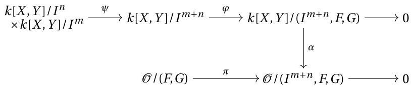

where  $\varphi, \pi,$  and  $\alpha$  are the natural ring homomorphisms, and  $\psi$  is defined by letting  $\psi(\overline{A}, \overline{B}) = \overline{AF + BG}$ .

Now  $\varphi$  and  $\pi$  are clearly surjective, and, since  $V(I^{m + n},F,G)\subset \{P\}$ ,  $\alpha$  is an isomorphism by Corollary 2 in §2.9. It is easy to check that the top row is exact. It follows that

$$
\dim (k [ X, Y ] / I ^ {n}) + \dim (k [ X, Y ] / I ^ {m}) \geq \dim (\operatorname {K e r} (\varphi)),
$$

with equality if and only if  $\psi$  is one-to-one, and that

$$
\dim (k [ X, Y ] / (I ^ {m + n}, F, G)) = \dim (k [ X, Y ] / I ^ {m + n}) - \dim (\operatorname {K e r} (\varphi)).
$$

---

Putting all this together, we get the following string of inequalities:

$I(P,F\cap G)$ $=\dim(\mathcal{O}/(F,G))\geq\dim(\mathcal{O}/(I^{m+n},F,G))$
$=\dim(k[X,Y]/(I^{m+n},F,G))$
$\geq\dim(k[X,Y]/I^{m+n})-\dim(k[X,Y]/I^{n})-\dim(k[X,Y]/I^{m})$
$=mn$

(by Problem 2.46 and arithmetic).

This shows that $I(P,F\cap G)\geq mn$, and that $I(P,F\cap G)=mn$ if and only if both inequalities in the above string are equalities. The first such inequality is an equality if $\pi$ is an isomorphism, i.e., if $I^{m+n}\subset(F,G)\mathcal{O}$. The second is an equality if and only if $\psi$ is one-to-one. Property (5) is therefore a consequence of:

###### Lemma.

1. If $F$ and $G$ have no common tangents at $P$, then $I^{t}\subset(F,G)\mathcal{O}$ for $t\geq m+n-1$.
2. $\psi$ is one-to-one if and only if $F$ and $G$ have distinct tangents at $P$.

###### Proof of (a).

Let $L_{1},\ldots,L_{m}$ be the tangents to $F$ at $P$, $M_{1},\ldots,M_{n}$ the tangents to $G$. Let $L_{i}=L_{m}$ if $i>m$, $M_{j}=M_{n}$ if $j>n$, and let $A_{ij}=L_{1}\cdots L_{i}M_{1}\cdots M_{j}$ for all $i,j\geq 0$ ($A_{00}=1$). The set $\{A_{ij}\mid i+j=t\}$ forms a basis for the vector space of all forms of degree $t$ in $k[X,Y]$ (Problem 2.35(c)).

To prove (a), it therefore suffices to show that $A_{ij}\in(F,G)\mathcal{O}$ for all $i+j\geq m+n-1$. But $i+j\geq m+n-1$ implies that either $i\geq m$ or $j\geq n$. Say $i\geq m$, so $A_{ij}=A_{m0}B$, where $B$ is a form of degree $t=i+j-m$. Write $F=A_{m0}+F^{\prime}$, where all terms of $F^{\prime}$ are of degree $\geq m+1$. Then $A_{ij}=BF-BF^{\prime}$, where each term of $BF^{\prime}$ has degree $\geq i+j+1$. We will be finished, then, if we can show that $I^{t}\subset(F,G)\mathcal{O}$ for all sufficiently large $t$.

This fact is surely a consequence of the Nullstellensatz: let $V(F,G)=\{P,Q_{1},\ldots,Q_{s}\}$, and choose a polynomial $H$ so that $H(Q_{i})=0$, $H(P)\neq 0$ (Problem 1.17). Then $HX$ and $HY$ are in $I(V(F,G))$, so $(HX)^{N},(HY)^{N}\in(F,G)\subset k[X,Y]$ for some $N$. Since $H^{N}$ is a unit in $\mathcal{O}$, $X^{N}$ and $Y^{N}$ are in $(F,G)\mathcal{O}$, and therefore $I^{2N}\subset(F,G)\mathcal{O}$, as desired.

###### Proof of (b).

Suppose the tangents are distinct, and that

$\psi(\overline{A},\overline{B})=\overline{AF+BG}=0,$

i.e., $AF+BG$ consists entirely of terms of degree $\geq m+n$. Suppose $r<m$ or $s<n$. Write $A=A_{r}+$ higher terms, $B=B_{s}+\cdots$, so $AF+BG=A_{r}F_{m}+B_{s}G_{n}+\cdots$. Then we must have $r+m=s+n$ and $A_{r}F_{m}=-B_{s}G_{n}$. But $F_{m}$ and $G_{n}$ have no common factors, so $F_{m}$ divides $B_{s}$, and $G_{n}$ divides $A_{r}$. Therefore $s\geq m$, $r\geq n$, so $(\overline{A},\overline{B})=(0,0)$.

Conversely, if $L$ were a common tangent to $F$ and $G$ at $P$, write $F_{m}=LF^{\prime}_{m-1}$ and $G_{n}=LG^{\prime}_{n-1}$. Then $\psi(\overline{G^{\prime}_{n-1}},-\overline{F^{\prime}_{m-1}})=0$, so $\psi$ is not one-to-one. This completes the proof of the lemma, and also of Theorem 3.

Two things should be noticed about the uniqueness part of the above proof. First, it shows that, as axioms, Properties (1)–(7) are exceedingly redundant; for example, the only part of Property (5) that is needed is that $I((0,0),X\cap Y)=1$. (The reader might try to find a minimal set of axioms that characterizes the intersection

---

CHAPTER 3. LOCAL PROPERTIES OF PLANE CURVES

number.) Second, the proof shows that the calculation of intersection numbers is a very easy matter. Making imaginative use of (5) and (7) can save much time, but the proof shows that nothing more is needed than some arithmetic with polynomials.

Example. Let us calculate $I(P, E \cap F)$, where $E = (X^2 + Y^2)^2 + 3X^2Y - Y^3$, $F = (X^2 + Y^2)^3 - 4X^2Y^2$, and $P = (0,0)$, as in the examples of Section 1. We can get rid of the worst part of $F$ by replacing $F$ by $F - (X^2 + Y^2)E = Y((X^2 + Y^2)(Y^2 - 3X^2) - 4X^2Y) = YG$. Since no obvious method is available to find $I(P, E \cap G)$, we apply the process of the uniqueness proof to get rid of the $X$-terms: Replace $G$ by $G + 3E$, which is $Y(5X^2 - 3Y^2 + 4Y^3 + 4X^2Y) = YH$. Then $I(P, E \cap F) = 2I(P, E \cap Y) + I(P, E \cap H)$. But $I(P, E \cap Y) = I(P, X^4 \cap Y) = 4$ (by (7), (6)), and $I(P, E \cap H) = m_P(E)m_P(H) = 6$ (by (5)). So $I(P, E \cap F) = 14$.

Two more properties of the intersection number will be useful later; the first of these can also be used to simplify calculations.

(8) If $P$ is a simple point on $F$, then $I(P, F \cap G) = \operatorname{ord}_P^F(G)$.

Proof. We may assume $F$ is irreducible. If $g$ is the image of $G$ in $\mathcal{O}_P(F)$, then $\operatorname{ord}_P^F(G) = \dim_k(\mathcal{O}_P(F) / (g))$ (Problem 2.50(c)). Since $\mathcal{O}_P(F) / (g)$ is isomorphic to $\mathcal{O}_P(\mathbb{A}^2) / (F, G)$ (Problem 2.44), this dimension is $I(P, F \cap G)$.

(9) If $F$ and $G$ have no common components, then

$$
\sum_{P} I(P, F \cap G) = \dim_{k} \left(k[X, Y] / (F, G)\right).
$$

Proof. This is a consequence of Corollary 1 in §2.9.

# Problems

3.17. Find the intersection numbers of various pairs of curves from the example of Section 1, at the point $P = (0,0)$.

3.18. Give a proof of Property (8) that uses only Properties (1)-(7).

3.19.* A line $L$ is tangent to a curve $F$ at a point $P$ if and only if $I(P, F \cap L) &gt; m_P(F)$.

3.20. If $P$ is a simple point on $F$, then $I(P, F \cap (G + H)) \geq \min(I(P, F \cap G), I(P, F \cap H))$. Give an example to show that this may be false if $P$ is not simple on $F$.

3.21. Let $F$ be an affine plane curve. Let $L$ be a line that is not a component of $F$. Suppose $L = \{(a + tb, c + td) \mid t \in k\}$. Define $G(T) = F(a + Tb, c + Td)$. Factor $G(T) = \epsilon \prod (T - \lambda_i)^{e_i}$, $\lambda_i$ distinct. Show that there is a natural one-to-one correspondence between the $\lambda_i$ and the points $P_i \in L \cap F$. Show that under this correspondence, $I(P_i, L \cap F) = e_i$. In particular, $\sum I(P, L \cap F) \leq \deg(F)$.

3.22. Suppose $P$ is a double point on a curve $F$, and suppose $F$ has only one tangent $L$ at $P$. (a) Show that $I(P, F \cap L) \geq 3$. The curve $F$ is said to have an (ordinary) cusp at $P$ if $I(P, F \cap L) = 3$. (b) Suppose $P = (0, 0)$, and $L = Y$. Show that $P$ is a cusp if and only if $F_{XXX}(P) \neq 0$. Give some examples. (c) Show that if $P$ is a cusp on $F$, then $F$ has only one component passing through $P$.

---

3.3. INTERSECTION NUMBERS

3.23. A point $P$ on a curve $F$ is called a hypercusp if $m_P(F) &gt; 1$, $F$ has only one tangent line $L$ at $P$, and $I(P, L \cap F) = m_P(F) + 1$. Generalize the results of the preceding problem to this case.

3.24.* The object of this problem is to find a property of the local ring $\mathcal{O}_P(F)$ that determines whether or not $P$ is an ordinary multiple point on $F$.

Let $F$ be an irreducible plane curve, $P = (0,0)$, $m = m_P(F) &gt; 1$. Let $\mathfrak{m} = \mathfrak{m}_P(F)$. For $G \in k[X,Y]$, denote its residue in $\Gamma(F)$ by $g$; and for $g \in \mathfrak{m}$, denote its residue in $\mathfrak{m} / \mathfrak{m}^2$ by $\overline{g}$. (a) Show that the map from {forms of degree 1 in $k[X,Y]$} to $\mathfrak{m} / \mathfrak{m}^2$ taking $aX + bY$ to $\overline{ax + by}$ is an isomorphism of vector spaces (see Problem 3.13). (b) Suppose $P$ is an ordinary multiple point, with tangents $L_1, \ldots, L_m$. Show that $I(P,F \cap L_i) &gt; m$ and $\overline{l_i} \neq \lambda \overline{l_j}$ for all $i \neq j$, all $\lambda \in k$. (c) Suppose there are $G_1, \ldots, G_m \in k[X,Y]$ such that $I(P,F \cap G_i) &gt; m$ and $\overline{g}_i \neq \lambda \overline{g}_j$ for all $i \neq j$, and all $\lambda \in k$. Show that $P$ is an ordinary multiple point on $F$. (Hint: Write $G_i = L_i +$ higher terms. $\overline{l}_i = \overline{g}_i \neq 0$, and $L_i$ is the tangent to $G_i$, so $L_i$ is tangent to $F$ by Property (5) of intersection numbers. Thus $F$ has $m$ tangents at $P$.) (d) Show that $P$ is an ordinary multiple point on $F$ if and only if there are $g_1, \ldots, g_m \in \mathfrak{m}$ such that $\overline{g}_i \neq \lambda \overline{g}_j$ for all $i \neq j$, $\lambda \in k$, and $\dim \mathcal{O}_P(F) / (g_i) &gt; m$.

---

CHAPTER 3. LOCAL PROPERTIES OF PLANE CURVES

---

Chapter 4 Projective Varieties

### 4.1 Projective Space

Suppose we want to study all the points of intersection of two curves; consider for example the curve $Y^{2}=X^{2}+1$ and the line $Y=\alpha X$, $\alpha\in k$. If $\alpha\neq\pm 1$, they intersect in two points. When $\alpha=\pm 1$, they no not intersect, but the curve is asymptotic to the line. We want to enlarge the plane in such a way that two such curves intersect “at infinity”.

One way to achieve this is to identify each point $(x,y)\in\mathbb{A}^{2}$ with the point $(x,y,1)\in\mathbb{A}^{3}$. Every point $(x,y,1)$ determines a line in $\mathbb{A}^{3}$ that passes through $(0,0,0)$ and $(x,y,1)$. Every line through $(0,0,0)$ except those lying in the plane $z=0$ corresponds to exactly one such point. The lines through $(0,0,0)$ in the plane $z=0$ can be thought of as corresponding to the “points at infinity”. This leads to the following definition:

Let $k$ be any field. *Projective $n$-space* over $k$, written $\mathbb{P}^{n}(k)$, or simply $\mathbb{P}^{n}$, is defined to be the set of all lines through $(0,0,\ldots,0)$ in $\mathbb{A}^{n+1}(k)$. Any point $(x)=(x_{1},\ldots,x_{n+1})\neq(0,0,\ldots,0)$ determines a unique such line, namely $\{(\lambda x_{1},\ldots,\lambda x_{n+1})\mid\lambda\in k\}$. Two such points $(x)$ and $(y)$ determine the same line if and only if there is a nonzero $\lambda\in k$ such that $y_{i}=\lambda x_{i}$ for $i=1,\ldots,n+1$; let us say that $(x)$ and $(y)$ are equivalent if this is the case. Then $\mathbb{P}^{n}$ may be identified with the set of equivalence classes of points in $\mathbb{A}^{n+1}\smallsetminus\{(0,\ldots,0)\}$.

Elements of $\mathbb{P}^{n}$ will be called *points*. If a point $P\in\mathbb{P}^{n}$ is determined as above by some $(x_{1},\ldots,x_{n+1})\in\mathbb{A}^{n+1}$, we say that $(x_{1},\ldots,x_{n+1})$ are *homogeneous coordinates* for $P$. We often write $P=[x_{1}:\ldots:x_{n+1}]$ to indicate that $(x_{1},\ldots,x_{n+1})$ are homogeneous coordinates for $P$. Note that the $i$th coordinate $x_{i}$ is not well-defined, but that it is a well-defined notion to say whether the $i$th coordinate is zero or nonzero; and if $x_{i}\neq 0$, the ratios $x_{j}/x_{i}$ are well-defined (since they are unchanged under equivalence).

We let $U_{i}=\{[x_{1}:\ldots:x_{n+1}]\in\mathbb{P}^{n}\mid x_{i}\neq 0\}$. Each $P\in U_{i}$ can be written uniquely in the form

$P=[x_{1}:\ldots:x_{i-1}:1:x_{i+1}:\ldots:x_{n+1}].$

The coordinates $(x_{1},\ldots,x_{i-1},x_{i+1},\ldots,x_{n+1})$ are called the *nonhomogeneous coordinates* for $P$ with respect to $U_{i}$ (or $X_{i}$, or $i$). If we define $\varphi_{i}\colon\mathbb{A}^{n}\to U_{i}$ by $\varphi_{i}(a_{1},\ldots,a_{n})=\{x_{1},\ldots,x_{i-1}\}\in\mathbb{A}^{n}$

---

CHAPTER 4. PROJECTIVE VARIETIES

$[a_1: \ldots: a_{i-1}: 1: a_i: \ldots: a_n]$, then $\varphi_i$ sets up a one-to-one correspondence between the points of $\mathbb{A}^n$ and the points of $U_i$. Note that $\mathbb{P}^n = \bigcup_{i=1}^{n+1} U_i$, so $\mathbb{P}^n$ is covered by $n+1$ sets each of which looks just like affine $n$-space.

For convenience we usually concentrate on $U_{n+1}$. Let

$$
H_{\infty} = \mathbb{P}^n \setminus U_{n+1} = \{[x_1: \ldots: x_{n+1}] \mid x_{n+1} = 0\};
$$

$H_{\infty}$ is often called the hyperplane at infinity. The correspondence $[x_1: \ldots: x_n: 0] \leftrightarrow [x_1: \ldots: x_n]$ shows that $H_{\infty}$ may be identified with $\mathbb{P}^{n-1}$. Thus $\mathbb{P}^n = U_{n+1} \cup H_{\infty}$ is the union of an affine $n$-space and a set that gives all directions in affine $n$-space.

Examples. (0) $\mathbb{P}^0(k)$ is a point.

(1) $\mathbb{P}^1(k) = \{[x:1] \mid x \in k\} \cup \{[1:0]\}$. $\mathbb{P}^1(k)$ is the affine line plus one point at infinity. $\mathbb{P}^1(k)$ is the projective line over $k$.

(2) $\mathbb{P}^2(k) = \{[x:y:1] \mid (x,y) \in \mathbb{A}^2\} \cup \{[x:y:0] \mid [x:y] \in \mathbb{P}^1\}$. Here $H_{\infty}$ is called the line at infinity. $\mathbb{P}^2(k)$ is called the projective plane over $k$.

(3) Consider a line $Y = mX + b$ in $\mathbb{A}^2$. If we identify $\mathbb{A}^2$ with $U_3 \subset \mathbb{P}^2$, the points on the line correspond to the points $[x:y:z] \in \mathbb{P}^2$ with $y = mx + bz$ and $z \neq 0$. (We must make the equation homogeneous so that solutions will be invariant under equivalence). The set $\{[x:y:z] \in \mathbb{P}^2 \mid y = mx + bz\} \cap H_{\infty} = \{[1:m:0]\}$. So all lines with the same slope, when extended in this way, pass through the same point at infinity.

(4) Consider again the curve $Y^2 = X^2 + 1$. The corresponding set in $\mathbb{P}^2$ is given by the homogeneous equation $Y^2 = X^2 + Z^2$, $Z \neq 0$. $\{[x:y:z] \in \mathbb{P}^2 \mid y^2 = x^2 + z^2\}$ intersects $H_{\infty}$ in the two points $[1:1:0]$ and $[1: -1:0]$. These are the points where the lines $Y = X$ and $Y = -X$ intersect the curve.

## Problems

4.1. What points in $\mathbb{P}^2$ do not belong to two of the three sets $U_1, U_2, U_3$?

4.2.* Let $F \in k[X_1, \ldots, X_{n+1}]$ ($k$ infinite). Write $F = \sum F_i$, $F_i$ a form of degree $i$. Let $P \in \mathbb{P}^n(k)$, and suppose $F(x_1, \ldots, x_{n+1}) = 0$ for every choice of homogeneous coordinates $(x_1, \ldots, x_{n+1})$ for $P$. Show that each $F_i(x_1, \ldots, x_{n+1}) = 0$ for all homogeneous coordinates for $P$. (Hint: consider $G(\lambda) = F(\lambda x_1, \ldots, \lambda x_{n+1}) = \sum \lambda^i F_i(x_1, \ldots, x_{n+1})$ for fixed $(x_1, \ldots, x_{n+1})$.)

4.3. (a) Show that the definitions of this section carry over without change to the case where $k$ is an arbitrary field. (b) If $k_0$ is a subfield of $k$, show that $\mathbb{P}^n(k_0)$ may be identified with a subset of $\mathbb{P}^n(k)$.

## 4.2 Projective Algebraic Sets

In this section we develop the idea of algebraic sets in $\mathbb{P}^n = \mathbb{P}^n(k)$. Since the concepts and most of the proofs are entirely similar to those for affine algebraic sets, many details will be left to the reader.

---

4.2. PROJECTIVE ALGEBRAIC SETS

A point $P \in \mathbb{P}^n$ is said to be a zero of a polynomial $F \in k[X_1, \ldots, X_{n+1}]$ if

$$
F(x_1, \ldots, x_{n+1}) = 0
$$

for every choice of homogeneous coordinates $(x_1, \ldots, x_{n+1})$ for $P$; we then write $F(P) = 0$. If $F$ is a form, and $F$ vanishes at one representative of $P$, then it vanishes at every representative. If we write $F$ as a sum of forms in the usual way, then each form vanishes on any set of homogeneous coordinates for $P$ (Problem 4.2).

For any set $S$ of polynomials in $k[X_1, \ldots, X_{n+1}]$, we let

$$
V(S) = \{P \in \mathbb{P}^n \mid P \text{ is a zero of each } F \in S\}.
$$

If $I$ is the ideal generated by $S$, $V(I) = V(S)$. If $I = (F^{(1)}, \ldots, F^{(r)})$, where $F^{(i)} = \sum F_j^{(i)}$, $F_j^{(i)}$ a form of degree $j$, then $V(I) = V(\{F_j^{(i)}\})$, so $V(S) = V(\{F_j^{(i)}\})$ is the set of zeros of a finite number of forms. Such a set is called an algebraic set in $\mathbb{P}^n$, or a projective algebraic set.

For any set $X \subset \mathbb{P}^n$, we let $I(X) = \{F \in k[X_1, \ldots, X_{n+1}] \mid \text{every } P \in X \text{ is a zero of } F\}$. The ideal $I(X)$ is called the ideal of $X$.

An ideal $I \subset k[X_1, \ldots, X_{n+1}]$ is called homogeneous if for every $F = \sum_{i=0}^{m} F_i \in I$, $F_i$ a form of degree $i$, we have also $F_i \in I$. For any set $X \subset \mathbb{P}^n$, $I(X)$ is a homogeneous ideal.

**Proposition 1.** An ideal $I \subset k[X_1, \ldots, X_{n+1}]$ is homogeneous if and only if it is generated by a (finite) set of forms.

**Proof.** If $I = (F^{(1)}, \ldots, F^{(r)})$ is homogeneous, then $I$ is generated by $\{F_j^{(i)}\}$. Conversely, let $S = \{F^{(\alpha)}\}$ be a set of forms generating an ideal $I$, with $\deg(F^{(\alpha)}) = d_{\alpha}$, and suppose $F = F_m + \dots + F_r \in I$, $\deg(F_i) = i$. It suffices to show that $F_m \in I$, for then $F - F_m \in I$, and an inductive argument finishes the proof. Write $F = \sum A^{(\alpha)} F^{(\alpha)}$. Comparing terms of the same degree, we conclude that $F_m = \sum A_{m - d_{\alpha}}^{(\alpha)} F^{(\alpha)}$, so $F_m \in I$.

An algebraic set $V \subset \mathbb{P}^n$ is irreducible if it is not the union of two smaller algebraic sets. The same proof as in the affine case, but using Problem 4.4 below, shows that $V$ is irreducible if and only if $I(V)$ is prime. An irreducible algebraic set in $\mathbb{P}^n$ is called a projective variety. Any projective algebraic set can be written uniquely as a union of projective varieties, its irreducible components.

The operations

$$
\left\{\text{homogeneous ideals in } k[X_1, \ldots, X_{n+1}] \right\} \stackrel{V}{\underset{I}{\rightleftarrows}} \left\{\text{algebraic sets in } \mathbb{P}^n(k) \right\}
$$

satisfy most of the properties we found in the corresponding affine situation (see Problem 4.6). We have used the same notation in these two situations. In practice it should always be clear which is meant; if there is any danger of confusion, we will write $V_p$, $I_p$ for the projective operations, $V_a$, $I_a$ for the affine ones.

If $V$ is an algebraic set in $\mathbb{P}^n$, we define

$$
C(V) = \{(x_1, \ldots, x_{n+1} \in \mathbb{A}^{n+1} \mid [x_1 : \ldots : x_{n+1}] \in V \text{ or } (x_1, \ldots, x_{n+1}) = (0, \ldots, 0)\}
$$

---

CHAPTER 4. PROJECTIVE VARIETIES

to be the cone over $V$. If $V \neq \emptyset$, then $I_{a}(C(V)) = I_{p}(V)$; and if $I$ is a homogeneous ideal in $k[X_1, \ldots, X_{n+1}]$ such that $V_{p}(I) \neq \emptyset$, then $C(V_{p}(I)) = V_{a}(I)$. This reduces many questions about $\mathbb{P}^n$ to questions about $\mathbb{A}^{n+1}$. For example

PROJECTIVE NULLSTELLENSATZ. Let $I$ be a homogeneous ideal in $k[X_1, \ldots, X_{n+1}]$. Then

(1) $V_{p}(I) = \emptyset$ if and only if there is an integer $N$ such that $I$ contains all forms of degree $\geq N$.

(2) If $V_{p}(I)\neq \emptyset$, then $I_{p}(V_{p}(I)) = \operatorname {Rad}(I)$.

Proof. (1) The following four conditions are equivalent: (i) $V_{p}(I) = \emptyset$; (ii) $V_{a}(I) \subset \{(0, \ldots, 0)\}$; (iii) $\operatorname{Rad}(I) = I_{a}(V_{a}(I)) \supset (X_{1}, \ldots, X_{n+1})$ (by the affine Nullstellensatz); and (iv) $(X_{1}, \ldots, X_{n+1})^{N} \subset I$ (by Problem 2.41).

(2) $I_{p}(V_{p}(I)) = I_{a}(C(V_{p}(I))) = I_{a}(V_{a}(I)) = \operatorname{Rad}(I)$.

The usual corollaries of the Nullstellensatz go through, except that we must always make an exception with the ideal $(X_{1},\ldots ,X_{n + 1})$. In particular, there is a one-to-one correspondence between projective hypersurfaces $V = V(F)$ and the (nonconstant) forms $F$ that define $V$ provided $F$ has no multiple factors ($F$ is determined up to multiplication by a nonzero $\lambda \in k$). Irreducible hypersurfaces correspond to irreducible forms. A hyperplane is a hypersurface defined by a form of degree one. The hyperplanes $V(X_{i})$, $i = 1,\dots ,n + 1$, may be called the coordinate hyperplanes, or the hyperplanes at infinity with respect to $U_{i}$. If $n = 2$, the $V(X_{i})$ are the three coordinate axes.

Let $V$ be a nonempty projective variety in $\mathbb{P}^n$. Then $I(V)$ is a prime ideal, so the residue ring $\Gamma_h(V) = k[X_1, \ldots, X_{n+1}] / I(V)$ is a domain. It is called the homogeneous coordinate ring of $V$.

More generally, let $I$ be any homogeneous ideal in $k[X_1, \ldots, X_{n+1}]$, and let $\Gamma = k[X_1, \ldots, X_{n+1}] / I$. An element $f \in \Gamma$ will be called a form of degree $d$ if there is a form $F$ of degree $d$ in $k[X_1, \ldots, X_{n+1}]$ whose residue is $f$.

Proposition 2. Every element $f \in \Gamma$ may be written uniquely as $f = f_0 + \dots + f_m$, with $f_i$ a form of degree $i$.

Proof. If $f$ is the residue of $F \in k[X_1, \ldots, X_{n+1}]$, write $F = \sum F_i$, and then $f = \sum f_i$, where $f_i$ is the residue of $F_i$. To show the uniqueness, suppose also $f = \sum g_i$, $g_i =$ residue of $G_i$. Then $F - \sum G_i = \sum (F_i - G_i) \in I$, and since $I$ is homogeneous, each $F_i - G_i \in I$, so $f_i = g_i$.

Let $k_{h}(V)$ be the quotient field of $\Gamma_{h}(V)$; it is called the homogeneous function field of $V$. In contrast with the case of affine varieties, no elements of $\Gamma_{h}(V)$ except the constants determine functions on $V$; likewise most elements of $k_{h}(V)$ cannot be regarded as functions. However, if $f, g$ are both forms in $\Gamma_{h}(V)$ of the same degree $d$, then $f / g$ does define a function, at least where $g$ is not zero: in fact, $f(\lambda x) / g(\lambda x) = \lambda^{d}f(x) / \lambda^{d}g(x) = f(x) / g(x)$, so the value of $f / g$ is independent of the choice of homogeneous coordinates.

The function field of $V$, written $k(V)$, is defined to be $\{z \in k_h(V) \mid \text{for some forms } f, g \in \Gamma_h(V) \text{ of the same degree, } z = f / g\}$. It is not difficult to verify that $k(V)$ is a

---

4.2. PROJECTIVE ALGEBRAIC SETS

subfield of $k_{h}(V)$. $k \subset k(V) \subset k_{h}(V)$, but $\Gamma_{h}(V) \not\subset k(V)$. Elements of $k(V)$ are called rational functions on $V$.

Let $P \in V$, $z \in k(V)$. We say that $z$ is defined at $P$ if $z$ can be written as $z = f / g$, $f, g$ forms of the same degree, and $g(P) \neq 0$. We let

$$
\mathcal{O}_P(V) = \{z \in k(V) \mid z \text{ is defined at } P\};
$$

$\mathcal{O}_P(V)$ is a subring of $k(V)$; it is a local ring, with maximal ideal

$$
\mathrm{m}_P(V) = \{z \mid z = f / g, g(P) \neq 0, f(P) = 0\}.
$$

It is called the local ring of $V$ at $P$. The value $z(P)$ of a function $z \in \mathcal{O}_P(V)$ is well-defined.

If $T \colon \mathbb{A}^{n+1} \to \mathbb{A}^{n+1}$ is a linear change of coordinates, then $T$ takes lines through the origin into lines through the origin (Problem 2.15). So $T$ determines a map from $\mathbb{P}^n$ to $\mathbb{P}^n$, called a projective change of coordinates. If $V$ is an algebraic set in $\mathbb{P}^n$, then $T^{-1}(V)$ is also an algebraic set in $\mathbb{P}^n$; we write $V^T$ for $T^{-1}(V)$. If $V = V(F_1, \ldots, F_r)$, and $T = (T_1, \ldots, T_{n+1})$, $T_i$ forms of degree 1, then $V^T = V(F_1^T, \ldots, F_r^T)$, where $F_i^T = F_i(T_1, \ldots, T_{n+1})$. Then $V$ is a variety if and only if $V^T$ is a variety, and $T$ induces isomorphisms $\tilde{T} \colon \Gamma_h(V) \to \Gamma_h(V^T)$, $k(V) \to k(V^T)$, and $\mathcal{O}_P(V) \to \mathcal{O}_Q(V^T)$ if $T(Q) = P$.

# Problems

4.4.* Let $I$ be a homogeneous ideal in $k[X_1, \ldots, X_{n+1}]$. Show that $I$ is prime if and only if the following condition is satisfied; for any forms $F, G \in k[X_1, \ldots, X_{n+1}]$, if $FG \in I$, then $F \in I$ or $G \in I$.

4.5. If $I$ is a homogeneous ideal, show that $\operatorname{Rad}(I)$ is also homogeneous.

4.6. State and prove the projective analogues of properties (1)-(10) of Chapter 1, Sections 2 and 3.

4.7. Show that each irreducible component of a cone is also a cone.

4.8. Let $V = \mathbb{P}^1$, $\Gamma_h(V) = k[X, Y]$. Let $t = X / Y \in k(V)$, and show that $k(V) = k(t)$. Show that there is a natural one-to-one correspondence between the points of $\mathbb{P}^1$ and the DVR's with quotient field $k(V)$ that contain $k$ (see Problem 2.27); which DVR corresponds to the point at infinity?

4.9.* Let $I$ be a homogeneous ideal in $k[X_1, \ldots, X_{n+1}]$, and

$$
\Gamma = k[X_1, \ldots, X_{n+1}] / I.
$$

Show that the forms of degree $d$ in $\Gamma$ form a finite-dimensional vector space over $k$.

4.10. Let $R = k[X, Y, Z]$, $F \in R$ an irreducible form of degree $n$, $V = V(F) \subset \mathbb{P}^2$, and $\Gamma = \Gamma_h(V)$. (a) Construct an exact sequence $0 \longrightarrow R \xrightarrow{\psi} R \xrightarrow{\psi} \Gamma \longrightarrow 0$, where $\psi$ is multiplication by $F$. (b) Show that

$$
\dim_k \{\text{forms of degree } d \text{ in } \Gamma\} = d n - \frac{n(n-3)}{2}
$$

if $d &gt; n$.

---

CHAPTER 4. PROJECTIVE VARIETIES

4.11.* A set $V \subset \mathbb{P}^n(k)$ is called a linear subvariety of $\mathbb{P}^n(k)$ if $V = V(H_1, \ldots, H_r)$, where each $H_i$ is a form of degree 1. (a) Show that if $T$ is a projective change of coordinates, then $V^T = T^{-1}(V)$ is also a linear subvariety. (b) Show that there is a projective change of coordinates $T$ of $\mathbb{P}^n$ such that $V^T = V(X_{m+2}, \ldots, X_{n+1})$, so $V$ is a variety. (c) Show that the $m$ that appears in part (b) is independent of the choice of $T$. It is called the dimension of $V$ ($m = -1$ if $V = \emptyset$).

4.12.* Let $H_1, \ldots, H_m$ be hyperplanes in $\mathbb{P}^n$, $m \leq n$. Show that $H_1 \cap H_2 \cap \cdots \cap H_m \neq \emptyset$.

4.13.* Let $P = [a_1 : \ldots : a_{n+1}]$, $Q = [b_1 : \ldots : b_{n+1}]$ be distinct points of $\mathbb{P}^n$. The line $L$ through $P$ and $Q$ is defined by

$$
L = \{[\lambda a_1 + \mu b_1 : \ldots : \lambda a_{n+1} + \mu b_{n+1}] \mid \lambda, \mu \in k, \lambda \neq 0 \text{ or } \mu \neq 0\}.
$$

Prove the projective analogue of Problem 2.15.

4.14.* Let $P_1, P_2, P_3$ (resp. $Q_1, Q_2, Q_3$) be three points in $\mathbb{P}^2$ not lying on a line. Show that there is a projective change of coordinates $T \colon \mathbb{P}^2 \to \mathbb{P}^2$ such that $T(P_i) = Q_i$, $i = 1, 2, 3$. Extend this to $n + 1$ points in $\mathbb{P}^n$, not lying on a hyperplane.

4.15.* Show that any two distinct lines in $\mathbb{P}^2$ intersect in one point.

4.16.* Let $L_1, L_2, L_3$ (resp. $M_1, M_2, M_3$) be lines in $\mathbb{P}^2(k)$ that do not all pass through a point. Show that there is a projective change of coordinates: $T \colon \mathbb{P}^2 \to \mathbb{P}^2$ such that $T(L_i) = M_i$. (Hint: Let $P_i = L_j \cap L_k$, $Q_i = M_j \cap M_k$, $i, j, k$ distinct, and apply Problem 4.14.) Extend this to $n + 1$ hyperplanes in $\mathbb{P}^n$, not passing through a point.

4.17.* Let $z$ be a rational function on a projective variety $V$. Show that the pole set of $z$ is an algebraic subset of $V$.

4.18. Let $H = V(\sum a_i X_i)$ be a hyperplane in $\mathbb{P}^n$. Note that $(a_1, \ldots, a_{n+1})$ is determined by $H$ up to a constant. (a) Show that assigning $[a_1 : \ldots : a_{n+1}] \in \mathbb{P}^n$ to $H$ sets up a natural one-to-one correspondence between {hyperplanes in $\mathbb{P}^n$} and $\mathbb{P}^n$. If $P \in \mathbb{P}^n$, let $P^*$ be the corresponding hyperplane; if $H$ is a hyperplane, $H^*$ denotes the corresponding point. (b) Show that $P^{**} = P$, $H^{**} = H$. Show that $P \in H$ if and only if $H^* \in P^*$.

This is the well-known duality of the projective space.

## 4.3 Affine and Projective Varieties

We consider $\mathbb{A}^n$ as a subset of $\mathbb{P}^n$ by means of the map $\varphi_{n+1} \colon \mathbb{A}^n \to U_{n+1} \subset \mathbb{P}^n$. In this section we study the relations between the algebraic sets in $\mathbb{A}^n$ and those in $\mathbb{P}^n$.

Let $V$ be an algebraic set in $\mathbb{A}^n$, $I = I(V) \subset k[X_1, \ldots, X_n]$. Let $I^*$ be the ideal in $k[X_1, \ldots, X_{n+1}]$ generated by $\{F^* \mid F \in I\}$ (see Chapter 2, Section 6 for notation). This $I^*$ is a homogeneous ideal; we define $V^*$ to be $V(I^*) \subset \mathbb{P}^n$.

Conversely, let $V$ be an algebraic set in $\mathbb{P}^n$, $I = I(V) \subset k[X_1, \ldots, X_n]$. Let $I_*$ be the ideal in $k[X_1, \ldots, X_n]$ generated by $\{F_* \mid F \in I\}$. We define $V_*$ to be $V(I_*) \subset \mathbb{A}^n$.

**Proposition 3.** (1) If $V \subset \mathbb{A}^n$, then $\varphi_{n+1}(V) = V^* \cap U_{n+1}$, and $(V^*)_* = V$.

(2) If $V \subset W \subset \mathbb{A}^n$, then $V^* \subset W^* \subset \mathbb{P}^n$. If $V \subset W \subset \mathbb{P}^n$, then $V_* \subset W_* \subset \mathbb{A}^n$.

---

4.3. AFFINE AND PROJECTIVE VARIETIES

(3) If $V$ is irreducible in $\mathbb{A}^n$, then $V^*$ is irreducible in $\mathbb{P}^n$.

(4) If $V = \bigcup_{i} V_{i}$ is the irreducible decomposition of $V$ in $\mathbb{A}^n$, then $V^{*} = \bigcup_{i} V_{i}^{*}$ is the irreducible decomposition of $V^{*}$ in $\mathbb{P}^n$.

(5) If $V \subset \mathbb{A}^n$, then $V^*$ is the smallest algebraic set in $\mathbb{P}^n$ that contains $\varphi_{n+1}(V)$.

(6) If $V \subsetneq \mathbb{A}^n$ is not empty, then no component of $V^*$ lies in or contains $H_\infty = \mathbb{P}^n \setminus U_{n+1}$.

(7) If $V \subset \mathbb{P}^n$, and no component of $V$ lies in or contains $H_\infty$, then $V_* \subsetneq \mathbb{A}^n$ and $(V_*)^* = V$.

Proof. (1) follows from Proposition 5 of §2.6. (2) is obvious. If $V \subset \mathbb{A}^n$, $I = I(V)$, then a form $F$ belongs to $I^*$ if and only if $F_* \in I$. If $I$ is prime, it follows readily that $I^*$ is also prime, which proves (3).

To prove (5), suppose $W$ is an algebraic set in $\mathbb{P}^n$ that contains $\varphi_{n+1}(V)$. If $F \in I(W)$, then $F_* \in I(V)$, so $F = X_{n+1}^r (F_*)^* \in I(V)^*$. Therefore $I(W) \subset I(V)^*$, so $W \supset V^*$, as desired.

(4) follows from (2), (3), and (5). To prove (6), we may assume $V$ is irreducible. $V^{*} \not\subset H_{\infty}$ by (1). If $V^{*} \supset H_{\infty}$, then $I(V)^{*} \subset I(V^{*}) \subset I(H_{\infty}) = (X_{n + 1})$. But if $0 \neq F \in I(V)$, then $F^{*} \in I(V)^{*}$, with $F^{*} \notin (X_{n + 1})$. So $V^{*} \not\supset H_{\infty}$.

(7): We may assume $V \subset \mathbb{P}^n$ is irreducible. Since $\varphi_{n+1}(V_*) \subset V$, it suffices to show that $V \subset (V_*)^*$, or that $I(V_*)^* \subset I(V)$. Let $F \in I(V_*)$. Then $F^N \in I(V)_*$ for some $N$ (Nullstellensatz), so $X_{n+1}^t(F^N)^* \in I(V)$ for some $t$ (Proposition 5 (3) of §2.6). But $I(V)$ is prime, and $X_{n+1} \notin I(V)$ since $V \not\subset H_\infty$, so $F^* \in I(V)$, as desired.

If $V$ is an algebraic set in $\mathbb{A}^n$, $V^* \subset \mathbb{P}^n$ is called the projective closure of $V$. If $V = V(F)$ is an affine hypersurface, then $V^* = V(F^*)$ (see Problem 4.19). Except for projective varieties lying in $H_\infty$, there is a natural one-to-one correspondence between nonempty affine and projective varieties (see Problem 4.22).

Let $V$ be an affine variety, $V^{*} \subset \mathbb{P}^{n}$ its projective closure. If $f \in \Gamma_{h}(V^{*})$ is a form of degree $d$, we may define $f_{*} \in \Gamma(V)$ as follows: take a form $F \in k[X_{1},\ldots,X_{n+1}]$ whose $I_{p}(V^{*})$-residue is $f$, and let $f_{*} = I(V)$-residue of $F_{*}$ (one checks that this is independent of the choice of $F$). We then define a natural isomorphism $\alpha \colon k(V^{*}) \to k(V)$ as follows: $\alpha(f/g) = f_{*}/g_{*}$, where $f,g$ are forms of the same degree on $V^{*}$. If $P \in V$, we may consider $P \in V^{*}$ (by means of $\varphi_{n+1}$) and then $\alpha$ induces an isomorphism of $\mathcal{O}_{P}(V^{*})$ with $\mathcal{O}_{P}(V)$. We usually use $\alpha$ to identify $k(V)$ with $k(V^{*})$, and $\mathcal{O}_{P}(V)$ with $\mathcal{O}_{P}(V^{*})$.

Any projective variety $V \subset \mathbb{P}^n$ is covered by the $n + 1$ sets $V \cap U_i$. If we form $V_*$ with respect to $U_i$ (as with $U_{n + 1}$), the points on $V \cap U_i$ correspond to points on $V_*$, and the local rings are isomorphic. Thus questions about $V$ near a point $P$ can be reduced to questions about an affine variety $V_*$ (at least if the question can be answered by looking at $\mathcal{O}_P(V)$).

# Problems

4.19.* If $I = (F)$ is the ideal of an affine hypersurface, show that $I^{*} = (F^{*})$.

4.20. Let $V = V(Y - X^2, Z - X^3) \subset \mathbb{A}^3$. Prove:

---

CHAPTER 4. PROJECTIVE VARIETIES

(a) $I(V) = (Y - X^2, Z - X^3)$
(b) $ZW - XY \in I(V)^{*} \subset k[X, Y, Z, W]$, but $ZW - XY \notin ((Y - X^{2})^{*}, (Z - X^{3})^{*})$.

So if $I(V) = (F_1, \ldots, F_r)$, it does not follow that $I(V)^* = (F_1^*, \ldots, F_r^*)$.

4.21. Show that if $V \subset W \subset \mathbb{P}^n$ are varieties, and $V$ is a hypersurface, then $W = V$ or $W = \mathbb{P}^n$ (see Problem 1.30).

4.22.* Suppose $V$ is a variety in $\mathbb{P}^n$ and $V \supset H_{\infty}$. Show that $V = \mathbb{P}^n$ or $V = H_{\infty}$. If $V = \mathbb{P}^n$, $V_* = \mathbb{A}^n$, while if $V = H_{\infty}$, $V_* = \emptyset$.

4.23.* Describe all subvarieties in $\mathbb{P}^1$ and in $\mathbb{P}^2$.

4.24.* Let $P = [0:1:0] \in \mathbb{P}^2(k)$. Show that the lines through $P$ consist of the following:

(a) The "vertical" lines $L_{\lambda} = V(X - \lambda Z) = \{[\lambda : t : 1] \mid t \in k\} \cup \{P\}$.
(b) The line at infinity $L_{\infty} = V(Z) = \{[x:y:0] \mid x,y \in k\}$.

4.25.* Let $P = [x:y:z] \in \mathbb{P}^2$. (a) Show that $\{(a,b,c) \in \mathbb{A}^3 \mid ax + by + cz = 0\}$ is a hyperplane in $\mathbb{A}^3$. (b) Show that for any finite set of points in $\mathbb{P}^2$, there is a line not passing through any of them.

## 4.4 Multiprojective Space

We want to make the cartesian product of two varieties into a variety. Since $\mathbb{A}^n \times \mathbb{A}^m$ may be identified with $\mathbb{A}^{n + m}$, this is not difficult for affine varieties. The product $\mathbb{P}^n \times \mathbb{P}^m$ requires some discussion, however.

Write $k[X, Y]$ for $k[X_1, \ldots, X_{n+1}, Y_1, \ldots, Y_{m+1}]$. A polynomial $F \in k[X, Y]$ is called a biform of bidegree $(p, q)$ if $F$ is a form of degree $p$ (resp. $q$) when considered as a polynomial in $X_1, \ldots, X_{n+1}$ (resp. $Y_1, \ldots, Y_{m+1}$) with coefficients in $k[Y_1, \ldots, Y_{m+1}]$ (resp. $k[X_1, \ldots, X_{n+1}]$). Every $F \in k[X, Y]$ may be written uniquely as $F = \sum_{p, q} F_{p, q}$, where $F_{p, q}$ is a biform of bidegree $(p, q)$.

If $S$ is any set of biforms in $k[X_1, \ldots, X_{n+1}, Y_1, \ldots, Y_{m+1}]$, we let $V(S)$ or $V_b(S)$ be $\{(x, y) \mid \mathbb{P}^n \times \mathbb{P}^m \mid F(x, y) = 0 \text{ for all } F \in S\}$. A subset $V$ of $\mathbb{P}^n \times \mathbb{P}^m$ will be called algebraic if $V = V(S)$ for some $S$. For any $V \subset \mathbb{P}^n \times \mathbb{P}^m$, define $I(V)$, or $I_b(V)$, to be $\{F \in k[X, Y] \mid F(x, y) = 0 \text{ for all } (x, y) \in V\}$.

We leave it to the reader to define a bihomogeneous ideal, show that $I_{b}(V)$ is bihomogeneous, and likewise to carry out the entire development for algebraic sets and varieties in $\mathbb{P}^n \times \mathbb{P}^m$ as was done for $\mathbb{P}^n$ in Section 2. If $V \subset \mathbb{P}^n \times \mathbb{P}^m$ is a variety (i.e., irreducible), $\Gamma_{b}(V) = k[X,Y] / I_{b}(V)$ is the bihomogeneous coordinate ring, $k_{b}(V)$ its quotient field, and

$$
k (V) = \{z \in k _ {h} (V) \mid z = f / g, f, g \text{ biforms of the same bidegree in } \Gamma_ {b} (V) \}
$$

is the function field of $V$. The local rings $\mathcal{O}_P(V)$ are defined as before.

We likewise leave it to the reader to develop the theory of multiprojective varieties in $\mathbb{P}^{n_1} \times \mathbb{P}^{n_2} \times \dots \times \mathbb{P}^{n_r}$.

If, finally, the reader develops the theory of algebraic subsets and varieties in mixed, or "multispaces" $\mathbb{P}^{n_1} \times \mathbb{P}^{n_2} \times \dots \times \mathbb{P}^{n_r} \times \mathbb{A}^m$ (here a polynomial should be homogeneous in each set of variables that correspond to a projective space $\mathbb{P}^{n_i}$, but

---

4.4. MULTIPROJECTIVE SPACE

there is no restriction on those corresponding to $\mathbb{A}^m$), he or she will have the most general theory needed for the rest of this text. If we define $\mathbb{A}^0$ to be a point, then all projective, multiprojective, and affine varieties are special cases of varieties in $\mathbb{P}^{n_1} \times \dots \times \mathbb{P}^{n_r} \times \mathbb{A}^m$.

# Problems

4.26.* (a) Define maps $\varphi_{i,j} \colon \mathbb{A}^{n+m} \to U_i \times U_j \subset \mathbb{P}^n \times \mathbb{P}^m$. Using $\varphi_{n+1,m+1}$, define the "biprojective closure" of an algebraic set in $\mathbb{A}^{n+m}$. Prove an analogue of Proposition 3 of §4.3. (b) Generalize part (a) to maps $\varphi \colon \mathbb{A}^{n_1} \times \mathbb{A}^{n_r} \times \mathbb{A}^m \to \mathbb{P}^{n_1} \times \mathbb{P}^{n_r} \times \mathbb{A}^m$. Show that this sets up a correspondence between $\{ \text{nonempty affine varieties in } \mathbb{A}^{n_1 + \dots + m} \}$ and $\{ \text{varieties in } \mathbb{P}^{n_1} \times \dots \times \mathbb{A}^m \}$ that intersect $U_{n_1 + 1} \times \dots \times \mathbb{A}^m\}$. Show that this correspondence preserves function fields and local rings.

4.27.* Show that the pole set of a rational function on a variety in any multispace is an algebraic subset.

4.28.* For simplicity of notation, in this problem we let $X_0, \ldots, X_n$ be coordinates for $\mathbb{P}^n$, $Y_0, \ldots, Y_m$ coordinates for $\mathbb{P}^m$, and $T_{00}, T_{01}, \ldots, T_{0m}, T_{10}, \ldots, T_{nm}$ coordinates for $\mathbb{P}^N$, where $N = (n + 1)(m + 1) - 1 = n + m + nm$.

Define $S \colon \mathbb{P}^n \times \mathbb{P}^m \to \mathbb{P}^N$ by the formula:

$$
S ([ x _ {0}: \dots : x _ {n} ], [ y _ {0}: \dots : y _ {m} ]) = [ x _ {0} y _ {0}: x _ {0} y _ {1}: \dots : x _ {n} y _ {m} ].
$$

$S$ is called the Segre embedding of $\mathbb{P}^n\times \mathbb{P}^m$ in $\mathbb{P}^{n + m + nm}$.

(a) Show that $S$ is a well-defined, one-to-one mapping. (b) Show that if $W$ is an algebraic subset of $\mathbb{P}^N$, then $S^{-1}(W)$ is an algebraic subset of $\mathbb{P}^n \times \mathbb{P}^m$. (c) Let $V = V(\{T_{ij}T_{kl} - T_{il}T_{kj} \mid i,k = 0,\dots,n; j,l = 0,\dots,m\}) \subset \mathbb{P}^N$. Show that $S(\mathbb{P}^n \times \mathbb{P}^m) = V$. In fact, $S(U_i \times U_j) = V \cap U_{ij}$, where $U_{ij} = \{[t] \mid t_{ij} \neq 0\}$. (d) Show that $V$ is a variety.

---

CHAPTER 4. PROJECTIVE VARIETIES

---

Chapter 5 Projective Plane Curves

### 5.1 Definitions

A projective plane curve is a hypersurface in $\mathbb{P}^{2}$, except that, as with affine curves, we want to allow multiple components: We say that two nonconstant forms $F$, $G\in k[X,Y,Z]$ are equivalent if there is a nonzero $\lambda\in k$ such that $G=\lambda F$. A projective plane curve is an equivalence class of forms. The degree of a curve is the degree of a defining form. Curves of degree 1, 2, 3 and 4 are called lines, conics, cubic, and quartics respectively. The notations and conventions regarding affine curves carry over to projective curves (see §3.1): thus we speak of simple and multiple components, and we write $\mathcal{O}_{P}(F)$ instead of $\mathcal{O}_{P}(V(F))$ for an irreducible $F$, etc. Note that when $P=[x:y:1]$, then $\mathcal{O}_{P}(F)$ is canonically isomorphic to $\mathcal{O}_{(x,y)}(F_{*})$, where $F_{*}=F(X,Y,1)$ is the corresponding affine curve.

The results of Chapter 3 assure us that the multiplicity of a point on an affine curve depends only on the local ring of the curve at that point. So if $F$ is a projective plane curve, $P\in U_{i}$ ($i=1$, 2 or 3), we can dehomogenize $F$ with respect to $X_{i}$, and define the multiplicity of $F$ at $P$, $m_{P}(F)$, to be $m_{P}(F_{*})$. The multiplicity is independent of the choice of $U_{i}$, and invariant under projective change of coordinates (Theorem 2 of §3.2).

The following notation will be useful. If we are considering a finite set of points $P_{1},\ldots,P_{n}\in\mathbb{P}^{2}$, we can always find a line $L$ that doesn’t pass through any of the points (Problem 4.25). If $F$ is a curve of degree $d$, we let $F_{*}=F/L^{d}\in k(\mathbb{P}^{2})$. This $F_{*}$ depends on $L$, but if $L^{\prime}$ were another choice, then $F/(L^{\prime})^{d}=(L/L^{\prime})^{d}F_{*}$ and $L/L^{\prime}$ is a unit in each $\mathcal{O}_{P_{i}}(\mathbb{P}^{2})$. Note also that we may always find a projective change of coordinates so that the line $L$ becomes the line $Z$ at infinity: then, under the natural identification of $k(\mathbb{A}^{2})$ with $k(\mathbb{P}^{2})$ (§4.3), this $F_{*}$ is the same as the old $F_{*}=F(X,Y,1)$.

If $P$ is a simple point on $F$ (i.e., $m_{P}(F)=1$), and $F$ is irreducible, then $\mathcal{O}_{P}(F)$ is a DVR. We let $\operatorname{ord}_{P}^{F}$ denote the corresponding order function on $k(F)$. If $G$ is a form in $k[X,Y,Z]$, and $G_{*}\in\mathcal{O}_{P}(\mathbb{P}^{2})$ is determined as in the preceding paragraph, and $\overline{G}_{*}$ is the residue of $G_{*}$ in $\mathcal{O}_{P}(F)$, we define $\operatorname{ord}_{P}^{F}(G)$ to be $\operatorname{ord}_{P}^{F}(\overline{G}_{*})$. Equivalently, $\operatorname{ord}_{P}^{F}(G)$ is the order at $P$ of $G/H$, where $H$ is any form of the same degree as $G$ with $H(P)\neq 0$.

---

CHAPTER 5. PROJECTIVE PLANE CURVES

Let $F, G$ be projective plane curves, $P \in \mathbb{P}^2$. We define the intersection number $I(P, F \cap G)$ to be $\dim_k(\mathcal{O}_P(\mathbb{P}^2) / (F_*, G_*))$. This is independent of the way $F_*$ and $G_*$ are formed, and it satisfies Properties (1)-(8) of Section 3 of Chapter 3: in (3), however, $T$ should be a projective change of coordinates, and in (7), $A$ should be a form with $\deg(A) = \deg(G) - \deg(F)$.

We can define a line $L$ to be tangent to a curve $F$ at $P$ if $I(P, F \cap L) &gt; m_P(F)$ (see Problem 3.19). A point $P$ in $F$ is an ordinary multiple point of $F$ if $F$ has $m_P(F)$ distinct tangents at $P$.

Two curves $F$ and $G$ are said to be projectively equivalent if there is a projective change of coordinates $T$ such that $G = F^T$. Everything we will say about curves will be the same for two projectively equivalent curves.

## Problems

5.1.* Let $F$ be a projective plane curve. Show that a point $P$ is a multiple point of $F$ if and only if $F(P) = F_X(P) = F_Y(P) = F_Z(P) = 0$.

5.2. Show that the following curves are irreducible; find their multiple points, and the multiplicities and tangents at the multiple points.

(a) $XY^4 + YZ^4 + XZ^4$.
(b) $X^2 Y^3 + X^2 Z^3 + Y^2 Z^3$.
(c) $Y^2 Z - X(X - Z)(X - \lambda Z), \lambda \in k$.
(d) $X^n + Y^n + Z^n$, $n &gt; 0$.

5.3. Find all points of intersection of the following pairs of curves, and the intersection numbers at these points:

(a) $Y^2 Z - X(X - 2Z)(X + Z)$ and $Y^2 + X^2 - 2XZ$.
(b) $(X^2 + Y^2)Z + X^3 + Y^3$ and $X^3 + Y^3 - 2XYZ$.
(c) $Y^5 - X(Y^2 - XZ)^2$ and $Y^4 + Y^3Z - X^2Z^2$.
(d) $(X^2 + Y^2)^2 + 3X^2 YZ - Y^3 Z$ and $(X^2 + Y^2)^3 - 4X^2 Y^2 Z^2$.

5.4.* Let $P$ be a simple point on $F$. Show that the tangent line to $F$ at $P$ has the equation $F_{X}(P)X + F_{Y}(P)Y + F_{Z}(P)Z = 0$.

5.5.* Let $P = [0:1:0]$, $F$ a curve of degree $n$, $F = \sum F_i(X,Z)Y^{n - i}$, $F_i$ a form of degree $i$. Show that $m_P(F)$ is the smallest $m$ such that $F_m \neq 0$, and the factors of $F_m$ determine the tangents to $F$ at $P$.

5.6.* For any $F, P \in F$, show that $m_P(F_X) \geq m_P(F) - 1$.

5.7.* Show that two plane curves with no common components intersect in a finite number of points.

5.8.* Let $F$ be an irreducible curve. (a) Show that $F_{X}, F_{Y}$, or $F_{Z} \neq 0$. (b) Show that $F$ has only a finite number of multiple points.

5.9. (a) Let $F$ be an irreducible conic, $P = [0:1:0]$ a simple point on $F$, and $Z = 0$ the tangent line to $F$ at $P$. Show that $F = aYZ - bX^2 - cXZ - dZ^2$, $a, b \neq 0$. Find a projective change of coordinates $T$ so that $F^T = YZ - X^2 - c'XZ - d'Z^2$. Find $T'$ so that $(F^T)^{T'} = YZ - X^2$. ($T' = (X, Y + c'X + d'Z, Z)$.) (b) Show that, up to projective

---

5.2. LINEAR SYSTEMS OF CURVES

equivalence, there is only one irreducible conic: $YZ = X^2$. Any irreducible conic is nonsingular.

5.10. Let $F$ be an irreducible cubic, $P = [0:0:1]$ a cusp on $F$, $Y = 0$ the tangent line to $F$ at $P$. Show that $F = aY^2 Z - bX^3 - cX^2 Y - dXY^2 - eY^3$. Find projective changes of coordinates (i) to make $a = b = 1$; (ii) to make $c = 0$ (change $X$ to $X - \frac{c}{3} Y$); (iii) to make $d = e = 0$ ($Z$ to $Z + dX + eY$).

Up to projective equivalence, there is only one irreducible cubic with a cusp: $Y^2 Z = X^3$. It has no other singularities.

5.11. Up to projective equivalence, there is only one irreducible cubic with a node: $XYZ = X^3 + Y^3$. It has no other singularities.

5.12. (a) Assume $P = [0:1:0] \in F$, $F$ a curve of degree $n$. Show that $\sum_{P} I(P, F \cap X) = n$. (b) Show that if $F$ is a curve of degree $n$, $L$ a line not contained in $F$, then

$$
\sum I (P, F \cap L) = n.
$$

5.13. Prove that an irreducible cubic is either nonsingular or has at most one double point (a node or a cusp). (Hint: Use Problem 5.12, where $L$ is a line through two multiple points; or use Problems 5.10 and 5.11.)

5.14*. Let $P_{1}, \ldots, P_{n} \in \mathbb{P}^{2}$. Show that there are an infinite number of lines passing through $P_{1}$, but not through $P_{2}, \ldots, P_{n}$. If $P_{1}$ is a simple point on $F$, we may take these lines transversal to $F$ at $P_{1}$.

5.15*. Let $C$ be an irreducible projective plane curve, $P_{1}, \ldots, P_{n}$ simple points on $C$, $m_{1}, \ldots, m_{n}$ integers. Show that there is a $z \in k(C)$ with $\operatorname{ord}_{P_{i}}(z) = m_{i}$ for $i = 1, \ldots, n$. (Hint: Take lines $L_{i}$ as in Problem 5.14 for $P_{i}$, and a line $L_{0}$ not through any $P_{j}$, and let $z = \prod L_{i}^{m_{i}} L_{0}^{-\sum m_{i}}$.)

5.16*. Let $F$ be an irreducible curve in $\mathbb{P}^2$. Suppose $I(P, F \cap Z) = 1$, and $P \neq [1:0:0]$. Show that $F_X(P) \neq 0$. (Hint: If not, use Euler's Theorem to show that $F_Y(P) = 0$; but $Z$ is not tangent to $F$ at $P$.)

## 5.2 Linear Systems of Curves

We often wish to study all curves of a given degree $d \geq 1$. Let $M_1, \ldots, M_N$ be a fixed ordering of the set of monomials in $X, Y, Z$ of degree $d$, where $N$ is $\frac{1}{2}(d + 1)(d + 2)$ (Problem 2.35). Giving a curve $F$ of degree $d$ is the same thing as choosing $a_1, \ldots, a_N \in k$, not all zero, and letting $F = \sum a_i M_i$, except that $(a_1, \ldots, a_N)$ and $(\lambda a_1, \ldots, \lambda a_N)$ determine the same curve. In other words, each curve $F$ of degree $d$ corresponds to a unique point in $\mathbb{P}^{N-1} = \mathbb{P}^{d(d+3)/2}$ and each point of $\mathbb{P}^{d(d+3)/2}$ represents a unique curve. We often identify $F$ with its corresponding point in $\mathbb{P}^{d(d+3)/2}$, and say e.g. "the curves of degree $d$ form a projective space of dimension $d(d+3)/2$".

Examples. (1) $d = 1$. Each line $aX + bY + cZ$ corresponds to the point $[a:b:c] \in \mathbb{P}^2$. The lines in $\mathbb{P}^2$ form a $\mathbb{P}^2$ (see Problem 4.18).

(2) $d = 2$. The conic $aX^2 + bXY + cXZ + dY^2 + eYZ + fZ^2$ corresponds the point $[a:b:c:d:e:f] \in \mathbb{P}^5$. The conics form a $\mathbb{P}^5$.

---

CHAPTER 5. PROJECTIVE PLANE CURVES

(3) The cubics form a $\mathbb{P}^9$, the quartics a $\mathbb{P}^{14}$, etc.

If we put conditions on the set of all curves of degree $d$, the curves that satisfy the conditions form a subset of $\mathbb{P}^{d(d + 3) / 2}$. If this subset is a linear subvariety (Problem 4.11), it is called a linear system of plane curves.

**Lemma.** (1) Let $P \in \mathbb{P}^2$ be a fixed point. The set of curves of degree $d$ that contain $P$ forms a hyperplane in $\mathbb{P}^{d(d + 3) / 2}$.

(2) If $T \colon \mathbb{P}^2 \to \mathbb{P}^2$ is a projective change of coordinates, then the map $F \mapsto F^T$ from $\{\text{curves of degree } d\}$ to $\{\text{curves of degree } d\}$ is a projective change of coordinates on $\mathbb{P}^{d(d + 3) / 2}$.

**Proof.** If $P = [x : y : z]$, then the curve corresponding to $(a_1, \ldots, a_N) \in \mathbb{P}^{d(d + 3) / 2}$ passes through $P$ if and only if $\sum a_i M_i(x, y, z) = 0$. Since not all $M_i(x, y, z)$ are zero, those $[a_1 : \ldots : a_N]$ satisfying this equation form a hyperplane. The proof that $F \mapsto F^T$ is linear is similar; it is invertible since $F \mapsto F^{T^{-1}}$ is its inverse.

It follows that for any set of points, the curves of degree $d$ that contain them form a linear subvariety of $\mathbb{P}^{d(d + 3) / 2}$. Since the intersection of $n$ hyperplanes of $\mathbb{P}^n$ is not empty (Problem 4.12), there is a curve of degree $d$ passing through any given $d(d + 3) / 2$ points.

Suppose now we fix a point $P$ and an integer $r \leq d + 1$. We claim that the curves $F$ of degree $d$ such that $m_P(F) \geq r$ form a linear subvariety of dimension $\frac{d(d + 3)}{2} - \frac{r(r + 1)}{2}$. By (2) of the Lemma, we may assume $P = [0:0:1]$. Write $F = \sum F_i(X,Y)Z^{d - i}$, $F_i$ a form of degree $i$. Then $m_P(F) \geq r$ if and only if $F_0 = F_1 = \dots = F_{r - 1} = 0$, i.e., the coefficients of all monomials $X^i Y^j Z^k$ with $i + j &lt; r$ are zero (Problem 5.5). And there are $1 + 2 + \dots + r = \frac{r(r + 1)}{2}$ such coefficients.

Let $P_{1}, \ldots, P_{n}$ be distinct points in $\mathbb{P}^2$, $r_1, \ldots, r_n$ nonnegative integers. We set

$$
V (d; r _ {1} P _ {1}, \dots , r _ {n} P _ {n}) = \{\text{curves } F \text{ of degree } d \mid m _ {P _ {i}} (F) \geq r _ {i}, 1 \leq i \leq n \}.
$$

**Theorem 1.** (1) $V(d; r_1P_1, \ldots, r_nP_n)$ is a linear subvariety of $\mathbb{P}^{d(d + 3) / 2}$ of dimension $\geq \frac{d(d + 3)}{2} - \sum \frac{r_i(r_i + 1)}{2}$.

(2) If $d \geq (\sum r_i) - 1$, then $\dim V(d; r_1P_1, \ldots, r_nP_n) = \frac{d(d + 3)}{2} - \sum \frac{r_i(r_i + 1)}{2}$.

**Proof.** (1) follows from the above discussion. We prove (2) by induction on $m = (\sum r_i) - 1$. We may assume that $m &gt; 1$, $d &gt; 1$, since otherwise it is trivial.

**Case 1:** Each $r_i = 1$: Let $V_i = V(d; P_1, \ldots, P_i)$. By induction it is enough to show that $V_n \neq V_{n-1}$. Choose lines $L_i$ passing through $P_i$ but not through $P_j$, $j \neq i$ (Problem 5.14), and a line $L_0$ not passing through any $P_i$. Then $F = L_1 \cdots L_{n-1} L_0^{d-n+1} \in V_{n-1}$, $F \notin V_n$.

**Case 2:** Some $r_i &gt; 1$: Say $r = r_1 &gt; 1$, and $P = P_1 = [0:0:1]$. Let

$$
V _ {0} = V (d; (r - 1) P, r _ {2} P _ {2}, \dots , r _ {n} P _ {n}).
$$

For $F \in V_0$ let $F_* = \sum_{i=0}^{r-1} a_i X^i Y^{r-1-i}$ + higher terms. Let $V_i = \{F \in V_0 \mid a_j = 0 \text{ for } j &lt; i\}$. Then $V_0 \supset V_1 \supset \dots \supset V_r = V(d; r_1P_1, r_2P_2, \ldots, r_nP_n)$, so it is enough to show that $V_i \neq V_{i+1}$, $i = 0, 1, \ldots, r-1$.

---

5.3. BÉZOUT'S THEOREM

Let $W_0 = V(d - 1; (r - 2)P, r_2P_2, \ldots, r_nP_n)$. For $F \in W_0$, $F_* = a_iX^iY^{r-2-i} + \cdots$. Set $W_i = \{F \in W_0 \mid a_j = 0 \text{ for } j &lt; i\}$. By induction,

$$
W_0 \stackrel{\sim}{\neq} W_1 \stackrel{\sim}{\neq} \cdots \stackrel{\sim}{\neq} W_{r-1} = V(d - 1; (r - 1)P, r_2P_2, \ldots, r_nP_n).
$$

If $F_i \in W_i$, $F_i \notin W_{i+1}$, then $YF_i \in V_i$, $YF_i \notin V_{i+1}$, and $XF_{r-2} \in V_{r-1}$, $XF_{r-2} \notin V_r$. Thus $V_i \neq V_{i+1}$ for $i = 0, \ldots, r-1$, and this completes the proof.

# Problems

5.17. Let $P_1, P_2, P_3, P_4 \in \mathbb{P}^2$. Let $V$ be the linear system of conics passing through these points. Show that $\dim(V) = 2$ if $P_1, \ldots, P_4$ lie on a line, and $\dim(V) = 1$ otherwise.

5.18. Show that there is only one conic passing through the five points $[0:0:1]$, $[0:1:0]$, $[1:0:0]$, $[1:1:1]$, and $[1:2:3]$; show that it is nonsingular.

5.19. Consider the nine points $[0:0:1]$, $[0:1:1]$, $[1:0:1]$, $[1:1:1]$, $[0:2:1]$, $[2:0:1]$, $[1:2:1]$, $[2:1:1]$, and $[2:2:1] \in \mathbb{P}^2$ (Sketch). Show that there are an infinite number of cubics passing through these points.

# 5.3 Bézout's Theorem

The projective plane was constructed so that any two distinct lines would intersect at one point. The famous theorem of Bézout tells us that much more is true:

**BÉZOUT'S THEOREM.** Let $F$ and $G$ be projective plane curves of degree $m$ and $n$ respectively. Assume $F$ and $G$ have no common component. Then

$$
\sum_{P} I(P, F \cap G) = mn
$$

Proof. Since $F \cap G$ is finite (Problem 5.7), we may assume, by a projective change of coordinates if necessary, that none of the points in $F \cap G$ is on the line at infinity $Z = 0$.

Then $\sum_{P} I(P, F \cap G) = \sum_{P} I(P, F_* \cap G_*) = \dim_k k[X, Y] / (F_*, G_*)$, by Property (9) for intersection numbers. Let

$$
\Gamma_* = k[X, Y] / (F_*, G_*), \qquad \Gamma = k[X, Y, Z] / (F, G), \qquad R = k[X, Y, Z],
$$

and let $\Gamma_d$ (resp. $R_d$) be the vector space of forms of degree $d$ in $\Gamma$ (resp. $R$). The theorem will be proved if we can show that $\dim \Gamma_* = \dim \Gamma_d$ and $\dim \Gamma_d = mn$ for some large $d$.

Step 1: $\dim \Gamma_d = mn$ for all $d \geq m + n$: Let $\pi \colon R \to \Gamma$ be the natural map, let $\varphi \colon R \times R \to R$ be defined by $\varphi(A, B) = AF + BG$, and let $\psi \colon R \to R \times R$ be defined by $\psi(C) = (GC, -FC)$. Using the fact that $F$ and $G$ have no common factors, it is not difficult to check the exactness of the following sequence:

$$
0 \longrightarrow R \xrightarrow{\psi} R \times R \xrightarrow{\varphi} R \xrightarrow{\pi} \Gamma \longrightarrow 0.
$$

---

CHAPTER 5. PROJECTIVE PLANE CURVES

If we restrict these maps to the forms of various degrees, we get the following exact sequences:

$$
0 \longrightarrow R _ {d - m - n} \xrightarrow {\psi} R _ {d - m} \times R _ {d - n} \xrightarrow {\varphi} R _ {d} \xrightarrow {\pi} \Gamma_ {d} \longrightarrow 0.
$$

Since  $\dim R_d = \frac{(d + 1)(d + 2)}{2}$ , it follows from Proposition 7 of §2.10 (with a calculation) that  $\dim \Gamma_d = mn$  if  $d \geq m + n$ .

Step 2: The map  $\alpha \colon \Gamma \to \Gamma$  defined by  $\alpha(\overline{H}) = \overline{ZH}$  (where the bar denotes the residue modulo  $(F, G)$ ) is one-to-one:

We must show that if  $ZH = AF + BG$ , then  $H = A'F + B'G$  for some  $A', B'$ . For any  $J \in k[X, Y, Z]$ , denote (temporarily)  $J(X, Y, 0)$  by  $J_0$ . Since  $F, G$ , and  $Z$  have no common zeros,  $F_0$  and  $G_0$  are relatively prime forms in  $k[X, Y]$ .

If  $ZH = AF + BG$ , then  $A_0F_0 = -B_0G_0$ , so  $B_0 = F_0C$  and  $A_0 = -G_0C$  for some  $C \in k[X,Y]$ . Let  $A_1 = A + CG$ ,  $B_1 = B - CF$ . Since  $(A_1)_0 = (B_1)_0 = 0$ , we have  $A_1 = ZA'$ ,  $B_1 = ZB'$  for some  $A', B'$ ; and since  $ZH = A_1F + B_1G$ , it follows that  $H = A'F + B'G$ , as claimed.

Step 3: Let  $d \geq m + n$ , and choose  $A_1, \ldots, A_{mn} \in R_d$  whose residues in  $\Gamma_d$  form a basis for  $\Gamma_d$ . Let  $A_{i*} = A_i(X, Y, 1) \in k[X, Y]$ , and let  $a_i$  be the residue of  $A_{i*}$  in  $\Gamma_*$ . Then  $a_1, \ldots, a_{mn}$  form a basis for  $\Gamma_*$ :

First notice that the map  $\alpha$  of Step 2 restricts to an isomorphism from  $\Gamma_d$  onto  $\Gamma_{d+1}$ , if  $d \geq m + n$ , since a one-to-one linear map of vector spaces of the same dimension is an isomorphism. It follows that the residues of  $Z^r A_1, \ldots, Z^r A_{mn}$  form a basis for  $\Gamma_{d+r}$  for all  $r \geq 0$ .

The  $a_i$  generate  $\Gamma_*$ : if  $h = \overline{H} \in \Gamma_*$ ,  $H \in k[X, Y]$ , some  $Z^N H^*$  is a form of degree  $d + r$ , so  $Z^N H^* = \sum_{i=1}^{mn} \lambda_i Z^r A_i + BF + CG$  for some  $\lambda_i \in k$ ,  $B, C \in k[X, Y, Z]$ . Then  $H = (Z^N H^*)_* = \sum \lambda_i A_{i*} + B_* F_* + C_* G_*$ , so  $h = \sum \lambda_i a_i$ , as desired.

The  $a_i$  are independent: For if  $\sum \lambda_i a_i = 0$ , then  $\sum \lambda_i A_{i*} = BF_* + CG_*$ . Therefore (by Proposition 5 of §2.6)  $Z^r \sum \lambda_i A_i = Z^s B^* F + Z^t C^* G$  for some  $r, s, t$ . But then  $\sum \lambda_i \overline{Z^r A_i} = 0$  in  $\Gamma_{d+r}$ , and the  $\overline{Z^r A_i}$  form a basis, so each  $\lambda_i = 0$ . This finishes the proof.

Combining Property (5) of the intersection number (§3.3) with Bézout's Theorem, we deduce

Corollary 1. If  $F$  and  $G$  have no common component, then

$$
\sum_ {P} m _ {P} (F) m _ {P} (G) \leq \deg (F) \cdot \deg (G).
$$

Corollary 2. If  $F$  and  $G$  meet in mn distinct points,  $m = \deg(F), n = \deg(G)$ , then theses points are all simple points on  $F$  and on  $G$ .

Corollary 3. If two curves of degrees  $m$  and  $n$  have more than  $mn$  points in common, then they have a common component.

# Problems

5.20. Check your answers of Problem 5.3 with Bézout's Theorem.

---

5.4. MULTIPLE POINTS

5.21.* Show that every nonsingular projective plane curve is irreducible. Is this true for affine curves?

5.22.* Let $F$ be an irreducible curve of degree $n$. Assume $F_{X} \neq 0$. Apply Corollary 1 to $F$ and $F_{X}$, and conclude that $\sum m_{P}(F)(m_{P}(F) - 1) \leq n(n - 1)$. In particular, $F$ has at most $\frac{1}{2} n(n - 1)$ multiple points. (See Problems 5.6, 5.8.)

5.23. A problem about flexes (see Problem 3.12): Let $F$ be a projective plane curve of degree $n$, and assume $F$ contains no lines.

Let $F_{i} = F_{X_{i}}$ and $F_{ij} = F_{X_{i}X_{j}}$, forms of degree $n - 1$ and $n - 2$ respectively. Form a $3 \times 3$ matrix with the entry in the $(i,j)$th place being $F_{ij}$. Let $H$ be the determinant of this matrix, a form of degree $3(n - 2)$. This $H$ is called the Hessian of $F$. Problems 5.22 and 6.47 show that $H \neq 0$, for $F$ irreducible. The following theorem shows the relationship between flexes and the Hessian.

Theorem. (char $(k) = 0$) (1) $P \in H \cap F$ if and only if $P$ is either a flex or a multiple point of $F$. (2) $I(P, H \cap F) = 1$ if and only if $P$ is an ordinary flex.

Outline of proof. (a) Let $T$ be a projective change of coordinates. Then the Hessian of $F^T = (\operatorname{det}(T))^2(H^T)$. So we can assume $P = [0:0:1]$; write $f(X, Y) = F(X, Y, 1)$ and $h(X, Y) = H(X, Y, 1)$.

(b) $(n - 1)F_{j} = \sum_{i}X_{i}F_{ij}$ (Use Euler's Theorem.)

(c) $I(P, f \cap h) = I(P, f \cap g)$ where $g = f_y^2 f_{xx} + f_x^2 f_{yy} - 2f_x f_y f_{xy}$. (Hint: Perform row and column operations on the matrix for $h$. Add $x$ times the first row plus $y$ times the second row to the third row, then apply part (b). Do the same with the columns. Then calculate the determinant.)

(d) If $P$ is a multiple point on $F$, then $I(P, f \cap g) &gt; 1$.

(e) Suppose $P$ is a simple point, $Y = 0$ is the tangent line to $F$ at $P$, so $f = y + ax^2 + bxy + cy^2 + dx^3 + ex^2y + \ldots$. Then $P$ is a flex if and only if $a = 0$, and $P$ is an ordinary flex if and only if $a = 0$ and $d \neq 0$. A short calculation shows that $g = 2a + 6dx + (8ac - 2b^2 + 2e)y +$ higher terms, which concludes the proof.

Corollary. (1) A nonsingular curve of degree $&gt; 2$ always has a flex. (2) A nonsingular cubic has nine flexes, all ordinary.

5.24. (char $(k) = 0$) (a) Let $[0:1:0]$ be a flex on an irreducible cubic $F$, $Z = 0$ the tangent line to $F$ at $[0:1:0]$. Show that $F = ZY^2 + bYZ^2 + cYXZ+$ terms in $X, Z$. Find a projective change of coordinates (using $Y \mapsto Y - \frac{b}{2}Z - \frac{c}{2}X$) to get $F$ to the form $ZY^2 = \text{cubic in } X, Z$. (b) Show that any irreducible cubic is projectively equivalent to one of the following: $Y^2Z = X^3$, $Y^2Z = X^2(X + Z)$, or $Y^2Z = X(X - Z)(X - \lambda Z)$, $\lambda \in k$, $\lambda \neq 0, 1$. (See Problems 5.10, 5.11.)

## 5.4 Multiple Points

In Problem 5.22 of the previous section we saw one easy application of Bézout's Theorem: If $F$ is an irreducible curve of degree $n$, and $m_P$ denotes the multiplicity of $F$ at $P$, then $\sum \frac{m_P(m_P - 1)}{2} \leq \frac{n(n - 1)}{2}$.

An examination of the cases $n = 2,3$ however, indicates that this is not the best possible result (Problems 5.9, 5.13). In fact:

---

CHAPTER 5. PROJECTIVE PLANE CURVES

Theorem 2. If $F$ is an irreducible curve of degree $n$, then $\sum \frac{m_P(m_P - 1)}{2} \leq \frac{(n - 1)(n - 2)}{2}$.

Proof. Since $r \coloneqq \frac{(n - 1)(n - 1 + 3)}{2} - \sum \frac{(m_P - 1)(m_P)}{2} \geq \frac{(n - 1)n}{2} - \sum \frac{(m_P - 1)m_P}{2} \geq 0$, we may choose simple points $Q_1, \ldots, Q_r \in F$. Then Theorem 1 of §5.2 (for $d = n - 1$) guarantees the existence of a curve $G$ of degree $n - 1$ such that $m_P(G) \geq m_P - 1$ for all $P$, and $m_{Q_i}(G) \geq 1$.

Now apply Corollary 1 of Bézout's Theorem to $F$ and $G$ (since $F$ is irreducible, there are no common components): $n(n - 1) \geq \sum m_P(m_P - 1) + r$. The theorem follows by substituting the value for $r$ into this inequality.

For small $n$ this gives us some results we have seen in the problems: lines and irreducible conics are nonsingular, and an irreducible cubic can have at most one double point. Letting $n = 4$ we see that an irreducible quartic has at most three double points or one triple point, etc. Note that the curve $X^n + Y^{n-1}Z$ has the point $[0:0:1]$ of multiplicity $n-1$, so the result cannot be strengthened.

## Problems

5.25. Let $F$ be a projective plane curve of degree $n$ with no multiple components, and $c$ simple components. Show that

$$
\sum \frac {m _ {P} (m _ {P} - 1)}{2} \leq \frac {(n - 1) (n - 2)}{2} + c - 1 \leq \frac {n (n - 1)}{2}
$$

(Hint: Let $F = F_{1}F_{2}$; consider separately the points on one $F_{i}$ or on both.)

5.26.* (char $(k) = 0$) Let $F$ be an irreducible curve of degree $n$ in $\mathbb{P}^2$. Suppose $P \in \mathbb{P}^2$, with $m_P(F) = r \geq 0$. Then for all but a finite number of lines $L$ through $P$, $L$ intersects $F$ in $n - r$ distinct points other than $P$. We outline a proof:

(a) We may assume $P = [0:1:0]$. If $L_{\lambda} = \{[\lambda : t : 1] \mid t \in k\} \cup \{P\}$, we need only consider the $L_{\lambda}$. Then $F = A_r(X,Z)Y^{n - r} + \dots + A_n(X,Z)$, $A_r \neq 0$. (See Problems 4.24, 5.5).

(b) Let $G_{\lambda}(t) = F(\lambda, t, 1)$. It is enough to show that for all but a finite number of $\lambda$, $G_{\lambda}$ has $n - r$ distinct points.

(c) Show that $G_{\lambda}$ has $n - r$ distinct roots if $A_r(\lambda, 1) \neq 0$, and $F \cap F_Y \cap L_{\lambda} = \{P\}$ (see Problem 1.53).

5.27. Show that Problem 5.26 remains true if $F$ is reducible, provided it has no multiple components.

5.28. (char $(k) = p &gt; 0$) $F = X^{p + 1} - Y^p Z$, $P = [0:1:0]$. Find $L \cap F$ for all lines $L$ passing through $P$. Show that every line that is tangent to $F$ at a simple point passes through $P$!

## 5.5 Max Noether's Fundamental Theorem

A zero-cycle on $\mathbb{P}^2$ is a formal sum $\sum_{P\in \mathbb{P}^2}n_P P$, where $n_P$'s are integers, and all but a finite number of $n_P$'s are zero. The set of all zero-cycles on $\mathbb{P}^2$ form an abelian

---

5.5. MAX NOETHER'S FUNDAMENTAL THEOREM

group — in fact, it is the free abelian group with basis $X = \mathbb{P}^2$, as defined in Chapter 2, Section 11.

The degree of a zero cycle $\sum n_{P}P$ is defined to be $\sum n_{P}$. The zero cycle is positive if each $n_P\geq 0$. We say that $\sum n_P P$ is bigger than $\sum m_P P$, and write $\sum n_P P\geq \sum m_P P$, if each $n_P\geq m_P$.

Let $F, G$ be projective plane curves of degrees $m, n$ respectively, with no common components. We define the intersection cycle $F \bullet G$ by

$$
F \bullet G = \sum_{P \in \mathbb{P}^2} I(P, F \cap G) P.
$$

Bézout's Theorem says that $F \bullet G$ is a positive zero-cycle of degree $mn$.

Several properties of intersection numbers translate nicely into properties of the intersection cycle. For example: $F \bullet G = G \bullet F$; $F \bullet G H = F \bullet G + F \bullet H$; and $F \bullet (G + AF) = F \bullet G$ if $A$ is a form and $\deg(A) = \deg(G) - \deg(F)$.

Max Noether's Theorem is concerned with the following situation: Suppose $F, G$, and $H$ are curves, and $H \bullet F \geq G \bullet F$, i.e., $H$ intersects $F$ in a bigger cycle than $G$ does. When is there a curve $B$ so that $B \bullet F = H \bullet F - G \bullet F$? Note that necessarily $\deg(B) = \deg(H) - \deg(G)$.

To find such a $B$, it suffices to find forms $A, B$ such that $H = AF + BG$. For then $H \bullet F = BG \bullet F = B \bullet F + G \bullet F$.

Let $P \in \mathbb{P}^2$, $F, G$ curves with no common component through $P$, $H$ another curve. We say that Noether's Conditions are satisfied at $P$ (with respect to $F, G$, and $H$), if $H_* \in (F_*, G_*) \subset \mathcal{O}_P(\mathbb{P}^2)$, i.e., if there are $a, b \in \mathcal{O}_P(\mathbb{P}^2)$ such that $H_* = aF_* + bG_*$ (see §5.1 for notation). Noether's Theorem relates the local and global conditions.

**MAX NOETHER'S FUNDAMENTAL THEOREM.** Let $F, G, H$ be projective plane curves. Assume $F$ and $G$ have no common components. Then there is an equation $H = AF + BG$ (with $A, B$ forms of degree $\deg(H) - \deg(F)$, $\deg(H) - \deg(G)$ respectively) if and only if Noether's conditions are satisfied at every $P \in F \cap G$.

**Proof.** If $H = AF + BG$, then $H_* = A_*F_* + B_*G_*$ at any $P$. To prove the converse, we assume, as in the proof of Bézout's Theorem, that $V(F,G,Z) = \emptyset$. We may take $F_* = F(X,Y,1)$, $G_* = G(X,Y,1)$, $H_* = H(X,Y,1)$. Noether's conditions say that the residue of $H_*$ in $\mathcal{O}_P(\mathbb{P}^2) / (F_*, G_*)$ is zero for each $P \in F \cap G$. It follows from Proposition 6 of §2.9 that the residue of $H_*$ in $k[X,Y] / (F_*, G_*)$ is zero, i.e., $H_* = aF_* + bG_*$, $a, b \in k[X,Y]$. Then $Z^r H = AF + BG$ for some $r, A, B$ (Proposition 7 of §2.10). But in the proof of Step 2 of Bézout's Theorem we saw that multiplication by $Z$ on $k[X,Y,Z] / (F,G)$ is one-to-one, so $H = A'F + B'G$ for some $A', B'$. If $A' = \sum A'_i$, $B' = \sum B'_i$, $A'_i$, $B'_i$ forms of degree $i$, then $H = A'_sF + B'_tG$, $s = \deg(H) - \deg(F)$, $t = \deg(H) - \deg(G)$.

Of course, the usefulness of this theorem depends on finding criteria that assure that Noether's conditions hold at $P$:

**Proposition 1.** Let $F, G, H$ be plane curves, $P \in F \cap G$. Then Noether's conditions are satisfied at $P$ if any of the following are true:

(1) $F$ and $G$ meet transversally at $P$, and $P \in H$.

---

CHAPTER 5. PROJECTIVE PLANE CURVES

(2) $P$ is a simple point on $F$, and $I(P, H \cap F) \geq I(P, G \cap F)$.

(3) $F$ and $G$ have distinct tangents at $P$, and $m_P(H) \geq m_P(F) + m_P(G) - 1$.

Proof. (2): $I(P, H \cap F) \geq I(P, G \cap F)$ implies that $\operatorname{ord}_P^F(H) \geq \operatorname{ord}_P^F(G)$, so $\overline{H}_* \in (\overline{G}_*) \subset \mathcal{O}_P(F)$. Since $\mathcal{O}_P(F) / (\overline{G}_*) \cong \mathcal{O}_P(\mathbb{P}^2) / (F_*, G_*)$ (Problem 2.44), the residue of $H_*$ in $\mathcal{O}_P(\mathbb{P}^2) / (F_*, G_*)$ is zero, as desired.

(3): We may assume $P = [0:0:1]$, and $m_P(H_*) \geq m_P(F_*) + m_P(G_*) - 1$. In the notation of the lemma used to prove Property (5) of the intersection number (§3.3), this says that $H_* \in I^t$, $t \geq m + n - 1$. And in that lemma, we showed precisely that $I^t \subset (F_*, G_*) \subset \mathcal{O}_P(\mathbb{P}^2)$ if $t \geq m_P(F) + m_P(G) - 1$.

(1) is a special case both of (2) and of (3) (and is easy by itself).

Corollary. If either

(1) $F$ and $G$ meet in $\deg(F)\deg(G)$ distinct points, and $H$ passes through these points, or

(2) All the points of $F \cap G$ are simple points of $F$, and $H \cdot F \geq G \cdot F$,

then there is a curve $B$ such that $B \cdot F = H \cdot F - G \cdot F$.

In §7.5 we will find a criterion that works at all ordinary multiple points of $F$.

# Problems

5.29. Fix $F, G$, and $P$. Show that in cases (1) and (2) — but not (3) — of Proposition 1 the conditions on $H$ are equivalent to Noether's conditions.

5.30. Let $F$ be an irreducible projective plane curve. Suppose $z \in k(F)$ is defined at every $P \in F$. Show that $z \in k$. (Hint: Write $z = H / G$, and use Noether's Theorem).

# 5.6 Applications of Noether's Theorem

We indicate in this section a few of the many interesting consequences of Noether's Theorem. Since they will not be needed in later Chapters, the proofs will be brief.

Proposition 2. Let $C, C'$ be cubics, $C' \cdot C = \sum_{i=1}^{9} P_i$; suppose $Q$ is a conic, and $Q \cdot C = \sum_{i=1}^{6} P_i$. Assume $P_1, \ldots, P_6$ are simple points on $C$. Then $P_7, P_8$, and $P_9$ lie on a straight line.

Proof. Let $F = C$, $G = Q$, $H = C'$ in (2) of the Corollary to Proposition 1.

Corollary 1 (Pascal). If a hexagon is inscribed in an irreducible conic, then the opposite sides meet in collinear points.

Proof. Let $C$ be three sides, $C'$ the three opposite sides, $Q$ the conic, and apply Proposition 2.

Corollary 2 (Pappus). Let $L_1, L_2$ be two lines; $P_1, P_2, P_3 \in L_1, Q_1, Q_2, Q_3 \in L_2$ (none of these points in $L_1 \cap L_2$). Let $L_{ij}$ be the line between $P_i$ and $Q_j$. For each $i, j, k$ with $\{i, j, k\} = \{1, 2, 3\}$, let $R_k = L_{ij} \cdot L_{ji}$. Then $R_1, R_2$, and $R_3$ are collinear.

---

5.6. APPLICATIONS OF NOETHER'S THEOREM

Proof. The two lines form a conic, and the proof is the same as in Corollary 1.

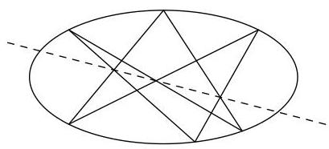
Pascal's Theorem

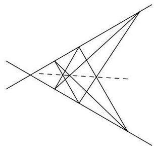
Pappus' Theorem

Proposition 3. Let  $C$  be an irreducible cubic,  $C'$ ,  $C''$  cubics. Suppose  $C' \cdot C = \sum_{i=1}^{9} P_i$ , where the  $P_i$  are simple (not necessarily distinct) points on  $C$ , and suppose  $C'' \cdot C = \sum_{i=1}^{8} P_i + Q$ . Then  $Q = P_9$ .

Proof. Let  $L$  be a line through  $P_9$  that doesn't pass through  $Q$ ;  $L \cdot C = P_9 + R + S$ . Then  $LC'' \cdot C = C' \cdot C + Q + R + S$ , so there is a line  $L'$  such that  $L' \cdot C = Q + R + S$ . But then  $L' = L$  and so  $P_9 = Q$ .

Addition on a cubic. Let  $C$  be a nonsingular cubic. For any two points  $P, Q \in C$ , there is a unique line  $L$  such that  $L \cdot C = P + Q + R$ , for some  $R \in C$ . (If  $P = Q$ ,  $L$  is the tangent to  $C$  at  $P$ ). Define  $\varphi \colon C \times C \to C$  by setting  $\varphi(P, Q) = R$ . This  $\varphi$  is like an addition on  $C$ , but there is no identity. To remedy this, choose a point  $O$  on  $C$ . Then define an addition  $\oplus$  on  $C$  as follows:  $P \oplus Q = \varphi(O, \varphi(P, Q))$ .

Proposition 4.  $C$ , with the operation  $\oplus$ , forms an abelian group, with the point  $O$  being the identity.

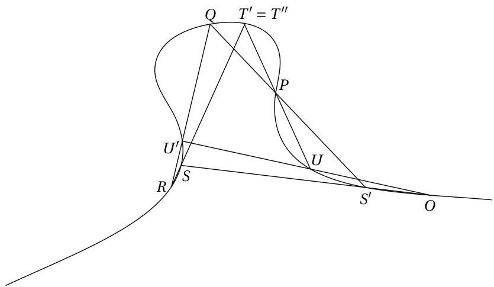

Proof. Only the associativity is difficult: Suppose  $P, Q, R \in C$ . Let  $L_1 \cdot C = P + Q + S'$ ,  $M_1 \cdot C = O + S' + S$ ,  $L_2 \cdot C = S + R + T'$ .

---

CHAPTER 5. PROJECTIVE PLANE CURVES

Let $M_2 \bullet C = Q + R + U'$, $L_3 \bullet C = O + U' + U$, $M_3 \bullet C = P + U + T''$. Since $(P \oplus Q) \oplus R = \varphi(O, T')$, and $P \oplus (Q \oplus R) = \varphi(O, T'')$, it suffices to show that $T' = T''$.

Let $C' = L_1L_2L_3$, $C'' = M_1M_2M_3$, and apply Proposition 3.

# Problems

5.31. If in Pascal's Theorem we let some adjacent vertices coincide (the side being a tangent), we get many new theorems:

(a) State and sketch what happens if $P_{1} = P_{2}$, $P_{3} = P_{4}$, $P_{5} = P_{6}$.

(b) Let $P_{1} = P_{2}$, the other four distinct.

(c) From (b) deduce a rule for constructing the tangent to a given conic at a given point, using only a straight-edge.

5.32. Suppose the intersections of the opposite sides of a hexagon lie on a straight line. Show that the vertices lie on a conic.

5.33. Let $C$ be an irreducible cubic, $L$ a line such that $L \bullet C = P_1 + P_2 + P_3$, $P_i$ distinct. Let $L_i$ be the tangent line to $C$ at $P_i$: $L_i \bullet C = 2P_i + Q_i$ for some $Q_i$. Show that $Q_1, Q_2, Q_3$ lie on a line. ($L^2$ is a conic!)

5.34. Show that a line through two flexes on a cubic passes through a third flex.

5.35. Let $C$ be any irreducible cubic, or any cubic without multiple components, $C^\circ$ the set of simple points of $C$, $O \in C^\circ$. Show that the same definition as in the nonsingular case makes $C^\circ$ into an abelian group.

5.36. Let $C$ be an irreducible cubic, $O$ a simple point on $C$ giving rise to the addition $\oplus$ on the set $C^\circ$ of simple points. Suppose another $O'$ gives rise to an addition $\oplus'$. Let $Q = \varphi(O, O')$, and define $\alpha: (C, O, \oplus) \to (C, O', \oplus')$ by $\alpha(P) = \varphi(Q, P)$. Show that $\alpha$ is a group isomorphism. So the structure of the group is independent of the choice of $O$.

5.37. In Proposition 4, suppose $O$ is a flex on $C$. (a) Show that the flexes form a subgroup of $C$; as an abelian group, this subgroup is isomorphic to $\mathbb{Z} / (3) \times \mathbb{Z} / (3)$. (b) Show that the flexes are exactly the elements of order three in the group. (i.e., exactly those elements $P$ such that $P \oplus P \oplus P = O$). (c) Show that a point $P$ is of order two in the group if and only if the tangent to $C$ at $P$ passes through $O$. (d) Let $C = Y^2 Z - X(X - Z)(X - \lambda Z)$, $\lambda \neq 0, 1$, $O = [0:1:0]$. Find the points of order two. (e) Show that the points of order two on a nonsingular cubic form a group isomorphic to $\mathbb{Z} / (2) \times \mathbb{Z} / (2)$. (f) Let $C$ be a nonsingular cubic, $P \in C$. How many lines through $P$ are tangent to $C$ at some point $Q \neq P$? (The answer depends on whether $P$ is a flex.)

5.38. Let $C$ be a nonsingular cubic given by the equation $Y^2 Z = X^3 + aX^2 Z + bXZ^2 + cZ^3$, $O = [0:1:0]$. Let $P_i = [x_i : y_i : 1]$, $i = 1, 2, 3$, and suppose $P_1 \oplus P_2 = P_3$. If $x_1 \neq x_2$, let $\lambda = (y_1 - y_2) / (x_1 - x_2)$; if $P_1 = P_2$ and $y_1 \neq 0$, let $\lambda = (3x_1^2 + 2ax_1 + b) / (2y_1)$. Let $\mu = y_i - \lambda x_i$, $i = 1, 2$. Show that $x_3 = \lambda^2 - a - x_1 - x_2$, and $y_3 = -\lambda x_3 - \mu$. This gives an explicit method for calculating in the group.

5.39. (a) Let $C = Y^2 Z - X^3 - 4XZ^2$, $O = [0:1:0]$, $A = [0:0:1]$, $B = [2:4:1]$, and $C = [2: -4:1]$. Show that $\{0, A, B, C\}$ form a subgroup of $C$ that is cyclic of order 4.

---

5.6. APPLICATIONS OF NOETHER'S THEOREM

(b) Let $C = Y^2 Z - X^3 - 43XZ^2 - 166Z^3$. Let $O = [0:1:0]$, $P = [3:8:1]$. Show that $P$ is an element of order 7 in $C$.

5.40. Let $k_0$ be a subfield of $k$. If $V$ is an affine variety, $V \subset \mathbb{A}^n(k)$, a point $P = (a_1, \ldots, a_n) \in V$ is rational over $k_0$, if each $a_i \in k_0$. If $V \subset \mathbb{P}^n(k)$ is projective, a point $P \in V$ is rational over $k_0$ if for some homogeneous coordinates $(a_1, \ldots, a_{n+1})$ for $P$, each $a_i \in k_0$.

A curve $F$ of degree $d$ is said to be emphrational over $k_{0}$ if the corresponding point in $\mathbb{P}^{d(d + 3) / 2}$ is rational over $k_{0}$.

Suppose a nonsingular cubic $C$ is rational over $k_0$. Let $C(k_0)$ be the set of points of $C$ that are rational over $k_0$. (a) If $P, Q \in C(k_0)$, show that $\varphi(P, Q)$ is in $C(k_0)$. (b) If $O \in C(k_0)$, show that $C(k_0)$ forms a subgroup of $C$. (If $k_0 = \mathbb{Q}$, $k = \mathbb{C}$, this has important applications to number theory.)

5.41. Let $C$ be a nonsingular cubic, $O$ a flex on $C$. Let $P_{1},\ldots ,P_{3m}\in C$. Show that $P_{1}\oplus \dots \oplus P_{3m} = O$ if and only if there is a curve $F$ of degree $m$ such that $F\bullet C = \sum_{i = 1}^{3m}P_{i}$. (Hint: Use induction on $m$. Let $L\bullet C = P_1 + P_2 + Q$, $L^{\prime}\bullet C = P_{3} + P_{4} + R$, $L^{\prime \prime}\bullet C = Q + R + S$, and apply induction to $S,P_{5},\ldots ,P_{3m}$; use Noether's Theorem.)

5.42. Let $C$ be a nonsingular cubic, $F, F'$ curves of degree $m$ such that $F \cdot C = \sum_{i=1}^{3m} P_i$, $F' \cdot C = \sum_{i=1}^{3m-1} P_i + Q$. Show that $P_{3m} = Q$.

5.43. For which points $P$ on a nonsingular cubic $C$ does there exist a nonsingular conic that intersects $C$ only at $P$?

---

CHAPTER 5. PROJECTIVE PLANE CURVES

---

Chapter 6 Varieties, Morphisms, and Rational Maps

This chapter begins the study of intrinsic properties of a variety — properties that do not depend on its embedding in affine or projective spaces (or products of these). Making this transition from extrinsic to intrinsic geometry has not been easy historically; the abstract language required demands some fortitude from the reader.

### 6.1 The Zariski Topology

One of the purposes of considering a topology on a set is to be able to restrict attention to a “neighborhood” of a point in the set. Often this means simply that we throw away a set (not containing the point) on which something we don’t like happens. For example, if $z$ is a rational function on a variety $V$, and $z$ is defined at $P\in V$, there should be a neighborhood of $P$ where $z$ is a function — we must throw away the pole set of $z$. We want to be able to discard an algebraic subset from an affine or projective variety, and still think of what is left as some kind of variety.

We first recall some notions from topology. A topology on a set $X$ is a collection of subsets of $X$, called the open subsets of $X$, satisfying:

1. $X$ and the empty set $\varnothing$ are open.
2. The union of any family of open subsets of $X$ is open.
3. The intersection of any finite number of open sets is open.

A topological space is a set $X$ together with a topology on $X$. A set $C$ in $X$ is closed if $X\smallsetminus C$ is open. If $Y\subset X$, any open set of $X$ that contains $Y$ will be called a neighborhood of $Y$. (Sometimes any set containing an open set containing $Y$ is called a neighborhood of $Y$, but we will consider only open neighborhoods.)

If $Y$ is a subset of a topological space $X$, the induced topology on $Y$ is defined as follows: a set $W\subset Y$ is open in $Y$ if there is an open subset $U$ of $X$ such that $W=Y\cap U$.

---

CHAPTER 6. VARIETIES, MORPHISMS, AND RATIONAL MAPS

For any subset $Y$ of a topological space $X$, the closure of $Y$ in $X$ is the intersection of all closed subsets of $X$ that contain $Y$. The set $Y$ is said to be dense in $X$ if $X$ is the closure of $Y$ in $X$; equivalently, for every nonempty open subset $U$ of $X$, $U \cap Y \neq \emptyset$.

If $X$ and $X'$ are topological spaces, a mapping $f \colon X' \to X$ is called continuous if for every open set $U$ of $X$, $f^{-1}(U) = \{x \in X' \mid f(x) \in U\}$ is an open subset of $X'$; equivalently, for every closed subset $C$ of $X$, $f^{-1}(C)$ is closed in $X'$. If, in addition, $f$ is one-to-one and onto $X$, and $f^{-1}$ is continuous, $f$ is said to be homeomorphism.

Let $X = \mathbb{P}^{n_1} \times \dots \times \mathbb{P}^{n_r} \times \mathbb{A}^m$. The Zariski topology on $X$ is defined as follows: a set $U \subset X$ is open if $X \setminus U$ is an algebraic subset of $X$. That this is a topology follows from the properties of algebraic sets proved in Chapter 1 (see also §4.4). Any subset $V$ of $X$ is given the induced topology. In particular, if $V$ is a variety in $X$, a subset of $V$ is closed if and only if it is algebraic.

If $X = \mathbb{A}^1$ or $\mathbb{P}^1$, the proper closed subsets of $X$ are just the finite subsets. If $X = \mathbb{A}^2$ or $\mathbb{P}^2$, proper closed subsets are finite unions of points and curves.

Note that for any two nonempty open sets $U_1, U_2$ in a variety $V$, $U_1 \cap U_2 \neq \emptyset$ (for otherwise $V = (V \setminus U_1) \cup (V \setminus U_2)$ would be reducible). So if $P$ and $Q$ are distinct points of $V$, there are never disjoint neighborhoods containing them. And every nonempty open subset of a variety $V$ is dense in $V$.

# Problems

6.1.* Let $Z \subset Y \subset X$, $X$ a topological space. Give $Y$ the induced topology. Show that the topology induced by $Y$ on $Z$ is the same as that induced by $X$ on $Z$.

6.2.* (a) Let $X$ be a topological space, $X = \bigcup_{\alpha \in \mathcal{A}} U_{\alpha}$, $U_{\alpha}$ open in $X$. Show that a subset $W$ of $X$ is closed if and only if each $W \cap U_{\alpha}$ is closed (in the induced topology) in $U_{\alpha}$. (b) Suppose similarly $Y = \bigcup_{\alpha \in \mathcal{A}} V_{\alpha}$, $V_{\alpha}$ open in $Y$, and suppose $f \colon X \to Y$ is a mapping such that $f(U_{\alpha}) \subset V_{\alpha}$. Show that $f$ is continuous if and only if the restriction of $f$ to each $U_{\alpha}$ is a continuous mapping from $U_{\alpha}$ to $V_{\alpha}$.

6.3.* (a) Let $V$ be an affine variety, $f \in \Gamma(V)$. Considering $f$ as a mapping from $V$ to $k = \mathbb{A}^1$, show that $f$ is continuous. (b) Show that any polynomial map of affine varieties is continuous.

6.4.* Let $U_i \subset \mathbb{P}^n$, $\varphi_i \colon \mathbb{A}^n \to U_i$ as in Chapter 4. Give $U_i$ the topology induced from $\mathbb{P}^n$. (a) Show that $\varphi_i$ is a homeomorphism. (b) Show that a set $W \subset \mathbb{P}^n$ is closed if and only if each $\varphi_i^{-1}(W)$ is closed in $\mathbb{A}^n$, $i = 1, \ldots, n + 1$. (c) Show that if $V \subset \mathbb{A}^n$ is an affine variety, then the projective closure $V^*$ of $V$ is the closure of $\varphi_{n+1}(V)$ in $\mathbb{P}^n$.

6.5. Any infinite subset of a plane curve $V$ is dense in $V$. Any one-to-one mapping from one irreducible plane curve onto another is a homeomorphism.

6.6.* Let $X$ be a topological space, $f \colon X \to \mathbb{A}^n$ a mapping. Then $f$ is continuous if and only if for each hypersurface $V = V(F)$ of $\mathbb{A}^n$, $f^{-1}(V)$ is closed in $X$. A mapping $f \colon X \to k = \mathbb{A}^1$ is continuous if and only if $f^{-1}(\lambda)$ is closed for any $\lambda \in k$.

6.7.* Let $V$ be an affine variety, $f \in \Gamma(V)$. (a)] Show that $V(f) = \{P \in V \mid f(P) = 0\}$ is a closed subset of $V$, and $V(f) \neq V$ unless $f = 0$. (b) Suppose $U$ is a dense subset of $V$ and $f(P) = 0$ for all $P \in U$. Then $f = 0$.

---

6.2. VARIETIES

6.8.* Let $U$ be an open subset of a variety $V$, $z \in k(V)$. Suppose $z \in \mathcal{O}_P(V)$ for all $P \in U$. Show that $U_z = \{P \in U \mid z(P) \neq 0\}$ is open, and that the mapping from $U$ to $k = \mathbb{A}^1$ defined by $P \mapsto z(P)$ is continuous.

## 6.2 Varieties

Let $V$ be a nonempty irreducible algebraic set in $\mathbb{P}^{n_1} \times \dots \times \mathbb{A}^m$. Any open subset $X$ of $V$ will be called a variety. It is given the topology induced from $V$; this topology is called the Zariski topology on $X$.

We define $k(X) = k(V)$ to be the field of rational functions on $X$, and if $P \in X$, we define $\mathcal{O}_P(X)$ to be $\mathcal{O}_P(V)$, the local ring of $X$ at $P$.

If $U$ is an open subset of $X$, then $U$ is also open in $V$, so $U$ is also a variety. We say that $U$ is an open subvariety of $X$.

If $Y$ is a closed subset of $X$, we say that $Y$ is irreducible if $Y$ is not the union of two proper closed subsets. Then $Y$ is then also a variety, for if $\overline{Y}$ is the closure of $Y$ in $V$, it is easy to verify that $\overline{Y}$ is irreducible in $V$ and that $Y = \overline{Y} \cap X$, so $Y$ is open in $\overline{Y}$ (see Problem 6.10). Such a $Y$ is called a closed subvariety of $X$.

Let $X$ be a variety, $U$ a nonempty open subset of $X$. We define $\Gamma(U, \mathcal{O}_X)$, or simply $\Gamma(U)$, to be the set of rational functions on $X$ that are defined at each $P \in U$: $\Gamma(U) = \bigcap_{P \in U} \mathcal{O}_P(X)$. The ring $\Gamma(U)$ is a subring of $k(X)$, and if $U' \subset U$, then $\Gamma(U') \supset \Gamma(U)$. Note that if $U = X$ is an affine variety, then $\Gamma(X)$ is the coordinate ring of $X$ (Proposition 2 of §2.4), so this notation is consistent.

If $z \in \Gamma(U)$, $z$ determines a $k$-valued function on $U$: for if $P \in U$, $z \in \mathcal{O}_P(X)$, and $z(P)$ is well-defined. Let $\mathcal{F}(U, k)$ be the ring of all $k$-valued functions on $U$. The map that associates a function to each $z \in \Gamma(U)$ is a ring homomorphism from $\Gamma(U)$ into $\mathcal{F}(U, k)$. As in §2.1 we want to identify $\Gamma(U)$ with its image in $\mathcal{F}(U, k)$, so that we may consider $\Gamma(U)$ as a ring of functions on $U$. For this we need the map from $\Gamma(U)$ to $\mathcal{F}(U, k)$ to be one-to-one, i.e.,

**Proposition 1.** Let $U$ be an open subset of a variety $X$. Suppose $z \in \Gamma(U)$, and $z(P) = 0$ for all $P \in U$. Then $z = 0$.

**Proof.** Note first that we may replace $U$ by any nonempty open subset $U'$ of $U$, since $\Gamma(U) \subset \Gamma(U')$.

If $X \subset \mathbb{P}^n \times \dots \times \mathbb{A}^m$, we may replace $X$ by its closure, so assume $X$ is closed. Then if $X \cap (U_{i_1} \times U_{i_2} \times \dots \times \mathbb{A}^m) \neq \emptyset$, we may replace $X$ and $U$ by the corresponding affine variety $\varphi^{-1}(X)$ and the open set $\varphi^{-1}(U)$ in $\mathbb{A}^n \times \dots \times \mathbb{A}^m$, where $\varphi \colon \mathbb{A}^n \times \dots \times \mathbb{A}^m \to U_{i_1} \times \dots \times \mathbb{A}^m$ is as in Problem 4.26.

Thus we may assume $U$ is open in an affine variety $X \subset \mathbb{A}^N$. Write $z = f / g$, $f, g \in \Gamma(X)$. Replacing $U$ by $\{P \in U \mid g(P) \neq 0\}$, we may assume $g(P) \neq 0$ for all $P \in U$ (Problem 6.8). Then $f(P) = 0$ for all $P \in U$, so $f = 0$ (Problem 6.7), and $z = 0$.

## Problems

6.9. Let $X = \mathbb{A}^2 \setminus \{(0,0)\}$, an open subvariety of $\mathbb{A}^2$. Show that $\Gamma(X) = \Gamma(\mathbb{A}^2) = k[X, Y]$.

---

CHAPTER 6. VARIETIES, MORPHISMS, AND RATIONAL MAPS

6.10.* Let $U$ be an open subvariety of a variety $X$, $Y$ a closed subvariety of $U$. Let $Z$ be the closure of $Y$ in $X$. Show that

(a) $Z$ is a closed subvariety of $X$.

(b) $Y$ is an open subvariety of $Z$.

6.11. (a) Show that every family of closed subsets of a variety has a minimal member. (b) Show that if a variety is a union of a collection of open subsets, it is a union of a finite number of theses subsets. (All varieties are “quasi-compact”.)

6.12.* Let $X$ be a variety, $z \in k(X)$. Show that the pole set of $z$ is closed. If $z \in \mathcal{O}_P(X)$, there is a neighborhood $U$ of $z$ such that $z \in \Gamma(U)$; so $\mathcal{O}_P(X)$ is the union of all $\Gamma(U)$, where $U$ runs through all neighborhoods of $P$.

## 6.3 Morphisms of Varieties

If $\varphi \colon X \to Y$ is any mapping between sets, composition with $\varphi$ gives a homomorphism of rings $\tilde{\varphi} \colon \mathcal{F}(Y, k) \to \mathcal{F}(X, k)$; i.e., $\tilde{\varphi}(f) = f \circ \varphi$.

Let $X$ and $Y$ be varieties. A morphism from $X$ to $Y$ is a mapping $\varphi \colon X \to Y$ such that

(1) $\varphi$ is continuous;

(2) For every open set $U$ of $Y$, if $f \in \Gamma(U, \mathcal{O}_Y)$, then $\tilde{\varphi}(f) = f \circ \varphi$ is in $\Gamma(\varphi^{-1}(U), \mathcal{O}_X)$.

An isomorphism of $X$ with $Y$ is a one-to-one morphism $\varphi$ from $X$ onto $Y$ such that $\varphi^{-1}$ is a morphism.

A variety that is isomorphic to a closed subvariety of some $\mathbb{A}^n$ (resp. $\mathbb{P}^n$) is called an affine variety (resp. a projective variety). When we write $X \subset \mathbb{A}^n$ is an affine variety, we mean that $X$ is a closed subvariety of $\mathbb{A}^n$ (as in Chapter 2), while if we say only $X$ is an affine variety we mean that $X$ is a variety in the general sense of Section 2, but that there exists an isomorphism of $X$ with a closed subvariety of some $\mathbb{A}^n$. A similar nomenclature is used for projective varieties.

**Proposition 2.** Let $X$ and $Y$ be affine varieties. There is a natural one-to-one correspondence between morphisms $\varphi \colon X \to Y$ and homomorphisms $\tilde{\varphi} \colon \Gamma(Y) \to \Gamma(X)$. If $X \subset \mathbb{A}^n$, $Y \subset \mathbb{A}^m$, a morphism from $X$ to $Y$ is the same thing as a polynomial map from $X$ to $Y$.

**Proof.** We may assume $X \subset \mathbb{A}^n$, $Y \subset \mathbb{A}^m$ are closed subvarieties of affine spaces. The proposition follows from the following facts: (i) a polynomial map is a morphism; (ii) a morphism $\varphi$ induces a homomorphism $\tilde{\varphi} \colon \Gamma(Y) \to \Gamma(X)$; (iii) any $\tilde{\varphi} \colon \Gamma(Y) \to \Gamma(X)$ is induced by a unique polynomial map from $X$ to $Y$ (Proposition 1 of §2.2); and (iv) all these operations are compatible. The details are left to the reader.

**Proposition 3.** Let $V$ be a closed subvariety of $\mathbb{P}^n$, $\varphi_i \colon \mathbb{A}^n \to U_i \subset \mathbb{P}^n$ as in Chapter 4, Section 1. Then $V_i = \varphi_i^{-1}(V)$ is a closed subvariety of $\mathbb{A}^n$, and $\varphi_i$ restricts to an isomorphism of $V_i$ with $V \cap U_i$. A projective variety is a union of a finite number of open affine varieties.

**Proof.** The proof, together with the natural generalization to multispace (see Problem 4.26), is left to the reader.

---

6.3. MORPHISMS OF VARIETIES

**Proposition 4.** Any closed subvariety of $\mathbb{P}^{n_1} \times \dots \times \mathbb{P}^{n_r}$ is a projective variety. Any variety is isomorphic to an open subvariety of a projective variety.

**Proof.** The second statement follows from the first, since $\mathbb{P}^{n_1} \times \dots \times \mathbb{P}^{n_r} \times \mathbb{A}^m$ is isomorphic to an open subvariety of $\mathbb{P}^{n_1} \times \dots \times \mathbb{P}^{n_r} \times \mathbb{P}^m$. By induction, it is enough to prove that $\mathbb{P}^n \times \mathbb{P}^m$ is a projective variety.

In Problem 4.28, we defined the Segre imbedding $S \colon \mathbb{P}^n \times \mathbb{P}^m \to \mathbb{P}^{n + m + nm}$, which mapped $\mathbb{P}^n \times \mathbb{P}^m$ one-to-one onto a projective variety $V$. We use the notations of that problem.

It suffices to show that the restriction of $S$ to $U_0 \times U_0 \to V \cap U_{00}$ is an isomorphism. These are affine varieties, so it is enough to show that the induced map on coordinate rings is an isomorphism. We identify $\Gamma(U_0 \times U_0)$ with $k[X_1, \ldots, X_n, Y_1, \ldots, Y_m]$, and $\Gamma(V \cap U_{00})$ may be identified with $k[T_{10}, \ldots, T_{nm}] / (\{T_{jk} - T_{j0}T_{0k} \mid j, k &gt; 0\})$. The homomorphism from $k[X_1, \ldots, X_n, Y_1, \ldots, Y_m]$ to this ring that takes $X_i$ to the residue of $T_{i0}$, $Y_j$ to that of $T_{0j}$, is easily checked to be an isomorphism. Since this isomorphism is the one induced by $S^{-1}$, the proof is complete.

**Note.** It is possible to define more general varieties than those we have considered here. If this were done, the varieties we have defined would be called the "quasi-projective" varieties.

A closed subvariety of an affine variety is also an affine variety. What is more surprising is that an open subvariety of an affine variety may also be affine.

**Proposition 5.** Let $V$ be an affine variety, and let $f \in \Gamma(V)$, $f \neq 0$. Let $V_f = \{P \in V \mid f(P) \neq 0\}$, an open subvariety of $V$. Then

(1) $\Gamma(V_f) = \Gamma(V)[1/f] = \{a/f^n \in k(V) \mid a \in \Gamma(V), n \in \mathbb{Z}\}$.

(2) $V_f$ is an affine variety.

**Proof.** We may assume $V \subset \mathbb{A}^n$; let $I = I(V)$, so $\Gamma(V) = k[X_1, \ldots, X_n] / I$. Choose $F \in k[X_1, \ldots, X_n]$ whose $I$-residue $\overline{F}$ is $f$.

(1): Let $z \in \Gamma(V_f)$. The pole set of $z$ is $V(J)$, where $J = \{G \in k[X_1, \ldots, X_n] \mid \overline{G}z \in \Gamma(V)\}$ (proof of Proposition 2 of §2.4). Since $V(J) \subset V(F)$, $F^N \in J$ for some $N$, by the Nullstellensatz. Then $f^N z = a \in \Gamma(V)$, so $z = a / f^N \in \Gamma(V)[1 / f]$. The other inclusion is obvious.

(2): We must "push the zeros of $F$ off to infinity" (compare with the proof of the Nullstellensatz). Let $I'$ be the ideal in $k[X_1, \ldots, X_{n+1}]$ generated by $I$ and by $X_{n+1}F - 1$, $V' = V(I') \subset \mathbb{A}^{n+1}$.

Let $\alpha \colon k[X_1, \ldots, X_{n+1}] \to \Gamma(V_f)$ be defined by letting $\alpha(X_i) = \overline{X}_i$ if $i \leq n$, $\alpha(X_{n+1}) = 1/f$. Then $\alpha$ is onto by (1), and it is left to the reader to check that $\operatorname{Ker}(\alpha) = I'$. (See Problem 6.13.) In particular, $I'$ is prime, so $V'$ is a variety, and $\alpha$ induces an isomorphism $\overline{\alpha} \colon \Gamma(V') \to \Gamma(V_f)$.

The projection $(X_{1},\ldots ,X_{n + 1})\mapsto (X_{1},\ldots ,X_{n})$ from $\mathbb{A}^{n + 1}$ to $\mathbb{A}^n$ induces a morphism $\varphi \colon V^{\prime}\to V_{f}$ (Problem 6.16). This $\varphi$ is one-to-one and onto, and $\tilde{\varphi} = (\overline{\alpha})^{-1}$. If $W$ is closed in $V$, defined by the vanishing of polynomials $G_{\beta}(X_1,\dots,X_{n + 1})$, then $\varphi (W)$ is closed in $V_{f}$, defined by polynomials $F^{N}G_{\beta}(X_{1},\ldots ,X_{n},1 / F)$, with $N\geq \deg (G_{\beta})$; from this it follows that $\varphi^{-1}$ is continuous. We leave it to the reader to complete the proof that $\varphi^{-1}$ is a morphism, and hence $\varphi$ is an isomorphism.

---

CHAPTER 6. VARIETIES, MORPHISMS, AND RATIONAL MAPS

Corollary. Let $X$ be a variety, $U$ a neighborhood of a point $P$ in $X$. Then there is a neighborhood $V$ of $P$, $V \subset U$, such that $V$ is an affine variety.

Proof. If $X$ is open in a projective variety $X' \subset \mathbb{P}^n$, and $P \in U_i$, we may replace $X$ by $X' \cap U_i$, $U$ by $U \cap U_i$. So we may assume $X \subset \mathbb{A}^n$ is affine.

Since $X \setminus U$ is an algebraic subset of $\mathbb{A}^n$, there is a polynomial $F \in k[X_1, \ldots, X_n]$ such that $F(P) \neq 0$, and $F(Q) = 0$ for all $Q \in X \setminus U$ (Problem 1.17). Let $f$ be the image of $F$ in $\Gamma(X)$. Then $P \in X_f \subset U$, and $X_f$ is affine by the proposition.

# Problems

6.13.* Let $R$ be a domain with quotient field $K$, $f \neq 0$ in $R$. Let $R[1/f] = \{a/f^n \mid a \in R, n \in \mathbb{Z}\}$, a subring of $K$. (a) Show that if $\varphi \colon R \to S$ is any ring homomorphism such that $\varphi(f)$ is a unit in $S$, then $\varphi$ extends uniquely to a ring homomorphism from $R[1/f]$ to $S$. (b) Show that the ring homomorphism from $R[X]/(Xf - 1)$ to $R[1/f]$ that takes $X$ to $1/f$ is an isomorphism.

6.14.* Let $X, Y$ be varieties, $f \colon X \to Y$ a mapping. Let $X = \bigcup_{\alpha} U_{\alpha}$, $Y = \bigcup_{\alpha} V_{\alpha}$, with $U_{\alpha}, V_{\alpha}$ open subvarieties, and suppose $f(U_{\alpha}) \subset V_{\alpha}$ for all $\alpha$. (a) Show that $f$ is a morphism if and only if each restriction $f_{\alpha} \colon U_{\alpha} \to V_{\alpha}$ of $f$ is a morphism. (b) If each $U_{\alpha}, V_{\alpha}$ is affine, $f$ is a morphism if and only if each $\bar{f}(\Gamma(V_{\alpha})) \subset \Gamma(U_{\alpha})$.

6.15.* (a) If $Y$ is an open or closed subvariety of $X$, the inclusion $i \colon Y \to X$ is a morphism. (b) The composition of morphisms is a morphism.

6.16.* Let $f \colon X \to Y$ be a morphism of varieties, $X' \subset X$, $Y' \subset Y$ subvarieties (open or closed). Assume $f(X') \subset Y'$. Then the restriction of $f$ to $X'$ is a morphism from $X'$ to $Y'$. (Use Problems 6.14 and 2.9.)

6.17. (a) Show that $\mathbb{A}^2 \setminus \{(0,0)\}$ is not an affine variety (see Problem 6.9). (b) The union of two open affine subvarieties of a variety may not be affine.

6.18. Show that the natural map $\pi$ from $\mathbb{A}^{n+1} \setminus \{(0, \ldots, 0)\}$ to $\mathbb{P}^n$ is a morphism of varieties, and that a subset $U$ of $\mathbb{P}^n$ is open if and only if $\pi^{-1}(U)$ is open.

6.19.* Let $X$ be a variety, $f \in \Gamma(X)$. Let $\varphi \colon X \to \mathbb{A}^1$ be the mapping defined by $\varphi(P) = f(P)$ for $P \in X$. (a) Show that for $\lambda \in k$, $\varphi^{-1}(\lambda)$ is the pole set of $z = 1/(f - \lambda)$. (b) Show that $\varphi$ is a morphism of varieties.

6.20.* Let $A = \mathbb{P}^{n_1} \times \dots \times \mathbb{A}^n$, $B = \mathbb{P}^{m_1} \times \dots \times \mathbb{A}^m$. Let $y \in B$, $V$ a closed subvariety of $A$. Show that $V \times \{y\} = \{(x, y) \in A \times B \mid x \in V\}$ is a closed subvariety of $A \times B$, and that the map $V \to V \times \{y\}$ taking $x$ to $(x, y)$ is an isomorphism.

6.21. Any variety is the union of a finite number of open affine subvarieties.

6.22.* Let $X$ be a projective variety in $\mathbb{P}^n$, and let $H$ be a hyperplane in $\mathbb{P}^n$ that doesn't contain $X$. (a) Show that $X \setminus (H \cap X)$ is isomorphic to an affine variety $X_* \subset \mathbb{A}^n$. (b) If $L$ is the linear form defining $H$, and $l$ is its image in $\Gamma_h(X) = k[x_1, \ldots, x_{n+1}]$, then $\Gamma(X_*)$ may be identified with $k[x_1 / l, \ldots, x_{n+1} / l]$. (Hint: Change coordinates so $L = X_{n+1}$.)

6.23.* Let $P, Q \in X, X$ a variety. Show that there is an affine open set $V$ on $X$ that contains $P$ and $Q$. (Hint: See the proof of the Corollary to Proposition 5, and use

---

6.4. PRODUCTS AND GRAPHS

Problem 1.17(c).)

6.24.* Let $X$ be a variety, $P, Q$ two distinct points of $X$. Show that there is an $f \in k(X)$ that is defined at $P$ and at $Q$, with $f(P) = 0$, $f(Q) \neq 0$ (Problems 6.23, 1.17). So $f \in \mathfrak{m}_P(X)$, $1 / f \in \mathcal{O}_Q(X)$. The local rings $\mathcal{O}_P(X)$, as $P$ varies in $X$, are distinct.

6.25.* Show that $[x_1 : \ldots : x_n] \mapsto [x_1 : \ldots : x_n : 0]$ gives an isomorphism of $\mathbb{P}^{n-1}$ with $H_\infty \subset \mathbb{P}^n$. If a variety $V$ in $\mathbb{P}^n$ is contained in $H_\infty$, $V$ is isomorphic to a variety in $\mathbb{P}^{n-1}$. Any projective variety is isomorphic to a closed subvariety $V \subset \mathbb{P}^n$ (for some $n$) such that $V$ is not contained in any hyperplane in $\mathbb{P}^n$.

## 6.4 Products and Graphs

Let $A = \mathbb{P}^{n_1} \times \dots \times \mathbb{A}^n$, $B = \mathbb{P}^{m_1} \times \dots \times \mathbb{A}^m$ be mixed spaces, as in Chapter 4, Section 4. Then $A \times B = \mathbb{P}^{n_1} \times \dots \times \mathbb{P}^{m_1} \times \dots \times \mathbb{A}^{n + m}$ is also a mixed space. If $U_{i1} \times \dots \times \mathbb{A}^n$ and $U_{j1} \times \dots \times \mathbb{A}^m$ are the usual affine open subvarieties that cover $A$ and $B$, then $U_{i1} \times \dots \times \mathbb{A}^{n + m}$ are affine open subvarieties that cover $A \times B$.

**Proposition 6.** Let $V \subset A$, $W \subset B$ be closed subvarieties. Then $V \times W$ is a closed subvariety of $A \times B$.

**Proof.** The only difficulty is in showing that $V \times W$ is irreducible. Suppose $V \times W = Z_1 \cup Z_2$, $Z_i$ closed in $A \times B$. Let $U_i = \{y \in W \mid V \times \{y\} \not\subset Z_i\}$. Since $V \times \{y\}$ is irreducible (Problem 6.20), $U_1 \cap U_2 = \emptyset$. It suffices to show that each $U_i$ is open, for then, since $W$ is a variety, one of the $U_i$ (say $U_1$) must be empty, and then $V \times W \subset Z_1$, as desired.

Let $F_{\alpha}(X,Y)$ be the "multiforms" defining $Z_{1}$. If $y \in U_{1}$, then for some $\alpha$ and some $x \in V$, $F_{\alpha}(x,y) \neq 0$. Let $G_{\alpha}(Y) = F_{\alpha}(x,Y)$. Then $\{y' \in W \mid G_{\alpha}(y') \neq 0\}$ is an open neighborhood of $y$ in $U_{1}$. A set that contains a neighborhood of each of its points is open, so $U_{1}$ (and likewise $U_{2}$) is open.

If $X$ and $Y$ are any varieties, say $X$ is open in $V \subset A$, $Y$ open in $W \subset B$, $V, W, A, B$ as above. Then $X \times Y$ is open in $V \times W$, so $X \times Y$ is a variety. Note that the product of two affine varieties is an affine variety, and the product of two projective varieties is a projective variety.

**Proposition 7.** (1) The projections $\operatorname{pr}_1 \colon X \times Y \to X$ and $\operatorname{pr}_2 \colon X \times Y \to Y$ are morphisms.

(2) If $f \colon Z \to X$, $g \colon Z \to Y$ are morphisms, then $(f, g) \colon Z \to X \times Y$ defined by $(f, g)(z) = (f(z), g(z))$ is a morphism.

(3) If $f \colon X' \to X$, $g \colon Y' \to Y$ are morphisms, then $f \times g \colon X' \times Y' \to X \times Y$ defined by $(f \times g)(x', y') = (f(x'), g(y'))$ is a morphism.

(4) The diagonal $\Delta_X = \{(x,y)\in X\times X\mid y = x\}$ is a closed subvariety of $X\times X$, and the diagonal map $\delta_X\colon X\to \Delta_X$ defined by $\delta_X(x) = (x,x)$ is an isomorphism.

**Proof.** (1) is left to the reader.

(2): We may reduce first to the case where $X = A$, $Y = B$ (Problem 6.16). Since being a morphism is local (Problem 6.14), we may cover $A$ and $B$ by the open affine spaces $U_{i1} \times \dots \times \mathbb{A}^r$. This reduces it to the case where $X = \mathbb{A}^n$, $Y = \mathbb{A}^m$. We may

---

CHAPTER 6. VARIETIES, MORPHISMS, AND RATIONAL MAPS

also assume  $Z$  is affine, since  $Z$  is a union of open affine subvarieties. But this case is trivial, since the product of polynomial maps is certainly a polynomial map.

(3): Apply (2) to the morphism  $(f\circ \mathrm{pr}_1,g\circ \mathrm{pr}_2)$
(4): The diagonal in  $\mathbb{P}^n\times \mathbb{P}^n$  is clearly an algebraic subset, so  $\Delta_X$  is closed in any  $X$  (Proposition 4 of §6.3). The restriction of  $\mathrm{pr}_1\colon X\times X\to X$  is inverse to  $\delta_X$ , so  $\delta_X$  is an isomorphism.

Corollary. If  $f, g \colon X \to Y$  are morphisms of varieties, then  $\{x \in X \mid f(x) = g(x)\}$  is closed in  $X$ . If  $f$  and  $g$  agree on a dense set of  $X$ , then  $f = g$ .

Proof.  $\{x\mid f(x) = g(x)\} = (f,g)^{-1}(\Delta_Y)$

If  $f \colon X \to Y$  is a morphism of varieties, the graph of  $f$ ,  $G(f)$ , is defined to be  $\{(x, y) \in X \times Y \mid y = f(x)\}$ .

Proposition 8.  $G(f)$  is a closed subvariety of  $X \times Y$ . The projection of  $X \times Y$  onto  $X$  restricts to an isomorphism of  $G(f)$  with  $X$ .

Proof. We have  $G(f) = (f \times i)^{-1}(\Delta_Y)$ ,  $i = \text{identity on } Y$ . Now  $(j, f) \colon X \to X \times Y$ , where  $j = \text{identity on } X$ , maps  $X$  onto  $G(f)$ , and this is inverse to the projection.

# Problems

6.26. (a) Let  $f \colon X \to Y$  be a morphism of varieties such that  $f(X)$  is dense in  $Y$ . Show that the homomorphism  $\tilde{f} \colon \Gamma(Y) \to \Gamma(X)$  is one-to-one. (b) If  $X$  and  $Y$  are affine, show that  $f(X)$  is dense in  $Y$  if and only if  $\tilde{f} \colon \Gamma(Y) \to \Gamma(X)$  is one-to-one. Is this true if  $Y$  is not affine?

6.27. Let  $U, V$  be open subvarieties of a variety  $X$ . (a) Show that  $U \cap V$  is isomorphic to  $(U \times V) \cap \Delta_X$ . (b) If  $U$  and  $V$  are affine, show that  $U \cap V$  is affine. (Compare Problem 6.17.)

6.28. Let  $d \geq 1$ ,  $N = \frac{(d + 1)(d + 2)}{2}$ , and let  $M_1, \ldots, M_N$  be the monomials of degree  $d$  in  $X, Y, Z$  (in some order). Let  $T_1, \ldots, T_N$  be homogeneous coordinates for  $\mathbb{P}^{N - 1}$ . Let  $V = V\left(\sum_{i = 1}^{N}M_{i}(X,Y,Z)T_{i}\right) \subset \mathbb{P}^{2} \times \mathbb{P}^{N - 1}$ , and let  $\pi \colon V \to \mathbb{P}^{N - 1}$  be the restriction of the projection map. (a) Show that  $V$  is an irreducible closed subvariety of  $\mathbb{P}^2 \times \mathbb{P}^{N - 1}$ , and  $\pi$  is a morphism. (b) For each  $t = (t_1, \dots, t_N) \in \mathbb{P}^{N - 1}$ , let  $C_t$  be the corresponding curve (§5.2). Show that  $\pi^{-1}(t) = C_t \times \{t\}$ .

We may thus think of  $\pi \colon V \to \mathbb{P}^{N-1}$  as a "universal family" of curves of degree  $d$ . Every curve appears as a fibre  $\pi^{-1}(t)$  over some  $t \in \mathbb{P}^{N-1}$ .

6.29. Let  $V$  be a variety, and suppose  $V$  is also a group, i.e., there are mappings  $\varphi \colon V \times V \to V$  (multiplication or addition), and  $\psi \colon V \to V$  (inverse) satisfying the group axioms. If  $\varphi$  and  $\psi$  are morphisms,  $V$  is said to be an algebraic group. Show that each of the following is an algebraic group:

(a)  $\mathbb{A}^1 = k$ , with the usual addition on  $k$ ; this group is often denoted  $\mathbb{G}_a$ .
(b)  $\mathbb{A}^1\setminus \{(0)\} = k\setminus \{(0)\}$ , with the usual multiplication on  $k$ : this is denoted  $\mathbb{G}_m$ .
(c)  $\mathbb{A}^n (k)$  with addition: likewise  $M_{n}(k) = \{n$  by  $n$  matrices} under addition may be identified with  $\mathbb{A}^{n^2}(k)$

---

6.5. ALGEBRAIC FUNCTION FIELDS AND DIMENSION OF VARIETIES

(d) $\mathrm{GL}_n(k) = \{\text{invertible } n \times n \text{ matrices}\}$ is an affine open subvariety of $M_n(k)$, and a group under multiplication.

(e) $C$ a nonsingular plane cubic, $O \in C$, $\oplus$ the resulting addition (see Problem 5.38).

6.30. (a) Let $C = V(Y^2 Z - X^3)$ be a cubic with a cusp, $C^\circ = C \setminus \{[0:0:1]\}$ the simple points, a group with $O = [0:1:0]$. Show that the map $\varphi \colon \mathbb{G}_a \to C^\circ$ given by $\varphi(t) = [t:1:t^3]$ is an isomorphism of algebraic groups. (b) Let $C = V(X^3 + Y^3 - XYZ)$ be a cubic with a node, $C^\circ = C \setminus \{[0:0:1]\}$, $O = [1:1:0]$. Show that $\varphi \colon \mathbb{G}_m \to C^\circ$ defined by $\varphi(t) = [t:t^2:1 - t^3]$ is an isomorphism of algebraic groups.

## 6.5 Algebraic Function Fields and Dimension of Varieties

Let $K$ be a finitely generated field extension of $k$. The transcendence degree of $K$ over $k$, written $\operatorname{tr} \deg_k K$ is defined to be the smallest integer $n$ such that for some $x_1, \ldots, x_n \in K$, $K$ is algebraic over $k(x_1, \ldots, x_n)$. We say then that $K$ is an algebraic function field in $n$ variables over $k$.

**Proposition 9.** Let $K$ be an algebraic function field in one variable over $k$, and let $x \in K, x \notin k$. Then

(1) $K$ is algebraic over $k(x)$.

(2) $(\operatorname{char}(k) = 0)$ There is an element $y \in K$ such that $K = k(x, y)$.

(3) If $R$ is a domain with quotient field $K$, $k \subset R$, and $\mathfrak{p}$ is a prime ideal in $R$, $0 \neq \mathfrak{p} \neq R$, then the natural homomorphism from $k$ to $R / \mathfrak{p}$ is an isomorphism.

**Proof.** (1) Take any $t \in K$ so that $K$ is algebraic over $k(t)$. Since $x$ is algebraic over $k(t)$, there is a polynomial $F \in k[T, X]$ such that $F(t, x) = 0$ (clear denominators if necessary). Since $x$ is not algebraic over $k$ (Problem 1.48), $T$ must appear in $F$, so $t$ is algebraic over $k(x)$. Then $k(x, t)$ is algebraic over $k(x)$ (Problem 1.50), so $K$ is algebraic over $k(x)$ (Problem 1.46).

(2) Since $\operatorname{char}(k(x)) = 0$, this is an immediate consequence of the "Theorem of the Primitive Element." We have outlined a proof of this algebraic fact in Problem 6.31 below.

(3) Suppose there is an $x \in R$ whose residue $\overline{x}$ in $R / \mathfrak{p}$ is not in $k$, and let $y \in \mathfrak{p}, y \neq 0$. Choose $F = \sum a_{i}(X)Y^{i} \in k[X, Y]$ so that $F(x, y) = 0$. If we choose $F$ of lowest possible degree, then $a_{0}(X) \neq 0$. But then $a_{0}(x) \in P$, so $a_{0}(\overline{x}) = 0$. But $\overline{x}$ is not algebraic over $k$ (Problem 1.48), so there is no such $x$.

If $X$ is a variety, $k(X)$ is a finitely generated extension of $k$. Define the dimension of $X$, $\dim(X)$, to be $\operatorname{tr} \deg_k k(X)$. A variety of dimension one is called a curve, of dimension two a surface, etc. Part (5) of the next proposition shows that, for subvarieties of $\mathbb{A}^2$ or $\mathbb{P}^2$, this definition agrees with the one given in Chapters 3 and 5. Note, however, that a "curve" is assumed to be a variety, while a "plane curve" is allowed to have several (even multiple) components.

**Proposition 10.**

(1) If $U$ is an open subvariety of $X$, then $\dim U = \dim X$.

---

CHAPTER 6. VARIETIES, MORPHISMS, AND RATIONAL MAPS

(2) If $V^*$ is the projective closure of an affine variety $V$, then $\dim V = \dim V^*$.
(3) A variety has dimension zero if and only if it is a point.
(4) Every proper closed subvariety of a curve is a point.
(5) A closed subvariety of $\mathbb{A}^2$ (resp. $\mathbb{P}^2$) has dimension one if and only if it is an affine (resp. projective) plane curve.

Proof. (1) and (2) follow from the fact that the varieties have the same function fields.

(3): Suppose $\dim V = 0$. We may suppose $V$ is affine by (1) and (2). Then $k(V)$ is algebraic over $k$, so $k(V) = k$, so $\Gamma(V) = k$. Then Problem 2.4 gives the result.
(4): Again we may assume $V$ is affine. If $W$ is a closed subvariety of $V$, let $R = \Gamma(V)$, $\mathfrak{p}$ the prime ideal of $R$ corresponding to $W$; then $\Gamma(W) = R / P\mathfrak{p}$ (Problem 2.3). Apply Proposition 9 (3).
(5): Assume $V \subset \mathbb{A}^2$. Since $k(V) = k(x, y)$, $\dim V$ must be 0, 1, or 2. So $V$ is either a point, a plane curve $V(F)$, or $V = \mathbb{A}^2$ (§1.6). If $F(x, y) = 0$, $\operatorname{tr.deg}_k k(x, y) \leq 1$. Then the result follows from (3) and (4). Use (2) if $V \subset \mathbb{P}^2$.

# Problems

6.31.* (Theorem of the Primitive Element) Let $K$ be a field of a characteristic zero, $L$ a finite (algebraic) extension of $K$. Then there is a $z \in L$ such that $L = K(z)$.

Outline of Proof. Step (i): Suppose $L = K(x, y)$. Let $F$ and $G$ be monic irreducible polynomials in $K[T]$ such that $F(x) = 0$, $G(y) = 0$. Let $L'$ be a field in which $F = \prod_{i=1}^{n} (T - x_i)$, $G = \prod_{j=1}^{m} (T - y_j)$, $x = x_1$, $y = y_1$, $L' \supset L$ (see Problems 1.52, 1.53). Choose $\lambda \neq 0$ in $K$ so that $\lambda x + y \neq \lambda x_i + y_j$ for all $i \neq 1, j \neq 1$. Let $z = \lambda x + y$, $K' = K(z)$. Set $H(T) = G(z - \lambda T) \in K'[T]$. Then $H(x) = 0$, $H(x_i) \neq 0$ if $i &gt; 0$. Therefore $(H, F) = (T - x) \in K'[T]$. Then $x \in K'$, so $y \in K'$, so $L = K'$.

Step (ii): If $L = K(x_{1},\ldots ,x_{n})$, use induction on $n$ to find $\lambda_1,\dots ,\lambda_n\in k$ such that $L = K(\sum \lambda_{i}x_{i})$.

6.32.* Let $L = K(x_{1},\ldots ,x_{n})$ as in Problem 6.31. Suppose $k\subset K$ is an algebraically closed subfield, and $V\subsetneq \mathbb{A}^n (k)$ is an algebraic set. Show that $L = K(\sum \lambda_{i}x_{i})$ for some $(\lambda_1,\dots ,\lambda_n)\in \mathbb{A}^n\setminus V$.

6.33. The notion of transcendence degree is analogous to the idea of the dimension of a vector space. If $k \subset K$, we say that $x_{1}, \ldots, x_{n} \in K$ are algebraically independent if there is no nonzero polynomial $F \in k[X_{1}, \ldots, X_{n}]$ such that $F(x_{1}, \ldots, x_{n}) = 0$. By methods entirely analogous to those for bases of vector spaces, one can prove:

(a) Let $x_{1}, \ldots, x_{n} \in K$, $K$ a finitely generated extension of $k$. Then $x_{1}, \ldots, x_{n}$ is a minimal set such that $K$ is algebraic over $k(x_{1}, \ldots, x_{n})$ if and only if $x_{1}, \ldots, x_{n}$ is a maximal set of algebraically independent elements of $K$. Such $\{x_{1}, \ldots, x_{n}\}$ is called a transcendence basis of $K$ over $k$.
(b) Any algebraically independent set may be completed to a transcendence basis. Any set $\{x_1, \ldots, x_n\}$ such that $K$ is algebraic over $k(x_1, \ldots, x_n)$ contains a transcendence basis.
(c) $\operatorname{tr.deg}_k K$ is the number of elements in any transcendence basis of $K$ over $k$.

---

6.6. RATIONAL MAPS

6.34. Show that $\dim \mathbb{A}^n = \dim \mathbb{P}^n = n$.

6.35. Let $Y$ be a closed subvariety of a variety $X$. Then $\dim Y \leq \dim X$, with equality if and only if $Y = X$.

6.36. Let $K = k(x_{1},\ldots ,x_{n})$ be a function field in $r$ variables over $k$. (a) Show that there is an affine variety $V\subset \mathbb{A}^n$ with $k(V) = K$. (b) Show that we may find $V\subset \mathbb{A}^{r + 1}$ with $k(V) = K$, $r = \dim V$. (Assume $\operatorname {char}(k) = 0$ if you wish.)

## 6.6 Rational Maps

Let $X, Y$ be varieties. Two morphisms $f_{i} \colon U_{i} \to Y$ from open subvarieties $U_{i}$ of $X$ to $Y$ are said to be equivalent if their restrictions to $U_{1} \cap U_{2}$ are the same. Since $U_{1} \cap U_{2}$ is dense in $X$, each $f_{i}$ is determined by its restriction to $U_{1} \cap U_{2}$ (Corollary to Proposition 7 in §6.4). An equivalence class of such morphisms is called a rational map from $X$ to $Y$.

The domain of a rational map is the union of all open subvarieties $U_{\alpha}$ of $X$ such that some $f_{\alpha} \colon U_{\alpha} \to Y$ belongs to the equivalence class of the rational map. If $U$ is the domain of a rational map, the mapping $f \colon U \to Y$ defined by $f|_{U_{\alpha}} = f_{\alpha}$ is a morphism belonging to the equivalence class of the map; every equivalent morphism is a restriction of $f$. Thus a rational map from $X$ to $Y$ may also be defined as a morphism $f$ from an open subvariety $U$ of $X$ to $Y$ such that $f$ cannot be extended to a morphism from any larger open subset of $X$ to $Y$. For any point $P$ in the domain of $f$, the value $f(P)$ is well-defined in $k$.

A rational map from $X$ to $Y$ is said to be dominating if $f(U)$ is dense in $Y$, where $f\colon U\to Y$ is any morphism representing the map (it is easy to see that this is independent of $U$).

If $A$ and $B$ are local rings, and $A$ is a subring of $B$, we say that $B$ dominates $A$ if the maximal ideal of $B$ contains the maximal ideal of $A$.

**Proposition 11.** (1) Let $F$ be a dominating rational map from $X$ to $Y$. Let $U \subset X$, $V \subset Y$ be affine open sets, $f \colon U \to V$ a morphism that represents $F$. Then the induced map $\tilde{f} \colon \Gamma(V) \to \Gamma(U)$ is one-to-one, so $\tilde{f}$ extends to a one-to-one homomorphism from $k(Y) = k(V)$ into $k(X) = k(U)$. This homomorphism is independent of the choice of $f$, and is denoted by $\tilde{F}$.

(2) If $P$ belongs to the domain of $F$, and $F(P) = Q$, then $\mathcal{O}_P(X)$ dominates $\tilde{F}(\mathcal{O}_Q(Y))$. Conversely, if $P \in X$, $Q \in Y$, and $\mathcal{O}_P(X)$ dominates $\tilde{F}(\mathcal{O}_Q(Y))$, then $P$ belongs to the domain of $F$, and $F(P) = Q$.

(3) Any homomorphism from $k(Y)$ into $k(X)$ is induced by a unique dominating rational map from $X$ to $Y$.

**Proof.** (1) is left to the reader (Problem 6.26), as is the first part of (2).

If $\mathcal{O}_P(X)$ dominates $\tilde{F}(\mathcal{O}_Q(Y))$, take affine neighborhoods $V$ of $P$, $W$ of $Q$. Let $\Gamma(W) = k[y_1, \ldots, y_n]$. Then $\tilde{F}(y_i) = a_i / b_i$, $a_i, b_i \in \Gamma(V)$, and $b_i(P) \neq 0$. If we let $b = b_1 \cdots b_n$, then $\tilde{F}(\Gamma(W)) \subset \Gamma(V_b)$ (Proposition 5 of §6.3) so $\tilde{F} \colon \Gamma(W) \to \Gamma(V_b)$ is induced by a unique morphism $f \colon V_b \to W$ (Proposition 2 of §6.3). If $g \in \Gamma(W)$ vanishes at $Q$, then $\tilde{F}(g)$ vanishes at $P$, from which it follows easily $f(P) = Q$.

---

CHAPTER 6. VARIETIES, MORPHISMS, AND RATIONAL MAPS

(3) We may assume $X$ and $Y$ are affine. Then, as in (2), if $\varphi \colon k(Y) \to k(X)$, $\varphi(\Gamma(Y)) \subset \Gamma(X_b)$ for some $b \in \Gamma(X)$, so $\varphi$ is induced by a morphism $f \colon X_b \to Y$. Therefore $f(X_b)$ is dense in $Y$ since $\bar{f}$ is one-to-one (Problem 6.26).

A rational map $F$ from $X$ to $Y$ is said to be birational if there are open sets $U \subset X$, $V \subset Y$, and an isomorphism $f \colon U \to V$ that represents $F$. We say that $X$ and $Y$ are birationally equivalent if there is a birational map from $X$ to $Y$ (This is easily seen to be an equivalence relation). A variety is birationally equivalent to any open subvariety of itself. The varieties $\mathbb{A}^n$ and $\mathbb{P}^n$ are birationally equivalent.

**Proposition 12.** Two varieties are birationally equivalent if and only if their function fields are isomorphic.

**Proof.** Since $k(U) = k(X)$ for any open subvariety $U$ of $X$, birationally equivalent varieties have isomorphic function fields.

Conversely, suppose $\varphi \colon k(X) \to k(Y)$ is an isomorphism. We may assume $X$ and $Y$ are affine. Then $\varphi(\Gamma(X)) \subset \Gamma(Y_b)$ for some $b \in \Gamma(Y)$, and $\varphi^{-1}(\Gamma(Y)) \subset \Gamma(X_d)$ for some $d \in \Gamma(X)$, as in the proof of Proposition 11. Then $\varphi$ restricts to an isomorphism of $\Gamma((X_d)_{\varphi^{-1}(b)})$ onto $\Gamma((Y_b)_{\varphi(d)})$, so $(X_d)_{\varphi^{-1}(b)}$ is isomorphic to $(Y_b)_{\varphi(d)}$, as desired.

**Corollary.** Every curve is birationally equivalent to a plane curve.

**Proof.** If $V$ is a curve, $k(V) = k(x,y)$ for some $x,y \in k(V)$ (Proposition 9 (2) of §6.5). Let $I$ be the kernel of the natural homomorphism from $k[X,Y]$ onto $k[x,y] \subset k(V)$. Then $I$ is prime, so $V' = V(I) \subset \mathbb{A}^2$ is a variety. Since $\Gamma(V') = k[X,Y] / I$ is isomorphic to $k[x,y]$, it follows that $k(V')$ is isomorphic to $k(x,y) = k(V)$. So $\dim V' = 1$, and $V'$ is a plane curve (Proposition 10 (5) of §6.5). (See Appendix A for the case when $\operatorname{char}(k) = p$.)

A variety is said to be rational if it is birationally equivalent to $\mathbb{A}^n$ (or $\mathbb{P}^n$) for some $n$.

# Problems

**6.37.** Let $C = V(X^2 + Y^2 - Z^2) \subset \mathbb{P}^2$. For each $t \in k$, let $L_t$ be the line between $P_0 = [-1:0:1]$ and $P_t = [0:t:1]$. (Sketch this.) (a) If $t \neq \pm 1$, show that $L_t \cdot C = P_0 + Q_t$, where $Q_t = [1 - t^2:2t:1 + t^2]$. (b) Show that the map $\varphi \colon \mathbb{A}^1 \setminus \{\pm 1\} \to C$ taking $t$ to $Q_t$ extends to an isomorphism of $\mathbb{P}^1$ with $C$. (c) Any irreducible conic in $\mathbb{P}^2$ is rational; in fact, a conic is isomorphic to $\mathbb{P}^1$. (d) Give a prescription for finding all integer solutions $(x,y,z)$ to the Pythagorean equation $X^2 + Y^2 = Z^2$.

**6.38.** An irreducible cubic with a multiple point is rational (Problems 6.30, 5.10, 5.11).

**6.39.** $\mathbb{P}^n \times \mathbb{P}^m$ is birationally equivalent to $\mathbb{P}^{n+m}$. Show that $\mathbb{P}^1 \times \mathbb{P}^1$ is not isomorphic to $\mathbb{P}^2$. (Hint: $\mathbb{P}^1 \times \mathbb{P}^1$ has closed subvarieties of dimension one that do not intersect.)

**6.40.** If there is a dominating rational map from $X$ to $Y$, then $\dim(Y) \leq \dim(X)$.

---

6.6. RATIONAL MAPS

6.41. Every $n$-dimensional variety is birationally equivalent to a hypersurface in $\mathbb{A}^{n+1}$ (or $\mathbb{P}^{n+1}$).

6.42. Suppose $X, Y$ varieties, $P \in X$, $Q \in Y$, with $\mathcal{O}_P(X)$ isomorphic (over $k$) to $\mathcal{O}_Q(Y)$. Then there are neighborhoods $U$ of $P$ on $X$, $V$ of $Q$ on $Y$, such that $U$ is isomorphic to $V$. This is another justification for the assertion that properties of $X$ near $P$ should be determined by the local ring $\mathcal{O}_P(X)$.

6.43.* Let $C$ be a projective curve, $P \in C$. Then there is a birational morphism $f \colon C \to C'$, $C'$ a projective plane curve, such that $f^{-1}(f(P)) = \{P\}$. We outline a proof:

(a) We can assume: $C \subset \mathbb{P}^{n+1}$ Let $T, X_1, \ldots, X_n, Z$ be coordinates for $\mathbb{P}^{n+1}$; Then $C \cap V(T)$ is finite; $C \cap V(T, Z) = \emptyset$; $P = [0 : \ldots : 0 : 1]$; and $k(C)$ is algebraic over $k(u)$, where $u = \overline{T} / \overline{Z} \in k(C)$.

(b) For each $\lambda = (\lambda_1, \dots, \lambda_n) \in k^n$, let $\varphi_\lambda \colon C \to \mathbb{P}^2$ be defined by the formula $\varphi([t : x_1 : \dots : x_n : z]) = [t : \sum \lambda_i x_i : z]$. Then $\varphi_\lambda$ is a well-defined morphism, and $\varphi_\lambda(P) = [0 : 0 : 1]$. Let $C'$ be the closure of $\varphi_\lambda(C)$.

(c) The variable $\lambda$ can be chosen so $\varphi_{\lambda}$ is a birational morphism from $C$ to $C'$, and $\varphi_{\lambda}^{-1}([0:0:1]) = \{P\}$. (Use Problem 6.32 and the fact that $C \cap V(T)$ is finite).

6.44. Let $V = V(X^2 - Y^3, Y^2 - Z^3) \subset \mathbb{A}^3$, $f \colon \mathbb{A}^1 \to V$ as in Problem 2.13. (a) Show that $f$ is birational, so $V$ is a rational curve. (b) Show that there is no neighborhood of $(0,0,0)$ on $V$ that is isomorphic to an open subvariety of a plane curve. (See Problem 3.14.)

6.45.* Let $C, C'$ be curves, $F$ a rational map from $C'$ to $C$. Prove: (a) Either $F$ is dominating, or $F$ is constant (i.e., for some $P \in C$, $F(Q) = P$, all $Q \in C'$). (b) If $F$ is dominating, then $k(C')$ is a finite algebraic extension of $\tilde{F}(k(C))$.

6.46. Let $k(\mathbb{P}^1) = k(T)$, $T = X / Y$ (Problem 4.8). For any variety $V$, and $f \in k(V)$, $f \notin k$, the subfield $k(f)$ generated by $f$ is naturally isomorphic to $k(T)$. Thus a nonconstant $f \in k(V)$ corresponds a homomorphism from $k(T)$ to $k(V)$, and hence to the a dominating rational map from $V$ to $\mathbb{P}^1$. The corresponding map is usually denoted also by $f$. If this rational map is a morphism, show that the pole set of $f$ is $f^{-1}([1:0])$.

6.47. (The dual curve) Let $F$ be an irreducible projective plane curve of degree $n &gt; 1$. Let $\Gamma_h(F) = k[X, Y, Z] / (F) = k[x, y, z]$, and let $u, v, w \in \Gamma_h(F)$ be the residues of $F_X, F_Y, F_Z$, respectively. Define $\alpha \colon k[U, V, W] \to \Gamma_h(F)$ by setting $\alpha(U) = u$, $\alpha(V) = v$, $\alpha(W) = w$. Let $I$ be the kernel of $\alpha$. (a) Show that $I$ is a homogeneous prime ideal in $k[U, V, W]$, so $V(I)$ is a closed subvariety of $\mathbb{P}^2$. (b) Show that for any simple point $P$ on $F$, $[F_X(P) : F_Y(P) : F_Z(P)]$ is in $V(I)$, so $V(I)$ contains the points corresponding to tangent lines to $F$ at simple points. (c) If $V(I) \subset \{[a : b : c]\}$, use Euler's Theorem to show that $F$ divides $aX + bY + cZ$, which is impossible. Conclude that $V(I)$ is a curve. It is called the dual curve of $F$. (d) Show that the dual curve is the only irreducible curve containing all the points of (b). (See Walker's "Algebraic Curves" for more about dual curves when $\mathrm{char}(k) = 0$.

---

CHAPTER 6. VARIETIES, MORPHISMS, AND RATIONAL MAPS

---

Chapter 7

Resolution of Singularities

7.1 Rational Maps of Curves

A point $P$ on an arbitrary curve $C$ is called a simple point if $\mathcal{O}_P(C)$ is a discrete valuation ring. If $C$ is a plane curve, this agrees with our original definition (Theorem 1 of §3.2). We let $\operatorname{ord}_P^C$, or $\operatorname{ord}_P$ denote the order function on $k(C)$ defined by $\mathcal{O}_P(C)$. The curve $C$ is said to be nonsingular if every point on $C$ is simple.

Let $K$ be a field containing $k$. We say that a local ring $A$ is a local ring of $K$ if $A$ is a subring of $K$, $K$ is the quotient field of $A$, and $A$ contains $k$. For example, if $V$ is any variety, $P \in V$, then $\mathcal{O}_P(V)$ is a local ring of $k(V)$. Similarly, a discrete valuation ring of $K$ is a DVR that is a local ring of $K$.

Theorem 1. Let $C$ be a projective curve, $K = k(C)$. Suppose $L$ is a field containing $K$, and $R$ is a discrete valuation ring of $L$. Assume that $R \not\supset K$. Then there is a unique point $P \in C$ such that $R$ dominates $\mathcal{O}_P(C)$.

Proof. Uniqueness: If $R$ dominates $\mathcal{O}_P(C)$ and $\mathcal{O}_Q(C)$, choose $f \in \mathfrak{m}_P(C)$, $1/f \in \mathcal{O}_Q(C)$ (Problem 6.24). Then $\operatorname{ord}(f) &gt; 0$ and $\operatorname{ord}(1/f) \geq 0$, a contradiction.

Existence: We may assume $C$ is a closed subvariety of $\mathbb{P}^n$, and that $C \cap U_i \neq \emptyset$, $i = 1, \ldots, n + 1$ (Problem 6.25). Then in $\Gamma_h(C) = k[X_1, \ldots, X_{n+1}] / I(C) = k[x_1, \ldots, x_{n+1}]$, each $x_i \neq 0$. Let $N = \max_{i,j} \operatorname{ord}(x_i / x_j)$. Assume that $\operatorname{ord}(x_j / x_{n+1}) = N$ for some $j$ (changing coordinates if necessary). Then for all $i$,

$$
\operatorname{ord}(x_i / x_{n+1}) = \operatorname{ord}((x_j / x_{n+1})(x_i / x_j)) = N - \operatorname{ord}(x_j / x_i) \geq 0.
$$

If $C_*$ is the affine curve corresponding to $C \cap U_{n+1}$, then $\Gamma(C_*)$ may be identified with $k[x_1 / x_{n+1}, \ldots, x_n / x_{n+1}]$, so $R \supset \Gamma(C_*)$.

Let $\mathfrak{m}$ be the maximal ideal of $R$, $J = \mathfrak{m} \cap \Gamma(C_*)$. Then $J$ is a prime ideal, so $J$ corresponds to a closed subvariety $W$ of $C_*$ (Problem 2.2). If $W = C_*$, then $J = 0$, and every nonzero element of $\Gamma(C_*)$ is a unit in $R$; but then $K \subset R$, which is contrary to our assumption. So $W = \{P\}$ is a point (Proposition 10 of §6.5). It is then easy to check that $R$ dominates $\mathcal{O}_P(C_*) = \mathcal{O}_P(C)$.

81

---

CHAPTER 7. RESOLUTION OF SINGULARITIES

Corollary 1. Let $f$ be a rational map from a curve $C'$ to a projective curve $C$. Then the domain of $f$ includes every simple point of $C'$. If $C'$ is nonsingular, $f$ is a morphism.

Proof. If $F$ is not dominating, it is constant (Problem 6.45), and hence its domain is all of $C'$. So we may assume $\tilde{F}$ imbeds $K = k(C)$ as a subfield of $L = k(C')$. Let $P$ be a simple point of $C'$, $R = \mathcal{O}_P(C')$. By Proposition 11 of §6.5 and the above Theorem 1, it is enough to show that $R \not\supset K$. Suppose $K \subset R \subset L$; then $L$ is a finite algebraic extension of $K$ (Problem 6.45), so $R$ is a field (Problem 1.50). But a DVR is not a field.

Corollary 2. If $C$ is a projective curve, $C'$ a nonsingular curve, then there is a natural one-to-one correspondence between dominant morphisms $f \colon C' \to C$ and homomorphisms $\tilde{f} \colon k(C) \to k(C')$.

Corollary 3. Two nonsingular projective curves are isomorphic if and only if their function fields are isomorphic.

Corollary 4. Let $C$ be a nonsingular projective curve, $K = k(C)$. Then there is a natural one-to-one correspondence between the points of $C$ and the discrete valuation rings of $K$. If $P \in C$, $\mathcal{O}_P(C)$ is the corresponding DVR.

Proof. Each $\mathcal{O}_P(C)$ is certainly a DVR of $K$. If $R$ is any such DVR, then $R$ dominates a unique $\mathcal{O}_P(C)$. Since $R$ and $\mathcal{O}_P(C)$ are both DVR's of $K$, it follows that $R = \mathcal{O}_P(C)$ (Problem 2.26).

Let $C, K$ be as in Corollary 4. Let $X$ be the set of all discrete valuation rings of $K$ over $k$. Give a topology to $X$ as follows: a nonempty set $U$ of $X$ is open if $X \setminus U$ is finite. Then the correspondence $P \mapsto \mathcal{O}_P(C)$ from $C$ to $X$ is a homeomorphism. And if $U$ is open in $C$, $\Gamma(U, \mathcal{O}_C) = \bigcap_{P \in U} \mathcal{O}_P(C)$, so all the rings of functions on $C$ may be recovered from $X$. Since $X$ is determined by $K$ alone, this means that $C$ is determined up to isomorphism by $K$ alone (proving Corollary 3 again). In Chevalley's "Algebraic Functions of One Variable", the reader may find a treatment of these functions fields that avoids the concept of a curve entirely.

## Problem

7.1. Show that any curve has only a finite number of multiple points.

## 7.2 Blowing up a Point in $\mathbb{A}^2$

To "resolve the singularities" of a projective curve $C$ means to construct a nonsingular projective curve $X$ and a birational morphism $f \colon X \to C$. A rough idea of the procedure we will follow is this:

If $C \subset \mathbb{P}^2$, and $P$ is a multiple point on $C$, we will remove the point $P$ from $\mathbb{P}^2$ and replace it by a projective line $L$. The points of $L$ will correspond to the tangent directions at $P$. This can be done in such a way that the resulting "blown up" plane

---

7.2. BLOWING UP A POINT IN
\mathbb{A}^2

$B = (\mathbb{P}^2\setminus \{P\})\cup L$ is still a variety, and, in fact, a variety covered by open sets isomorphic to  $\mathbb{A}^2$ . The curve  $C$  will be birationally equivalent to a curve  $C^\prime$  on  $B$ , with  $C^\prime \setminus (C^\prime \cap L)$  isomorphic to  $C\setminus \{P\}$ ; but  $C^\prime$  will have "better" multiple points on  $L$  than  $C$  has at  $P$ .

In this section we blow up a point in the affine plane, replacing it by an affine line  $L$ . In this case the equations are quite simple, and easy to relate to the geometry. In the following two sections we consider projective situations; the equations become more involved, but we will see that, locally, everything looks like what is done in this section. Throughout, many mappings between varieties will be defined by explicit formulas; we will leave it to the reader to verify that they are morphisms, using the general techniques of Chapter 6.

Let  $P = (0,0) \in \mathbb{A}^2$ . Let  $U = \{(x,y) \in \mathbb{A}^2 \mid x \neq 0\}$ . Define a morphism  $f \colon U \to \mathbb{A}^1 = k$  by  $f(x,y) = y / x$ . Let  $G \subset U \times \mathbb{A}^1 \subset \mathbb{A}^2 \times \mathbb{A}^1 = \mathbb{A}^3$  be the graph of  $f$ , so  $G = \{(x,y,z) \in \mathbb{A}^3 \mid y = xz, x \neq 0\}$ .

Let  $B = \{(x, y, z) \in \mathbb{A}^3 \mid y = xz\}$ . Since  $Y - XZ$  is irreducible,  $B$  is a variety. Let  $\pi \colon B \to \mathbb{A}^2$  be the restriction of the projection from  $\mathbb{A}^3$  to  $\mathbb{A}^2$ :  $\pi(x, y, z) = (x, y)$ . Then  $\pi(B) = U \cup \{P\}$ . Let  $L = \pi^{-1}(P) = \{(0, 0, z) \mid z \in k\}$ . Since  $\pi^{-1}(U) = G$ ,  $\pi$  restricts to an isomorphism of  $\pi^{-1}(U)$  onto  $U$ . We see that  $B$  is the closure of  $G$  in  $\mathbb{A}^3$ ,  $G$  is an open subvariety of  $B$ , while  $L$  is a closed subvariety of  $B$ .

For  $k = \mathbb{C}$ , the real part of this can be visualized in  $\mathbb{R}^3$ . The next figure is an attempt. The curve  $C = V(Y^2 - X^2(X + 1))$  is sketched. It appears that if we remove  $P$  from  $C$ , take  $\pi^{-1}(C \setminus \{P\})$ , and take the closure of this in  $B$ , we arrive at a nonsingular curve  $C'$  with two points lying over the double point of  $C$  — we have "resolved the singularity".

If we take the side view of  $B$ , (projecting  $B$  onto the  $(x, z)$ -plane) we see that  $B$  is isomorphic to an affine plane, and that  $C'$  becomes a parabola.

Let  $\varphi \colon \mathbb{A}^2 \to B$  be defined by  $\varphi(x, z) = (x, xz, z)$ . This  $\varphi$  is an isomorphism of  $\mathbb{A}^2$  onto  $B$  (projection to  $(x, z)$ -plane gives the inverse). Let  $\psi = \pi \circ \varphi : \mathbb{A}^2 \to \mathbb{A}^2$ ;  $\psi(x, z) = (x, xz)$ . Let  $E = \psi^{-1}(P) = \varphi^{-1}(L) = \{(x, z) \in \mathbb{A}^2 \mid x = 0\}$ . Then  $\psi \colon \mathbb{A}^2 \setminus E \to U$  is an isomorphism;  $\psi$  is a birational morphism of the plane to itself.

---

CHAPTER 7. RESOLUTION OF SINGULARITIES

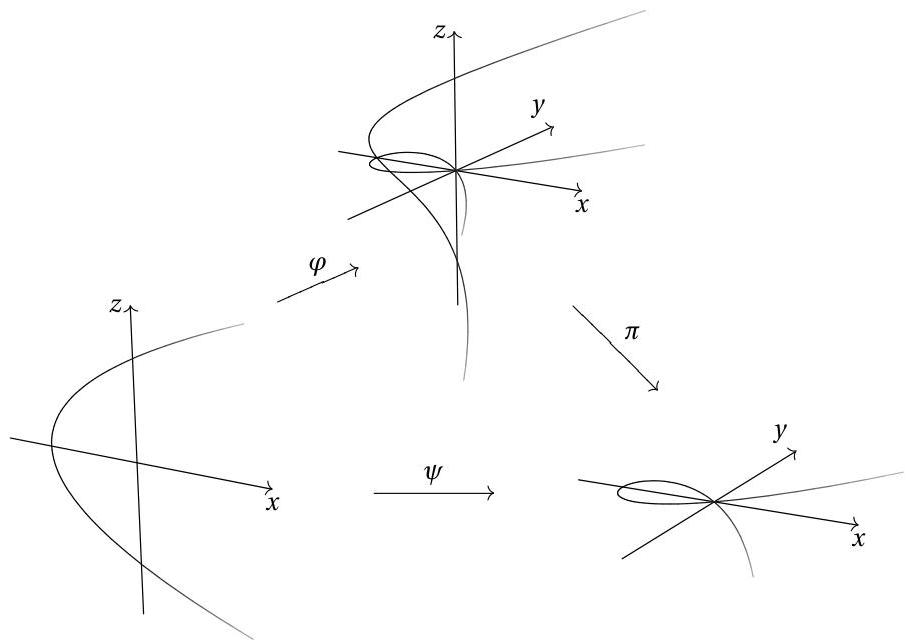

Let  $C \neq V(X)$  be a curve in  $\mathbb{A}^2$ . Write  $C_0 = C \cap U$ , an open subvariety of  $C$ ; let  $C_0' = \psi^{-1}(C_0)$ , and let  $C'$  be the closure of  $C_0'$  in  $\mathbb{A}^2$ . Let  $f \colon C' \to C$  be the restriction of  $\psi$  to  $C'$ . Then  $f$  is a birational morphism of  $C'$  to  $C$ . By means of  $\tilde{f}$  we may identify  $k(C) = k(x, y)$  with  $k(C') = k(x, z)$ ;  $y = xz$ .

(1). Let  $C = V(F)$ ,  $F = F_{r} + F_{r+1} + \dots + F_{n}$ ,  $F_{i}$  a form of degree  $i$  in  $k[X, Y]$ ,  $r = m_{P}(C)$ ,  $n = \deg(C)$ . Then  $C' = V(F')$ , where  $F' = F_{r}(1, Z) + XF_{r+1}(1, Z) + \dots + X^{n-r}F_{n}(1, Z)$ .

Proof.  $F(X, XZ) = X^r F_r(1, Z) + X^{r+1} F_{r+1}(1, Z) + \dots = X^r F'$ . Since  $F_r(1, Z) \neq 0$ ,  $X$  doesn't divide  $F'$ .

If  $F' = GH$ , then  $F = X^r G(X, Y / X)H(X, Y / X)$  would be reducible. Thus  $F'$  is irreducible, and since  $V(F') \supset C_0'$ ,  $V(F') = C'$ .

Assumption.  $X$  is not tangent to  $C$  at  $P$ . By multiplying  $F$  by a constant, we may assume that  $F_{r} = \prod_{i=1}^{s}(Y - \alpha_{i}X)^{r_{i}}$ , where  $Y - \alpha_{i}X$  are the tangents to  $F$  at  $P$ .

(2). With  $F$  as above,  $f^{-1}(P) = \{P_1,\ldots ,P_s\}$ . where  $P_{i} = (0,\alpha_{i})$ , and

$$
m _ {P _ {i}} \left(C ^ {\prime}\right) \leq I \left(P _ {i}, C ^ {\prime} \cap E\right) = r _ {i}.
$$

If  $P$  is an ordinary multiple point on  $C$ , then each  $P_i$  is a simple point on  $C'$ , and  $\operatorname{ord}_{P_i}^{C'}(x) = 1$ .

Proof.  $f^{-1}(P) = C' \cap E = \{(0, \alpha) \mid F_r(1, \alpha) = 0\}$ . And

$$
m _ {P _ {i}} \left(C ^ {\prime}\right) \leq I \left(P _ {i}, F ^ {\prime} \cap X\right) = I \left(P _ {i}, \prod_ {i = 1} ^ {s} \left(Z - \alpha_ {i}\right) ^ {r _ {i}} \cap X\right) = r _ {i}
$$

by properties of the intersection number.

---

7.2. BLOWING UP A POINT IN
\mathbb{A}^2

(3). There is an affine neighborhood $W$ of $P$ on $C$ such that $W' = f^{-1}(W)$ is an affine open subvariety on $C'$, $f(W') = W$, $\Gamma(W')$ is module finite over $\Gamma(W)$, and $x^{r-1}\Gamma(W') \subset \Gamma(W)$.

Proof. Let $F = \sum_{i+j \geq r} a_{ij} X^i Y^j$. Let $H = \sum_{j \geq r} a_{0j} Y^{j-r}$, and let $h$ be the image of $H$ in $\Gamma(C)$. Since $H(0,0) = 1$, $W = C_h$ is an affine neighborhood of $P$ in $C$. Then $W' = f^{-1}(W) = C_h'$ is also an affine open subvariety of $C'$.

To prove the last two claims it suffices to find an equation $z^r + b_1 z^{r-1} + \dots + b_r = 0$, $b_i \in \Gamma(W)$. In fact, $\Gamma(W') = \Gamma(W)[z]$, so it will follow that $1, z, \ldots, z^{r-1}$ generate $\Gamma(W')$ as a module over $\Gamma(W)$ (see Proposition 3 of §1.9); and $x^{r-1} z^i \in \Gamma(W)$ if $i \leq r-1$.

To find the equation, notice that

$$
F'(x, z) = \sum a_{ij} x^{i+j-r} z^j = \sum a_{ij} y^{i+j-r} z^{r-i},
$$

so we have an equation $z^r + b_1 z^{r-1} + \dots + b_r = 0$, where $b_i = (\sum_j a_{ij} y^{i+j-r}) / h$ for $i &lt; r$, and $b_r = \sum_{i \geq r, j} a_{ij} x^{i-r} y^j / h$.

Remarks. (1) We can take the neighborhoods $W$ and $W'$ arbitrarily small; i.e., if $P \in U$, $U' \supset \{P_1, \ldots, P_s\}$ are any open sets on $C$ and $C'$, we may take $W \subset U$, $W' \subset U'$. Starting with $W$ as in (3), we may choose $g \in \Gamma(W)$ such that $g(P) \neq 0$, but $g(Q) = 0$ for all $Q \in (W \setminus U) \cup f(W' \setminus U')$ (Problem 1.17). Then $W_g$, $W_g'$ are the required neighborhoods.

(2) By taking a linear change of coordinates if necessary, we may also assume that $W$ includes any finite set of points on $C$ we wish. For the points on the $Y$-axis can be moved into $W$ by a change of coordinates $(X, Y) \mapsto (X + \alpha Y, Y)$. And the zeros of $H$ can be moved by $(X, Y) \mapsto (X, Y + \beta X)$.

# Problems

7.2. (a) For each of the curves $F$ in §3.1, find $F'$; show that $F'$ is nonsingular in the first five examples, but not in the sixth. (b) Let $F = Y^2 - X^5$. What is $F'$? What is $(F')'$? What must be done to resolve the singularity of the curve $Y^2 = X^{2n+1}$?

7.3. Let $F$ be any plane curve with no multiple components. Generalize the results of this section to $F$.

7.4.* Suppose $P$ is an ordinary multiple point on $C$, $f^{-1}(P) = \{P_1, \ldots, P_r\}$. With the notation of Step (2), show that $F_Y = \sum_i \prod_{j \neq i} (Y - \alpha_j X) + (F_{r+1})_Y + \ldots$, so $F_Y(x, y) = x^{r-1} (\sum_{j \neq i} (z - \alpha_j) + x + \ldots)$. Conclude that $\operatorname{ord}_{P_i}^{C'} (F_Y(x, y)) = r - 1$ for $i = 1, \ldots, r$.

7.5.* Let $P$ be an ordinary multiple point on $C$, $f^{-1}(P) = \{P_1, \ldots, P_r\}$, $L_i = Y - \alpha_i X$ the tangent line corresponding to $P_i = (0, \alpha_i)$. Let $G$ be a plane curve with image $g$ in $\Gamma(C) \subset \Gamma(C')$. (a) Show that $\operatorname{ord}_{P_i}^{C'}(g) \geq m_P(G)$, with equality if $L_i$ is not tangent to $G$ at $P$. (b) If $s \leq r$, and $\operatorname{ord}_{R_i}^{C'}(g) \geq s$ for each $i = 1, \ldots, r$, show that $m_P(G) \geq s$. (Hint: How many tangents would $G$ have otherwise?)

7.6. If $P$ is an ordinary cusp on $C$, show that $f^{-1}(P) = \{P_1\}$, where $P_1$ is a simple point on $C'$.

---

CHAPTER 7. RESOLUTION OF SINGULARITIES

# 7.3 Blowing up Points in $\mathbb{P}^2$

Let $P_{1},\ldots ,P_{t}\in \mathbb{P}^{2}$. We are going to blow up all of these points, replacing each by a projective line. We assume for simplicity that $P_{i} = [a_{i1}:a_{i2}:1]$, leaving the reader to make the necessary changes if $P_{i}\notin U_{3}$.

Let $U = \mathbb{P}^2 \setminus \{P_1, \ldots, P_t\}$. Define morphisms $f_i \colon U \to \mathbb{P}^1$ by the formula

$$
f _ {i} \left[ x _ {1}: x _ {2}: x _ {3} \right] = \left[ x _ {1} - a _ {i 1} x _ {3}: x _ {2} - a _ {i 2} x _ {3} \right].
$$

Let $f = (f_{1},\ldots ,f_{t})\colon U\to \mathbb{P}^{1}\times \dots \times \mathbb{P}^{1}$ ($t$ times) be the product (Proposition 7 of §6.4), and let $G\subset U\times \mathbb{P}^1\times \dots \times \mathbb{P}^1$ be the graph of $f$.

Let $X_{1}, X_{2}, X_{3}$ be homogeneous coordinates for $\mathbb{P}^2$, $Y_{i1}, Y_{i2}$ homogeneous coordinates for the $i^{\text{th}}$ copy of $\mathbb{P}^1$. Let

$$
B = V (\{Y _ {i 1} (X _ {2} - a _ {i 2} X _ {3}) - Y _ {i 2} (X _ {1} - a _ {i 1} X _ {3} \mid i = 1, \ldots , t \}) \subset \mathbb {P} ^ {2} \times \mathbb {P} ^ {1} \times \dots \times \mathbb {P} ^ {1}.
$$

Then $B \supset G$, and we will soon see that $B$ is the closure of $G$ in $\mathbb{P}^2 \times \dots \times \mathbb{P}^1$, so $B$ is a variety. Let $\pi \colon B \to \mathbb{P}^2$ be the restriction of the projection from $\mathbb{P}^2 \times \dots \times \mathbb{P}^1$ to $\mathbb{P}^2$. Let $E_i = \pi^{-1}(P_i)$.

(1). $E_{i} = \{P_{i}\} \times \{f_{1}(P_{i})\} \times \dots \times \mathbb{P}^{1} \times \dots \times \{f_{t}(P_{i})\}$, where $\mathbb{P}^1$ appears in the $i$th place. So each $E_{i}$ is canonically isomorphic to $\mathbb{P}^1$.

(2). $B \setminus \bigcup_{i=1}^{t} E_i = B \cap (U \times \mathbb{P}^1 \times \dots \times \mathbb{P}^1) = G$, so $\pi$ restricts to an isomorphism of $B \setminus \bigcup_{i=1}^{t} E_i$ with $U$.

(3). If $T$ is any projective change of coordinates of $\mathbb{P}^2$, with $T(P_i) = P_i'$, and $f_i' \colon \mathbb{P}^2 \setminus \{P_1', \ldots, P_t'\} \to \mathbb{P}^1$ are defined using $P_i'$ instead of the $P_i$, then there are unique projective changes of coordinates $T_i$ of $\mathbb{P}^1$ such that $T_i \circ f_i = f_i' \circ T$ (see Problem 7.7 below). If $f' = (f_i', \ldots, f_t')$, then $(T_1 \times \dots \times T_t) \circ f = f' \circ T$, and $T \times T_1 \times \dots \times T_t$ maps $G$, $B$ and $E_i$ isomorphically onto the corresponding $G'$, $B'$ and $E_i'$ constructed from $f'$.

(4). If $T_{i}$ is a projective change of coordinates of $\mathbb{P}^1$ (for one $i$), then there is a projective change of coordinates $T$ of $\mathbb{P}^2$ such that $T(P_{i}) = P_{i}$ and $f_{i} \circ T = T_{i} \circ f_{i}$ (see Problem 7.8 below).

(5). We want to study $\pi$ in a neighborhood of a point $Q$ in some $E_{i}$. We may assume $i = 1$, and by (3) and (4) we may assume that $P_{1} = [0:0:1]$, and that $Q$ corresponds to $[\lambda : 1] \in \mathbb{P}^{1}$, $\lambda \in k$ (even $\lambda = 0$ if desired).

Let $\varphi_3\colon \mathbb{A}^2\to U_3\subset \mathbb{P}^2$ be the usual morphism: $\varphi_{3}(x,y) = [x:y:1]$. Let $V = U_{3}\setminus \{P_{2},\ldots ,P_{t}\}$, $W = \varphi_3^{-1}(V)$. Let $\psi \colon \mathbb{A}^2\to \mathbb{A}^2$ be as in Section 2: $\psi (x,z) = (x,xz)$; and let $W^{\prime} = \psi^{-1}(W)$.

Define $\varphi \colon W' \to \mathbb{P}^2 \times \mathbb{P}^1 \times \dots \times \mathbb{P}^1$ by setting

$$
\varphi (x, z) = [ x: x z: 1 ] \times [ 1: z ] \times f _ {2} ([ x: x z: 1 ]) \times \dots \times f _ {t} ([ x: x z: 1 ]).
$$

Then $\varphi$ is a morphism, and $\pi \circ \varphi = \varphi_3 \circ \psi$. Let $V' = \varphi(W') = B \setminus (\bigcup_{i &gt; 1} E_i \cup V(X_3) \cup V(Y_{12}))$. This $V'$ is a neighborhood of $Q$ on $B$.

(6). $B$ is the closure of $G$ in $\mathbb{P}^2 \times \dots \times \mathbb{P}^1$, and hence $B$ is a variety. For if $S$ is any closed set in $\mathbb{P}^2 \times \dots \times \mathbb{P}^1$ that contains $G$, then $\varphi^{-1}(S)$ is closed in $W'$ and contains

---

7.4. QUADRATIC TRANSFORMATIONS

$\varphi^{-1}(G) = W' \setminus V(X)$ . Since  $W' \setminus V(X)$  is open in  $W'$ , it is dense, so  $\varphi^{-1}(S) = W'$ . Therefore  $Q \in S$ , and since  $Q$  was an arbitrary point of  $B \setminus G$ ,  $S \supset B$ .

(7). The morphism from  $\mathbb{P}^2 \times \dots \times \mathbb{P}^1 \setminus V(X_3Y_{12})$  to  $\mathbb{A}^2$  taking  $[x_1 : x_2 : x_3] \times [y_{11} : y_{12}] \times \dots$  to  $[x_1 / x_3 : y_{11} / y_{12}]$ , when restricted to  $V'$ , is the inverse morphism to  $\varphi$ . Thus we have the following diagram:

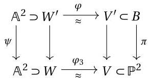

Locally,  $\pi \colon B\to \mathbb{P}^2$  looks just like the map  $\psi \colon \mathbb{A}^2\to \mathbb{A}^2$  of Section 2.

(8). Let  $C$  be an irreducible curve in  $\mathbb{P}^2$ . Let  $C_0 = C \cap U$ ,  $C_0' = \pi^{-1}(C_0) \subset G$ , and let  $C'$  be the closure of  $C_0'$  in  $B$ . Then  $\pi$  restricts to a birational morphism  $f \colon C' \to C$ , which is an isomorphism from  $C_0'$  to  $C_0$ . By (7) we know that, locally,  $f$  looks just like the corresponding affine map of Section 2.

Proposition 1. Let  $C$  be an irreducible projective plane curve, and suppose all the multiple points of  $C$  are ordinary. Then there is a nonsingular projective curve  $C'$  and a birational morphism  $f$  from  $C'$  onto  $C$ .

Proof. Let  $P_{1}, \ldots, P_{t}$  be the multiple points of  $C$ , and apply the above process. Step (2) of Section 2, together with (8) above, guarantees that  $C'$  is nonsingular.

# Problems

7.7. Suppose  $P_{1} = [0:0:1]$ ,  $P_{1}' = [a_{11}:a_{12}:1]$ , and

$$
T = (a X + b Y + a _ {1 1} z, c X + d Y + a _ {1 2} Z, e X + f Y + Z).
$$

Show that  $T_{1} = ((a - a_{11}e)X + (b - a_{11}f)Y, (c - a_{12}e)X + (d - a_{12}f)Y)$  satisfies  $T_{1} \circ f_{1} = f_{1}' \circ T$ . Use this to prove Step (3) above.

7.8. Let  $P_{1} = [0:0:1]$ ,  $T_{1} = (aX + bY, cX + dY)$ . Show that  $T = (aX + bY, cX + dY, Z)$  satisfies  $f_{1} \circ T = T_{1} \circ f_{1}$ . Use this to prove Step (4).
7.9. Let  $C = V(X^4 + Y^4 - XYZ^2)$ . Write down equations for a nonsingular curve  $X$  in some  $\mathbb{P}^N$  that is birationally equivalent to  $C$ . (Use the Segre imbedding.)

# 7.4 Quadratic Transformations

A disadvantage of the procedure in Section 7.3 is that the new curve  $C'$ , although having better singularities than  $C$ , is no longer a plane curve. The facts we have learned about plane curves don't apply to  $C'$ , and it is difficult to repeat the process to  $C'$ , getting a better curve  $C''$ . (The latter can be done, but it requires more technique than we have developed here.) If we want  $C'$  to be a plane curve, we must

---

allow it acquire some new singularities. These new singularities can be taken to be ordinary multiple points, while the old singularities of $C$ become better on $C^{\prime}$.

Let $P=[0:0:1]$, $P^{\prime}=[0:1:0]$, $P^{\prime\prime}=[1:0:0]$ in $\mathbb{P}^{2}$; call these three points the *fundamental points*. Let $L=V(Z)$, $L^{\prime}=V(Y)$, $L^{\prime\prime}=V(X)$; call these the *exceptional lines*. Note that the lines $L^{\prime}$ and $L^{\prime\prime}$ intersect in $P$, and $L$ is the line through $P^{\prime}$ and $P^{\prime\prime}$. Let $U=\mathbb{P}^{2}\smallsetminus V(XYZ)$.

Define $Q\colon\mathbb{P}^{2}\smallsetminus\{P,P^{\prime},P^{\prime\prime}\}\to\mathbb{P}^{2}$ by the formula $Q([x:y:z]=[yz:xz:xy]$. This $Q$ is a morphism from $\mathbb{P}^{2}\smallsetminus\{P,P^{\prime},P^{\prime\prime}\}$ onto $U\cup\{P,P^{\prime},P^{\prime\prime}\}$. And $Q^{-1}(P)=L-\{P^{\prime},P^{\prime\prime}\}$. (By the symmetry of $Q$, it is enough to write one such equality; the results for the other fundamental points and exceptional lines are then clear — and we usually omit writing them.)

If $[x:y:z]\in U$, then $Q(Q([x:y:z]))=[xzxy:yzxy:yzxz]=[x:y:z]$. So $Q$ maps $U$ one-to-one onto itself, and $Q=Q^{-1}$ on $U$, so $Q$ is an isomorphism of $U$ with itself. In particular, $Q$ is a birational map of $\mathbb{P}^{2}$ with itself. It is called the *standard quadratic transformation*, or sometimes the standard Cremona transformation (a Cremona transformation is any birational map of $\mathbb{P}^{2}$ with itself).

Let $C$ be an irreducible curve in $\mathbb{P}^{2}$. Assume $C$ is not an exceptional line. Then $C\cap U$ is open in $C$, and closed in $U$. Therefore $Q^{-1}(C\cap U)=Q(C\cap U)$ is a closed curve in $U$. Let $C^{\prime}$ be the closure of $Q^{-1}(C\cap U)$ in $\mathbb{P}^{2}$. Then $Q$ restricts to a birational morphism from $C^{\prime}\smallsetminus\{P,P^{\prime},P^{\prime\prime}\}$ to $C$. Note that $(C^{\prime})^{\prime}=C$, since $Q\circ Q$ is the identity on $U$.

Let $F\in k[X,Y,Z]$ be the equation of $C$, $n=\deg(F)$. Let $F^{Q}=F(YZ,XZ,XY)$, called the *algebraic transform* of $F$. So $F^{Q}$ is a form of degree $2n$.

(1). If $m_{P}(C)=r$, then $Z^{r}$ is the largest power of $Z$ that divides $F^{Q}$.

###### Proof.

Write $F=F_{r}(X,Y)Z^{n-r}+\cdots+F_{n}(X,Y)$, $F_{i}$ a form of degree $i$ (Problem 5.5). Then

$F^{Q}=F_{r}(YZ,XZ)(XY)^{n-r}+\cdots=Z^{r}(F_{r}(Y,X)(XY)^{n-r}+ZF_{r+1}(Y,X)(XY)^{n-r-1}+\cdots),$

from which the result follows.

Let $m_{P}(C)=r$, $m_{P^{\prime}}(C)=r^{\prime}$, $m_{P^{\prime\prime}}(C)=r^{\prime\prime}$. Then $F^{Q}=Z^{r}Y^{r^{\prime}}X^{r^{\prime\prime}}F^{\prime}$, where $X$, $Y$, and $Z$ do not divide $F^{\prime}$. This $F^{\prime}$ is called the *proper transform* of $F$.

(2). $\deg(F^{\prime})=2n-r-r^{\prime}-r^{\prime\prime}$, $(F^{\prime})^{\prime}=F$, $F^{\prime}$ is irreducible, and $V(F^{\prime})=C^{\prime}$.

###### Proof.

From $(F^{Q})^{Q}=(XYZ)^{n}F$, it follows that $F^{\prime}$ is irreducible and $(F^{\prime})^{\prime}=F$. Since $V(F^{\prime})\supset Q^{-1}(C\cap U)$, $V(F^{\prime})$ must be $C^{\prime}$.

(3). $m_{P}(F^{\prime})=n-r^{\prime}-r^{\prime\prime}$. (Similarly for $P^{\prime}$ and $P^{\prime\prime}$.)

###### Proof.

$F^{\prime}=\sum_{i=0}^{n-r}F_{r+i}(Y,X)X^{n-r-r^{\prime\prime}-i}Y^{n-r-r^{\prime}-i}Z^{i}$, so the leading form of $F^{\prime}$ at $P=[0:0:1]$ is $F_{n}(Y,X)X^{-r^{\prime\prime}}Y^{-r^{\prime}}$.

Let us say that $C$ is in *good position* if no exceptional line is tangent to $C$ at a fundamental point.

(4). If $C$ is in good position, so is $C^{\prime}$

---

7.4. QUADRATIC TRANSFORMATIONS

Proof. The line  $L$  is tangent to  $C'$  at  $P'$  if and only if  $I(P', F' \cap Z) &gt; m_{P'}(C')$ . Equivalently,  $I(P', F_r(Y, X)X^{n - r - r''}Y^{n - r - r'} \cap Z) &gt; n - r - r''$ , or  $I(P', F_r(Y, X) \cap Z) &gt; 0$ , or  $F_r(1, 0) = 0$ . But if  $Y$  is not tangent to  $F$  at  $P$ , then  $F_r(1, 0) \neq 0$ . By symmetry, the same holds for the other lines and points.

Assume that  $C$  is in good position, and that  $P \in C$ . Let  $C_0 = (C \cap U) \cup \{P\}$ , a neighborhood of  $P$  on  $C$ . Let  $C_0' = C' \setminus V(XY)$ . Let  $f \colon C_0' \to C_0$  be the restriction of  $Q$  to  $C_0'$ .

Let  $F_{*} = F(X,Y,1), C_{*} = V(F_{*}) \subset \mathbb{A}^{2}$ . Define  $(F_{*})' = F(X,XZ,1)X^{-r}, C_{*}' = V(F_{*}') \subset \mathbb{A}^{2}$  and  $f_{*} \colon C_{*}' \to C_{*}$  by  $f_{*}(x,z) = (x,xz)$ , all as in Section 2.

(5). There is a neighborhood  $W$  of  $(0,0)$  in  $C_*$ , and there are isomorphisms  $\varphi \colon W \to C_0$  and  $\varphi' \colon W' = f_*^{-1}(W) \to C_0'$  such that  $\varphi f_* = f\varphi'$ , i.e., the following diagram commutes:

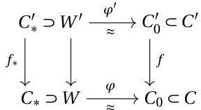

Proof. Take  $W = (C_{*} \setminus V(XY)) \cup \{(0,0)\}$ ;  $\varphi(x,y) = [x : y : 1]$ , and  $\varphi'(x,z) = [z : 1 : xz]$ . The inverse of  $\varphi'$  is given by  $[x : y : z] \mapsto (z / x, x / y)$ . We leave the rest to the reader.

(6). If  $C$  is in good position, and  $P_{1},\ldots ,P_{s}$  are the non-fundamental points on  $C^\prime \cap L$ , then  $m_{P_i}(C')\leq I(P_i,C'\cap L)$ , and  $\sum_{i = 1}^{s}I(P_{i},C^{\prime}\cap Z) = r$ .

Proof. As in the proof of (4),  $\sum I(P_i, F' \cap Z) = \sum I(P_i, F_r(Y, X) \cap Z) = r$ .

Remark. If  $P \notin C$ , the same argument shows that there are no non-fundamental points on  $C' \cap L$ .

Example. (See Problem 7.10)

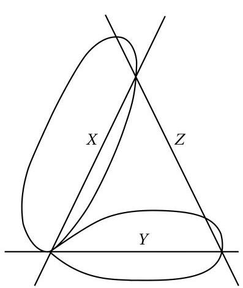

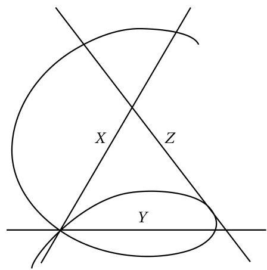

---

CHAPTER 7. RESOLUTION OF SINGULARITIES

Let us say that $C$ is in excellent position if $C$ is in good position, and, in addition, $L$ intersects $C$ (transversally) in $n$ distinct non-fundamental points, and $L'$ and $L''$ each intersect $C$ (transversally) in $n - r$ distinct non-fundamental points. (This condition is no longer symmetric in $P, P', P''$.)

(7). If $C$ is in excellent position, then $C'$ has the following multiple points:

(a) Those on $C' \cap U$ correspond to multiple points on $C \cap U$, the correspondence preserving multiplicity and ordinary multiple points.
(b) $P, P'$ and $P''$ are ordinary multiple points on $C'$ with multiplicities $n$, $n - r$, and $n - r$ respectively.
(c) There are no non-fundamental points on $C' \cap L'$ or on $C' \cap L''$. Let $P_1, \ldots, P_s$ be the non-fundamental points on $C' \cap L$. Then $m_{P_i}(C') \leq I(P_i, C' \cap L)$ and $\sum I(P_i, C' \cap L) = r$.

Proof. (a) follows from the fact that $C' \cap U$ and $C \cap U$ are isomorphic, and from Theorem 2 of §3.2 and Problem 3.24. (c) follows from (6), and (b) follows by applying (6) to the curves $C'$ and $(C')' = C$ (observing by (4) that $C'$ is in good position).

For any irreducible projective plane curve $C$ of degree $n$, with multiple points of multiplicity $r_P = m_P(C)$, let

$$
g^*(C) = \frac{(n - 1)(n - 2)}{2} - \sum \frac{r_P(r_P - 1)}{2}.
$$

We know that $g^*(C)$ is a nonnegative integer. (Theorem 2 of §5.4).

(8). If $C$ is in excellent position, then $g^{*}(C^{\prime}) = g^{*}(C) - \sum_{i = 1}^{s}\frac{r_{i}(r_{i} - 1)}{2}$, where $r_i = m_{P_i}(C')$, and $P_{1},\ldots ,P_{s}$ are the non-fundamental points on $C^\prime \cap L$

Proof. A calculation, using (2) and (7).

The special notation used in (1)-(8) regarding fundamental points and exceptional lines has served its purpose; from now on $P$, $P'$, etc. may be any points, $L$, $L'$, etc. any lines.

Lemma 1. $(\operatorname{char}(k) = 0)$ Let $F$ be an irreducible projective plane curve, $P$ a point of $F$. Then there is a projective change of coordinates $T$ such that $F^T$ is in excellent position, and $T([0:0:1]) = P$.

Proof. Let $\deg(F) = n$, $m_P(F) = r$. By Problem 4.16, it is enough to find lines $L, L', L''$ such that $L' \cdot C = rP + P_{r+1}' + \dots + P_n', L'' \cdot C = rP + P_{r+1}'' + \dots + P_n''$, and $L \cdot C = P_1 + \dots + P_n$, with all these points distinct; then there is a change of coordinates $T$ with $L^T = Z$, $L'^T = Y$, $L''^T = X$. The existence of such lines follows from Problem 5.26 (Take $L'$, $L''$ first, then $L$).

If $T$ is any projective change of coordinates, $Q \circ T$ is called a quadratic transformation, and $(F^T)'$ is called a quadratic transformation of $F$. If $F^T$ is in excellent position, and $T([0:0:1]) = P$, we say that the quadratic transformation is centered at $P$. If $F = F_1, F_2, \ldots, F_m = G$ are curves, and each $F_i$ is a quadratic transformation of $F_{i-1}$, we say that $F$ is transformed into $G$ by a finite sequence of quadratic transformations.

---

###### Theorem 2.

By a finite sequence of quadratic transformations, any irreducible projective plane curve may be transformed into a curve whose only singularities are ordinary multiple points.

###### Proof.

Take successive quadratic transformations, centering each one at a non-ordinary multiple point.

From (7) and (8) we see that at each step, either $C^{\prime}$ has one less non-ordinary multiple point than $C$, or $g^{*}(C^{\prime})=g^{*}(C)-\sum\frac{r_{i}(r_{i}-1)}{2}<g^{*}(C)$. If the original curve $C$ has $N$ non-ordinary multiple points, we reach the desired curve after at most $N+g^{*}(C)$ steps. (See the Appendix for a proof in characteristic $p$.)

## 7 Problems

###### 7.10.

Let $F=8X^{3}Y+8X^{3}Z+4X^{2}YZ-10XY^{3}-10XY^{2}Z-3Y^{3}Z$. Show that $F$ is in good position, and that $F^{\prime}=8Y^{2}Z+8Y^{3}+4XY^{2}-10X^{2}Z-10X^{2}Y-3X^{3}$. Show that $F$ and $F^{\prime}$ have singularities as in the example sketched, and find the multiple points of $F$ and $F^{\prime}$.

###### 7.11.

Find a change of coordinates $T$ so that $(Y^{2}Z-X^{3})^{T}$ is in excellent position, and $T([0:0:1])=[0:0:1]$. Calculate the quadratic transformation.

###### 7.12.

Find a quadratic transformation of $Y^{2}Z^{2}-X^{4}-Y^{4}$ with only ordinary multiple points. Do the same with $Y^{4}+Z^{4}-2X^{2}(Y-Z)^{2}$.

###### 7.13*.

(a) Show that in the lemma, we may choose $T$ in such a way that for a given finite set $S$ of points of $F$, with $P\not\in S$, $T^{-1}(S)\cap V(XYZ)=\varnothing$. Then there is a neighborhood of $S$ on $F$ that is isomorphic to an open set on $(F^{T})^{\prime}$. (b) If $S$ is a finite set of simple points on a plane curve $F$, there is a curve $F^{\prime}$ with only ordinary multiple points, and a neighborhood $U$ of $S$ on $F$, and an open set $U^{\prime}$ on $F^{\prime}$ consisting entirely of simple points, such that $U$ is isomorphic to $U^{\prime}$.

###### 7.14*.

(a) What happens to the degree, and to $g^{*}(F)$, when a quadratic transformation is centered at: (i) an ordinary multiple point; (ii) a simple point; (iii) a point not on $F$? (b) Show that the curve $F^{\prime}$ of Problem 7.13(b) may be assumed to have arbitrarily large degree.

###### 7.15.

Let $F=F_{1},\ldots,F_{m}$ be a sequence of quadratic transformations of $F$, such that $F_{m}$ has only ordinary multiple points. Let $P_{i1},P_{i2},\ldots$ be the points on $F_{i}$ introduced, as in (7) (c), in going from $F_{i-1}$ to $F_{i}$. (These are called “neighboring singularities”; see Walker’s “Algebraic Curves”, Chap. III, §7.6, §7.7). If $n=\deg(F)$, show that

$(n-1)(n-2)\ \geq\ \sum_{P\in F}m_{P}(F)(m_{P}(F)-1)+\sum_{i>1,j}m_{P_{ij}}(F_{i})(m_{P_{ij}}(F_{i})-1).$

###### 7.16.

(a) Show that everything in this section, including Theorem2, goes through for any plane curve with no multiple components. (b) If $F$ and $G$ are two curves with no common components, and no multiple components, apply (a) to the curve $FG$. Deduce that there are sequences of quadratic transformations $F=F_{1}$, …, $F_{S}=F^{\prime}$ and $G=G_{1}$, …, $G_{s}=G^{\prime}$, where $F^{\prime}$ and $G^{\prime}$ have only ordinary multiple points, and no

---

CHAPTER 7. RESOLUTION OF SINGULARITIES

tangents in common at points of intersection. Show that

$\deg(F)\deg(G)$ $=\sum m_{P}(F)m_{P}(G)+\sum_{i&gt;1,j}m_{P_{ij}}(F_{i})m_{P_{ij}}(G_{i}),$

where the $P_{ij}$ are the neighboring singularities of $FG$, determined as in Problem 7.15.

### 7.5 Nonsingular Models of Curves

###### Theorem 3.

Let $C$ be a projective curve. Then there is a nonsingular projective curve $X$ and a birational morphism $f$ from $X$ onto $C$. If $f^{\prime}\colon X^{\prime}\to C$ is another, then there is a unique isomorphism $g\colon X\to X^{\prime}$ such that $f^{\prime}g=f$.

###### Proof.

The uniqueness follows from Corollary 2 of §7.1. For the existence, the Corollary in §6.6 says $C$ is birationally equivalent to a plane curve. By Theorem 2 of §7.4, this plane curve can be taken to have only ordinary multiple points as singularities, and Proposition 1 of §7.3 replaces this curve by a nonsingular curve $X$. That the birational map from $X$ to $C$ is a morphism follows from Corollary 1 of §7.1.

If $C$ is a plane curve, the fact that $f$ maps $X$ onto $C$ follows from the construction of $X$ from $C$; indeed, if $P\in C$, we may find $C^{\prime}$ with ordinary multiple points so that the rational map from $C^{\prime}$ to $C$ is defined at some point $P^{\prime}$ and maps $P^{\prime}$ to $P$ (see Problem 7.13); and the map from $X$ to $C^{\prime}$ is onto (Proposition 1 of §7.3).

If $C\subset\mathbb{P}^{n}$, and $P\in C$, choose a morphism $g\colon C\to C_{1}$ from $C$ to a plane curve $C_{1}$ such that $\{P\}=g^{-1}(g(P))$ (Problem 6.43). Then if $gf(x)=g(P)$, it follows that $f(x)=P$.

###### Corollary.

There is a natural one-to-one correspondence between nonsingular projective curves $X$ and algebraic function fields in one variable $K$ over $k$: $K=k(X)$. If $X$ and $X^{\prime}$ are two such curves, dominant morphisms from $X^{\prime}$ to $X$ correspond to homomorphisms from $k(X)$ into $k(X^{\prime})$.

We will see later that a dominant morphism between projective curves must be surjective (Problem 8.18).

Let $C$ be any projective curve, $f\colon X\to C$ as in Theorem 3. We say that $X$ is the nonsingular model of $C$, or of $K=k(C)$. We identify $k(X)$ with $K$ by means of $\tilde{f}$.

The points $Q$ of $X$ are in one-to-one correspondence with the discrete valuation rings $\mathcal{O}_{Q}(X)$ of $K$ (Corollary 4 of §7.1). Then $f(Q)=P$ exactly when $\mathcal{O}_{Q}(X)$ dominates $\mathcal{O}_{P}(C)$. The points of $X$ will be called places of $C$, or of $K$. A place $Q$ is centered at $P$ if $f(Q)=P$.

###### Lemma 2.

Let $C$ be a projective plane curve, $P\in C$. Then there is an affine neighborhood $U$ of $P$ such that:

1. $f^{-1}(U)=U^{\prime}$ is an affine open subvariety of $X$.
2. $\Gamma(U^{\prime})$ is module-finite over $\Gamma(U)$.
3. For some $0\neq t\in\Gamma(U)$, $t\Gamma(U^{\prime})\subset\Gamma(U)$.
4. The vector space $\Gamma(U^{\prime})/\Gamma(U)$ is finite dimensional over $k$.

---

7.5. NONSINGULAR MODELS OF CURVES

The neighborhood $U$ may be taken to exclude any finite set $S$ of points in $C$, if $P \notin S$.

Proof. We will choose successive quadratic transformations $C = C_1, \ldots, C_n$ so that $C_n$ has only ordinary multiple points, and open affine sets $W_i \subset C_i$, so that (i) $P \in W_1$ and $S \cap W_1 = \emptyset$; (ii) the birational map from $C_{i+1}$ to $C_i$ is represented by a morphism $f_i \colon W_{i+1} \to W_i$; (iii) $f_i \colon W_{i+1} \to W_i$ satisfies all the conditions of Section 2, Step (3). These quadratic transformations and neighborhoods are chosen inductively. At each stage it may be necessary to shrink the previous neighborhoods; the remarks in Section 2, together with Problem 7.13, show that there is no difficulty in doing this.

Likewise let $f_n \colon X \to C_n$ be the nonsingular model of $C_n$ (Proposition 1 of §7.3), and let $W_{n+1} = f_n^{-1}(W_n)$ (shrinking again if necessary); this time Section 3, Step (7) guarantees that the same conditions hold.

Let $U = W_{1}$, $U' = W_{n+1}$. That $\Gamma(U')$ is module-finite over $\Gamma(U)$ follows from Problem 1.45. Suppose $\Gamma(U') = \sum_{i=1}^{m} \Gamma(U) z_{i}$. Since $\Gamma(U)$ and $\Gamma(U')$ have the same quotient field, there is a $t \in \Gamma(U)$ with $t z_{i} \in \Gamma(U)$, $t \neq 0$. This $t$ satisfies (3).

Define $\varphi \colon \Gamma(U') / \Gamma(U) \to \Gamma(U) / (t)$ by $\varphi(\overline{z}) = \overline{tz}$. Since $\varphi$ is a one-to-one $k$-linear map, it is enough to show that $\Gamma(U) / (t)$ is finite-dimensional. Since $t$ has only finitely many zeros in $U$, this follows from Corollary 4 to the Nullstellensatz in §1.7.

Notation. Let $f \colon X \to C$ as above $Q \in X$, $f(Q) = P \in C$. Suppose $C$ is a plane curve. For any plane curve $G$ (possibly reducible), form $G_* \in \mathcal{O}_P(\mathbb{P}^2)$ as in Chapter 5, Section 1; let $g$ be the image of $G_*$ in $\mathcal{O}_P(C) \subset k(C) = k(X)$. Define $\operatorname{ord}_Q(G)$ to be $\operatorname{ord}_Q(g)$. As usual, this is independent of the choice of $G_*$.

Proposition 2. Let $C$ be an irreducible projective plane curve, $P \in C$, $f \colon X \to C$ as above. Let $G$ be a (possibly reducible) plane curve. Then $I(P, C \cap G) = \sum_{Q \in f^{-1}(P)} \operatorname{ord}_Q(G)$.

Proof. Let $g$ be the image of $G_*$ in $\mathcal{O}_P(C)$. Choose $U$ as in Lemma 2, and so small that $g$ is a unit in all $\mathcal{O}_{P'}(C)$, $P' \in U$, $P' \neq P$. Then $I(P, C \cap G) = \dim_k(\mathcal{O}_P(\mathbb{P}^2) / (F_*, G_*)) = \dim_k(\mathcal{O}_P(C) / (g))$ (Problem 2.44) is the image of $G_*$ in $\mathcal{O}_P(C)$. Let $V = \Gamma(U)$, $V' = \Gamma(U')$, and let $T \colon V \to V'$ be defined by $T(z) = gz$. Since $V'/V$ is finite dimensional, Problem 2.53 applies: $\dim V / T(V) = \dim V' / T(V')$, so $\dim_k(\Gamma(U) / (g)) = \dim(\Gamma(U') / (g))$. By Corollary 1 of §2.9 again,

$$
\dim \Gamma (U ^ {\prime}) / (g) = \sum_ {Q \in f ^ {- 1} (P)} \dim (\mathcal {O} _ {Q} (X) / (g)) = \sum \operatorname {o r d} _ {Q} (g),
$$

as desired (see Problem 2.50).

Lemma 3. Suppose $P$ is an ordinary multiple point on $C$ of multiplicity $r$. Let $f^{-1}(P) = \{P_1, \ldots, P_r\}$. If $z \in k(C)$, and $\operatorname{ord}_{P_i}(z) \geq r - 1$, then $z \in \mathcal{O}_P(C)$.

Proof. Take a small neighborhood $U$ of $P$ so that $z \in \mathcal{O}_{P'}(C)$ for all $P' \in U$, $P' \neq P$ (The pole set is an algebraic subset, hence finite), and so that $f \colon U' = f^{-1}(U) \to U$ looks like Section 2 Step (3). By Step (2) of Section 2, we know that $\operatorname{ord}_{P_i}(x) = 1$. Therefore $zx^{1 - r} \in \Gamma(U')$. But $x^{r - 1}\Gamma(U') \subset \Gamma(U)$, so $z = x^{r - 1}(zx^{1 - r}) \in \Gamma(U) \subset \mathcal{O}_P(C)$, as desired.

---

CHAPTER 7. RESOLUTION OF SINGULARITIES

Proposition 3. Let $F$ be an irreducible projective plane curve, $P$ an ordinary multiple point of multiplicity $r$ on $F$. Let $P_{1},\ldots ,P_{r}$ be the places centered at $P$. Let $G,H$ be plane curves, possibly reducible. Then Noether's conditions are satisfied at $P$ (with respect to $F,G,H$) if $\operatorname{ord}_{P_i}(H)\geq \operatorname{ord}_{P_i}(G) + r - 1$ for $i = 1,\dots,r$.

Proof. $H_{*} \in (F_{*}, G_{*}) \subset \mathcal{O}_{P}(\mathbb{P}^{2})$ is equivalent with $\overline{H}_{*} \in (\overline{G}_{*}) \subset \mathcal{O}_{P}(F)$, or with $z = \overline{H}_{*} / \overline{G}_{*} \in \mathcal{O}_{P}(F)$. Applying Lemma 3 to $z$ gives the result.

# Problems

7.17. (a) Show that for any irreducible curve $C$ (projective or not) there is a nonsingular curve $X$ and a birational morphism $f$ from $X$ onto $C$. What conditions on $X$ will make it unique? (b) Let $f \colon X \to C$ as in (a), and let $C^\circ$ be the set of simple points of $C$. Show that the restriction of $f$ to $f^{-1}(C^\circ)$ gives an isomorphism of $f^{-1}(C^\circ)$ with $C^\circ$.

7.18. Show that for any place $P$ of a curve $C$, and choice $t$ of uniformizing parameter for $\mathcal{O}_P(X)$, there is a homomorphism $\varphi \colon k(X) \to k((T))$ taking $t$ to $T$ (see Problem 2.32). Show how to recover the place from $\varphi$. (In many treatments of curves, a place is defined to be a suitable equivalence class of "power series expansions".)

7.19.* Let $f \colon X \to C$ as above, $C$ a projective plane curve. Suppose $P$ is an ordinary multiple point of multiplicity $r$ on $C$, $Q_1, \ldots, Q_r$ the places on $X$ centered at $P$. Let $G$ be any projective plane curve, and let $s \leq r$. Show that $m_P(G) \geq s$ if and only if $\operatorname{ord}_{Q_i}(G) \geq s$ for $i = 1, \ldots, r$. (See Problem 7.5.)

7.20. Let $R$ be a domain with quotient field $K$. The integral closure $R'$ of $R$ is $\{z \in k \mid z \text{ is integral over } R\}$. Prove:

(a) If $R$ is a DVR, then $R' = R$.

(b) If $R_{\alpha}' = R_{\alpha}$, then $(\bigcap R_{\alpha})' = (\bigcap R_{\alpha})$.

(c) With $f \colon X \to C$ as in Lemma 2, show that $\Gamma(f^{-1}(U)) = \Gamma(U)'$ for all open sets $U$ of $C$. This gives another algebraic characterization of $X$.

7.21.* Let $X$ be a nonsingular projective curve, $P_{1},\ldots ,P_{s} \in X$. (a) Show that there is projective plane curve $C$ with only ordinary multiple points, and a birational morphism $f \colon X \to C$ such that $f(P_{i})$ is simple on $C$ for each $i$. (Hint: if $f(P_{i})$ is multiple, do a quadratic transform centered at $f(P_{i})$.) (b) For any $m_{1},\ldots ,m_{r} \in \mathbb{Z}$, show that there is a $z \in k(X)$ such that $\operatorname{ord}_{P_i}(z) = m_i$ (Problem 5.15). (c) Show that the curve $C$ of Part (a) may be found with arbitrarily large degree (Problem 7.14).

7.22. Let $P$ be a node on an irreducible plane curve $F$, and let $L_{1}, L_{2}$ be the tangents to $F$ at $P$. $F$ is called a simple node if $I(P, L_{i} \cap F) = 3$ for $i = 1, 2$. Let $H$ be the Hessian of $F$. (a) If $P$ is a simple node on $F$, show that $I(P, F \cap H) = 6$. (Hint: We may take $P = [0 : 0 : 1]$, $F_{*} = xy + \dots$, and use Proposition 2 to show that all monomials of degree $\geq 4$ may be ignored — see Problem 5.23). (b) If $P$ is an ordinary cusp on $F$, show that $I(P, F \cap H) = 8$ (see Problem 7.6). (c) Use (a) and (b) to show that every cubic has one, three, or nine flexes; then Problem 5.24 gives another proof that every cubic is projectively equivalent to one of the type $Y^{2}Z = \text{cubic in } X$ and $Z$. (d) If the

---

curve $F$ has degree $n$, and $i$ flexes (all ordinary), and $\delta$ simple nodes, and $k$ cusps, and no other singularities, then

$i+6\delta+8\,k\,=\,3n(n-2).$

This is one of “Plücker’s formulas” (see Walker’s “Algebraic Curves” for the others).

---

CHAPTER 7. RESOLUTION OF SINGULARITIES

---

Chapter 8 Riemann-Roch Theorem

Throughout this chapter, $C$ will be an irreducible projective curve, $f\colon X\to C$ the birational morphism from the nonsingular model $X$ onto $C$, $K=k(C)=k(X)$ the function field, as in Chapter 7, Section 5. The points $P\in C$ will be identified with the places of $K$; $\operatorname{ord}_{P}$ denotes the corresponding order function on $K$.

### 8.1 Divisors

A divisor on $X$ is a formal sum $D=\sum_{P\in X}n_{P}P$, $n_{P}\in\mathbb{Z}$, and $n_{P}=0$ for all but a finite number of $P$. The divisors on $X$ form an abelian group — it is the free abelian group on the set $X$ (Chapter 2, Section 11).

The degree of a divisor is the sum of its coefficients: $\deg(\sum n_{P}P)=\sum n_{P}$. Clearly $\deg(D+D^{\prime})=\deg(D)+\deg(D^{\prime})$. A divisor $D=\sum n_{P}P$ is said to be effective (or positive) if each $n_{P}\geq 0$, and we write $\sum n_{P}P\geq\sum m_{P}P$ if each $n_{P}\geq m_{P}$.

Suppose $C$ is a plane curve of degree $n$, and $G$ is a plane curve not containing $C$ as a component. Define the divisor of $G$, $\operatorname{div}(G)$, to be $\sum_{P\in X}\operatorname{ord}_{P}(G)P$, where $\operatorname{ord}_{P}(G)$ is defined as in Chapter 7, Section 5. By Proposition 2 of §7.5, $\sum_{P\in X}\operatorname{ord}_{P}(G)=\sum_{Q\in C}I(Q,C\cap G)$. By Bézout’s theorem, $\operatorname{div}(G)$ is a divisor of degree $mn$, where $m$ is the degree of $G$. Note that $\operatorname{div}(G)$ contains more information than the intersection cycle $G\bullet C$.

For any nonzero $z\in K$, define the divisor of $z$, $\operatorname{div}(z)$, to be $\sum_{P\in X}\operatorname{ord}_{P}(z)P$. Since $z$ has only a finite number of poles and zeros (Problem 4.17), $\operatorname{div}(z)$ is a well-defined divisor. If we let $(z)_{0}=\sum_{\operatorname{ord}_{P}(z)>0}\operatorname{ord}_{P}(z)P$, the divisor of zeros of $z$, and $(z)_{\infty}=\sum_{\operatorname{ord}_{P}(z)<0}-\operatorname{ord}_{P}(z)P$, the divisor of poles of $z$, then $\operatorname{div}(z)=(z)_{0}-(z)_{\infty}$. Note that $\operatorname{div}(zz^{\prime})=\operatorname{div}(z)+\operatorname{div}(z^{\prime})$, and $\operatorname{div}(z^{-1})=-\operatorname{div}(z)$.

###### Proposition 1.

For any nonzero $z\in K$, $\operatorname{div}(z)$ is a divisor of degree zero. A rational function has the same number of zeros as poles, if they are counted properly.

###### Proof.

Take $C$ to be a plane curve of degree $n$. Let $z=g/h$, $g,h$ forms of the same degree in $\Gamma_{h}(C)$; say $g,h$ are residues of forms $G,H$ of degree $m$ in $k[X,Y,Z]$. Then $\operatorname{div}(z)=\operatorname{div}(G)-\operatorname{div}(H)$, and we have seen that $\operatorname{div}(G)$ and $\operatorname{div}(H)$ have same degree $mn$.

######

---

CHAPTER 8. RIEMANN-ROCH THEOREM

Corollary 1. Let $0 \neq z \in K$. Then the following are equivalent: (i) $\operatorname{div}(z) \geq 0$; (ii) $z \in k$; (iii) $\operatorname{div}(z) = 0$.

Proof. If $\operatorname{div}(z) \geq 0$, $z \in \mathcal{O}_P(X)$ for all $P \in X$. If $z(P_0) = \lambda_0$ for some $P_0$, then $\operatorname{div}(z - \lambda_0) \geq 0$ and $\deg(\operatorname{div}(z - \lambda_0)) &gt; 0$, a contradiction, unless $z - \lambda_0 = 0$, i.e., $z \in k$.

Corollary 2. Let $z, z' \in K$, both nonzero. Then $\operatorname{div}(z) = \operatorname{div}(z')$ if and only if $z' = \lambda z$ for some $\lambda \in k$.

Two divisors $D, D'$ are said to be linearly equivalent if $D' = D + \operatorname{div}(z)$ for some $z \in K$, in which case we write $D' \equiv D$.

Proposition 2. (1) The relation $\equiv$ is an equivalence relation.

(2) $D \equiv 0$ if and only if $D = \operatorname{div}(z)$, $z \in K$.

(3) If $D \equiv D'$, then $\deg(D) = \deg(D')$.

(4) If $D \equiv D'$, and $D_1 \equiv D'_1$, then $D + D_1 \equiv D' + D'_1$.

(5) Let $C$ be a plane curve. Then $D \equiv D'$ if and only if there are two curves $G, G'$ of the same degree with $D + \mathrm{div}(G) = D' + \mathrm{div}(G')$.

Proof. (1)-(4) are left to the reader. For (5) it suffices to write $z = G / G'$, since $\operatorname{div}(z) = \operatorname{div}(G) - \operatorname{div}(G')$ in this case.

The criterion proved in Chapter 7, Section 5 for Noether's conditions to hold translates nicely into the language of divisors:

Assume $C$ is a plane curve with only ordinary multiple points. For each $Q \in X$, let $r_Q = m_{f(Q)}(C)$. Define the divisor $E = \sum_{Q \in X} (r_Q - 1)Q$. This $E$ is effective; its degree is $\sum m_P(C)(m_P(C) - 1)$. Any plane curve $G$ such that $\mathrm{div}(G) \geq E$ is called an adjoint of $C$. From Problem 7.19 it follows that a curve $G$ is an adjoint to $C$ if and only if $m_P(G) \geq m_P(C) - 1$ for every (multiple) point $P \in C$. If $C$ is nonsingular, every curve is an adjoint.

RESIDUE THEOREM. Let $C, E$ be as above. Suppose $D$ and $D'$ are effective divisors on $X$, with $D' \equiv D$. Suppose $G$ is an adjoint of degree $m$ such that $\operatorname{div}(G) = D + E + A$, for some effective divisor $A$. Then there is an adjoint $G'$ of degree $m$ such that $\operatorname{div}(G') = D' + E + A$.

Proof. Let $H, H'$ be curves of the same degree such that $D + \mathrm{div}(H) = D' + \mathrm{div}(H')$. Then $\mathrm{div}(GH) = \mathrm{div}(H') + D' + E + A \geq \mathrm{div}(H') + E$. Let $F$ be the form defining $C$. Applying the criterion of Proposition 3 of §7.5 to $F$, $H'$, and $GH$, we see that Noether's conditions are satisfied at all $P \in C$. By Noether's theorem, $GH = F'F + G'H'$ for some $F', G'$, where $\deg(G') = m$. Then $\mathrm{div}(G') = \mathrm{div}(GH) - \mathrm{div}(H') = D' + E + A$, as desired.

# Problems

8.1. Let $X = C = \mathbb{P}^1$, $k(X) = k(t)$, where $t = X_1 / X_2$, $X_1, X_2$ homogeneous coordinates on $\mathbb{P}^1$. (a) Calculate $\operatorname{div}(t)$. (b) Calculate $\operatorname{div}(f / g)$, $f, g$ relatively prime in $k[t]$. (c) Prove Proposition 1 directly in this case.

---

8.2. THE VECTOR SPACES
L(D)

8.2. Let $X = C = V(Y^{2}Z - X(X - Z)(X - \lambda Z)) \subset \mathbb{P}^{2}$, $\lambda \in k$, $\lambda \neq 0,1$. Let $x = X / Z$, $y = Y / Z \in K$; $K = k(x,y)$. Calculate $\operatorname{div}(x)$ and $\operatorname{div}(y)$.

8.3. Let $C = X$ be a nonsingular cubic. (a) Let $P, Q \in C$. Show that $P \equiv Q$ if and only if $P = Q$. (Hint: Lines are adjoints of degree 1.) (b) Let $P, Q, R, S \in C$. Show that $P + Q \equiv R + S$ if and only if the line through $P$ and $Q$ intersects the line through $R$ and $S$ in a point on $C$ (if $P = Q$ use the tangent line). (c) Let $P_0$ be a fixed point on $C$, thus defining an addition $\oplus$ on $C$ (Chapter 5, Section 6). Show that $P \oplus Q = R$ if and only if $P + Q = R + P_0$. Use this to give another proof of Proposition 4 of §5.6.

8.4. Let $C$ be a cubic with a node. Show that for any two simple points $P, Q$ on $C$, $P \equiv Q$.

8.5. Let $C$ be a nonsingular quartic, $P_{1}, P_{2}, P_{3} \in C$. Let $D = P_{1} + P_{2} + P_{3}$. Let $L$ and $L'$ be lines such that $L \cdot C = P_{1} + P_{2} + P_{4} + P_{5}$, $L' \cdot C = P_{1} + P_{3} + P_{6} + P_{7}$. Suppose these seven points are distinct. Show that $D$ is not linearly equivalent to any other effective divisor. (Hint: Apply the residue theorem to the conic $LL'$.) Investigate in a similar way other divisors of small degree on quartics with various types of multiple points.

8.6. Let $D(X)$ be the group of divisors on $X$, $D_0(X)$ the subgroup consisting of divisors of degree zero, and $P(X)$ the subgroup of $D_0(X)$ consisting of divisors of rational functions. Let $C_0(X) = D_0(X) / P(X)$ be the quotient group. It is the divisor class group on $X$. (a) If $X = \mathbb{P}^1$, then $C_0(X) = 0$. (b) Let $X = C$ be a nonsingular cubic. Pick $P_0 \in C$, defining $\oplus$ on $C$. Show that the map from $C$ to $C_0(X)$ that sends $P$ to the residue class of the divisor $P - P_0$ is an isomorphism from $(C, \oplus)$ onto $C_0(X)$.

8.7. When do two curves $G, H$ have the same divisor ($C$ and $X$ are fixed)?

## 8.2 The Vector Spaces $L(D)$

Let $D = \sum n_{P}P$ be a divisor on $X$. Each $D$ picks out a finite number of points, and assigns integers to them. We want to determine when there is a rational function with poles only at the chosen points, and with poles no "worse" than order $n_P$ at $P$; if so, how many such functions are there?

Define $L(D)$ to be $\{f \in K \mid \operatorname{ord}_P(f) \geq -n_P \text{ for all } P \in X\}$, where $D = \sum n_P P$. Thus a rational function $f$ belongs to $L(D)$ if $\operatorname{div}(f) + D \geq 0$, or if $f = 0$. $L(D)$ forms a vector space over $k$. Denote the dimension of $L(D)$ by $l(D)$; the next proposition shows that $l(D)$ is finite.

**Proposition 3.** (1) If $D \leq D'$, then $L(D) \subset L(D')$, and

$$
\dim_{k} \left(L \left(D ^ {\prime}\right) / L (D)\right) \leq \deg \left(D ^ {\prime} - D\right).
$$

(2) $L(0) = k$; $L(D) = 0$ if $\deg(D) &lt; 0$.

(3) $L(D)$ is finite dimensional for all $D$. If $\deg(D) \geq 0$, then $l(D) \leq \deg(D) + 1$.

(4) If $D \equiv D'$, then $l(D) = l(D')$.

**Proof.** (1): $D' = D + P_1 + \dots + P_s$, and $L(D) \subset L(D + P_1) \subset \dots \subset L(D + P_1 + \dots + P_s)$, so it suffices to show that $\dim(L(D + P) / L(D)) \leq 1$ (Problem 2.49). To prove this, let $t$ be a uniformizing parameter in $\mathcal{O}_P(X)$, and let $r = n_P$ be the coefficient of $P$ in $D$.

---

CHAPTER 8. RIEMANN-ROCH THEOREM

Define $\varphi \colon L(D + P) \to k$ by letting $\varphi(f) = (t^{r+1}f)(P)$; since $\operatorname{ord}_P(f) \geq -r - 1$, this is well-defined; $\varphi$ is a linear map, and $\operatorname{Ker}(\varphi) = L(D)$, so $\varphi$ induces a one-to-one linear map $\overline{\varphi} \colon L(D + P) / L(D) \to k$, which gives the result.

(2): This follows from Corollary 1 and Proposition 2 (3) of §8.1.

(3): If $\deg(D) = n \geq 0$, choose $P \in X$, and let $D' = D - (n + 1)P$. Then $L(D') = 0$, and by (1), $\dim(L(D) / L(D')) \leq n + 1$, so $l(D) \leq n + 1$.

(4): Suppose $D' = D + \operatorname{div}(g)$. Define $\psi: L(D) \to L(D')$ by setting $\psi(f) = fg$. Since $\psi$ is an isomorphism of vector spaces, $l(D) = l(D')$.

More generally, for any subset $S$ of $X$, and any divisor $D = \sum n_{P}P$ on $X$, define $\deg^{S}(D) = \sum_{P\in S}n_{P}$, and $L^S (D) = \{f\in K\mid \operatorname{ord}_P(f)\geq -n_P$ for all $P\in S\}$.

**Lemma 1.** If $D \leq D'$, then $L^S(D) \subset L^S(D')$. If $S$ is finite, then $\dim(L^S(D') / L^S(D)) = \deg^S(D' - D)$.

**Proof.** Proceeding as in Proposition 3, we assume $D' = D + P$, and define $\varphi \colon L^S(D + P) \to k$ the same way. We must show that $\varphi$ maps $L^S(D + P)$ onto $k$, i.e., $\varphi \neq 0$, for then $\overline{\varphi}$ is an isomorphism. Thus we need to find an $f \in K$ with $\operatorname{ord}_P(f) = -r - 1$, and with $\operatorname{ord}_Q(f) \geq -n_Q$ for all $Q \in S$. But this is easy, since $S$ is finite (Problem 7.21(b)).

The next proposition is an important first step in calculating the dimension $l(D)$. The proof (see Chevalley's "Algebraic Functions of One Variable", Chap. I.) involves only the field of rational functions.

**Proposition 4.** Let $x \in K$, $x \notin k$. Let $Z = (x)_0$ be the divisor of zeros of $x$, and let $n = [K : k(x)]$. Then

(1) $Z$ is an effective divisor of degree $n$.

(2) There is a constant $\tau$ such that $l(rZ) \geq rn - \tau$ for all $r$.

**Proof.** Let $Z = (x)_0 = \sum n_P P$, and let $m = \deg(Z)$. We show first that $m \leq n$.

Let $S = \{P \in X \mid n_P &gt; 0\}$. Choose $v_1, \ldots, v_m \in L^S(0)$ so that the residues $\overline{v}_1, \ldots, \overline{v}_m \in L^S(0) / L^S(-Z)$ form a basis for this vector space (Lemma 1). We will show that $v_1, \ldots, v_m$ are linearly independent over $k(x)$. If not (by clearing denominators and multiplying by a power of $x$), there would be polynomials $g_i = \lambda_i + x h_i \in k[x]$ with $\lambda_i \in k$, $\sum g_i v_i = 0$, not all $\lambda_i = 0$. But then $\sum \lambda_i v_i = -x \sum h_i v_i \in L^S(-Z)$, so $\sum \lambda_i \overline{v}_i = 0$, a contradiction. So $m \leq n$. Next we prove (2).

Let $w_{1}, \ldots, w_{n}$ be a basis of $K$ over $k(x)$ (Proposition 9 of §6.5). We may assume that each $w_{i}$ satisfies an equation $w_{i}^{n_{i}} + a_{i1}w_{i}^{n_{i}-1} + \dots = 0$, $a_{ij} \in k[x^{-1}]$ (Problem 1.54). Then $\operatorname{ord}_{P}(a_{ij}) \geq 0$ if $P \notin S$. If $\operatorname{ord}_{P}(w_{i}) &lt; 0$, $P \notin S$, then $\operatorname{ord}_{P}(w_{i}^{n_{i}}) &lt; \operatorname{ord}_{P}(a_{ij}w_{i}^{n_{i}-j})$, which is impossible (Problem 2.29). It follows that for some $t &gt; 0$, $\operatorname{div}(w_{i}) + tZ \geq 0$, $i = 1, \ldots, n$. Then $w_{i}x^{-j} \in L((r + t)Z)$ for $i = 1, \ldots, n$, $j = 0, 1, \ldots, r$. Since the $w_{i}$ are independent over $k(x)$, and $1, x^{-1}, \ldots, x^{-r}$ are independent over $k$, $\{w_{i}x^{-j} \mid i = 1, \ldots, n, j = 0, \ldots, r\}$ are independent over $k$. So $l((r + t)Z) \geq n(r + 1)$. But $l((r + t)Z) = l(rZ) + \dim(L((r + t)Z) / L(rZ)) \leq l(rZ) + tm$ by Proposition 3 (1). Therefore $l(rZ) \geq n(r + 1) - tm = rn - \tau$, as desired.

Lastly, since $rn - \tau \leq l(rZ) \leq rm + 1$ (Proposition 3 (3)), if we let $r$ get large, we see that $n \leq m$.

---

8.3. RIEMANN'S THEOREM

Corollary. The following are equivalent:

(1) $C$ is rational.
(2) $X$ is isomorphic to $\mathbb{P}^1$.
(3) There is an $x \in K$ with $\deg((x_0)) = 1$.
(4) For some $P \in X$, $l(P) &gt; 1$.

Proof. (4) says that there is nonconstant $x \in L(P)$, so $(x)_{\infty} = P$. Then $\deg((x)_0) = \deg((x)_{\infty}) = 1$, so $[K : k(x)] = 1$, i.e., $K = k(x)$ is rational. The rest is easy (see Problem 8.1).

## Problems

8.8.* If $D \leq D'$, then $l(D') \leq l(D) + \deg(D' - D)$, i.e., $\deg(D) - l(D) \leq \deg(D') - l(D')$.

8.9. Let $X = \mathbb{P}^1$, $t$ as in Problem 8.1. Calculate $L(r(t)_0)$ explicitly, and show that $l(r(t)_0) = r + 1$.

8.10. Let $X = C$ be a cubic, $x, y$ as in Problem 8.2. Let $z = x^{-1}$. Show that $L(r(z)_0) \subset k[x, y]$, and show that $l(r(z)_0) = 2r$ if $r &gt; 0$.

8.11.* Let $D$ be a divisor. Show that $l(D) &gt; 0$ if and only if $D$ is linearly equivalent to an effective divisor.

8.12. Show that $\deg(D) = 0$ and $l(D) &gt; 0$ are true if and only if $D \equiv 0$.

8.13.* Suppose $l(D) &gt; 0$, and let $f \neq 0$, $f \in L(D)$. Show that $f \notin L(D - P)$ for all but a finite number of $P$. So $l(D - P) = l(D) - 1$ for all but a finite number of $P$.

## 8.3 Riemann's Theorem

If $D$ is a large divisor, $L(D)$ should be large. Proposition 4 shows this for divisors of a special form.

RIEMANN'S THEOREM. There is an integer $g$ such that $l(D) \geq \deg(D) + 1 - g$ for all divisors $D$. The smallest such $g$ is called the genus of $X$ (or of $K$, or $C$). The genus is a nonnegative integer.

Proof. For each $D$, let $s(D) = \deg(D) + 1 - l(D)$. We want to find $g$ so that $s(D) \leq g$ for all $D$.

(1) $s(0) = 0$, so $g \geq 0$ if it exists.
(2) If $D \equiv D'$, then $s(D) = s(D')$ (Propositions 2 and 3 of §8.2).
(3) If $D \leq D'$, then $s(D) \leq s(D')$ (Problem 8.8). Let $x \in K$, $x \notin k$, let $Z = (x)_0$, and let $\tau$ be the smallest integer that works for Proposition 4 (2). Since $s(rZ) \leq \tau + 1$ for all $r$, and since $rZ \leq (r + 1)Z$, we deduce from (3) that
(4) $s(rZ) = \tau + 1$ for all large $r &gt; 0$. Let $g = \tau + 1$. To finish the proof, it suffices (by (2) and (3)) to show:
(5) For any divisor $D$, there is a divisor $D' \equiv D$, and an integer $r \geq 0$ such that $D' \leq rZ$. To prove this, let $Z = \sum n_P P$, $D = \sum m_P P$. We want $D' = D - \mathrm{div}(f)$, so we need $m_P - \mathrm{ord}_P(f) \leq r n_P$ for all $P$. Let $y = x^{-1}$, and let $T = \{P \in X \mid m_P &gt; 0 \text{ and } \mathrm{ord}_P(y) \geq 0\}$.

---

CHAPTER 8. RIEMANN-ROCH THEOREM

Let $f = \prod_{P \in T} (y - y(P))^{m_P}$. Then $m_P - \mathrm{ord}_P(f) \leq 0$ whenever $\mathrm{ord}_P(y) \geq 0$. If $\mathrm{ord}_P(y) &lt; 0$, then $n_P &gt; 0$, so a large $r$ will take care of this.

Corollary 1. If $l(D_0) = \deg(D_0) + 1 - g$, and $D \equiv D' \geq D_0$, then $l(D) = \deg(D) + 1 - g$.

Corollary 2. If $x \in K, x \notin k$, then $g = \deg(r(x)_0) - l(r(x)_0) + 1$ for all sufficiently large $r$.

Corollary 3. There is an integer $N$ such that for all divisors $D$ of degree $&gt; N$, $l(D) = \deg(D) + 1 - g$.

Proofs. The first two corollaries were proved on the way to proving Riemann's Theorem. For the third, choose $D_0$ such that $l(D_0) = \deg(D_0) + 1 - g$, and let $N = \deg(D_0) + g$. Then if $\deg(D) \geq N$, $\deg(D - D_0) + 1 - g &gt; 0$, so by Riemann's Theorem, $l(D - D_0) &gt; 0$. Then $D - D_0 + \mathrm{div}(f) \geq 0$ for some $f$, i.e., $D \equiv D + \mathrm{div}(f) \geq D_0$, and the result follows from Corollary 1.

Examples. (1) $g = 0$ if and only if $C$ is rational. If $C$ is rational, $g = 0$ by Corollary 2 and Problem 8.9 (or Proposition 5 below). Conversely, if $g = 0$, $l(P) &gt; 1$ for any $P \in X$, and the result follows from the Corollary to Proposition 4 of §8.2.

(2) $(\operatorname{char}(k) \neq 2)$ $g = 1$ if and only if $C$ is birationally equivalent to a nonsingular cubic.

For if $X$ is a nonsingular cubic, the result follows from Corollary 2, Problems 8.10 and 5.24 (or Proposition 5 below). Conversely, if $g = 1$, then $l(P) \geq 1$ for all $P$. By the Corollary of §8.2, $l(P) = 1$, and by the above Corollary 1, $l(rP) = r$ for all $r &gt; 0$.

Let $1, x$ be a basis for $L(2P)$. Then $(x)_{\infty} = 2P$ since if $(x)_{\infty} = P$, $C$ would be rational. So $[K : k(x)] = 2$. Let $1, x, y$ be a basis for $L(3P)$. Then $(y)_{\infty} = 3P$, so $y \notin k(x)$, so $K = k(x, y)$. Since $1, x, y, x^2, xy, y^2 \in L(6P)$, there is a relation of the form $ay^2 + (bx + c)y = Q(x)$, $Q$ a polynomial of degree $\leq 3$. By calculating $\operatorname{ord}_P$ of both sides, we see that $a \neq 0$ and $\deg Q = 3$, so we may assume $a = 1$. Replacing $y$ by $y + \frac{1}{2}(bx + c)$, we may assume $y^2 = \prod_{i=1}^{3}(x - \alpha_i)$. If $\alpha_1 = \alpha_2$, then $(y / (x - \alpha_1))^2 = x - \alpha_3$, so $x, y \in k(y / (x - \alpha_1))$; but then $X$ would be rational, which contradicts the first example. So the $\alpha_i$ are distinct.

It follows that $K = k(C)$, where $C = V(Y^2 Z - \prod_{i=1}^{3}(X - \alpha_i Z))$ is a nonsingular cubic.

The usefulness of Riemann's Theorem depends on being able to calculate the genus of a curve. By its definition the genus depends only on the nonsingular model, or the function field, so two birationally equivalent curves have the same genus. Since we have a method for finding a plane curve with only ordinary multiple points that is birationally equivalent to a given curve, the following proposition is all that we need:

Proposition 5. Let $C$ be a plane curve with only ordinary multiple points. Let $n$ be the degree of $C$, $r_P = m_P(C)$. Then the genus $g$ of $C$ is given by the formula

$$
g = \frac{(n - 1)(n - 2)}{2} - \sum_{P \in C} \frac{r_P(r_P - 1)}{2}.
$$

---

8.3. RIEMANN'S THEOREM

Proof. By the above Corollary 3, we need to find some "large" divisors $D$ for which we can calculate $l(D)$. The Residue Theorem allows us to find all effective divisors linearly equivalent to certain divisors $D$. These two observations lead to the calculation of $g$.

We may assume that the line $Z = 0$ intersects $C$ in $n$ distinct points $P_{1},\ldots ,P_{n}$. Let $F$ be the form defining $C$.

Let $E = \sum_{Q\in X}(r_Q - 1)Q$, $r_Q = r_{f(Q)} = m_{f(Q)}(C)$ as in Section 1. Let

$$
E _ {m} = m \sum_ {i = 1} ^ {n} P _ {i} - E.
$$

So $E_{m}$ is a divisor of degree $mn - \sum_{P\in C}r_{P}(r_{P} - 1)$.

Let $V_{m} = \{\text{forms } G \text{ of degree } m \text{ such that } G \text{ is adjoint to } C\}$. Since $G$ is adjoint if and only if $m_{P}(G) \geq r_{P} - 1$ for all $P \in C$, we may apply Theorem 1 of §5.2 to calculate the dimension of $V_{m}$. We find that

$$
\dim V _ {m} \geq \frac {(m + 1) (m + 2)}{2} - \sum \frac {r _ {P} (r _ {P} - 1)}{2},
$$

with equality if $m$ is large. (Note that $V_{m}$ is the vector space of forms, not the projective space of curves.)

Let $\varphi \colon V_m \to L(E_m)$ be defined by $\varphi(G) = G / Z^m$. Then $\varphi$ is a linear map, and $\varphi(G) = 0$ if and only if $G$ is divisible by $F$.

We claim that $\varphi$ is onto. For if $f \in L(E_m)$, write $f = R / S$, with $R, S$ forms of the same degree. Then $\operatorname{div}(RZ^m) \geq \operatorname{div}(S) + E$. By Proposition 3 of §7.5, there is an equation $RZ^m = AS + BF$. So $R / S = A / Z^m$ in $k(F)$, and so $\varphi(A) = f$. (Note that $\operatorname{div}(A) = \operatorname{div}(RZ^m) - \operatorname{div}(S) \geq E$, so $A \in V_m$.)

It follows that the following sequence of vector spaces is exact:

$$
0 \longrightarrow W _ {m - n} \xrightarrow {\psi} V _ {m} \xrightarrow {\varphi} L (E _ {m}) \longrightarrow 0,
$$

where $W_{m - n}$ is the space of all forms of degree $m - n$, and $\psi (H) = FH$ for $H\in W_{m - n}$.

By Proposition 7 of §2.10, we may calculate $\dim L(E_m)$, at least for $m$ large. It follows that

$$
l (E _ {m}) = \deg (E _ {m}) + 1 - \left(\frac {(n - 1) (n - 2)}{2} - \sum \frac {r _ {P} (r _ {P} - 1)}{2}\right)
$$

for large $m$. But since $\deg(E_m)$ increases as $m$ increases, Corollary 3 of Riemann's Theorem applies to finish the proof.

Corollary 1. Let $C$ be a plane curve of degree $n$, $r_P = m_P(C)$, $P \in C$. Then

$$
g \leq \frac {(n - 1) (n - 2)}{2} - \sum \frac {r _ {P} (r _ {P} - 1)}{2}.
$$

Proof. The number on the right is what we called $g^{*}(C)$ in Chapter 7, Section 4. We saw there that $g^{*}$ decreases under quadratic transformations, so Theorem 2 of §7.4 concludes the proof.

---

CHAPTER 8. RIEMANN-ROCH THEOREM

Corollary 2. If $\sum \frac{r_P(r_P - 1)}{2} = \frac{(n - 1)(n - 2)}{2}$, then $C$ is rational.

Corollary 3. (a) With $E_{m}$ as in the proof of the proposition, any $h \in L(E_{m})$ may be written $h = H / Z^{m}$, where $H$ is an adjoint of degree $m$.

(b) $\deg (E_{n - 3}) = 2g - 2$, and $l(E_{n - 3})\geq g$

Proof. This follows from the exact sequence constructed in proving the proposition. Note that if $m &lt; n$, then $V_{m} = L(E_{m})$.

Examples. Lines and conics are rational. Nonsingular cubics have genus one. Singular cubics are rational. Since a nonsingular curve of degree $n$ has genus $\frac{(n - 1)(n - 2)}{2}$, not every curve is birationally equivalent to a nonsingular plane curve. For example, $Y^{2}XZ = X^{4} + Y^{4}$ has one node, so is of genus 2, and no nonsingular plane curve has genus 2.

# Problems

8.14. Calculate the genus of each of the following curves:

(a) $X^{2}Y^{2} - Z^{2}(X^{2} + Y^{2})$
(b) $(X^3 +Y^3)Z^2 +X^3 Y^2 -X^2 Y^3$
(c) The two curves of Problem 7.12.
(d) $(X^{2} - Z^{2})^{2} - 2Y^{3}Z - 3Y^{2}Z^{2}$

8.15. Let $D = \sum n_{P}P$ be an effective divisor, $S = \{P\in C\mid n_P &gt; 0\}$, $U = X\setminus S$. Show that $L(rD)\subset \Gamma (U,\mathcal{O}_X)$ for all $r\geq 0$.

8.16. Let $U$ be any open set on $X$, $\varnothing \neq U \neq X$. Then $\Gamma(U, \mathcal{O}_X)$ is infinite dimensional over $k$.

8.17. Let $X, Y$ be nonsingular projective curves, $f: X \to Y$ a dominating morphism. Prove that $f(X) = Y$. (Hint: If $P \in Y \setminus f(X)$, then $\tilde{f}(\Gamma(Y \setminus \{P\})) \subset \Gamma(X) = k$; apply Problem 8.16.)

8.18. Show that a morphism from a projective curve $X$ to a curve $Y$ is either constant or surjective; if it is surjective, $Y$ must be projective.

8.19. If $f \colon C \to V$ is a morphism from a projective curve to a variety $V$, then $f(C)$ is a closed subvariety of $V$. (Hint: Consider $C' = \text{closure of } f(C)$ in $V$.)

8.20. Let $C$ be the curve of Problem 8.14(b), and let $P$ be a simple point on $C$. Show that there is a $z \in \Gamma(C \setminus \{P\})$ with $\operatorname{ord}_P(z) \geq -12$, $z \notin k$.

8.21. Let $C_0(X)$ be the divisor class group of $X$. Show that $C_0(X) = 0$ if and only if $X$ is rational.

# 8.4 Derivations and Differentials

This section contains the algebraic background needed to study differentials on a curve.

---

8.4. DERIVATIONS AND DIFFERENTIALS

Let $R$ be a ring containing $k$, and let $M$ be an $R$-module. A derivation of $R$ into $M$ over $k$ is a $k$-linear map $D\colon R\to M$ such that $D(xy) = xD(y) + yD(x)$ for all $x,y\in R$. It follows that for any $F\in k[X_1,\ldots ,X_n]$ and $x_{1},\ldots ,x_{n}\in R$,

$$
D (F (X _ {1}, \dots , X _ {n})) = \sum_ {i = 1} ^ {n} F _ {X _ {i}} (x _ {1}, \dots , x _ {n}) D (x _ {i}).
$$

Since all rings will contain $k$, we will omit the phrase "over $k$".

**Lemma 2.** If $R$ is a domain with quotient field $K$, and $M$ is a vector space over $K$, then any derivation $D\colon R\to M$ extends uniquely to a derivation $\tilde{D}\colon K\to M$.

**Proof.** If $z \in K$, and $z = x / y$, with $x$ and $y$ in $R$, then, since $x = yz$, we must have $Dx = y\tilde{D}z + zDy$. So $\tilde{D}(z) = y^{-1}(Dx - zDy)$, which shows the uniqueness. If we define $\tilde{D}$ by this formula, it is not difficult to verify that $\tilde{D}$ is a well-defined derivation from $K$ to $M$.

We want to define differentials of $R$ to be elements of the form $\sum x_{i}dy_{i}$, $x_{i},y_{i}\in R$; they should behave like the differentials of calculus. This is most easily done as follows:

For each $x \in R$ let $[x]$ be a symbol. Let $F$ be the free $R$-module on the set $\{[x] \mid x \in R\}$. Let $N$ be the submodule of $F$ generated by the following sets of elements:

(i) $\{[x + y] - [x] - [y] \mid x, y \in R\}$
(ii) $\{[\lambda x] - \lambda [x] \mid x \in R, \lambda \in k\}$
(iii) $\{[xy] - x[y] - y[x] \mid x, y \in R\}$

Let $\Omega_k(R) = F / N$ be the quotient module. Let $dx$ be the image of $[x]$ in $F / N$, and let $d\colon R\to \Omega_k(R)$ be the mapping that takes $x$ to $dx$. $\Omega_k(R)$ is an $R$-module, called the module of differentials of $R$ over $k$, and $d\colon R\to \Omega_k(R)$ is a derivation.

**Lemma 3.** For any $R$-module $M$, and any derivation $D\colon R\to M$, there is a unique homomorphism of $R$-module $\varphi \colon \Omega_k(R)\to M$ such that $D(x) = \varphi(dx)$ for all $x\in R$.

**Proof.** If we define $\varphi' \colon F \to M$ by $\varphi'(\sum x_i[y_i]) = \sum x_i D(y_i)$, then $\varphi'(N) = 0$, so $\varphi'$ induces $\varphi \colon \Omega_k(R) \to M$.

If $x_{1},\ldots ,x_{n}\in R$, and $G\in k[X_1,\dots ,X_n]$, then

$$
d (G (x _ {1}, \dots , x _ {n})) = \sum_ {i = 1} ^ {n} G _ {X _ {i}} (x _ {1}, \dots , x _ {n}) d x _ {i}.
$$

It follows that if $R = k[x_1, \ldots, x_n]$ , then $\Omega_k(R)$ is generated (as an $R$-module) by the differentials $dx_1, \ldots, dx_n$.

Likewise, if $R$ is a domain with quotient field $K$, and $z = x / y \in K$, $x, y \in R$, then $dz = y^{-1}dx - y^{-1}zdy$. In particular, if $K = k(x_{1},\ldots ,x_{n})$, then $\Omega_k(K)$ is a vector space of finite dimension over $K$, generated by $dx_{1},\ldots ,dx_{n}$.

**Proposition 6.** (1) Let $K$ be an algebraic function field in one variable over $k$. Then $\Omega_k(K)$ is a one-dimensional vector space over $K$.

(2) $(\operatorname{char}(k) = 0)$ If $x \in K$, $x \notin k$, then $dx$ is a basis for $\Omega_k(K)$ over $K$.

---

CHAPTER 8. RIEMANN-ROCH THEOREM

Proof. Let $F \in k[X, Y]$ be an affine plane curve with function field $K$ (Corollary of §6.6). Let $R = k[X, Y] / (F) = k[x, y]$; $K = k(x, y)$. We may assume $F_Y \neq 0$ (since $F$ is irreducible), so $F$ doesn't divide $F_Y$, i.e., $F_Y(x, y) \neq 0$. The above discussion shows that $dx$ and $dy$ generate $\Omega_k(K)$ over $K$. But $0 = d(F(x, y)) = F_X(x, y)dx + F_Y(x, y)dy$, so $dy = u dx$, where $u = -F_X(x, y) / F_Y(x, y)$. Therefore $dx$ generates $\Omega_k(K)$, so $\dim_K(\Omega_k(K)) \leq 1$.

So we must show that $\Omega_k(K) \neq 0$. By Lemmas 2 and 3, it suffices to find a nonzero derivation $D \colon R \to M$ for some vector space $M$ over $K$. Let $M = K$, and, for $G \in k[X, Y]$, $\overline{G}$ its image in $R$, let $D(\overline{G}) = G_X(x, y) - uG_Y(x, y)$, with $u$ as in the preceding paragraph. It is left to the reader to verify that $D$ is a well-defined derivation, and that $D(x) = 1$, so $D \neq 0$.

It follows $(\mathrm{char}(k) = 0)$ that for any $f, t \in K$, $t \notin k$, there is a unique element $v \in K$ such that $df = vdt$. It is natural to write $v = \frac{df}{dt}$, and call $v$ the derivative of $f$ with respect to $t$.

Proposition 7. With $K$ as in Proposition 6, let $\mathcal{O}$ be a discrete valuation ring of $K$, and let $t$ be a uniformizing parameter in $\mathcal{O}$. If $f \in \mathcal{O}$, then $\frac{df}{dt} \in \mathcal{O}$.

Proof. Using the notation of the proof of Proposition 6, we may assume $\mathcal{O} = \mathcal{O}_P(F)$, $P = (0,0)$ a simple point on $F$. For $z \in K$, write $z'$ instead of $\frac{dz}{dt}$, $t$ being fixed throughout.

Choose $N$ large enough that $\operatorname{ord}_P(x') \geq -N$, $\operatorname{ord}_P(y') \geq -N$. Then if $f \in R = k[x, y]$, $\operatorname{ord}_P(f') \geq -N$, since $f' = f_X(x, y)x' + f_Y(x, y)y'$.

If $f \in \mathcal{O}$, write $f = g / h$, $g, h \in R$, $h(P) \neq 0$. Then $f' = h^{-2}(hg' - gh')$, so $\operatorname{ord}_P(f') \geq -N$.

We can now complete the proof. Let $f \in \mathcal{O}$. Write $f = \sum_{i &lt; N} \lambda_i t^i + t^N g$, $\lambda_i \in k$, $g \in \mathcal{O}$ (Problem 2.30). Then $f' = \sum i \lambda_i t^{i-1} + g N t^{N-1} + t^N g'$. Since $\operatorname{ord}_P(g') \geq -N$, each term belongs to $\mathcal{O}$, so $f' \in \mathcal{O}$, as required.

# Problems

8.22. Generalize Proposition 6 to function fields in $n$ variables.

8.23. With $\mathcal{O}$, $t$ as in Proposition 7, let $\varphi \colon \mathcal{O} \to k[[T]]$ be the corresponding homomorphism (Problem 2.32). Show that, for $f \in \mathcal{O}$, $\varphi$ takes the derivative of $f$ to the "formal derivative" of $\varphi(f)$. Use this to give another proof of Proposition 7, and of the fact that $\Omega_k(K) \neq 0$ in Proposition 6.

# 8.5 Canonical Divisors

Let $C$ be a projective curve, $X$ its nonsingular model, $K$ their function field as before. We let $\Omega = \Omega_k(K)$ be the space of differentials of $K$ over $k$; elements $\omega \in \Omega$ may also be called differentials on $X$, or on $C$.

Let $\omega \in \Omega$, $\omega \neq 0$, and let $P \in X$ be a place. We define the order of $\omega$ at $P$, $\operatorname{ord}_P(\omega)$, as follows: Choose a uniformizing parameter $t$ in $\mathcal{O}_P(X)$, write $\omega = fdt$, $f \in K$, and

---

8.5. CANONICAL DIVISORS

set $\operatorname{ord}_P(\omega) = \operatorname{ord}_P(f)$. To see that this is well-defined, suppose $u$ were another uniformizing parameter, and $fdt = gdu$; then $f / g = \frac{du}{dt} \in \mathcal{O}_P(X)$ by Proposition 7, and likewise $g / f \in \mathcal{O}_P(X)$, so $\operatorname{ord}_P(f) = \operatorname{ord}_P(g)$.

If $0 \neq \omega \in \Omega$, the divisor of $\omega$, $\operatorname{div}(\omega)$, is defined to be $\sum_{P \in X} \operatorname{ord}_P(\omega) P$. In Proposition 8 we shall show that only finitely many $\operatorname{ord}_P(\omega) \neq 0$ for a given $\omega$, so that $\operatorname{div}(\omega)$ is a well-defined divisor.

Let $W = \operatorname{div}(\omega)$. $W$ is called a canonical divisor. If $\omega'$ is another nonzero differential in $\Omega$, then $\omega' = f\omega$, $f \in K$, so $\operatorname{div}(\omega') = \operatorname{div}(f) + \operatorname{div}(\omega)$, and $\operatorname{div}(\omega') \equiv \operatorname{div}(\omega)$. Conversely if $W' \equiv W$, say $W' = \operatorname{div}(f) + W$, then $W' = \operatorname{div}(f\omega)$. So the canonical divisors form an equivalence class under linear equivalence. In particular, all canonical divisors have the same degree.

**Proposition 8.** Assume $C$ is a plane curve of degree $n \geq 3$ with only ordinary multiple points. Let $E = \sum_{Q \in X} (r_Q - 1)Q$, as in Section 1. Let $G$ be any plane curve of degree $n - 3$. Then $\operatorname{div}(G) - E$ is a canonical divisor. (If $n = 3$, $\operatorname{div}(G) = 0$.)

**Proof.** Choose coordinates $X, Y, Z$ for $\mathbb{P}^2$ in such a way that: $Z \cdot C = \sum_{i=1}^{n} P_i$, $P_i$ distinct; $[1:0:0] \notin C$; and no tangent to $C$ at a multiple point passes through $[1:0:0]$. Let $x = X / Z$, $y = Y / Z \in K$. Let $F$ be the form defining $C$, and let $f_x = F_X(x, y, 1)$, $f_y = F_Y(x, y, 1)$. Let $E_m = m \sum_{i=1}^{n} P_i - E$.

Let $\omega = dx$. Since divisors of the form $\operatorname{div}(G) - E$, $\deg(G) = n - 3$, are linearly equivalent, it suffices to show that $\operatorname{div}(\omega) = E_{n-3} + \operatorname{div}(f_y)$. Since $f_y = F_Y / Z^{n-1}$, this is the same as showing

$$
\operatorname{div}(dx) - \operatorname{div}(F_Y) = -2 \sum_{i=1}^{n} P_i - E. \tag{*}
$$

Note first that $dx = -(f_y / f_x)dy = -(F_Y / F_X)dy$, so $\operatorname{ord}_Q(dx) - \operatorname{ord}_Q(F_Y) = \operatorname{ord}_Q(dy) - \operatorname{ord}_Q(F_X)$ for all $Q \in X$.

Suppose $Q$ is a place centered at $P_i \in Z \cap C$. Then $y^{-1} = Z / Y$ is a uniformizing parameter in $\mathcal{O}_{P_i}(X)$, and $dy = -y^2 d(y^{-1})$, so $\operatorname{ord}_Q(dy) = -2$. Since $F_X(P_i) \neq 0$ (Problem 5.16), both sides of (*) have order $-2$ at $Q$.

Suppose $Q$ is a place centered at $P = [a : b : 1] \in C$. We may assume $P = [0 : 0 : 1]$, since $dx = d(x - a)$, and derivatives aren't changed by translation.

Consider the case when $Y$ is tangent to $C$ at $P$. Then $P$ is not a multiple point (by hypothesis), so $x$ is a uniformizing parameter, and $F_Y(P) \neq 0$. Therefore $\operatorname{ord}_Q(dx) = \operatorname{ord}_Q(F_Y) = 0$, as desired.

If $Y$ is not tangent, then $y$ is a uniformizing parameter at $Q$ (Step (2) in §7.2), so $\operatorname{ord}_Q(dy) = 0$, and $\operatorname{ord}_Q(f_x) = r_Q^{-1}$ (Problem 7.4), as desired.

**Corollary.** Let $W$ be a canonical divisor. Then $\deg(W) = 2g - 2$ and $l(W) \geq g$.

**Proof.** We may assume $W = E_{n-3}$. Then this is Corollary 3 (b) of §8.2.

## Problems

**8.24.** Show that if $g &gt; 0$, then $n \geq 3$ (notation as in Proposition 8).

---

CHAPTER 8. RIEMANN-ROCH THEOREM

8.25. Let $X = \mathbb{P}^1$, $K = k(t)$ as in Problem 8.1. Calculate $\operatorname{div}(dt)$, and show directly that the above corollary holds when $g = 0$.

8.26. Show that for any $X$ there is a curve $C$ birationally equivalent to $X$ satisfying conditions of Proposition 8 (see Problem 7.21).

8.27. Let $X = C$, $x, y$ as in Problem 8.2. Let $\omega = y^{-1} dx$. Show that $\operatorname{div}(\omega) = 0$.

8.28. Show that if $g &gt; 0$, there are effective canonical divisors.

## 8.6 Riemann-Roch Theorem

This celebrated theorem finds the missing term in Riemann's Theorem. Our proof follows the classical proof of Brill and Noether.

**RIEMANN-ROCH THEOREM.** Let $W$ be a canonical divisor on $X$. Then for any divisor $D$,

$$
l(D) = \deg(D) + 1 - g + l(W - D).
$$

Before proving the theorem, notice that we know the theorem for divisors of large enough degree. We can prove the general case if we can compare both sides of the equation for $D$ and $D + P$, $P \in X$; note that $\deg(D + P) = \deg(D) + 1$, while the other two nonconstant terms change either by 0 or 1. The heart of the proof is therefore

**NOETHER'S REDUCTION LEMMA.** If $l(D) &gt; 0$, and $l(W - D - P) \neq l(W - D)$, then $l(D + P) = l(D)$.

**Proof.** Choose $C$ as before with ordinary multiple points, and such that $P$ is a simple point on $C$ (Problem 7.21(a)), and so $Z \cdot C = \sum_{i=1}^{n} P_i$, with $P_i$ distinct, and $P \notin Z$. Let $E_m = m \sum P_i - E$. The terms in the statement of the lemma depend only on the linear equivalence classes of the divisors involved, so we may assume $W = E_{n-3}$, and $D \geq 0$ (Proposition 8 and Problem 8.11). So $L(W - D) \subset L(E_{n-3})$.

Let $h \in L(W - D)$, $h \notin L(W - D - P)$. Write $h = G / Z^{n-3}$, $G$ an adjoint of degree $n-3$ (Corollary 3 of §8.3). Then $\operatorname{div}(G) = D + E + A$, $A \geq 0$, but $A \not\geq P$.

Take a line $L$ such that $L.C = P + B$, where $B$ consists of $n - 1$ simple points of $C$, all distinct from $P$. $\operatorname{div}(LG) = (D + P) + E + (A + B)$.

Now suppose $f \in L(D + P)$; let $\operatorname{div}(f) + D = D'$. We must show that $f \in L(D)$, i.e., $D' \geq 0$.

Since $D + P \equiv D' + P$, and both these divisors are effective, the Residue Theorem applies: There is a curve $H$ of degree $n - 2$ with $\operatorname{div}(H) = (D' + P) + E + (A + B)$.

But $B$ contains $n - 1$ distinct collinear points, and $H$ is a curve of degree $n - 2$. By Bézout's Theorem, $H$ must contain $L$ as a component. In particular, $H(P) = 0$. Since $P$ does not appear in $E + A + B$, it follows that $D' + P \geq P$, or $D' \geq 0$, as desired.

We turn to the proof of the theorem. For each divisor $D$, consider the equation

$$
l(D) = \deg(D) + 1 - g + l(W - D). \quad (*)_{D}
$$

**Case 1:** $l(W - D) = 0$. We use induction on $l(D)$. If $l(D) = 0$, applying Riemann's Theorem to $D$ and $W - D$ gives $(*)_D$. If $l(D) = 1$, we may assume $D \geq 0$. Then $g \leq$

---

8.6. RIEMANN-ROCH THEOREM

$l(W)$ (Corollary of §8.5), $l(W) \leq l(W - D) + \deg(D)$ (Problem 8.8), and $\deg(D) \leq g$ (Riemann's Theorem), proving $(*)_D$.

If $l(D) &gt; 1$, choose $P$ so that $l(D - P) = l(D) - 1$ (Problem 8.13); then the Reduction Lemma implies that $l(W - (D - P)) = 0$, and $(*)_{D - P}$, which is true by induction, implies $(*)_D$.

Case 2: $l(W - D) &gt; 0$. This case can only happen if $\deg(D) \leq \deg(W) = 2g - 2$ (Proposition 3 (2) of §8.2). So we can pick a maximal $D$ for which $(*)_D$ is false, i.e., $(*)_{D + P}$ is true for all $P \in X$. Choose $P$ so that $l(W - D - P) = l(W - D) - 1$. If $l(D) = 0$, applying Case 1 to the divisor $W - D$ proves it, so we may assume $l(D) &gt; 0$. Then the Reduction Lemma gives $l(D + P) = l(D)$. Since $(*)_{D + P}$ is true, $l(D) = l(D + P) = \deg(D + P) + 1 - g + l(W - D - P) = \deg(D) + 1 - g + l(W - D)$, as desired.

Corollary 1. $l(W) = g$ if $W$ is a canonical divisor.

Corollary 2. If $\deg(D) \geq 2g - 1$, then $l(D) = \deg(D) + 1 - g$.

Corollary 3. If $\deg(D) \geq 2g$, then $l(D - P) = l(D) - 1$ for all $P \in X$.

Corollary 4 (Clifford's Theorem). If $l(D) &gt; 0$, and $l(W - D) &gt; 0$, then

$$
l(D) \leq \frac{1}{2} \deg(D) + 1.
$$

Proofs. The first three are straight-forward applications of the theorem, using Proposition 3 of §8.2. For Corollary 4, we may assume $D \geq 0$, $D' \geq 0$, $D + D' = W$. And we may assume $l(D - P) \neq l(D)$ for all $P$, since otherwise we work with $D - P$ and get a better inequality.

Choose $g \in L(D)$ such that $g \notin L(D - P)$ for each $P \leq D'$. Then it is easy to see that the linear map $\varphi \colon L(D') / L(0) \to L(W) / L(D)$ defined by $\varphi(\overline{f}) = \overline{fg}$ (the bars denoting residues) is one-to-one. Therefore $l(D') - 1 \leq g - l(D)$. Applying Riemann-Roch to $D'$ concludes the proof.

The term $l(W - D)$ may also be interpreted in terms of differentials. Let $D$ be a divisor. Define $\Omega(D)$ to be $|\omega \in \Omega| \mathrm{div}(\omega) \geq D|$. It is a subspace of $\Omega$ (over $k$). Let $\delta(D) = \dim_k \Omega(D)$, the index of $D$. Differentials in $\Omega(0)$ are called differentials of the first kind (or holomorphic differentials, if $k = \mathbb{C}$).

Proposition 9. (1) $\delta(D) = l(W - D)$.

(2) There are $g$ linearly independent differentials of the first kind on $X$.

(3) $l(D) = \deg(D) + 1 - g + \delta(D)$.

Proof. Let $W = \mathrm{div}(\omega)$. Define a linear map $\varphi \colon L(W - D) \to \Omega(D)$ by $\varphi(f) = f\omega$. Then $\varphi$ is an isomorphism, which proves (1), and (2) and (3) follow immediately.

# Problems

8.29. Let $D$ be any divisor, $P \in X$. Then $l(W - D - P) \neq l(W - D)$ if and only if $l(D + P) = l(D)$.

---

CHAPTER 8. RIEMANN-ROCH THEOREM

8.30. (Reciprocity Theorem of Brill-Noether) Suppose $D$ and $D'$ are divisors, and $D + D' = W$ is a canonical divisor. Then $l(D) - l(D') = \frac{1}{2} (\deg(D) - \deg(D'))$.

8.31. Let $D$ be a divisor with $\deg(D) = 2g - 2$ and $l(D) = g$. Show that $D$ is a canonical divisor. So these properties characterize canonical divisors.

8.32. Let $P_{1}, \ldots, P_{m} \in \mathbb{P}^{2}$, $r_{1}, \ldots, r_{m}$ nonnegative integers. Let $V(d; r_{1}P_{1}, \ldots, r_{m}P_{m})$ be the projective space of curves $F$ of degree $d$ with $m_{P_i}(F) \geq r_i$. Suppose there is a curve $C$ of degree $n$ with ordinary multiple points $P_{1}, \ldots, P_{m}$, and $m_{P_i}(C) = r_i + 1$; and suppose $d \geq n - 3$. Show that

$$
\dim V (d; r _ {1} P _ {1}, \dots , r _ {m} P _ {m}) = \frac {d (d + 3)}{2} - \sum \frac {(r _ {i} + 1) r _ {i}}{2}.
$$

Compare with Theorem 1 of §5.2.

8.33. (Linear Series) Let $D$ be a divisor, and let $V$ be a subspace of $L(D)$ (as a vector space). The set of effective divisors $\{\mathrm{div}(f) + D \mid f \in V, f \neq 0\}$ is called a linear series. If $f_1, \ldots, f_{r+1}$ is a basis for $V$, then the correspondence $\mathrm{div}(\sum \lambda_i f_i) + D \mapsto (\lambda_1, \ldots, \lambda_{r+1})$ sets up a one-to-one correspondence between the linear series and $\mathbb{P}^r$. If $\deg(D) = n$, the series is often called a $g_n^r$. The series is called complete if $V = L(D)$, i.e., every effective divisor linearly equivalent to $D$ appears.

(a) Show that, with $C, E$ as in Section 1, the series $\{\mathrm{div}(G) - E \mid G$ is an adjoint of degree $n$ not containing $C\}$ is complete. (b) Assume that there is no $P$ in $X$ such that $\mathrm{div}(f) + D \geq P$ for all nonzero $f$ in $V$. (This can always be achieved by replacing $D$ by a divisor $D' \leq D$.) For each $P \in X$, let $H_P = \{f \in V \mid \mathrm{div}(f) + D \geq P \text{ or } f = 0\}$, a hyperplane in $V$. Show that the mapping $P \mapsto H_P$ is a morphism $\varphi_V$ from $X$ to the projective space $\mathbb{P}^*(V)$ of hyperplanes in $V$. (c) A hyperplane $M$ in $\mathbb{P}^*(V)$ corresponds to a line $m$ in $V$. Show that $\varphi_V^{-1}(M)$ is the divisor $\mathrm{div}(f) + D$, where $f$ spans the line $m$. Show that $\varphi_V(X)$ is not contained in any hyperplane of $\mathbb{P}^*(V)$. (d) Conversely, if $\varphi \colon X \to \mathbb{P}^r$ is any morphism whose image is not contained in any hyperplane, show that the divisors $\varphi^{-1}(M)$ form a linear system on $X$. (Hint: If $D = \varphi^{-1}(M_0)$, then $\varphi^{-1}(M) = \mathrm{div}(M / M_0) + D$.) (e) If $V = L(D)$ and $\deg(D) \geq 2g + 1$, show that $\varphi_V$ is one-to-one. (Hint: See Corollary 3.)

Linear systems are used to map curves to and embed curves in projective spaces.

8.34. Show that there are curves of every positive genus. (Hint: Consider affine plane curves $y^2 a(x) + b(x) = 0$, where $\deg(a) = g$, $\deg(b) = g + 2$.)

8.35. (a) Use linear systems to reprove that every curve of genus 1 is birationally equivalent to a plane cubic. (b) Show that every curve of genus 2 is birationally equivalent to a plane curve of degree 4 with one double point. (Hint: Use a $g_4^3$.)

8.36. Let $f \colon X \to Y$ be a nonconstant (therefore surjective) morphism of projective nonsingular curves, corresponding to a homomorphism $\tilde{f}$ of $k(Y)$ into $k(X)$. The integer $n = \lfloor k(X) : k(Y) \rfloor$ is called the degree of $f$. If $P \in X$, $f(P) = Q$, let $t \in \mathcal{O}_Q(Y)$ be a uniformizing parameter. The integer $e(P) = \operatorname{ord}_P(t)$ is called the ramification index of $f$ at $P$.

(a) For each $Q \in Y$, show that $\sum_{f(P) = Q} e(P)P$ is an effective divisor of degree $n$ (see Proposition 4 of §8.2). (b) $(\operatorname{char}(k) = 0)$ With $t$ as above, show that $\operatorname{ord}_P(dt) = e(P) - 1$. (c) $(\operatorname{char}(k) = 0)$ If $g_X$ (resp. $g_Y$) is the genus of $X$ (resp. $Y$), prove the

---

8.6. RIEMANN-ROCH THEOREM

Hurwitz Formula

$$
2 g _ {X} - 2 = (2 g _ {Y} - 2) n + \sum_ {P \in X} (e (P) - 1).
$$

(d) For all but a finite number of  $P \in X$ ,  $e(P) = 1$ . The points  $P \in X$  (and  $f(P) \in Y$ ) where  $e(P) &gt; 1$  are called ramification points. If  $Y = \mathbb{P}^1$  and  $n &gt; 1$ , show that there are always some ramification points.

If  $k = \mathbb{C}$ , a nonsingular projective curve has a natural structure of a one-dimensional compact complex analytic manifold, and hence a two-dimensional real analytic manifold. From the Hurwitz Formula (c) with  $Y = \mathbb{P}^1$  it is easy to prove that the genus defined here is the same as the topological genus (the number of "handles") of this manifold. (See Lang's "Algebraic Functions" or my "Algebraic Topology", Part X.)

8.37. (Weierstrass Points; assume  $\mathrm{char}(k) = 0$ ) Let  $P$  be a point on a nonsingular curve  $X$  of genus  $g$ . Let  $N_r = N_r(P) = l(rP)$ . (a) Show that  $1 = N_0 \leq N_1 \leq \dots \leq N_{2g-1} = g$ . So there are exactly  $g$  numbers  $0 &lt; n_1 &lt; n_2 &lt; \dots &lt; n_g &lt; 2g$  such that there is no  $z \in k(X)$  with pole only at  $P$ , and  $\operatorname{ord}_P(z) = -n_i$ . These  $n_i$  are called the Weierstrass gaps, and  $(n_1, \ldots, n_g)$  the gap sequence, at  $P$ . The point  $P$  is called a Weierstrass point if the gap sequence at  $P$  is anything but  $(1, 2, \ldots, g)$  that is, if  $\sum_{i=1}^{g} (n_i - i) &gt; 0$ . (b) The following are equivalent: (i)  $P$  is a Weierstrass point; (ii)  $l(gP) &gt; 1$ ; (iii)  $l(W - gP) &gt; 0$ ; (iv) There is a differential  $\omega$  on  $X$  with  $\operatorname{div}(\omega) \geq gP$ . (c) If  $r$  and  $s$  are not gaps at  $P$ , then  $r + s$  is not a gap at  $P$ . (d) If 2 is not a gap at  $P$ , the gap sequence is  $(1, 3, \ldots, 2g - 1)$ . Such a Weierstrass point (if  $g &gt; 1$ ) is called hyperelliptic. The curve  $X$  has a hyperelliptic Weierstrass point if and only if there is a morphism  $f: X \to \mathbb{P}^1$  of degree 2. Such an  $X$  is called a hyperelliptic curve. (e) An integer  $n$  is a gap at  $P$  if and only if there is a differential of the first kind  $\omega$  with  $\operatorname{ord}(\omega) = n - 1$ .

8.38. (char  $k = 0$ ) Fix  $z \in K$ ,  $z \notin k$ . For  $f \in K$ , denote the derivative of  $f$  with respect to  $z$  by  $f'$ ; let  $f^{(0)} = f$ ,  $f^{(1)} = f'$ ,  $f^{(2)} = (f')'$ , etc. For  $f_1, \ldots, f_r \in K$ , let  $W_z(f_1, \ldots, f_r) = \operatorname{det}(f_j^{(i)})$ ,  $i = 0, \ldots, r - 1$ ,  $j = 1, \ldots, r$  (the "Wronskian"). Let  $\omega_1, \ldots, \omega_g$  be a basis of  $\Omega(0)$ . Write  $\omega_i = f_idz$ , and let  $h = W_z(f_1, \ldots, f_g)$ . (a)  $h$  is independent of choice of basis, up to multiplication by a constant. (b) If  $t \in K$  and  $\omega_i = e_idt$ , then  $h = W_t(e_1, \ldots, e_g)(t')^{1 + \dots + g}$ . (c) There is a basis  $\omega_1, \ldots, \omega_g$  for  $\Omega(0)$  such that  $\operatorname{ord}_P(\omega_i) = n_i - 1$ , where  $(n_1, \ldots, n_g)$  is the gap sequence at  $P$ . (d) Show that  $\operatorname{ord}_P(h) = \sum (n_i - i) - \frac{1}{2} g(g + 1) \operatorname{ord}_P(dz)$  (Hint: Let  $t$  be a uniformizing parameter at  $P$  and look at lowest degree terms in the determinant.) (e) Prove the formula

$$
\sum_ {P, i} \left(n _ {i} (P) - i\right) = (g - 1) g (g + 1),
$$

so there are a finite number of Weierstrass points. Every curve of genus  $&gt;1$  has Weierstrass points.

More on canonical divisors, differentials, adjoints, and their relation to Max Noether's theorem and resolution of singularities, can be found in my "Adjoints and Max Noether's FundamentalSatz", which may be regarded as a ninth chapter to this book. It is available on the arXiv, math.AG/0209203.

---

CHAPTER 8. RIEMANN-ROCH THEOREM

---

Appendix A Nonzero Characteristic

At several places, for simplicity, we have assumed that the characteristic of the field $k$ was zero. A reader with some knowledge of separable field extensions should have little difficulty extending the results to the case where $\text{char}(k)=p\neq 0$. A few remarks might be helpful.

Proposition 9 (2) of Chapter 6, Section 5 is not true as stated in characteristic $p$. However, since $k$ is algebraically closed (hence perfect), it is possible to choose $x\in K$ so that $K$ is a finite separable extension of $k(x)$, and then $k=k(x,y)$ for some $y\in K$. The same comment applies to the study of $\Omega_{k}(K)$ in Chapter 8. The differential $dx$ will be nonzero provided $K$ is separable over $k(x)$. From Problem 8.23 one can easily deduce that if $x$ is a uniformizing parameter at any point $P\in X$, then $dx\neq 0$.

A more serious difficulty is that encountered in Problem 5.26: Let $F$ be an irreducible projective plane curve of degree $n$, $P\in\mathbb{P}^{2}$, and $r=m_{P}(F)\geq 0$. Let us call the point $P$ *terrible* for $F$ if there are an infinite number of lines $L$ through $P$ that intersect $F$ in fewer than $n-r$ distinct points other than $P$. Note that $P$ can only be terrible if $p$ divides $n-r$ (see Problem 5.26). The point $[0:1:0]$ is terrible for $F=X^{p+1}-Y^{p}Z$ (see Problem 5.28). The point $[1:0:0]$ is terrible for $F=X^{p}-Y^{p-1}Z$.

The set of lines that pass through $P$ forms a hyperplane (i.e., a line) in the space $\mathbb{P}^{2}$ of all lines. If $P$ is terrible for $F$, the dual curve to $F$ contains an infinite number of points on a line (see Problem 6.47). Since the dual curve is irreducible, it must be a line. It follows that there can be at most one terrible point for $F$. In particular, one can always find lines that intersect $F$ in $n$ distinct points.

Lemma 1 of Chapter 7, Section 4 is false in characteristic $p$. It may be impossible to perform a quadratic transformation centered at $P$ if $P$ is terrible. Theorem 2 of that section is still true, however. For if $P$ is terrible for $F$, $p$ must divide $n-r$. Take a quadratic transformation centered at some point $Q$ of multiplicity $m$, where $m=0$ or $1$, and so that $P$ is not on a fundamental line. Let $F^{\prime}$ be the quadratic transform of $F$. Then $n^{\prime}=\deg(F^{\prime})=2n-m$. Since $n^{\prime}-r\equiv n-m\pmod{p}$, one of the choices $m=0,1$ will insure that $p$ doesn’t divide $n-r$. Then the point $P^{\prime}$ on $F^{\prime}$ corresponding to $P$ on $F$ will not be terrible for $F^{\prime}$, and we can proceed as before.

---

APPENDIX A. NONZERO CHARACTERISTIC

---

Appendix B Suggestions for Further Reading

For algebraic background:

O. ZARISKI and P. SAMUEL. Commutative Algebra, Van Nostrand, Princeton, N. J., 1958.

For more on the classical theory of plane curves:

R. WALKER. Algebraic Curves, Dover, New York, 1962.

A. SEIDENBERG. Elements of the Theory of Algebraic Curves, Addison-Wesley, 1968.

For the analytic study of curves over the field of complex numbers:

S. LANG. Algebraic Functions, W. A. Benjamin, New York, 1965.

R. GUNNING. Lectures on Riemann Surfaces, Princeton Mathematical Notes, 1966.

For a purely algebraic treatment of curves over any field:

C. CHEVALLEY. Introduction to the Theory of Algebraic Functions in One Variable, Amer. Math. Soc., New York, 1952

For a classical treatment of general algebraic geometry:

S. LANG. Introduction to Algebraic Geometry, Interscience, New York, 1958.

A. WEIL. Foundations of Algebraic Geometry, Amer. Math. Soc., New York, 1946 and 1962.

B. L. VAN DER WAERDEN. Einführung in der algebraische Geometrie, Springer, Berlin, 1939.

For an introduction to abstract algebraic geometry:

D. MUMFORD. Introduction to Algebraic Geometry, Harvard lecture notes, 1967.

J.-P. SERRE. Faisceaux Algébriques Cohérents, Annals of Math., vol. 61, 1955, pp. 197–278.

---

APPENDIX B. SUGGESTIONS FOR FURTHER READING

For other proofs of the Riemann-Roch Theorem:

J. TATE. Residues of Differentials on Curves, Annales Sci. de l'Ecole Normals Sup. 4th Ser. vol. 1, 1958, pp. 149–159.

J.-P. SERRE. Groupes Algébriques et Corps de Classes, Hermann, Paris, 1959.

For a modern treatment of multiplicity and intersection theory:

J.-P. SERRE. Algèbre Locale · Multiplicités, Springer-Verlag Berlin, Heidelberg, 1965.

---

# Appendix C

# Notation

References are to page numbers.

|  Z, Q, R, C | 1 | Vp, Ip, Va, Ia | 45  |
| --- | --- | --- | --- |
|  UFD | 2 | Γh(V) | 46  |
|  PID | 2 | I*, V*, I*, V* | 48  |
|  R/I | 2 | O_P(F) | 53  |
|  dF/dX, FX, FXi | 3 | V(d; r1P1, ..., rnPn) | 56  |
|  An(k), An | 4 | ΣnpP | 61  |
|  V(F), V(S) | 4, 45 | ΣnpP ≥ ΣmpP | 61, 97  |
|  I(X) | 5, 45 | F·G | 61  |
|  Rad(I) | 6 | Γ(U), Γ(U, O_X) | 69  |
|  F(V,k) | 17 | (f,g), f × g | 73  |
|  Γ(V) | 17, 69 | ΔX, G(f) | 74  |
|  ˆp | 18, 70 | tr.deg | 75  |
|  FT, IT, VT | 19 | dim(X) | 75  |
|  k(V) | 20, 47 | g*(C) | 90  |
|  O_P(V) | 21, 47, 69 | deg(D) | 97  |
|  f(P) | 21, 47, 69 | div(G), div(z) | 97  |
|  m_P(V) | 21, 47 | (z)_0, (z)_∞ | 97  |
|  DVR, ord | 22 | D ≡ D' | 98  |
|  k[[X]] | 23 | E | 98  |
|  F*, f* | 24, 53 | L(D), l(D) | 99  |
|  I^n | 25 | g | 101  |
|  m_P(F) | 32 | Ω_k(R) | 105  |
|  ord_P, ord_p^F | 35, 53, 93 | d, dx | 105  |
|  I(P,F∩G) | 36 | d/f/dt | 106  |
|  P^n(k), P^n | 43 | ord_P(w), div(w), W | 107  |
|  Ui, φi: An → Ui ⊂ P^n | 43 | δ(D) | 109  |
|  H∞ | 44 |  |   |

---

APPENDIX C. NOTATION

---

# Index

This index does not include the words defined in the sections of general algebraic preliminaries. References are to page numbers.

adjoint, 98, 108, 110, 111

affine

$n$-space, 4

algebraic set, 4

change of coordinates, 19

line, 4

plane, 4

plane curve, 4, 31

variety, 17, 70

algebraic

group, 74

set, 4

transform, 88

variety, 69

Bézout's Theorem, 57

bidegree, 50

biform, 50

bihomogeneous, 50

birational equivalence, 78

blowing up a point, 82, 83, 86

canonical divisor, 107, 108, 111

Clifford's Theorem, 109

cone, 45

conic, 53-55, 57, 62, 78

coordinate

axes, 46

hyperplane, 46

ring, 17

cubic, 53, 55, 57, 59, 62, 64, 75, 78, 94, 99, 101, 102, 110

addition on, 63

curve, 53, 75

cusp, 40, 55, 75, 94

degree

of a curve, 31, 53

of a divisor, 97

of a morphism, 110

of a zero cycle, 61

derivation, 105

derivative, 106

differential

of the first kind, 109

on a curve, 106

dimension, 20, 47, 75

direct product, 25

discrete valuation ring, 22

divisor, 97

class group, 99

degree of, 97

effective, 97

linear equivalence of, 98

of a curve, 97

of a differential, 107

of a function, 97

dominate a local ring, 77

dominating a rational map, 77

double point, 32, 33, 40, 55, 110

dual curve, 79, 113

duality, 48

exact, 28

excellent position, 90

exceptional line, 88

flex, 36, 59, 64, 65, 94

---

INDEX

form, 46

function field, 20, 46, 50, 76, 82, 92, 97, 102, 105

algebraic, 75

fundamental point, 88

genus, 101, 102, 110

good position, 88

graph, 19, 74, 83, 86

Hessian, 59, 94

homogeneous

coordinate ring, 46

coordinates, 43

function field, 46

ideal, 45

Hurwitz Formula, 110

hypercusp, 41

hyperelliptic, 111

hyperplane, 4, 46

at infinity, 44, 46

hypersurface, 4, 46

ideal of an algebraic set, 5, 45

index, 109

intersect

properly, 36

transversally, 37

intersection

cycle, 61

number, 36

irreducible

algebraic set, 7, 45, 69

components, 8, 31, 45

Jacobian matrix, 34

line, 20, 31, 48, 53

at infinity, 44

linear

equivalence, 98

series, 110

subvariety, 20, 47

system, 56

local ring, 21, 36, 47

of a field, 81

of a variety at a point, 21, 69

local ring of a variety at a point, 34, 35, 41, 47, 49, 50, 79

maximal ideal of a variety at a point, 21, 47

module of differentials, 105

morphism, 70

multiple

component, 31

point, 31

multiplicity

of a component, 31

of a point, 32, 53

of a tangent, 33

multiprojective space, 50

multispace, 50

node, 33, 55, 75, 94, 99, 104

Noether's Conditions, 61, 94

Noether's Fundamental Theorem, 61

Noether's Reduction Lemma, 108

Noetherian ring, 7

nonsingular

curve, 31, 81

model, 92

Nullstellensatz, 10, 46

order, 23

function, 23

of a differential, 106

of a rational function, 35

ordinary multiple point, 33, 41, 54, 62, 84, 85, 88, 90, 91, 93, 94, 98, 102, 107, 108, 110

Pappus, 62

Pascal, 62

Plücker's formula, 95

places, 92

pole set, 21

polynomial

function, 17

map, 18

polynomial map, 68, 70, 74

power series, 24

product, 5, 50, 51

---

INDEX

projective
- $n$-space, 43
- algebraic set, 45
- change of coordinates, 47
- closure, 49
- equivalence, 54
- line, 44
- plane, 44
- variety, 45, 70

quadratic transformation, 88, 90
- centered at a point, 90
quartic, 53, 55, 60, 99

radical of an ideal, 6
ramification, 110
rational function, 20, 46
rational map, 77
- domain of, 77
rational over a field, 65
rational variety, 78
Reciprocity Theorem of Brill-Noether, 109
Residue Theorem, 98
Riemann's Theorem, 101
Riemann-Roch Theorem, 108

Segre embedding, 51, 71
simple
- component, 31
- node, 94
- point, 31, 81
subvariety, 18, 69
surface, 75

tangent
- line, 31, 33, 54
- space, 34
transcendence degree, 75

uniformizing parameter, 22

value of a function, 21, 46, 47, 77
variety, 69

Weierstrass point, 111

Zariski topology, 68, 69
zero-cycle, 60