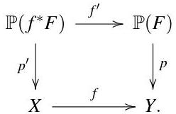
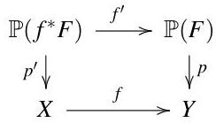
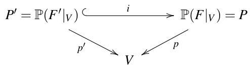
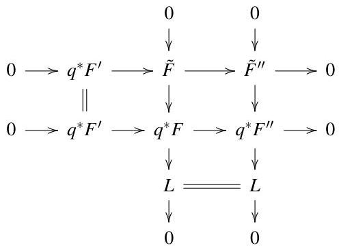

0. Introduction

0. Introduction

In a very rough sketch we explain what algebraic geometry is about and what it can be used for. We stress the many correlations with other fields of research, such as complex analysis, topology, differential geometry, singularity theory, computer algebra, commutative algebra, number theory, enumerative geometry, and even theoretical physics. The goal of this section is just motivational; you will not find definitions or proofs here (and probably not even a mathematically precise statement).

### 0.1. What is algebraic geometry?

To start from something that you probably know, we can say that algebraic geometry is the combination of *linear algebra* and *algebra*:

- In linear algebra, we study systems of linear equations in several variables.
- In algebra, we study (among other things) polynomial equations in one variable.

Algebraic geometry combines these two fields of mathematics by studying systems of polynomial equations in several variables.

Given such a system of polynomial equations, what sort of questions can we ask? Note that we cannot expect in general to write down explicitly all the solutions: we know from algebra that even a single complex polynomial equation of degree $d&gt;4$ in one variable can in general not be solved exactly. So we are more interested in statements about the geometric structure of the set of solutions. For example, in the case of a complex polynomial equation of degree $d$, even if we cannot compute the solutions we know that there are exactly $d$ of them (if we count them with the correct multiplicities). Let us now see what sort of “geometric structure” we can find in polynomial equations in several variables.

###### Example 0.1.1.

Probably the easiest example that is covered neither in linear algebra nor in algebra is that of a single polynomial equation in two variables. Let us consider the following example:

$C_{n}=\{(x,y)\in\mathbb{C}^{2}\ ;\ y^{2}=(x-1)(x-2)\cdots(x-2n)\}\subset\mathbb{C}^{2},$

where $n\geq 1$. Note that in this case it is actually possible to write down all the solutions, because the equation is (almost) solved for $y$ already: we can pick $x$ to be any complex number, and then get two values for $y$ — unless $x\in\{1,\ldots,2n\}$, in which case we only get one value for $y$ (namely $0$).

So it seems that the set of equations looks like two copies of the complex plane with the two copies of each point $1,\ldots,2n$ identified: the complex plane parametrizes the values for $x$, and the two copies of it correspond to the two possible values for $y$, i. e. the two roots of the number $(x-1)\cdots(x-2n)$.

This is not quite true however, because a complex non-zero number does not have a distinguished first and second root that could correspond to the first and second copy of the complex plane. Rather, the two roots of a complex number get exchanged if you run around the origin once: if we consider a path

$x=r\,e^{i\varphi}\qquad\text{for }0\leq\varphi\leq 2\pi\text{ and fixed }r&gt;0$

around the complex origin, the square root of this number would have to be defined by

$\sqrt{x}=\sqrt{r}\,e^{\frac{i\varphi}{2}}$

which gives opposite values at $\varphi=0$ and $\varphi=2\pi$. In other words, if in $C_{n}$ we run around one of the points $1,\ldots,2n$, we go from one copy of the plane to the other. The way to draw this topologically is to cut the two planes along the lines $[1,2],\ldots,[2n-1,2n]$, and to glue the two planes along these lines as in this picture (lines marked with the same letter are to be identified):

---

Andreas Gathmann

To make the picture a little nicer, we can compactify our set by adding two points at infinity, in the same way as we go from  $\mathbb{C}$  to  $\mathbb{C}_{\infty}$  by adding a point  $\infty$ . If we do this here, we end up with a compact surface with  $n - 1$  handles:

Such an object is called a surface of genus  $n - 1$ ; the example above shows a surface of genus 2.

Example 0.1.2. Example 0.1.1 is a little "cheated" because we said before that we want to figure out the geometric structure of equations that we cannot solve explicitly. In the example however, the polynomial equation was chosen so that we could solve it, and in fact we used this solution to construct the geometric picture. Let us see now what we can still do if we make the polynomial more complicated.

What happens if we consider

$$
C _ {n} = \left\{(x, y) \in \mathbb {C} ^ {2}; y ^ {2} = f (x) \right\} \subset \mathbb {C} ^ {2},
$$

with  $f$  some polynomial in  $x$  of degree  $2n$ ? Obviously, as long as the  $2n$  roots of  $f$  are still distinct, the topological picture does not change. But if two of the roots approach each other and finally coincide, this has the effect of shrinking one of the tubes connecting the two planes until it finally reduces to a "singular point" (also called a node), as in the following picture on the left:

---

Obviously, we can view this as a surface with one handle less, where in addition we identify two of the points (as illustrated in the picture on the right). Note that we can still see the “handles” when we draw the surface like this, just that one of the handles results from the glueing of the two points.

###### Example 0.1.3.

You have probably noticed that the polynomial equation of example 0.1.2 could be solved directly too. Let us now consider

$C_{d}=\{(x,y)\in\mathbb{C}^{2}\ ;\ f(x,y)=0\}\subset\mathbb{C}^{2},$

where $f$ is an arbitrary polynomial of degree $d$. This is an equation that we certainly cannot solve directly if $f$ is sufficiently general. Can we still deduce the geometric structure of $C$?

In fact, we can do this with the idea of example 0.1.2. We saw there that the genus of the surface does not change if we perturb the polynomial equation, even if the surface acquires singular points (provided that we know how to compute the genus of such a singular surface). So why not deform the polynomial $f$ to something singular that is easier to analyze? Probably the easiest thing that comes into mind is to degenerate the polynomial $f$ of degree $d$ into a product of $d$ linear equations $\ell_{1},\ldots,\ell_{d}$:

$C_{d}^{\prime}=\{(x,y)\in\mathbb{C}^{2}\ ;\ \ell_{1}(x,y)\cdots\ell_{d}(x,y)=0\}\subset\mathbb{C}^{2},$

This surface should have the same “genus” as the original $C_{d}$.

It is easy to see what $C_{d}^{\prime}$ looks like: of course it is just a union of $d$ lines. Any two of them intersect in a point, and we can certainly choose the lines so that no three of them intersect in a point. The picture below shows $C_{d}^{\prime}$ for $d=3$ (note that every line is — after compactifying — just the complex sphere $C_{\infty}$).

What is the genus of this surface? In the picture above it is obvious that we have one loop; so if $d=3$ we get a surface of genus $1$. What is the general formula? We have $d$ spheres, and every two of them connect in a pair of points, so in total we have $\binom{d}{2}$ connections. But $d-1$ of them are needed to glue the $d$ spheres to a connected chain without loops; only the remaining ones then add a handle each. So the genus of $C_{d}^{\prime}$ (and hence of $C_{d}$) is

$\binom{d}{2}-(d-1)=\binom{d-1}{2}.$

This is commonly called the degree-genus formula for plane curves.

###### Remark 0.1.4.

One of the trivial but common sources for misunderstandings is whether we count dimensions over $\mathbb{C}$ or over $\mathbb{R}$. The examples considered above are real surfaces (the dimension over $\mathbb{R}$ is $2$), but complex curves (the dimension over $\mathbb{C}$ is $1$). We have used the word “surface” as this fitted best to the pictures that we have drawn. When looking at the theory however, it is usually best to call these objects curves. In what follows, we always mean the dimension over $\mathbb{C}$ unless stated otherwise.

###### Remark 0.1.5.

What we should learn from the examples above:

- Algebraic geometry can make statements about the topological structure of objects defined by polynomial equations. It is therefore related to topology and differential geometry (where similar statements are deduced using analytic methods).

---

Andreas Gathmann

- The geometric objects considered in algebraic geometry need not be smooth (i. e. they need not be manifolds). Even if our primary interest is in smooth objects, degenerations to singular objects can greatly simplify a problem (as in example 0.1.3). This is a main point that distinguishes algebraic geometry from other "geometric" theories (e. g. differential or symplectic geometry). Of course, this comes at a price: our theory must be strong enough to include such singular objects and make statements how things vary when we degenerate from smooth to singular objects. In this regard, algebraic geometry is related to singularity theory which studies precisely these questions.

Remark 0.1.6. Maybe it looks a bit restrictive to allow only algebraic (polynomial) equations to describe our geometric objects. But in fact it is a deep theorem that for compact objects, we would not get anything different if we allowed holomorphic equations too. In this respect, algebraic geometry is very much related (and in certain cases identical) to complex (analytic) geometry. The easiest example of this correspondence is that a holomorphic map from the Riemann sphere  $\mathbb{C}_{\infty}$  to itself must in fact be a rational map (i.e. the quotient of two polynomials).

Example 0.1.7. Let us now turn our attention to the next more complicated objects, namely complex surfaces in 3-space. We just want to give one example here. Let  $S$  be the cubic surface

$$
S = \left\{\left(x, y, z\right); 1 + x ^ {3} + y ^ {3} + z ^ {3} - \left(1 + x + y + z\right) ^ {3} = 0 \right\} \subset \mathbb {C} ^ {3}.
$$

As this object has real dimension 4, it is impossible to draw pictures of it that reflect its topological properties correctly. Usually, we overcome this problem by just drawing the real part, i.e. we look for solutions of the equation over the real numbers. This then gives a real surface in  $\mathbb{R}^3$  that we can draw. We should just be careful about which statements we can claim to "see" from this incomplete geometric picture.

The following picture shows the real part of the surface  $S$ :

In contrast to our previous examples, we have now used a linear projection to map the real 3-dimensional space onto the drawing plane.

We see that there are some lines contained in  $S$ . In fact, one can show that every smooth cubic surface has exactly 27 lines on it (see section 4.5 for details). This is another sort of question that one can ask about the solutions of polynomial equations, and that is not of topological nature: do they contain curves with special properties (in this case lines), and if so, how many? This branch of algebraic geometry is usually called enumerative geometry.

Remark 0.1.8. It is probably surprising that algebraic geometry, in particular enumerative geometry, is very much related to theoretical physics. In fact, many results in enumerative geometry have been found by physicists first.

Why are physicists interested e.g. in the number of lines on the cubic surface? We try to give a short answer to this (that is necessarily vague and incomplete): There is a branch of theoretical physics called string theory whose underlying idea is that the elementary

---

particles (electrons, quarks,…) might not be point-like, but rather one-dimensional objects (the so-called strings), that are just so small that their one-dimensional structure cannot be observed directly by any sort of physical measurement. When these particles move in time, they sweep out a surface in space-time. For some reason this surface has a natural complex structure coming from the underlying physical theory.

Now the same idea applies to space-time in general: string theorists believe that space-time is not 4-dimensional as we observe it, but rather has some extra dimensions that are again so small in size that we cannot observe them directly. (Think e. g. of a long tube with a very small diameter — of course this is a two-dimensional object, but if you look at this tube from very far away you cannot see the small diameter any more, and the object looks like a one-dimensional line.) These extra dimensions are parametrized by a space that sometimes has a complex structure too; it might for example be the complex cubic surface that we looked at above.

So in this case we’re in fact looking at complex curves in a complex surface. A priori, these curves can sit in the surface in any way. But there are equations of motion that tell you how these curves will sit in the ambient space, just as in classical mechanics it follows from the equations of motion that a particle will move on a straight line if no forces apply to it. In our case, the equations of motion say that the curve must map holomorphically to the ambient space. As we said in remark 0.1.6 above, this is equivalent to saying that we must have algebraic equations that describe the curve. So we are looking at exactly the same type of questions as we did in example 0.1.7 above.

###### Example 0.1.9.

Let us now have a brief look at curves in 3-dimensional space. Consider the example

$C=\{(x,y,z)=(t^{3},t^{4},t^{5})\;;\;t\in\mathbb{C}\}\subset\mathbb{C}^{3}.$

We have given this curve parametrically, but it is in fact easy to see that we can give it equally well in terms of polynomial equations:

$C=\{(x,y,z)\;;\;x^{3}=yz,\;y^{2}=xz,\;z^{2}=x^{2}y\}.$

What is striking here is that we have three equations, although we would expect that a one-dimensional object in three-dimensional space should be given by two equations. But in fact, if you leave out any of the above three equations, you’re changing the set that it describes: if you leave out e. g. the last equation $z^{2}=x^{2}y$, you would get the whole $z$-axis $\{x=y=0\}$ as additional points that do satisfy the first two equations, but not the last one.

So we see another important difference to linear algebra: it is not true that every object of codimension $d$ can be given by $d$ equations. Even worse, if you are given $d$ equations, it is in general a very difficult task to figure out what dimension their solution has. There do exist algorithms to find this out for any given set of polynomials, but they are so complicated that you will in general want to use a computer program to do that for you. This is a simple example of an application of computer algebra to algebraic geometry.

###### Remark 0.1.10.

Especially the previous example 0.1.9 is already very algebraic in nature: the question that we asked there does not depend at all on the ground field being the complex numbers. In fact, this is a general philosophy: even if algebraic geometry describes geometric objects (when viewed over the complex numbers), most methods do not rely on this, and therefore should be established in purely algebraic terms. For example, the genus of a curve (that we introduced topologically in example 0.1.1) can be defined in purely algebraic terms in such a way that all the statements from complex geometry (e. g. the degree-genus formula of example 0.1.3) extend to this more general setting. Many geometric questions then reduce to pure commutative algebra, which is in some sense the foundation of algebraic geometry.

---

###### Example 0.1.11.

The most famous application of algebraic geometry to ground fields other than the complex numbers is certainly Fermat’s Last Theorem: this is just the statement that the algebraic curve *over the rational numbers*

$C=\{(x,y)\in\mathbb{Q}^{2}\ ;\ x^{n}+y^{n}=1\}\subset\mathbb{Q}^{2}$

contains only the trivial points where $x=0$ or $y=0$. Note that this is very different from the case of the ground field $\mathbb{C}$, where we have seen in example 0.1.3 that $C$ is a curve of genus $\binom{n-1}{2}$. But a lot of the theory of algebraic geometry applies to the rational numbers (and related fields) as well, so if you look at the proof of Fermat’s theorem (which you most probably will not understand) you will notice that it uses e. g. the concepts of algebraic curves and their genus all over the place, although the corresponding point set $C$ contains only some trivial points. So, in some sense, we can view *(algebraic) number theory* as a part of algebraic geometry.

###### Remark 0.1.12.

With this many relations to other fields of mathematics (and physics), it is obvious that we have to restrict our attention in this class to quite a small subset of the possible applications. Although we will develop the general theory of algebraic geometry, our focus will mainly be on geometric questions, neglecting number-theoretic aspects most of the time. So, for example, if we say “let $k$ be an algebraically closed field”, feel free to read this as “let $k$ be the complex numbers” and think about geometry rather than algebra.

Every now and then we will quote results from or give applications to other fields of mathematics. This applies in particular to commutative algebra, which provides some of the basic foundations of algebraic geometry. So unless you want to take commutative algebra as a black box that spits out a useful theorem from time to time (which is possible but not recommended), you should get some background in commutative algebra while learning algebraic geometry. Some knowledge about geometric objects occurring in other fields of mathematics (manifolds, projective spaces, differential forms, vector bundles, …) is helpful but not necessary. We will develop these concepts along the way as we need them.

### 0.2. Exercises

Note: As we have not developed any theory yet, you are not expected to be able to solve the following problems in a mathematically precise way. Rather, they are just meant as some “food for thought” if you want to think a little further about the examples considered in this section.

###### Exercise 0.2.1.

What do we get in example 0.1.1 if we consider the equation

$C^{\prime}_{n}=\{(x,y)\in\mathbb{C}^{2}\ ;\ y^{2}=(x-1)(x-2)\cdots(x-(2n-1))\}\subset\mathbb{C}^{2}$

instead?

###### Exercise 0.2.2.

(For those who know something about projective geometry:) In example 0.1.3, we argued that a polynomial of degree $d$ in two complex variables gives rise to a surface of genus $\binom{d-1}{2}$. In example 0.1.1 however, a polynomial of degree $2n$ gave us a surface of genus $n-1$. Isn’t that a contradiction?

###### Exercise 0.2.3.

1. Show that the space of lines in $\mathbb{C}^{n}$ has dimension $2n-2$. (Hint: use that there is a unique line through any two given points in $\mathbb{C}^{n}$.)
2. Let $S\subset\mathbb{C}^{3}$ be a cubic surface, i. e. the zero locus of a polynomial of degree $3$ in the three coordinates of $\mathbb{C}^{3}$. Find an argument why you would expect there to be finitely many lines in $S$ (i. e. why you would expect the dimension of the space of lines in $S$ to be $0$-dimensional). What would you expect if the equation of $S$ has degree less than or greater than $3$?

---

###### Exercise 0.2.4.

Let $S$ be the specific cubic surface

$S=\{(x,y,z)\;;\;x^{3}+y^{3}+z^{3}=(x+y+z)^{3}\}\subset\mathbb{C}^{3}.$
1. Show that there are exactly 3 lines contained in $S$.
2. Using the description of the space of lines of exercise 0.2.3, try to find an argument why these 3 lines should be counted with multiplicity 9 each (in the same way as e. g. double roots of a polynomial should be counted with multiplicity 2). We can then say that there are 27 lines on $S$, counted with their correct multiplicities.

(Remark: It is actually possible to prove that the number of lines on a cubic surface does not depend on the specific equation of the surface. This then shows, together with this exercise, that every cubic surface has 27 lines on it. You need quite a lot of theoretical background however to make this into a rigorous proof.)

###### Exercise 0.2.5.

Show that if you replace the three equations defining the curve $C$ in example 0.1.9 by

1. $x^{3}=y^{2},x^{5}=z^{2},y^{5}=z^{4}$, or
2. $x^{3}=y^{2},x^{5}=z^{2},y^{5}=z^{3}+\epsilon$ for small but non-zero $\epsilon$,

the resulting set of solutions is in fact 0-dimensional, as you would expect it from three equations in three-dimensional space. So we see that very small changes in the equations can make a very big difference in the result. In other words, we usually cannot apply numerical methods to our problems, as very small rounding errors can change the result completely.

###### Exercise 0.2.6.

Let $X$ be the set of all complex $2\times 3$ matrices of rank at most 1, viewed as a subset of the $\mathbb{C}^{6}$ of all $2\times 3$ matrices. Show that $X$ has dimension 4, but that you need 3 equations to define $X$ in the ambient 6-dimensional space $\mathbb{C}^{6}$.

##