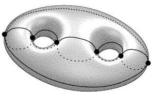
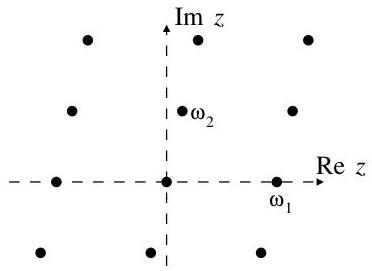
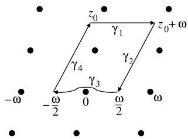
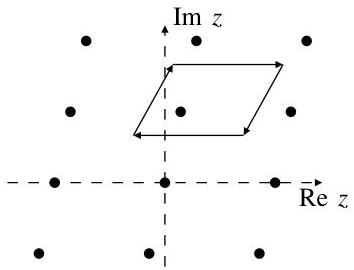

6. First applications of scheme theory

> To every projective subscheme of $\mathbb{P}^{n}_{k}$ we associate the Hilbert function $h_{X}:\mathbb{Z}\to\mathbb{Z},\ d\mapsto\dim_{k}S(X)^{(d)}$. For large $d$ the Hilbert function is a polynomial in $d$ of degree $\dim X$, the so-called Hilbert polynomial $\chi_{X}$.

We define $(\dim X)!$ times the leading coefficient of $\chi_{X}$ to be the degree of $X$; this is always a positive integer. For zero-dimensional schemes the degree is just the number of points in $X$ counted with their scheme-theoretic multiplicities. The degree is additive for unions of equidimensional schemes and multiplicative for intersections with hypersurfaces (Bézout’s theorem).

We give some elementary applications of Bézout’s theorem for plane curves. Among others, we give upper bounds for the numbers of singularities of a plane curve and the numbers of loops of a real plane curve.

A divisor on a curve $C$ is just a formal linear combination of points on $C$ with integer coefficients. To every polynomial or rational function on $C$ we can associate a divisor, namely the divisor of “zeros minus poles” of the polynomial or function. The group of all divisors modulo the subgroup of divisors of rational functions is called the Picard group $\operatorname{Pic}C$ of $C$.

We show that the degree-0 part of $\operatorname{Pic}C$ is trivial for $C=\mathbb{P}^{1}$, whereas it is bijective to $C$ itself if $C$ is a smooth plane cubic curve. This defines a group structure on such cubic curves that can also be interpreted geometrically. In complex analysis, plane cubic curves appear as complex tori of the form $\mathbb{C}/\Lambda$, where $\Lambda$ is a rank-2 lattice in $\mathbb{C}$.

Finally, we give a short outlook to the important parts of algebraic geometry that have not been covered yet in this class.

### 6.1. Hilbert polynomials

In this section we will restrict our attention to projective subschemes of $\mathbb{P}^{n}$ over some fixed algebraically closed field. Let us start by defining some numerical invariants associated to a projective subscheme of $\mathbb{P}^{n}$.

###### Definition 6.1.1.

Let $X$ be a projective subscheme of $\mathbb{P}^{n}_{k}$. Note that the homogeneous coordinate ring $S(X)$ is a graded ring, and that each graded part $S(X)^{(d)}$ is a finite-dimensional vector space over $k$. We define the Hilbert function of $X$ to be the function

$h_{X}:\mathbb{Z}\to\mathbb{Z}$
$d\mapsto h_{X}(d):=\dim_{k}S(X)^{(d)}.$

(Note that we trivially have $h_{X}(d)=0$ for $d<0$ and $h_{X}(d)\geq 0$ for $d\geq 0$, so we will often consider $h_{X}$ as a function $h_{X}:\mathbb{N}\to\mathbb{N}$.)

###### Example 6.1.2.

Let $X=\mathbb{P}^{n}$ be projective space itself. Then $S(X)=k[x_{0},\ldots,x_{n}]$, so the Hilbert function $h_{X}(d)=\binom{d+n}{n}$ is just the number of degree-$d$ monomials in $n+1$ variables $x_{0},\ldots,x_{n}$. In particular, note that $h_{X}(d)=\frac{(d+n)(d+n-1)\cdots(d+1)}{n!}$ is a polynomial in $d$ of degree $n$ with leading coefficient $\frac{1}{n!}$ (compare this to proposition 6.1.5).

###### Example 6.1.3.

Let us now consider some examples of zero-dimensional schemes.

1. Let $X=\{(1:0),(0:1)\}\subset\mathbb{P}^{1}$ be two points in $\mathbb{P}^{1}$. Then $I(X)=(x_{0}x_{1})$. So a basis of $S(X)^{(d)}$ is given by $\{1\}$ for $d=0$, and $\{x_{0}^{d},x_{1}^{d}\}$ for $d>0$. We conclude that

\[ h_{X}(d)=\begin{cases}1&\text{for }d=0,\\
2&\text{for }d>0.\end{cases} \]
2. Let $X=\{(1:0:0),(0:1:0),(0:0:1)\}\subset\mathbb{P}^{2}$ be three points in $\mathbb{P}^{2}$ that are not on a line. Then $I(X)=(x_{0}x_{1},x_{0}x_{2},x_{1}x_{2})$. So in the same way as in (i), a basis of

---

6. First applications of scheme theory

$S(X)^{(d)}$ is given by $\{1\}$ for $d = 0$ and $\{x_0^d,x_1^d,x_2^d\}$ for $d &gt; 0$. Therefore

$$
h _ {X} (d) = \left\{ \begin{array}{l l} 1 &amp; \text { for } d = 0, \\ 3 &amp; \text { for } d &gt; 0. \end{array} \right.
$$

(iii) Let $X = \{(1:0), (0:1), (1:1)\} \subset \mathbb{P}^1$ be three collinear points. Then $I(X) = (x_0 x_1 (x_0 - x_1))$. The relation $x_0^2 x_1 = x_0 x_1^2$ allows us to reduce the number of $x_0$ in a monomial $x_0^i x_1^j$ provided that $i \geq 2$ and $j \geq 1$. So a basis of $S(X)^{(d)}$ is given by $\{1\}$ for $d = 0$, $\{x_0, x_1\}$ for $d = 1$, and $\{x_0^d, x_0 x_1^{d-1}, x_1^d\}$ for $d &gt; 1$. Hence

$$
h _ {X} (d) = \left\{ \begin{array}{l l} 1 &amp; \text { for } d = 0, \\ 2 &amp; \text { for } d = 1, \\ 3 &amp; \text { for } d &gt; 1. \end{array} \right.
$$

It is easy to see that we get the same result for three collinear points in $\mathbb{P}^2$. So comparing this with (ii) we conclude that the Hilbert function does not only depend on the scheme $X$ up to isomorphism, but also on the way the scheme is embedded into projective space.

(iv) Let $X \subset \mathbb{P}^1$ be the "double point" given by the ideal $I(X) = (x_0^2)$. A basis of $S(X)^{(d)}$ is given by $\{1\}$ for $d = 0$ and $\{x_0 x_1^{d-1}, x_1^d\}$ for $d &gt; 0$, so it follows that

$$
h _ {X} (d) = \left\{ \begin{array}{l l} 1 &amp; \text { for } d = 0, \\ 2 &amp; \text { for } d &gt; 0. \end{array} \right.
$$

just as in (i). So the double point "behaves like two separate points" for the Hilbert function.

So we see that in these examples the Hilbert function becomes constant for $d$ large enough, whereas its initial values for small $d$ may be different. We will now show that this is what happens in general for zero-dimensional schemes:

**Lemma 6.1.4.** Let $X$ be a zero-dimensional projective subscheme of $\mathbb{P}^n$. Then

(i) $X$ is affine, so equal to $\operatorname{Spec} R$ for some $k$-algebra $R$.

(ii) This $k$-algebra $R$ is a finite-dimensional vector space over $k$. Its dimension is called the **length** of $X$ and can be interpreted as the number of points in $X$ (counted with their scheme-theoretic multiplicities).

(iii) $h_X(d) = \dim_k R$ for $d \gg 0$. In particular, $h_X(d)$ is constant for large values of $d$.

**Proof.** (i): As $X$ is zero-dimensional, we can find a hyperplane that does not intersect $X$. Then $X = X \setminus H$ is affine by proposition 5.5.4 (ii).

(ii): First we may assume that $X$ is irreducible, i.e. consists of only one point (but may have a non-trivial scheme structure), since in the reducible case $X = X_{1} \sqcup \dots \sqcup X_{m}$ with $X_{i} = \operatorname{Spec} R_{i}$ for $i = 1, \ldots, m$ we have $R = R_{1} \times \dots \times R_{m}$ by exercise 5.6.14. Moreover, by a change of coordinates we can assume that this point is the origin in $\mathbb{A}^n$. If $X = \operatorname{Spec} k[x_{1}, \ldots, x_{n}] / I$ we then must have $(x_{1}, \ldots, x_{n}) = \sqrt{I}$ by the Nullstellensatz. It follows that $x_{i}^{d} \in I$ for some $d$ and all $i$. Consequently, every monomial of degree at least $D := d \cdot n$ lies in $I$ (as it must contain at least one $x_{i}$ with a power of at least $d$). In other words, $k[x_{1}, \ldots, x_{n}] / I$ has a basis (as a vector space over $k$) of polynomials of degree less than $D$. But the space of such polynomials is finite-dimensional.

(iii): Note that $I(X)$ is simply the homogenization of $I$. Conversely, $I$ is equal to $I(X)|_{x_0 = 1}$. So for $d \geq D$ an isomorphism $S^{(d)} \to R$ as vector spaces over $k$ is given by

$$
\left(k \left[ x _ {0}, \dots , x _ {n} \right] / I (X)\right) ^ {(d)} \rightarrow k \left[ x _ {1}, \dots , x _ {n} \right] / I, \quad f \mapsto f | _ {x _ {0} = 1}
$$

---

and the inverse

$k[x_{1},\ldots,x_{n}]/I\mapsto(k[x_{0},\ldots,x_{n}]/I(X))^{(d)},\quad f\mapsto f^{\hbar}\cdot x_{0}^{d-\deg f}$

where $f^{\hbar}$ denotes the homogenization of a polynomial as in exercise 3.5.3 (note that the second map is well-defined as $k[x_{1},\ldots,x_{n}]/I$ has a basis of polynomials of degree less than $D$). ∎

We will now discuss the Hilbert function of arbitrary projective subschemes of $\mathbb{P}^{n}$ (that are not necessarily zero-dimensional).

###### Proposition 6.1.5.

Let $X$ be a (non-empty) $m$-dimensional projective subscheme of $\mathbb{P}^{n}$. Then there is a (unique) polynomial $\chi_{X}\in\mathbb{Z}[d]$ such that $h_{X}(d)=\chi_{X}(d)$ for $d\gg 0$. Moreover,

1. The degree of $\chi_{X}$ is $m$.
2. The leading coefficient of $\chi_{X}$ is $\frac{1}{m!}$ times a positive integer.

###### Remark 6.1.6.

As the Hilbert polynomial is defined in terms of the Hilbert function for large $d$, it suffices to look at the graded parts of $I(X)$ (or $S(X)$) for $d\gg 0$. So by lemma 5.5.9 (iv) we do not necessarily need to take the saturated ideal of $X$ for the computation of the Hilbert polynomial. We have as well that

$\chi_{X}(d)=\dim_{k}(k[x_{0},\ldots,x_{n}]/I)^{(d)}\quad\text{for }d\gg 0$

for any homogeneous ideal $I$ such that $X=\operatorname{Proj}k[x_{0},\ldots,x_{n}]/I$.

###### Proof.

We will prove the proposition by induction on the dimension $m$ of $X$. The case $m=0$ follows from lemma 6.1.4, so let us assume that $m>0$. By a linear change of coordinates we can assume that no component of $X$ lies in the hyperplane $H=\{x_{0}=0\}$. Then there is an exact sequence of graded vector spaces over $k$

$0\longrightarrow k[x_{0},\ldots,x_{n}]/I(X)\xrightarrow{\cdot x_{0}}k[x_{0},\ldots,x_{n}]/I(X)\longrightarrow k[x_{0},\ldots,x_{n}]/(I(X)+(x_{0}))\longrightarrow 0.$

(if the first map was not injective, there would be a homogeneous polynomial $f$ such that $f\notin I(X)$ but $fx_{0}\in I(X)$. We would then have $X=(X\cap Z(f))\cup(X\cap H)$. But as no irreducible component lies in $H$ by assumption, we must have $X=X\cap Z(f)$, in contradiction to $f\notin I(X)$). Taking the $d$-th graded part of this sequence (and using remark 6.1.6 for the ideal $I(X)+(x_{0})$), we get

$h_{X\cap H}(d)=h_{X}(d)-h_{X}(d-1).$

for large $d$. By the induction assumption, $h_{X\cap H}(d)$ is a polynomial of degree $m-1$ for large $d$ whose leading coefficient is $\frac{1}{(m-1)!}$ times a positive integer. We can therefore write

$h_{X\cap H}(d)=\sum_{i=0}^{m-1}c_{i}\binom{d}{i}\qquad\text{for }d\gg 0$

for some constants $c_{i}$, where $c_{m-1}$ is a positive integer (note that $\binom{d}{i}$ is a polynomial of degree $i$ in $d$ with leading coefficient $\frac{1}{i!}$). We claim that

$h_{X}(d)=c+\sum_{i=0}^{m-1}c_{i}\binom{d+1}{i+1}\qquad\text{for }d\gg 0$

---

6. First applications of scheme theory

for some $c \in \mathbb{Z}$. In fact, this follows by induction on $d$, as

$$
\begin{aligned}
h_X(d) &amp;= h_{X \cap H}(d) + h_X(d - 1) \\
&amp;= \sum_{i=0}^{m-1} c_i \binom{d}{i} + c + \sum_{i=0}^{m-1} c_i \binom{d}{i+1} \\
&amp;= c + \sum_{i=0}^{m-1} c_i \binom{d+1}{i+1}.
\end{aligned}
$$

The statement of proposition 6.1.5 motivates the following definition:

**Definition 6.1.7.** Let $X$ be a projective subscheme of $\mathbb{P}^n$. The degree $\deg X$ of $X$ is defined to be $(\dim X)!$ times the leading coefficient of the Hilbert polynomial $\chi_X$. (By proposition 6.1.5, this is a positive integer.)

**Example 6.1.8.**

(i) If $X$ is a zero-dimensional scheme then $\deg X$ is equal to the length of $X$, i.e. to "the number of points in $X$ counted with their scheme-theoretic multiplicities".

(ii) $\deg \mathbb{P}^n = 1$ by example 6.1.2.

(iii) Let $X = \operatorname{Proj} k[x_0, \ldots, x_n] / (f)$ be the zero locus of a homogeneous polynomial. We claim that $\deg X = \deg f$. In fact, taking the $d$-th graded part of $S(X) = k[x_0, \ldots, x_n] / f \cdot k[x_0, \ldots, x_n]$ we get

$$
\begin{aligned}
h_X(d) &amp;= \dim_k k[x_0, \ldots, x_n]^{(d)} - \dim_k k[x_0, \ldots, x_n]^{(d - \deg f)} \\
&amp;= \binom{d + n}{n} - \binom{d - \deg f + n}{n} \\
&amp;= \frac{1}{n!} \left((d + n) \cdots (d + 1) - (d - \deg f + n) \cdots (d - \deg f + 1)\right) \\
&amp;= \frac{\deg f}{(n - 1)!} d^{n-1} + \text{lower order terms}.
\end{aligned}
$$

**Proposition 6.1.9.** Let $X_1$ and $X_2$ be $m$-dimensional projective subschemes of $\mathbb{P}^n$, and assume that $\dim(X_1 \cap X_2) &lt; m$. Then $\deg(X_1 \cup X_2) = \deg X_1 + \deg X_2$.

**Proof.** For simplicity of notation let us set $S = k[x_0, \ldots, x_n]$. Note that

$$
X_1 \cap X_2 = \operatorname{Proj} S / (I(X_1) + I(X_2)) \quad \text{and} \quad X_1 \cup X_2 = \operatorname{Proj} S / (I(X_1) \cap I(X_2)).
$$

So from the exact sequence

$$
\begin{aligned}
0 \quad \rightarrow \quad S / (I(X_1) \cap I(X_2)) &amp; \quad \rightarrow \quad S / I(X_1) \oplus S / I(X_2) \quad \rightarrow \quad S / (I(X_1) + I(X_2)) \quad \rightarrow \quad 0 \\
f &amp; \quad \mapsto \quad (f, f) \\
(f, g) &amp; \quad \mapsto \quad f - g
\end{aligned}
$$

we conclude that

$$
h_{X_1}(d) + h_{X_2}(d) = h_{X_1 \cup X_2}(d) + h_{X_1 \cap X_2}(d)
$$

for large $d$. In particular, the same equation follows for the Hilbert polynomials. Comparing only the leading (i.e. $d^m$) coefficient we then get the desired result, since the degree of $\chi_{X_1 \cap X_2}$ is less than $m$ by assumption.

**Example 6.1.10.** Let $X$ be a projective subscheme of $\mathbb{P}^n$. We call

$$
g(X) := (-1)^{\dim X} \cdot (\chi_X(0) - 1)
$$

the (arithmetic) genus of $X$. The importance of this number comes from the following two facts (that we unfortunately cannot prove yet with our current techniques):

---

1. The genus of $X$ is independent of the projective embedding, i. e. if $X$ and $Y$ are isomorphic projective subschemes then $g(X)=g(Y)$. See section 6.6.3 and exercise 10.6.8 for more details.
2. If $X$ is a smooth curve over $\mathbb{C}$, then $g(X)$ is precisely the “topological genus” introduced in example 0.1.1. (Compare for example the degree-genus formula of example 0.1.3 with exercise 6.7.3 (ii).)

###### Remark 6.1.11.

In general, the explicit computation of the Hilbert polynomial $h_{X}$ of a projective subscheme $X=\operatorname{Proj}k[x_{0},\ldots,x_{n}]/I$ from the ideal $I$ is quite complicated and requires methods of computer algebra.

### 6.2. Bézout’s theorem

We will now prove the main property of the degree of a projective variety: that it is “multiplicative when taking intersections”. We will prove this here only for intersections with hypersurfaces, but there is a more general version about intersections in arbitrary codimension (see e. g. cite Ha theorem 18.4).

###### Theorem 6.2.1.

(Bézout’s theorem) Let $X$ be a projective subscheme of $\mathbb{P}^{n}$ of positive dimension, and let $f\in k[x_{0},\ldots,x_{n}]$ be a homogeneous polynomial such that no component of $X$ is contained in $Z(f)$. Then

$\deg(X\cap Z(f))=\deg X\cdot\deg f.$

###### Proof.

The proof is very similar to that of the existence of the Hilbert polynomial in proposition 6.1.5. Again we get an exact sequence

$0\longrightarrow k[x_{0},\ldots,x_{n}]/I(X)\stackrel{{\scriptstyle\cdot f}}{{\longrightarrow}}k[x_{0},\ldots,x_{n}]/I(X)\longrightarrow k[x_{0},\ldots,x_{n}]/(I(X)+(f))\longrightarrow 0$

from which it follows that

$\chi_{X\cap Z(f)}=\chi_{X}(d)-\chi_{X}(d-\deg f).$

But we know that

$\chi_{X}(d)=\frac{\deg X}{m!}\,d^{m}+c_{m-1}d^{m-1}+\text{terms of order at most }d^{m-2},$

where $m=\dim X$. Therefore it follows that

$\chi_{X\cap Z(f)}$ $=\frac{\deg X}{m!}\,(d^{m}-(d-\deg f)^{m})+c_{m-1}\,(d^{m-1}-(d-\deg f)^{m-1})$
$\qquad\qquad\qquad\qquad+\text{terms of order at most }d^{m-2}$
$=\frac{\deg X}{m!}\cdot m\,\deg f\cdot d^{m-1}+\text{terms of order at most }d^{m-2}.$

We conclude that $\deg(X\cap Z(f))=\deg X\cdot\deg f$. ∎

###### Example 6.2.2.

Let $C_{1}$ and $C_{2}$ be two curves in $\mathbb{P}^{2}$ without common irreducible components. These curves are then given as the zero locus of homogeneous polynomials of degrees $d_{1}$ and $d_{2}$, respectively. We conclude that $\deg(C_{1}\cap C_{2})=d_{1}\cdot d_{2}$ by Bézout’s theorem. By example 6.1.8 (i) this means that $C_{1}$ and $C_{2}$ intersect in exactly $d_{1}\cdot d_{2}$ points, if we count these points with their scheme-theoretic multiplicities in the intersection scheme $C_{1}\cap C_{2}$. In particular, as these multiplicities are always positive integers, it follows that $C_{1}$ and $C_{2}$ intersect set-theoretically in *at most* $d_{1}\cdot d_{2}$ points, and in *at least* one point. This special case of theorem 6.2.1 is also often called Bézout’s theorem in textbooks.

###### Example 6.2.3.

In the previous example, the scheme-theoretic multiplicity of a point in the intersection scheme $C_{1}\cap C_{2}$ is often easy to read off from geometry: let $P\in C_{1}\cap C_{2}$ be a point. Then:

1. If $C_{1}$ and $C_{2}$ are smooth at $P$ and have different tangent lines at $P$ then $P$ counts with multiplicity 1 (we say: the intersection multiplicity of $C_{1}$ and $C_{2}$ at $P$ is 1).
2. If $C_{2}$

---

6. First applications of scheme theory

(ii) If  $C_1$  and  $C_2$  are smooth at  $P$  and are tangent to each other at  $P$  then the intersection multiplicity at  $P$  is at least 2.
(iii) If  $C_1$  is singular and  $C_2$  is smooth at  $P$  then the intersection multiplicity at  $P$  is at least 2.
(iv) If  $C_1$  and  $C_2$  are singular at  $P$  then the intersection multiplicity at  $P$  is at least 3.

The key to proving these statements is the following. As the computation is local around  $P$  we can assume that the curves are affine in  $\mathbb{A}^2$ , that  $P = (0,0)$  is the origin, and that the two curves are given as the zero locus of one equation

$C_1 = \{f_1 = 0\}$  where  $f_{1} = a_{1}x + b_{1}y +$  higher order terms,

$C_2 = \{f_2 = 0\}$  where  $f_{2} = a_{2}x + b_{2}y +$  higher order terms.

If both curves are singular at the origin, their tangent space at  $P$  must be two-dimensional, i.e. all of  $\mathbb{A}^2$ . This means that  $a_1 = b_1 = a_2 = b_2 = 0$ . It follows that  $1, x,$  and  $y$  are three linearly independent elements in  $k[x,y] / (f_1,f_2)$  (whose spectrum is by definition the intersection scheme). So the intersection multiplicity is at least 3. In the same way, we get at least 2 linearly independent elements (the constant 1 and one linear function) if only one of the curves is singular, or both curves have the same tangent line (i.e. the linear parts of their equations are linearly dependent).

Example 6.2.4. Consider again the twisted cubic curve in  $\mathbb{P}^3$

$$
\begin{array}{l} C = \left\{\left(s ^ {3}: s ^ {2} t: s t ^ {2}: t ^ {3}\right); (s: t) \in \mathbb {P} ^ {1} \right\} \\ = \left\{\left(x _ {0}: x _ {1}: x _ {2}: x _ {3}\right); x _ {1} ^ {2} - x _ {0} x _ {2} = x _ {2} ^ {2} - x _ {1} x _ {3} = x _ {0} x _ {3} - x _ {1} x _ {2} = 0 \right\}. \\ \end{array}
$$

We have met this variety as the easiest example of a curve in  $\mathbb{P}^3$  that cannot be written as the zero locus of two polynomials. We are now able to prove this statement very easily using Bézout's theorem: assume that  $I(C) = (f, g)$  for some homogeneous polynomials  $f$  and  $g$ . As the degree of  $C$  is 3 by exercise 6.7.2, it follows that  $\deg f \cdot \deg g = 3$ . This is only possible if  $\deg f = 3$  and  $\deg g = 1$  (or vice versa), i.e. one of the polynomials has to be linear. But  $C$  is not contained in a linear space (its ideal does not contain linear functions).

In particular we see that  $C$  cannot be the intersection of two of the quadratic polynomials given above, as this intersection must have degree 4. In fact,

$$
Z \left(x _ {1} ^ {2} - x _ {0} x _ {2}, x _ {2} ^ {2} - x _ {1} x _ {3}\right) = C \cup \left\{x _ {1} = x _ {2} = 0 \right\}
$$

in accordance with Bézout's theorem and proposition 6.1.9 (note that  $\{x_{1} = x_{2} = 0\}$  is a line and thus has degree 1).

Let us now prove some corollaries of Bézout's theorem.

Corollary 6.2.5. (Pascal's theorem) Let  $X \subset \mathbb{P}^2$  be a conic (i.e. the zero locus of a homogeneous polynomial  $f$  of degree 2). Pick six points  $A, B, C, D, E, F$  on  $X$  that form the vertices of a hexagon inscribed in  $X$ . Then the three intersection points of the opposite edges of the hexagon (i.e.  $P = \overline{AB} \cap \overline{DE}$ ,  $Q = \overline{BC} \cap \overline{EF}$ , and  $R = \overline{CD} \cap \overline{FA}$ ) lie on a line.

---

###### Proof.

Consider the two reducible cubics $X_{1}=\overline{AB}\cup\overline{CD}\cup\overline{EF}$ and $X_{2}=\overline{BC}\cup\overline{DE}\cup\overline{FA}$, and let $f_{1}=0$ and $f_{2}=0$ be the equations of $X_{1}$ and $X_{2}$, respectively. In accordance with Bézout’s theorem, $X_{1}$ and $X_{2}$ meet in the 9 points $A,B,C,D,E,F,P,Q,R$.

Now pick any point $S\in X$ not equal to the previously chosen ones. Of course there are $\lambda,\mu\in k$ such that $\lambda f_{1}+\mu f_{2}$ vanishes at $S$. Set $X^{\prime}=Z(\lambda f_{1}+\mu f_{2})$; this is a cubic curve too.

Note that $X^{\prime}$ meets $X$ in the 7 points $A,B,C,D,E,F,S$, although $\deg X^{\prime}\cdot\deg X=6$. We conclude by Bézout’s theorem that $X^{\prime}$ and $X$ have a common component. For degree reasons the only possibility for this is that the cubic $X^{\prime}$ is reducible and contains the conic $X$ as a factor. Therefore $X^{\prime}=X\cup L$, where $L$ is a line.

Finally note that $P,Q,R$ lie on $X^{\prime}$ as they lie on $X_{1}$ and $X_{2}$. Therefore $P,Q,R\in X\cup L$. But these points are not on $X$, so they must be on the line $L$. ∎

###### Corollary 6.2.6.

Let $C\subset\mathbb{P}^{2}$ be an irreducible curve of degree $d$. Then $C$ has at most $\binom{d-1}{2}$ singular points.

###### Remark 6.2.7.

For $d=1$ $C$ must be a line, so there is no singular point. A conic is either irreducible (and smooth) or a union of two lines, so for $d=2$ the statement is obvious too. For $d=3$ the corollary states that there is at most one singular point on an irreducible curve. In fact, the projectivization of the singular cubic affine curve $y^{2}=x^{2}+x^{3}$ is such an example with one singular point (namely the origin).

###### Proof.

Assume the contrary and let $P_{1},\ldots,P_{\binom{d-1}{2}+1}$ be distinct singular points of $C$. Moreover, pick arbitrary further distinct points $Q_{1},\ldots,Q_{d-3}$ on $C$ (we can assume $d\geq 3$ by remark 6.2.7). We thus have a total of $\binom{d-1}{2}+1+d-3=\frac{d^{2}}{2}-\frac{d}{2}-1$ points $P_{i}$ and $Q_{j}$.

We claim that there is a curve $C^{\prime}$ of degree $d-2$ that passes through all $P_{i}$ and $Q_{j}$. In fact, the space of all homogeneous degree-$(d-2)$ polynomials in three variables is a $\binom{d}{2}$-dimensional vector space over $k$, so the space of hypersurfaces of degree $d-2$ is a projective space $\mathbb{P}^{N}$ of dimension $N=\binom{d}{2}-1$, with the coefficients of the equation as the homogeneous coordinates. Now the condition that such a hypersurface passes through a given point is obviously a linear condition in this $\mathbb{P}^{N}$. As $N$ hyperplanes in $\mathbb{P}^{N}$ always have a non-empty intersection, it follows that there is a hypersurface passing through any $N$ given points. But $N=\binom{d}{2}-1=\frac{d^{2}}{2}-\frac{d}{2}-1$ is precisely the number of points we have. (Compare this argument to exercise 3.5.8 and the parametrization of cubic surfaces at the beginning of section 4.5.)

Now compute the degree of the intersection scheme $C\cap C^{\prime}$. By Bézout’s theorem, it must be $\deg C\cdot\deg C^{\prime}=d(d-2)$. Counting the intersection points, we see that we have the $d-3$ points $Q_{i}$, and the $\binom{d-1}{2}+1$ points $P_{j}$ *that count with multiplicity at least 2 as they are singular points of $C$* (see example 6.2.3). So we get

$\deg(C\cap C^{\prime})\geq(d-3)+2\left(\binom{d-1}{2}+1\right)=d^{2}-2d+1>\deg C\cdot\deg C^{\prime}.$

By Bézout’s theorem it follows that $C$ and $C^{\prime}$ must have a common component. But $C$ is irreducible of degree $\deg C>\deg C^{\prime}$, so this is impossible. We thus arrive at a contradiction and conclude that the assumption of the existence of $\binom{d-1}{2}+1$ singular points was false. ∎

The following statement about *real* plane curves looks quite different from corollary 6.2.6, yet the proof is largely identical. Note that every smooth real plane curve consists of a certain number of connected components (in the classical topology); here are examples with one real component (the left two curves) and with two real components (the right curve):

---

6. First applications of scheme theory

We want to know the maximum number of such components that a real smooth curve of degree  $d$  can have. One way of constructing curves with many components is to start with a singular curve, and then to deform the equation a little bit to obtain a smooth curve. The following example starts with a reducible quartic curve and deforms it into a smooth curve with two and four components, respectively.

As in the complex case, it is more convenient to pass to the projective plane  $\mathbb{P}_{\mathbb{R}}^{2}$  instead of  $\mathbb{A}_{\mathbb{R}}^{2}$ . This will add points at infinity of the curves so that every component becomes a loop (i.e. it has no ends). For example, in the two cubic curves above one point each is added to the curves, so that the components extending to infinity become a loop. We are therefore asking for the maximum number of loops that a projective smooth real plane curve of degree  $d$  can have.

There is an extra topological twist in  $\mathbb{P}_{\mathbb{R}}^{2}$  that we have not encountered before. As usual, we construct  $\mathbb{P}_{\mathbb{R}}^{2}$  by taking  $\mathbb{A}_{\mathbb{R}}^{2}$  (which we will draw topologically as an open disc here) and adding a point at infinity for every direction in  $\mathbb{A}_{\mathbb{R}}^{2}$ . This has the effect of adding a boundary to the disc (with the boundary point corresponding to the point at infinity). But note that opposite points of the boundary of the disc belong to the same direction in  $\mathbb{A}_{\mathbb{R}}^{2}$  and hence are the same point in  $\mathbb{P}_{\mathbb{R}}^{2}$ . In other words,  $\mathbb{P}_{\mathbb{R}}^{2}$  is topologically equivalent to a closed disc with opposite boundary points identified:

It is easy to see that this is a non-orientable surface: if we start with a small circle and move it across the boundary of the disc (i.e. across the infinity locus of  $\mathbb{P}_{\mathbb{R}}^2$  then it comes out with opposite orientation:

---

Andreas Gathmann

Consequently, we have two different types of loops. A "type 1 loop" is a loop such that its complement has only one component (which is topologically a disc). A "type 2 loop" is a loop such that its complement has two components (an "interior" and "exterior" of the loop). It is interesting to note that of these two components one is a disc, and the other is a Möbius strip.

Type 1 loop

Type 2 loop

(Those of you who know some algebraic topology will note that the homology group  $H_{1}(\mathbb{P}_{\mathbb{R}}^{2})$  is isomorphic to  $\mathbb{Z}/2\mathbb{Z}$ ; so the two types of curves correspond to the two elements of  $\mathbb{Z}/2\mathbb{Z}$ .)

With these prerequisites at hand, we can now prove the following statement (modulo some topology statements that should be intuitively clear):

Corollary 6.2.8. (Harnack's theorem) A real smooth curve in  $\mathbb{P}_{\mathbb{R}}^2$  of degree  $d$  has at most  $\binom{d-1}{2} + 1$  loops.

Remark 6.2.9. A line  $(d = 1)$  has always exactly one loop. A non-empty conic  $(d = 2)$  is a hyperbola, parabola, or ellipse, so in every case the number of loops is 1. For  $d = 3$  the corollary gives a maximum number of 2 loops, and for  $d = 4$  we get at most 4 loops. We have just seen examples of these numbers of loops above. One can show that the bound given in Harnack's theorem is indeed sharp, i.e. for every  $d$  one can find smooth real curves of degree  $d$  with exactly  $\binom{d-1}{2} + 1$  loops.

Proof. Assume that the statement is false, so that there are  $\binom{d-1}{2} + 2$  loops in a smooth real plane curve  $C$ . Note that any two type 1 loops must intersect (which is impossible for a smooth curve), so there can be at most one type 1 loop. Hence assume that the first  $\binom{d-1}{2} + 1$  loops are of type 2, and pick one point  $P_1, \ldots, P_{\binom{d-1}{2} + 1}$  on each of them. By remark 6.2.9 we can assume that  $d \geq 3$ , so pick  $d - 3$  further distinct points  $Q_1, \ldots, Q_{d-3}$  on the last loop (which can be of any type). We thus have a total of  $\binom{d-1}{2} + 1 + d - 3 = \frac{d^2}{2} - \frac{d}{2} - 1$  points  $P_i$  and  $Q_j$ .

As in the proof of corollary 6.2.6 there is a curve  $C'$  of degree  $d - 2$  that passes through all  $P_i$  and  $Q_j$ . Compute the degree of the intersection scheme  $C \cap C'$ . By Bézout's theorem, it must be  $\deg C \cdot \deg C' = d(d - 2)$ . Counting the intersection points, we see that we have the  $d - 3$  points  $Q_i$ , and the  $\binom{d-1}{2} + 1$  points  $P_j$  that count with multiplicity at least 2 as every type 2 loop divides the real projective plane in an interior and exterior region; so if  $C'$  enters the interior of a type 2 loop it must exit it again somewhere. (It may also be that  $C'$  is tangent to the loop or singular at the intersection point, but in this case the intersection multiplicity must be at least 2 too.)

---

So we get

$\deg(C\cap C^{\prime})\geq(d-3)+2\left(\binom{d-1}{2}+1\right)=d^{2}-2d+1>\deg C\cdot\deg C^{\prime}.$

By Bézout’s theorem it follows that $C$ and $C^{\prime}$ must have a common component. But $C$ is irreducible of degree $\deg C>\deg C^{\prime}$, so this is impossible. We thus arrive at a contradiction and conclude that the assumption of the existence of $\binom{d-1}{2}+2$ loops was false. ∎

###### Corollary 6.2.10.

Every isomorphism $f:\mathbb{P}^{n}\to\mathbb{P}^{n}$ is linear, i. e. it is of the form $f(x)=A\cdot x$, where $x=(x_{0},\ldots,x_{n})$ and $A$ is an invertible $(n+1)\times(n+1)$ matrix with elements in the ground field.

###### Proof.

Let $H\subset\mathbb{P}^{n}$ be a hyperplane, and let $L\subset\mathbb{P}^{n}$ be a line not contained in $H$. Of course, $H\cap L$ is scheme-theoretically just one reduced point. As $f$ is an isomorphism, $f(H)\cap f(L)$ must also be scheme-theoretically one reduced point, i. e. $\deg(f(H)\cap f(L))=1$. As degrees are always positive integers, it follows by Bézout’s theorem that $\deg f(H)=\deg f(L)=1$. In particular, $f$ maps hyperplanes to hyperplanes. Applying this to all hyperplanes $\{x_{i}=0\}$ in turn, we conclude that $f$ maps all coordinate functions $x_{i}$ to linear functions, so $f(x)=A\cdot x$ for some scalar matrix $A$. Of course $A$ must be invertible if $f$ has an inverse. ∎

### 6.3. Divisors on curves

Bézout’s theorem counts the number of intersection points of a projective curve with a hypersurface. For example, if $C\subset\mathbb{P}^{2}$ is a plane cubic then the intersection of $C$ with any line consists of $3$ points (counted with their scheme-theoretic multiplicities). But of course not every collection of three points on $C$ can arise this way, as three points will in general not lie on a line. So by reducing the intersections of curves to just the number of intersection points we are losing information about the possible configurations of intersection schemes. In contrast, we will now present a theory that is able to keep track of the configurations of (intersection) points on curves.

###### Definition 6.3.1.

Let $C\subset\mathbb{P}^{n}$ be a smooth irreducible projective curve. A divisor on $C$ is a formal finite linear combination $D=a_{1}P_{1}+\cdots+a_{m}P_{m}$ of points $P_{i}\in C$ with integer coefficients $a_{i}$. Obviously, divisors can be added and subtracted. The group of divisors on $C$ is denoted $\operatorname{Div}C$.

Equivalently, $\operatorname{Div}C$ is the free abelian group generated by the points of $C$.

The degree $\deg D$ of a divisor $D=a_{1}P_{1}+\cdots+a_{m}P_{m}$ is defined to be the integer $a_{1}+\cdots+a_{m}$. Obviously, the degree function is a group homomorphism $\deg:\operatorname{Div}C\to\mathbb{Z}$.

###### Example 6.3.2.

Divisors on a curve $C$ can be associated to several objects:

1. Let $Z\subset\mathbb{P}^{n}$ be a zero-dimensional projective subscheme of $\mathbb{P}^{n}$, and let $P_{1},\ldots,P_{m}$ be the points in $Z$. Each of these points comes with a scheme-theoretic multiplicity $a_{i}$ (the length of the component of $Z$ at $P_{i}$) which is a positive integer. If the points $P_{i}$ are on $C$, then $a_{1}P_{1}+\cdots a_{m}P_{m}$ is a divisor on $C$ which we denote by $(Z)$. It is called the divisor associated to $Z$.
2. Let $f\in k[x_{0},\ldots,x_{n}]$ be a homogeneous polynomial such that $C$ is not contained in $Z(f)$. Then $C\cap Z(f)$ is a zero-dimensional subscheme of $\mathbb{P}^{n}$ whose points lie in $C$, so by (i) there is an associated divisor $(C\cap Z(f))$ on $C$. It is called the divisor of $f$ and denoted $(f)$; we can think of it as the zeros of $f$ on $C$ counted with their respective multiplicities. By Bézout’s theorem, the number of such zeros is $\deg(f)=\deg C\cdot\deg f$.
3. Note that the intersection scheme $C\cap Z(f)$ and therefore the divisor $(f)$ do not change if we add to $f$ an element of the ideal $I(C)$. Hence there is a well-defined divisor $(f)$ for every non-zero $f\in S(C)^{(d)}$.

---

.
4. Assume that $C\subset\mathbb{P}^{2}$, and that $C^{\prime}=Z(f^{\prime})\subset\mathbb{P}^{2}$ is another (not necessarily irreducible) curve that does not contain $C$ as a component. Then the divisor $(f^{\prime})$ is also called the intersection product of $C$ and $C^{\prime}$ and denoted $C\cdot C^{\prime}\in\operatorname{Div}C$.

###### Lemma 6.3.3.

Let $C\subset\mathbb{P}^{n}$ be a smooth irreducible curve, and let $f,g\in S(C)$ be non-zero homogeneous elements in the coordinate ring of $C$. Then $(fg)=(f)+(g)$.

###### Proof.

Let $(fg)=a_{1}P_{1}+\cdots+a_{m}P_{m}$. It is obvious that set-theoretically the zeros of $fg$ are the union of the zeros of $f$ and $g$, so $f$ and $g$ vanish at most at the points $P_{i}$. Let $(f)=b_{1}P_{1}+\cdots+b_{m}P_{m}$ and $(g)=c_{1}P_{1}+\cdots c_{m}P_{m}$. We have to show that $a_{i}=b_{i}+c_{i}$ for all $i=1,\ldots,m$.

Fix a certain $i$ and choose an affine open subset $U=\operatorname{Spec}R\subset C$ that contains $P_{i}$, but no other zero of $fg$. Then by definition we have $a_{i}=\dim_{k}R/(fg)$, $b_{i}=\dim_{k}R/(f)$, and $c_{i}=\dim_{k}R/(g)$. The statement now follows from the exact sequence

$0\longrightarrow R/(f)\xrightarrow{-g}R/(fg)\xrightarrow{-1}R/(g)\longrightarrow 0.$

∎

###### Definition 6.3.4.

Let $C\subset\mathbb{P}^{n}$ be a smooth irreducible curve, and let $\varphi\in K(C)$ be a non-zero rational function. By definition we can write $\varphi=\frac{f}{g}$ for some non-zero $f,g\in S(C)^{(d)}$. We define the divisor of $\varphi$ to be $(\varphi)=(f)-(g)$ (this is well-defined by lemma 6.3.3). It can be thought of as the zeros minus the poles of the rational function.

###### Remark 6.3.5.

Note that the divisor of a rational function always has degree zero: if $\varphi=\frac{f}{g}$ with $f,g\in S(C)^{(d)}$, then

$\deg(\varphi)=\deg(f)-\deg(g)=d\ \deg C-d\ \deg C=0$

by Bézout’s theorem.

###### Example 6.3.6.

Let $C=\mathbb{P}^{1}$, and consider the two homogeneous polynomials $f(x_{0},x_{1})=x_{0}x_{1}$ and $g(x_{0},x_{1})=(x_{0}-x_{1})^{2}$. Then $(f)=P_{1}+P_{2}$ with $P_{1}=(1:0)$ and $P_{2}=(0:1)$, and $(g)=2P_{3}$ with $P_{3}=(1:1)$. The quotient $\frac{f}{g}$ defines a rational function $\varphi$ on $\mathbb{P}^{1}$ with $(\varphi)=P_{1}+P_{2}-2P_{3}$. We have $\deg(f)=\deg(g)=2$ and $\deg(\varphi)=0$ (in accordance with remark 6.3.5).

###### Remark 6.3.7.

By lemma 6.3.3, the map $K(C)\backslash\{0\}\to\operatorname{Div}C$ that sends every rational function $\varphi$ to its divisor $(\varphi)$ is a group homomorphism, if we regard $K(C)\backslash\{0\}$ as an abelian group under multiplication. In particular, the subset of $\operatorname{Div}C$ of all divisors of the form $(\varphi)$ is a subgroup of $\operatorname{Div}C$.

###### Definition 6.3.8.

The Picard group (or divisor class group) $\operatorname{Pic}C$ of $C$ is defined to be the group $\operatorname{Div}C$ modulo the subgroup of all divisors of the form $(\varphi)$ for $\varphi\in K(C)\backslash\{0\}$. If $f\in S(C)^{(d)}$, we will usually still write $(f)$ for the divisor class in $\operatorname{Pic}C$ associated to $f$. Two divisors $D_{1}$ and $D_{2}$ are said to be linearly equivalent if $D_{1}-D_{2}=0\in\operatorname{Pic}C$, i. e. if they define the same divisor class.

###### Remark 6.3.9.

By remark 6.3.5, the degree function $\deg:\operatorname{Div}C\to\mathbb{Z}$ passes to a group homomorphism $\deg:\operatorname{Pic}C\to\mathbb{Z}$. So it makes sense to talk about the degree of a divisor class. We define $\operatorname{Pic}^{0}C\subset\operatorname{Pic}C$ to be the group of divisor classes of degree $0$.

###### Remark 6.3.10.

The divisor group $\operatorname{Div}C$ is a free (and very “big”) abelian group and therefore not very interesting. In contrast, the divisor class group $\operatorname{Pic}C$ has quite a rich structure that we want to study now in some easy examples.

###### Lemma 6.3.11.

$\operatorname{Pic}\mathbb{P}^{1}\cong\mathbb{Z}$ (with an isomorphism being the degree homomorphism). In other words, on $\mathbb{P}^{1}$ all divisors of the same degree are linearly equivalent.

---

6. First applications of scheme theory

Proof. Let $D = a_{1}P_{1} + \dots + a_{m}P_{m}$ be a divisor of degree zero, i.e. $a_{1} + \dots + a_{m} = 0$. We have to show that $D$ is the divisor of a rational function. In fact, assume the $P_{i}$ have homogeneous coordinates $(x_{i}:y_{i})$; then

$$
\varphi = \prod_{i=1}^{m} (x y_{i} - y x_{i})^{a_{i}}
$$

is a rational function such that $(\varphi) = D$.

Let us now move on to more complicated curves. We know already that smooth conics in $\mathbb{P}^2$ are isomorphic to $\mathbb{P}^1$, so their Picard group is isomorphic to the integers too. Let us therefore consider cubic curves in $\mathbb{P}^2$. We will compute $\operatorname{Pic}C$ and show that it is not isomorphic to $\mathbb{Z}$ (thereby showing that cubic curves are not isomorphic to $\mathbb{P}^1$). Let us prove a lemma first.

Lemma 6.3.12. Let $C = Z(f) \subset \mathbb{P}^2$ be a smooth cubic curve, and let $C' = Z(g)$ with $g \in k[x_0, x_1, x_2]^{(d)}$ be another curve that does not have $C$ as a component. Assume that "three points of $C \cap C'$ lie on a line", i.e. that $C \cdot C'$ contains three points $P_1, P_2, P_3$ (that need not be distinct) such that there is a line $L = Z(l)$ with $C \cdot L = P_1 + P_2 + P_3$. Then there is a polynomial $g' \in k[x_0, x_1, x_2]^{(d-1)}$ such that $g = l \cdot g'$ in $S(C)$.

Proof. By Bézout's theorem we have $C' \cdot L = P_1 + \dots + P_d$ for some points $P_i$ (that need not be distinct, but they must contain the first three given points $P_1, P_2, P_3$). Let $a \in k[x_0, x_1, x_2]^{(d-3)}$ be a homogeneous polynomial such that $Z(a) \cdot L = P_4 + \dots + P_d$ (it is obvious that this can always be found). Then $Z(af) \cdot L = P_1 + \dots + P_d$ too.

Now pick any point $Q \in L$ distinct from the $P_i$. As $g$ and $af$ do not vanish at $Q$, we can find a $\lambda \in k$ such that $g + \lambda af$ vanishes at $Q$. It follows that $g + \lambda af$ vanishes on $L$ at least at the $d+1$ points $P_1, \ldots, P_d, Q$. So it follows by Bézout's theorem that $Z(g + \lambda af)$ contains the line $L$, or in other words that $g + \lambda af = lg'$ for some $g'$. Passing to the coordinate ring $S(C) = k[x_0, x_1, x_2] / I(C)$ we get the desired result.

Proposition 6.3.13. Let $C \subset \mathbb{P}^2$ be a smooth cubic curve, and let $P, Q$ be distinct points on $C$. Then $P - Q \neq 0$ in $\operatorname{Pic}C$. In other words, there is no rational function $\varphi \in K(C) \setminus \{0\}$ with $(\varphi) = P - Q$, i.e. no rational function that has exactly one zero which is at $P$, and exactly one pole which is at $Q$.

Remark 6.3.14. It follows from this proposition already that a smooth plane cubic curve is not isomorphic to $\mathbb{P}^3$ (as the statement of the proposition is false for $\mathbb{P}^1$ by lemma 6.3.11).

Proof. Assume the contrary. Then there is a positive integer $d$ and homogeneous polynomials $f, g \in S(C)^{(d)}$ such that

(i) There are points $P_{1}, \ldots, P_{3d - 1}$ and $P \neq Q$ such that

$$
(f) = P_{1} + \dots + P_{3d-1} + P \quad \text{and} \quad (g) = P_{1} + \dots + P_{3d-1} + Q
$$

(hence $(\varphi) = P - Q$ for $\varphi = \frac{f}{g}$).

(ii) Among the $P_{1}, \ldots, P_{3d - 1}$ there are at least $2d - 1$ distinct points. (If this is not the case in the first place, we can replace $f$ by $f \cdot l$ and $g$ by $g \cdot l$ some linear function $l$ that vanishes on $C$ at three distinct points that are not among the $P_{i}$. This raises the degree of the polynomials by 1 and the number of distinct points by 3, so by doing this often enough we can get at least $2d - 1$ distinct points.)

Pick $d$ minimal with these properties.

If $d = 1$ then $(f) = P_{1} + P_{2} + P$ and $(g) = P_{1} + P_{2} + Q$, so both $f$ and $g$ define the unique line through $P_{1}$ and $P_{2}$ (or the tangent to $C$ at $P_{1}$ if $P_{1} = P_{2}$). In particular, it follows that $P = Q$ as well, which is a contradiction. So we can assume that $d &gt; 1$. We can rearrange the $P_{i}$ such that $P_{2} \neq P_{3}$, and such that $P_{1} = P_{2}$ if there are any equal points among the $P_{i}$.

---

Now consider curves given by linear combinations $\lambda f+\mu g$. These curves will intersect $C$ at least in the points $P_{1},\ldots,P_{3d-1}$ (as $Z(f)$ and $Z(g)$ do). Note that for any point $R\in C$ we can adjust $\lambda$ and $\mu$ so that $(\lambda f+\mu g)(R)=0$. Such a curve will then have intersection divisor $P_{1}+\cdots+P_{3d-1}+R$ with $C$. In other words, by passing to linear combinations of $f$ and $g$ we can assume that the last points $P$ and $Q$ in the divisors of $f$ and $g$ are any two points we like. We choose $P$ to be the third intersection point of $\overline{P_{1}P_{2}}$ with $C$, and $Q$ to be the third intersection point of $\overline{P_{1}P_{3}}$ with $C$.

By lemma 6.3.12, it now follows that $f=l\cdot f^{\prime}$ and $g=l^{\prime}\cdot g^{\prime}$ in $S(C)$ for some linear functions $l$ and $l^{\prime}$ that have intersection divisors $P_{1}+P_{2}+P$ and $P_{1}+P_{3}+Q$ with $C$. Hence

$(f^{\prime})=P_{4}+\cdots+P_{3d-1}+P_{3}\quad\text{and}\quad(g^{\prime})=P_{4}+\cdots+P_{3d-1}+P_{2}$

Note that these $f^{\prime}$ and $g^{\prime}$ satisfy (i) for $d$ replaced by $d-1$, as $P_{2}\neq P_{3}$ by assumption. Moreover, $f^{\prime}$ and $g^{\prime}$ satisfy (ii) because if there are any equal points among the $P_{i}$ at all, then by our relabeling of the $P_{i}$ there are only two distinct points among $P_{1},P_{2},P_{3}$, so there must still be at least $2(d-1)-1$ distinct points among $P_{4},\ldots,P_{3d-1}$.

This contradicts the minimality of $d$ and therefore proves the proposition. ∎

###### Corollary 6.3.15.

Let $C$ be a smooth cubic curve, and let $P_{0}\in C$ be a point. Then the map

$C\to\operatorname{Pic}^{0}C,\quad P\mapsto P-P_{0}$

is a bijection.

###### Proof.

The map is well-defined and injective by proposition 6.3.13. We will show that it is surjective. Let $D=P_{1}+\cdots+P_{m}-Q_{1}-\cdots-Q_{m}$ be any divisor of degree $0$.

If $m>1$ let $P$ be the third intersection point of $\overline{P_{1}P_{2}}$ with $C$, and let $Q$ be the third intersection point of $\overline{Q_{1}Q_{2}}$ with $C$. Then $P_{1}+P_{2}+P$ and $Q_{1}+Q_{2}+Q$ are both the divisors of linear forms on $C$. The quotient of these linear forms is a rational function whose divisor $P_{1}+P_{2}+P-Q_{1}-Q_{2}-Q$ is therefore $0$ in $\operatorname{Pic}C$. It follows that $D=P_{3}+\cdots+P_{m}+Q-Q_{3}-\cdots-Q_{m}-P$. We have thus reduced the number $m$ of (positive and negative) points in $D$ by $1$. Continuing this process, we can assume that $m=1$, i. e. $D=P-Q$ for some $P,Q\in C$.

Now let $P^{\prime}$ be the third intersection point of $\overline{PP_{0}}$ with $C$, and let $Q^{\prime}$ be the third intersection point of $\overline{P^{\prime}Q}$ with $C$. Then $P^{\prime}+P+P_{0}=P^{\prime}+Q+Q^{\prime}$ in $\operatorname{Pic}C$ as above, so $D=P-Q=Q^{\prime}-P_{0}$, as desired. ∎

### 6.4. The group structure on a plane cubic curve

Let $C\subset\mathbb{P}^{2}$ be a smooth cubic curve. Corollary 6.3.15 gives a canonical bijection between the variety $C$ and the abelian group $\operatorname{Pic}^{0}C$, so between two totally different mathematical objects. Using this bijection, we can give $C$ a group structure (after choosing a base point $P_{0}$ as in the corollary) and $\operatorname{Pic}^{0}C$ the structure of a smooth projective variety.

We should mention that $\operatorname{Pic}^{0}C$ can be made into a variety (the so-called Picard variety) for every smooth projective curve $C$; it is in general not isomorphic to $C$ however. (If $C$ is not $\mathbb{P}^{1}$ one can show that the map $P\mapsto P-P_{0}$ of corollary 6.3.15 is at least injective, so we can think of $C$ as a subvariety of the Picard variety.)

In contrast, the statement that $C$ can be made into an abelian group is very special to cubic plane curves (or to be precise, to curves of genus $1$). Curves of other types do not admit such a group structure.

###### Example 6.4.1.

Let us investigate the group structure on $C$ geometrically. If $P$ and $Q$ are two points on $C$ (not necessarily distinct), we denote by $\varphi(P,Q)$ the third point of intersection of the line $\overline{PQ}$ with $C$, i. e. the unique point of $C$ such that $P+Q+\varphi(P,Q)$ is linearly equivalent to the divisor of a linear function. We will denote the group structure

---

6. First applications of scheme theory

on  $C$  by  $\oplus$ , to distinguish it from the addition of points in  $\operatorname{Div} C$  or  $\operatorname{Pic} C$ . Consequently, we write  $\ominus P$  for the inverse of  $P$ , and  $n \odot P$  for  $P \oplus \dots \oplus P$  ( $n$  times).

Of course, the zero element of the group structure on  $C$  is just  $P_0$ .

By construction,  $P \oplus Q$  is the unique point of  $C$  such that  $(P - P_0) + (Q - P_0) = (P \oplus Q) - P_0$  in  $\operatorname{Pic} C$ , i.e.  $P + Q = (P \oplus Q) + P_0$ . Now let  $R = \varphi(P, Q)$ . Then  $P + Q + R = (P \oplus Q) + P_0 + R \in \operatorname{Pic} C$ , so

$$
P \oplus Q = \varphi (R, P _ {0}) = \varphi (\varphi (P, Q), P _ {0}).
$$

In other words, to construct the point  $P \oplus Q$  we draw a line through  $P$  and  $Q$ . Then we draw another line through the third intersection point  $R$  of this line with  $C$  and the point  $P_0$ . The third intersection point of this second line with  $C$  is  $P \oplus Q$  (see the picture below on the left).

Similarly, to construct  $\ominus P$  we are looking for a point such that  $(P - P_0) + ((\ominus P) - P_0) = 0$ , so  $P + (\ominus P) = 2P_0$ . In the same way as above we conclude

$$
\ominus P = \varphi (\varphi (P _ {0}, P _ {0}), P).
$$

In other words, to construct the inverse  $\ominus P$  we draw the tangent to  $C$  through  $P_0$ . Then we draw another line through the (scheme-theoretic) third intersection point  $R$  of this tangent with  $C$  and the point  $P$ . The third intersection point of this second line with  $C$  is  $\ominus P$ :

Of special geometric importance are the (tangent) lines that meet  $C$  in a point with multiplicity (at least) 3. In analogy with the real analysis case such points will be called inflection points:

Definition 6.4.2. Let  $C \subset \mathbb{P}^2$  be a smooth curve. A point  $P \in C$  is called an inflection point of  $C$  if the tangent line to  $C$  at  $P$  intersects  $C$  in  $P$  with multiplicity at least 3. Such a tangent line is then called a flex.

For cubic curves  $C$ , any line intersects  $C$  in three points, so  $P \in C$  is a flex if and only if  $3P$  is the divisor of a linear function. Let us first prove that there are some inflection points on every smooth cubic curve.

Lemma 6.4.3. Let  $C = Z(f) \subset \mathbb{P}^2$  be a smooth curve of degree  $d$ . Then

$$
h = \det  \left(\frac {\partial^ {2} f}{\partial x _ {i} \partial x _ {j}}\right) _ {0 \leq i, j \leq 2}
$$

is a homogeneous polynomial of degree  $3(d - 2)$ . (It is called the Hessian polynomial of  $C$ . The corresponding curve  $H = Z(h) \subset \mathbb{P}^2$  is called the Hessian curve of  $C$ .)

Then  $P \in C$  is an inflection point of  $C$  if and only if  $P \in H$ .

---

Andreas Gathmann

Proof. By a linear change of coordinates we can assume that $P = (1:0:0)$ and that the tangent line to $C$ at $P$ is $L = \{x_{2} = 0\}$. Let $f = \sum_{i+j+k=d} a_{i,j,k} x_{0}^{i} x_{1}^{j} x_{2}^{k}$. In inhomogeneous coordinates $(x_{0} = 1)$ the restriction of $f$ to $L$ is

$$
f (1, x _ {1}, 0) = \sum_ {i = 0} ^ {d} a _ {d - i, i, 0} x _ {1} ^ {i}.
$$

As $f$ passes through $P$ and is tangent to $L$ there, $f|_{L}(x_{1})$ must have a zero of order at least 2 at $P$, so $a_{d,0,0} = a_{d - 1,1,0} = 0$. Now note that

$$
\frac {\partial^ {2} f}{\partial x _ {0} ^ {i}} (P) = d (d - 1) a _ {d, 0, 0}, \quad \frac {\partial^ {2} f}{\partial x _ {0} \partial x _ {1}} (P) = (d - 1) a _ {d - 1, 1, 0},
$$

$$
\frac {\partial^ {2} f}{\partial x _ {0} \partial x _ {2}} (P) = (d - 1) a _ {d - 1, 0, 1}, \quad \frac {\partial^ {2} f}{\partial x _ {1} ^ {2}} (P) = 2 a _ {d - 2, 2, 0}.
$$

So the Hessian polynomial at $P$ has the form

$$
h (P) = \det  \left( \begin{array}{c c c} 0 &amp; 0 &amp; (d - 1) a _ {d - 1, 0, 1} \\ 0 &amp; 2 a _ {d - 2, 2, 0} &amp; * \\ (d - 1) a _ {d - 1, 0, 1} &amp; * &amp; * \end{array} \right).
$$

In the same way, note that

$$
\left(\frac {\partial f}{\partial x _ {0}}, \frac {\partial f}{\partial x _ {1}}, \frac {\partial f}{\partial x _ {2}}\right) (P) = \left(d a _ {d, 0, 0}, a _ {d - 1, 1, 0}, a _ {d - 1, 0, 1}\right) = (0, 0, a _ {d - 1, 0, 1}),
$$

which must be a non-zero vector by the Jacobian criterion of proposition 4.4.8 (ii) as $C$ is smooth at $P$. So $a_{d-1,0,1} \neq 0$, and therefore $h(P) = 0$ if and only if $a_{d-2,2,0} = 0$. This is the case if and only if $f|_{L}(x_{1})$ vanishes to order at least 3 at $P$, i.e. if and only if $P$ is an inflection point.

Corollary 6.4.4. Every smooth cubic curve in $\mathbb{P}^2$ has exactly 9 inflection points.

Proof. By lemma 6.4.3 the inflection points of $C$ are precisely the points of $C \cap H \subset \mathbb{P}^2$, where $H$ is the Hessian curve of $C$. But by Bézout's theorem, $\deg(C \cap H) = d \cdot 3(d - 2) = 9$ for $d = 3$. So we only have to check that every point in $C \cap H$ occurs with intersection multiplicity 1.

Let us continue with the notation of the proof of lemma 6.4.3, and assume that $P$ is an inflection point, so that $a_{3,0,0} = a_{2,1,0} = a_{1,2,0} = 0$. We will show that the Hessian curve $H$ is smooth at $P$ and has a tangent line different from that of $C$ (i.e. its tangent line is not $L = \{x_2 = 0\}$. Both statements follow if we can prove that $h(1,x_1,x_2)$ contains the monomial $x_1$ with a non-zero coefficient, i.e. that $h$ contains the monomial $x_0^2 x_1$ with a non-zero coefficient. But note that

$$
h (x _ {2} = 0) = \det  \left( \begin{array}{c c c} 0 &amp; 0 &amp; 2 a _ {2, 0, 1} x _ {0} + a _ {1, 1, 1} x _ {1} \\ 0 &amp; 6 a _ {0, 3, 0} x _ {1} &amp; * \\ 2 a _ {2, 0, 1} x _ {0} + a _ {1, 1, 1} x _ {1} &amp; * &amp; * \end{array} \right),
$$

so the $x_0^2 x_1$-coefficient of $h$ is $-24a_{2,0,1}^2 a_{0,3,0}$. The corollary now follows from the following two observations:

(i) the Jacobian matrix of $f$ at $P$ is $(3a_{3,0,0}, a_{2,1,0}, a_{2,0,1})$. As $C$ is smooth this matrix must have rank 1 by proposition 4.4.8 (ii). But $a_{3,0,0}$ and $a_{2,1,0}$ are zero already, so $a_{2,0,1} \neq 0$.
(ii) We know already that $f|_{L} = a_{0,3,0}x_{1}^{3}$. As $L$ cannot be a component of $C$, it follows that $a_{0,3,0} \neq 0$.

□

---

###### Remark 6.4.5.

If $C$ is a smooth curve of degree $d$ in $\mathbb{P}^{2}$, we would still expect from Bézout’s theorem that $C$ has $3d(d-2)$ inflection points. This is indeed the “general” number, but for $d>3$ it may occur that $C$ and its Hessian $H$ do not intersect at all points with multiplicity 1, so that there are fewer than $3d(d-2)$ inflection points.

###### Lemma 6.4.6.

Let $C\subset\mathbb{P}^{2}$ be a smooth cubic curve, and choose an inflection point $P_{0}$ as the zero element of the group structure on $C$. Then a point $P\in C$ is an inflection point if and only if $3\odot P=P_{0}$. In particular, there are exactly 9 3-torsion points in $\operatorname{Pic}C$, i. e. 9 points $P\in C$ such that $3\odot P=P_{0}$.

###### Proof.

Assume that $P_{0}$ is an inflection point, i. e. $3P_{0}$ is the divisor of a linear function on $C$. Then $P$ is an inflection point if and only if $3P$ is the divisor of a linear function too, which is the case if and only if $3P-3P_{0}=3(P-P_{0})$ is the divisor of a rational function (a quotient of two linear functions). This in turn is by definition the case if and only if $3\odot P=P_{0}$. It then follows by corollary 6.4.4 that there are exactly 9 3-torsion points in $\operatorname{Pic}C$. ∎

###### Corollary 6.4.7.

Let $C\subset\mathbb{P}^{2}$ be a smooth cubic curve. Then any line through two inflection points of $C$ passes through a third inflection point of $C$.

###### Proof.

Choose an inflection point $P_{0}\in C$ as the zero element for the group structure on $C$. Now let $P$ and $Q$ be two inflection points, and let $R=\varphi(P,Q)$ be the third intersection point of $\overline{PQ}$ with $C$. Then $P+Q+R$ is the divisor of a linear function and hence equal to $3P_{0}$ in $\operatorname{Pic}C$. It follows that

$3(R-P_{0})=3(2P_{0}-P-Q)=3(P_{0}-P)+3(P_{0}-Q)=0\in\operatorname{Pic}C.$

So $3\odot R=P_{0}$, i. e. $R$ is an inflection point by lemma 6.4.6. ∎

###### Example 6.4.8.

There is an interesting application of the group structure on a cubic curve to cryptography. The key observation is that “multiplication is easy, but division is hard”. More precisely, assume that we are given a specific cubic curve $C$ and a zero point $P_{0}\in C$ for the group structure. (For practical computations one will usually do this over a finite field to avoid rounding errors. The group structure exists in these cases too by exercise 6.7.10.) Then:

1. Given any point $P$ and a positive integer $n$, the point $n\odot P$ can be computed quickly, even for very large $n$ (think of numbers with hundreds of digits):

1. By repeatedly applying the operation $P\mapsto P\oplus P$, we can compute all points $2^{k}\odot P$ for all $k$ such that $2^{k}<n$.
2. Now we just have to add these points $2^{k}\odot P$ for all $k$ such that the $k$-th digit in the binary representation of $n$ is 1.

This computes the point $n\odot P$ in a time proportional to $\log n$ (i. e. in a very short time).
2. On the other hand, given a point $P$ and a positive integer $n$, it is essentially impossible to compute a point $Q$ such that $n\odot Q=P$ (assuming that such a point exists). This is not a mathematically precise statement; there is just no algorithm known to exist that can perform the “inverse” of the multiplication $P\mapsto n\odot P$ in shorter time than a simple trial-and-error approach. Of course, if the ground field is large and $C$ contains enough points, this is practically impossible. In the same way, given two points $P$ and $Q$ on $C$, there is no way to find the (smallest) number $n$ such that $n\odot Q=P$ except trying out all integers in turn. Again, if $n$ has hundreds of digits this is of course practically impossible.

Using this idea, assume that Alice wants to send a secret message to Bob. We can think of this message as just a number $N$ (every message can be converted into a sequence of numbers, of course). There is an easy way to achieve this if they both know a secret

---

Andreas Gathmann

key number $N_{0}$: Alice just sends Bob the number $N+N_{0}$ in public, and then Bob can reconstruct the secret $N$ by subtracting the key $N_{0}$ from the transmitted number $N+N_{0}$. Any person who observed the number $N+N_{0}$ in transit but does not know the secret key $N_{0}$ is not able to reconstruct the message $N$.

The problem is of course that Alice and Bob must first have agreed on a secret key $N_{0}$, which seems impossible as they do not have a method for secure communication yet.

This is where our cubic curve can help. Let us describe a (simplified) version of what they might do. Alice and Bob first (publicly) agree on a ground field, a specific cubic curve $C$, a zero point $P_{0}\in C$, and another point $P\in C$. Now Alice picks a secret (very large) integer $a$, and Bob picks a secret integer $b$. They are not telling each other what their secret numbers are. Instead, Alice computes $a\odot P$ and sends (the coordinates of) this point to Bob. In the same way, Bob computes $b\odot P$ and sends this point to Alice. Now the point $ab\odot P$ can be used as a secret key number $N_{0}$:

1. Alice got the information about $b\odot P$ from Bob and knows her own secret number $a$, so she can compute $ab\odot P=a\odot(b\odot P)$.
2. In the same way, Bob knows $ab\odot P=b\odot(a\odot P)$.
3. The only information that Alice and Bob exchanged was the data of the cubic curve chosen, $P$, $a\odot P$, and $b\odot P$. But we have just noted that there is no practical way to reconstruct $a$ and $b$ from this information, so anybody else will not be able to determine the secret key $ab\odot P$ from this data.

### 6.5. Plane cubic curves as complex tori

We will now restrict our attention to the ground field $k=\mathbb{C}$ and see how smooth plane cubic curves arise in complex analysis in a totally different way. We will only sketch most arguments; more details can be found e. g. in *[x10]* section 5.1 (and many other books on complex analysis).

Let $U\subset\mathbb{C}$ be an open set *in the classical topology*. Recall that a (set-theoretic) function $f:U\to\mathbb{C}$ is called holomorphic at $z_{0}\in U$ if it is complex differentiable at $z_{0}$, i. e. if the limit

$f^{\prime}(z_{0}):=\lim_{z\to z_{0}}\frac{f(z)-f(z_{0})}{z-z_{0}}$

exists. A function $f:U\backslash\{z_{0}\}\to\mathbb{C}$ is called meromorphic if there is a number $n\in\mathbb{Z}$ and a holomorphic function $\tilde{f}:V\to\mathbb{C}$ in a neighborhood $V$ of $z_{0}$ in $U$ such that

$f(z)=(z-z_{0})^{n}\cdot\tilde{f}(z)\quad\text{and}\quad\tilde{f}(z_{0})\neq 0$

on $V$. Note that the number $n$ is then uniquely determined; it is called the order of $f$ at $z_{0}$ and denoted $\operatorname{ord}_{z_{0}}f$. If $n&gt;0$ we say that $f(z)$ has a zero of order $n$ at $z_{0}$. If $n&lt;0$ we say that $f(z)$ has a pole of order $-n$ at $z_{0}$. A function that is meromorphic at $z_{0}$ is holomorphic at $z_{0}$ if and only if its order is non-negative.

###### Example 6.5.1.

Any regular function on $\mathbb{A}^{1}_{\mathbb{C}}$ (i. e. any polynomial in $z$) is a holomorphic function on $\mathbb{C}$. Similarly, any rational function $\varphi$ on $\mathbb{A}^{1}_{\mathbb{C}}$ is a meromorphic function on $\mathbb{C}$. The notion of zeros and poles of $\varphi$ as a meromorphic function agrees with our old one of definition 6.3.4, so the multiplicity of a point $z\in\mathbb{C}$ in the divisor of $\varphi$ is precisely the order of $\varphi$ at $z$.

Conversely, there are holomorphic (resp. meromorphic) functions on $\mathbb{C}$ that are not regular (resp. rational), e. g. $f(z)=e^{z}$.

###### Remark 6.5.2.

Although the definition of holomorphic, i. e. *complex* differentiable functions is formally exactly the same as that of *real* differentiable functions, the behavior of the complex and real cases is totally different. The most notable differences that we will need are:

1. Every holomorphic function is automatically infinitely differentiable: all higher derivatives $f^{(k)}$ exist for $k&gt;0$ and are again holomorphic functions.

---

6. First applications of scheme theory

(ii) Every holomorphic function  $f$  is analytic, i.e. it can be represented locally around every point  $z_0$  by its Taylor series. The radius of convergence is "as large as it can be", i.e. if  $f$  is holomorphic in an open ball  $B$  around  $z_0$ , then the Taylor series of  $f$  at  $z_0$  converges and represents  $f$  at least on  $B$ . Consequently, a meromorphic function  $f$  of order  $n$  at  $z_0$  can be expanded in a Laurent series as  $f(z) = \sum_{k \geq n} c_k (z - z_0)^k$ . The coefficient  $c_{-1}$  of this series is called the residue of  $f$  at  $z_0$  and denoted  $\operatorname{res}_{z_0} f$ .
(iii) (Liouville's theorem) Every function  $f$  that is holomorphic and bounded on the whole complex plane  $\mathbb{C}$  is constant.
(iv) (Identity theorem) Let  $f$  and  $g$  be holomorphic functions on a connected open subset  $U \subset \mathbb{C}$ . If  $f$  and  $g$  agree on any open subset  $V \subset U$  then they agree on  $U$ . By (ii) this is e.g. the case if their Taylor series agree at some point in  $U$ . One should compare this to the algebro-geometric version of remark 2.1.9.
(v) (Residue theorem) If  $\gamma$  is a closed (positively oriented) contour in  $\mathbb{C}$  and  $f$  is a meromorphic function in a neighborhood of  $\gamma$  and its interior that has no poles on  $\gamma$  itself, then

$$
\int_ {\gamma} f (z) d z = 2 \pi i \sum_ {z _ {0}} \operatorname {r e s} _ {z _ {0}} f (z),
$$

with the sum taken over all  $z_0$  in the interior of  $\gamma$  (at which  $f$  has poles). In particular, if  $f$  is holomorphic then this integral vanishes.

In this section we will study a particular meromorphic function on  $\mathbb{C}$  associated to a lattice. Let us describe the construction. Fix once and for all two complex numbers  $\omega_{1},\omega_{2}\in \mathbb{C}$  that are linearly independent over  $\mathbb{R}$ , i.e. that do not lie on the same real line in  $\mathbb{C}$  through the origin. Then the subset

$$
\Lambda = \mathbb {Z} \omega_ {1} + \mathbb {Z} \omega_ {2} = \left\{m \omega_ {1} + n \omega_ {2}; m, n \in \mathbb {Z} \right\} \subset \mathbb {C}
$$

is called a lattice in  $\mathbb{C}$ . Obviously, the same lattice in  $\mathbb{C}$  can be obtained by different choices of  $\omega_{1}$  and  $\omega_{2}$ . The constructions that we will make in this section will only depend on the lattice  $\Lambda$  and not on the particular choice of basis  $\omega_{1},\omega_{2}$ .

Proposition and Definition 6.5.3. Let  $\Lambda = \mathbb{Z}\omega_{1} + \mathbb{Z}\omega_{2}$  be a lattice in  $\mathbb{C}$ . There is a meromorphic function  $\wp(z)$  on  $\mathbb{C}$  defined by

$$
\wp (z) = \frac {1}{z ^ {2}} + \sum_ {\omega \in \Lambda \backslash \{0 \}} \left(\frac {1}{(z - \omega) ^ {2}} - \frac {1}{\omega^ {2}}\right).
$$

It is called the Weierstraβ  $\wp$ -function. It has poles of order 2 exactly at the lattice points.

Proof. It is a standard fact that an (infinite) sum of holomorphic functions is holomorphic at  $z_0$  provided that the sum converges uniformly in a neighborhood of  $z_0$ . We will only sketch the proof of this convergence: let  $z_0 \in \mathbb{C} \backslash \Lambda$  be a fixed point that is not in the lattice. Then every summand is a holomorphic function in a neighborhood of  $z_0$ . The expansions

---

Andreas Gathmann

of these summands for large  $\omega$  are

$$
\frac {1}{(z _ {0} - \omega) ^ {2}} - \frac {1}{\omega^ {2}} = \frac {1}{\omega^ {2}} \left(\frac {1}{(1 - \frac {z _ {0}}{\omega}) ^ {2}} - 1\right) = \frac {z _ {0}}{\omega^ {3}} + \text {terms of order at least} \frac {1}{\omega^ {4}}
$$

so the summands grow like  $\omega^3$ . Let us add up these values according to the absolute value of  $\omega$ . As the number of lattice points with a given absolute value (approximately) equal to  $N$  grows linearly with  $N$ , the final sum behaves like  $\sum_{N} N \cdot \frac{1}{N^3} = \sum_{N} \frac{1}{N^2}$ , which is convergent.

Note that the sum would not have been convergent without subtraction of the constant  $\frac{1}{\omega^4}$  in each summand, as then the individual terms would grow like  $\frac{1}{\omega^2}$  and therefore the final sum would be of the type  $\sum_{N} \frac{1}{N}$ , which is divergent.

Remark 6.5.4. It is a standard fact that in an absolutely convergent series as above all manipulations (reordering of the summands, term-wise differentiation) can be performed as expected. In particular, the following properties of the  $\wp$ -function are obvious:

(i) The  $\wp$ -function is an even function, i.e.  $\wp(z) = \wp(-z)$  for all  $z \in \mathbb{C}$ . In particular, its Laurent series at 0 contains only even exponents.
(ii) Its derivative is  $\wp'(z) = \sum_{\omega \in \Lambda} \frac{-2}{(z - \omega)^3}$ . It is an odd function, i.e.  $\wp'(z) = -\wp'(-z)$ . In particular, its Laurent series at 0 contains only odd exponents. It has poles of order 3 exactly at the lattice points.
(iii) The  $\wp$ -function is doubly periodic with respect to  $\Lambda$ , i.e.  $\wp(z_0) = \wp(z_0 + \omega)$  for all  $z_0 \in \mathbb{C}$  and  $\omega \in \Lambda$ . To show this note first that it is obvious from (ii) that  $\wp'(z_0) = \wp'(z_0 + \omega)$ . Now integrate  $\wp'(z)$  along the closed contour  $\gamma = \gamma_1 + \gamma_2 + \gamma_3 + \gamma_4$  shown in this picture:

Of course, the result is 0, since  $\wp$  is an integral of  $\wp'$ . But also the integral along  $\gamma_{2}$  cancels the integral along  $\gamma_{4}$  as  $\wp'(z)$  is periodic. The integral along  $\gamma_{3}$  is equal to  $\wp(-\frac{\omega}{2}) - \wp(\frac{\omega}{2})$  and hence vanishes too as  $\wp(z)$  is an even function. So we conclude that

$$
0 = \int_ {\gamma_ {1}} \wp^ {\prime} (z) d z = \wp (z _ {0} + \omega) - \wp (z _ {0}),
$$

i.e.  $\wp (z)$  is periodic with respect to  $\Lambda$  too.

Lemma 6.5.5. The  $\wp$ -function associated to a lattice  $\Lambda$  satisfies a differential equation

$$
\wp^ {\prime} (z) ^ {2} = c _ {3} \wp (z) ^ {3} + c _ {2} \wp (z) ^ {2} + c _ {1} \wp (z) + c _ {0}
$$

for some constants  $c_{i}\in \mathbb{C}$  that depend on  $\Lambda$

Proof. By remark 6.5.4 (ii)  $\wp'(z)^2$  is an even function with a pole of order 6 at 0. Hence its Laurent series around 0 is

$$
\wp^ {\prime} (z) ^ {2} = \frac {a _ {- 6}}{z ^ {6}} + \frac {a _ {- 4}}{z ^ {4}} + \frac {a _ {- 2}}{z ^ {2}} + a _ {0} + \text {terms of order} z ^ {&gt; 0}
$$

for some constants  $a_{-6}, a_{-4}, a_{-2} \in \mathbb{C}$ . The functions  $\wp(z)^3, \wp(z)^2, \wp(z)$ , and 1 are also even, and they have poles of order 6, 4, 2, and 0, respectively. Hence there are constants  $c_{-6}, c_{-4}, c_{-2}, c_0 \in \mathbb{C}$  such that the series of the linear combination

$$
f (z) := \wp^ {\prime} (z) ^ {2} - c _ {3} \wp (z) ^ {3} - c _ {2} \wp (z) ^ {2} - c _ {1} \wp (z) - c _ {0}
$$

---

6. First applications of scheme theory

has only positive powers of  $z$ . We conclude that  $f(z)$  is holomorphic around 0 and vanishes at 0. By the identity theorem of remark 6.5.2 (iv) it then follows that  $f = 0$  everywhere.

Remark 6.5.6. An explicit computation shows that the coefficients  $c_{i}$  in lemma 6.5.5 are given by

$$
c _ {3} = 4, \quad c _ {2} = 0, \quad c _ {1} = - 6 0 \sum_ {\omega \in \Lambda \backslash \{0 \}} \frac {1}{\omega^ {4}}, \quad c _ {0} = - 1 4 0 \sum_ {\omega \in \Lambda \backslash \{0 \}} \frac {1}{\omega^ {6}}.
$$

Proposition 6.5.7. Let  $\Lambda \subset \mathbb{C}$  be a given lattice, and let  $C\subset \mathbb{P}_{\mathbb{C}}^{2}$  be the cubic curve

$$
C = \left\{\left(x _ {0}: x _ {1}: x _ {2}\right); x _ {2} ^ {2} x _ {0} = c _ {3} x _ {1} ^ {3} + c _ {2} x _ {1} ^ {2} x _ {0} + c _ {1} x _ {1} x _ {0} ^ {2} + c _ {0} x _ {0} ^ {3} \right\}
$$

for the constants  $c_{i}\in \mathbb{C}$  of lemma 6.5.5. Then there is a bijection

$$
\Phi : \mathbb {C} / \Lambda \to C, \quad z \mapsto (1: \wp (z): \wp^ {\prime} (z)).
$$

Proof. As  $\wp(z)$  and  $\wp'(z)$  are periodic with respect to  $\Lambda$  and satisfy the differential equation of lemma 6.5.5, it is clear that  $\Phi$  is well-defined. (Strictly speaking, for  $z = 0$  we have to note that  $\wp(z)$  has a pole of order 2 and  $\wp'(z)$  has a pole of order 3, so  $\wp(z) = \frac{f(z)}{z^2}$  and  $\wp'(z) = \frac{g(z)}{z^3}$  locally around 0 for some holomorphic functions  $f, g$  around 0 that do not vanish at 0. Then

$$
(1: \wp (0): \wp^ {\prime} (0)) = (z ^ {3}: z f (z): g (z)) | _ {z = 0} = (0: 0: 1),
$$

so  $\Phi$  is well-defined at 0 too.)

Now let  $(x_0 : x_1 : x_2) \in C$  be a given point; we will show that it has exactly one inverse image point under  $\Phi$ . By what we have just said this is obvious for the "point at infinity"  $(0 : 0 : 1)$ , so let us assume that we are not at this point and hence pass to inhomogeneous coordinates where  $x_0 = 1$ .

We will first look for a number  $z \in \mathbb{C}$  such that  $\wp(z) = x_1$ . To do so, consider the integral

$$
\int_ {\Upsilon} \frac {\wp^ {\prime} (z)}{\wp (z) - x _ {1}} d z
$$

over the boundary of any "parallelogram of periodicity" as in the following picture:

The integrals along opposite sides of the parallelogram vanish because of the periodicity of  $\wp$  and  $\wp'$ , so the integral must be 0. So by the residue theorem of remark 6.5.2 (v) we get

$$
0 = \sum_ {z _ {0} \in \mathbb {C} / \Lambda} \operatorname {r e s} _ {z _ {0}} \frac {\wp^ {\prime} (z)}{\wp (z) - x _ {1}}. \tag {*}
$$

Now note that if  $F(z)$  is any meromorphic function of order  $n$  around 0 then

$$
\operatorname {r e s} _ {0} \frac {F ^ {\prime} (z)}{F (z)} = \operatorname {r e s} _ {0} \frac {n a _ {n} z ^ {n - 1} + \cdots}{a _ {n} z ^ {n} + \cdots} = n,
$$

so we conclude from  $(\ast)$  that  $\sum_{z_0\in \mathbb{C} / \Lambda}\mathrm{ord}_{z_0}(\wp (z) - x_1) = 0$  : the function  $\wp (z) - x_{1}$  has as many zeros as it has poles in  $\mathbb{C} / \Lambda$  , counted with multiplicities. (This is a statement

---

in complex analysis corresponding to remark 6.3.5.) As $\wp(z)$ has a pole of order $2$ in the lattice points, it thus follows that there are exactly two points $z_{1},z_{2}\in\mathbb{C}/\Lambda$ such that $\wp(z)=x_{1}$. Since the $\wp$-function is an even function, these two points are obviously negatives of each other. Now as $\wp^{\prime}$ is an odd function, it follows that $\wp^{\prime}(z_{1})=-\wp^{\prime}(z_{2})$. So if we specify $\wp(z)$ and $\wp^{\prime}(z)$ there is exactly one point $z\in\mathbb{C}/\Lambda$ leading to the given image point in $C$. ∎

###### Remark 6.5.8.

We are again in a similar situation as in corollary 6.3.15: we have a bijection between a group $\mathbb{C}/\Lambda$ and a variety $C$. In fact, one can show that the group structure of $\mathbb{C}/\Lambda$ is precisely the same as that of $\operatorname{Pic}^{0}C$, so we have just rediscovered our old group structure on a plane cubic curve. But the group structure is a lot more obvious in this new picture: e. g. the $n$-torsion points of $C$ are easily read off to be

$\left\{\frac{1}{n}\left(i\omega_{1}+j\omega_{2}\right)\mbox{ ; }0\leq i,j<n\right\}.$

In particular, there are exactly $n^{2}$ points $P\in C$ such that $n\odot P=0$, in accordance with exercise 6.7.11 and lemma 6.4.6.

It should be said however that the bijection of proposition 6.5.7 differs from that of corollary 6.3.15 in that both $\mathbb{C}/\Lambda$ and $C$ can independently be made into a *complex manifold* (which you should roughly think of as a variety whose structure sheaf consists of *holomorphic* functions instead of just *polynomial* functions). The map $\Phi$ of the above proposition is then an isomorphism between these two complex manifolds.

###### Remark 6.5.9.

The topology of a plane cubic curve becomes very clear from proposition 6.5.7: it is just a parallelogram with opposite sides identified, i. e. a torus. This agrees with our earlier statements that a smooth plane cubic curve has genus $1$, and that the genus should be thought of as the number of “holes” in the (real) surface.

### 6.6. Where to go from here

After having discussed some basic algebraic geometry we now want to sketch which important parts of the general theory are still missing in our framework.

###### Example 6.6.1.

Intersection theory. Let $X\subset\mathbb{P}^{n}$ be a projective variety of dimension $r$, and let $X_{1},\ldots,X_{r}\subset\mathbb{P}^{n}$ be $r$ hypersurfaces. If the hypersurfaces are in sufficiently general position, the intersection $X_{1}\cap\cdots\cap X_{r}\cap X$ will be zero-dimensional. Bézout’s theorem then tells us that the intersection consists of exactly $\deg X_{1}\cdot\ \cdots\ \cdot\deg X_{r}\cdot\deg X$ points, counted with multiplicities.

There is obvious room for generalizations here. Assume that we do not have $r$ hypersurfaces $X_{1},\ldots,X_{r}$, but rather closed subvarieties $X_{1},\ldots,X_{s}$ of $X$ whose codimensions in $X$ add up to $r$. If these subvarieties are in sufficiently general position then we still expect the intersection $X_{1}\cap\cdots\cap X_{s}\cap X$ to be zero-dimensional. So we can still ask for the number of points in the intersection and expect a finite answer.

If $X=\mathbb{P}^{r}$ is projective space itself, then the answer is still just $\deg X_{1}\cdot\ \cdots\ \cdot\deg X_{s}$: in $\mathbb{P}^{r}$ the degree is multiplicative when taking intersections. For general $X$ the situation is a lot more subtle though — there is no single number that can be associated to any subvariety of $X$ and that is just multiplicative with respect to intersections. This is easy to see: if e. g. $X=\mathbb{P}^{1}\times\mathbb{P}^{1}$ and we consider the three $1$-dimensional subvarieties of $X$

$X_{1}=\mathbb{P}^{1}\times\{0\},\quad X_{2}=\mathbb{P}^{1}\times\{1\},\quad X_{3}=\{0\}\times\mathbb{P}^{1},$

then $X_{1}\cap X_{2}$ is empty, so if there were numbers associated to $X_{1}$ and $X_{2}$ whose product gives the number of intersection points (namely zero), then one of these two numbers (say for $X_{1}$) must obviously itself be zero. But then the product of the numbers for $X_{1}$ and $X_{3}$ would also be zero, although $X_{1}$ and $X_{3}$ intersect in precisely one point.

---

It turns out however that there is a *finite collection* of numbers that can be associated to any subvariety of $X$ such that the number of points in $X_{1}\cap\cdots\cap X_{s}$ is given by an explicit multilinear form in these collections of numbers. For example, in the $\mathbb{P}^{1}\times\mathbb{P}^{1}$ case above, curves (like $X_{1},X_{2},X_{3}$ given above) are characterized by their *bidegree* (i. e. the bidegree of the defining equation). In our example, the bidegrees of $X_{1},X_{2},$ and $X_{3}$ are $(1,0)$, $(1,0)$, and $(0,1)$, respectively. Two curves of bidegrees $(d_{1},e_{1})$ and $(d_{2},e_{2})$ then intersect in exactly $d_{1}e_{2}+d_{2}e_{1}$ points.

Setting up a corresponding theory for *any* variety $X$ is the object of *intersection theory*. It is essentially a well-established theory that can be set up both in algebraic geometry and (for the ground field $\mathbb{C}$) topology. In the latter case it is a part of *algebraic topology*. In both cases the theory allows you to answer most questions concerning numbers of intersection points quite effectively (and without the need for computer algebra techniques). Intersection theory is used in one form or the other in virtually every geometric field of mathematics.

###### Example 6.6.2.

Sheaves and vector bundles. Let us illustrate the idea behind vector bundles by an example. In section 4.5 we have shown that every smooth cubic surface in $\mathbb{P}^{3}$ has exactly 27 lines on it. We did this by first proving that the number of lines does not depend on the particular cubic chosen, and then calculating the number for a specific cubic for which the answer happened to be directly computable.

Now let us consider a slightly more difficult setting. Let $X\subset\mathbb{P}^{4}$ be a (3-dimensional) smooth hypersurface of degree 5. We will see momentarily that we again expect there to be a finite number of lines in $X$. So again we ask for the number of such lines. Compared to the cubic surface case it is still true that the answer does not depend on the particular quintic hypersurface chosen. There is no specific quintic any more however for which we can read off the answer by simply writing down all the lines explicitly. So we need to apply a different technique to obtain the answer.

As before, we first consider again the Grassmannian variety $G(1,4)$ of lines in $\mathbb{P}^{4}$ (see exercise 3.5.4). The dimension of $G(1,4)$ is 6. Now define the set

$E:=\{(L,f)\;;\;L\in G(1,4),\;f\;\text{is a homogeneous polynomial of degree 5 on}\;L\cong\mathbb{P}^{1}\},$

so elements of $E$ are pairs of a line in $\mathbb{P}^{4}$ and a quintic equation on this line. There is an obvious projection map $\pi:E\to G(1,4)$ given by forgetting $f$.

We claim that $E$ is a variety in a natural way. In fact, as in exercise 3.5.4 consider the open subset $U\subset G(1,4)$ isomorphic to $\mathbb{A}^{6}$ (with coordinates $a_{2},b_{2},a_{3},b_{3},a_{4},b_{4}$) where the line $L\in U$ can be represented by the matrix

\[ \left(\begin{array}[]{cccc}1&0&a_{2}&a_{3}&a_{4}\\
0&1&b_{2}&b_{3}&b_{4}\end{array}\right). \] (1)

For every such line we can obviously take $x_{0}$ and $x_{1}$ as homogeneous coordinates on $L\cong\mathbb{P}^{1}$, so every quintic equation on $L$ is of the form $\sum_{i}c_{i}x_{0}^{i}x_{1}^{5-i}$ for some $c_{0},\ldots,c_{5}$. Then $\pi^{-1}(U)$ can obviously be thought of as a 12-dimensional affine space with coordinates $a_{2},a_{3},a_{4},b_{2},b_{3},b_{4},c_{0},\ldots,c_{5}$. As $E$ can be covered by these spaces, it is a 12-dimensional variety.

Note that the fibers $\pi^{-1}(L)$ for $L\in G(1,4)$ are all 6-dimensional vector spaces, namely the spaces of degree-5 homogeneous polynomials on $L$. They are not just 6-dimensional affine spaces but rather *linear* affine spaces in the sense that it is meaningful to add two polynomials on $L$, and to multiply them with a scalar. So two points in $E$ that map to the same base point in $G(1,4)$ can be “added”, just by summing up their coordinates $c_{i}$. In contrast, it does *not* make much sense to add the coefficients $a_{i}$ and $b_{i}$ in two matrices as in (1), as the resulting line is not related to the two original lines in any obvious way. So

---

although the coordinates $a_{2},a_{3},a_{4},b_{2},b_{3},b_{4}$ in $U$ live in an affine space $\mathbb{A}^{6}$, it does not make sense to think of this $\mathbb{A}^{6}$ as a vector space.

Note also that $E$ is not just the direct product of $G(1,4)$ with a constant $6$-dimensional vector space $k[x_{0},x_{1}]^{(5)}$, as the coordinates that we can use on the line $L$ vary with the line. Only the fibers of $\pi$ are all $6$-dimensional vector spaces. We say that $E$ is a vector bundle of rank $6$ on $G(1,4)$.

Now let us return to our original question: to count the lines on $X$. Let $f\in k[x_{0},\ldots,x_{4}]^{(5)}$ be the polynomial whose zero locus is $X$. There is an obvious morphism

$\sigma:G(1,4)\to E,\quad L\mapsto(L,f|_{L})$ (2)

such that $\pi\circ\sigma=\mathrm{id}_{G(1,4)}$. Such a morphism is called a section of $E$: it assigns to every point $L$ in the base $G(1,4)$ an element in the vector space $\pi^{-1}(L)$ “sitting over” $L$. Note that this can indeed be thought of as a section in the sheaf-theoretic sense: suppose that we have an open cover $\{U_{i}\}$ of $G(1,4)$ and morphisms $\sigma_{i}:U_{i}\to\pi^{-1}(U_{i})$ such that $\pi\circ\sigma_{i}=\mathrm{id}_{U_{i}}$ (i. e. on every $U_{i}$ we associate to any point $L\in U_{i}$ an element in the vector space $\pi^{-1}(L)$). If $\sigma_{i}=\sigma_{j}$ on $U_{i}\cap U_{j}$ for all $i,j$, then there is obviously a global section $\sigma:U\to E$ that restricts to the $\sigma_{i}$ on the $U_{i}$. In other words, we can think of the vector bundle $E$ as a sheaf, with $E(U)$ (in the sense of definition 2.2.1) being the space of all morphisms $\sigma:U\to\pi^{-1}(U)$ such that $\pi\circ\sigma=\mathrm{id}_{U}$.

Finally, return to our specific section $\sigma$ in (2). As the fibers of $\pi$ are vector spaces, there is also a well-defined zero section

$\sigma_{0}:G(1,4)\to E,\quad L\mapsto(L,0).$

Obviously, a line $L$ lies in the quintic hypersurface $X$ if and only if $f|_{L}=0$, i. e. if and only if $\sigma(L)=\sigma_{0}(L)$. So the number of lines we are looking for is simply the number of intersection points of $\sigma(G(1,4))$ and $\sigma_{0}(G(1,4))$. As these are both $6$-dimensional varieties in the $12$-dimensional variety $E$, we expect a finite number of such intersection points, showing that we expect a finite number of lines in $X$. Their number is now given by intersection theory methods as explained in example 6.6.1. It can be computed explicitly and the result turns out to be $2875$. (To mention the corresponding keywords: we need the $6$th Chern class of the vector bundle $E$ on $G(1,4)$, and the result can be obtained using Schubert calculus, i. e. the intersection theory on the Grassmannian $G(1,4)$.)

Another example of a vector bundle on a smooth $r$-dimensional variety $X$ is the tangent bundle: it is just the rank-$r$ vector bundle whose fiber over a point $P\in X$ is the tangent space $T_{X,P}$. The dual vector bundle (i. e. the rank-$r$ bundle whose fiber over a point $P\in X$ is the dual vector space to $T_{X,P}$) is called the cotangent bundle and denoted $\Omega_{X,P}$. It can be thought of as the vector bundle of differential forms on $X$.

Any operations that can be done with vector spaces can be done with vector bundles as well, just by performing the corresponding operation in every fiber. So there are e. g. direct sums of vector bundles, tensor products, symmetric products, exterior products, and so on.

If $X$ is a smooth $r$-dimensional variety, the $r$-th exterior power $\Lambda^{r}\Omega_{X}$ of the cotangent bundle is called the canonical bundle and denoted $K_{X}$. Obviously it is a vector bundle of rank $1$: such bundles are called line bundles. Its importance (and name) stems from the fact that it is canonically given for any smooth variety $X$.

Vector bundles (and corresponding sheaves) occur in almost any branch of algebraic geometry, as well as in topology and differential geometry.

###### Example 6.6.3.

Sheaf cohomology. Let $X$ be a variety, and let $E$ be a vector bundle on $X$. By the remark above, (global) sections $\sigma:X\to E$ can be added and multiplied with a scalar, so the space of global sections is in fact a vector space over the ground field $k$. It is denoted $H^{0}(X,E)$.

######

---

As an example, let $X\subset\mathbb{P}^{2}$ be a curve, and let $n$ be an integer. For an open subset $U\subset X$ define

$E(U)=\left\{\frac{f}{g};\ f,g\in S(X)\text{ homogeneous with $\deg f-\deg g=n$, $g(P)\neq 0$ for all $P\in U$}\right\}.$

These data form a sheaf $E$ that can be thought of as the sheaf of regular “functions” $\varphi(x_{0},x_{1},x_{2})$ on $X$ that satisfy $\varphi(\lambda x_{0},\lambda x_{1},\lambda x_{2})=\lambda^{n}\varphi(x_{0},x_{1},x_{2})$ under rescaling of the homogeneous coordinates. An element in the fiber of $E$ over a point $P$ is then just given by a number in $k$ that rescales with $\lambda^{n}$. So $E$ is a line bundle. We will usually denote it by $\mathcal{O}(n)$. For $n=0$ we obviously just get the ordinary structure sheaf $\mathcal{O}$.

The spaces $H^{0}(X,\mathcal{O}(n))$ of sections are easily written down:

\[ H^{0}(X,\mathcal{O}(n))=\begin{cases}S(X)^{(n)}&\text{for $n\geq 0$},\\
0&\text{for $n<0$}.\end{cases} \]

In particular, their dimensions (usually denoted $h^{0}(X,\mathcal{O}(n))$) are just the values $h_{X}(n)$ of the Hilbert function. So the Hilbert function can be thought of as the dimension of the space of global sections of a line bundle $\mathcal{O}(n)$.

In our study of Hilbert polynomials we have seen that Hilbert functions and polynomials are usually computed using exact sequences (of graded vector spaces). In the same way, the spaces of sections $H^{0}(X,E)$ are usually computed using exact sequences of vector bundles. For example, if $Y$ is a smooth subvariety of a smooth variety $X$, then there is an exact sequence of vector bundles on $X$

$0\to T_{Y}\to T_{X}|_{Y}\to N_{Y/X}\to 0,$

where $N_{Y/X}$ is the *normal bundle* of $Y$ in $X$ — it is by definition simply the vector bundle whose fibers are the normal spaces $T_{X,P}/T_{Y,P}$. The sequence is then exact by definition (i. e. it is exact *locally* at every fiber). This does not mean however that the spaces of *global* sections necessarily form an exact sequence

$0\to H^{0}(Y,T_{Y})\to H^{0}(Y,T_{X}|_{Y})\to H^{0}(Y,N_{Y/X})\to 0.$

In fact one can show that one always gets an exact sequence

$0\to H^{0}(Y,T_{Y})\to H^{0}(Y,T_{X}|_{Y})\to H^{0}(Y,N_{Y/X}),$

but exactness need not be preserved in the last term: a surjective map $E\to F$ of vector bundles need not give rise to a surjective map $H^{0}(X,E)\to H^{0}(X,F)$ of global sections. An example is easily found: consider the morphism of vector bundles

$\mathcal{O}\oplus\mathcal{O}\to\mathcal{O}(2),\quad(\varphi_{1},\varphi_{2})\mapsto x_{0}^{2}\varphi_{1}+x_{1}^{2}\varphi_{2}$

on $\mathbb{P}^{1}$. This is obviously surjective in every fiber — for every point $P=(x_{0}:x_{1})\in\mathbb{P}^{1}$ at least one of the coordinates is non-zero, so by picking suitable $\varphi_{1}(P)$ and $\varphi_{2}(P)$ we can get any number for $x_{0}^{2}\varphi_{1}(P)+x_{1}^{2}\varphi_{2}(P)$. But the corresponding morphism of global sections

$H^{0}(\mathbb{P}^{1},\mathcal{O}\oplus\mathcal{O})\to H^{0}(\mathbb{P}^{1},\mathcal{O}(2))$

cannot be surjective simply for dimensional reasons, as the dimensions of these vector spaces are $2$ and $3$, respectively.

It turns out however that there are canonically defined *cohomology groups* $H^{i}(X,E)$ for $i>0$ and every vector bundle $E$ (in fact even for more general sheaves) such that every exact sequence

$0\to E_{1}\to E_{2}\to E_{3}\to 0$

of the bundles gives rise to an exact sequence of cohomology groups

$0\to H^{0}(X,E_{1})\to H^{0}(X,E_{2})\to H^{0}(X,E_{3})\to H^{1}(X,E_{1})\to H^{1}(X,E_{2})\to H^{1}(X,E_{3})\to H^{2}(X,E_{1})\to\cdots.$

---

So every such sequence of vector bundles gives rise to a relation between the (dimensions of the) cohomology groups: if we set

$h^{i}(X,E)=\dim H^{i}(X,E)\quad\text{and}\quad\chi(X,E)=\sum_{i}(-1)^{i}h^{i}(X,E)$

then

$\chi(X,E_{2})=\chi(X,E_{1})+\chi(X,E_{3}).$

It can be shown that the sums in the definition of $\chi(X,E)$ are always finite. In fact, the higher cohomology groups vanish in many cases anyway (there are a lot of so-called “vanishing theorems”), so that the above long sequence between the cohomology groups is usually by far not as complicated as it seems to be here.

The problem of computing these numbers $h^{i}(X,E)$ (or rather $\chi(X,E)$) is solved by the Riemann-Roch theorem: expressed in simple terms this theorem states that $\chi(X,E)$ can always be computed using the intersection-theoretic data of the vector bundle (namely the Chern classes mentioned above in example 6.6.2). It is an explicit multilinear function in these Chern classes that is usually easily computable. In particular, $\chi(X,\mathcal{O}(n))$ turns out to be a polynomial in $n$ — it is just the Hilbert polynomial of $X$. There is a vanishing theorem that implies $h^{i}(X,\mathcal{O}(n))=0$ for $i>0$ and $n\gg 0$, so we arrive at our old characterization of the Hilbert polynomial as the polynomial that agrees with the Hilbert function for large $n$.

In particular, we see that the arithmetic genus of a variety (see example 6.1.10) is just $(-1)^{\dim X}(\chi(X,\mathcal{O})-1)$, which obviously does not depend on the embedding of $X$ in projective space.

The easiest case of the Riemann-Roch theorem is that of line bundles on smooth curves. If $E$ is a line bundle on a curve $X$ (e. g. a bundle of the form $\mathcal{O}(n)$ if $X$ is projective), we can associate to it:

1. intersection-theoretic data: given a (rational) section of $E$, how many zeros and poles does this section have? This number is called the degree of $E$. For example, the degree of $\mathcal{O}(n)$ on a plane curve of degree $d$ is $d\cdot n$, as every global section of $\mathcal{O}(n)$ (i. e. a polynomial of degree $n$) vanishes on $X$ at $d\cdot n$ points by Bézout’s theorem.
2. cohomological data: how many sections of $E$ are there? Ideally we would like to know $h^{0}(X,E)$, but the Riemann-Roch theorem will only give us $\chi(X,E)=h^{0}(X,E)-h^{1}(X,E)$.

The Riemann-Roch theorem then states that

$\chi(X,E)=\deg E+1-g,$

where $g$ is the genus of the curve $X$. For example, for $X=\mathbb{P}^{1}$ we get $\chi(X,\mathcal{O}(n))=n+1-0$, which is indeed the Hilbert polynomial of $\mathbb{P}^{1}$.

###### Example 6.6.4.

Moduli spaces. We have now met several instances already where it proved useful to make the set of all geometric objects of a certain type into a scheme (or maybe a variety):

1. The Grassmannian $G(1,n)$ is a variety that can be thought of as the set of all lines in $\mathbb{P}^{n}$.
2. The affine space $\mathbb{A}^{N}=k[x_{0},\ldots,x_{n}]^{(d)}$ (with $N=\binom{n+d}{d}$) can be thought of as the set of all degree-$d$ hypersurfaces in $\mathbb{P}^{n}$.
3. The vector bundle $E$ of example 6.6.2 can be thought of as the set of pairs $(L,f)$, where $L$ is a line in $\mathbb{P}^{4}$ and $f$ is a quintic polynomial on $L$

---

Schemes whose points describe geometric objects in this sense are called *moduli spaces*. So we say e. g. that $G(1,n)$ is the moduli space of lines in $\mathbb{P}^{n}$. There are many other moduli spaces one may want to consider. The most prominent ones are:

1. moduli spaces of curves (with a fixed given genus),
2. moduli spaces of projective subschemes of $\mathbb{P}^{n}$ with a fixed given Hilbert polynomial (the so-called *Hilbert schemes*),
3. moduli spaces of vector bundles over a given variety,

but you can try to give more or less every set of geometric objects a scheme structure. Such a scheme structure may or may not exist, and it may or may not behave nicely.

Moduli spaces come into play when you want to consider *families* of geometric objects, e. g. families of varieties. For example, a family of lines in $\mathbb{P}^{n}$ over a base scheme $B$ is simply a morphism $f:B\to G(1,n)$ to the moduli space of lines. This assigns to every point of $B$ a line in $\mathbb{P}^{n}$ in a continuously varying way (as a morphism is given by continuous functions). For example, if the ground field is $\mathbb{C}$ and you have a sequence of points $P_{i}$ in $B$ converging to a point $P\in B$, then we get a corresponding sequence of lines $f(P_{i})$ in $\mathbb{P}^{n}$ that converges to $f(P)$. We can thus talk about convergence, limits, or “small deformations” of the objects for which we have a moduli space. Deformations are often a powerful tool to make complicated objects into easier ones. For example, in example 0.1.3 we computed the genus of a plane curve by deforming it into a union of lines, for which the genus could be read off easily.

###### Example 6.6.5.

*Classification theory.* Closely related to the study of moduli spaces is the desire to “classify all algebraic varieties” (or other objects occurring in algebraic geometry). For smooth curves the result is quite easy to state:

1. Every smooth curve has a genus (see e. g. example 0.1.1 and 6.1.10) that is a non-negative integer.
2. The moduli space of all smooth curves of a given genus $g$ is an irreducible projective variety (with only mild singularities). Its dimension is $0$ for $g=0$, $1$ for $g=1$, and $3g-3$ for $g>1$.

So this result says that curves are characterized by one *discrete* invariant, namely its genus. Once the genus is fixed, every curve of this genus can be deformed continuously into any other curve of the same genus. In contrast, curves cannot be deformed into each other if their genera are different.

For higher-dimensional varieties the situation is a lot more complicated. As above, one first looks for discrete invariants, i. e. “integers that can be associated to the variety in a natural way” and that are invariant under deformation. In a second step, one can then ask for the dimension (and other properties) of the moduli space of varieties with the given fixed discrete invariants.

Examples of discrete invariants are:

1. the dimension (of course),
2. cohomological or intersection-theoretic properties of the tangent bundle and related bundles, e. g. $h^{i}(X,T_{X})$, $h^{i}(X,\Omega_{X})$, the Chern classes of the tangent bundle, …
3. the genus $(-1)^{\dim X}(\chi(X,\mathcal{O})-1)$,
4. various intersection-theoretic data, e. g. the collection of numbers and the multilinear functions describing intersection products as in example 6.6.1.

For surfaces, this classification problem is solved, but the result is quite complicated. For higher-dimensional varieties, the problem is still largely unsolved.

### 6.7. Exercises

---

Andreas Gathmann

Exercise 6.7.1. Let $X$ be a collection of four distinct points in some $\mathbb{P}^n$. What are the possible Hilbert functions $h_X$?

Exercise 6.7.2. Compute the Hilbert function and the Hilbert polynomial of the "twisted cubic curve" $C = \{(s^3 : s^2 t : st^2 : t^3) ; (s : t) \in \mathbb{P}^1\} \subset \mathbb{P}^3$.

Exercise 6.7.3. Let $X \subset \mathbb{P}^n$ be a projective scheme with Hilbert polynomial $\chi$. As in example 6.1.10 define the arithmetic genus of $X$ to be $g(X) = (-1)^{\dim X} \cdot (\chi(0) - 1)$.

(i) Show that $g(\mathbb{P}^n) = 0$.

(ii) If $X$ is a hypersurface of degree $d$ in $\mathbb{P}^n$, show that $g(X) = \binom{d-1}{n}$. In particular, if $C \subset \mathbb{P}^2$ is a plane curve of degree $d$, then $g(C) = \frac{1}{2}(d-1)(d-2)$ (compare this to example 0.1.3).

(iii) Compute the arithmetic genus of the union of the three coordinate axes

$$
Z(x_1x_2, x_1x_3, x_2x_3) \subset \mathbb{P}^3.
$$

Exercise 6.7.4. For $N = (n + 1)(m + 1) - 1$ let $X \subset \mathbb{P}^N$ be the image of the Segre embedding $\mathbb{P}^n \times \mathbb{P}^m \to \mathbb{P}^N$. Show that the degree of $X$ is $\binom{n+m}{n}$.

Exercise 6.7.5. Let $X$ be an ellipse in the real plane $\mathbb{R}^2$, and let $P$ be a given point on $X$. Using only a ruler with no markings, construct the tangent line to $X$ at $P$.

(In other words: start with a piece of paper which has only the ellipse $X$ and the marked point $P \in X$ on it. The only thing you are now allowed to do is to repeatedly draw straight lines through two points that have already been constructed (the point $P$, intersection points of previously drawn curves, or arbitrarily chosen points). No measuring of lengths or angles is permitted. Give an algorithm that finally allows you to draw the tangent line to $X$ at $P$ this way.)

Exercise 6.7.6. Let $C \subset \mathbb{P}^n$ be an irreducible curve of degree $d$. Show that $C$ is contained in a linear subspace of $\mathbb{P}^n$ of dimension $d$.

Exercise 6.7.7. Let $X$ and $Y$ be subvarieties of $\mathbb{P}_k^n$ that lie in disjoint linear subspaces of $\mathbb{P}_k^n$. Recall from exercises 3.5.7 and 4.6.1 that the join $J(X,Y) \subset \mathbb{P}_k^n$ of $X$ and $Y$ is defined to be the union of all lines $\overline{PQ}$ with $P \in X$ and $Q \in Y$.

(i) Show that $S(J(X,Y))^{(d)} \cong \bigoplus_{i+j=d} S(X)^{(i)} \otimes_k S(X)^{(j)}$.

(ii) Show that $\deg J(X,Y) = \deg X \cdot \deg Y$.

Exercise 6.7.8. Let $C_1 = \{f_1 = 0\}$ and $C_2 = \{f_2 = 0\}$ be affine curves in $\mathbb{A}_k^2$, and let $P \in C_1 \cap C_2$ be a point. Show that the intersection multiplicity of $C_1$ and $C_2$ at $P$ (i.e. the length of the component at $P$ of the intersection scheme $C_1 \cap C_2$) is equal to the dimension of the vector space $\mathcal{O}_{\mathbb{A}^2,P} / (f_1, f_2)$ over $k$.

Exercise 6.7.9. Let $C_1, C_2 \subset \mathbb{P}^2$ be distinct smooth cubic curves, and assume that $C_1$ and $C_2$ intersect in 9 (distinct) points $P_1, \ldots, P_9$. Prove that every cubic curve passing through $P_1, \ldots, P_8$ also has to pass through $P_9$.

Can you find a stronger version of this statement that applies in the case that the intersection multiplicities in $C_1 \cap C_2$ are not all equal to 1?

Exercise 6.7.10. Let $C$ be a smooth cubic curve of the form

$$
C = \{(x : y : z) ; y^2z = x^3 + axz^2 + bz^3\} \subset \mathbb{P}_k^2
$$

for some given $a, b \in k$. (It can be shown that every cubic can be brought into this form by a change of coordinates.) Pick the point $P_0 = (0 : 1 : 0)$ as the zero element for the group structure on $C$. For given points $P_1 = (x_1 : y_1 : 1)$ and $P_2 = (x_2 : y_2 : 1)$ compute explicitly the coordinates of the inverse $\ominus P_1$ and of the sum $P_1 \oplus P_2$. Conclude that the group structure on $C$ is well-defined even if $k$ is not necessarily algebraically closed.

---

6. First applications of scheme theory

Exercise 6.7.11. Let $C \subset \mathbb{P}_{\mathbb{C}}^{2}$ be a smooth cubic curve, and let $P \in C$ be an inflection point of $C$. Show that there are exactly 4 tangents of $C$ that pass through $P$. Conclude that there are exactly 4 divisor classes $D$ in $\operatorname{Pic}C$ such that $2D = 0$.

Exercise 6.7.12. Let $C \subset \mathbb{P}^2$ be a smooth cubic curve, and let $P, Q \in C$ be two points. Show that there is an isomorphism $f: C \to C$ with $f(P) = Q$. Is this isomorphism unique?

Exercise 6.7.13. Check that the cubic curve $C \subset \mathbb{P}_{\mathbb{C}}^{2}$ defined by a lattice $\Lambda \subset \mathbb{C}$ as in proposition 6.5.7 is smooth.

Exercise 6.7.14. Using the complex analysis methods of section 6.5, reprove the statement of proposition 6.3.13 that there is no rational function $\varphi$ on a smooth plane complex cubic curve $C$ with divisor $(\varphi) = P - Q$ if $P$ and $Q$ are two distinct points on $C$.

Exercise 6.7.15. Let $C \subset \mathbb{P}_{\mathbb{C}}^{2}$ be a smooth cubic curve arising from a lattice $\Lambda \subset \mathbb{C}$. Show that the group structure of $\operatorname{Pic}_C^0$ is isomorphic to the natural group structure of $\mathbb{C} / \Lambda$.

Exercise 6.7.16. Let $\Lambda \subset \mathbb{C}$ be a lattice. Given a point $z \in \mathbb{C} / \Lambda$ and any $n \in \mathbb{Z}$, it is obviously very easy to find a point $w \in \mathbb{C} / \Lambda$ such that $n \cdot w = z$ (in the group structure of $\mathbb{C} / \Lambda$). Isn't this a contradiction to the idea of example 6.4.8?