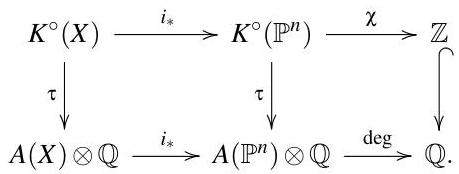
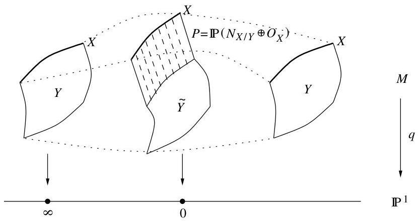
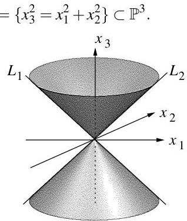
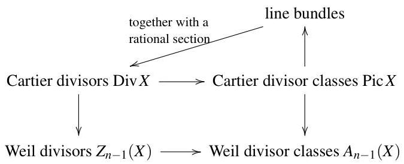
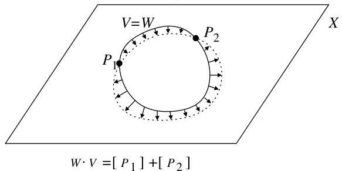
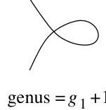

8. Cohomology of sheaves

> For any quasi-coherent sheaf $\mathcal{F}$ on a scheme $X$ we construct the cohomology groups $H^{i}(X,\mathcal{F})$ for $i\geq 0$ using the Čech complex associated to an affine open cover of $X$. We show that the cohomology groups do not depend on the choice of affine open cover. The cohomology groups $H^{i}(X,\mathcal{F})$ vanish for $i>0$ if $X$ is affine, and in any case for $i>\dim X$.
>
> For any short exact sequence of sheaves on $X$ there is an associated long exact sequence of the corresponding cohomology groups.
>
> If $\mathcal{L}$ is a line bundle of degree at least $2g-1$ on a smooth projective curve of genus $g$ then the cohomology group $H^{1}(X,\mathcal{L})$ is zero. Using this “vanishing theorem” we reprove the Riemann-Roch theorem in a cohomological version. Comparing this to the old version yields the equality $\dim H^{0}(K_{X}-D)=\dim H^{1}(D)$ for any divisor $D$, which is a special case of the Serre duality theorem. As an application we can now define the genus of a possibly singular curve to be $\dim H^{1}(X,\mathcal{O}_{X})$.
>
> We compute the cohomology groups of all line bundles on projective spaces. As a consequence, we obtain the result that the cohomology groups of coherent sheaves on projective schemes are always finite-dimensional vector spaces, and that $H^{i}(X,\mathcal{F}\otimes\mathcal{O}_{X}(d))=0$ for all $i>0$ and $d\gg 0$.

### 8.1. Motivation and definitions

There are numerous ways to motivate the theory of cohomology of sheaves. Almost all of them are based on the observation that “the functor of taking global sections of a sheaf is not exact”, i. e. given an exact sequence of sheaves of Abelian groups

$0\to\mathcal{F}_{1}\to\mathcal{F}_{2}\to\mathcal{F}_{3}\to 0$

on a scheme (or topological space) $X$, by taking global sections we get an exact sequence

$0\to\Gamma(\mathcal{F}_{1})\to\Gamma(\mathcal{F}_{2})\to\Gamma(\mathcal{F}_{3})$

of Abelian groups in which the last map $\Gamma(\mathcal{F}_{2})\to\Gamma(\mathcal{F}_{3})$ is in general not surjective. We have seen one example of this in example 7.1.18. Here is one more example:

###### Example 8.1.1.

Let $X\subset\mathbb{P}^{n}$ be a smooth hypersurface of degree $d$ with inclusion morphism $i:X\to\mathbb{P}^{n}$. We know from lemma 7.4.15 that the cotangent sheaf of $\mathbb{P}^{n}$ fits into an exact sequence of vector bundles

$0\to\Omega_{\mathbb{P}^{n}}\to\mathcal{O}(-1)^{\oplus(n+1)}\to\mathcal{O}\to 0.$

Pulling this sequence back by $i$ and taking global sections, we see that we have an exact sequence

$0\to\Gamma(i^{*}\Omega_{\mathbb{P}^{n}})\to\Gamma(\mathcal{O}_{X}(-1)^{\oplus(n+1)})\to\cdots.$

But $\mathcal{O}_{X}(-1)$ has no global sections, so we conclude that $i^{*}\Omega_{\mathbb{P}^{n}}$ has no global sections either. Now consider the exact sequence of lemma 7.4.16

$0\to\mathcal{O}_{X}(-d)\to i^{*}\Omega_{\mathbb{P}^{n}}\to\Omega_{X}\to 0,$

from which we deduce the exact sequence

$0\to\Gamma(\mathcal{O}_{X}(-d))\to\Gamma(i^{*}\Omega_{\mathbb{P}^{n}})\to\Gamma(\Omega_{X}).$

We have just seen that the first two groups in this sequence are trivial. But $\Gamma(\Omega_{X})$ is not trivial in general (e. g. for a cubic curve in $\mathbb{P}^{2}$ we have $\Omega_{X}=\mathcal{O}_{X}$ and thus $\Gamma(\Omega_{X})=k$). Hence the last map in the above sequence of global sections cannot be surjective in general.

We have however already met a case in which the induced map on global sections *is* exact: if $X=\operatorname{Spec}R$ is an *affine* scheme and $\mathcal{F}_{i}=\tilde{M}_{i}$ for some $R$-modules $M_{i}$ are *quasi-coherent* sheaves on $X$ then by lemma 7.2.7 (ii) the sequence

$0\to\mathcal{F}_{1}\to\mathcal{F}_{2}\to\mathcal{F}_{3}\to 0$

---

is exact if and only if the sequence

$0\to\Gamma(\mathcal{F}_{1})\to\Gamma(\mathcal{F}_{2})\to\Gamma(\mathcal{F}_{3})\to 0$

is exact (note that $\Gamma(\mathcal{F}_{i})=M_{i}$ by proposition 7.2.2 (ii)). We have mentioned already that essentially all sheaves occurring in practice are quasi-coherent, so we will assume this from now on for the rest of this chapter.

The conclusion is that we know that taking global sections is an exact functor if the underlying scheme is affine. The goal of the theory of cohomology is to extend the global section sequence to the right for all schemes $X$ in the following sense: for any (quasi-coherent) sheaf $\mathcal{F}$ on $X$ we will define natural cohomology groups $H^{i}(X,\mathcal{F})$ for all $i>0$ satisfying (among other things) the following property: given any exact sequence $0\to\mathcal{F}_{1}\to\mathcal{F}_{2}\to\mathcal{F}_{3}\to 0$ of sheaves on $X$, there is an induced long exact sequence of cohomology groups

$0\to\Gamma(\mathcal{F}_{1})\to\Gamma(\mathcal{F}_{2})\to\Gamma(\mathcal{F}_{3})\to H^{1}(X,\mathcal{F}_{1})\to H^{1}(X,\mathcal{F}_{2})\to H^{1}(X,\mathcal{F}_{3})\to H^{2}(X,\mathcal{F}_{1})\to\cdots.$

If $X$ is an affine scheme then $H^{i}(X,\mathcal{F})=0$ for all $i>0$, so that we arrive again at our old result that the sequence of global sections is exact in this case.

Let us now give the definition of these cohomology groups. There are various ways to define these groups. In these notes we will use the approach of so-called Čech cohomology. This is the most suitable approach for actual applications (but maybe not the best one from a purely theoretical point of view). The idea of Čech cohomology is simple: we have seen above that the global section functor is exact (i. e. does what we finally want) if $X$ is an affine scheme. So if $X$ is any scheme we will just choose an affine open cover $\{U_{i}\}$ of $X$ and consider sections of our sheaves on these affine open subsets and their intersections.

###### Definition 8.1.2.

Let $X$ be a scheme, and let $\mathcal{F}$ be a (quasi-coherent) sheaf on $X$. Fix an affine open cover $\{U_{i}\}_{i\in I}$ of $X$, and assume for simplicity that $I$ is an ordered set. For all $p\geq 0$ we define the Abelian group

$C^{p}(\mathcal{F})=\prod_{i_{0}<\cdots<i_{p}}\mathcal{F}(U_{i_{0}}\cap\cdots\cap U_{i_{p}}).$

In other words, an element $\alpha\in C^{p}(\mathcal{F})$ is a collection $\alpha=(\alpha_{i_{0},\ldots,i_{p}})$ of sections of $\mathcal{F}$ over all intersections of $p+1$ sets taken from the cover. These sections can be totally unrelated.

For every $p\geq 0$ we define a “boundary operator” $d^{p}:C^{p}(\mathcal{F})\to C^{p+1}(\mathcal{F})$ by

$(d^{p}\alpha)_{i_{0},\ldots,i_{p+1}}=\sum_{k=0}^{p+1}(-1)^{k}\alpha_{i_{0},\ldots,i_{k-1},i_{k+1},\ldots,i_{p+1}}|_{U_{i_{0}}\cap\cdots\cap U_{i_{p+1}}}.$

Note that this makes sense as the $\alpha_{i_{0},\ldots,i_{k-1},i_{k+1},i_{p+1}}$ are sections of $\mathcal{F}$ on $U_{i_{0}}\cap\cdots\cap U_{i_{k-1}}\cap U_{i_{k+1}}\cap\cdots\cap U_{i_{p+1}}$, which contains $U_{i_{0}}\cap\cdots\cap U_{i_{p+1}}$ as an open subset.

By abuse of notation we will denote all these operators simply by $d$ if it is clear from the context on which $C^{p}(\mathcal{F})$ they act.

###### Lemma 8.1.3.

Let $\mathcal{F}$ be a sheaf on a scheme $X$. Then $d^{p+1}\circ d^{p}:C^{p}(\mathcal{F})\to C^{p+2}(\mathcal{F})$ is the zero map for all $p\geq 0$.

---

.

###### Proof.

This statement is essentially due to the sign in the definition of $d\alpha$: for every $\alpha\in C^{p}(\mathcal{F})$ we have

$(d^{p+1}d^{p}\alpha)_{i_{0},\ldots,i_{p+2}}$ $=\sum_{k=0}^{p+2}(-1)^{k}(d\alpha)_{i_{0},\ldots,i_{k-1},i_{k+1},\ldots,i_{p+2}}$
$=\sum_{k=0}^{p+2}\sum_{m=0}^{k-1}(-1)^{k+m}\alpha_{i_{0},\ldots,i_{m-1},i_{m+1},\ldots,i_{k-1},i_{k+1},\ldots,i_{p+2}}$
$\qquad+\sum_{k=0}^{p+2}\sum_{m=k+1}^{p+2}(-1)^{k+m-1}\alpha_{i_{0},\ldots,i_{k-1},i_{k+1},\ldots,i_{m-1},i_{m+1},\ldots,i_{p+2}}$
$=0$

(omitting the restriction maps). ∎

We have thus defined a sequence of Abelian groups and homomorphisms

$C^{0}(\mathcal{F})\xrightarrow{d^{0}}C^{1}(\mathcal{F})\xrightarrow{d^{1}}C^{2}(\mathcal{F})\xrightarrow{d^{2}}\cdots$

such that $d^{p+1}\circ d^{p}=0$ at every step. Such a sequence is usually called a complex of Abelian groups. The maps $d^{p}$ are then called the boundary operators.

###### Definition 8.1.4.

Let $\mathcal{F}$ be a sheaf on a scheme $X$. Pick an affine open cover $\{U_{i}\}$ of $X$ and consider the associated groups $C^{p}(\mathcal{F})$ and homomorphisms $d^{p}:C^{p}(\mathcal{F})\to C^{p+1}(\mathcal{F})$ for $p\geq 0$. We define the $p$-th cohomology group of $\mathcal{F}$ to be

$H^{p}(X,\mathcal{F})=\ker d^{p}/\operatorname{im}d^{p-1}$

with the convention that $C^{p}(\mathcal{F})$ and $d^{p}$ are zero for $p<0$. Note that this is well-defined as $\operatorname{im}d^{p-1}\subset\ker d^{p}$ by lemma 8.1.3. If $X$ is a scheme over a field $k$ then the cohomology groups will be vector spaces over $k$. The dimension of the cohomology groups $H^{i}(X,\mathcal{F})$ as a $k$-vector space is then denoted $h^{i}(X,\mathcal{F})$.

###### Remark 8.1.5.

The definition of the cohomology groups as it stands depends on the choice of the affine open cover of $X$. It is a very crucial (and non-trivial) fact that the $H^{i}(X,\mathcal{F})$ actually do not depend on this choice (as we have already indicated by the notation). It is the main disadvantage of our Čech approach to cohomology that this independence is not obvious from the definition. There are other constructions of the cohomology groups (for example the “derived functor approach” of *[x10]* chapter III) that never use such affine open covers and therefore do not face this problem. On the other hand, these other approaches are essentially useless for actual computations. This is why we have given the Čech approach here. We will prove the independence of our cohomology groups of the open cover in section 8.5. For now we will just assume this independence and rather discuss the properties and applications of the cohomology groups.

###### Example 8.1.6.

The following examples follow immediately from the definition and the assumption of remark 8.1.5:

1. For any $X$ and $\mathcal{F}$ we have $H^{0}(X,\mathcal{F})=\Gamma(\mathcal{F})$. In fact, we have $H^{0}(X,\mathcal{F})=\ker(d^{0}:C^{0}(\mathcal{F})\to C^{1}(\mathcal{F}))$ by definition. But an element $\alpha\in C^{0}(\mathcal{F})$ is just given by a section $\alpha_{i}\in\mathcal{F}(U_{i})$ for every element of the open cover, and the map $d^{0}$ is given by $(\alpha_{i}-\alpha_{j})|_{U_{i}\cap U_{j}}$. By the sheaf axiom this is zero for all $i$ and $j$ if and only if the $\alpha_{i}$ come from a global section of $\mathcal{F}$. Hence $H^{0}(X,\mathcal{F})=\Gamma(\mathcal{F})$. (In particular, our definition of $h^{0}(\mathcal{L})$ in section 7.7 is consistent with our current definition of $h^{0}(X,\mathcal{L})$.)
2. If $X$ is an affine scheme then $H^{i}(X,\mathcal{F})=0$ for $i>0$. In fact, if $X$ is affine we can pick the open cover consisting of the single element $X$, in which case the groups $C^{i}(\mathcal{F})$ and hence the $H^{i}(X,\mathcal{F})$ are trivially zero for $i>0$

---

.
4. If $X$ is a projective scheme of dimension $n$ then $H^{i}(X,\mathcal{F})=0$ whenever $i>n$. In fact, by proposition 4.1.9 we can pick homogeneous polynomials $f_{0},\ldots,f_{n}$ such that $X\cap Z(f_{0},\ldots,f_{n})=\emptyset$. We thus get an open cover of $X$ by the $n+1$ subsets $X\backslash Z(f_{i})$ which are all affine by proposition 5.5.4. Using this open cover for the definition of the cohomology groups, we see that the $C^{i}(\mathcal{F})$ and hence the $H^{i}(X,\mathcal{F})$ are zero for $i>n$. Note that the same is true for any scheme that can be covered by $n+1$ affine open subsets.

Note that for (i) we did not need the independence of the cohomology groups of the open cover, but for (ii) and (iii) we did. In fact, the last two statements are both highly non-trivial theorems about cohomology groups. They only follow so easily in our setup because we assumed the independence of the cover.

###### Example 8.1.7.

Let $X=\mathbb{P}^{1}$ and $\mathcal{F}=\mathcal{O}$. By example 8.1.6 (i) we know that $H^{0}(\mathbb{P}^{1},\mathcal{O})\cong k$ is simply the space of (constant) global regular functions, and by part (iii) we know that $H^{i}(\mathbb{P}^{1},\mathcal{O})=0$ for $i>1$. So let us determine $H^{1}(\mathbb{P}^{1},\mathcal{O})$. To compute this cohomology group let us pick the obvious affine open cover $U_{i}=\{x_{i}\neq 0\}$ for $i=0,1$. Then

$C^{1}(\mathcal{O})$ $=\mathcal{O}(U_{0}\cap U_{1})$
$=\left\{\frac{f}{x_{0}^{a}x_{1}^{b}}\;;\;f\text{ homogeneous of degree}\;a+b\right\}$
$=\left\langle\frac{x_{0}^{m}x_{1}^{n}}{x_{0}^{a}x_{1}^{b}}\;;m+n=a+b\text{ and }m,n,a,b\geq 0\right\rangle.$

Of course the condition $m+n=a+b$ implies that we always have $m\geq a$ or $n\geq b$. So every such generator is regular on at least one of the open subsets $U_{0}$ and $U_{1}$. It follows that every such generator is in the image of the boundary map

$d^{0}:C^{0}(\mathcal{O})=\mathcal{O}(U_{0})\times\mathcal{O}(U_{1})\to\mathcal{O}(U_{0}\cap U_{1}),\quad(\alpha_{0},\alpha_{1})\mapsto\alpha_{1}-\alpha_{0}|_{U_{0}\cap U_{1}}.$

Consequently $H^{1}(\mathbb{P}^{1},\mathcal{O})=0$ by definition of the cohomology groups.

###### Example 8.1.8.

In the same way as in example 8.1.7 let us now compute the cohomology group $H^{1}(\mathbb{P}^{1},\mathcal{O}(-2))$. With the same notations as above we have now

$C^{1}(\mathcal{O}(-2))$ $=\mathcal{O}(-2)(U_{0}\cap U_{1})$
$=\left\{\frac{f}{x_{0}^{a}x_{1}^{b}}\;;\;f\text{ homogeneous of degree}\;a+b-2\right\}$
$=\left\langle\frac{x_{0}^{m}x_{1}^{n}}{x_{0}^{a}x_{1}^{b}}\;;\;m+n=a+b-2\right\rangle.$

The condition $m+n=a+b-2$ implies that $m\geq a-1$ or $n\geq b-1$. If one of these inequalities is strict, then the corresponding generator $\frac{x_{0}^{m}x_{1}^{n}}{x_{0}^{a}x_{1}^{b}}$ is regular on $U_{0}$ or $U_{1}$ and is therefore zero in the cohomology group $H^{1}(\mathbb{P}^{1},\mathcal{O}(-2))$ as above. So we are only left with the function $\frac{1}{x_{0}x_{1}}$ where neither inequality is strict. As $C^{2}(\mathcal{O}(-2))=0$ and so the boundary operator $d^{1}$ is trivial, we conclude that $H^{1}(\mathbb{P}^{1},\mathcal{O}(-2))$ is one-dimensional, with the function $\frac{1}{x_{0}x_{1}}$ as a generator.

### 8.2. The long exact cohomology sequence

The main property of the cohomology groups is that they solve the problem of finding an exact sequence of sections associated to a short exact sequence of sheaves:

---

8. Cohomology of sheaves

Proposition 8.2.1. Let  $0 \to \mathcal{F}_1 \to \mathcal{F}_2 \to \mathcal{F}_3 \to 0$  be an exact sequence of sheaves on a (separated) scheme  $X$ . Then there is a canonical long exact sequence of cohomology groups

$$
\begin{array}{l} 0 \rightarrow H ^ {0} (X, \mathcal {F} _ {1}) \rightarrow H ^ {0} (X, \mathcal {F} _ {2}) \rightarrow H ^ {0} (X, \mathcal {F} _ {3}) \\ \rightarrow H ^ {1} (X, \mathcal {F} _ {1}) \rightarrow H ^ {1} (X, \mathcal {F} _ {2}) \rightarrow H ^ {1} (X, \mathcal {F} _ {3}) \\ \rightarrow H ^ {2} (X, \mathcal {F} _ {1}) \rightarrow \dots . \\ \end{array}
$$

Proof. Consider the diagram of Abelian groups and homomorphisms

The columns of this diagram are complexes (i.e.  $d \circ d = 0$  at all places) by lemma 8.1.3. We claim that the rows of this diagram are all exact: by lemma 7.2.7 (ii) and what we have said in section 8.1 we know that the sequences  $0 \to \mathcal{F}_1(U) \to \mathcal{F}_2(U) \to \mathcal{F}_3(U) \to 0$  are exact on every affine open subset  $U$  of  $X$ . But the intersection of two (and hence finitely many) affine open subsets of  $X$  is again affine as  $U \cap V = \Delta_X \cap (U \times V)$  is a closed subset of an affine scheme  $U \times V$  (where  $\Delta_X \subset X \times X$  denotes the diagonal of  $X$ ). As the  $C^p(\mathcal{F}_i)$  are made up from sections on such open subsets, the claim follows. Moreover, note that all squares in this diagram are commutative by construction.

The statement of the proposition now follows from a basic lemma of homological algebra:

Lemma 8.2.2. Any short exact sequence of complexes

---

(i. e. the $C^{p},D^{p},E^{p}$ are Abelian groups, the diagram commutes, the rows are exact and the columns are complexes) gives rise to a long exact sequence in cohomology

$\cdots\to H^{p-1}(E)\to H^{p}(C)\to H^{p}(D)\to H^{p}(E)\to H^{p+1}(C)\to\cdots$

where $H^{p}(C)=\ker(C^{p}\to C^{p+1})/\operatorname{im}(C^{p-1}\to C^{p})$, and similarly for $D$ and $E$.

###### Proof.

The proof is done by pure “diagram chasing”. We will give some examples.

1. Existence of the morphisms $\psi:H^{p}(C)\to H^{p}(D)$: let $\alpha\in H^{p}(C)$ be represented by an element in $C^{p}$ (which we denote by the same letter by abuse of notation). Then $d\alpha=0\in C^{p+1}$. Set $\psi(\alpha)=f(\alpha)$. Note that $d\psi(\alpha)=f(d\alpha)=0$, so $\psi(\alpha)$ is a well-defined cohomology element. We still have to check that this definition does not depend on the representative chosen in $C^{p}$. So if $\alpha=d\alpha^{\prime}$ for some $\alpha^{\prime}\in C^{p-1}$ (so that $\alpha=0$ in $H^{p}(C)$) then $\psi(\alpha)=f(d\alpha^{\prime})=df(\alpha^{\prime})$ (so that $\psi(\alpha)=0$ in $H^{p}(D)$).
2. The existence of the morphisms $H^{p}(D)\to H^{p}(E)$ follows in the same way: they are simply induced by the morphisms $g$.
3. Existence of the morphisms $\phi:H^{p}(E)\to H^{p+1}(C)$: The existence of these “connecting morphisms” is probably the most unexpected part of this lemma. Let $\alpha$ be a (representative of a) cohomology element in $E^{p}$, so that $d\alpha=0$. As $g:D^{p}\to E^{p}$ is surjective, we can pick a $\beta\in D^{p}$ such that $g(\beta)=\alpha$. Consider the element $d\beta\in D^{p+1}$. We have $g(d\beta)=dg(\beta)=d\alpha=0$, so $d\beta$ is in fact of the form $f(\gamma)$ for a (unique) $\gamma\in C^{p+1}$. We set $\phi(\alpha)=\gamma$.

We have to check that this is well-defined:

1. $d\gamma=0$ (so that $\gamma$ actually defines an element in cohomology): we have $f(d\gamma)=df(\gamma)=d(d\beta)=0$ as the middle column is a complex, so $d\gamma=0$ as the $f$ are injective.
2. The construction does not depend on the choice of $\beta$: if we pick another $\beta^{\prime}$ with $g(\beta^{\prime})=\alpha$ then $g(\beta-\beta^{\prime})=0$, so $\beta-\beta^{\prime}=f(\delta)$ for some $\delta\in C^{p}$ as the $p$-th row is exact. Now if $\gamma$ and $\gamma^{\prime}$ are the elements such that $f(\gamma)=d\beta$ and $f(\gamma^{\prime})=\beta^{\prime}$ then $f(\gamma-\gamma^{\prime})=d(\beta-\beta^{\prime})=df(\delta)=f(d\delta)$. As $f$ is injective we conclude that $\gamma-\gamma^{\prime}=d\delta$, so $\gamma$ and $\gamma^{\prime}$ define the same element in $H^{p+1}(C)$.
3. If $\alpha=d\alpha^{\prime}$ for some $\alpha^{\prime}\in E^{p-1}$ (so that $\alpha$ defines the zero element in cohomology) then we can pick an inverse image $\beta^{\prime}$ with $g(\beta^{\prime})=\alpha^{\prime}$ as $g$ is surjective. For $\beta$ we can then take $d\beta^{\prime}$. But then $d\beta=d(d\beta^{\prime})=0$ as the middle column is a complex, so the resulting element in $H^{p+1}(C)$ is zero.

Summarizing, we can say that the morphism $H^{p}(E)\to H^{p+1}(C)$ is obtained by going “left, down, left” in our diagram. We have just checked that this really gives rise to a well-defined map.

We have now seen that there is a canonical sequence of morphisms between the cohomology groups as stated in the lemma. It remains to be shown that the sequence is actually exact. We will check exactness at the $H^{p}(D)$ stage only (i. e. show that $\ker(H^{p}(D)\to H^{p}(E))=\operatorname{im}(H^{p}(C)\to H^{p}(D))$ and leave the other two checks (at $H^{p}(C)$ and $H^{p}(E)$) that are completely analogous as an exercise.

$\operatorname{im}(H^{p}(C)\to H^{p}(D))\subset\ker(H^{p}(D)\to H^{p}(E))$: Let $\alpha\in H^{p}(D)$ be of the form $\alpha=f(\beta)$ for some $\beta\in H^{p}(C))$. Then $g(\alpha)=g(f(\beta))=0$ as the $p$-th row is exact.

$\ker(H^{p}(D)\to H^{p}(E))\subset\operatorname{im}(H^{p}(C)\to H^{p}(D))$: Let $\alpha\in H^{p}(D)$ be a cohomology element (i. e. $d\alpha=0$) such that $g(\alpha)=0$ in cohomology, i. e. $g(\alpha)=d\beta$ for some $E^{p-1}$. As $g$ is surjective we can pick an inverse image $\gamma\in D^{p-1}$ of $\beta$. Then

$g(\alpha-d\gamma)=g(\alpha)-g(d\gamma)=g(\alpha)-d\beta=0,$

so

---

8. Cohomology of sheaves

so there is a  $\delta \in C^p$  such that  $f(\delta) = \alpha - d\gamma$  as the  $p$ -th row is exact. Note that  $\delta$  defines an element in  $H^{p}(C)$  as  $f(d\delta) = d(\alpha - d\gamma) = 0 - 0 = 0$  and thus  $d\delta = 0$  as  $f$  is injective. Moreover,  $f(\delta) = \alpha$  in  $H^{p}(D)$  by construction, so  $\alpha \in \mathrm{im}(H^{p}(C) \to H^{p}(D))$ .

Example 8.2.3. Consider the exact sequence of sheaves on  $X = \mathbb{P}^1$

$$
0 \longrightarrow O (- 2) \xrightarrow {- x _ {0} x _ {1}} O \longrightarrow k _ {P} \oplus k _ {Q} \longrightarrow 0
$$

from example 7.1.18, where  $P = (0:1)$  and  $Q = (1:0)$ , and the last map is given by evaluation at  $P$  and  $Q$ . From proposition 8.2.1 we deduce an associated long exact cohomology sequence

$$
0 \to H ^ {0} (X, O (- 2)) \to H ^ {0} (X, O) \to H ^ {0} (X, k _ {P} \oplus k _ {Q}) \to H ^ {1} (X, O (- 2)) \to H ^ {1} (X, O) \to \dots .
$$

Now  $H^0 (X,O(-2)) = 0$  by example 7.7.1 and  $H^{1}(X,O) = 0$  by example 8.1.7. Moreover,  $H^0 (X,O)$  is just the space of global (constant) functions,  $H^0 (X,k_P\oplus k_Q)$  is isomorphic to  $k\times k$  (given by specifying values at the points  $P$  and  $Q$ ), and  $H^{1}(X,O(-2)) = \left(\frac{1}{x_{0}x_{1}}\right)$  is 1-dimensional by example 8.1.8. So our exact sequence is just

$$
0 \to k \to k \times k \to k \to 0.
$$

We can actually also identify the morphisms. The first morphism in this sequence is  $a \mapsto (a, a)$  as it is the evaluation of the constant function  $a$  at the points  $P$  and  $Q$ . The second morphism is given by the "left, down, left" procedure of part (iii) of the proof of lemma 8.2.2 in the following diagram:

Starting with any element  $(a,b) \in C^0(k_P \oplus k_Q)$  we can find an inverse image in  $C^0(O) = O(U_0) \times O(U_1)$  (with  $U_i = \{x_i \neq 0\}$ , namely the pair of constant functions  $(b,a)$  (as  $P \in U_1$  and  $Q \in U_0$ ). Going down in the diagram yields the function  $a - b \in O(U_0 \cap U_1)$  by the definition of the boundary operator. Recalling that the morphism from  $O(-2)$  to  $O$  is given by multiplication with  $x_0x_1$ , we find that  $\frac{a - b}{x_0x_1}$  is the element in  $C^1(O(-2))$  that we were looking for. In terms of the basis vector  $\frac{1}{x_0x_1}$  of  $H^1(X,O(-2))$  this function has the single coordinate  $a - b$ . So in this basis our exact cohomology sequence becomes

which is indeed exact.

8.3. The Riemann-Roch theorem revisited. Let us now study the cohomology groups of line bundles on smooth projective curves in some more detail. So let  $X$  be such a curve, and let  $\mathcal{L}$  be a line bundle on  $X$ . Of course by example 8.1.6 (i) and (iii) the only interesting cohomology group is  $H^{1}(X,\mathcal{L})$ . We will show that this group is trivial if  $\mathcal{L}$  is "positive enough":

Proposition 8.3.1. (Kodaira vanishing theorem for line bundles on curves) Let  $X$  be a smooth projective curve of genus  $g$ , and let  $\mathcal{L}$  be a line bundle on  $X$  such that  $\deg \mathcal{L} \geq 2g - 1$ . Then  $H^{1}(X, \mathcal{L}) = 0$ .

Proof. We compute  $H^{1}(X, \mathcal{L})$  using our definition of cohomology groups. So let  $U_{0} \subset X$  be an affine open subset of  $X$ . It must be of the form  $X \setminus \{P_{1}, \ldots, P_{r}\}$  for some points  $P_{i}$  on  $X$ . Now pick any other affine open subset  $U_{1} \subset X$  that contains the points  $P_{i}$ . Then  $U_{1}$

---

is of the form $X\backslash\{Q_{1},\dots,Q_{s}\}$ with $P_{i}\neq Q_{j}$ for all $i,j$. So we have an affine open cover $X=U_{0}\cup U_{1}$.

By definition we have $H^{1}(X,\mathcal{L})=\mathcal{L}(U_{0}\cap U_{1})/(\mathcal{L}(U_{0})+\mathcal{L}(U_{1}))$. Note that $\mathcal{L}(U_{0}\cap U_{1})$ is precisely the space of rational sections of $\mathcal{L}$ that may have poles at the points $P_{i}$ and $Q_{j}$, and similarly for $\mathcal{L}(U_{0})$ and $\mathcal{L}(U_{1})$. In other words, to prove the proposition we have to show that any rational section $\alpha$ of $\mathcal{L}$ with poles at the $P_{i}$ and $Q_{j}$ can be written as the sum of two rational sections $\alpha_{0}$ and $\alpha_{1}$, where $\alpha_{0}$ has poles only at the $P_{i}$ and $\alpha_{1}$ only at the $Q_{j}$.

So let $\alpha$ be such a rational section. It is a global section of $\mathcal{L}\otimes\mathcal{O}_{X}(a_{1}P_{1}+\dots+a_{r}P_{r}+b_{1}Q_{1}+\dots+b_{s}Q_{s})$ for some $a_{i},b_{j}\geq 0$.

Let us assume that $a_{1}\geq 1$. Note that then the degree of the line bundle $\omega_{X}\otimes\mathcal{L}^{\vee}\otimes\mathcal{O}_{X}(-a_{1}P_{1}-\dots-a_{r}P_{r})$ is at most $-2$ by assumption and corollary 7.6.6. Hence by the Riemann-Roch theorem 7.7.3 (and example 7.7.1) it follows that

$h^{0}(\mathcal{L}\otimes\mathcal{O}_{X}(a_{1}P_{1}+\dots+a_{r}P_{r}))=\deg L+a_{1}+\dots+a_{r}+1-g.$

In the same way we get

$h^{0}(\mathcal{L}\otimes\mathcal{O}_{X}((a_{1}-1)P_{1}+\dots+a_{r}P_{r}))=\deg L+a_{1}-1+a_{2}+\dots+a_{r}+1-g.$

We conclude that

$h^{0}(\mathcal{L}\otimes\mathcal{O}_{X}(a_{1}P_{1}+\dots+a_{r}P_{r}))-h^{0}(\mathcal{L}\otimes\mathcal{O}_{X}((a_{1}-1)P_{1}+\dots+a_{r}P_{r}))=1.$

So we can pick a rational section $\alpha_{0}^{\prime}$ in $\Gamma(\mathcal{L}\otimes\mathcal{O}_{X}(a_{1}P_{1}+\dots+a_{r}P_{r}))$ that is not in $\Gamma(h^{0}(\mathcal{L}\otimes\mathcal{O}_{X}((a_{1}-1)P_{1}+\dots+a_{r}P_{r})))$, i. e. a section that has a pole of order exactly $a_{1}$ at $P_{1}$.

Now $\alpha$ and $\alpha_{0}^{\prime}$ are both sections of the one-dimensional vector space

$\Gamma(\mathcal{L}\otimes\mathcal{O}_{X}(a_{1}P_{1}+\dots+a_{r}P_{r}))/\Gamma(\mathcal{L}\otimes\mathcal{O}_{X}((a_{1}-1)P_{1}+\dots+a_{r}P_{r})),$

and moreover $\alpha_{0}^{\prime}$ is not zero in this quotient. So by possibly multiplying $\alpha_{0}^{\prime}$ with a constant scalar we can assume that $\alpha-\alpha_{0}^{\prime}$ is in $\Gamma(\mathcal{L}\otimes\mathcal{O}_{X}((a_{1}-1)P_{1}+\dots+a_{r}P_{r}))$.

Note now that $\alpha_{0}^{\prime}$ has poles only at the $P_{i}$, whereas the total order of the poles of $\alpha-\alpha_{0}^{\prime}$ at the $P_{i}$ is at most $a_{1}+\dots+a_{r}-1$. Repeating this process we arrive after $a_{1}+\dots+a_{r}$ steps at a rational section $\alpha_{0}$ with poles only at the $P_{i}$ such that $\alpha_{1}:=\alpha-\alpha_{0}$ has no poles any more at the $P_{i}$. This is precisely what we had to construct. ∎

###### Remark 8.3.2.

As in the case of the Riemann-Roch theorem there are vast generalizations of the Kodaira vanishing theorem, e. g. to higher-dimensional spaces. One version is the following: if $X$ is a smooth projective variety then $H^{i}(X,\omega_{X}\otimes\mathcal{O}_{X}(n))=0$ for all $i>0$ and $n>0$. Note that in the case of a smooth curve this follows from our version of proposition 8.3.1, as $\deg(\omega_{X}\otimes\mathcal{O}_{X}(n))=2g-2+1\geq 2g-1$.

In general cohomology groups “tend to be zero quite often”. There are many so-called vanishing theorems that assert that certain cohomology groups are zero under some conditions that can hopefully easily be checked. We will prove one more vanishing theorem in theorem 8.4.7 (ii). Of course, the advantage of vanishing cohomology groups is that they break up the long exact cohomology sequence of proposition 8.2.1 into smaller pieces.

Using our Kodaira vanishing theorem we can now reprove the Riemann-Roch theorem in a “cohomological version”. In analogy to the notation of section 7.7 let us denote $H^{1}(X,\mathcal{O}_{X}(D))$ also by $H^{1}(D)$ for any divisor $D$, and similarly for $h^{1}(D)$.

###### Corollary 8.3.3.

(Riemann-Roch theorem for line bundles on curves, second version) Let $X$ be a smooth projective curve of genus $g$. Then for any divisor $D$ on $X$ we have

$h^{0}(D)-h^{1}(D)=\deg D+1-g.$

###### Proof.

From the exact skyscraper sequence

$0\to\mathcal{O}_{X}(D)\to\mathcal{O}_{X}(D+P)\to k_{P}\to 0$

---

for any point $P\in X$ we get the long exact sequence in cohomology

$0\to H^{0}(D)\to H^{0}(D+P)\to k\to H^{1}(D)\to H^{1}(D+P)\to 0$

by proposition 8.2.1. Taking dimensions, we conclude that $\chi(D+P)-\chi(D)=1$, where $\chi(D):=h^{0}(D)-h^{1}(D)$. It follows by induction that we must have

$h^{0}(D)-h^{1}(D)=\deg D+c$

for some constant $c$ (that does not depend on $D$). But by our first version of the Riemann-Roch theorem 7.7.3 we have

$h^{0}(D)-h^{0}(K_{X}-D)=\deg D+1-g.$

So to determine the constant $c$ we can pick a divisor $D$ of degree at least $2g-1$: then $h^{1}(D)$ vanishes by proposition 8.3.1 and $h^{0}(K_{X}-D)$ by example 7.7.1. So we conclude that $c=1-g$, as desired. ∎

###### Remark 8.3.4.

Comparing our two versions of the Riemann-Roch theorem we see that we must have $h^{0}(\omega_{X}\otimes\mathcal{L}^{\vee})=h^{1}(\mathcal{L})$ for all line bundles $\mathcal{L}$ on a smooth projective curve $X$. In fact, this is just a special case of the Serre duality theorem that asserts that for any smooth $n$-dimensional variety $X$ and any locally free sheaf $\mathcal{F}$ there are canonical isomorphisms

$H^{i}(X,\mathcal{F})\cong H^{n-i}(X,\omega_{X}\otimes\mathcal{F}^{\vee})^{\vee}$

for all $i=0,\ldots,n$. Unfortunately, these isomorphisms cannot easily be written down. There are even more general versions for singular varieties $X$ and more general sheaves $\mathcal{F}$. We refer to *[x10]* section III.7 for details.

Note that our new version of the Riemann-Roch theorem can be used to define the genus of singular curves:

###### Definition 8.3.5.

Let $X$ be a (possibly singular) curve. Then the genus of $X$ is defined to be the non-negative integer $h^{1}(X,\mathcal{O}_{X})$. (This definition is consistent with our old ones as we can see by setting $\mathcal{L}=\mathcal{O}_{X}$ in corollary 8.3.3.)

Let us investigate the geometric meaning of the genus of singular curves in two cases:

###### Example 8.3.6.

Let $C_{1},\ldots,C_{n}$ be smooth irreducible curves of genera $g_{1},\ldots,g_{n}$, and denote by $\tilde{C}=C_{1}\cup\cdots\cup C_{n}$ their disjoint union. Now pick $r$ pairs of points $P_{i},Q_{i}\in\tilde{C}$ that are all distinct, and denote by $C$ the curve obtained from $\tilde{C}$ by identifying every $P_{i}$ with the corresponding $Q_{i}$ for $i=1,\ldots,r$. Curves obtained by this procedure are called nodal curves.

To compute the genus of the nodal curve $C$ we consider the exact sequence

$0\to\mathcal{O}_{C}\to\oplus_{i=1}^{n}\mathcal{O}_{C_{i}}\to\oplus_{i=1}^{r}k_{P_{i}}\to 0$

where the last maps $\oplus_{i=1}^{n}\mathcal{O}_{C_{i}}\to k_{P_{i}}$ are given by evaluation at $P_{i}$ minus evaluation at $Q_{i}$. The sequence just describes the fact that regular functions on $C$ are precisely functions on $\tilde{C}$ that have the same value at $P_{i}$ and $Q_{i}$ for all $i$.

By proposition 8.2.1 we obtain a long exact cohomology sequence

$0\to H^{0}(C,\mathcal{O}_{C})\to\oplus_{i=1}^{n}H^{0}(C_{i},\mathcal{O}_{C_{i}})\to k^{\oplus r}\to H^{1}(C,\mathcal{O}_{C})\to\oplus_{i=1}^{n}H^{1}(C_{i},\mathcal{O}_{C_{i}})\to 0.$

Taking dimensions, we get $1-n+r-h^{1}(C,\mathcal{O}_{C})+\sum_{i}g_{i}=0$, so we see that the genus of $C$ is $\sum_{i}g_{i}+r+1-n$. If $C$ is connected, note that $r+1-n$ is precisely the number of “loops” in the graph of $C$. So the genus of a nodal curve is the sum of the genera of its components plus the number of “loops”. This fits well with our topological interpretation of the genus given in examples 0.1.2 and 0.1.3.

---

Andreas Gathmann

Proposition 8.3.7. Let  $X \subset \mathbb{P}^2$  be a (possibly singular) curve of degree  $d$ , given as the zero locus of a homogeneous polynomial  $f$  of degree  $d$ . Then the genus of  $X$  is equal to  $\frac{1}{2}(d - 1)(d - 2)$ .

Proof. Let  $x_0, x_1, x_2$  be the coordinates of  $\mathbb{P}^2$ . By a change of coordinates we can assume that the point  $(0:0:1)$  is not on  $X$ . Then the affine open subsets  $U_0 = \{x_0 \neq 0\}$  and  $U_1 = \{x_1 \neq 0\}$  cover  $X$ . So in the same way as in the proof of proposition 8.3.1 we get

$$
H ^ {1} (X, \mathcal {O} _ {X}) = \mathcal {O} _ {X} \left(U _ {0} \cap U _ {1}\right) / \left(\mathcal {O} _ {X} \left(U _ {0}\right) + \mathcal {O} _ {X} \left(U _ {1}\right)\right).
$$

Moreover, the equation of  $f$  must contain an  $x_2^d$ -term, so the relation  $f = 0$  can be used to restrict the degrees in  $x_2$  of functions on  $X$  to at most  $d - 1$ . Hence we get

$$
\mathcal {O} _ {X} \left(U _ {0} \cap U _ {1}\right) = \left\{\frac {x _ {2} ^ {i}}{x _ {0} ^ {j} x _ {1} ^ {k}}; 0 \leq i \leq d - 1 \text {a n d} i = j + k \right\}
$$

and

$$
\mathcal {O} _ {X} (U _ {0}) = \left\{\frac {x _ {2} ^ {i}}{x _ {0} ^ {j} x _ {1} ^ {k}}; 0 \leq i \leq d - 1, k \leq 0, \text {a n d} i = j + k \right\}
$$

(and similarly for  $\mathcal{O}_X(U_1)$ ). We conclude that

$$
H ^ {1} (X, \mathcal {O} _ {X}) = \left\{\frac {x _ {2} ^ {i}}{x _ {0} ^ {j} x _ {1} ^ {k}}; 0 \leq i \leq d - 1, j &gt; 0, k &gt; 0, \text {a n d} i = j + k \right\}.
$$

To compute the dimension of this space note that for a given value of  $i$  (which can run from 0 to  $d - 1$ ) we get  $i - 1$  choices of  $j$  and  $k$  (namely  $(1, i - 1), (2, i - 2), \ldots, (i - 1, 1)$ ). So the total dimension is  $h^1(X, \mathcal{O}_X) = 1 + 2 + \dots + (d - 2) = \frac{1}{2}(d - 1)(d - 2)$ .

Remark 8.3.8. The important point of proposition 8.3.7 is that the genus of a curve is constant in families: if we degenerate a smooth curve into a singular one (by varying the coefficients in its equation) then the genus of the singular curve will be the same as the genus of the original smooth curve. This also fits well with our idea in examples 0.1.2 and 0.1.3 that we can compute the genus of a plane curve by degenerating it into a singular one, where the result is then easy to read off.

Remark 8.3.9. Our second (cohomological) version of the Riemann-Roch theorem is in fact the one that is needed for generalizations to higher-dimensional varieties. If  $X$  is an  $n$ -dimensional projective variety and  $\mathcal{F}$  a sheaf on  $X$  then the generalized Riemann-Roch theorem mentioned in remark 7.7.7 (v) will compute the Euler characteristic

$$
\chi (X, \mathcal {F}) := \sum_ {i = 0} ^ {n} (- 1) ^ {i} h ^ {i} (X, \mathcal {F})
$$

---

8. Cohomology of sheaves

in terms of other data that are usually easier to determine than the cohomology groups themselves.

8.4. The cohomology of line bundles on projective spaces. Let us now turn to higher-dimensional varieties and compute the cohomology groups of the line bundles  $\mathcal{O}_X(d)$  on the projective space  $X = \mathbb{P}^n$ .

Proposition 8.4.1. Let  $X = \mathbb{P}^n$ , and denote by  $S = k[x_0, \ldots, x_n]$  the graded coordinate ring of  $X$ . Then the sheaf cohomology groups of the line bundles  $\mathcal{O}_X(d)$  on  $X$  are given by:

(i)  $\bigoplus_{d\in \mathbb{Z}}H^{0}(X,\mathcal{O}_{X}(d)) = S$  as graded  $k$ -algebras,
(ii)  $\bigoplus_{d\in \mathbb{Z}}H^{n}(X,\mathcal{O}_{X}(d)) = S^{\prime}$  as graded  $k$ -vector spaces, where  $S^{\prime}\cong S$  with the grading given by  $S_d^\prime = S_{-n - 1 - d}$
(iii)  $H^{i}(X,\mathcal{O}_{X}(d)) = 0$  whenever  $i\neq 0$  and  $i\neq n$

Remark 8.4.2. By splitting up the equations of (i) and (ii) into the graded pieces one obtains the individual cohomology groups  $H^{i}(X,\mathcal{O}_{X}(d))$ . So for example we have

$$
h ^ {n} (X, \mathcal {O} _ {X} (d)) = h ^ {0} (X, \mathcal {O} _ {X} (- n - 1 - d)) = \left\{ \begin{array}{l l} \binom {- d - 1} {n} &amp; \text {if} d \leq - n - 1, \\ 0 &amp; \text {if} d &gt; - n - 1. \end{array} \right.
$$

(Note that the equality of these two dimensions is consistent with the Serre duality theorem of remark 8.3.4, since  $\omega_{X} = \mathcal{O}_{X}(-n - 1)$  by lemma 7.4.15.)

Proof. (i) is clear from example 8.1.6 (i).

(ii): Let  $\{U_i\}$  for  $0 \leq i \leq n$  be the standard affine open cover of  $X$ , i.e.  $U_i = \{x_i \neq 0\}$ . We will prove the proposition for all  $d$  together by computing the cohomology of the quasi-coherent graded sheaf  $\mathcal{F}_X = \bigoplus_{d \in \mathbb{Z}} \mathcal{O}_X(d)$  while keeping track of the grading (note that cohomology commutes with direct sums). This is just a notational simplification.

Of course we have  $U_{i_0,\dots,i_k} = \{x_{i_0}\dots x_{i_k}\neq 0\}$ . So  $\mathcal{F}(U_{i_0,\dots,i_k})$  is just the localization  $S_{x_{i_0}\dots x_{i_k}}$ . It follows that the sequence of groups  $C^k (\mathcal{F}_X)$  reads

$$
\prod_ {i _ {0}} S _ {x _ {i _ {0}}} \rightarrow \prod_ {i _ {0} &lt;   i _ {1}} S _ {x _ {i _ {0}} x _ {i _ {1}}} \rightarrow \dots \rightarrow \prod_ {j} S _ {x _ {0} \dots x _ {j - 1} x _ {j + 1} \dots x _ {n}} \rightarrow S _ {x _ {0} \dots x _ {n}}. \tag {*}
$$

Looking at the last term in this sequence, we compute that

$$
\begin{array}{l} H ^ {n} (X, \mathcal {F}) = \operatorname {c o k e r} \left(\prod_ {j} S _ {x _ {0} \dots x _ {j - 1} x _ {j + 1} \dots x _ {n}} \rightarrow S _ {x _ {0} \dots x _ {n}}\right) \\ = \left\langle x _ {0} ^ {j _ {0}} \dots x _ {n} ^ {j _ {n}}; j _ {i} \in \mathbb {Z} \right\rangle / \left\langle x _ {0} ^ {j _ {0}} \dots x _ {n} ^ {j _ {n}}; j _ {i} \geq 0 \text { for some } i \right\rangle \\ = \left\langle x _ {0} ^ {j _ {0}} \dots x _ {n} ^ {j _ {n}}; j _ {i} &lt;   0 \text { for all } i \right\rangle \\ = \frac {1}{x _ {0} \cdots x _ {n}} k [ x _ {0} ^ {- 1}, \dots , x _ {n} ^ {- 1} ], \\ \end{array}
$$

so up to a shift of  $\deg x_0\cdots x_n = n + 1$  these are just the polynomials in  $x_i$  with non-positive exponents. This shows (ii).

(iii): We prove this by induction on  $n$ . There is nothing to show for  $n = 1$ . Let  $H = \{x_{n} = 0\} \cong \mathbb{P}^{n - 1}$  be a hyperplane. Note that there is an exact sequence of sheaves on  $X$

$$
0 \to \mathcal {O} _ {X} (d - 1) \to \mathcal {O} _ {X} (d) \to \mathcal {O} _ {H} (d) \to 0
$$

for all  $d$ , where the first map is given by multiplication with  $x_{n}$ , and the second one by setting  $x_{n}$  to 0. Taking these sequences together for all  $d \in \mathbb{Z}$  we obtain the exact sequence

$$
0 \to \mathcal {F} (- 1) \stackrel {\cdot x _ {n}} {\to} \mathcal {F} \to \mathcal {F} _ {H} \to 0
$$

---

where we set $\mathcal{F}(-1)=\mathcal{F}\otimes\mathcal{O}_{X}(-1)$. From the associated long exact cohomology sequence and the induction hypothesis we get the following exact sequences:

$0\to H^{0}(X,\mathcal{F}(-1))\to H^{0}(X,\mathcal{F})\to H^{0}(H,\mathcal{F}_{H})\to H^{1}(X,\mathcal{F}(-1))\to H^{1}(X,\mathcal{F})\to 0,$
$0\to H^{i}(X,\mathcal{F}(-1))\to H^{i}(X,\mathcal{F})\to 0\quad\text{for }1<i<n-1,$
$0\to H^{n-1}(X,\mathcal{F}(-1))\to H^{n-1}(X,\mathcal{F})\to H^{n-1}(H,\mathcal{F}_{H})\to H^{n}(X,\mathcal{F}(-1))\to H^{n}(X,\mathcal{F})\to 0.$

So first of all we see that $H^{i}(X,\mathcal{F}(-1))\cong H^{i}(X,\mathcal{F})$ for all $1<i<n-1$. We claim that this holds in fact for $1\leq i\leq n-1$. To see this for $i=1$ note that the first exact sequence above starts with

$0\to k[x_{0},\ldots,x_{n}]\overset{x_{n}}{\to}k[x_{0},\ldots,x_{n}]\to k[x_{0},\ldots,x_{n-1}]\to\cdots,$

which is obviously exact on the right, so it follows that $H^{1}(X,\mathcal{F}(-1))\cong H^{1}(X,\mathcal{F})$. A similar analysis of the third exact sequence above, using the explicit description of the proof of part (ii), shows that $H^{n-1}(X,\mathcal{F}(-1))\cong H^{n-1}(X,\mathcal{F})$. So we see that the map $H^{i}(X,\mathcal{F}(-1))\overset{x_{n}}{\to}H^{i}(X,\mathcal{F})$ is an isomorphism for all $1\leq i\leq n-1$. (Splitting this up into the graded parts, this means that $H^{i}(X,\mathcal{O}_{X}(d-1))\cong H^{i}(X,\mathcal{O}_{X}(d))$ for all $d$, i. e. the cohomology groups do not depend on $d$. We still have to show that they are in fact zero.)

Now localize the Čech complex $(*)$ with respect to $x_{n}$. Geometrically this just means that we arrive at the complex that computes the cohomology of $\mathcal{F}$ on $U_{n}=\{x_{n}\neq 0\}$. As $U_{n}$ is an affine scheme and therefore does not have higher cohomology groups by example 8.1.6 (ii), we see that

$H^{i}(X,\mathcal{F})_{x_{n}}=H^{i}(U_{n},\mathcal{F}|_{U_{n}})=0.$

So for any $\alpha\in H^{i}(X,\mathcal{F})$ we know that $x_{n}^{k}\cdot\alpha=0$ for some $k$. But we have shown above that multiplication with $x_{n}$ in $H^{i}(X,\mathcal{F})$ is an isomorphism, so $\alpha=0$. This means that $H^{i}(X,\mathcal{F})=0$, as desired. ∎

###### Example 8.4.3.

As a consequence of this computation we can now of course compute the cohomology groups of all sheaves on $\mathbb{P}^{n}$ that are made up of line bundles in some way. Let us calculate the cohomology groups $H^{i}(X,\Omega_{X})$ as an example. By the Euler sequence of lemma 7.4.15

$0\to\Omega_{\mathbb{P}^{n}}\to\mathcal{O}(-1)^{\oplus(n+1)}\to\mathcal{O}\to 0$

we get the long exact cohomology sequence

$0\to H^{0}(\Omega_{\mathbb{P}^{n}})\to H^{0}(\mathcal{O}(-1))^{\oplus(n+1)}\to H^{0}(\mathcal{O})$
$\to H^{1}(\Omega_{\mathbb{P}^{n}})\to H^{1}(\mathcal{O}(-1))^{\oplus(n+1)}\to H^{1}(\mathcal{O})$
$\to H^{2}(\Omega_{\mathbb{P}^{n}})\to\cdots.$

By proposition 8.4.1 the cohomology groups of $\mathcal{O}(-1)$ are all zero, while the cohomology groups $H^{i}(\mathcal{O})$ are zero unless $i=0$, in which case we have $h^{0}(\mathcal{O})=1$. So we conclude that

\[ h^{i}(\mathbb{P}^{n},\Omega_{\mathbb{P}^{n}})=\begin{cases}1&\text{if }i=1,\\
0&\text{otherwise}.\end{cases} \]

As an application of our computation of the cohomology groups of line bundles on projective spaces, we now want to prove in the rest of this section that the cohomology groups of certain “finitely generated” quasi-coherent sheaves on projective schemes are always finite-dimensional. Let us first define what we mean by this notion of finite generation.

###### Definition 8.4.4.

Let $X$ be a scheme. A sheaf $\mathcal{F}$ on $X$ is called coherent if for every affine open subset $U=\operatorname{Spec}R\subset X$ the restricted sheaf $\mathcal{F}|_{U}$ is the sheaf associated to a finitely generated $R$-module in the sense of definition 7.2.1.

---

Remark 8.4.5.

Except for the finite generation condition this definition is precisely the same as for quasi-coherent sheaves. Consequently, our results that essentially all operations that one can do with quasi-coherent sheaves yield again quasi-coherent sheaves carry over to coherent sheaves without much change.

To show that the cohomology groups of coherent sheaves on projective schemes are finite-dimensional we need an auxiliary lemma first.

###### Lemma 8.4.6.

Let $X$ be a projective scheme over a field, and let $\mathcal{F}$ be a coherent sheaf on $X$. Then there is a surjective morphism $\mathcal{O}_{X}(-d)^{\oplus n}\to\mathcal{F}$ for some $d$ and $n$.

###### Proof.

Let $X\subset\mathbb{P}^{r}=\operatorname{Proj}k[x_{0},\ldots,x_{r}]$ and consider the standard affine open subsets $U_{i}=\operatorname{Spec}R_{i}\subset X$ given by $x_{i}\neq 0$. As $\mathcal{F}$ is coherent, $\mathcal{F}|_{U_{i}}$ is of the form $\hat{M}_{i}$, where $M_{i}$ is a finitely generated $R_{i}$-module. Let $s_{i,1},\ldots,s_{i,k_{i}}$ be generators. Then the $s_{i,j}$ define sections of $\mathcal{F}$ over $U_{i}$, and their germs generate the stalk of $\mathcal{F}$ at every point of $U_{i}$.

The $s_{i,j}$ do not need to extend to global sections of $\mathcal{F}$, but we will now show that after multiplying with $x_{i}^{d}$ for some $d$ we get global sections $s_{i,j}\cdot x_{i}^{d}\in\Gamma(\mathcal{F}\otimes\mathcal{O}_{X}(d))$. As $X\backslash U_{i}$ is covered by the affine open subsets $U_{k}$ for $k\neq i$, it is sufficient to show that we can extend $s_{i,j}$ to all $U_{k}$ in this way. But $\mathcal{F}(U_{k})=M_{k}$ and $\mathcal{F}(U_{i}\cap U_{k})=(M_{k})_{x_{i}}$ by proposition 7.2.2 (ii), so $s_{i,j}\in\mathcal{F}(U_{i}\cap U_{k})\in(M_{k})_{x_{i}}$ obviously gives an element in $\mathcal{F}(U_{k})=M_{k}$ after multiplying with a sufficiently high power of $x_{i}$.

Hence we have shown that for some $d$ we get global sections $s_{i,j}\in\Gamma(\mathcal{F}\otimes\mathcal{O}_{X}(d))$ that generate the stalk of $\mathcal{F}\otimes\mathcal{O}_{X}(d)$ at all points of $X$. So these sections define a surjective morphism $\mathcal{O}\to\mathcal{F}\otimes\mathcal{O}_{X}(d)^{\oplus n}$ (where $n$ is the total number of sections chosen) and hence a surjective morphism $\mathcal{O}_{X}(-d)^{\oplus n}\to\mathcal{F}$. ∎

###### Theorem 8.4.7.

Let $X$ be a projective scheme over a field, and let $\mathcal{F}$ be a coherent sheaf on $X$.

1. The cohomology groups $H^{i}(X,\mathcal{F})$ are finite-dimensional vector spaces for all $i$.
2. We have $H^{i}(X,\mathcal{F}\otimes\mathcal{O}_{X}(d))=0$ for all $i>0$ and $d\gg 0$.

###### Proof.

Let $i:X\to\mathbb{P}^{r}$ be the inclusion morphism. As $i_{*}\mathcal{F}$ is coherent by proposition 7.2.9 (or rather its analogue for coherent sheaves) and the cohomology groups of $\mathcal{F}$ and $i_{*}\mathcal{F}$ agree by definition, we can assume that $X=\mathbb{P}^{r}$.

We will prove the proposition by *descending* induction on $i$. By example 8.1.6 (iii) there is nothing to show for $i>r$. By lemma 8.4.6 there is an exact sequence $0\to\mathcal{R}\to\mathcal{O}_{X}(-d)^{\oplus n}\to\mathcal{F}\to 0$ for some $d$ and $n$, where $\mathcal{R}$ is a coherent sheaf on $X$ by lemma 7.2.7. Tensoring with $\mathcal{O}_{X}(e)$ for some $e\in\mathbb{Z}$ and taking the corresponding long exact cohomology sequence, we get

$\cdots\to H^{i}(X,\mathcal{O}_{X}(e-d)^{\oplus n})\to H^{i}(X,\mathcal{F}\otimes\mathcal{O}_{X}(e))\to H^{i+1}(X,\mathcal{R}\otimes\mathcal{O}_{X}(e))\to\cdots.$

(i): Take $e=0$. Then the vector space on the left is always finite-dimensional by the explicit computation of proposition 8.4.1, and the one on the right is finite-dimensional by the induction hypothesis. Hence $H^{i}(X,\mathcal{F})$ is finite-dimensional as well.

(ii): For $e\gg 0$ the group on the left is zero again by the explicit calculation of proposition 8.4.1, and the one on the right is zero by the induction hypothesis. Hence $H^{i}(X,\mathcal{F}\otimes\mathcal{O}_{X}(e))=0$ for $e\gg 0$. ∎

###### Remark 8.4.8.

Of course the assumption of projectivity is essential in theorem 8.4.7, as for example $H^{0}(\mathbb{A}^{1},\mathcal{O}_{\mathbb{A}^{1}})=k[x]$ is not finite-dimensional as a vector space over $k$

---

For a more interesting example, consider $X=\mathbb{A}^{2}\backslash\{(0,0)\}$ and compute $H^{1}(X,\mathcal{O}_{X})$. Using the affine open cover $X=U_{1}\cup U_{2}$ with $U_{i}=\{x_{i}\neq 0\}$ for $i=1,2$, we get

$H^{1}(X,\mathcal{O}_{X})$ $=\mathcal{O}_{X}(U_{1}\cap U_{2})/(\mathcal{O}_{X}(U_{1})+\mathcal{O}_{X}(U_{2}))$
$=\left\langle x_{1}^{i}x_{2}^{j}\mbox{ ; }i,j\in\mathbb{Z}\right\rangle/\left\langle x_{1}^{i}x_{2}^{j}\mbox{ ; }j\geq 0\mbox{ or }i\geq 0\right\rangle$
$=\left\langle x_{1}^{i}x_{2}^{j}\mbox{ ; }i,j<0\right\rangle,$

which is not finite-dimensional. So we conclude that $X$ is not projective (which is obvious). But we have also reproven the statement that $X$ is not affine (see remark 2.3.17), as otherwise we would have a contradiction to example 8.1.6 (ii).

### 8.5. Proof of the independence of the affine cover

To make our discussion of sheaf cohomology rigorous it remains to be proven that the cohomology groups as of definition 8.1.4 do not depend on the choice of affine open cover. So let us go back to the original definitions 8.1.2 and 8.1.4 that (seem to) depend on this choice. For simplicity let us assume that all affine covers involved are finite.

###### Lemma 8.5.1.

Let $\mathcal{F}$ be a quasi-coherent sheaf on an affine scheme $X$. Then $H^{i}(X,\mathcal{F})=0$ for all $i>0$ and every choice of affine open cover $\{U_{i}\}$.

###### Proof.

Let us define a “sheafified version” of the Čech complex as follows: we set

$\mathcal{C}^{p}(\mathcal{F})=\prod_{i_{0}<\cdots<i_{p}}i_{*}\mathcal{F}|_{U_{i_{0}}\cap\cdots\cap U_{i_{p}}}$

where $i:U_{i_{0}}\cap\cdots\cap U_{i_{p}}\to X$ denotes the various inclusion maps. Then the $\mathcal{C}^{p}(\mathcal{F})$ are quasi-coherent sheaves on $X$ by proposition 7.2.9. Their spaces of global sections are $\Gamma(\mathcal{C}^{p}(\mathcal{F}))=C^{p}(\mathcal{F})$ by definition. There are boundary morphisms $d^{p}:\mathcal{C}^{p}(\mathcal{F})\to\mathcal{C}^{p+1}(\mathcal{F})$ defined by the same formula as in definition 8.1.2, giving rise to a complex

$\mathcal{C}^{0}(\mathcal{F})\to\mathcal{C}^{1}(\mathcal{F})\to\mathcal{C}^{2}(\mathcal{F})\to\cdots.$ ($\ast$)

Note that it suffices to prove that this sequence is exact: as taking global sections of quasi-coherent sheaves on affine schemes preserves exact sequences by proposition 7.2.2 (ii) it then follows that the sequence

$\mathcal{C}^{0}(\mathcal{F})\to\mathcal{C}^{1}(\mathcal{F})\to\mathcal{C}^{2}(\mathcal{F})\to\cdots$

is exact as well, which by definition means that $H^{i}(X,\mathcal{F})=0$ for $i>0$.

The exactness of $(\ast)$ can be checked on the stalks. So let $P\in X$ be any point, and let $U_{j}$ be an affine open subset of the given cover that contains $P$. We define a morphism of stalks of sheaves at $P$

$k:\mathcal{C}_{P}^{k}\to\mathcal{C}_{P}^{k-1},\quad\alpha\mapsto k\alpha$

by $(k\alpha)_{i_{0},\ldots,i_{p-1}}=\alpha_{j,i_{0},\ldots,i_{p-1}}$, where we make the following convention: if the indices $j,i_{0},\ldots,i_{p-1}$ are not in sorted order and $\sigma\in S_{p+1}$ is the permutation such that $\sigma(j)<\sigma(i_{0})<\cdots<\sigma(i_{p-1})$ then by $\alpha_{j,i_{0},\ldots,i_{p-1}}$ we mean $(-1)^{\sigma}\cdot\alpha_{\sigma(j),\sigma(i_{0}),\ldots,\sigma(i_{p-1})}$.

We claim that $kd+dk:\mathcal{C}_{P}^{k}\to\mathcal{C}_{P}^{k}$ is the identity. In fact, we have

$(dk\alpha)_{i_{0},\ldots,i_{p}}=\alpha_{i_{0},\ldots,i_{p}}-\sum_{k=1}^{p}(-1)^{k}\;\alpha_{j,i_{0},\ldots,i_{k-1},i_{k+1},\ldots,i_{p}}$

and

$(kd\alpha)_{i_{0},\ldots,i_{p}}=\sum_{k=1}^{p}(-1)^{k}\;\alpha_{j,i_{0},\ldots,i_{k-1},i_{k+1},\ldots,i_{p}}$

from which the claim follows.

---

Finally we can now prove that the sequence $(*)$ is exact at any point $P$: we know already that $\operatorname{im}d^{k-1}\subset\ker d^{k}$ as $d^{k}\circ d^{k-1}=0$. Conversely, if $\alpha\in\ker d^{k}$, i. e. $d\alpha=0$, then $\alpha=(kd+dk)(\alpha)=d(k\alpha)$, i. e. $\alpha\in\operatorname{im}d^{k-1}$. ∎

###### Lemma 8.5.2.

Let $\mathcal{F}$ be a quasi-coherent sheaf on a scheme $X$. Pick an affine open cover $\mathcal{U}=\{U_{1},\ldots,U_{k}\}$. Let $U_{0}\subset X$ be any other affine open subset, and denote by $\tilde{\mathcal{U}}$ the affine open cover $\{U_{0},\ldots,U_{k}\}$. Then the cohomology groups determined by the open covers $\mathcal{U}$ and $\tilde{\mathcal{U}}$ are the same.

###### Proof.

Let $C^{p}(\mathcal{F})$ and $H^{p}(X,\mathcal{F})$ be the groups of Čech cycles and the cohomology groups for the cover $\mathcal{U}$, and denote by $\tilde{C}^{p}(\mathcal{F})$ and $\tilde{H}^{p}(X,\mathcal{F})$ the corresponding groups for the cover $\tilde{\mathcal{U}}$.

Note that there are natural morphisms $\tilde{C}^{p}(\mathcal{F})\to C^{p}(\mathcal{F})$ and $\tilde{H}^{p}(X,\mathcal{F})\to H^{p}(X,\mathcal{F})$ given by “forgetting the data that involves the open subset $U_{0}$”, i. e. by

$(\alpha_{i_{0},\ldots,i_{p}})_{0\leq i_{0}<i_{1}<\cdots<i_{p}\leq k}\mapsto(\alpha_{i_{0},\ldots,i_{p}})_{1\leq i_{0}<i_{1}<\cdots<i_{p}\leq k}.$

More precisely, an element $\tilde{\alpha}\in\tilde{C}^{p}(\mathcal{F})$ can be thought of as a pair $\tilde{\alpha}=(\alpha,\alpha^{0})$, where $\alpha\in C^{p}(\mathcal{F})$ is given by $\alpha_{i_{0},\ldots,i_{p}}=\tilde{\alpha}_{i_{0},\ldots,i_{p}}$ (for $i_{0}>0$) and $\alpha^{0}\in C^{p-1}(U_{0},\mathcal{F}|_{U_{0}})$ is given by $\alpha^{0}_{i_{0},\ldots,i_{p-1}}=\tilde{\alpha}_{0,i_{0},\ldots,i_{p-1}}$. Moreover, $d\tilde{\alpha}=0$ if and only if

$d\alpha=0$ (1)

(these are the equations $(d\tilde{\alpha})_{i_{0},\ldots,i_{p+1}}=0$ for $i_{0}>0$) and

$\alpha|_{U_{0}}-d\alpha^{0}=0$ (2)

(these are the equations $(d\tilde{\alpha})_{i_{0},\ldots,i_{p+1}}=0$ for $i_{0}=0$).

We have to show that the morphism $\tilde{H}^{p}(X,\mathcal{F})\to H^{p}(X,\mathcal{F})$ is injective and surjective.

1. $\tilde{H}^{p}(X,\mathcal{F})\to H^{p}(X,\mathcal{F})$ is surjective: Let $\alpha\in H^{p}(X,\mathcal{F})$ be a cohomology cycle, i. e. $d\alpha=0$. We have to find an $\alpha^{0}\in C^{p-1}(U_{0},\mathcal{F}|_{U_{0}})$ such that $\tilde{\alpha}=(\alpha,\alpha^{0})$ satisfies $d\tilde{\alpha}=0$, i. e. by (2) such that $d\alpha^{0}=\alpha|_{U_{0}}$. But $d(\alpha|_{U_{0}})=(d\alpha)|_{U_{0}}=0$, so by lemma 8.5.1 $\alpha|_{U_{0}}=d\alpha^{0}$ for some $\alpha^{0}$.
2. $\tilde{H}^{p}(X,\mathcal{F})\to H^{p}(X,\mathcal{F})$ is injective: Let $\tilde{\alpha}\in\tilde{H}^{p}(X,\mathcal{F})$ be a cohomology cycle (i. e. $d\tilde{\alpha}=0$) such that $\alpha=0\in H^{p}(X,\mathcal{F})$, i. e. $\alpha=d\beta$ for some $\beta\in C^{p-1}(\mathcal{F})$. We have to show that $\tilde{\alpha}=0\in\tilde{H}^{p}(X,\mathcal{F})$, i. e. we have to find a $\tilde{\beta}=(\beta,\beta^{0})\in\tilde{C}^{p-1}(\mathcal{F})$ such that $d\tilde{\beta}=\tilde{\alpha}$. By (2) this means that we need $\beta|_{U_{0}}-d\beta^{0}=\alpha^{0}$. But $d(\beta|_{U_{0}}-\alpha^{0})=\alpha|_{U_{0}}-\alpha|_{U_{0}}=0$, so by lemma 8.5.1 there is a $\beta^{0}$ such that $\beta|_{U_{0}}-\alpha^{0}=d\beta^{0}$.

∎

###### Corollary 8.5.3.

The cohomology groups of quasi-coherent sheaves on any scheme do not depend on the choice of open affine cover.

###### Proof.

Let $\mathcal{F}$ be a quasi-coherent sheaf on a scheme $X$. Let $\mathcal{U}=\{U_{1},\ldots,U_{k}\}$ and $\mathcal{U}^{\prime}=\{U_{1}^{\prime},\ldots,U_{m}^{\prime}\}$ be two affine open covers of $X$. Then the cohomology groups $H^{i}(X,\mathcal{F})$ determined by $\mathcal{U}$ are the same as those determined by $\mathcal{U}\cup\mathcal{U}^{\prime}$ by (a repeated application of) lemma 8.5.2, which in turn are equal to those determined by $\mathcal{U}^{\prime}$ by the same lemma. ∎

### 8.6. Exercises

###### Exercise 8.6.1.

Let $X$ be a smooth projective curve. For any point $P\in X$ consider the exact skyscraper sequence of sheaves on $X$

$0\to\omega_{X}\to\omega_{X}\otimes\mathcal{O}_{X}(P)\to k_{P}\to 0$

as in exercise 7.8.4. Show that the induced sequence of global sections is not exact, i. e. the last map $\Gamma(\omega_{X}\otimes\mathcal{O}_{X}(P))\to\Gamma(k_{P})$ is not surjective.

---

Andreas Gathmann

Exercise 8.6.2. Complete the proof of lemma 8.2.2, i.e. show that the sequence of morphisms of cohomology groups

$$
\dots \to H ^ {p - 1} (E) \to H ^ {p} (C) \to H ^ {p} (D) \to H ^ {p} (E) \to H ^ {p + 1} (C) \to \dots
$$

associated to an exact sequence of complexes  $0 \to C \to D \to E \to 0$  is exact at the  $H^{p}(C)$  and  $H^{p}(E)$  positions.

Exercise 8.6.3. Compute the cohomology groups  $H^{i}(\mathbb{P}^{1}\times \mathbb{P}^{1},p^{*}\mathcal{O}_{\mathbb{P}^{1}}(a)\otimes q^{*}\mathcal{O}_{\mathbb{P}^{1}}(b))$  for all  $a,b\in \mathbb{Z}$ , where  $p$  and  $q$  denote the two projection maps from  $\mathbb{P}^1\times \mathbb{P}^1$  to  $\mathbb{P}^1$ .

Exercise 8.6.4. Give an example of a smooth projective curve  $X$  and line bundles  $\mathcal{L}_1, \mathcal{L}_2$  on  $X$  of the same degree such that  $h^0(X, \mathcal{L}_1) \neq h^0(X, \mathcal{L}_2)$ .

Exercise 8.6.5. Let  $X \subset \mathbb{P}^r$  be a complete intersection of dimension  $n \geq 1$ , i.e. it is the scheme-theoretic zero locus of  $r - n$  homogeneous polynomials. Show that  $X$  is connected.

(Hint: Prove by induction on  $n$  that the natural map  $H^0(\mathbb{P}^r, \mathcal{O}_{\mathbb{P}^r}(d)) \to H^0(X, \mathcal{O}_X(d))$  is surjective for all  $d \in \mathbb{Z}$ .)