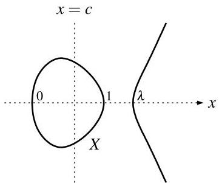
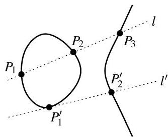
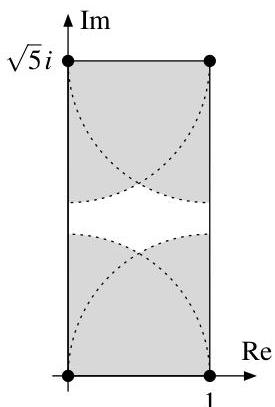
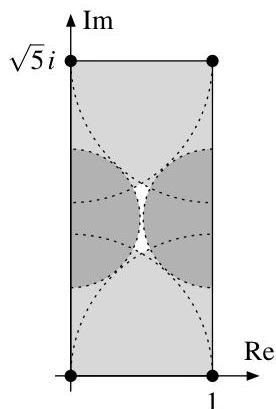

11. Dimension

# 11. Dimension

We have already met several situations in this course in which it seemed to be desirable to have a notion of dimension (of a variety, or more generally of a ring): for example, in the geometric interpretation of the Hilbert Basis Theorem in Remark 7.15, or of the Noether Normalization in Remark 10.6. We have also used the term “curve” several times already to refer to a “one-dimensional variety”, and even if we have not defined this rigorously yet it should be intuitively clear what this means. But although this concept of dimension is very intuitive and useful, it is unfortunately also one of the most complicated subjects in commutative algebra when it comes to actually proving theorems. We have now developed enough tools however to be able to study some basic dimension theory in this chapter without too many complications. Let us start with the definition of dimension, whose idea is similar to that of the length of a module in Definition 3.18.

**Definition 11.1 (Dimension).** Let $R$ be a ring.

(a) The (Krull) dimension $\dim R$ of $R$ is the maximum number $n \in \mathbb{N}$ such that there is a chain of prime ideals

$$
P_0 \subsetneq P_1 \subsetneq \cdots \subsetneq P_n
$$

of length $n$ in $R$.

In order to distinguish this notion of dimension from that of a $K$-vector space $V$, we will write the latter always as $\dim_K V$ in these notes.

(b) The codimension or height of a prime ideal $P$ in $R$ is the maximum number $n \in \mathbb{N}$ such that there is a chain as in (a) with $P_n \subset P$. We denote it by $\operatorname{codim}_R P$, or just $\operatorname{codim} P$ if the ring is clear from the context.

(c) The dimension $\dim X$ of a variety $X$ is defined to be the dimension of its coordinate ring $A(X)$. A 1-dimensional variety is called a curve. The codimension of an irreducible subvariety $Y$ in $X$ is defined to be the codimension of the prime ideal $I(Y)$ in $A(X)$ (see Remark 2.7 (b)); we denote it by $\operatorname{codim}_X Y$ or just $\operatorname{codim} Y$.

In all cases, we set the dimension resp. codimension formally to $\infty$ if there is no bound on the length of the chains considered. Also, note that in all cases there is at least one such chain (by Corollary 2.17 in (a), and the trivial length-0 chain with $P_0 = P$ in (b)), hence the definitions above make sense.

**Remark 11.2 (Geometric interpretation of dimension).** Let $X$ be a variety over an algebraically closed field. By Remark 2.7 (b) and Corollary 10.14, the prime ideals in the coordinate ring $A(X)$ are in one-to-one correspondence with non-empty irreducible subvarieties of $X$. As this correspondence reverses inclusions, Definition 11.1 says that the dimension of $X$ — or equivalently of its coordinate ring $A(X)$ — is equal to the biggest length $n$ of a chain

$$
X_0 \supseteq X_1 \supseteq \cdots \supseteq X_n \neq \emptyset
$$

of irreducible subvarieties of $X$. Now as in Remark 7.15 the geometric idea behind this definition is that making an irreducible subvariety smaller is only possible by reducing its dimension, so that in a maximal chain as above the dimension of $X_i$ should be $\dim X - i$, with $X_n$ being a point and $X_0$ an irreducible component of $X$.

Similarly, the codimension of an irreducible subvariety $Y$ in $X$ is the biggest length $n$ of a chain

$$
X_0 \supseteq X_1 \supseteq \cdots \supseteq X_n \supset Y.
$$

Again, for a maximal chain $X_0$ should be an irreducible component of $X$, and the dimension should drop by 1 in each inclusion in the chain. Moreover, we will have $X_n = Y$ in a maximal chain, so that we can think of $n$ as $\dim X - \dim Y$, and hence as what one would expect geometrically to be the codimension of $Y$ in $X$ (see Example 11.13 (a)).

---

Andreas Gathmann

# Example 11.3.

(a) Every field has dimension 0, since the zero ideal is the only prime ideal in this case.
(b) More generally, the dimension of a ring  $R$  is 0 if and only if there are no strict inclusions among prime ideals of  $R$ , i.e. if and only if all prime ideals are already maximal. So we can e.g. rephrase the theorem of Hopkins in Proposition 7.17 as

$R$  is Artinian  $\Leftrightarrow R$  is Noetherian and  $\dim R = 0$ .

Note that this fits well with the geometric interpretation of Remark 11.2, since we have already seen in Remark 7.15 that Artinian rings correspond to finite unions of points.

(c) Let  $R$  be a principal ideal domain which is not a field. Then except for the zero ideal (which is prime but not maximal) the notions of prime and maximal ideals agree by Example 2.6 (b). So the longest chains of prime ideals in  $R$  are all of the form  $0 \subsetneq P$  for a maximal ideal  $P$ . It follows that  $\dim R = 1$ .

In particular, the ring  $\mathbb{Z}$  and polynomial rings  $K[x]$  over a field  $K$  have dimension 1. Geometrically, this means that the variety  $\mathbb{A}_K^1$  (with coordinate ring  $K[x]$ ) has dimension 1.

Remark 11.4 (Maximal chains of prime ideals can have different lengths). One of the main obstacles when dealing with dimensions is that, in general, maximal chains of prime ideals as in Definition 11.1 (in the sense that they cannot be extended to a longer chain by inserting more prime ideals) do not necessarily all have the same length. This is easy to see in geometry, where the corresponding statement is roughly that a space can be made up of components of different dimension. Consider e.g. the union  $X = V(x_{1}x_{3},x_{2}x_{3})\subset \mathbb{A}_{\mathbb{R}}^{3}$  of a line and a plane as in Example 0.4 (e), and the following two chains of irreducible subvarieties in  $X$  of lengths 1 and 2, respectively.

The first chain  $X_0 \supseteq X_1$  is maximal by Example 11.3 (c), since the line has dimension 1. Nevertheless, the second chain is longer (and in fact also maximal, since the plane has dimension 2 as we will see in Proposition 11.9). Hence, due to the two components of  $X$  (of different dimension) the maximal chains in  $X$  have different lengths. Similarly, the same chains above show that the codimension of the point  $X_1$  is 1, whereas the codimension of the point  $Y_2$  is 2.

Let us state a few properties of dimension that are immediately obvious from the definition.

Remark 11.5 (First properties of dimension). Let  $R$  be a ring.

(a) For any prime ideal  $P \triangleleft R$ , the prime ideals of  $R$  contained in  $P$  are in one-to-one correspondence with prime ideals in the localization  $R_P$  by Example 6.8. In other words, we always have  $\operatorname{codim} P = \dim R_P$ .
(b) Again let  $P \triangleleft R$  be a prime ideal, and set  $n = \dim R / P$  and  $m = \operatorname{codim} P = \dim R_P$ . Then by Lemma 1.21 there are chains of prime ideals

$P_0\subsetneq \dots \subsetneq P_m\subset P$  and  $P\subset Q_0\subsetneq \dots \subsetneq Q_n$

---

in $R$ that can obviously be glued to a single chain of length $m+n$. Hence we conclude that

$\dim R\geq\dim R/P+\operatorname{codim}P.$

Geometrically, this means for an irreducible subvariety $Y$ of a variety $X$ that

$\dim X\geq\dim Y+\operatorname{codim}_{X}Y,$

since $A(Y)\cong A(X)/I(Y)$ by Lemma 0.9 (d). Note that we do not have equality in general, since e. g. $\dim X_{1}=0$ and $\operatorname{codim}X_{1}=1$ in the example of Remark 11.4.
3. Dimension is a “local concept”: we claim that

$\dim R=\sup\{\dim R_{P}:P\text{ maximal ideal of }R\}=\sup\{\operatorname{codim}P:P\text{ maximal ideal of }R\}.$

In fact, if $P_{0}\subsetneq\cdots\subsetneq P_{n}$ is a chain of prime ideals in $R$ then by Example 6.8 the corresponding localized chain is a chain of primes ideals of the same length in $R_{P}$, where $P$ is any maximal ideal containing $P_{n}$. Conversely, any chain of prime ideals in a localization $R_{P}$ corresponds to a chain of prime ideals (contained in $P$) of the same length in $R$.

Geometrically, we can think of this as the statement that the dimension of a variety is the maximum of the “local dimensions” at every point — so that e. g. the union of a line and a plane in Remark 11.4 has dimension 2.

In the favorable case when all maximal chains of prime ideals do have the same length, the properties of Remark 11.5 hold in a slightly stronger version. We will see in Corollary 11.12 that this always happens e. g. for coordinate rings of irreducible varieties. In this case, the dimension and codimension of a subvariety always add up to the dimension of the ambient variety, and the local dimension is the same at all points.

###### Lemma 11.6.

Let $R$ be a ring of finite dimension in which all maximal chains of prime ideals have the same length. Moreover, let $P\trianglelefteq R$ be a prime ideal. Then:

1. The quotient $R/P$ is also a ring of finite dimension in which all maximal chains of prime ideals have the same length;
2. $\dim R=\dim R/P+\operatorname{codim}P$;
3. $\dim R_{P}=\dim R$ if $P$ is maximal.

###### Proof.

By Lemma 1.21 and Corollary 2.4, a chain of prime ideals in $R/P$ corresponds to a chain $Q_{0}\subsetneq\cdots\subsetneq Q_{r}$ of prime ideals in $R$ that contain $P$. In particular, the length of such chains is bounded by $\dim R<\infty$, and hence $\dim R/P<\infty$ as well. Moreover, if the chain is maximal we must have $Q_{0}=P$, and thus we can extend it to a maximal chain

$P_{0}\subsetneq\cdots\subsetneq P_{m}=P=Q_{0}\subsetneq\cdots\subsetneq Q_{r}$

of prime ideals in $R$ that includes $P$. The chains $P_{0}\subsetneq\cdots\subsetneq P_{m}$ and $Q_{0}\subsetneq\cdots\subsetneq Q_{r}$ then mean that $\operatorname{codim}P\geq m$ and $\dim R/P\geq r$. Moreover, we have $m+r=\dim R$ by assumption. Hence

$\dim R\geq\dim R/P+\operatorname{codim}P\geq\dim R/P+m\geq r+m=\dim R$

by Remark 11.5 (b), and so equality holds. This shows $r=\dim R/P$ and hence (a), and of course also (b). The statement (c) follows from (b), since for maximal $P$ we have $\dim R/P=0$ by Example 11.3 (a), and $\dim R_{P}=\operatorname{codim}P$ by Remark 11.5 (a). ∎

###### Exercise 11.7.

Let $I=Q_{1}\cap\cdots\cap Q_{n}$ be a primary decomposition of an ideal $I$ in a Noetherian ring $R$. Show that

$\dim R/I=\max\{\dim R/P:P\text{ is an isolated prime ideal of }I\}.$

What is the geometric interpretation of this statement?

Let us now show that, in a Noether normalization $K[z_{1},\ldots,z_{r}]\to R$ of a finitely generated algebra $R$ over a field $K$ as in Proposition 10.5, the number $r$ is uniquely determined to be $\dim R$ — as already motivated in Remark 10.6. More precisely, this will follow from the following two geometrically intuitive facts:

---

Andreas Gathmann

- Integral extensions preserve dimension: by Example 9.19, they correspond to surjective maps of varieties with finite fibers, and thus the dimension of the source and target of the map should be the same.
- The dimension of the polynomial ring  $K[x_1, \ldots, x_n]$  (and thus of the variety  $\mathbb{A}_K^n$ ) is  $n$ .

We will start with the proof of the first of these statements.

Lemma 11.8 (Invariance of dimension under integral extensions). For any integral ring extension  $R \subset R'$  we have  $\dim R = \dim R'$ .

Proof.

"≤" Let  $P_0 \subsetneq \dots \subsetneq P_n$  be a chain of prime ideals in  $R$ . By Lying Over (for  $P_0$ ) and Going Up (successively for  $P_1, \ldots, P_n$ ) as in Propositions 9.18 and 9.24 we can find a corresponding chain  $P_0' \subsetneq \dots \subsetneq P_n'$  of the same length in  $R'$  (where the inclusions have to be strict again since  $P_i' \cap R = P_i$  for all  $i$ ).
"≥" Now let  $P_0' \subsetneq \dots \subsetneq P_n'$  be a chain of prime ideals in  $R'$ . Intersecting with  $R$  we get a chain of prime ideals  $P_0 \subsetneq \dots \subsetneq P_n$  in  $R$  by Exercise 2.9 (b), where the inclusions are strict again by Incomparability as in Proposition 9.20.

For the statement that  $\dim K[x_1, \ldots, x_n] = n$  we can actually right away prove the stronger result that every chain of prime ideals has length  $n$ , and thus e.g. by Lemma 11.6 (c) that the local dimension of  $K[x_1, \ldots, x_n]$  is the same at all maximal ideals. This is not too surprising if  $K$  is algebraically closed, since then all maximal ideals of  $K[x_1, \ldots, x_n]$  are of the form  $(x_1 - a_1, \ldots, x_n - a_n)$  by Corollary 10.10, and thus can all be obtained from each other by translations. But for general fields there will be more maximal ideals in the polynomial ring, and thus the statement that all such localizations have the same dimension is far less obvious.

Proposition 11.9 (Dimension of polynomial rings). Let  $K$  be a field, and let  $n \in \mathbb{N}$ .

(a)  $\dim K[x_1,\ldots ,x_n] = n$
(b) All maximal chains of prime ideals in  $K[x_1, \ldots, x_n]$  have length  $n$ .

Proof. We will prove both statements by induction on  $n$ , with the case  $n = 0$  being obvious. (In fact, we also know the statement for  $n = 1$  already by Example 11.3 (c)).

So let  $n \geq 1$ , and let  $P_0 \subsetneq \dots \subsetneq P_m$  be a chain of prime ideals in  $K[x_1, \ldots, x_n]$ . We have to show that  $m \leq n$ , and that equality always holds for a maximal chain. By possibly extending the chain we may assume without loss of generality that  $P_0 = 0$ ,  $P_1$  is a minimal non-zero prime ideal, and  $P_m$  is a maximal ideal. Then  $P_1 = (f)$  for some non-zero polynomial  $f$  by Exercise 8.32 (b), since  $K[x_1, \ldots, x_n]$  is a unique factorization domain by Remark 8.6.

By a change of coordinates as in the proof of the Noether normalization in Proposition 10.5 we can also assume without loss of generality that  $f$  is monic in  $x_{n}$ , and hence that  $K[x_1, \ldots, x_n] / P_1 = K[x_1, \ldots, x_n] / (f)$  is integral over  $K[x_1, \ldots, x_{n-1}]$  by Proposition 9.5. We can now transfer our chain of prime ideals from  $K[x_1, \ldots, x_n]$  to  $K[x_1, \ldots, x_{n-1}]$  as in the diagram below: after dropping the first prime ideal  $P_0$ , first extend the chain by the quotient map  $K[x_1, \ldots, x_n] \to K[x_1, \ldots, x_n] / P_1$ , and then contract it by the integral ring extension  $K[x_1, \ldots, x_{n-1}] \to K[x_1, \ldots, x_n] / P_1$ .

---

11. Dimension

We claim that both these steps preserve prime ideals and their strict inclusions, and transfer maximal chains to maximal chains. In fact, for the extension along the quotient map this follows from the one-to-one correspondence between prime ideals in rings and their quotients as in Lemma 1.21 and Corollary 2.4. The contraction then maps prime ideals to prime ideals by Exercise 2.9 (b), and keeps the strict inclusions by the Incomparability property of Proposition 9.20. Moreover, it also preserves maximal chains: in the bottom chain of the above diagram the first entry is 0, the last one is a maximal ideal by Corollary 9.21 (b), and if we could insert another prime ideal at any step in the chain we could do the same in the middle chain as well by Exercise 10.8 (a).

Now by the induction hypothesis the length $m-1$ of the bottom chain is at most $n-1$, and equal to $n-1$ if the chain is maximal. Hence we always have $m\leq n$, and $m=n$ if the original chain was maximal. ∎

###### Remark 11.10 (Noether normalization and dimension).

Let $R$ be a finitely generated algebra over a field $K$, and let $K[z_{1},\ldots,z_{n}]\to R$ be a Noether normalization as in Proposition 10.5. Using Lemma 11.8 and Proposition 11.9 we now see rigorously that then the number $n$ is uniquely determined to be $n=\dim K[z_{1},\ldots,z_{n}]=\dim R$, as already expected in Remark 10.6. In particular, it follows that a finitely generated algebra over a field (and hence a variety) is always of finite dimension — a statement that is not obvious from the definitions! In fact, the following exercise shows that the finite dimension and Noetherian conditions are unrelated, although rings that meet one of these properties but not the other do not occur very often in practice.

###### Exercise 11.11 (Finite dimension $\Longleftrightarrow$ noetherian).

Give an example of a non-Noetherian ring of finite dimension.

In fact, there are also Noetherian rings which do not have finite dimension, but these are hard to construct *[x10, Exercise 9.6]*.

###### Corollary 11.12.

Let $R$ be a finitely generated algebra over a field $K$, and assume that $R$ is an integral domain. Then every maximal chain of prime ideals in $R$ has length $\dim R$.

###### Proof.

By Lemma 1.30 and Lemma 2.3 (a) we can write $R=K[x_{1},\ldots,x_{n}]/P$ for a prime ideal $P$ in a polynomial ring $K[x_{1},\ldots,x_{n}]$. Thus the statement follows from Proposition 11.9 (b) with Lemma 11.6 (a). ∎

###### Example 11.13.

Let $Y$ be an irreducible subvariety of an irreducible variety $X$. Then by Corollary 11.12 every maximal chain of prime ideals in $A(X)$ has the same length, and consequently Lemma 11.6 for $R=A(X)$ implies that

1. $\dim X=\dim Y+\operatorname{codim}_{X}Y$ for every irreducible subvariety $Y$ of $X$ (since then $P=I(Y)$ is a prime ideal and $R/P\cong A(Y)$);
2. the local dimension of $X$ is $\dim X$ at every point, i. e. all localizations of $A(X)$ at maximal ideals have dimension $\dim X$.

Next, let us study how the codimension of a prime ideal is related to the number of generators of the ideal. Geometrically, one would expect that an irreducible subvariety given by $n$ equations has codimension at most $n$, with equality holding if the equations are “independent” in a suitable sense. More generally, if the zero locus of the given equations is not irreducible, each of its irreducible components should have codimension at most $n$.

Algebraically, if $I=(a_{1},\ldots,a_{n})$ is an ideal in a coordinate ring generated by $n$ elements, the irreducible components of $V(I)$ are the maximal irreducible subvarieties of $V(I)$ and thus correspond to the minimal prime ideals over $I$ as in Exercise 2.23. So our geometric idea above leads us to the expectation that a minimal prime ideal over an ideal generated by $n$ elements should have codimension at most $n$.

We will now prove this statement by induction on $n$ for any Noetherian ring. For the proof we need the following construction of the so-called symbolic powers $P^{(k)}$ of a prime ideal $P$ in a ring $R$. Their behavior is very similar to that of the ordinary powers $P^{k}$; in fact the two notions agree after

---

localization at $P$ as we will see in the next lemma. The main advantage of the symbolic powers is that they are always primary (in contrast to the ordinary powers, see Example 8.13).

###### Lemma 11.14 (Symbolic Powers).

Let $R$ be a ring. For a prime ideal $P\trianglelefteq R$ and $n\in\mathbb{N}$ consider the ideal

$P^{(n)}:=\{a\in R:ab\in P^{n}\text{ for some }b\in R\backslash P\}$

called the $n$-th symbolic power of $P$. Then:

1. $P^{n}\subset P^{(n)}\subset P$;
2. $P^{(n)}$ is $P$-primary;
3. $P^{(n)}\,R_{P}=P^{n}\,R_{P}$.

###### Proof.

1. The first inclusion is obvious (take $b=1$). For the second, let $a\in P^{(n)}$, hence $ab\in P^{n}\subset P$ for some $b\in R\backslash P$. But then $a\in P$ since $P$ is prime.
2. Taking radicals in (a) we see that $P=\sqrt{P}=\sqrt{P^{n}}\subset\sqrt{P^{(n)}}\subset\sqrt{P}=P$, so $\sqrt{P^{(n)}}=P$. To see that $P^{(n)}$ is $P$-primary, let $ab\in P^{(n)}$, i. e. $abc\in P^{n}$ for some $c\in R\backslash P$. Then if $b\notin\sqrt{P^{(n)}}=P$ we also have $bc\notin P$ and thus by definition $a\in P^{(n)}$. Hence $P^{(n)}$ is $P$-primary.
3. For the inclusion “$\subset$”, let $\frac{b}{s}\in P^{(n)}\,R_{P}$, i. e. $bc\in P^{n}$ for some $s,c\in R\backslash P$. Then $\frac{b}{s}=\frac{bc}{sc}\in P^{n}\,R_{P}$. The other inclusions is obvious since $P^{(n)}\supset P^{n}$. ∎

###### Proposition 11.15 (Krull’s Principal Ideal Theorem).

Let $R$ be a Noetherian ring, and let $a\in R$. Then every minimal prime ideal $P$ over $(a)$ satisfies $\operatorname{codim}P\leq 1$.

###### Proof.

Let $Q^{\prime}\subset Q\subsetneq P$ be a chain of prime ideals in $R$; we have to prove that $Q^{\prime}=Q$. By the one-to-one correspondence of Example 6.8 between prime ideals in $R$ and in its quotients resp. localizations we can take the quotient by $Q^{\prime}$ and localize at $P$ and prove the statement in the resulting ring, which we will again call $R$ for simplicity. Note that this new ring is also still Noetherian by Remark 7.8 (b) and Exercise 7.23. In this new situation we then have:

- by taking the quotient we achieved that $Q^{\prime}=0$ and $R$ is an integral domain;
- by localizing we achieved that $R$ is local, with unique maximal ideal $P$;
- we have to prove that $Q=0$.

Let us now consider the symbolic powers $Q^{(n)}$ of Lemma 11.14. Obviously, we have $Q^{(n+1)}\subset Q^{(n)}$ for all $n$. Moreover:

1. $Q^{(n)}\subset Q^{(n+1)}+(a)$ for some $n$: The ring $R/(a)$ is Noetherian by Remark 7.8 (b) and of dimension $0$ since the unique maximal ideal $P/(a)$ of $R/(a)$ is also minimal by assumption. Hence $R/(a)$ is Artinian by Hopkins as in Example 11.3 (b). This means that the descending chain

$(Q^{(0)}+(a))/(a)\ \supseteq\ \ (Q^{(1)}+(a))/(a)\ \supseteq\ \ \cdots$

of ideals in $R/(a)$ becomes stationary. Hence $Q^{(n)}+(a)=Q^{(n+1)}+(a)$ for some $n$, which implies $Q^{(n)}\subset Q^{(n+1)}+(a)$.
2. $Q^{(n)}=Q^{(n+1)}+P\,Q^{(n)}$: The inclusion “$\supset$” is clear, so let us prove “$\subset$”. If $b\in Q^{(n)}$ then $b=c+ar$ for some $c\in Q^{(n+1)}$ and $r\in R$ by (a). So $ar=b-c\in Q^{(n)}$. But $a\notin Q$ (otherwise $P$ would not be minimal over $(a)$) and $Q^{(n)}$ is $Q$-primary by Lemma 11.14 (b), and hence $r\in Q^{(n)}$. But this means that $b=c+ar\in Q^{(n+1)}+P\,Q^{(n)}$.

Taking the quotient by $Q^{(n+1)}$ in the equation of (b) we see that $Q^{(n)}/Q^{(n+1)}=P\,Q^{(n)}/Q^{(n+1)}$, and hence that $Q^{(n)}/Q^{(n+1)}=0$ by Nakayama’s Lemma as in Exercise 6.16 (a). This means that $Q^{(n)}=Q^{(n+1)}$. By Lemma 11.14 (c), localization at $Q$ now gives $Q^{n}\,R_{Q}=Q^{n+1}\,R_{Q}$, hence $Q^{n}\,R_{Q}=(Q\,R_{Q})\,Q^{n}\,R_{Q}$ by Exercise 1.19 (c), and so $Q^{n}\,R_{Q}=0$ by Exercise 6.16 (a) again. But as $R$ is an integral domain, this is only possible if $Q=0$. ∎

##

---

11. Dimension

Exercise 11.16. Let $n \in \mathbb{N}_{&gt;0}$, and let $P_0 \subsetneq P_1 \subsetneq \dots \subsetneq P_n$ be a chain of prime ideals in a Noetherian ring $R$. Moreover, let $a \in P_n$. Prove:

(a) There is a chain of prime ideals $P_0' \subsetneq P_1' \subsetneq \dots \subsetneq P_{n-1}' \subsetneq P_n$ (i.e. in the given chain we may change all prime ideals except the last one) such that $a \in P_1'$.

(b) There is in general no such chain with $a \in P_0'$.

Corollary 11.17. Let $R$ be a Noetherian ring, and let $a_1, \ldots, a_n \in R$. Then every minimal prime ideal $P$ over $(a_1, \ldots, a_n)$ satisfies $\operatorname{codim} P \leq n$.

Proof. We will prove the statement by induction on $n$; the case $n = 1$ is Proposition 11.15. So let $n \geq 2$, and let $P_0 \subsetneq \dots \subsetneq P_s$ be a chain of prime ideals in $P$. After possibly changing some of these prime ideals (except the last one), we may assume by Exercise 11.16 (a) that $a_n \in P_1$. But then

$$
P_1 / (a_n) \subsetneq \dots \subsetneq P_s / (a_n)
$$

is a chain of prime ideals of length $s - 1$ in $P / (a_n)$. As $P / (a_n)$ is minimal over $(\overline{a_1},\ldots ,\overline{a_{n - 1}})$, we now know by induction that $s - 1 \leq \mathrm{codim} P / (a_n) \leq n - 1$, and hence that $s \leq n$. As the given chain was arbitrary, this means that $\mathrm{codim} P \leq n$.

Remark 11.18 (Geometric interpretation of Krull's Principal Ideal Theorem). Let $R$ be the coordinate ring of a variety $X \subset \mathbb{A}_R^n$ over $K$, and let $I = (f_1, \ldots, f_r) \trianglelefteq R$ be an ideal generated by $r$ elements. As mentioned above, the minimal prime ideals over $I$ correspond to the irreducible components of $V(I)$. Hence, Corollary 11.17 states geometrically that every irreducible component of $V(I)$ has codimension at most $r$, and thus by Example 11.13 (a) dimension at least $n - r$.

For the case of a principal ideal $(a)$, we can even give an easy criterion for when equality holds in Proposition 11.15. Geometrically, intersecting a variety $X$ with the zero locus of a polynomial $f$ reduces the dimension if the polynomial does not vanish identically on any irreducible component of $X$, i.e. if $f$ is not a zero divisor in $A(X)$:

Corollary 11.19. Let $R$ be a Noetherian ring, and let $a \in R$ not be a zero-divisor. Then for every minimal prime ideal $P$ over $(a)$ we have $\operatorname{codim} P = 1$.

Proof. Let $P_1, \ldots, P_n$ be the minimal prime ideals over the zero ideal as in Corollary 8.30. By Proposition 8.27 they can be written as $P_i = \sqrt{0 : b_i}$ for some non-zero $b_1, \ldots, b_n \in R$.

We claim that $a \notin P_i$ for all $i = 1, \ldots, n$. In fact, if $a \in P_i$ for some $i$ then $a \in \sqrt{0 : b_i}$, and hence $a^r b_i = 0$ for some $r \in \mathbb{N}_{&gt;0}$. But if we choose $r$ minimal then $a \cdot (a^{r-1} b_i) = 0$ although $a^{r-1} b_i \neq 0$, i.e. $a$ would have to be a zero-divisor in contradiction to our assumption.

So $a \notin P_i$ for all $i$. But on the other hand $a \in P$, and hence $P$ cannot be any of the minimal prime ideals $P_1, \ldots, P_n$ of $R$. So $P$ must strictly contain one of the $P_1, \ldots, P_n$, which means that $\operatorname{codim} P \geq 1$. The equality $\operatorname{codim} P = 1$ now follows from Proposition 11.15.

Example 11.20. Let $X = V(x^{2} + y^{2} - 1) \subset \mathbb{A}_{\mathbb{R}}^{2}$ be the unit circle. As its coordinate ring is $R = \mathbb{R}[x,y] / (x^{2} + y^{2} - 1)$ and the ideal $(x^{2} + y^{2} - 1)$ is prime, we get as expected that $X$ has dimension

$$
\begin{array}{l}
\dim X = \dim R = \dim \mathbb{R}[x, y] - \operatorname{codim}(x^{2} + y^{2} - 1) \quad (\text{Lemma 11.6 (b) and Proposition 11.9 (b)}) \\
= 2 - 1 \quad (\text{Proposition 11.9 (a) and Corollary 11.19}) \\
= 1.
\end{array}
$$

With an analogous computation, note that the ring $\mathbb{R}[x,y] / (x^2 + y^2 + 1)$ has dimension 1 as well, although $V(x^2 + y^2 + 1) = \emptyset$ in $\mathbb{A}_{\mathbb{R}}^2$.

Exercise 11.21. Compute the dimension and all maximal ideals of $\mathbb{C}[x,y,z] / (x^2 - y^2, z^2 x - z^2 y)$.

Exercise 11.22. Show:

(a) Every maximal ideal in the polynomial ring $\mathbb{Z}[x]$ is of the form $(p, f)$ for some prime number $p \in \mathbb{Z}$ and a polynomial $f \in \mathbb{Z}[x]$ whose class in $\mathbb{Z}_p[x] = \mathbb{Z}[x] / (p)$ is irreducible.

---

Andreas Gathmann

(b) $\dim \mathbb{Z}[x] = 2$.

Exercise 11.23. For each of the two ring extensions $R \subset R'$

$$
\mathrm{(i)} \quad \mathbb{R}[y] \subset \mathbb{R}[x,y]/(x^2 - y) \quad \quad \quad \mathrm{(ii)} \quad \mathbb{Z} \subset \mathbb{Z}[x]/(x^2 - 3)
$$

find:

(a) a non-zero prime ideal $P \trianglelefteq R$ with a unique prime ideal $P' \trianglelefteq R'$ lying over $P$, and $R'/P' \cong R/P$;
(b) a non-zero prime ideal $P \trianglelefteq R$ with a unique prime ideal $P' \trianglelefteq R'$ lying over $P$, and $R'/P' \not\cong R/P$;
(c) a non-zero prime ideal $P \trianglelefteq R$ such that there is more than one prime ideal in $R'$ lying over $P$.

(In these three cases the prime ideal $P$ is then called ramified, inert, and split, respectively. Can you see the reason for these names?)

Exercise 11.24. Let $R = \mathbb{C}[x,y,z,w]/I$ with $I = (x,y) \cap (z,w)$, and let $a = \overline{x + y + z + w} \in R$. By Krull’s Principal Ideal Theorem we know that every isolated prime ideal of $(a)$ in $R$ has codimension at most 1. However, show now that $(a)$ has an embedded prime ideal of codimension 2.

We have now studied the Krull dimension of rings as in Definition 11.1 in some detail. In the rest of this chapter, we want to discuss two more approaches to define the notion of dimension. Both of them will turn out to give the same result as the Krull dimension in many (but not in all) cases.

The first construction is based on the idea that the dimension of a variety $X$ over a field $K$ can be thought of as the number of independent variables needed to describe its points. In more algebraic terms, this means that $\dim X$ should be the maximum number of functions on $X$ that are “algebraically independent” in the sense that they do not satisfy a polynomial relation with coefficients in $K$. This notion of algebraic independence is best-behaved for extensions of fields, and so we will restrict ourselves to irreducible varieties: in this case $A(X)$ is a finitely generated $K$-algebra that is an integral domain, and hence we can consider its quotient field $\operatorname{Quot} R$ as an extension field of $K$ (i.e. consider rational instead of polynomial functions on $X$).

Definition 11.25 (Algebraic dependence, transcendence bases). Let $K \subset L$ be a field extension, and let $B$ be a subset of $L$. As usual, we denote by $K(B)$ the smallest subfield of $L$ containing $K$ and $B$ [G3, Definition 1.13].

(a) The subset $B$ is called algebraically dependent over $K$ if there is a non-zero polynomial $f \in K[x_1, \ldots, x_n]$ with $f(b_1, \ldots, b_n) = 0$ for some distinct $b_1, \ldots, b_n \in B$. Otherwise $B$ is called algebraically independent.
(b) The subset $B$ is called a transcendence basis of $L$ over $K$ if it is algebraically independent and $L$ is algebraic over $K(B)$.

Example 11.26.

(a) Let $K \subset L$ be a field extension, and let $a \in L$. Then $\{a\}$ is algebraically dependent over $K$ if and only if $a$ is algebraic over $K$.
(b) Let $R = K[x_1, \ldots, x_n]$ be the polynomial ring in $n$ variables over a field $K$, and let

$$
L = \operatorname{Quot} R = \left\{ \frac{f}{g} : f, g \in K[x_1, \ldots, x_n], g \neq 0 \right\}
$$

be its quotient field, i.e. the field of formal rational functions in $n$ variables over $K$.

This field is usually denoted by $K(x_{1},\ldots ,x_{n})$, and thus by the same round bracket notation as for the smallest extension field of $K$ containing given elements of a larger field — which can be described explicitly as the set of all rational functions in these elements with coefficients in $K$. Note that this ambiguity is completely analogous to the square bracket notation $K[x_1,\dots,x_n]$ which is also used to denote both polynomial expressions in formal variables (to obtain the polynomial ring) or in given elements of an extension ring (to form the subalgebra generated by these elements).

---

11. Dimension

The set $B = \{x_{1},\ldots ,x_{n}\}$ is clearly a transcendence basis of $L$ over $K$: these elements are obviously algebraically independent by definition, and the smallest subfield of $L$ containing $K$ and $x_{1},\ldots ,x_{n}$ is just $L$ itself.

**Remark 11.27.** In contrast to what one might expect, the definition of a transcendence basis $B$ of a field extension $K \subset L$ does not state that $L$ is generated by $B$ in some sense — it is only generated by $B$ up to algebraic extensions. For example, the empty set is a transcendence basis of every algebraic field extension.

It is true however that a transcendence basis is a “maximal algebraically independent subset”: any element $a \in L \backslash B$ is algebraic over $K(B)$, and thus $B \cup \{a\}$ is algebraically dependent.

As expected, we can now show that transcendence bases always exist, and that all transcendence bases of a given field extension have the same number of elements.

**Lemma 11.28 (Existence of transcendence bases).** Let $K \subset L$ be a field extension. Moreover, let $A \subset L$ be algebraically independent over $K$, and let $C \subset L$ be a subset such that $L$ is algebraic over $K(C)$. Then $A$ can be extended by a suitable subset of $C$ to a transcendence basis of $L$ over $K$.

In particular, every field extension has a transcendence basis.

**Proof.** Let

$$
M = \{B: B \text{ is algebraically independent over } K \text{ with } A \subset B \subset A \cup C\}.
$$

Then every totally ordered subset $N \subset M$ has an upper bound $B$: if $N = \emptyset$ we can take $A \in M$, otherwise $\bigcup_{B \in N} B$. Note that the latter is indeed an element of $M$:

- Assume that $\bigcup_{B \in N} B$ is algebraically dependent. Then $f(b_1, \ldots, b_n) = 0$ for a non-zero polynomial $f$ over $K$ and distinct elements $b_1, \ldots, b_n \in \bigcup_{B \in N} B$. But as $N$ is totally ordered we must already have $b_1, \ldots, b_n \in B$ for some $B \in N$, in contradiction to $B$ being algebraically independent over $K$.
- We have $A \subset \bigcup_{B \in N} B \subset A \cup C$ since $A \subset B \subset A \cup C$ for all $B \in N$.

Hence $M$ has a maximal element $B$. We claim that $B$ is a transcendence basis of $L$ over $K$. In fact, as an element of $M$ we know that $B$ is algebraically independent. Moreover, since $B$ is maximal every element of $C$ is algebraic over $K(B)$, hence $K(C)$ is algebraic over $K(B)$ [G3, Exercise 2.27 (a)], and so $L$ is algebraic over $K(B)$ by Lemma 9.6 (b) since $L$ is algebraic over $K(C)$ by assumption.

**Proposition and Definition 11.29 (Transcendence degree).** Let $K \subset L$ be a field extension. If $L$ has a finite transcendence basis over $K$, then all such transcendence bases are finite and have the same number $n$ of elements. In this case we call this number $n$ the **transcendence degree** $\operatorname{tr} \deg_K L$ of $L$ over $K$. Otherwise, we set formally $\operatorname{tr} \deg_K L = \infty$.

**Proof.** Let $B$ and $C$ be transcendence bases of $L$ over $K$, and assume that $B = \{b_1, \ldots, b_n\}$ has $n$ elements. By symmetry, it suffices to show that $|C| \leq |B|$. We will prove this by induction on $n$, with the case $n = 0$ being obvious since then $K \subset L$ is algebraic, and hence necessarily $C = \emptyset$.

So assume now that $n &gt; 0$. As we are done if $C \subset B$, we can pick an element $c \in C \backslash B$, which is necessarily transcendental. By Lemma 11.28 we can extend it to a transcendence basis $B'$ by elements of $B$. Note that $B'$ can have at most $n$ elements: the set $\{c, b_1, \ldots, b_n\}$ is algebraically dependent since $B$ is a transcendence basis.

So $B'$ and $C$ are two transcendence bases of $L$ over $K$ that both contain $c$. Hence $B' \setminus \{c\}$ and $C \setminus \{c\}$ are two transcendence bases of $L$ over $K(c)$. By induction this means that $|B' \setminus \{c\}| = |C \setminus \{c\}|$, and hence that $|C| = |C \setminus \{c\}| + 1 = |B' \setminus \{c\}| + 1 \leq n = |B|$ as desired.

**Example 11.30.**

(a) A field extension is algebraic if and only if it has transcendence degree 0.

---

Andreas Gathmann

(b) Given that  $\pi$  is transcendental over  $\mathbb{Q}$ , the field extensions  $\mathbb{Q} \subset \mathbb{Q}(\pi)$  and  $\mathbb{Q} \subset \mathbb{Q}(\pi, \sqrt{2})$  both have transcendence degree 1, with  $\{\pi\}$  as a transcendence basis. The field extension  $\mathbb{Q} \subset \mathbb{C}$  has infinite transcendence degree, since the set of all rational functions in finitely many elements with coefficients in  $\mathbb{Q}$  is countable, whereas  $\mathbb{C}$  is uncountable.
(c) The quotient field  $K(x_{1},\ldots ,x_{n})$  of the polynomial ring  $K[x_1,\dots,x_n]$  has transcendence degree  $n$  over  $K$ , since  $\{x_{1},\ldots ,x_{n}\}$  is a transcendence basis by Example 11.26 (b).

With the notion of transcendence degree we can now give another interpretation of the dimension of an irreducible variety — or more generally of a finitely generated algebra over a field which is a domain.

Proposition 11.31 (Transcendence degree as dimension). Let  $R$  be a finitely generated algebra over a field  $K$ , and assume that  $R$  is an integral domain. Then  $\dim R = \operatorname{tr} \deg_K \operatorname{Quot} R$ .

Proof. Let  $K[z_1, \ldots, z_n] \to R$  be a Noether normalization as in Proposition 10.5, where  $n = \dim R$  by Remark 11.10. Then  $\operatorname{Quot} R$  is algebraic over  $\operatorname{Quot} K[z_1, \ldots, z_n] = K(z_1, \ldots, z_n)$ : if  $a, b \in R$  with  $b \neq 0$  then  $a$  and  $b$  are integral over  $K[z_1, \ldots, z_n]$ , hence algebraic over  $K(z_1, \ldots, z_n)$ . Therefore  $K(z_1, \ldots, z_n)(a, b)$  is algebraic over  $K(z_1, \ldots, z_n)$  [G3, Exercise 2.27 (a)], which implies that  $\frac{a}{b} \in \operatorname{Quot} R$  is algebraic over  $K(z_1, \ldots, z_n)$ .

But this means that the transcendence basis  $\{z_1,\ldots ,z_n\}$  of  $K(z_{1},\dots ,z_{n})$  over  $K$  (see Example 11.26 (b)) is also a transcendence basis of  $\mathrm{Quot}R$  over  $K$ , i.e. that  $\operatorname {tr}\deg_K\operatorname {Quot}R = n = \dim R$ .

Exercise 11.32. Let  $K$  be a field, and let  $R$  be a  $K$ -algebra which is an integral domain. If  $R$  is finitely generated we know by Proposition 11.31 that  $\dim R = \operatorname{tr} \deg_K \operatorname{Quot} R$ . Now drop the assumption that  $R$  is finitely generated and show:

(a)  $\dim R\leq \operatorname {tr}\deg_K\operatorname {Quot}R$
(b) The inequality in (a) may be strict.

Exercise 11.33. Let  $X \subset \mathbb{A}_K^n$  and  $Y \subset \mathbb{A}_K^m$  be varieties over a field  $K$ . Prove:

(a)  $\dim (X\times Y) = \dim X + \dim Y$
(b) If  $n = m$  then every irreducible component of  $X \cap Y$  has dimension at least  $\dim X + \dim Y - n$ .

Finally, another approach to the notion of dimension is given by linearization. If  $a$  is a point of a variety  $X \subset \mathbb{A}_K^n$  over a field  $K$  we can try to approximate  $X$  around  $a$  by an affine linear space in  $\mathbb{A}_K^n$ , and consider its dimension to be some sort of local dimension of  $X$  at  $a$ . Let us describe the precise construction of this linear space.

**Construction 11.34 (Tangent spaces).** Let us consider a variety  $X \subset \mathbb{A}_K^n$  with coordinate ring  $A(X) = K[x_1, \ldots, x_n] / I(X)$ , and let  $a = (a_1, \ldots, a_n) \in X$ . By a linear change of coordinates  $y_i := x_i - a_i$  we can shift  $a$  to the origin.

Consider the "differential" map

$$
d: K [ x _ {1}, \dots , x _ {n} ] \to K [ y _ {1}, \dots , y _ {n} ], f \mapsto \sum_ {i = 1} ^ {n} \frac {\partial f}{\partial x _ {i}} (a) \cdot y _ {i},
$$

where  $\frac{\partial f}{\partial x_i}$  denotes the formal derivative of  $f$  with respect to  $x_{i}$  [G1, Exercise 9.10]. It can be thought of as assigning to a polynomial  $f$  its linear term in the Taylor expansion at the point  $a$ . We then define the tangent space to  $X$  at  $a$  to be

$$
T _ {o} X := V (\{d f: f \in I (X) \}) \quad \subset K ^ {n}, \tag {*}
$$

i.e. we take all equations describing  $X$ , linearize them at the point  $a$ , and take the common zero locus of these linearizations. As in the picture above we can therefore think of  $T_{o}X$  as the linear space that gives the best approximation of  $X$  at  $a$ . Note that it suffices in (*) to let  $f$  range over a generating set for  $I(X)$ , since for  $f, g \in I(X)$  and  $h \in K[x_1, \ldots, x_n]$  we have

$$
d (f + g) = d f + d g \quad \text {a n d} \quad d (h f) = h (a) d f + f (a) d h = h (a) d f.
$$

---

11. Dimension

In order to transfer these ideas to other non-geometric cases we need an alternative description of the tangent space: let $P = I(a) = (\overline{y_1},\dots ,\overline{y_n})\trianglelefteq A(X)$ be the (maximal) ideal of the point $a$, and consider the $K$-linear map

$$
\varphi : P \to \operatorname {H o m} _ {K} (T _ {a} X, K), \quad \overline {{f}} \mapsto d f | _ {T _ {a} X}
$$

(that is well-defined by the definition $(*)$ of $T_{a}X$). It is clearly surjective since every linear map on $T_{a}X$ must be a linear combination of the coordinate functions. Moreover, we claim that $\ker \varphi = P^2$ :

“$\subset$” Let $\varphi(\overline{f}) = df|_{T_aX} = 0$. Note that $L \coloneqq \{dg : g \in I(X)\}$ is a linear subspace of $\langle y_1, \ldots, y_n \rangle$ of some dimension $k$. Its zero locus $T_aX$ then has dimension $n - k$. Hence the space of all linear forms vanishing on $T_aX$ has dimension $k$ again and clearly contains $L$, and thus must be equal to $L$. As $df$ lies in this space, we conclude that $df = dg$ for some $g \in I(X)$. Then $d(f - g) = 0$, and thus the Taylor expansion of $f - g$ at $a$ does not contain constant or linear terms. Hence $\overline{f} = \overline{f - g} \in P^2$.

“$\supset$” The $K$-vector space $P^2$ is generated by products $\overline{fg}$ for $f, g \in P = I(a)$, and we clearly have $\varphi(\overline{fg}) = f(a) dg|_{T_aX} + g(a) df|_{T_aX} = 0$ since $f(a) = g(a) = 0$.

So by the homomorphism theorem we get a natural isomorphism $P / P^2 \to \operatorname{Hom}_K(T_aX, K)$ of $K$-vector spaces. In other words, the tangent space $T_aX$ is naturally the dual vector space of $P / P^2$. In particular, its dimension is $\dim_K T_aX = \dim_K P / P^2$.

**Remark 11.35** (Tangent spaces are local). Let $P$ be a maximal ideal in a ring $R$, and let $K = R / P$. Then the $R$-module $P / P^2$ is also a $K$-vector space (with the same multiplication), and the classes of elements of $S = R \setminus P$ in $K$ are invertible. Hence localizing $P / P^2$ at $S$ is an isomorphism of $K$-vector spaces, i.e. we get

$$
P / P ^ {2} \cong S ^ {- 1} (P / P ^ {2}) \cong S ^ {- 1} P / S ^ {- 1} P ^ {2}
$$

by Corollary 6.22 (b). So the tangent space $T_{a}X$ of a variety $X$ at a point $a \in X$ as in Construction 11.34 can equally well be obtained from the local ring of $X$ at $a$.

This observation allows us to assign to any local ring $R$ (with maximal ideal $P$ and $K = R / P$) a number $\dim_K P / P^2$ that can be interpreted as the dimension of the tangent space if $R$ is the ring of local functions on a variety at a point. Let us see how this number compares to the actual dimension $\dim R$ of $R$. For simplicity, we will restrict our attention to Noetherian rings.

**Lemma 11.36.** Let $R$ be a local Noetherian ring with maximal ideal $P$, and set $K = R / P$.

(a) The number $\dim_K P / P^2$ is the minimum number of generators for the ideal $P$.

(b) $\dim R\leq \dim_K P / P^2 &lt;  \infty$

**Proof.** Of course, the ideal $P$ is finitely generated since $R$ is Noetherian. Let $n$ be the minimum number of generators for $P$.

(a) Let $P = (a_{1},\ldots ,a_{n})$. Then $\overline{a_1},\dots,\overline{a_n}$ generate $P / P^2$ as an $R / P$-vector space, and thus $\dim_K P / P^2\leq n$. Moreover, if $\overline{a_1},\dots,\overline{a_n}$ were linearly dependent then after relabeling $\overline{a_1},\dots,\overline{a_{n - 1}}$ would still generate $P / P^2$ — but then Nakayama's Lemma as in Exercise 6.16 (b) (for $M = I = P$) implies that $a_1,\ldots ,a_{n - 1}$ generate $P$ as an $R$-module, in contradiction to the minimality of $n$. Hence $\dim_K P / P^2 = n$.

(b) By Remark 11.5 (c), Remark 11.5 (a), and Corollary 11.17 we have $\dim R = \dim R_P = \operatorname{codim} P \leq n &lt; \infty$. Hence the result follows since $n = \dim_K P / P^2$ by (a).

**Example 11.37.** Consider the curves $X_{1}$ and $X_{2}$ in $\mathbb{A}_{\mathbb{R}}^{2}$ with ideals $I(X_{1}) = (x_{2} - x_{1}^{2})$ and $I(X_{2}) = (x_{2}^{2} - x_{1}^{2} - x_{1}^{3})$, respectively, as in the picture below.

---

Andreas Gathmann

$X_{1} = V(x_{2} - x_{1}^{2})$

$X_{2} = V(x_{2}^{2} - x_{1}^{2} - x_{1}^{3})$

By Construction 11.34, their tangent spaces  $T_0X_1$  and  $T_0X_2$  at the origin are the zero loci of the linear parts of their defining equations, i.e.

$T_0X_1 = V(x_2)$  is the  $x_{1}$ -axis, and

$T_0X_2 = V(0)$  is all of  $\mathbb{R}^2$

Hence for  $X_{1}$ , the tangent space  $T_{0}X_{1}$  has the same dimension as  $X_{1}$ , i.e. the first inequality in Lemma 11.36 (b) is an equality. Geometrically, this means that  $X_{1}$  has a "good" approximation at 0 by a linear space of the same dimension — which is the usual understanding of a tangent space. In the case of  $X_{2}$  however, there is no reasonable approximation at 0 by a linear space of dimension 1. Consequently, the dimension of the tangent space is bigger than that of  $X$ , i.e. the first inequality of Lemma 11.36 (b) is strict. This is usually expressed by saying that the origin is a singular point of  $X_{2}$ , whereas it is a regular or smooth point of  $X_{1}$ . The precise definition of these terms is as follows.

Definition 11.38 (Regular local rings, regular points of a variety).

(a) Let  $R$  be a local ring with maximal ideal  $P$ , and set  $K = R / P$ . We say that  $R$  is regular if it is Noetherian and  $\dim R = \dim_K P / P^2$ .
(b) Let  $X$  be a variety. A point  $a \in X$  is called regular or smooth if its ring of local functions  $A(X)_{I(a)}$  as in Example 6.5 (d) is regular, i.e. by Construction 11.34 if  $\dim X = \dim T_aX$  (note that  $A(X)_{I(a)}$  is always Noetherian by Remark 7.15 and Exercise 7.23). Otherwise we say that  $a$  is a singular point of  $X$ .

# Example 11.39.

(a) Any field is a regular local ring (of dimension 0).
(b) Let  $X \subset \mathbb{A}_K^n$  be a variety over a field  $K$ , with ideal  $I(X) = (f_1, \ldots, f_r) \triangleleft K[x_1, \ldots, x_n]$ . By Construction 11.34, the tangent space  $T_aX$  to  $X$  at a point  $a \in X$  is the kernel of the Jacobian matrix

$$
J f (a) := \left(\frac {\partial f _ {i}}{\partial x _ {j}} (a)\right) _ {\substack {1 \leq i \leq r \\ 1 \leq j \leq n}}.
$$

Hence  $a$  is a regular point of  $X$  if and only if  $\dim X = \dim_K \ker Jf(a)$ . In particular, this is the case if  $Jf(a)$  has maximal row rank  $r$ , because then

$\dim X \leq \dim_K \ker Jf(a)$  (Lemma 11.36 (b))

$= n - r$

$\leq \dim X$

since by Remark 11.18 every irreducible component of  $X = V(f_{1},\ldots ,f_{r})$  has dimension at least  $n - r$ . Note that this fits well with the implicit function theorem [G2, Proposition 27.9] in analysis, which states that (in the case  $K = \mathbb{R}$ ) a Jacobi matrix with maximal row rank at a point  $a$  guarantees that  $X$  is locally the graph of a continuously differentiable function, and thus that  $X$  is regular at  $a$  in the sense of Example 11.37.

Explicitly, the standard parabola  $X_{1}$  in Example 11.37 is regular at every point since its Jacobian matrix  $(-2x_{1} \quad 1)$  has full row rank everywhere, whereas the curve  $X_{2}$  has a singular point at the origin as its Jacobian matrix  $(-2x_{1} - 3x_{1}^{2} \quad 2x_{2})$  vanishes there.

---

Finally, we will prove the important result that any regular local ring is an integral domain — a statement that is easy to understand geometrically since a variety that is regular at a point in the sense of Example 11.37 should not consist of several components that meet in this point.

###### Proposition 11.40.

Any regular local ring is an integral domain.

###### Proof.

Let $R$ be a regular local ring of dimension $n$ with maximal ideal $P$, and set $K=R/P$. We will prove the statement of the proposition by induction on $n$. For $n=0$ we have $\dim_{K}P/P^{2}=0$, hence $P=P^{2}$, so $P=0$ by Nakayama’s Lemma as in Exercise 6.16 (a). But if the zero ideal is maximal then $R$ is a field, and hence obviously an integral domain.

So let now $n>0$, and let $P_{1},\ldots,P_{r}$ be the minimal primes over the zero ideal as in Corollary 8.30. Note that $P\not\subset P^{2}\cup P_{1}\cup\cdots\cup P_{r}$ since otherwise by Exercise 2.10 (c) we would have $P\subset P^{2}$ (hence $P=P^{2}$, and thus $n=0$ by Lemma 11.36 (b)) or $P\subset P_{i}$ for some $i$ (hence $P_{j}\subset P\subset P_{i}$ for all $j$, so $r=1$ and $P$ is the unique maximal and the unique minimal prime, which means again that $n=0$). We can therefore find an element $a\in P$ with $a\notin P^{2}$ and $a\notin P_{i}$ for all $i$.

Consider the ring $R/(a)$, which is again local (with maximal ideal $P/(a)$, and $(P/(a))/(P/(a))^{2}\cong P/(P^{2}+(a))$) and Noetherian (by Remark 7.8 (b)). We will show that it is regular of dimension $n-1$:

- As $a\notin P^{2}$, we can extend the element $\overline{a}\in P/P^{2}$ to a basis $(\overline{a},\overline{a_{2}},\ldots,\overline{a_{n}})$ of $P/P^{2}$. Then $\overline{a_{2}},\ldots,\overline{a_{n}}$ generate the vector space $P/(P^{2}+(a))$, and hence $\dim P/(P^{2}+(a))\leq n-1$.
- Let $P_{i}=Q_{0}\subsetneq\cdots\subsetneq Q_{n}=P$ be a maximal chain of prime ideals in $R$; note that it has to start with a minimal prime ideal $P_{i}$ and end with $P$. As $a\in P$, we can arrange this by Exercise 11.16 (a) so that $a\in Q_{1}$. Then $Q_{1}/(a)\subsetneq\cdots\subsetneq Q_{n}/(a)$ is a chain of prime ideals of length $n-1$ in $R/(a)$, and so $\dim R/(a)\geq n-1$.

Together with Lemma 11.36 (b) we conclude that

$n-1\leq\dim R/(a)\leq\dim P/(P^{2}+(a))\leq n-1,$

and hence that $R/(a)$ is regular of dimension $n-1$.

By induction, this means that $R/(a)$ is an integral domain, and hence by Lemma 2.3 (a) that $(a)$ is a prime ideal. Hence we must have $P_{i}\subset(a)$ for some $i$. This means for any $b\in P_{i}$ that $b=ac$ for some $c\in R$, hence $c\in P_{i}$ since $a\notin P_{i}$ and $P_{i}$ is prime, and therefore $b\in P\cdot P_{i}$. In total, this means that $P_{i}=P\cdot P_{i}$, and so $P_{i}=0$ by Nakayama as in Exercise 6.16 (a). Thus the zero ideal is prime, i. e. $R$ is an integral domain. ∎