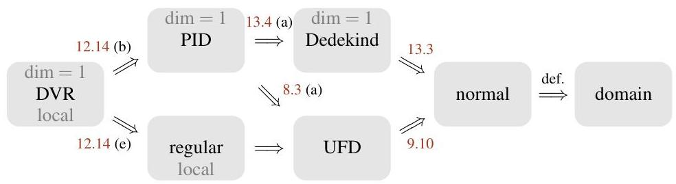

1. Ideals

# 1. Ideals

From the “Algebraic Structures” class you already know the basic constructions and properties concerning ideals and their quotient rings *[x11, Chapter 8]*. For our purposes however we have to study ideals in much more detail — so this will be our goal for this and the next chapter. Let us start with some general constructions to obtain new ideals from old ones. The ideal generated by a subset $M$ of a ring *[x11, Definition 8.5]* will be written as $(M)$.

###### Construction 1.1 (Operations on ideals).

Let $I$ and $J$ be ideals in a ring $R$.

1. The sum of the two given ideals is defined as usual by

$I+J:=\{a+b:a\in I\text{ and }b\in J\}.$

It is easy to check that this is an ideal — in fact, it is just the ideal generated by $I\cup J$.
2. It is also obvious that the intersection $I\cap J$ is again an ideal of $R$.
3. We define the product of $I$ and $J$ as the ideal generated by all products of elements of $I$ and $J$, i. e.

$I\cdot J:=(\{ab:a\in I\text{ and }b\in J\}).$

Note that just the set of products of elements of $I$ and $J$ would in general not be an ideal: if we take $R=\mathbb{R}[x,y]$ and $I=J=(x,y)$, then obviously $x^{2}$ and $y^{2}$ are products of an element of $I$ with an element of $J$, but their sum $x^{2}+y^{2}$ is not.
4. The quotient of $I$ by $J$ is defined to be

$I:J:=\{a\in R:aJ\subset I\}.$

Again, it is easy to see that this is an ideal.
5. We call

$\sqrt{I}:=\{a\in R:a^{n}\in I\text{ for some }n\in\mathbb{N}\}$

the radical of $I$. Let us check that this an ideal of $R$:

- We have $0\in\sqrt{I}$, since $0\in I$.
- If $a,b\in\sqrt{I}$, i. e. $a^{n}\in I$ and $b^{m}\in I$ for some $n,m\in\mathbb{N}$, then

$(a+b)^{n+m}=\sum_{k=0}^{n+m}{n+m\choose k}a^{k}\,b^{n+m-k}$

is again an element of $I$, since in each summand we must have that the power of $a$ is at least $n$ (in which case $a^{k}\in I$) or the power of $b$ is at least $m$ (in which case $b^{n+m-k}\in I$). Hence $a+b\in\sqrt{I}$.
- If $r\in R$ and $a\in\sqrt{I}$, i. e. $a^{n}\in I$ for some $n\in\mathbb{N}$, then $(ra)^{n}=r^{n}\,a^{n}\in I$, and hence $ra\in\sqrt{I}$.

Note that we certainly have $\sqrt{I}\supset I$. We call $I$ a radical ideal if $\sqrt{I}=I$, i. e. if for all $a\in R$ and $n\in\mathbb{N}$ with $a^{n}\in I$ it follows that $a\in I$. This is a natural definition since the radical $\sqrt{I}$ of an arbitrary ideal $I$ is in fact a radical ideal in this sense: if $a^{n}\in\sqrt{I}$ for some $n$, so $a^{nm}\in I$ for some $m$, then this obviously implies $a\in\sqrt{I}$.

Whether an ideal $I$ is radical can also easily be seen from its quotient ring $R/I$ as follows.

###### Definition 1.2 (Nilradical, nilpotent elements, and reduced rings).

Let $R$ be a ring. The ideal

$\sqrt{(0)}=\{a\in R:a^{n}=0\text{ for some }n\in\mathbb{N}\}$

is called the nilradical of $R$; its elements are called nilpotent. If $R$ has no nilpotent elements except $0$, i. e. if the zero ideal is radical, then $R$ is called reduced.

---

###### Lemma 1.3.

An ideal $I\trianglelefteq R$ is radical if and only if $R/I$ is reduced.

###### Proof.

By Construction 1.1 (e), the ideal $I$ is radical if and only if for all $a\in R$ and $n\in\mathbb{N}$ with $a^{n}\in I$ it follows that $a\in I$. Passing to the quotient ring $R/I$, this is obviously equivalent to saying that $\overline{a}^{\,n}=\overline{0}$ implies $\overline{a}=\overline{0}$, i. e. that $R/I$ has no nilpotent elements except $\overline{0}$. ∎

###### Example 1.4 (Operations on ideals in principal ideal domains).

Recall that a principal ideal domain (or short: PID) is an integral domain in which every ideal is principal, i. e. can be generated by one element *[x10, Definition 10.11]*. The most prominent examples of such rings are probably Euclidean domains, i. e. integral domains admitting a division with remainder *[x10, Definition 10.17 and Proposition 10.22]*, such as $\mathbb{Z}$ or $K[x]$ for a field $K$ *[x10, Example 10.18 and Proposition 10.19]*.

We know that any principal ideal domain $R$ admits a unique prime factorization of its elements *[x10, Proposition 11.9]* — a concept that we will discuss in more detail in Chapter 8. As a consequence, all operations of Construction 1.1 can then be computed easily: if $I$ and $J$ are not the zero ideal we can write $I=(a)$ and $J=(b)$ for $a=p_{1}^{a_{1}}\cdot\cdots\cdot p_{n}^{a_{n}}$ and $b=p_{1}^{b_{1}}\cdot\cdots\cdot p_{n}^{b_{n}}$ with distinct prime elements $p_{1},\ldots,p_{n}$ and $a_{1},\ldots,a_{n},b_{1},\ldots,b_{n}\in\mathbb{N}$. Then we obtain:

1. $I+J=(p_{1}^{c_{1}}\cdot\cdots\cdot p_{n}^{c_{n}})$ with $c_{i}=\min(a_{i},b_{i})$ for $i=1,\ldots,n$: another (principal) ideal contains $I$ (resp. $J$) if and only if it is of the form $(p_{1}^{c_{1}}\cdot\cdots\cdot p_{n}^{c_{n}})$ with $c_{i}\leq a_{i}$ (resp. $c_{i}\leq b_{i}$) for all $i$, so the smallest ideal $I+J$ containing $I$ and $J$ is obtained for $c_{i}=\min(a_{i},b_{i})$;
2. $I\cap J=(p_{1}^{c_{1}}\cdot\cdots\cdot p_{n}^{c_{n}})$ with $c_{i}=\max(a_{i},b_{i})$;
3. $I\cdot J=(ab)=(p_{1}^{c_{1}}\cdot\cdots\cdot p_{n}^{c_{n}})$ with $c_{i}=a_{i}+b_{i}$;
4. $I:J=(p_{1}^{c_{1}}\cdot\cdots\cdot p_{n}^{c_{n}})$ with $c_{i}=\max(a_{i}-b_{i},0)$;
5. $\sqrt{I}=(p_{1}^{c_{1}}\cdot\cdots\cdot p_{n}^{c_{n}})$ with $c_{i}=\min(a_{i},1)$.

In particular, we have $I+J=(1)=R$ if and only if $a$ and $b$ have no common prime factor, i. e. if $a$ and $b$ are coprime. We use this observation to define the notion of coprime ideals in general rings:

###### Definition 1.5 (Coprime ideals).

Two ideals $I$ and $J$ in a ring $R$ are called coprime if $I+J=R$.

###### Example 1.6 (Operations on ideals in polynomial rings with Singular).

In more general rings, the explicit computation of the operations of Construction 1.1 is quite complicated and requires advanced algorithmic methods that you can learn about in the “Computer Algebra” class. We will not need this here, but if you want to compute some examples in polynomial rings you can use e. g. the computer algebra system Singular *[x20]*. For example, for the ideals $I=(x^{2}y,xy^{3})$ and $J=(x+y)$ in $\mathbb{Q}[x,y]$ the following Singular code computes that $I:J=(x^{2}y,xy^{2})$ and $\sqrt{I\cdot J}=\sqrt{I\cap J}=(x^{2}y+xy^{2})$, and checks that $y^{3}\in I+J$:

> LIB "primdec.lib"; // library needed for the radical
> ring R=0,(x,y),dp; // set up polynomial ring Q[x,y]
> ideal I=x2y,xy3; // means I=(x^2*y,x*y^3)
> ideal J=x+y;
> quotient(I,J); // compute (generators of) I:J
_[1]=xy2
_[2]=x2y
> radical(I*J); // compute radical of I*J
_[1]=x2y+xy2
> radical(intersect(I,J)); // compute radical of intersection
_[1]=x2y+xy2
> reduce(y3,std(I+J)); // gives 0 if and only if y^3 in I+J
0

In this example it turned out that $\sqrt{I\cdot J}=\sqrt{I\cap J}$. In fact, this is not a coincidence — the following lemma and exercise show that the product and the intersection of ideals are very closely related.

###### Lemma 1.7 (Product and intersection of ideals).

For any two ideals $I$ and $J$ in a ring $R$ we have

---

1. $I\cdot J\subset I\cap J$;
2. $\sqrt{I\cdot J}=\sqrt{I\cap J}=\sqrt{I}\cap\sqrt{J}$.

###### Proof.

1. It suffices to check that all generators of $I\cdot J$ lie in $I\cap J$. But for $a\in I$ and $b\in J$ it is obvious that $ab\in I\cap J$, so the result follows.
2. We show a circular inclusion, with $\sqrt{I\cdot J}\subset\sqrt{I\cap J}$ following from (a).

If $a\in\sqrt{I\cap J}$ then $a^{n}\in I\cap J$ for some $n\in\mathbb{N}$, so $a^{n}\in I$ and $a^{n}\in J$, and hence $a\in\sqrt{I}\cap\sqrt{J}$. Finally, if $a\in\sqrt{I}\cap\sqrt{J}$ then $a^{m}\in I$ and $a^{n}\in J$ for some $m,n\in\mathbb{N}$, therefore $a^{m+n}\in I\cdot J$ and thus $a\in\sqrt{I\cdot J}$. ∎

###### Exercise 1.8.

Let $I_{1},\ldots,I_{n}$ be pairwise coprime ideals in a ring $R$. Prove that $I_{1}\cdot\cdots\cdot I_{n}=I_{1}\cap\cdots\cap I_{n}$.

###### Exercise 1.9.

Show that the ideal $(x_{1},\ldots,x_{n})\,\triangleleft K[x_{1},\ldots,x_{n}]$ cannot be generated by fewer than $n$ elements. Hence in particular, the polynomial ring $K[x_{1},\ldots,x_{n}]$ is not a principal ideal domain for $n\geq 2$.

We will see however in Remark 8.6 that these polynomial rings still admit unique prime factorizations of its elements, so that the results of Example 1.4 continue to hold for principal ideals in these rings.

###### Remark 1.10 (Ideals of subvarieties $=$ radical ideals).

Radical ideals play an important role in geometry: if $Y$ is a subvariety of a variety $X$ and $f\in A(X)$ with $f^{n}\in I(Y)$, then $(f(x))^{n}=0$ for all $x\in Y$ — but this obviously implies $f(x)=0$ for all $x\in Y$, and hence $f\in I(Y)$. So ideals of subvarieties are always radical.

In fact, if the ground field $K$ is algebraically closed, i. e. if every non-constant polynomial over $K$ has a zero (as e. g. for $K=\mathbb{C}$), we will see in Corollary 10.14 that it is exactly the radical ideals in $A(X)$ that are ideals of subvarieties. So in this case there is a one-to-one correspondence

$\{\text{subvarieties of }X\}$ $\xleftarrow{1:1}$ $\{\text{radical ideals in }A(X)\}$
$Y$ $\longmapsto$ $I(Y)$
$V(I)$ $\longleftarrow$ $I.$

In other words, we have $V(I(Y))=Y$ for every subvariety $Y$ of $X$ (which we have already seen in Lemma 0.9 (c)), and $I(V(I))=I$ for every radical ideal $I\unlhd A(X)$. In order to simplify our geometric interpretations we will therefore usually assume from now on in our geometric examples that the ground field is algebraically closed and the above one-to-one correspondence holds. Note that this will not lead to circular reasoning as we will never use these geometric examples to prove anything.

###### Exercise 1.11.

1. Give a rigorous proof of the one-to-one correspondence of Remark 1.10 in the case of the ambient variety $\mathbb{A}^{1}_{\mathbb{C}}$, i. e. between subvarieties of $\mathbb{A}^{1}_{\mathbb{C}}$ and radical ideals in $A(\mathbb{A}^{1}_{\mathbb{C}})=\mathbb{C}[x]$.
2. Show that this one-to-one correspondence does not hold in the case of the ground field $\mathbb{R}$, i. e. between subvarieties of $\mathbb{A}^{1}_{\mathbb{R}}$ and radical ideals in $A(\mathbb{A}^{1}_{\mathbb{R}})=\mathbb{R}[x]$.

###### Remark 1.12 (Geometric interpretation of operations on ideals).

Let $X$ be a variety over an algebraically closed field, and let $A(X)$ be its coordinate ring. Assuming the one-to-one correspondence of Remark 1.10 between subvarieties of $X$ and radical ideals in $A(X)$ we can now give a geometric interpretation of the operations of Construction 1.1:

1. As $I+J$ is the ideal generated by $I\cup J$, we have for any two (radical) ideals $I,J\unlhd A(X)$

$V(I+J)$ $=\{x\in X:f(x)=0\text{ for all }f\in I\cup J\}$
$=\{x\in X:f(x)=0\text{ for all }f\in I\}\cap\{x\in X:f(x)=0\text{ for all }f\in J\}$
$=V(I)\cap V(J).$

---

Andreas Gathmann

So the intersection of subvarieties corresponds to the sum of ideals. (Note however that the sum of two radical ideals may not be radical, so strictly speaking the algebraic operation corresponding to the intersection of subvarieties is taking the sum of the ideals and then its radical.)

Moreover, as the whole space  $X$  and the empty set  $\emptyset$  obviously correspond to the zero ideal (0) resp. the whole ring  $(1) = A(X)$ , the condition  $I + J = A(X)$  that  $I$  and  $J$  are coprime translates into the intersection of  $V(I)$  and  $V(J)$  being empty.

(b) For any two subvarieties  $Y, Z$  of  $X$

$I(Y\cup Z) = \{f\in A(X):f(x) = 0$  for all  $x\in Y\cup Z\}$

$= \{f\in A(X):f(x) = 0$  for all  $x\in Y\} \cap \{f\in A(X):f(x) = 0$  for all  $x\in Z\}$

$= I(Y)\cap I(Z),$

and thus the union of subvarieties corresponds to the intersection of ideals. As the product of ideals has the same radical as the intersection by Lemma 1.7 (b), the union of subvarieties also corresponds to taking the product of the ideals (and then its radical).

(c) Again for two subvarieties  $Y, Z$  of  $X$  we have

$I(Y\backslash Z) = \{f\in A(X):f(x) = 0$  for all  $x\in Y\backslash Z\}$

$= \{f\in A(X):f(x)\cdot g(x) = 0$  for all  $x\in Y$  and  $g\in I(Z)\}$

$= \{f\in A(X):f\cdot I(Z)\subset I(Y)\}$

$= I(Y):I(Z),$

so taking the set-theoretic difference  $Y \backslash Z$  corresponds to quotient ideals. (Strictly speaking, the difference  $Y \backslash Z$  is in general not a variety, so the exact geometric operation corresponding to quotient ideals is taking the smallest subvariety containing  $Y \backslash Z$ .)

Summarizing, we obtain the following translation between geometric and algebraic terms:

|  SUBVARIETIES | ←→ | IDEALS  |
| --- | --- | --- |
|  full space |  | (0)  |
|  empty set |  | (1)  |
|  intersection |  | sum  |
|  union |  | product / intersection  |
|  difference |  | quotient  |
|  disjoint subvarieties |  | coprime ideals  |

Exercise 1.13. Show that the equation of ideals

$$
\left(x ^ {3} - x ^ {2}, x ^ {2} y - x ^ {2}, x y - y, y ^ {2} - y\right) = \left(x ^ {2}, y\right) \cap (x - 1, y - 1)
$$

holds in the polynomial ring  $\mathbb{C}[x,y]$ . Is this a radical ideal? What is its zero locus in  $\mathbb{A}_{\mathbb{C}}^2$ ?

As an example that links the concepts introduced so far, let us now consider the Chinese Remainder Theorem that you already know for the integers [G1, Proposition 11.22] and generalize it to arbitrary rings.

Proposition 1.14 (Chinese Remainder Theorem). Let  $I_1, \ldots, I_n$  be ideals in a ring  $R$ , and consider the ring homomorphism

$$
\varphi : R \to R / I _ {1} \times \dots \times R / I _ {n}, a \mapsto (\bar {a}, \dots , \bar {a}).
$$

(a)  $\varphi$  is injective if and only if  $I_1 \cap \dots \cap I_n = (0)$ .
(b)  $\varphi$  is surjective if and only if  $I_1, \ldots, I_n$  are pairwise coprime.

---

This follows immediately from $\ker\varphi=I_{1}\cap\cdots\cap I_{n}$.
- “$\Rightarrow$” If $\varphi$ is surjective then $(1,0,\ldots,0)\in\operatorname{im}\varphi$. In particular, there is an element $a\in R$ with $a=1\mod I_{1}$ and $a=0\mod I_{2}$. But then $1=(1-a)+a\in I_{1}+I_{2}$, and hence $I_{1}+I_{2}=R$. In the same way we see $I_{i}+I_{j}=R$ for all $i\neq j$.

“$\Leftarrow$” Let $I_{i}+I_{j}=R$ for all $i\neq j$. In particular, for $i=2,\ldots,n$ there are $a_{i}\in I_{1}$ and $b_{i}\in I_{i}$ with $a_{i}+b_{i}=1$, so that $b_{i}=1-a_{i}=1\mod I_{1}$ and $b_{i}=0\mod I_{i}$. If we then set $b:=b_{2}\cdot\ \cdots\ \cdot b_{n}$ we get $b=1\mod I_{1}$ and $b=0\mod I_{i}$ for all $i=2,\ldots,n$. So $(1,0,\ldots,0)=\varphi(b)\in\operatorname{im}\varphi$. In the same way we see that the other unit generators are in the image of $\varphi$, and hence $\varphi$ is surjective. ∎

###### Example 1.15.

1. Consider the case $R=\mathbb{Z}$, and let $a_{1},\ldots,a_{n}\in\mathbb{Z}$ be pairwise coprime. Then the residue class map

$\varphi:\mathbb{Z}\to\mathbb{Z}_{a_{1}}\times\cdots\times\mathbb{Z}_{a_{n}},\ x\mapsto(\overline{x},\ldots,\overline{x})$

is surjective by Proposition 1.14 (b). Its kernel is $(a_{1})\cap\cdots\cap(a_{n})=(a)$ with $a:=a_{1}\cdot\ \cdots\cdot a_{n}$ by Exercise 1.8, and so by the homomorphism theorem *[x13, Proposition 8.12]* we obtain an isomorphism

$\mathbb{Z}_{a}\to\mathbb{Z}_{a_{1}}\times\cdots\times\mathbb{Z}_{a_{n}},\ \ \overline{x}\mapsto(\overline{x},\ldots,\overline{x}),$

which is the well-known form of the Chinese Remainder Theorem for the integers *[x13, Proposition 11.22]*.
2. Let $X$ be a variety, and let $Y_{1},\ldots,Y_{n}$ be subvarieties of $X$. Recall from Remark 0.13 that for $i=1,\ldots,n$ we have isomorphisms $A(X)/I(Y_{i})\cong A(Y_{i})$ by restricting functions from $X$ to $Y_{i}$. Using the translations from Remark 1.12, Proposition 1.14 therefore states that the combined restriction map $\varphi:A(X)\to A(Y_{1})\times\cdots\times A(Y_{n})$ to all given subvarieties is …

- injective if and only if the subvarieties $Y_{1},\ldots,Y_{n}$ cover all of $X$;
- surjective if and only if the subvarieties $Y_{1},\ldots,Y_{n}$ are disjoint.

In particular, if $X$ is the disjoint union of the subvarieties $Y_{1},\ldots,Y_{n}$, then the Chinese Remainder Theorem says that $\varphi$ is an isomorphism, i. e. that giving a function on $X$ is the same as giving a function on each of the subvarieties — which seems obvious from geometry.

In our study of ideals, let us now consider their behavior under ring homomorphisms.

###### Definition 1.16 (Contraction and extension).

Let $\varphi:R\to R^{\prime}$ be a ring homomorphism.

1. For any ideal $I\trianglelefteq R^{\prime}$ the inverse image $\varphi^{-1}(I)$ is an ideal of $R$. We call it the inverse image ideal or contraction of $I$ by $\varphi$, sometimes denoted $I^{c}$ if it is clear from the context which morphism we consider.
2. For $I\trianglelefteq R$ the ideal generated by the image $\varphi(I)$ is called the image ideal or extension of $I$ by $\varphi$. It is written as $\varphi(I)\cdot R^{\prime}$, or $I^{e}$ if the morphism is clear from the context.

###### Remark 1.17.

1. Note that for the construction of the image ideal of an ideal $I\trianglelefteq R$ under a ring homomorphism $\varphi:R\to R^{\prime}$ we have to take the ideal generated by $\varphi(I)$, since $\varphi(I)$ itself is in general not yet an ideal: take e. g. $\varphi:\mathbb{Z}\to\mathbb{Z}[x]$ to be the inclusion and $I=\mathbb{Z}$. But if $\varphi$ is surjective then $\varphi(I)$ is already an ideal and thus $I^{e}=\varphi(I)$:

- for $b_{1},b_{2}\in\varphi(I)$ we have $a_{1},a_{2}\in I$ with $b_{1}=\varphi(a_{1})$ and $b_{2}=\varphi(a_{2})$, and so $b_{1}+b_{2}=\varphi(a_{1}+a_{2})\in\varphi(I)$;
- for $b\in\varphi(I)$ and $s\in R^{\prime}$ we have $a\in I$ and $r\in R$ with $\varphi(a)=b$ and $\varphi(r)=s$, and thus $sb=\varphi(ra)\in\varphi(I)$.

---

Andreas Gathmann

(b) If  $R$  is a field and  $R' \neq \{0\}$  then any ring homomorphism  $\varphi: R \to R'$  is injective: its kernel is 0 since an element  $a \in R \setminus \{0\}$  with  $\varphi(a) = 0$  would lead to the contradiction

$$
1 = \varphi (1) = \varphi \left(a ^ {- 1} a\right) = \varphi \left(a ^ {- 1}\right) \cdot \varphi (a) = 0.
$$

This is the origin of the names "contraction" and "extension", since in this case these two operations really make the ideal "smaller" and "bigger", respectively.

Remark 1.18 (Geometric interpretation of contraction and extension). As in Construction 0.11, let  $f: X \to Y$  be a morphism of varieties, and let  $\varphi: A(Y) \to A(X)$ ,  $g \mapsto g \circ f$  be the associated map between the coordinate rings.

(a) For any subvariety  $Z\subset X$  we have

$$
\begin{array}{l} I (f (Z)) = \{g \in A (Y): g (f (x)) = 0 \text { for all } x \in Z \} \\ = \{g \in A (Y): \varphi (g) \in I (Z) \} \\ = \varphi^ {- 1} (I (Z)), \\ \end{array}
$$

so taking images of varieties corresponds to the contraction of ideals.

(b) For a subvariety  $Z\subset Y$  the zero locus of the extension  $I(Z)^{e}$  by  $\varphi$  is

$$
\begin{array}{l} V (\varphi (I (Z))) = \{x \in X: g (f (x)) = 0 \text { for all } g \in I (Z) \} \\ = f ^ {- 1} \left(\left\{y \in Y: g (y) = 0 \text { for all } g \in I (Z) \right\}\right) \\ = f ^ {- 1} (V (I (Z))) \\ = f ^ {- 1} (Z) \\ \end{array}
$$

by Lemma 0.9 (c). Hence, taking inverse images of subvarieties corresponds to the extension of ideals.

So we can add the following two entries to our dictionary between geometry and algebra:

|  SUBVARIETIES | ←→ | IDEALS  |
| --- | --- | --- |
|  image |  | contraction  |
|  inverse image |  | extension  |

Exercise 1.19. Let  $\varphi : R \to R'$  a ring homomorphism. Prove:

(a)  $I\subset (I^{e})^{c}$  for all  $I\triangleleft R$
(b)  $I\supset (I^c)^e$  for all  $I\triangleleft R^{\prime}$
(c)  $(IJ)^{e} = I^{e}J^{e}$  for all  $I,J\triangleleft R$
(d)  $(I\cap J)^{c} = I^{c}\cap J^{c}$  for all  $I,J\triangleleft R^{\prime}$

Exercise 1.20. Let  $f: X \to Y$  be a morphism of varieties, and let  $Z$  and  $W$  be subvarieties of  $X$ . The geometric statements below are then obvious. Find and prove corresponding algebraic statements for ideals in rings.

(a)  $f(Z\cup W) = f(Z)\cup f(W)$
(b)  $f(Z\cap W)\subset f(Z)\cap f(W);$
(c)  $f(Z\backslash W)\supset f(Z)\backslash f(W).$

An important application of contraction and extension is that it allows an easy explicit description of ideals in quotient rings.

---

1. Ideals

Lemma 1.21 (Ideals in quotient rings). Let  $I$  be an ideal in a ring  $R$ . Then contraction and extension by the quotient map  $\varphi : R \to R / I$  give a one-to-one correspondence

$\{ideals in R / I\}$ $\longleftrightarrow$  {ideals  $J$  in  $R$  with  $J\supset I\}$

$J$ $\longmapsto J^{c}$

$J^{e}$ $\longleftarrow J.$

Proof. As the quotient map  $\varphi$  is surjective, we know by Remark 1.17 (a) that contraction and extension are just the inverse image and image of an ideal, respectively. Moreover, it is clear that the contraction of an ideal in  $R / I$  yields an ideal of  $R$  that contains  $I$ , and that the extension of an ideal in  $R$  gives an ideal in  $R / I$ . So we just have to show that contraction and extension are inverse to each other on the sets of ideals given in the lemma. But this is easy to check:

- For any ideal  $J \triangleleft R / I$  we have  $(J^c)^e = \varphi(\varphi^{-1}(J)) = J$  since  $\varphi$  is surjective.
- For any ideal  $J \triangleleft R$  with  $J \supset I$  we get

$(J^{e})^{c} = \varphi^{-1}(\varphi (J)) = \{a\in R:\varphi (a)\in \varphi (J)\} = J + I = J.$

Exercise 1.22. Let  $I \subset J$  be ideals in a ring  $R$ . By Lemma 1.21, the extension  $J / I$  of  $J$  by the quotient map  $R \to R / I$  is an ideal in  $R / I$ . Prove that

$(R / I) / (J / I)\cong R / J.$

At the end of this chapter, let us now consider ring homomorphisms from a slightly different point of view that will also tell us which rings "come from geometry", i.e. can be written as coordinate rings of varieties.

Definition 1.23 (Algebras and algebra homomorphisms). Let  $R$  be a ring.

(a) An  $R$ -algebra is a ring  $R'$  together with a ring homomorphism  $\varphi_{R'} : R \to R'$ .
(b) Let  $R_{1}$  and  $R_{2}$  be  $R$ -algebras with corresponding ring homomorphisms  $\varphi_{R_1}: R \to R_1$  and  $\varphi_{R_2}: R \to R_2$ . A morphism or  $R$ -algebra homomorphism from  $R_{1}$  to  $R_{2}$  is a ring homomorphism  $\varphi: R_{1} \to R_{2}$  with  $\varphi \circ \varphi_{R_1} = \varphi_{R_2}$ .

It is often helpful to draw these maps in a diagram as shown on the right. Then the condition  $\varphi \circ \varphi_{R_1} = \varphi_{R_2}$  just states that this diagram commutes, i.e. that any two ways along the arrows in the diagram having the same source and target — in this case the two ways to go from  $R$  to  $R_2$  — will give the same map.

(c) Let  $R'$  be an  $R$ -algebra with corresponding ring homomorphism  $\varphi_{R'} : R \to R'$ . An  $R$ -subalgebra of  $R'$  is a subring  $\tilde{R}$  of  $R'$  containing the image of  $\varphi$ . Note that  $\tilde{R}$  is then an  $R$ -algebra using the ring homomorphism  $\varphi_{\tilde{R}} : R \to \tilde{R}$  given by  $\varphi_{R'}$  with the target restricted to  $\tilde{R}$ . Moreover, the inclusion  $\tilde{R} \to R'$  is an  $R$ -algebra homomorphism in the sense of (b).

In most of our applications, the ring homomorphism  $\varphi_{R'}: R \to R'$  needed to define an  $R$ -algebra  $R'$  will be clear from the context, and we will write the  $R$ -algebra simply as  $R'$ . In fact, in many cases it will even be injective. In this case we usually consider  $R$  as a subring of  $R'$ , drop the homomorphism  $\varphi_{R'}$  in the notation completely, and say that  $R \subset R'$  is a ring extension. We will consider these ring extensions in detail in Chapter 9.

Remark 1.24. The ring homomorphism  $\varphi_{R'}: R \to R'$  associated to an  $R$ -algebra  $R'$  can be used to define a "scalar multiplication" of  $R$  on  $R'$  by

$R\times R^{\prime}\to R^{\prime},\quad (a,c)\mapsto a\cdot c\coloneqq \varphi_{R^{\prime}}(a)\cdot c.$

Note that by setting  $c = 1$  this scalar multiplication determines  $\varphi_{R'}$  back. So one can also think of an  $R$ -algebra as a ring together with a scalar multiplication with elements of  $R$  that has the expected compatibility properties. In fact, one could also define  $R$ -algebras in this way.

---

###### Example 1.25.

1. Without doubt the most important example of an algebra over a ring $R$ is the polynomial ring $R[x_{1},\ldots,x_{n}]$, together with the obvious injective ring homomorphism $R\to R[x_{1},\ldots,x_{n}]$ that embeds $R$ into the polynomial ring as constant polynomials. In the same way, any quotient $R[x_{1},\ldots,x_{n}]/I$ of the polynomial ring by an ideal $I$ is an $R$-algebra as well.
2. Let $X\subset\mathbb{A}_{K}^{n}$ be a variety over a field $K$. Then its coordinate ring $A(X)=K[x_{1},\ldots,x_{n}]/I(X)$ is a $K$-algebra by (a), with $K$ mapping to $A(X)$ as the constant functions. Moreover, the ring homomorphism $A(Y)\to A(X)$ of Construction 0.11 corresponding to a morphism $f:X\to Y$ to another variety $Y$ is a $K$-algebra homomorphism, since composing a constant function with $f$ gives again a constant function. In fact, one can show that these are precisely the maps between the coordinate rings coming from morphisms of varieties, i. e. that Construction 0.11 gives a one-to-one correspondence

$\{\text{morphisms }X\to Y\}\ \ \stackrel{{\scriptstyle 1:1}}{{\longleftrightarrow}}\ \ \{K\text{-algebra homomorphisms }A(Y)\to A(X)\}.$

###### Definition 1.26 (Generated subalgebras).

Let $R^{\prime}$ be an $R$-algebra.

1. For any subset $M\subset R^{\prime}$ let

$R[M]:=\bigcap_{T\supset M\atop R\text{-subalgebra of }R^{\prime}}T$

be the smallest $R$-subalgebra of $R^{\prime}$ that contains $M$. We call it the $R$-subalgebra generated by $M$. If $M=\{c_{1},\ldots,c_{n}\}$ is finite, we write $R[M]=R[\{c_{1},\ldots,c_{n}\}]$ also as $R[c_{1},\ldots,c_{n}]$.
2. We say that $R^{\prime}$ is a finitely generated $R$-algebra if there are finitely many $c_{1},\ldots,c_{n}$ with $R[c_{1},\ldots,c_{n}]=R^{\prime}$.

###### Remark 1.27.

Note that the square bracket notation in Definition 1.26 is ambiguous: $R[x_{1},\ldots,x_{n}]$ can either mean the polynomial ring over $R$ as in Definition 0.2 (if $x_{1},\ldots,x_{n}$ are formal variables), or the subalgebra of an $R$-algebra $R^{\prime}$ generated by $x_{1},\ldots,x_{n}$ (if $x_{1},\ldots,x_{n}$ are elements of $R^{\prime}$). Unfortunately, the usage of the notation $R[x_{1},\ldots,x_{n}]$ for both concepts is well-established in the literature, so we will adopt it here as well. Its origin lies in the following lemma, which shows that the elements of an $R$-subalgebra generated by a set $M$ are just the polynomial expressions in elements of $M$ with coefficients in $R$.

###### Lemma 1.28 (Explicit description of $R[M]$).

Let $M$ be a subset of an $R$-algebra $R^{\prime}$. Then

$R[M]=\bigg{\{}\sum_{i_{1},\ldots,i_{n}\in\mathbb{N}}a_{i_{1},\ldots,i_{n}}\ c_{1}^{i_{1}}\cdot\ \cdots\ \cdot c_{n}^{i_{n}}:a_{i_{1},\ldots,i_{n}}\in R,\,c_{1},\ldots,c_{n}\in M,\,\text{only finitely many }a_{i_{1},\ldots,i_{n}}\neq 0\bigg{\}},$

where multiplication in $R^{\prime}$ with elements of $R$ is defined as in Remark 1.24.

###### Proof.

It is obvious that this set of polynomial expressions is an $R$-subalgebra of $R^{\prime}$. Conversely, every $R$-subalgebra of $R^{\prime}$ containing $M$ must also contain these polynomial expressions, so the result follows. ∎

###### Example 1.29.

In the field $\mathbb{C}$ of complex numbers the $\mathbb{Z}$-algebra generated by the imaginary unit $i$ is

$\mathbb{Z}[i]=\{f(i):f\in\mathbb{Z}[x]\}=\{a+b\,i:a,b\in\mathbb{Z}\}\ \ \ \subset\mathbb{C}$

by Lemma 1.28. (Note again the double use of the square bracket notation: $\mathbb{Z}[x]$ is the polynomial ring over $\mathbb{Z}$, whereas $\mathbb{Z}[i]$ is the $\mathbb{Z}$-subalgebra of $\mathbb{C}$ generated by $i$.)

###### Lemma 1.30 (Finitely generated $R$-algebras).

An algebra $R^{\prime}$ over a ring $R$ is finitely generated if and only if $R^{\prime}\cong R[x_{1},\ldots,x_{n}]/I$ for some $n\in\mathbb{N}$ and an ideal $I$ in the polynomial ring $R[x_{1},\ldots,x_{n}]$.

###### Proof.

Certainly, $R[x_{1},\ldots,x_{n}]/I$ is a finitely generated $R$-algebra since it is generated by the classes of $x_{1},\ldots,x_{n}$. Conversely, let $R^{\prime}$ be an $R$-algebra generated by $c_{1},\ldots,c_{n}\in S$. Then

$\varphi:R[x_{1},\ldots,x_{n}]\to R^{\prime},\,\sum_{i_{1},\ldots,i_{n}}a_{i_{1},\ldots,i_{n}}\ x_{1}^{i_{1}}\cdot\ \cdots\ \cdot x_{n}^{i_{n}}\mapsto\sum_{i_{1},\ldots,i_{n}}a_{i_{1},\ldots,i_{n}}\ c_{1}^{i_{1}}\cdot\ \cdots\cdot c_{n}^{i_{n}}$

######

---

1. Ideals

is a ring homomorphism, and its image is precisely $R[c_1,\ldots ,c_n] = R'$ by Lemma 1.28. So by the homomorphism theorem [G1, Proposition 8.12] $\varphi$ induces a ring isomorphism $R[x_1,\dots ,x_n] / \ker \varphi \cong R'$, which by construction is also an $R$-algebra isomorphism.

Remark 1.31 (Coordinate rings = reduced finitely generated $K$-algebras). Let $K$ be an algebraically closed field. Then by Remark 1.10 the coordinate rings of varieties over $K$ are exactly the rings of the form $K[x_1, \ldots, x_n] / I$ for a radical ideal $I \triangleleft K[x_1, \ldots, x_n]$, so by Lemma 1.3 and Lemma 1.30 precisely the reduced finitely generated $K$-algebras.