9 Integral Ring Extensions

In this chapter we want to discuss a concept in commutative algebra that has its original motivation in algebra, but turns out to have surprisingly many applications and consequences in geometry as well. To explain its background, recall from the “Introduction to Algebra” class that the most important objects in field theory are algebraic and finite field extensions. More precisely, if $K\subset K^{\prime}$ is an inclusion of fields an element $a\in K^{\prime}$ is called *algebraic* over $K$ if there is a non-zero polynomial $f\in K[x]$ with coefficients in $K$ such that $f(a)=0$. The field extension $K\subset K^{\prime}$ is then called algebraic if every element of $K^{\prime}$ is algebraic over $K$ *[x10, Definition 2.1]*.

Of course, for an algebraic element $a\in K^{\prime}$ over $K$ there is then also a *monic* polynomial relation $a^{n}+c_{n-1}a^{n-1}+\cdots+c_{0}=0$ for some $n\in\mathbb{N}_{>0}$ and $c_{0},\ldots,c_{n-1}\in K$, since we can just divide $f$ by its leading coefficient. This trivial statement actually has far-reaching consequences: it means that we can use the equation $a^{n}=-c_{n-1}a^{n-1}-\cdots-c_{0}$ to reduce any monomial $a^{k}$ for $k\in\mathbb{N}$ (and in fact also the multiplicative inverses of non-zero polynomial expressions in $a$) to a $K$-linear combination of the first $n$ powers $1,a,\ldots,a^{n-1}$, and that consequently the extension field $K(a)$ of $K$ generated by $a$ is a *finite-dimensional* vector space over $K$ — we say that $K\subset K(a)$ is a *finite field* extension *[x10, Definition 2.12 and Proposition 2.14 (b)]*. This means that the field extension $K\subset K(a)$ is quite easy to deal with, since we can use the whole machinery of (finite-dimensional) linear algebra for its study.

What happens now if instead of an extension $K\subset K^{\prime}$ of *fields* we consider an extension $R\subset R^{\prime}$ of *rings*? We can certainly still have a look at elements $a\in R^{\prime}$ satisfying a polynomial relation $c_{n}a^{n}+c_{n-1}a^{n-1}+\cdots+c_{0}=0$ with $c_{0},\ldots,c_{n}\in R$ (and not all of them being $0$). But now it will in general not be possible to divide this equation by its leading coefficient $c_{n}$ to obtain a monic relation. Consequently, we can in general not use this relation to express higher powers of $a$ in terms of lower ones, and hence the $R$-algebra $R[a]$ generated by $a$ over $R$ need not be a finite $R$-module. A simple example for this can already be found in the ring extension $\mathbb{Z}\subset\mathbb{Q}$: for example, the rational number $a=\frac{1}{2}$ satisfies a (non-monic) polynomial relation $2a-1=0$ with coefficients in $\mathbb{Z}$, but certainly $\mathbb{Z}[a]$, which is the ring of all rational numbers with a finite binary expansion, is not a finitely generated $\mathbb{Z}$-module.

We learn from this that in the case of a ring extension $R\subset R^{\prime}$ we should often not consider elements of $R^{\prime}$ satisfying polynomial relations with coefficients in $R$, but rather require *monic* relations in the first place. So let us start by giving the corresponding definitions.

###### Definition 9.1 (Integral and finite ring extensions).

1. If $R\subset R^{\prime}$ are rings, we call $R^{\prime}$ an extension ring of $R$. We will also say in this case that $R\subset R^{\prime}$ is a ring extension.

Note: sometimes in the literature a ring extension is meant to be any ring homomorphism $R\to R^{\prime}$, even if it is not injective (so that $R^{\prime}$ is an arbitrary $R$-algebra as in Definition 1.23 (a)).
2. Let $R$ be a ring. An element $a$ of an extension ring $R^{\prime}$ of $R$ is called integral over $R$ if there is a monic polynomial $f\in R[x]$ with $f(a)=0$, i. e. if there are $n\in\mathbb{N}_{>0}$ and $c_{0},\ldots,c_{n-1}\in R$ with $a^{n}+c_{n-1}a^{n-1}+\cdots+c_{0}=0$. We say that $R^{\prime}$ is integral over $R$ if every element of $R^{\prime}$ is integral over $R$.
3. A ring extension $R\subset R^{\prime}$ is called finite if $R^{\prime}$ is finitely generated as an $R$-module.

###### Remark 9.2.

1. Note that the usage of the word “integral” for the concept of Definition 9.1 (b) is completely unrelated to the appearance of the same word in the term “integral domain”.

---

Andreas Gathmann

(b) If  $R$  and  $R'$  are fields, the notions of integral and finite ring extensions actually coincide with those of algebraic and finite field extensions [G3, Definitions 2.1 and 2.12]. In fact, for this case you might already know some of the next few results in this chapter from the "Introduction to Algebra" class, in particular Proposition 9.5 and Lemma 9.6.

Example 9.3. Let  $R$  be a unique factorization domain, and let  $R' = \operatorname{Quot} R$  be its quotient field. We claim that  $a \in R'$  is integral over  $R$  if and only if  $a \in R$ .

In fact, it is obvious that any element of  $R$  is integral over  $R$ , so let us prove the converse. Assume that  $a = \frac{p}{q}$  is integral over  $R$  with  $p$  and  $q$  coprime, i.e. there is a polynomial equation

$$
\left(\frac {p}{q}\right) ^ {n} + c _ {n - 1} \left(\frac {p}{q}\right) ^ {n - 1} + \dots + c _ {0} = 0
$$

with  $c_{0},\ldots ,c_{n - 1}\in R$  . We multiply with  $q^n$  to get

$$
p ^ {n} + c _ {n - 1} p ^ {n - 1} q + \dots + c _ {0} q ^ {n} = 0, \quad \text {i . e .} \quad p ^ {n} = - q \left(c _ {n - 1} p ^ {n - 1} + \dots + c _ {0} q ^ {n - 1}\right).
$$

in  $R$ . So  $q \mid p^n$ , which is only possible if  $q$  is a unit since  $p$  and  $q$  are coprime. Hence  $a = \frac{p}{q} \in R$ .

So in particular, if  $R$  is not a field then  $R' \neq R$ , and hence the ring extension  $R \subset R'$  is not integral.

Example 9.4 (Geometric examples of integral extensions). Let  $R = \mathbb{C}[x]$  and  $R' = R[y] / (f) = \mathbb{C}[x, y] / (f)$ , where  $f \in R[y]$  is a (non-constant) polynomial relation for the additional variable  $y$ . Geometrically, we then have  $R = A(X)$  and  $R' = A(X')$  for  $X = \mathbb{A}_{\mathbb{C}}^{1}$  and the curve  $X'$  in  $\mathbb{A}_{\mathbb{C}}^{2}$  given by the equation  $f(x, y) = 0$ . The ring extension map  $R \to R'$  corresponds to the morphism of varieties  $\pi : X' \to X$ ,  $(x, y) \mapsto x$  in the sense of Construction 0.11. In the following figure we show three examples of this setting, where we only draw the real points to keep the pictures inside  $\mathbb{A}_{\mathbb{R}}^{2}$ .

(a)

(b)

(c)

The subtle but important difference between these examples is that in case (a) the given relation  $f \in R[y]$  is monic in  $y$ , whereas in (b) and (c) it is not (with the leading term being  $xy$ ). This has geometric consequences for the inverse images  $\pi^{-1}(x)$  of points  $x \in X$ , the so-called fibers of  $\pi$ :

(a) In this case, the generator  $\overline{y}$  of  $R^{\prime}$  over  $R$  is integral since it satisfies the monic relation  $\overline{y}^2 -\overline{x}^2 = 0$ . In fact, Proposition 9.5 will show that this implies that the whole ring extension  $R\subset R^{\prime}$  is integral. Geometrically, the monic relation means that plugging in an arbitrary value for  $x$  will always give a quadratic equation  $y^{2} - x^{2} = 0$  for  $y$ , leading to two points in any fiber  $\pi^{-1}(x)$  (counted with multiplicities).
(b) In this example,  $\overline{y} \in R'$  does not satisfy a monic relation over  $R$ : considering the leading term in  $y$  it is obvious that there are no polynomials  $g, h \in R[y]$  with  $g$  monic in  $y$  such that  $g = h(xy - 1)$ . Hence the extension  $R \subset R'$  is not integral. Geometrically, the consequence is now that after plugging in a value for  $x$  the relation  $xy - 1 = 0$  for  $y$  is linear for  $x \neq 0$  but constant for  $x = 0$ , leading to an empty fiber  $\pi^{-1}(0) = \emptyset$  whereas all other fibers contain a single point.
(c) This case is similar to (b): again, the ring extension  $R \subset R'$  is not integral, and the relation  $xy = 0$  does not remain linear in  $y$  when setting  $x = 0$ . This time however, this leads to an infinite fiber  $\pi^{-1}(0)$  instead of an empty one.

---

9. Integral Ring Extensions

Summarizing, we would expect that a morphism of varieties corresponding to an integral ring extension is surjective with finite fibers. In fact, we will see this in Example 9.19, and thinking of integral extensions geometrically as morphisms with this property is a good first approximation — even if the precise geometric correspondence is somewhat more complicated (see e.g. Example 9.25).

But let us now start our rigorous study of integral and finite extensions by proving their main algebraic properties.

**Proposition 9.5 (Integral and finite ring extensions).** An extension ring $R'$ is finite over $R$ if and only if $R' = R[a_1, \ldots, a_n]$ for integral elements $a_1, \ldots, a_n \in R'$ over $R$.

Moreover, in this case the whole ring extension $R \subset R'$ is integral.

**Proof.**

“$\Rightarrow$”: Let $R' = \langle a_1, \ldots, a_n \rangle$ be finitely generated as an $R$-module. Of course, we then also have $R' = R[a_1, \ldots, a_n]$, i.e. $R'$ is generated by the same elements as an $R$-algebra. We will prove that every element of $R'$ is integral over $R$, which then also shows the “moreover” statement.

So let $a \in R'$. As $R'$ is finite over $R$, we can apply the Cayley-Hamilton theorem of Proposition 3.25 to the $R$-module homomorphism $\varphi: R' \to R'$, $x \mapsto ax$ to obtain a monic polynomial equation

$$
\varphi^k + c_{k-1} \varphi^{k-1} + \cdots + c_0 = 0
$$

in $\operatorname{Hom}_R(R', R')$ for some $c_0, \ldots, c_{k-1} \in R$, and hence $a^k + c_{k-1} a^{k-1} + \cdots + c_0 = 0$ by plugging in the value 1. Thus $a$ is integral over $R$.

“$\Leftarrow$”: Let $R' = R[a_1, \ldots, a_n]$ with $a_1, \ldots, a_n$ integral over $R$, i.e. every $a_i$ satisfies a monic polynomial relation of some degree $r_i$ over $R$. Now by Lemma 1.28 every element of $R'$ is a polynomial expression of the form $\sum_{k_1, \ldots, k_n} c_{k_1, \ldots, k_n} a_1^{k_1} \cdot \cdots \cdot a_n^{k_n}$ for some $c_{k_1, \ldots, k_n} \in R$, and we can use the above polynomial relations to reduce the exponents to $k_i &lt; r_i$ for all $i = 1, \ldots, n$. Hence $R'$ is finitely generated over $R$ by all monomial expressions $a_1^{k_1} \cdot \cdots \cdot a_n^{k_n}$ with $k_i &lt; r_i$ for all $i$.

**Lemma 9.6 (Transitivity of integral and finite extensions).** Let $R \subset R' \subset R''$ be rings.

(a) If $R \subset R'$ and $R' \subset R''$ are finite, then so is $R \subset R''$.

(b) If $R \subset R'$ and $R' \subset R''$ are integral, then so is $R \subset R''$.

**Proof.**

(a) Let $a_1, \ldots, a_n$ generate $R'$ as an $R$-module, and $b_1, \ldots, b_m$ generate $R''$ as an $R'$-module. Then every element of $R''$ is of the form $\sum_{i=1}^{m} c_i b_i$ for some $c_i \in R'$, i.e. $\sum_{i=1}^{m} \left( \sum_{j=1}^{n} c_{i,j} a_j \right) \cdot b_i$ for some $c_{i,j} \in R$. Hence the finitely many products $a_j b_i$ generate $R''$ as an $R$-module.

(b) Let $a \in R''$. As $a$ is integral over $R'$, there are $n \in \mathbb{N}_{&gt;0}$ and elements $c_0, \ldots, c_{n-1}$ of $R'$ such that $a^n + c_{n-1} a^{n-1} + \cdots + c_0 = 0$. Then $a$ is also integral over $R[c_0, \ldots, c_{n-1}]$. In addition, we know that $c_0, \ldots, c_{n-1}$ are integral over $R$. Hence Proposition 9.5 tells us that $R[c_0, \ldots, c_{n-1}, a]$ is finite over $R[c_0, \ldots, c_{n-1}]$ and $R[c_0, \ldots, c_{n-1}]$ is finite over $R$. Therefore $R[c_0, \ldots, c_{n-1}, a]$ is finite over $R$ by (a), and thus $a$ is integral over $R$ by Proposition 9.5 again.

A nice property of integral extensions is that they are compatible with quotients, localizations, and polynomial rings in the following sense.

**Lemma 9.7.** Let $R'$ be an integral extension ring of $R$.

(a) If $I$ is an ideal of $R'$ then $R'/I$ is an integral extension ring of $R / (I \cap R)$.

(b) If $S$ is a multiplicatively closed subset of $R$ then $S^{-1}R'$ is an integral extension ring of $S^{-1}R$.

(c) $R'[x]$ is an integral extension ring of $R[x]$.

---

Andreas Gathmann

Proof.

(a) Note that the map $R / (I \cap R) \to R' / I$, $\overline{a} \mapsto \overline{a}$ is well-defined and injective, hence we can regard $R' / I$ as an extension ring of $R / (I \cap R)$. Moreover, for all $a \in R'$ there is a monic relation $a^n + c_{n-1}a^{n-1} + \cdots + c_0 = 0$ with $c_0, \ldots, c_{n-1} \in R$, and hence by passing to the quotient also $\overline{a}^n + \overline{c_{n-1}} \overline{a}^{n-1} + \cdots + \overline{c_0} = 0$. So $\overline{a}$ is integral over $R / (I \cap R)$.

(b) Again, the ring homomorphism $S^{-1}R \to S^{-1}R'$, $\frac{a}{s} \mapsto \frac{a}{s}$ is obviously well-defined and injective. Moreover, for $\frac{a}{s} \in S^{-1}R'$ we have a monic relation $a^n + c_{n-1}a^{n-1} + \cdots + c_0 = 0$ with $c_0, \ldots, c_{n-1} \in R$, and thus also

$$
\left(\frac {a}{s}\right) ^ {n} + \frac {c _ {n - 1}}{s} \left(\frac {a}{s}\right) ^ {n - 1} + \dots + \frac {c _ {0}}{s ^ {n}} = 0.
$$

Hence $\frac{a}{s}$ is integral over $S^{-1}R$.

(c) Let $f = a_{n}x^{n} + \cdots + a_{0} \in R'[x]$, i.e. $a_{0}, \ldots, a_{n} \in R'$. Then $a_{0}, \ldots, a_{n}$ are integral over $R$, so also over $R[x]$, and thus $R[x][a_{0}, \ldots, a_{n}] = R[a_{0}, \ldots, a_{n}][x]$ is integral over $R[x]$ by Proposition 9.5. In particular, this means that $f$ is integral over $R[x]$.

Exercise 9.8.

(a) Is $\sqrt{2 + \sqrt{2}} +\frac{1}{2}\sqrt[3]{3}\in \mathbb{R}$ integral over $\mathbb{Z}$?

(b) Let $R' = \mathbb{R}[x]$, $R = \mathbb{R}[x^2 - 1] \subset R'$, $P' = (x - 1) \triangleleft R'$, and $P = P' \cap R$. Show that $R'$ is an integral extension of $R$, but the localization $R_{P'}'$ is not an integral extension of $R_P$. Is this a contradiction to Lemma 9.7 (b)?

(Hint: consider the element $\frac{1}{x + 1}$.)

An important consequence of our results obtained so far is that the integral elements of a ring extension always form a ring themselves. This leads to the notion of integral closure.

Corollary and Definition 9.9 (Integral closures).

(a) Let $R \subset R'$ be a ring extension. The set $\overline{R}$ of all integral elements in $R'$ over $R$ is a ring with $R \subset \overline{R} \subset R'$. It is called the integral closure of $R$ in $R'$. We say that $R$ is integrally closed in $R'$ if its integral closure in $R'$ is $R$.

(b) An integral domain $R$ is called integrally closed or normal if it is integrally closed in its quotient field $\operatorname{Quot} R$.

Proof. It is clear that $R \subset \overline{R} \subset R'$, so we only have to show that $\overline{R}$ is a subring of $R'$. But this follows from Proposition 9.5: if $a, b \in R'$ are integral over $R$ then so is $R[a, b]$, and hence in particular $a + b$ and $a \cdot b$.

Example 9.10. Every unique factorization domain $R$ is normal, since by Example 9.3 the only elements of $\operatorname{Quot} R$ that are integral over $R$ are the ones in $R$.

In contrast to Remark 9.2 (b), note that for a field $R$ Definition 9.9 (b) of an integrally closed domain does not specialize to that of an algebraically closed field: we do not require that $R$ admits no integral extensions at all, but only that it has no integral extensions within its quotient field $\mathrm{Quot}R$. The approximate geometric meaning of this concept can be seen in the following example.

Example 9.11 (Geometric interpretation of normal domains). Let $R = A(X)$ be the coordinate ring of an irreducible variety $X$. The elements $\varphi = \frac{l}{g} \in \operatorname{Quot} R$ of the quotient field can then be interpreted as rational functions on $X$, i.e., as quotients of polynomial functions that are well-defined except at some isolated points of $X$ (where the denominator $g$ vanishes). Hence the condition of $R$ being normal means that every rational function $\varphi$ satisfying a monic relation $\varphi^n + c_{n-1}\varphi^{n-1} + \cdots + c_0 = 0$ with $c_0, \ldots, c_{n-1} \in R$ is already an element of $R$, so that its value is well-defined at every point of $X$. Now let us consider the following two concrete examples:

---

9. Integral Ring Extensions

(a) Let  $R = \mathbb{C}[x]$ , corresponding to the variety  $X = \mathbb{A}_{\mathbb{C}}^{1}$ . By Example 9.10 we know that  $R$  is normal. In fact, this can also be understood geometrically: the only way a rational function  $\varphi$  on  $\mathbb{A}_{\mathbb{C}}^{1}$  can be ill-defined at a point  $a \in \mathbb{A}_{\mathbb{C}}^{1}$  is that it has a pole, i.e. that it is of the form  $x \mapsto \frac{f}{(x - a)^k}$  for some  $k \in \mathbb{N}_{&gt;0}$  and  $f \in \operatorname{Quot} R$  that is well-defined and non-zero at  $a$ . But then  $\varphi$  cannot satisfy a monic relation of the form  $\varphi^n + c_{n-1} \varphi^{n-1} + \dots + c_0 = 0$  with  $c_0, \ldots, c_{n-1} \in \mathbb{C}[x]$  since  $\varphi^n$  has a pole of order  $kn$  at  $a$  which cannot be canceled by the lower order poles of the other terms  $c_{n-1} \varphi^{n-1} + \dots + c_0 = 0$ . Hence any rational function satisfying such a monic relation is already a polynomial function, which means that  $R$  is normal.

(b) Let  $X = V(y^{2} - x^{2} - x^{3}) \subset \mathbb{A}_{\mathbb{R}}^{2}$  and  $R = A(X) = \mathbb{R}[x,y] / (y^{2} - x^{2} - x^{3})$ . The curve  $X$  is shown in the picture on the right: locally around the origin (i.e. for small  $x$  and  $y$ ) the term  $x^{3}$  is small compared to  $x^{2}$  and  $y^{2}$ , and thus  $X$  is approximatively given by  $(y - x)(y + x) = y^{2} - x^{2} \approx 0$ , which means that it consists of two branches crossing the origin with slopes  $\pm 1$ .

In this case the ring  $R$  is not normal: the rational function  $\varphi = \frac{y}{x} \in \mathrm{Quot}(R) \backslash R$  satisfies the monic equation  $\varphi^2 - x - 1 = \frac{y^2}{x^2} - x - 1 = \frac{x^3 + y^2}{x^2} - x - 1 = 0$ . Geometrically, the reason why  $\varphi$  is ill-defined at 0 is not that it has a pole (i.e. tends to  $\infty$  there), but that it approaches two different values 1 and  $-1$  on the two local branches of the curve. This means that  $\varphi^2$  approaches a unique value 1 at the origin, and thus has a well-defined value at this point — leading to the monic quadratic equation for  $\varphi$ . So the reason for  $R$  not being normal is the "singular point" of  $X$  at the origin. In fact, one can think of the normality condition geometrically as some sort of "non-singularity" statement (see also Example 11.37 and Remark 12.15 (b)).

Exercise 9.12 (Integral closures can remove singularities). As in Example 9.11 (b) let us again consider the ring  $R = \mathbb{R}[x,y] / (y^2 - x^2 - x^3)$ , and let  $K = \mathrm{Quot}R$  be its quotient field. For the element  $t := \frac{y}{x} \in K$ , show that the integral closure  $\overline{R}$  of  $R$  in  $K$  is  $R[t]$ , and that this is equal to  $\mathbb{R}[t]$ . What is the geometric morphism of varieties corresponding to the ring extension  $R \subset \overline{R}$ ?

Exercise 9.13. Let  $R$  be an integral domain, and let  $S \subset R$  be a multiplicatively closed subset. Prove:

(a) Let  $R' \supset R$  be an extension ring of  $R$ . If  $\overline{R}$  is the integral closure of  $R$  in  $R'$ , then  $S^{-1}\overline{R}$  is the integral closure of  $S^{-1}R$  in  $S^{-1}R'$ .
(b) If  $R$  is normal, then  $S^{-1}R$  is normal.
(c) (Normality is a local property) If  $R_P$  is normal for all maximal ideals  $P \triangleleft R$ , then  $R$  is normal.

Exercise 9.14. Let  $R \subset R'$  be an extension of integral domains, and let  $\overline{R}$  be the integral closure of  $R$  in  $R'$ .

Show that for any two monic polynomials  $f, g \in R'[t]$  with  $fg \in \overline{R}[t]$  we have  $f, g \in \overline{R}[t]$ .

(Hint: From the "Introduction to Algebra" class you may use the fact that any polynomial over a field  $K$  has a splitting field, so in particular an extension field  $L \supset K$  over which it splits as a product of linear factors [G3, Proposition 4.15].)

Checking whether an element  $a \in R'$  of a ring extension  $R \subset R'$  is integral over  $R$  can be difficult since we have to show that there is no monic polynomial over  $R$  at all that vanishes at  $a$ . The following lemma simplifies this task if  $R$  is a normal domain: it states that in this case it suffices to consider only the minimal polynomial of  $a$  over the quotient field  $K = \operatorname{Quot} R$  (i.e. the uniquely determined monic polynomial  $f \in K[x]$  of smallest degree having  $a$  as a zero [G3, Definition 2.4]), since this polynomial must already have coefficients in  $R$  if  $a$  is integral.

Lemma 9.15. Let  $R \subset R'$  be an integral extension of integral domains, and assume that  $R$  is normal.

(a) For any  $a \in R'$  its minimal polynomial  $f$  over  $K = \operatorname{Quot} R$  actually has coefficients in  $R$ .

---

If moreover $a\in PR^{\prime}$ for some prime ideal $P\unlhd R$, then the non-leading coefficients of $f$ are even contained in $P$.

###### Proof.

1. As $a$ is integral over $R$ there is a monic polynomial $g\in R[x]$ with $g(a)=0$. Then $f\,|\,g$ over $K$ *[x12, Remark 2.5]*, i. e. we have $g=fh$ for some $h\in K[x]$. Applying Exercise 9.14 to the extension $R\subset K$ (and $\overline{R}=R$ since $R$ is normal) it follows that $f\in R[x]$ as required.
2. Let $a=p_{1}a_{1}+\cdots+p_{k}a_{k}$ for some $p_{1},\ldots,p_{k}\in P$ and $a_{1},\ldots,a_{k}\in R^{\prime}$. Replacing $R^{\prime}$ by $R[a_{1},\ldots,a_{k}]$ we may assume by Proposition 9.5 that $R^{\prime}$ is finite over $R$. Then we can apply the Cayley-Hamilton theorem of Proposition 3.25 to $\varphi:R^{\prime}\to R^{\prime}$, $x\mapsto ax$: since the image of this $R$-module homomorphism lies in $PR^{\prime}$, we obtain a polynomial relation

$\varphi^{n}+c_{n-1}\varphi^{n-1}+\cdots+c_{0}=0\quad\in\operatorname{Hom}_{R}(R^{\prime},R^{\prime})$

with $c_{0},\ldots,c_{n-1}\in P$. Plugging in the value $1$ this means that we have a monic polynomial $g\in R[x]$ with non-leading coefficients in $P$ such that $g(a)=0$.

By the proof of (a) we can now write $g=fh$, where $f\in R[x]$ is the minimal polynomial of $a$ and $h\in R[x]$. Reducing this equation modulo $P$ gives $\overline{x}^{n}=\overline{f}\ \overline{h}$ in $(R/P)[x]$. But as $R/P$ is an integral domain by Lemma 2.3 (a) this is only possible if $\overline{f}$ and $\overline{h}$ are powers of $\overline{x}$ themselves (otherwise the highest and lowest monomial in their product would have to differ). Hence the non-leading coefficients of $f$ lie in $P$. ∎

###### Example 9.16 (Integral elements in quadratic number fields).

Let $d\in\mathbb{Z}\setminus\{0,1\}$ be a square-free integer. We want to compute the elements in $\mathbb{Q}(\sqrt{d})=\{a+b\,\sqrt{d}:a,b\in\mathbb{Q}\}\subset\mathbb{C}$ that are integral over $\mathbb{Z}$, i. e. the integral closure $\overline{R}$ of $R=\mathbb{Z}$ in $R^{\prime}=\mathbb{Q}(\sqrt{d})$. These subrings of $\mathbb{C}$ play an important role in number theory; you have probably seen them already in the “Elementary Number Theory” class *[x14, Chapter 8]*.

It is obvious that the minimal polynomial of $a+b\,\sqrt{d}\in\mathbb{Q}(\sqrt{d})\setminus\mathbb{Q}$ over $\mathbb{Q}$ is

$(x-a-b\,\sqrt{d})(x-a+b\,\sqrt{d})=x^{2}-2ax+a^{2}-db^{2}.$

So as $\mathbb{Z}$ is normal by Example 9.10 we know by Lemma 9.15 (a) (applied to the integral extension $R\subset\overline{R}$) that $a+b\,\sqrt{d}$ is integral over $\mathbb{Z}$ if and only if this polynomial has integer coefficients. Hence

$\overline{R}=\{a+b\,\sqrt{d}:a,b\in\mathbb{Q},-2a\in\mathbb{Z},a^{2}-db^{2}\in\mathbb{Z}\},$

which is the usual way how this ring is defined in the “Elementary Number Theory” class *[x14, Definition 8.12]*. Note that this is in general not the same as the ring $\mathbb{Z}+\mathbb{Z}\,\sqrt{d}$ — in fact, one can show that $\overline{R}=\mathbb{Z}+\mathbb{Z}\,\sqrt{d}$ only if $d\neq 1\mod 4$, whereas for $d=1\mod 4$ we have $\overline{R}=\mathbb{Z}+\mathbb{Z}\,\frac{1+\sqrt{d}}{2}$ *[x14, Proposition 8.16]*.

###### Remark 9.17 (Geometric properties of integral ring extensions).

After having discussed the algebraic properties of integral extensions, let us now turn to the geometric ones (some of which were already motivated in Example 9.4). So although we will continue to allow general (integral) ring extensions $R\subset R^{\prime}$, our main examples will now be coordinate rings $R=A(X)$ and $R^{\prime}=A(X^{\prime})$ of varieties $X$ and $X^{\prime}$, respectively. The inclusion map $i:R\to R^{\prime}$ then corresponds to a morphism of varieties $\pi:X^{\prime}\to X$ as in Construction 0.11 and Example 9.4.

We are going to study the contraction and extension of prime ideals by the ring homomorphism $i$ — by Remarks 1.18 and 2.7 this means that we consider images and inverse images of irreducible subvarieties under $\pi$. As $i$ is injective, i. e. $R$ is a subring of $R^{\prime}$, note that

- the contraction of a prime ideal $P^{\prime}\unlhd R^{\prime}$ is exactly $(P^{\prime})^{c}=P^{\prime}\cap R$; and
- the extension of a prime ideal $P\unlhd R$ is exactly $P^{e}=PR^{\prime}$.

Moreover, by Example 2.9 (b) we know that the contraction $P^{\prime}\cap R$ of a prime ideal $P^{\prime}\unlhd R^{\prime}$ is always prime again, which means geometrically that the image of an irreducible subvariety $X^{\prime}$ under $\pi$ is irreducible. The main geometric questions that we can ask are whether conversely any prime ideal

---

9. Integral Ring Extensions

$P \trianglelefteq R$  is of the form  $P' \cap R$  for some prime ideal  $P' \trianglelefteq R'$  (maybe with some additional requirements about  $P'$ ), corresponding to studying whether there are irreducible subvarieties of  $X'$  with given image under  $\pi$  (and what we can say about them).

For the rest of this chapter, our pictures to illustrate such questions will always be of the form as shown on the right: we will draw the geometric varieties and subvarieties, but label them with their algebraic counterparts. The arrow from the top to the bottom represents the map  $\pi$ , or algebraically the contraction map  $P' \mapsto P' \cap R$  on prime ideals (with the actual ring homomorphism  $i$  going in the opposite direction). For example, in the picture on the right the point  $V(P')$  in  $X'$  for a maximal ideal  $P' \triangleleft R'$  is mapped to the point  $V(P)$  in  $X$  for a maximal ideal  $P \triangleleft R$ , which means that  $P' \cap R = P$ .

There are four main geometric results on integral ring extensions in the above spirit; they are commonly named Lying Over, Incomparability, Going Up, and Going Down. We will treat them now in turn. The first one, Lying Over, is the simplest of them — it just asserts that for an integral extension  $R \subset R'$  every prime ideal in  $R$  is the contraction of a prime ideal in  $R'$ . In our pictures, we will always use gray color to indicate objects whose existence we are about to prove.

Proposition 9.18 (Lying Over). Let  $R \subset R'$  be a ring extension, and  $P \triangleleft R$  prime.

(a) There is a prime ideal  $P' \triangleleft R'$  with  $P' \cap R = P$  if and only if  $PR' \cap R \subset P$ .
(b) If  $R \subset R'$  is integral, then this is always the case.

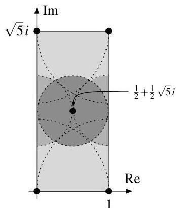

We say in this case that  $P'$  is lying over  $P$ .

Proof.

(a) “ $\Rightarrow$ ” If  $P' \cap R = P$  then  $PR' \cap R = (P' \cap R)R' \cap R \subset P'R' \cap R = P' \cap R = P$ .

"  $\Leftarrow$  " Consider the multiplicatively closed set  $S = R\backslash P$  . As  $PR^{\prime}\cap S = (PR^{\prime}\cap R)\backslash P = \emptyset$  by assumption, Exercise 6.14 (a) implies that there is a prime ideal  $P^{\prime}\triangleleft R^{\prime}$  with  $PR^{\prime}\subset P^{\prime}$  and  $P^{\prime}\cap S = \emptyset$  . But the former inclusion implies  $P\subset PR^{\prime}\cap R\subset P^{\prime}\cap R$  and the latter  $P^{\prime}\cap R = P^{\prime}\cap P\subset P$  , so we get  $P^{\prime}\cap R = P$  as desired.

(b) Let  $a \in PR' \cap R$ . Since  $a \in PR'$  it follows from the Cayley-Hamilton theorem as in the first half of the proof of Lemma 9.15 (b) that there is a monic relation  $a^n + c_{n-1}a^{n-1} + \dots + c_0 = 0$  with  $c_0, \ldots, c_{n-1} \in P$ . As moreover  $a \in R$ , this means that  $a^n = -c_{n-1}a^{n-1} - \dots - c_0 \in P$ , and thus  $a \in P$  as  $P$  is prime.

Example 9.19. Let us consider the three ring extensions  $R'$  of  $R = \mathbb{C}[x]$  from Example 9.4 again.

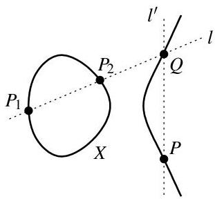
(a)

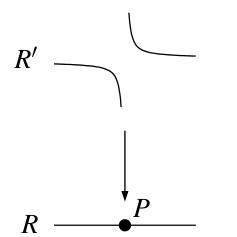
(b)

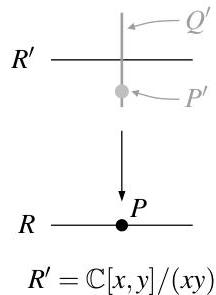
(c)

Recall that the extension (a) is integral by Proposition 9.5. Correspondingly, the picture above on the left shows a prime ideal  $P'$  lying over  $P$ , i.e. such that  $P' \cap R = P$ . In contrast, in case (b) there is no prime ideal lying over  $P$ , which means by Proposition 9.18 (b) that the ring extension  $R \subset R'$  cannot be integral (as we have already seen in Example 9.4). In short, over an algebraically closed field the restriction of the Lying Over property to maximal ideals  $P \triangleleft R$  (i.e. to points of the corresponding variety) means that morphisms of varieties corresponding to integral ring extensions are always surjective.

---

Andreas Gathmann

Of course, a prime ideal  $P' \triangleleft R'$  lying over a given prime ideal  $P \triangleleft R$  is in general not unique — there are e.g. two choices for  $P'$  in example (a) above. The case (c) is different however: as the fiber over  $P$  is one-dimensional, there are not only many choices for prime ideals lying over  $P$ , but also such prime ideals  $P'$  and  $Q'$  with  $Q' \subsetneq P'$  as shown in the picture above. We will prove now that such a situation cannot occur for integral ring extensions, which essentially means that the fibers of the corresponding morphisms have to be finite.

Proposition 9.20 (Incomparability). Let  $R \subset R'$  be an integral ring extension. If  $P'$  and  $Q'$  are distinct prime ideals in  $R'$  with  $P' \cap R = Q' \cap R$  then  $P' \not\subset Q'$  and  $Q' \not\subset P'$ .

Proof. Let  $P' \cap R = Q' \cap R$  and  $P' \subset Q'$ . We will prove that  $Q' \subset P'$  as well, so that  $P' = Q'$ .

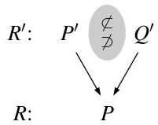

Assume for a contradiction that there is an element  $a \in Q' \backslash P'$ . By Lemma 9.7 (a) we know that  $R'/P'$  is integral over  $R/(P' \cap R)$ , so there is a monic relation

$$
\bar {a} ^ {n} + \overline {{c _ {n - 1}}} \bar {a} ^ {n - 1} + \dots + \overline {{c _ {0}}} = 0 \tag {*}
$$

in  $R' / P'$  with  $c_0, \ldots, c_{n-1} \in R$ . Pick such a relation of minimal degree  $n$ . Since  $a \in Q'$  this relation implies  $\overline{c_0} \in Q' / P'$ , but as  $c_0 \in R$  too we conclude that  $\overline{c_0} \in (Q' \cap R) / (P' \cap R) = (Q' \cap R) / (Q' \cap R) = 0$ . Hence (*) has no constant term. But since  $\overline{a} \neq 0$  in the integral domain  $R' / P'$  we can then divide the relation by  $\overline{a}$  to get a monic relation of smaller degree — in contradiction to the choice of  $n$ .

In geometric terms, the following corollary is essentially a restatement of the finite fiber property: it says that in integral ring extensions only maximal ideals can contract to maximal ideals, i.e. that points are the only subvarieties that can map to a single point in the target space.

Corollary 9.21. Let  $R \subset R'$  be an integral ring extension.

(a) If  $R$  and  $R'$  are integral domains then  $R$  is a field if and only if  $R'$  is a field.
(b) A prime ideal  $P' \triangleleft R'$  is maximal if and only if  $P' \cap R$  is maximal.

Proof.

(a) “ $\Rightarrow$ ” Assume that  $R$  is a field, and let  $P' \triangleleft R'$  be a maximal ideal. Moreover, consider the zero ideal  $0 \triangleleft R'$ , which is prime since  $R'$  is an integral domain. Both ideals contract to a prime ideal in  $R$  by Exercise 2.9, hence to 0 since  $R$  is a field. Incomparability as in Proposition 9.20 then implies that  $P' = 0$ . So 0 is a maximal ideal of  $R'$ , and thus  $R'$  is a field.
$\Leftarrow$  Now assume that  $R$  is not a field. Then there is a non-zero maximal ideal  $P \triangleleft R$ . By Lying Over as in Proposition 9.18 (b) there is now a prime ideal  $P' \triangleleft R'$  with  $P' \cap R = P$ , in particular with  $P' \neq 0$ . So  $R'$  has a non-zero prime ideal, i.e.  $R'$  is not a field.
(b) By Lemmas 2.3 (a) and 9.7 (a) we know that  $R / (P' \cap R) \subset R' / P'$  is an integral extension of integral domains, so the result follows from (a) with Lemma 2.3 (b).

Exercise 9.22. Which of the following extension rings  $R'$  are integral over  $R = \mathbb{C}[x]$ ?

(a)  $R^{\prime} = \mathbb{C}[x,y,z] / (z^{2} - xy)$
(b)  $R^{\prime} = \mathbb{C}[x,y,z] / (z^{2} - xy,y^{3} - x^{2})$
(c)  $R^{\prime} = \mathbb{C}[x,y,z] / (z^{2} - xy,x^{3} - yz)$

Remark 9.23. In practice, one also needs "relative versions" of the Lying Over property: let us assume that we have an (integral) ring extension  $R \subset R'$  and two prime ideals  $P \subset Q$  in  $R$ . If we are now given a prime ideal  $P'$  lying over  $P$  or a prime ideal  $Q'$  lying over  $Q$ , can we fill in the other prime ideal so that  $P' \subset Q'$  and we get a diagram as shown on the right?

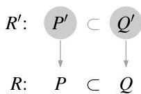

---

9. Integral Ring Extensions

Although these two questions look symmetric, their behavior is in fact rather different. Let us start with the easier case — the so-called Going Up property — in which we prescribe  $P'$  and are looking for the bigger prime ideal  $Q'$ . It turns out that this always works for integral extensions. The proof is quite simple: we can reduce it to the standard Lying Over property by first taking the quotient by  $P'$  since this keeps only the prime ideals containing  $P'$  by Lemma 1.21.

Proposition 9.24 (Going Up). Let  $R \subset R'$  be an integral ring extension. Moreover, let  $P, Q \triangleleft R$  be prime ideals with  $P \subset Q$ , and let  $P' \triangleleft R'$  be prime with  $P' \cap R = P$ .

Then there is a prime ideal  $Q' \triangleleft R'$  with  $P' \subset Q'$  and  $Q' \cap R = Q$ .

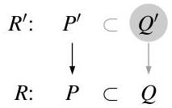

Proof. As  $R'$  is integral over  $R$ , we know that  $R'/P'$  is integral over  $R/(P' \cap R) = R/P$  by Lemma 9.7 (a). Now  $Q/P$  is prime by Corollary 2.4, and hence Lying Over as in Proposition 9.18 (b) implies that there is a prime ideal in  $R'/P'$  contracting to  $Q/P$ , which must be of the form  $Q'/P'$  for a prime ideal  $Q' \triangleleft R'$  with  $P' \subset Q'$  by Lemma 1.21 and Corollary 2.4 again. Now  $(Q'/P') \cap R/P = Q/P$  means that  $Q' \cap R = Q$ , and so the result follows.

Example 9.25. The ring extension (a) below, which is the same as in Example 9.4 (a), shows a typical case of the Going Up property (note that the correspondence between subvarieties and ideals reverses inclusions, so that the bigger prime ideal  $Q$  resp.  $Q'$  corresponds to the smaller subvariety).

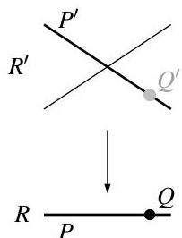
(a)

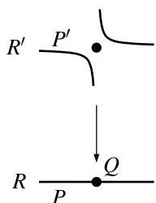
(b)

In contrast, in the extension (b) the ring

$$
R ^ {\prime} = \mathbb {C} [ x, y ] / I \quad \text {w i t h} \quad I = (x y - 1) \cap (x, y)
$$

is the coordinate ring of the variety as in Example 9.4 (b) together with the origin. In this case, it is easily seen geometrically that the extension  $R \subset R'$  with  $R = \mathbb{C}[x]$  satisfies the Lying Over and Incomparability properties as explained in Example 9.19, however not the Going Up property: as in the picture above, the maximal ideal  $(x,y)$  of the origin is the only prime ideal in  $R'$  lying over  $Q$ , but it does not contain the given prime ideal  $P'$  lying over  $P$ . We see from this example that we can regard the Going Up property as a statement about the "continuity of fibers": if we have a family of points in the base space specializing to a limit point (corresponding to  $P \subset Q$  in  $R$ ) and a corresponding family of points in the fibers (corresponding to  $P'$ ), then these points in the fiber should "converge" to a limit point  $Q'$  over  $Q$ . So by Proposition 9.24 the extension (b) above is not integral (which of course could also be checked directly).

Example 9.26. Let us now consider the opposite "Going Down" direction in Remark 9.23, i.e. the question whether we can always construct the smaller prime ideal  $P'$  from  $Q'$  (for given  $P \subset Q$  of course). Picture (a) below shows this for the extension of Example 9.4 (a).

This time the idea to attack this question is to reduce it to Lying Over by localizing at  $Q'$  instead of taking quotients, since this keeps exactly the prime ideals contained in  $Q'$  by Example 6.8. Surprisingly however, in contrast to Proposition 9.24 the Going Down property does not hold for general integral extensions. The pictures (b) and (c) below show typical examples of this (in both cases it can be checked that the extension is integral):

---

Andreas Gathmann

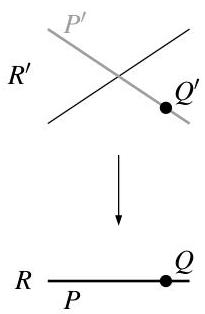
(a)

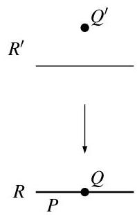
(b)

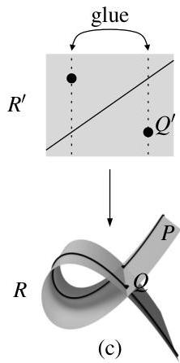

- In case (b) the space corresponding to  $R'$  has two components, of which one is only a single point lying over  $Q$ . The consequence is that Going Down obviously fails if we choose  $Q'$  to be this single point. In order to avoid such a situation we can require  $R'$  to be an integral domain, i.e. to correspond to an irreducible space.
- The case (c) is more subtle: the space  $R' = \mathbb{C}[x, y]$  corresponds to a (complex) plane, and geometrically  $R$  is obtained from this by identifying the two dashed lines in the picture above. In fact, this is just a 2-dimensional version of the situation of Example 9.11 (b) and Exercise 9.12. Although both spaces are irreducible in this case, the singular shape of the base space corresponding to  $R$  makes the Going Down property fail for the choices of  $P$ ,  $Q$ , and  $Q'$  shown above: note that the diagonal line and the two marked points in the top space are exactly the inverse image of the curve  $P$  in the base. As one might expect from Example 9.11 (b), we can avoid this situation by requiring  $R$  to be normal.

The resulting proposition is then the following.

Proposition 9.27 (Going Down). Let  $R \subset R'$  be an integral ring extension. Assume that  $R$  is normal and  $R'$  an integral domain. Now let  $P \subset Q$  be prime ideals in  $R$ , and let  $Q' \triangleleft R'$  be a prime ideal with  $Q' \cap R = Q$ .

Then there is a prime ideal  $P' \triangleleft R'$  with  $P' \subset Q'$  and  $P' \cap R = P$ .

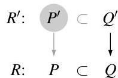

Proof. The natural map  $R' \to R_{Q'}'$  is injective since  $R'$  is an integral domain. So we can compose it with the given extension to obtain a ring extension  $R \subset R_{Q'}'$  as in the picture below on the right. We will show that there is a prime ideal in  $R_{Q'}'$  lying over  $P$ ; by Example 6.8 it must be of the form  $P_{Q'}'$  for some prime ideal  $P' \subset Q'$ . Since  $P_{Q'}'$  contracts to  $P'$  in  $R'$ , we then have  $P' \cap R = P$  as required.

To prove Lying Over for  $P$  in the extension  $R \subset R_{Q'}'$  it suffices by Proposition 9.18 (a) to show that  $PR_{Q'}' \cap R \subset P$ . So let  $a \in PR_{Q'}' \cap R$ , in particular  $a = \frac{p}{s}$  for some  $p \in PR'$  and  $s \in R' \setminus Q'$ . We may assume without loss of generality that  $a \neq 0$ . As  $R$  is normal we can apply Lemma 9.15 (b) to see that the minimal polynomial of  $p$  over  $K = \operatorname{Quot} R$  is of the form

$$
f = x ^ {n} + c _ {n - 1} x ^ {n - 1} + \dots + c _ {0}
$$

for some  $c_{0},\ldots ,c_{n - 1}\in P$  . Note that as a minimal polynomial  $f$  is irreducible over  $K$  [G3, Lemma 2.6]. But we also know that  $a\in R\subset K$  , and hence the polynomial

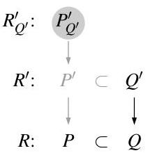

$$
\frac {1}{a ^ {n}} f (a x) = x ^ {n} + \frac {c _ {n - 1}}{a} x ^ {n - 1} + \dots + \frac {c _ {0}}{a ^ {n}} =: x ^ {n} + c _ {n - 1} ^ {\prime} x ^ {n - 1} + \dots + c _ {0} ^ {\prime}
$$

obtained from  $f$  by a coordinate transformation is irreducible over  $K$  as well. As it is obviously monic and satisfies  $\frac{1}{a^n} f(as) = \frac{1}{a^n} f(p) = 0$ , it must be the minimal polynomial of  $s$  [G3, Lemma 2.6], and so its coefficients  $c_0', \ldots, c_{n-1}'$  lie in  $R$  by Proposition 9.15 (a).

---

9. Integral Ring Extensions

Now assume for a contradiction that $a \notin P$. The equations $c_{n - i}'a^i = c_{n - i} \in P$ of elements of $R$ then imply $c_{n - i}' \in P$ for all $i = 1, \ldots, n$ since $P$ is prime. So as $s \in R'$ we see that

$$
s ^ {n} = - c _ {n - 1} ^ {\prime} s ^ {n - 1} - \dots - c _ {0} ^ {\prime} \quad \in P R ^ {\prime} \subset Q R ^ {\prime} \subset Q ^ {\prime} R ^ {\prime} = Q ^ {\prime},
$$

which means that $s \in Q'$ since $Q'$ is prime. This contradicts $s \in R' \setminus Q'$, and thus $a \in P$ as required.

Exercise 9.28. Let $R \subset R'$ be an arbitrary ring extension. Show:

(a) The extension $R \subset R'$ has the Going Up property if and only if for all prime ideals $P' \triangleleft R'$ and $P = P' \cap R$ the natural map $\operatorname{Spec}(R'/P') \to \operatorname{Spec}(R/P)$ is surjective.

(b) The extension $R \subset R'$ has the Going Down property if and only if for all prime ideals $P' \triangleleft R'$ and $P = P' \cap R$ the natural map $\operatorname{Spec}(R_{P'}) \to \operatorname{Spec}(R_P)$ is surjective.